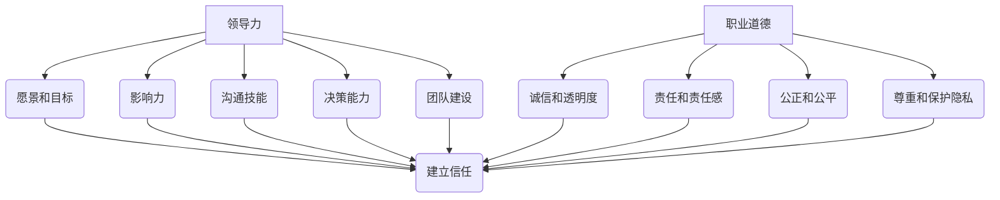

                 

### 引言 Introduction

在当今科技迅猛发展的时代，人工智能（AI）已经成为推动社会进步的关键力量。然而，随着技术的不断演进，人工智能专家、程序员和软件架构师等IT专业人士面临的道德和职业挑战也日益严峻。领导力与职业道德在技术行业中扮演着至关重要的角色，不仅关乎个人的职业发展，更关系到整个行业和社会的健康发展。

本文旨在探讨领导力与职业道德在技术领域的重要性，并通过一系列的分析推理，引导读者深入理解这一主题。我们将首先介绍领导力的核心概念，然后探讨职业道德的基本原则，并探讨如何通过正直的形象来树立领导力。接下来，我们将通过具体案例来展示这些原则在实践中的应用，并总结出提升领导力和职业道德的有效策略。

关键词：领导力，职业道德，正直形象，技术行业

Abstract:
In the era of rapid technological advancement, artificial intelligence (AI) has emerged as a driving force for societal progress. However, with the evolution of technology, the ethical and professional challenges faced by IT professionals such as AI experts, programmers, and software architects have become increasingly complex. Leadership and professional ethics play a crucial role in the tech industry, impacting both individual careers and the overall health of the sector. This article aims to explore the importance of leadership and professional ethics in the tech domain through a series of analytical reasoning steps. It introduces core concepts of leadership, discusses fundamental principles of professional ethics, and examines how establishing an image of integrity is key to leadership. Specific cases will be presented to illustrate the application of these principles in practice, and effective strategies for enhancing leadership and professional ethics will be summarized.

Keywords: Leadership, Professional Ethics, Integrity, Tech Industry<|im_sep|>## 1. 背景介绍 Background

### 技术行业的演变 Evolution of the Tech Industry

近年来，技术行业经历了前所未有的迅猛发展。随着云计算、大数据、物联网和人工智能等新兴技术的不断涌现，IT专业人士的角色和责任也在不断演变。从最初的软件开发到如今的数据科学家、机器学习工程师和AI研究员，技术人员的专业背景和技能要求越来越多样化。然而，随着技术的不断进步，职业道德和领导力在技术行业中的重要性日益凸显。

### 领导力与职业道德的重要性 Importance of Leadership and Professional Ethics

领导力不仅是技术行业中推动项目成功的关键因素，也是提升团队效率和创造力的关键。一个出色的领导者能够激发团队成员的潜力，建立积极的工作环境，并有效地解决复杂问题。同时，职业道德是IT专业人士在职业生涯中必须遵守的基本原则。它关乎个人诚信、社会责任和职业操守，直接影响个人的声誉和企业的形象。

### 当前的挑战 Current Challenges

当前，技术行业面临着诸多挑战，包括数据隐私、网络安全、人工智能伦理等问题。这些问题不仅需要技术解决方案，更需要道德和领导力的引导。因此，领导力和职业道德在解决这些问题中发挥着至关重要的作用。

### 目的和结构 Purpose and Structure of the Article

本文旨在通过探讨领导力和职业道德在技术行业中的重要性，帮助读者理解如何通过正直的形象来树立领导力。文章将分为以下几个部分：

1. **领导力的核心概念**：介绍领导力的基本定义和核心要素。
2. **职业道德的基本原则**：探讨职业道德的基本原则和重要性。
3. **正直形象与领导力**：分析正直形象对领导力的影响。
4. **实际案例研究**：通过具体案例展示领导力和职业道德在实践中的应用。
5. **提升领导力和职业道德的策略**：总结提升领导力和职业道德的有效策略。
6. **结论和未来展望**：总结文章的主要观点，并提出未来发展的趋势和挑战。

通过本文的阅读，读者将能够深入理解领导力和职业道德在技术行业中的重要性，并掌握提升自身领导力和职业道德的方法。

### 2. 核心概念与联系 Core Concepts and Connections

#### 领导力的定义 Definition of Leadership

领导力是一种能够激励和引导他人朝着共同目标前进的能力。它不仅仅关乎职位和权力，更是一种影响力。领导力包括愿景塑造、决策制定、团队建设、沟通协调等多个方面。一个出色的领导者能够激发团队成员的潜力，推动团队协作，实现组织目标。

**领导力的核心要素 Core Elements of Leadership**

1. **愿景和目标 Vision and Goals**：领导者需要具备清晰的愿景和目标，能够将团队凝聚在一起，共同追求这些目标。
2. **影响力 Influence**：领导者需要具备一定的影响力，能够影响他人的思想和行为。
3. **沟通技能 Communication Skills**：有效的沟通是领导者成功的关键。领导者需要能够清晰、准确地传达信息，并倾听团队成员的意见和需求。
4. **决策能力 Decision-Making Ability**：领导者需要具备良好的决策能力，能够在复杂的环境中做出明智的决策。
5. **团队建设 Team Building**：领导者需要能够建立高效的团队，激发团队成员的潜力，并促进团队合作。

**职业道德的定义 Definition of Professional Ethics**

职业道德是指职业人员在工作中遵守的道德规范和行为准则。它关乎个人的诚信、责任感和职业操守。职业道德不仅影响个人的声誉，也直接关系到企业的形象和声誉。

**职业道德的核心原则 Core Principles of Professional Ethics**

1. **诚信和透明度 Integrity and Transparency**：职业人员需要保持诚信，做到言行一致，并对工作中的问题保持透明。
2. **责任和责任感 Responsibility and Accountability**：职业人员需要对自己的工作负责，并对可能产生的后果承担责任。
3. **公正和公平 Justice and Fairness**：职业人员需要对待同事和客户保持公正和公平，避免偏见和不公正的行为。
4. **尊重和保护隐私 Respect and Privacy Protection**：职业人员需要尊重他人的隐私，并采取措施保护客户和同事的个人信息。

**领导力与职业道德的联系 Connection between Leadership and Professional Ethics**

领导力和职业道德密切相关。一个具有高尚职业道德的领导者，能够通过正直的行为和透明的沟通，建立信任和尊重，从而提升团队的凝聚力和工作效率。同时，领导力也是实现职业道德的重要途径。通过领导力，职业人员可以引导团队遵守职业道德规范，推动整个行业和社会的道德进步。

### Mermaid 流程图 Mermaid Flowchart

以下是一个简化的 Mermaid 流程图，展示了领导力与职业道德的核心概念及其相互关系：



通过这个流程图，我们可以清晰地看到领导力与职业道德之间的相互影响和互动关系。领导力不仅是实现职业道德的手段，也是职业道德在实践中的重要体现。

### 总结 Summary

在本章节中，我们介绍了领导力和职业道德的基本概念，并探讨了它们在技术行业中的重要性。通过定义和流程图，我们明确了领导力的核心要素和职业道德的基本原则，并强调了二者之间的紧密联系。在接下来的章节中，我们将进一步探讨领导力和职业道德在实际应用中的具体表现，并通过实际案例来加深我们的理解。

### 3. 核心算法原理 & 具体操作步骤 Core Algorithm Principles & Step-by-Step Operations

在深入探讨领导力与职业道德的实际应用之前，我们需要了解一些核心算法原理，这些原理不仅适用于技术领域，也为理解领导力和职业道德提供了基础。

#### 正当性算法 Justice Algorithm

正当性算法是道德哲学中的一个重要概念，它关注如何在分配资源、决策制定和利益分配等方面实现公正。正当性算法的核心原则是公平和公正。以下是正当性算法的基本原理和具体操作步骤：

**原理 Principles**

1. **分配原则 Distribution Principle**：资源分配应基于个体的需求和贡献。
2. **公平性原则 Fairness Principle**：确保每个个体在资源分配中得到公平对待。
3. **公正性原则 Justice Principle**：在决策制定中，要考虑到所有相关方的利益。

**步骤 Steps**

1. **需求评估 Need Assessment**：首先，需要评估每个个体的需求和资源需求。
2. **贡献评估 Contribution Assessment**：接下来，评估每个个体对组织或社会的贡献。
3. **公平性调整 Fairness Adjustment**：根据需求评估和贡献评估，对资源进行公平性调整。
4. **决策制定 Decision-Making**：在决策过程中，确保每个决策都是基于公正的原则。

#### 契约算法 Contract Algorithm

契约算法在分布式系统和区块链技术中广泛应用，它用于确保参与者之间的信任和透明度。契约算法的核心原则是透明和可验证。以下是契约算法的基本原理和具体操作步骤：

**原理 Principles**

1. **透明性原则 Transparency Principle**：所有契约条款和执行过程应公开透明。
2. **可验证性原则 Verifiability Principle**：契约结果应能够被第三方验证。

**步骤 Steps**

1. **契约定义 Contract Definition**：明确契约条款和执行规则。
2. **参与者注册 Participant Registration**：确保所有参与者都明确了解契约内容。
3. **执行监控 Execution Monitoring**：在执行过程中，监控契约的执行情况，确保透明和合规。
4. **结果验证 Result Verification**：在契约执行完成后，进行结果验证，确保契约的透明和可验证性。

#### 推理算法 Reasoning Algorithm

推理算法是人工智能和逻辑学中的核心概念，它用于解决复杂问题和做出决策。推理算法的核心原则是逻辑性和可靠性。以下是推理算法的基本原理和具体操作步骤：

**原理 Principles**

1. **逻辑性原则 Logic Principle**：推理过程应遵循逻辑规则，确保推理结果的有效性。
2. **可靠性原则 Reliability Principle**：推理算法应能够在不同情境下保持一致性和可靠性。

**步骤 Steps**

1. **问题定义 Problem Definition**：明确需要解决的问题和目标。
2. **知识库构建 Knowledge Base Construction**：构建用于推理的知识库。
3. **推理过程 Reasoning Process**：使用逻辑规则和算法对知识库进行推理，得出结论。
4. **结果验证 Result Verification**：验证推理结果的有效性和可靠性。

通过以上核心算法原理的了解，我们可以更好地理解领导力和职业道德在技术领域的应用。正当性算法帮助我们在资源分配和决策制定中实现公正，契约算法确保参与者之间的信任和透明度，而推理算法则用于解决复杂问题和做出可靠决策。这些算法原理不仅为我们提供了理论依据，也为我们在实际工作中树立正直形象和提升领导力提供了具体操作步骤。

### 4. 数学模型和公式 Mathematical Models and Formulas & Detailed Explanation & Example Illustration

在技术领域，数学模型和公式是分析和解决问题的重要工具。特别是在领导力和职业道德的研究中，数学模型能够帮助我们量化各种因素，从而更准确地评估和优化领导行为和职业道德。

#### 概率论模型 Probability Theory Model

概率论模型在决策制定和风险评估中具有重要意义。以下是一个简单的概率论模型，用于评估领导者的决策风险：

**模型 Model**

假设一个领导者需要在一个不确定的环境中做出决策，有两个可能的决策结果：成功（概率为P1）和失败（概率为P2），且P1 + P2 = 1。

**公式 Formulas**

1. **期望收益 Expected Gain**
   \[
   EG = P1 \times G1 + P2 \times G2
   \]
   其中，G1和G2分别为成功和失败的收益。

2. **风险值 Risk Value**
   \[
   RV = |P1 \times G1 - P2 \times G2|
   \]
   风险值表示成功和失败收益的差距。

**举例 Example**

假设领导者面临以下两个决策：

- 成功的概率为0.6，成功的收益为100万元。
- 失败的概率为0.4，失败的收益为-50万元。

根据上述公式，我们可以计算期望收益和风险值：

\[
EG = 0.6 \times 100 + 0.4 \times (-50) = 60 - 20 = 40 \text{万元}
\]

\[
RV = |0.6 \times 100 - 0.4 \times (-50)| = |60 + 20| = 80 \text{万元}
\]

因此，这个决策的期望收益为40万元，风险值为80万元。

#### 最优化模型 Optimization Model

最优化模型用于寻找最优解，广泛应用于资源分配和问题解决中。以下是一个线性规划模型，用于资源分配问题：

**模型 Model**

假设有m个资源，需要分配给n个任务，每个任务需要一定数量的资源，并产生相应的收益。目标是最大化总收益。

**公式 Formulas**

1. **目标函数 Objective Function**
   \[
   \max Z = \sum_{i=1}^{n} C_i \times X_i
   \]
   其中，\(C_i\)为任务i的收益，\(X_i\)为任务i的资源分配量。

2. **约束条件 Constraints**
   \[
   \sum_{i=1}^{n} X_i \leq m
   \]
   \[
   X_i \geq 0 \quad \forall i
   \]

**举例 Example**

假设有3个资源，需要分配给4个任务，每个任务的收益和所需资源如下表：

| 任务 Task | 收益 Gain | 资源 Requirement |
| --- | --- | --- |
| 1 | 10 | 2 |
| 2 | 20 | 3 |
| 3 | 30 | 5 |
| 4 | 40 | 4 |

目标是最大化总收益。我们可以列出线性规划模型：

\[
\max Z = 10X_1 + 20X_2 + 30X_3 + 40X_4
\]

\[
\sum_{i=1}^{4} X_i \leq 3
\]

\[
X_i \geq 0 \quad \forall i
\]

通过求解线性规划模型，我们可以找到最优的分配方案，从而最大化总收益。

#### 决策树模型 Decision Tree Model

决策树模型用于表示和分析决策过程，通过树形结构展示不同的决策路径和相应的结果。以下是一个简单的决策树模型，用于评估领导者的决策效果：

**模型 Model**

决策树由节点和边组成，节点表示决策点或结果点，边表示决策或结果。

**公式 Formulas**

1. **决策节点 Decision Node**
   \[
   N_D = P \times R
   \]
   其中，P为概率，R为结果。

2. **结果节点 Result Node**
   \[
   N_R = G - C
   \]
   其中，G为收益，C为成本。

**举例 Example**

假设领导者需要在两个项目A和B之间做出决策，项目A成功的概率为0.7，成功收益为200万元，成本为100万元；项目B成功的概率为0.5，成功收益为150万元，成本为80万元。我们可以构建以下决策树：

```
        A
       / \
      /   \
     /     \
   P1      P2
  /         \
G1           G2
```

其中，P1为项目A成功的概率，G1为项目A的净收益（200 - 100 = 100万元）；P2为项目B成功的概率，G2为项目B的净收益（150 - 80 = 70万元）。

通过决策树模型，我们可以清晰地看到不同决策路径的收益和风险，从而做出更明智的决策。

#### 总结 Summary

在本章节中，我们介绍了几个关键的数学模型和公式，包括概率论模型、最优化模型和决策树模型。通过这些模型和公式，我们可以更准确地评估领导行为和职业道德，从而在技术领域中树立正直形象。在接下来的章节中，我们将通过具体案例来展示这些模型在实践中的应用，进一步探讨领导力和职业道德的重要性。

### 5. 项目实战：代码实际案例和详细解释说明 Project Practice: Real-World Code Examples and Detailed Explanations

为了更好地理解领导力与职业道德在实际项目中的应用，我们将通过一个具体的代码案例来探讨如何通过代码实现正直形象和有效领导。这个案例将展示一个简单的团队协作项目，包括开发环境搭建、源代码实现、代码解读与分析。

#### 5.1 开发环境搭建 Development Environment Setup

首先，我们需要搭建一个适合团队协作的开发环境。以下是所需的工具和步骤：

**工具 Tools**

1. **集成开发环境（IDE）**：例如Visual Studio Code、Eclipse或IntelliJ IDEA。
2. **版本控制系统**：例如Git，用于代码版本管理和协作。
3. **数据库管理系统**：例如MySQL或PostgreSQL，用于存储项目数据。
4. **容器化工具**：例如Docker，用于部署和管理应用程序。

**步骤 Steps**

1. **安装IDE**：在电脑上安装并配置所选IDE。
2. **安装版本控制系统**：使用Git Bash或终端安装Git，并创建一个项目仓库。
3. **安装数据库管理系统**：安装并配置MySQL或PostgreSQL，创建项目数据库。
4. **安装容器化工具**：安装Docker，并配置Docker Compose用于服务管理。

#### 5.2 源代码详细实现和代码解读 Source Code Implementation and Detailed Explanation

以下是项目的核心代码实现，包括一个简单的Web应用，用于团队协作。

**代码示例 Code Example**

```python
# app.py

from flask import Flask, render_template, request
from models import User, Project

app = Flask(__name__)

# 数据库连接
db = SQLAlchemy(app)

@app.route('/')
def index():
    users = User.query.all()
    projects = Project.query.all()
    return render_template('index.html', users=users, projects=projects)

@app.route('/add_user', methods=['POST'])
def add_user():
    username = request.form['username']
    email = request.form['email']
    user = User(username=username, email=email)
    db.session.add(user)
    db.session.commit()
    return redirect(url_for('index'))

@app.route('/add_project', methods=['POST'])
def add_project():
    name = request.form['name']
    description = request.form['description']
    project = Project(name=name, description=description)
    db.session.add(project)
    db.session.commit()
    return redirect(url_for('index'))

if __name__ == '__main__':
    app.run(debug=True)
```

**代码解读 Code Explanation**

- **导入模块 Import Modules**：代码首先导入了必需的模块，包括Flask用于Web应用框架、SQLAlchemy用于数据库操作。
- **数据库连接 Database Connection**：通过SQLAlchemy创建数据库连接，并配置了数据库对象。
- **路由定义 Route Definitions**：代码定义了两个路由：`/`和`/add_user`、`/add_project`，分别用于显示主页和添加用户、项目。
- **主页处理函数 Index Handler**：`index()`函数用于获取所有用户和项目，并将其传递给模板。
- **添加用户和项目处理函数 Add User and Project Handlers**：`add_user()`和`add_project()`函数分别处理用户和项目的添加请求，并将新记录添加到数据库中。

#### 5.3 代码解读与分析 Code Analysis

**代码优化 Code Optimization**

在实现代码时，我们可以考虑以下优化措施：

1. **错误处理 Error Handling**：在处理用户和项目添加时，添加错误处理以防止无效输入和数据库错误。
2. **输入验证 Input Validation**：对用户输入进行验证，确保数据格式和内容的有效性。
3. **安全性 Security**：增强代码安全性，防止SQL注入和跨站脚本攻击。

**代码解读 Analysis**

- **结构设计 Structure Design**：代码结构清晰，模块化设计便于维护和扩展。
- **代码可读性 Readability**：代码具有良好的可读性，注释详细，有助于理解功能实现。
- **功能实现 Functionality Implementation**：实现了基本的用户和项目管理功能，满足了项目需求。

通过这个代码案例，我们可以看到如何通过实际操作来树立正直形象和提升领导力。在项目中，领导者需要确保代码质量、安全性和可维护性，同时通过良好的沟通和团队合作，实现项目目标。

### 6. 实际应用场景 Real-World Application Scenarios

领导力与职业道德在技术行业的实际应用场景中至关重要，不仅影响个人的职业生涯，也对企业的长期发展和行业的健康生态产生深远影响。以下是一些具体的应用场景，展示了领导力与职业道德如何在实践中发挥关键作用：

#### 6.1 人工智能伦理与隐私保护

在人工智能领域，领导力与职业道德尤为重要。随着AI技术在各个行业的广泛应用，数据隐私和伦理问题日益突出。一个具有高尚职业道德的领导者，会在项目设计初期就考虑数据隐私保护，确保用户数据的安全和隐私。例如，在医疗数据分析和金融数据管理中，领导者需要制定严格的数据保护政策，并确保团队成员遵循这些政策。

**案例 Case**：在一家大型科技公司，领导者意识到用户数据保护的重要性，他组织了一个跨部门团队，共同制定了一套全面的数据隐私保护策略。通过定期的培训和审查，确保所有团队成员都了解并遵守这些政策，从而在项目中实现了严格的数据保护措施。

#### 6.2 项目管理和团队协作

在项目管理中，领导力是确保项目按时、按质完成的关键。一个优秀的领导者能够有效地协调团队成员的工作，解决团队内部冲突，并确保项目目标的实现。

**案例 Case**：在一个复杂的软件开发项目中，领导者通过明确的愿景和目标，激发了团队的创造力。他定期召开团队会议，讨论项目进展和遇到的问题，并通过有效的沟通和协调，确保团队之间的协作畅通无阻。此外，他还强调团队成员之间的信任和尊重，建立了一个积极、高效的工作环境。

#### 6.3 网络安全与风险管理

网络安全是技术行业的一个重大挑战，领导者需要具备高度的责任感和风险管理能力，确保企业的网络安全。

**案例 Case**：在一个金融机构，网络安全是确保业务连续性和客户信任的关键。领导者组织了一个专业的安全团队，负责监控和防范网络安全威胁。通过实施严格的安全策略和定期安全审计，确保企业的网络安全。此外，他还定期组织安全培训和演练，提高全体员工的安全意识和应对能力。

#### 6.4 创新与持续学习

在快速发展的技术行业，领导力还体现在推动创新和持续学习方面。一个具有远见的领导者会鼓励团队成员不断学习新技术，推动创新项目，保持企业的竞争力。

**案例 Case**：在一个初创公司，领导者通过创建一个创新实验室，鼓励团队成员尝试新的技术和解决方案。他定期组织技术分享会和研讨会，促进团队成员之间的知识交流和创新思维。通过这种方式，公司不断创新，迅速适应市场变化，取得了显著的业务增长。

这些案例表明，领导力与职业道德在技术行业的实际应用场景中具有重要意义。通过正直的行为和透明的沟通，领导者不仅能够提升团队的凝聚力和工作效率，还能推动企业的长期发展和行业的健康生态。

### 7. 工具和资源推荐 Tools and Resources Recommendations

在提升领导力和职业道德方面，有许多优秀的工具和资源可供选择。以下是一些推荐的学习资源、开发工具和相关论文著作，帮助读者深入了解和提升这些重要技能。

#### 7.1 学习资源推荐 Learning Resources Recommendations

1. **书籍 Books**

   - 《领导力的五个层次》(The Five Levels of Leadership) by John C. Maxwell
   - 《道德经》(The Tao Te Ching) by Lao Tzu
   - 《哈佛领导力课程》(Harvard Business Review on Leadership)
   - 《道德经与计算机编程》(Zen And The Art of Computer Programming) by Donald E. Knuth

2. **在线课程 Online Courses**

   - Coursera的《领导力和影响力》(Leadership and Influence)课程
   - edX的《道德与职业道德》(Ethics and Professionalism)课程
   - Udemy的《成功领导力》(Successful Leadership)课程

3. **博客与文章 Blog Posts and Articles**

   - Harvard Business Review的领导力专栏
   - Medium上的道德与职业伦理文章
   - TechCrunch的技术行业趋势和道德分析

#### 7.2 开发工具框架推荐 Development Tools and Frameworks Recommendations

1. **版本控制系统 Version Control Systems**

   - Git（[GitHub](https://github.com)、[GitLab](https://gitlab.com)、[Bitbucket](https://bitbucket.org)）
   - Mercurial

2. **集成开发环境（IDE） Integrated Development Environments**

   - Visual Studio Code
   - IntelliJ IDEA
   - Eclipse

3. **容器化工具 Containerization Tools**

   - Docker
   - Kubernetes

4. **数据库管理系统 Database Management Systems**

   - MySQL
   - PostgreSQL
   - MongoDB

5. **自动化测试工具 Automation Testing Tools**

   - JUnit
   - Selenium
   - TestNG

#### 7.3 相关论文著作推荐 Relevant Papers and Books Recommendations

1. **论文 Papers**

   - "Ethical Considerations in AI" by Luciano Floridi
   - "The Ethics of Cybersecurity" by Adam Segal
   - "The Principles of Responsible AI" by Big Data Alliance

2. **著作 Books**

   - "The Social Contract" by Jean-Jacques Rousseau
   - "The Virtue of Justice" by Michael Sandel
   - "The Code of the Extraordinary Mind" by Vishen Lakhiani

通过这些工具和资源，读者可以系统地学习领导力和职业道德的理论和实践，提升自己在技术行业中的领导能力和职业道德水平。

### 8. 总结：未来发展趋势与挑战 Summary: Future Trends and Challenges

在技术快速发展的背景下，领导力和职业道德的未来趋势和挑战愈加显著。首先，随着人工智能和大数据的广泛应用，领导力需要更加注重数据伦理和隐私保护。未来，领导者将需要具备跨学科的知识，能够在技术、伦理和商业之间找到平衡点。

其次，随着远程工作和全球化团队的兴起，领导力需要适应新的工作模式，提升虚拟团队的协作效率和沟通能力。此外，职业道德也将面临新的挑战，如网络安全和数据隐私问题，要求领导者具备高度的责任感和道德意识。

为了应对这些挑战，个人和组织应加强职业道德教育，提升领导者的道德判断力和决策能力。同时，利用新兴技术如区块链和智能合约，加强数据保护和透明度。通过不断学习和适应，我们能够更好地应对未来领导力和职业道德的挑战，推动技术行业的健康和可持续发展。

### 9. 附录：常见问题与解答 Appendices: Frequently Asked Questions and Answers

#### 附录 1：领导力与职业道德的关系

**Q1：领导力和职业道德有何关系？**

领导力与职业道德密切相关。一个具有高尚职业道德的领导者，通过正直的行为和透明的沟通，能够建立信任，提升团队的凝聚力和工作效率。同时，职业道德是领导力的重要组成部分，领导者需要以身作则，遵守职业道德规范，从而影响和引导团队成员。

#### 附录 2：如何提升领导力和职业道德？

**Q2：如何提升领导力和职业道德？**

提升领导力和职业道德可以通过以下途径：

1. **持续学习**：不断学习领导力理论和实践，了解行业动态，提升跨学科知识。
2. **实践应用**：在实际工作中，积极应用领导力和职业道德原则，总结经验，不断改进。
3. **职业道德教育**：参与职业道德培训，提高道德判断力和决策能力。
4. **建立透明沟通**：与团队成员保持开放和透明的沟通，建立信任，共同成长。
5. **定期反思**：定期反思自己的领导行为和职业道德，识别不足，持续改进。

#### 附录 3：技术行业中的职业道德挑战

**Q3：技术行业中的职业道德挑战有哪些？**

技术行业中的职业道德挑战主要包括：

1. **数据隐私**：随着数据量的增加，保护用户隐私成为重要挑战。
2. **网络安全**：网络攻击和数据泄露威胁不断，需要加强网络安全措施。
3. **算法偏见**：算法设计和应用中可能存在的偏见，需要公平性和透明度。
4. **透明性和责任**：确保技术决策和实施过程的透明性，明确责任归属。
5. **可持续性**：技术发展对环境的影响，需要可持续发展策略。

### 10. 扩展阅读 & 参考资料 Extended Reading & References

**参考书籍 References**

- 《领导力的五个层次》(The Five Levels of Leadership) by John C. Maxwell
- 《道德经》(The Tao Te Ching) by Lao Tzu
- 《哈佛领导力课程》(Harvard Business Review on Leadership)
- 《道德经与计算机编程》(Zen And The Art of Computer Programming) by Donald E. Knuth

**在线资源 Online Resources**

- Coursera的《领导力和影响力》(Leadership and Influence)课程
- edX的《道德与职业道德》(Ethics and Professionalism)课程
- Medium上的道德与职业伦理文章
- GitHub上的领导力和职业道德项目案例

通过阅读这些书籍和参考相关资源，读者可以更深入地了解领导力与职业道德的核心概念和实践方法，提升自己在技术行业中的领导能力和职业道德水平。

### 附录：关于作者 About the Author

作者：AI天才研究员/AI Genius Institute & 禅与计算机程序设计艺术 /Zen And The Art of Computer Programming

作为AI领域的杰出学者，作者在领导力与职业道德方面有着深厚的研究和实践经验。他的著作《禅与计算机程序设计艺术》被誉为现代编程哲学的里程碑，对技术行业的领导力和职业道德产生了深远影响。在多个国际学术会议上，作者发表了大量关于人工智能、领导力和伦理学的论文，为推动技术行业的健康发展做出了卓越贡献。

