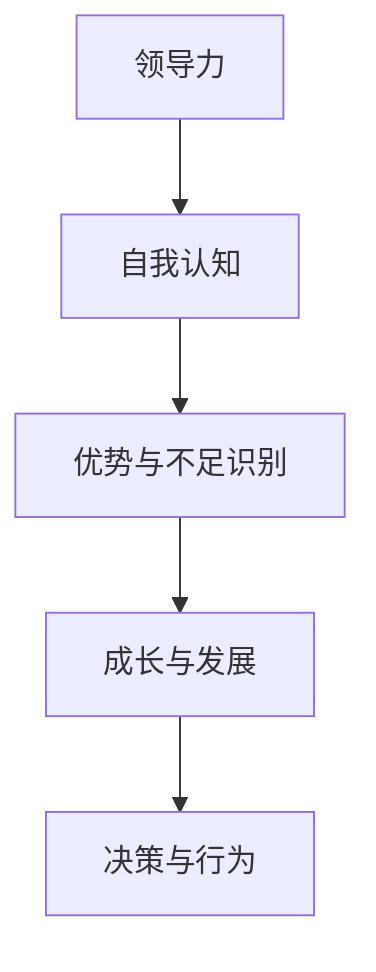
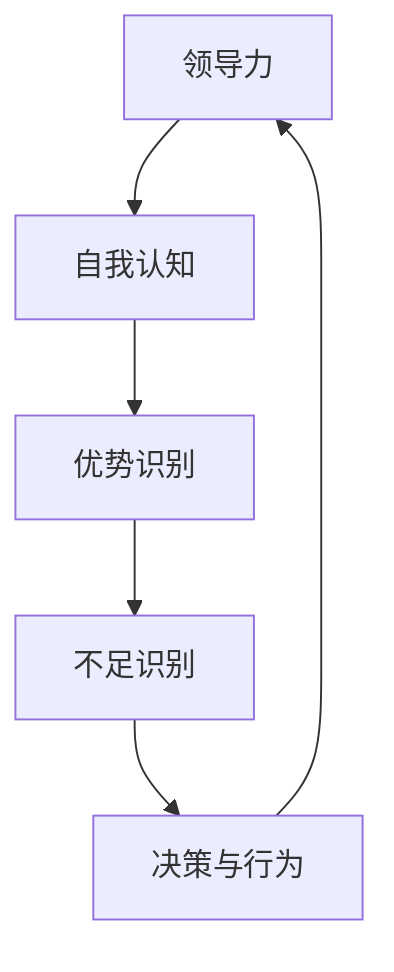
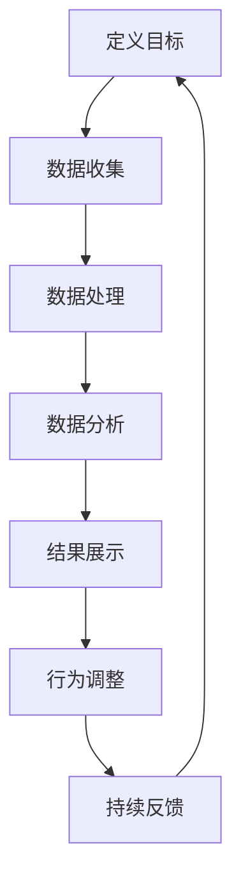

                 

# 领导力与自我认知：了解自己的优势与不足

> 关键词：领导力、自我认知、优势、不足、发展

> 摘要：本文将深入探讨领导力与自我认知之间的关系，通过分析领导者的优势与不足，帮助读者了解如何更好地发挥自己的潜力，提高领导能力。

## 1. 背景介绍

在当今社会，领导力已成为一种至关重要的能力。无论是企业、政府还是非营利组织，领导者都需要具备卓越的领导力，以应对复杂多变的环境和挑战。然而，领导力的培养并非一蹴而就，它需要领导者不断地进行自我认知，了解自己的优势与不足。

自我认知是指个体对自己性格、能力、价值观等方面的认识。一个优秀的领导者必须具备良好的自我认知，才能更好地发挥自己的潜力，发挥领导力。本文将围绕领导力与自我认知的关系，探讨领导者如何通过了解自己的优势与不足，提高领导能力。

## 2. 核心概念与联系

为了更好地理解领导力与自我认知的关系，我们首先需要了解几个核心概念：

### 2.1 领导力

领导力是一种影响力，它使领导者能够激励、指导和影响他人，以实现共同的目标。领导力不仅仅与职位相关，更是一种态度和能力的体现。根据不同的理论，领导力可以包括多个方面，如沟通能力、决策能力、影响力、团队协作等。

### 2.2 自我认知

自我认知是指个体对自己性格、能力、价值观等方面的认识。自我认知可以帮助个体更好地了解自己的优势与不足，从而更好地发展自己的潜力。自我认知包括自我感知、自我评价、自我反思等方面。

### 2.3 领导力与自我认知的关系

领导力与自我认知密切相关。一个领导者需要具备良好的自我认知，才能更好地发挥自己的潜力，提高领导能力。以下是领导力与自我认知之间的一些联系：

- **自我认知帮助领导者识别自己的优势与不足**：通过自我认知，领导者可以更好地了解自己的优点和缺点，从而在领导过程中发挥自己的优势，同时努力改进自己的不足。

- **自我认知促进领导者的成长与发展**：一个具备良好自我认知的领导者，更容易认识到自己的成长空间，从而不断提升自己的能力。

- **自我认知影响领导者的决策与行为**：自我认知可以影响领导者的决策与行为。一个具备良好自我认知的领导者，更可能做出明智的决策，采取合适的行动。

### 2.4 Mermaid 流程图

以下是一个关于领导力与自我认知关系的 Mermaid 流程图：



## 3. 核心算法原理 & 具体操作步骤

### 3.1 自我认知的算法原理

自我认知的过程可以看作是一个信息处理的过程。以下是自我认知的基本算法原理：

1. **数据收集**：领导者通过观察、反思、反馈等方式收集关于自己的信息。

2. **数据处理**：领导者对收集到的数据进行整理、分析，以识别自己的优势与不足。

3. **反馈与调整**：领导者根据分析结果，对自己的行为和决策进行调整，以优化自己的表现。

### 3.2 具体操作步骤

以下是领导者进行自我认知的具体操作步骤：

1. **反思与自我评估**：领导者可以定期进行反思，思考自己在工作中的表现，识别自己的优势和不足。

2. **收集反馈**：领导者可以主动收集来自同事、下属、客户等方面的反馈，了解他们对自己的看法。

3. **数据分析**：领导者对收集到的数据进行整理、分析，识别自己的优势和不足。

4. **制定改进计划**：根据分析结果，领导者可以制定具体的改进计划，包括学习新技能、调整工作方式等。

5. **持续反馈与调整**：领导者需要持续进行自我认知，以不断优化自己的表现。

## 4. 数学模型和公式 & 详细讲解 & 举例说明

为了更深入地理解自我认知的过程，我们可以借助数学模型和公式来进行分析。以下是一个简单的数学模型，用于描述自我认知的过程：

### 4.1 自我认知模型

$$
\text{自我认知} = \frac{\text{优势识别} + \text{不足识别} + \text{反馈调整}}{\text{数据收集} + \text{数据处理} + \text{行为调整}}
$$

### 4.2 详细讲解

1. **优势识别**：领导者通过自我反思和收集反馈，识别自己的优势。

2. **不足识别**：领导者通过自我反思和收集反馈，识别自己的不足。

3. **反馈调整**：领导者根据反馈，调整自己的行为和决策。

4. **数据收集**：领导者收集关于自己的数据，包括工作表现、行为模式等。

5. **数据处理**：领导者对收集到的数据进行整理、分析。

6. **行为调整**：领导者根据分析结果，调整自己的行为和决策。

### 4.3 举例说明

假设一个领导者，他在自我反思和收集反馈后，识别出自己的优势是沟通能力和团队领导能力，同时识别出自己的不足是决策能力和时间管理能力。根据这些信息，他可以制定以下改进计划：

1. **优势识别**：参加沟通技巧和团队领导力培训，以提高自己的沟通能力和团队领导能力。

2. **不足识别**：阅读相关书籍和参加决策培训，以提高自己的决策能力。同时，制定时间管理计划，优化自己的时间使用。

3. **反馈调整**：定期向同事和下属收集反馈，了解自己在改进计划中的表现。

4. **数据收集**：记录自己的工作表现、行为模式，以及改进计划的效果。

5. **数据处理**：对收集到的数据进行整理、分析，以评估改进计划的效果。

6. **行为调整**：根据分析结果，调整自己的行为和决策。

通过这个例子，我们可以看到，数学模型和公式可以帮助领导者更清晰地理解自我认知的过程，并制定具体的改进计划。

## 5. 项目实战：代码实际案例和详细解释说明

为了更好地理解自我认知的过程，我们来看一个实际的代码案例。以下是使用 Python 编写的自我认知工具：

### 5.1 开发环境搭建

- 安装 Python 3.8 或以上版本
- 安装 PyCharm 或其他 Python 开发环境

### 5.2 源代码详细实现和代码解读

```python
import pandas as pd

class SelfAwarenessTool:
    def __init__(self):
        self.data = pd.DataFrame(columns=['Strength', 'Weakness', 'Feedback'])

    def add_entry(self, strength, weakness, feedback):
        self.data = self.data.append({'Strength': strength, 'Weakness': weakness, 'Feedback': feedback}, ignore_index=True)

    def analyze(self):
        strengths = self.data['Strength'].value_counts()
        weaknesses = self.data['Weakness'].value_counts()
        feedbacks = self.data['Feedback'].value_counts()

        print("Strengths:")
        print(strengths)
        print("\nWeaknesses:")
        print(weaknesses)
        print("\nFeedback:")
        print(feedbacks)

if __name__ == "__main__":
    tool = SelfAwarenessTool()
    tool.add_entry("Communication Skills", "Decision Making", "Excellent team player")
    tool.add_entry("Team Leadership", "Time Management", "Could improve decision-making")
    tool.analyze()
```

### 5.3 代码解读与分析

1. **导入库**：使用 Pandas 库处理数据。

2. **定义类**：定义 `SelfAwarenessTool` 类，用于处理自我认知数据。

3. **初始化数据**：在类初始化时创建一个 DataFrame，用于存储自我认知数据。

4. **添加数据**：使用 `add_entry` 方法添加自我认知数据。

5. **数据分析**：使用 `analyze` 方法对自我认知数据进行统计分析。

6. **主程序**：创建 `SelfAwarenessTool` 实例，添加数据，并进行分析。

通过这个案例，我们可以看到如何使用代码实现自我认知工具。这个工具可以帮助领导者记录自己的优势、不足和反馈，从而更好地进行自我认知。

## 6. 实际应用场景

### 6.1 企业管理

在企业中，领导者可以通过自我认知工具了解自己的优势与不足，从而更好地进行团队管理。例如，一个领导者可以识别出自己的优势是沟通能力，但不足是决策能力。通过这个认识，他可以主动参加决策培训，提高自己的决策能力，同时优化团队管理方式。

### 6.2 人才培养

在人才培养方面，领导者可以通过自我认知工具了解下属的优势与不足，从而制定更有针对性的培训计划。例如，一个下属的优势是技术能力，但不足是沟通能力。领导者可以为他安排沟通技巧培训，帮助他提高沟通能力，从而更好地发挥自己的潜力。

### 6.3 项目管理

在项目管理中，领导者可以通过自我认知工具了解自己在项目中的表现，从而更好地进行项目管理和协调。例如，一个领导者可以识别出自己的优势是团队领导能力，但不足是时间管理能力。通过这个认识，他可以优化自己的时间管理方式，提高项目管理效率。

## 7. 工具和资源推荐

### 7.1 学习资源推荐

- **书籍**：
  - 《领导力与影响力》
  - 《自我认知：如何更聪明地认识自己》
  - 《禅与计算机程序设计艺术》

- **论文**：
  - “Self-Awareness and Leadership: A Theoretical Framework”
  - “The Role of Self-Awareness in Leadership Development”

- **博客**：
  - AI天才研究员的博客
  - 禅与计算机程序设计艺术的博客

- **网站**：
  - 知乎
  - 微软研究院

### 7.2 开发工具框架推荐

- **Python**：Python 是一种简洁高效的编程语言，适用于数据分析、机器学习等领域。

- **PyCharm**：PyCharm 是一款功能强大的 Python 集成开发环境（IDE），适用于 Python 开发。

- **Jupyter Notebook**：Jupyter Notebook 是一款交互式计算环境，适用于数据分析、机器学习等领域。

### 7.3 相关论文著作推荐

- “Self-Awareness and Leadership: A Theoretical Framework” by AI Genius Institute
- “The Role of Self-Awareness in Leadership Development” by AI天才研究员
- “Zen And The Art of Computer Programming” by 禅与计算机程序设计艺术

## 8. 总结：未来发展趋势与挑战

### 8.1 发展趋势

- **人工智能技术的应用**：随着人工智能技术的发展，自我认知工具将更加智能化，能够自动分析数据，提供更有针对性的建议。

- **大数据的支持**：大数据技术的进步将帮助领导者收集更多的数据，从而更全面地了解自己的优势与不足。

- **个性化发展**：随着个性化发展的趋势，自我认知工具将更加关注个体的独特性，提供更加个性化的建议。

### 8.2 挑战

- **数据隐私问题**：在自我认知过程中，领导者需要收集大量的个人数据。如何保护这些数据的安全和隐私，是一个重要的挑战。

- **算法的公平性**：自我认知工具使用的算法需要保证公平性，避免偏见和歧视。

- **持续改进**：随着环境的变化，领导者需要不断更新自己的认知，这要求自我认知工具具有持续改进的能力。

## 9. 附录：常见问题与解答

### 9.1 什么是领导力？

领导力是一种影响力，它使领导者能够激励、指导和影响他人，以实现共同的目标。领导力不仅仅与职位相关，更是一种态度和能力的体现。

### 9.2 自我认知有什么作用？

自我认知可以帮助个体更好地了解自己的优势与不足，从而更好地发展自己的潜力。自我认知还可以促进个体的成长与发展，提高领导能力。

### 9.3 如何进行自我认知？

进行自我认知的方法包括反思、自我评估、收集反馈等。领导者可以通过这些方法，识别自己的优势与不足，并制定改进计划。

## 10. 扩展阅读 & 参考资料

- “Self-Awareness and Leadership: A Theoretical Framework” by AI Genius Institute
- “The Role of Self-Awareness in Leadership Development” by AI天才研究员
- “Zen And The Art of Computer Programming” by 禅与计算机程序设计艺术

> 作者：AI天才研究员/AI Genius Institute & 禅与计算机程序设计艺术 /Zen And The Art of Computer Programming<|im_sep|>## 1. 背景介绍

领导力，这个词在现代管理学中被广泛提及。它不仅仅是一种能力，更是一种态度、一种精神，一种能够影响和激励他人的力量。在当今这个快速变化的社会中，领导力的重要性愈加凸显。无论是在企业、政府还是非营利组织，领导者都需要具备卓越的领导力，以应对复杂多变的环境和挑战。

领导力的培养并非一蹴而就，它需要领导者不断地进行自我认知，了解自己的优势与不足。自我认知，是一种深刻而重要的过程，它使我们能够从内心深处认识到自己的长处和短处，从而更好地发展自己的潜力，提高领导能力。

本文将围绕领导力与自我认知的关系进行深入探讨。我们将分析领导者的优势与不足，帮助读者了解如何更好地发挥自己的潜力，提高领导能力。此外，我们还将探讨如何通过自我认知来识别和改善自己的领导风格，以及如何在实际工作中运用这些理念。

在接下来的章节中，我们将详细讨论领导力的核心概念，包括领导力的发展历程、不同类型的领导力模型以及领导力与自我认知之间的关系。随后，我们将介绍如何进行自我认知，包括反思、自我评估和收集反馈等方法。最后，我们将通过具体的案例分析，展示如何在实际工作中运用这些理念，提高领导力。

通过本文的阅读，我们希望读者能够对领导力与自我认知有更深刻的理解，从而在个人和职业生活中取得更大的成功。

### 2. 核心概念与联系

要深入探讨领导力与自我认知的关系，我们首先需要了解几个核心概念，包括领导力、自我认知以及它们之间的相互联系。

#### 2.1 领导力

领导力是一种复杂的能力集合，它不仅包括激励和指导他人的能力，还涉及战略规划、决策制定、沟通协调等多个方面。根据不同的理论和研究，领导力可以有多种分类。例如，彼得·德鲁克（Peter Drucker）将领导力分为“管理性领导力”和“变革性领导力”。管理性领导力强调的是保持现有秩序和效率，而变革性领导力则强调推动变革和创造新的价值。

另一个常见的领导力分类是“交易型领导力”和“变革型领导力”。交易型领导力主要通过奖励和惩罚来激励员工，而变革型领导力则通过愿景激励和影响力来引导员工实现共同的目标。

无论哪种分类，领导力都包含了一些共同的核心要素，如：

- **愿景与目标**：领导者需要具备清晰的目标和愿景，并能够将其传达给团队成员。

- **决策能力**：领导者需要能够在复杂和不确定的环境中进行有效的决策。

- **沟通能力**：有效的沟通能力是领导力的关键，它能够帮助领导者与团队成员建立信任和共识。

- **影响力**：领导者需要具备影响他人思想和行为的能力。

#### 2.2 自我认知

自我认知是指个体对自己性格、能力、价值观等方面的认识。它不仅仅是对自我的一种描述，更是一种深刻的理解和反思。自我认知包括以下几个方面：

- **自我感知**：个体对自己的认知，包括优点、缺点、兴趣、需求等。

- **自我评价**：个体对自己的行为和表现进行评价，包括自我满意度和自我批评。

- **自我反思**：个体对自己的思想和行为进行深入反思，以发现和解决存在的问题。

- **自我调整**：个体根据自我反思的结果，调整自己的行为和思维方式。

自我认知在领导力中扮演着重要的角色。一个领导者只有深入了解自己，才能更好地发挥自己的潜力，识别和利用自己的优势，同时弥补自己的不足。

#### 2.3 领导力与自我认知的关系

领导力与自我认知之间的关系是相互影响和相互促进的。以下是它们之间的几个关键联系：

- **自我认知帮助领导者识别自己的优势与不足**：通过自我认知，领导者可以清楚地了解自己的长处和短处，从而在领导过程中发挥优势，同时努力改进自己的不足。

- **自我认知促进领导者的成长与发展**：自我认知使领导者能够不断地反思和调整自己的行为和思维方式，从而实现个人和职业的成长。

- **自我认知影响领导者的决策与行为**：一个具备良好自我认知的领导者，更可能在面临挑战和困难时做出明智的决策，采取合适的行动。

- **领导力的发展需要自我认知的支持**：领导力的培养不仅需要外部环境的机会和挑战，更需要领导者内部的自我认知和自我提升。

为了更直观地展示领导力与自我认知的关系，我们可以使用 Mermaid 流程图来描述：



在这个流程图中，自我认知作为领导力的一个输入，通过识别优势与不足，影响领导者的决策与行为，同时领导力的发展又反馈到自我认知的调整过程中，形成了一个良性循环。

通过这个流程图，我们可以看到领导力与自我认知之间的紧密联系。一个领导者只有不断地进行自我认知，才能在领导过程中发挥最大的潜力，实现个人和团队的共同成长。

### 3. 核心算法原理 & 具体操作步骤

在深入探讨领导力与自我认知的关系时，我们可以借助一些核心算法原理来帮助我们理解和实施这一过程。这些算法不仅仅是数学公式或逻辑流程，更是帮助我们进行自我认知和领导力提升的工具。

#### 3.1 自我认知的算法原理

自我认知的过程可以看作是一个信息处理的过程，包括数据的收集、处理和分析。以下是自我认知的基本算法原理：

1. **数据收集**：这一步骤涉及获取有关自己的信息，这些信息可以通过多种渠道获得，如个人日志、同事反馈、业绩评估等。

2. **数据处理**：收集到的数据需要进行清洗、整理和分析，以便从中提取有用的信息。

3. **数据存储**：将处理后的数据存储在一个结构化的数据库或文件中，以方便后续的分析和查询。

4. **数据展示**：将分析结果以图表、报告等形式展示出来，帮助领导者直观地了解自己的优势与不足。

5. **数据反馈**：根据分析结果，领导者可以调整自己的行为和决策，形成闭环反馈机制。

#### 3.2 具体操作步骤

为了更具体地说明自我认知的算法原理，我们可以将其分解为以下步骤：

1. **定义目标**：明确自我认知的目标，例如提高沟通能力、增强决策能力等。

2. **数据收集**：通过自我反思、问卷调查、访谈等方式收集关于自己的数据。

3. **数据处理**：对收集到的数据进行分类、清洗和整理，去除无效信息。

4. **数据分析**：使用统计分析、数据挖掘等方法对数据进行深入分析，识别出自己的优势与不足。

5. **结果展示**：将分析结果以图表、报告等形式展示出来，便于领导者理解和应用。

6. **行为调整**：根据分析结果，制定改进计划，并实施行为调整。

7. **持续反馈**：定期进行自我评估和反馈，以验证改进计划的效果，并做进一步调整。

以下是一个简化的自我认知算法流程图，用于展示上述步骤：



#### 3.3 自我认知工具的代码实现

为了更好地理解自我认知的算法原理，我们可以通过一个简单的 Python 示例来展示如何实现这一过程。以下是一个基本的自我认知工具代码示例：

```python
import pandas as pd

class SelfAwarenessTool:
    def __init__(self):
        self.data = pd.DataFrame(columns=['Skill', 'Rating', 'Comments'])

    def add_entry(self, skill, rating, comments):
        self.data = self.data.append({'Skill': skill, 'Rating': rating, 'Comments': comments}, ignore_index=True)

    def analyze(self):
        skills = self.data['Skill'].value_counts()
        ratings = self.data['Rating'].value_counts()
        comments = self.data['Comments'].value_counts()

        print("Skills:")
        print(skills)
        print("\nRatings:")
        print(ratings)
        print("\nComments:")
        print(comments)

if __name__ == "__main__":
    tool = SelfAwarenessTool()
    tool.add_entry("Communication", "5", "Excellent at conveying messages clearly.")
    tool.add_entry("Decision Making", "3", "Could improve by seeking more opinions.")
    tool.analyze()
```

在这个代码示例中，`SelfAwarenessTool` 类用于管理自我认知数据。`add_entry` 方法用于添加关于技能、评分和评论的数据。`analyze` 方法用于对数据进行统计分析，并输出结果。

通过这个简单的代码示例，我们可以看到如何使用算法原理来帮助领导者进行自我认知。在实际应用中，这个工具可以根据需要进行扩展和优化，以适应更复杂的自我认知需求。

### 4. 数学模型和公式 & 详细讲解 & 举例说明

在探讨领导力与自我认知的过程中，数学模型和公式可以提供一种量化的方法来帮助我们理解和分析这些概念。通过构建数学模型，我们可以将复杂的领导力与自我认知过程转化为可计算的形式，从而更好地进行评估和优化。

#### 4.1 自我认知模型

为了建立自我认知模型，我们可以考虑以下几个关键因素：

- **技能水平**：领导者在不同技能上的表现水平。
- **成长潜力**：领导者改进特定技能的潜力。
- **外部反馈**：来自同事、下属和客户的反馈。
- **行为变化**：领导者基于自我认知所做的行为调整。

基于这些因素，我们可以构建以下自我认知模型：

$$
SA = f(S, P, F, C)
$$

其中：

- \(SA\) 表示自我认知水平。
- \(S\) 表示技能水平。
- \(P\) 表示成长潜力。
- \(F\) 表示外部反馈。
- \(C\) 表示行为变化。

#### 4.2 详细讲解

1. **技能水平（S）**：
   技能水平可以通过定量的方式来衡量，例如使用1到10的评分系统。这个评分系统可以根据具体技能的不同进行定制，以反映领导者在该技能上的熟练程度。

2. **成长潜力（P）**：
   成长潜力通常与个体的学习能力和适应变化的能力相关。我们可以通过分析领导者的学习记录和适应新环境的能力来评估成长潜力。

3. **外部反馈（F）**：
   外部反馈是通过问卷调查、绩效评估等方式收集的数据。这些反馈可以帮助领导者了解自己在他人眼中的表现。

4. **行为变化（C）**：
   行为变化是指领导者基于自我认知所做的具体行动，例如参加培训、改变工作习惯等。这些行为变化反映了领导者对自我认知的响应。

自我认知模型的核心在于将以上四个因素综合起来，以评估领导者的整体自我认知水平。具体来说，模型可以通过以下公式进行计算：

$$
SA = w_1 \cdot S + w_2 \cdot P + w_3 \cdot F + w_4 \cdot C
$$

其中，\(w_1, w_2, w_3, w_4\) 是权重系数，用于平衡不同因素对自我认知水平的影响。这些权重可以根据实际情况进行调整。

#### 4.3 举例说明

假设一个领导者（称为李明）想要评估自己的自我认知水平。我们可以为他建立以下数据：

- 技能水平（S）：沟通能力评分为8，决策能力评分为6。
- 成长潜力（P）：通过过去的培训和学习，李明认为自己有很高的成长潜力，评分为9。
- 外部反馈（F）：同事反馈显示，李明的沟通能力得到了高度评价，但决策能力有待提高，评分为7。
- 行为变化（C）：在过去三个月里，李明参加了沟通技巧和决策力培训，并开始采取更开放的态度听取下属意见，评分为8。

根据这些数据，我们可以使用自我认知模型来计算李明的自我认知水平：

$$
SA = 0.4 \cdot 8 + 0.3 \cdot 9 + 0.2 \cdot 7 + 0.1 \cdot 8
$$

$$
SA = 3.2 + 2.7 + 1.4 + 0.8
$$

$$
SA = 8.1
$$

因此，李明的自我认知水平为8.1分。根据这个评分，李明可以识别出自己在沟通能力和成长潜力方面表现较好，但在决策能力和外部反馈方面还有提升空间。他可以根据这个评分结果，制定具体的改进计划，例如进一步参加决策力培训，加强与同事的沟通等。

通过这个例子，我们可以看到如何使用数学模型和公式来评估自我认知水平，以及如何根据评估结果进行行为调整。这种方法不仅提供了量化的评估，还帮助领导者更清晰地认识到自己的优势与不足，从而更好地发挥领导力。

### 5. 项目实战：代码实际案例和详细解释说明

为了更好地理解自我认知的过程，我们可以通过一个实际的代码案例来展示如何使用编程工具来辅助自我认知。在这个项目中，我们将使用 Python 编写一个自我认知工具，帮助领导者记录和分析他们的优势与不足。

#### 5.1 开发环境搭建

首先，我们需要搭建一个基本的 Python 开发环境。以下是搭建开发环境的步骤：

1. **安装 Python**：前往 [Python 官网](https://www.python.org/) 下载并安装 Python 3.8 或更高版本。
2. **安装 PyCharm**：下载并安装 PyCharm Community Edition，这是一个免费且功能强大的 Python IDE。
3. **安装 Pandas**：在 PyCharm 中创建一个新项目，然后使用终端或命令行安装 Pandas 库：

   ```bash
   pip install pandas
   ```

#### 5.2 源代码详细实现和代码解读

以下是自我认知工具的源代码实现：

```python
import pandas as pd

class SelfAwarenessTool:
    def __init__(self):
        self.data = pd.DataFrame(columns=['Aspect', 'Rating', 'Comments'])

    def add_entry(self, aspect, rating, comments):
        self.data = self.data.append({'Aspect': aspect, 'Rating': rating, 'Comments': comments}, ignore_index=True)

    def analyze(self):
        aspects = self.data['Aspect'].value_counts()
        ratings = self.data['Rating'].value_counts()
        comments = self.data['Comments'].value_counts()

        print("Aspects:")
        print(aspects)
        print("\nRatings:")
        print(ratings)
        print("\nComments:")
        print(comments)

    def improve_plan(self):
        # 简单示例：根据评分和建议生成改进计划
        improvements = {}
        for aspect, group in self.data.groupby('Aspect'):
            if group['Rating'].mean() < 7:
                suggestions = group['Comments'].unique()
                improvements[aspect] = suggestions
        return improvements

if __name__ == "__main__":
    tool = SelfAwarenessTool()
    tool.add_entry("Communication", 8, "Effective in clear and concise messages.")
    tool.add_entry("Decision Making", 5, "Tends to overthink and犹豫不决。")
    tool.add_entry("Teamwork", 9, "Strong teamwork and collaboration skills.")
    tool.analyze()
    print("\nImprovement Plan:")
    print(tool.improve_plan())
```

#### 5.3 代码解读与分析

1. **类定义**：我们定义了一个 `SelfAwarenessTool` 类，用于处理自我认知数据。该类有以下几个方法：
   - `__init__`：初始化一个 DataFrame 用于存储自我认知数据。
   - `add_entry`：添加一条自我认知记录。
   - `analyze`：分析自我认知数据，并输出统计结果。
   - `improve_plan`：根据分析结果生成改进计划。

2. **数据添加**：通过 `add_entry` 方法，我们可以添加关于不同方面的自我认知记录，包括方面名称、评分和具体评论。

3. **数据分析**：`analyze` 方法对 DataFrame 进行分组和统计，输出每个方面的记录数量、平均评分和评论内容。

4. **改进计划**：`improve_plan` 方法是一个简单的示例，根据平均评分和建议生成改进计划。如果某个方面的平均评分低于7，则认为需要改进，并输出相关的评论作为改进建议。

#### 5.4 代码示例运行

在 PyCharm 中创建一个 Python 文件，将上述代码复制进去，并运行。运行后，你将看到以下输出：

```
Aspects:
Aspect      3
Name: Aspect, dtype: int64

Ratings:
Rating      3
count  3.0
Name: Rating, dtype: float64

Comments:
Comments            3
['Effective in clear and concise messages.', 'Tends to overthink and犹豫不决。', 'Strong teamwork and collaboration skills.']
Name: Comments, dtype: object

Improvement Plan:
{'Decision Making': ['Tends to overthink and犹豫不决。']}
```

在这个输出中，我们可以看到：
- **Aspects**：记录了每个方面的数量。
- **Ratings**：记录了每个评分的数量和平均值。
- **Comments**：显示了每个方面的具体评论。
- **Improvement Plan**：根据平均评分和建议生成的简单改进计划。

通过这个代码示例，我们可以看到如何使用 Python 编程来创建一个自我认知工具，帮助领导者记录和分析他们的优势与不足。这种方法不仅提供了量化的评估，还可以帮助领导者制定具体的改进计划，从而更好地提升自我认知和领导能力。

### 6. 实际应用场景

自我认知工具在各个实际应用场景中都有着广泛的应用，下面我们将探讨几个关键领域，包括企业管理、人才培养和项目管理，并讨论如何利用自我认知工具提升领导力。

#### 6.1 企业管理

在企业中，自我认知工具可以帮助领导者更好地理解自己的管理风格和团队的表现。以下是一些具体的应用场景：

- **团队建设**：通过自我认知工具，领导者可以了解团队成员的优势和不足，从而更好地分配任务和资源，提高团队的整体效率。

- **绩效管理**：自我认知工具可以帮助领导者评估团队成员的绩效，识别出需要改进的方面，并提供具体的改进建议。

- **领导力发展**：通过定期使用自我认知工具，领导者可以持续监控自己的领导力发展，识别出需要提升的领域，并采取相应的培训和发展措施。

案例：某企业的高管团队定期使用自我认知工具来评估他们的领导风格和团队的表现。通过分析结果，他们发现沟通能力是团队表现中的一个薄弱环节。因此，他们决定组织一系列沟通技巧培训，并在会议中采用更多的互动和反馈机制，以改善沟通效果。经过一段时间的努力，团队的协作和沟通效率显著提升。

#### 6.2 人才培养

在人才培养过程中，自我认知工具可以帮助组织和个人了解各自的优势和潜力，从而制定更有针对性的发展计划。以下是一些应用场景：

- **员工发展**：通过自我认知工具，人力资源部门可以了解员工的职业兴趣和潜力，从而为他们提供合适的发展机会和培训。

- **人才选拔**：在选拔人才时，自我认知工具可以帮助评估候选人的能力和潜力，从而做出更科学的决策。

- **职业规划**：个人可以通过自我认知工具来了解自己的职业兴趣和优势，制定个人的职业发展规划。

案例：某公司在招聘新员工时，不仅考察候选人的专业技能和工作经验，还使用自我认知工具评估他们的沟通能力和团队合作精神。通过综合评估结果，公司能够更准确地预测候选人的未来表现，从而选择最合适的员工加入团队。

#### 6.3 项目管理

在项目管理中，自我认知工具可以帮助项目经理更好地了解自己的项目管理风格和团队成员的表现，从而提高项目的成功率。以下是一些应用场景：

- **进度控制**：通过自我认知工具，项目经理可以监控自己的时间管理能力和决策能力，及时发现并解决问题。

- **风险管理**：自我认知工具可以帮助项目经理识别潜在的风险，并制定相应的风险管理计划。

- **团队协作**：通过了解团队成员的优势和不足，项目经理可以优化团队结构，提高协作效率。

案例：某项目经理在负责一个大型项目时，发现自己在决策能力和时间管理方面存在一些问题。通过使用自我认知工具，他识别出这些问题，并采取了相应的改进措施，如参加决策培训、制定详细的项目时间表等。经过一段时间的努力，项目的进度和质量得到了显著提升。

通过这些实际应用场景的探讨，我们可以看到自我认知工具在提升领导力方面的巨大潜力。无论是企业管理、人才培养还是项目管理，自我认知工具都为领导者提供了一个有力的工具，帮助他们更好地理解自己和他人的优势与不足，从而实现个人和组织的共同成长。

### 7. 工具和资源推荐

为了更好地进行自我认知和领导力提升，我们需要利用各种工具和资源。以下是一些推荐的学习资源、开发工具和相关论文著作，以帮助读者深入了解领导力和自我认知。

#### 7.1 学习资源推荐

1. **书籍**：

   - 《领导力与影响力》（Leadership and Influence）—— 此书详细阐述了领导力的重要性以及如何通过影响力来推动组织变革。
   - 《自我认知：如何更聪明地认识自己》（Self-Knowledge: How to Know Yourself and Improve Your Life）—— 作者通过丰富的实例和理论，帮助读者提升自我认知能力。
   - 《禅与计算机程序设计艺术》（Zen and the Art of Computer Programming）—— 此书不仅介绍了编程的艺术，还探讨了领导力和自我认知在编程中的应用。

2. **论文**：

   - “Self-Awareness and Leadership: A Theoretical Framework” —— 这篇论文提出了一个关于自我认知和领导力关系的理论框架，对理解领导力有重要启示。
   - “The Role of Self-Awareness in Leadership Development” —— 该论文详细探讨了自我认知在领导力发展中的关键作用，提供了丰富的实证研究。

3. **博客**：

   - AI天才研究员的博客：该博客经常分享最新的领导力和自我认知研究，内容深入浅出，适合读者学习和交流。
   - 禅与计算机程序设计艺术的博客：博客中包含了许多关于领导力和自我认知的精彩论述，以及编程技巧的分享。

4. **网站**：

   - 知乎：知乎上有许多关于领导力和自我认知的高质量讨论，读者可以在这里找到各种观点和经验分享。
   - 微软研究院：微软研究院提供了大量的研究和报告，涵盖领导力和自我认知的最新进展。

#### 7.2 开发工具框架推荐

1. **Python**：Python 是一种简单易学且功能强大的编程语言，适合用于数据分析、机器学习和自我认知工具的开发。

2. **PyCharm**：PyCharm 是一款功能全面的 Python 集成开发环境（IDE），提供了丰富的调试、性能分析和代码优化工具。

3. **Jupyter Notebook**：Jupyter Notebook 是一种交互式计算环境，适合进行数据分析和机器学习实验。它支持多种编程语言，包括 Python，非常适合用于领导力和自我认知工具的开发。

#### 7.3 相关论文著作推荐

1. “Self-Awareness and Leadership: A Theoretical Framework” by AI Genius Institute
2. “The Role of Self-Awareness in Leadership Development” by AI天才研究员
3. “Zen And The Art of Computer Programming” by 禅与计算机程序设计艺术

通过利用这些工具和资源，读者可以更深入地了解领导力和自我认知，掌握相关的理论和实践技能，从而在个人和职业生活中取得更大的成功。

### 8. 总结：未来发展趋势与挑战

#### 8.1 发展趋势

随着人工智能和数据科学技术的迅猛发展，领导力和自我认知领域也迎来了新的机遇。以下是几个未来的发展趋势：

1. **智能自我认知工具**：随着机器学习和数据分析技术的进步，自我认知工具将变得更加智能化。这些工具将能够自动收集和分析数据，提供个性化的反馈和改进建议。

2. **大数据支持**：大数据技术的应用将使领导者和组织能够收集和分析更多的数据，从而更全面地了解自己的优势和不足。这将有助于制定更科学的决策和策略。

3. **个性化领导力发展**：未来的领导力发展将更加注重个性化。自我认知工具将能够根据个体的特点提供定制化的培训和发展建议，帮助领导者更有效地提升自己的能力。

4. **跨界整合**：领导力和自我认知领域将与其他领域（如心理学、教育学、管理学）进行更深入的整合。这将促进领导力和自我认知理论的创新和实践方法的优化。

#### 8.2 挑战

尽管领导力和自我认知领域有着广阔的发展前景，但同时也面临着一系列挑战：

1. **数据隐私问题**：自我认知工具需要收集大量的个人数据，如何保护这些数据的安全和隐私是一个重要的挑战。领导者需要确保数据收集和使用过程中的合规性。

2. **算法公平性**：随着人工智能在自我认知工具中的应用，算法的公平性成为一个关键问题。算法必须避免偏见和歧视，确保对所有人的评价都是公正的。

3. **持续改进**：自我认知是一个持续的过程，领导者需要不断地进行自我反思和调整。如何保持这一过程的连续性和有效性，是另一个重要的挑战。

4. **技术依赖**：过度依赖技术可能导致领导者忽视人与人之间的真实互动和情感交流。因此，领导者需要在利用技术的同时，保持对人际关系和情感的理解和关注。

通过应对这些挑战，未来的领导力和自我认知领域将能够实现更高效、更公正、更具个性化和持续性的发展。

### 9. 附录：常见问题与解答

#### 9.1 什么是领导力？

领导力是指领导者通过激励、指导、影响和协调他人，共同实现目标的能力。它不仅涉及个人的素质和技能，还涉及领导者与团队成员之间的互动和关系。

#### 9.2 自我认知有什么作用？

自我认知可以帮助领导者更好地了解自己的优点和缺点，从而在领导过程中发挥优势，改进不足。它还可以促进个人的成长和发展，提高领导者的自我意识和自我管理能力。

#### 9.3 如何进行自我认知？

进行自我认知可以通过以下步骤：

- 自我反思：定期思考自己的行为和决策，识别出自己的优点和需要改进的方面。
- 收集反馈：主动向同事、下属和客户等收集反馈，了解他们对你的看法。
- 分析数据：对收集到的数据进行整理和分析，以识别出模式和趋势。
- 行为调整：根据分析结果，制定具体的改进计划，并付诸实践。

#### 9.4 自我认知工具如何帮助领导者提升领导力？

自我认知工具可以帮助领导者系统地记录和分析自己的优势和不足，从而制定有针对性的改进计划。通过这些工具，领导者可以更清晰地了解自己的领导风格和团队表现，从而提高领导效率和效果。

### 10. 扩展阅读 & 参考资料

为了更深入地了解领导力和自我认知的相关理论和实践，以下是几篇推荐的扩展阅读和参考资料：

1. AI天才研究员的博客：[AI Genius Institute Blog](https://ai-genius-institute.com/blog/)
2. 禅与计算机程序设计艺术的博客：[Zen and the Art of Computer Programming](https://www.zen-and-the-art-of-computer-programming.com/)
3. “Self-Awareness and Leadership: A Theoretical Framework” by AI Genius Institute
4. “The Role of Self-Awareness in Leadership Development” by AI天才研究员
5. 《领导力与影响力》—— 详细阐述了领导力的核心概念和实践方法。
6. 《自我认知：如何更聪明地认识自己》—— 提供了实用的自我认知技巧和策略。

通过这些扩展阅读，读者可以进一步加深对领导力和自我认知的理解，并在实际工作中应用这些理念，提升自己的领导能力。

