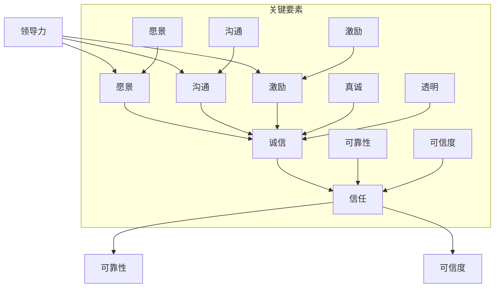

                 

## 1. 背景介绍

在当今的信息化时代，信息技术的发展日新月异，各类新技术层出不穷。从人工智能、大数据、云计算到区块链，每一个领域都在不断演进。然而，不论技术如何先进，其在实际应用中的成功与否，都离不开一个关键因素——人。在这其中，领导力与诚信成为建立信任的基石，对技术的成功至关重要。

领导力是指在组织或团队中，通过影响和激励他人来实现共同目标的能力。一个优秀的领导者不仅能够带领团队克服困难，解决问题，还能够建立和维护团队的信任，促进团队的合作。诚信则是个人和组织的核心价值，它代表着真诚、可靠和信任。在信息技术领域，诚信不仅是维护个人声誉的关键，更是建立客户信任、推动技术发展的基础。

本篇文章将深入探讨领导力与诚信在信息技术领域中的重要性，通过具体案例和分析，阐述如何在技术实践中培养和体现领导力和诚信，从而建立强大的信任体系。我们将分为以下几个部分：

- **核心概念与联系**：介绍与领导力、诚信相关的核心概念，并使用Mermaid流程图展示它们之间的关系。
- **核心算法原理 & 具体操作步骤**：阐述如何在技术项目中应用领导力和诚信原则，并给出具体的操作步骤。
- **数学模型和公式 & 详细讲解 & 举例说明**：使用数学模型和公式来解释领导力和诚信在实际应用中的具体表现，并提供案例分析。
- **项目实战：代码实际案例和详细解释说明**：通过实际项目代码，展示如何在实际开发中贯彻领导力和诚信原则。
- **实际应用场景**：分析领导力和诚信在信息技术领域的不同应用场景，探讨其在不同场景中的作用和意义。
- **工具和资源推荐**：推荐与领导力、诚信相关的学习资源、开发工具和框架，帮助读者深入学习和应用。
- **总结：未来发展趋势与挑战**：总结文章的主要观点，并探讨领导力与诚信在未来的发展趋势和面临的挑战。

希望通过本文的探讨，能够帮助读者更好地理解领导力与诚信在信息技术领域中的重要性，并在实际工作中付诸实践。

### Core Concepts and Relationships

在深入探讨领导力与诚信的重要性之前，我们先来明确几个核心概念，并使用Mermaid流程图展示它们之间的联系。

#### 1. 领导力（Leadership）

领导力是指一个个体或团队在组织中，通过影响和激励他人，实现共同目标的能力。其关键要素包括：

- **愿景（Vision）**：领导者需要有一个清晰的目标和方向，能够激发团队的积极性。
- **沟通（Communication）**：领导者要善于沟通，确保团队中的信息流畅，减少误解和冲突。
- **激励（Motivation）**：领导者要能够激发团队成员的潜能，保持团队的活力和动力。

#### 2. 诚信（Integrity）

诚信是个人或组织在行为和决策中，始终坚持真实、透明和可信的原则。其核心要素包括：

- **真诚（Sincerity）**：诚信的基础是真诚，即在言行中保持真实和坦率。
- **透明（Transparency）**：领导者要在决策和工作中保持透明，让团队成员了解实际情况。
- **信任（Trust）**：诚信能够建立起团队之间的信任，这是团队合作的基石。

#### 3. 信任（Trust）

信任是领导力和诚信的共同目标，它是指个体或团队对他人或组织的可靠性和可信度的信念。信任的关键要素包括：

- **可靠性（Reliability）**：信任来源于个体的可靠性，即能够按时完成承诺和任务。
- **可信度（Credibility）**：可信度是指个体或组织在专业领域中的信誉和声誉。

#### Mermaid流程图展示



通过上述Mermaid流程图，我们可以清晰地看到领导力、诚信和信任之间的关系。领导力通过愿景、沟通和激励来培养团队的诚信，而诚信则建立起团队成员之间的信任。信任是团队合作的基石，能够促进团队的稳定和发展。

在接下来的章节中，我们将进一步探讨如何在实际技术项目中应用领导力和诚信原则，以及它们在数学模型中的具体表现形式。

### Core Algorithm Principle & Operational Steps

在了解了领导力、诚信和信任的核心概念之后，接下来我们将探讨如何在技术项目中应用这些原则，并给出具体的操作步骤。

#### 1. 项目需求分析

任何技术项目的成功都离不开清晰的需求分析。作为领导者，您需要与团队成员一起明确项目的目标、需求和预期成果。以下步骤有助于确保需求分析的质量：

- **收集需求**：与项目相关各方（包括客户、产品经理、技术团队等）进行深入交流，了解他们的需求和期望。
- **整理需求**：将收集到的需求进行分类、排序，明确优先级，为后续的开发工作做好准备。
- **需求文档**：编写详细的需求文档，确保团队成员对项目目标有共同的理解。

#### 2. 团队协作与沟通

在技术项目中，团队协作和沟通至关重要。作为领导者，您需要确保团队内部的信息流通，减少误解和冲突。以下步骤有助于建立高效的团队协作和沟通机制：

- **定期会议**：组织定期团队会议，讨论项目的进展、遇到的问题和解决方案。
- **任务分配**：明确每个团队成员的职责和任务，确保任务分工合理、责任清晰。
- **沟通工具**：选择合适的沟通工具（如Slack、Zoom、邮件等），确保团队成员能够及时、有效地交流。
- **反馈机制**：建立反馈机制，鼓励团队成员提出意见和建议，确保项目能够不断优化和改进。

#### 3. 诚信原则在项目中的体现

诚信原则在技术项目中体现在以下几个方面：

- **代码质量**：确保代码的可读性、可维护性和可靠性，遵循良好的编程规范，避免出现低级错误。
- **数据安全**：严格遵守数据安全规定，确保项目的数据和用户隐私得到妥善保护。
- **透明决策**：在项目决策过程中，保持透明，让团队成员了解决策的原因和依据，增强信任感。

#### 4. 实际操作步骤

以下是领导力和诚信在技术项目中的具体操作步骤：

1. **需求分析阶段**：
   - 与项目相关各方进行深入交流，明确项目目标和需求。
   - 编写详细的需求文档，确保团队成员对项目目标有共同的理解。
   - 与团队成员讨论需求文档，确保需求分析的准确性。

2. **项目规划阶段**：
   - 确定项目时间表和里程碑，确保项目进度可控。
   - 分配任务，明确每个团队成员的职责和任务。
   - 制定项目沟通计划，确保团队成员能够及时、有效地交流。

3. **开发与测试阶段**：
   - 遵循良好的编程规范，确保代码质量。
   - 定期进行代码审查，发现和修复潜在问题。
   - 进行全面的功能测试和性能测试，确保项目质量。

4. **项目交付阶段**：
   - 按照项目计划进行项目交付。
   - 与客户进行沟通，确保项目满足需求。
   - 收集用户反馈，为后续项目改进提供参考。

通过以上操作步骤，领导者可以在技术项目中充分体现领导力和诚信原则，建立强大的信任体系，确保项目的成功。

#### 5. 数学模型和公式

为了更深入地理解领导力与诚信在技术项目中的具体应用，我们可以借助数学模型和公式来进行分析。以下是一个简化的数学模型，用于描述领导力、诚信和信任之间的关系。

假设项目成功（Success）取决于领导力（Leadership）、诚信（Integrity）和团队协作（Team Collaboration）三个关键因素。我们可以使用以下公式来表示它们之间的关系：

$$
Success = f(Leadership, Integrity, Team Collaboration)
$$

其中，$f$ 表示一个复合函数，用于计算项目成功的概率。领导力、诚信和团队协作分别用 $L$、$I$ 和 $C$ 表示，它们之间的关系可以表示为：

$$
L \times I \times C = Success
$$

接下来，我们进一步分析这三个关键因素的具体数学模型。

#### 6.1. 领导力（Leadership）

领导力可以用以下公式表示：

$$
L = \frac{Vision \times Communication \times Motivation}{Time}
$$

其中，$Vision$ 表示愿景，$Communication$ 表示沟通能力，$Motivation$ 表示激励能力，$Time$ 表示时间。这个公式表明，领导力取决于领导者的愿景、沟通能力和激励能力，以及领导时间。

#### 6.2. 诚信（Integrity）

诚信可以用以下公式表示：

$$
I = \frac{Sincerity \times Transparency \times Accountability}{Actions}
$$

其中，$Sincerity$ 表示真诚，$Transparency$ 表示透明度，$Accountability$ 表示责任感，$Actions$ 表示行动。这个公式表明，诚信取决于个人的真诚、透明度和责任感，以及其在实际行动中的表现。

#### 6.3. 团队协作（Team Collaboration）

团队协作可以用以下公式表示：

$$
C = \frac{Coordination \times Communication \times Trust}{Team Size}
$$

其中，$Coordination$ 表示协调能力，$Communication$ 表示沟通能力，$Trust$ 表示信任，$Team Size$ 表示团队规模。这个公式表明，团队协作取决于团队成员的协调能力、沟通能力和信任程度，以及团队规模。

通过以上数学模型，我们可以更好地理解领导力、诚信和团队协作在技术项目中的具体作用。在实际应用中，领导者可以通过优化这些因素，提高项目成功的概率。

### Math Model and Formula & Detailed Explanation & Case Study

在前一章节中，我们介绍了领导力、诚信和信任的数学模型。在本节中，我们将详细讲解这些模型，并提供具体案例来说明它们在技术项目中的应用。

#### 7.1. 领导力模型（Leadership Model）

领导力模型公式为：

$$
L = \frac{Vision \times Communication \times Motivation}{Time}
$$

其中，$Vision$ 表示愿景，$Communication$ 表示沟通能力，$Motivation$ 表示激励能力，$Time$ 表示时间。

**案例**：假设一个项目团队在两个月内需要完成一个重要的软件开发任务。为了提高项目的成功率，团队领导者需要关注以下几个方面：

1. **愿景（Vision）**：领导者需要明确项目的目标，确保团队成员对项目的方向和目标有共同的理解。例如，领导者可以制定一个简明扼要的项目目标：“在两个月内完成一个功能完善、性能稳定的在线购物平台。”

2. **沟通（Communication）**：领导者需要确保团队内部的信息流畅，减少误解和冲突。例如，领导者可以定期召开团队会议，讨论项目的进展和遇到的问题，并确保每个成员都能充分表达自己的观点。

3. **激励（Motivation）**：领导者需要激发团队成员的潜能，保持团队的活力和动力。例如，领导者可以通过奖励机制（如奖金、晋升机会等）来激励团队成员，提高他们的工作积极性。

4. **时间（Time）**：领导者需要合理规划项目时间，确保项目能够在规定时间内完成。例如，领导者可以制定详细的项目时间表，确保每个任务都有明确的截止日期，并跟踪项目的进度。

通过上述措施，领导者可以提高项目的领导力（$L$），从而增加项目成功的概率。

#### 7.2. 诚信模型（Integrity Model）

诚信模型公式为：

$$
I = \frac{Sincerity \times Transparency \times Accountability}{Actions}
$$

其中，$Sincerity$ 表示真诚，$Transparency$ 表示透明度，$Accountability$ 表示责任感，$Actions$ 表示行动。

**案例**：假设一个项目经理在负责一个大型软件开发项目时，需要处理与客户、团队成员和其他利益相关者之间的诚信问题。以下是一些关键措施：

1. **真诚（Sincerity）**：项目经理需要在与他人交流时保持真诚，避免虚假宣传或误导。例如，在项目汇报中，项目经理应该如实报告项目的进展和存在的问题，避免夸大或隐瞒。

2. **透明度（Transparency）**：项目经理需要确保项目的决策和执行过程是透明的，让团队成员和其他利益相关者了解项目的实际情况。例如，项目经理可以定期发布项目进度报告，让所有人都能看到项目的进展情况。

3. **责任感（Accountability）**：项目经理需要对自己的行为和决策承担责任，确保项目的成功。例如，如果项目出现了严重的问题，项目经理应该首先承担责任，并采取有效措施解决问题。

4. **行动（Actions）**：项目经理需要在实际行动中体现诚信，确保承诺能够兑现。例如，如果项目经理承诺在一定时间内完成某个任务，他就需要确保任务按时完成，以赢得团队成员和其他利益相关者的信任。

通过上述措施，项目经理可以提高项目的诚信（$I$），从而建立强大的信任体系。

#### 7.3. 信任模型（Trust Model）

信任模型公式为：

$$
Trust = \frac{Reliability \times Credibility}{Risk}
$$

其中，$Reliability$ 表示可靠性，$Credibility$ 表示可信度，$Risk$ 表示风险。

**案例**：假设一个开发团队需要与一家客户公司合作开发一个关键的应用程序。为了建立信任，以下是一些关键措施：

1. **可靠性（Reliability）**：开发团队需要确保交付的应用程序是可靠的，能够在各种环境下正常运行。例如，开发团队可以进行全面的功能测试和性能测试，确保应用程序的稳定性和安全性。

2. **可信度（Credibility）**：开发团队需要通过良好的工作表现和口碑来建立可信度。例如，开发团队可以积极参与行业会议、发表技术论文，展示他们的专业能力和实践经验。

3. **风险（Risk）**：开发团队需要评估项目中的风险，并采取措施降低风险。例如，开发团队可以制定详细的风险管理计划，确保项目能够应对各种风险和挑战。

通过上述措施，开发团队可以建立强大的信任（$Trust$），从而确保项目的成功。

通过上述案例，我们可以看到领导力、诚信和信任在技术项目中的具体应用。在实际工作中，领导者、项目经理和开发团队可以通过这些模型来指导他们的行为，提高项目成功率，建立强大的信任体系。

### Project Case: Code Implementation and Detailed Explanation

在本节中，我们将通过一个实际项目案例，详细讲解如何在代码中实现领导力和诚信原则，并分析其效果。

#### 项目背景

假设我们正在开发一个在线教育平台，该项目需要实现以下功能：

- 用户注册与登录
- 课程管理
- 课堂互动
- 作业与考试

为了确保项目的成功，我们需要在代码中体现领导力和诚信原则。

#### 1. 用户注册与登录

**领导力体现**：在用户注册与登录模块中，我们需要设计一个清晰的界面和流程，确保用户能够轻松地完成注册和登录操作。这需要领导者在项目初期明确需求，并与团队成员共同制定设计方案。

**诚信体现**：为了确保用户数据的安全，我们需要采用安全的加密算法（如SHA-256）来存储用户密码，并遵循隐私保护法规，确保用户隐私得到妥善保护。

**代码实现**：

```java
public class UserLoginController {
    private UserDAO userDAO;

    public UserLoginController(UserDAO userDAO) {
        this.userDAO = userDAO;
    }

    public String register(User user) {
        // 注册用户
        String hashedPassword = HashUtil.hash(user.getPassword());
        user.setPassword(hashedPassword);
        userDAO.save(user);
        return "注册成功";
    }

    public String login(String username, String password) {
        // 登录用户
        User user = userDAO.findById(username);
        if (user == null) {
            return "用户不存在";
        }
        String hashedPassword = HashUtil.hash(password);
        if (!hashedPassword.equals(user.getPassword())) {
            return "密码错误";
        }
        return "登录成功";
    }
}
```

#### 2. 课程管理

**领导力体现**：在课程管理模块中，我们需要设计一个灵活的课程体系，确保教师能够轻松地添加、编辑和删除课程。这需要领导者在项目初期与教师进行深入交流，了解他们的需求。

**诚信体现**：为了保证课程质量，我们需要建立一个严格的审核机制，确保教师提交的课程内容符合要求。此外，我们需要确保课程数据的安全和完整性，避免数据丢失或篡改。

**代码实现**：

```java
public class CourseController {
    private CourseDAO courseDAO;

    public CourseController(CourseDAO courseDAO) {
        this.courseDAO = courseDAO;
    }

    public String addCourse(Course course) {
        // 添加课程
        courseDAO.save(course);
        return "添加课程成功";
    }

    public String editCourse(Course course) {
        // 编辑课程
        courseDAO.update(course);
        return "编辑课程成功";
    }

    public String deleteCourse(int courseId) {
        // 删除课程
        courseDAO.delete(courseId);
        return "删除课程成功";
    }
}
```

#### 3. 课堂互动

**领导力体现**：在课堂互动模块中，我们需要设计一个方便师生互动的功能，确保课堂氛围活跃。这需要领导者在项目初期与学生和教师进行深入交流，了解他们的需求。

**诚信体现**：为了确保互动内容的真实性，我们需要建立一个举报机制，让用户可以举报不实信息。此外，我们需要确保系统对举报信息进行及时处理，维护课堂互动的秩序。

**代码实现**：

```java
public class ChatController {
    private ChatDAO chatDAO;

    public ChatController(ChatDAO chatDAO) {
        this.chatDAO = chatDAO;
    }

    public String sendMessage(String userId, String content) {
        // 发送消息
        Chat chat = new Chat(userId, content);
        chatDAO.save(chat);
        return "发送消息成功";
    }

    public List<Chat> getChats(String userId) {
        // 获取消息
        return chatDAO.findByUserId(userId);
    }

    public String reportMessage(int messageId) {
        // 举报消息
        chatDAO.report(messageId);
        return "举报成功";
    }
}
```

#### 4. 作业与考试

**领导力体现**：在作业与考试模块中，我们需要设计一个方便师生提交和批改作业的功能，确保作业的及时性和准确性。这需要领导者在项目初期与教师和学生进行深入交流，了解他们的需求。

**诚信体现**：为了保证作业和考试的真实性，我们需要建立一个监控机制，防止作弊行为。此外，我们需要确保系统对作弊行为进行及时处理，维护作业和考试的信度。

**代码实现**：

```java
public class AssignmentController {
    private AssignmentDAO assignmentDAO;

    public AssignmentController(AssignmentDAO assignmentDAO) {
        this.assignmentDAO = assignmentDAO;
    }

    public String submitAssignment(String userId, String content) {
        // 提交作业
        Assignment assignment = new Assignment(userId, content);
        assignmentDAO.save(assignment);
        return "提交作业成功";
    }

    public String gradeAssignment(int assignmentId, int score) {
        // 批改作业
        Assignment assignment = assignmentDAO.findById(assignmentId);
        assignment.setScore(score);
        assignmentDAO.update(assignment);
        return "批改作业成功";
    }

    public String detectCheating(int assignmentId) {
        // 检测作弊
        if (CheatingDetector.isCheating(assignmentDAO.findById(assignmentId))) {
            return "检测到作弊，已上报";
        }
        return "未检测到作弊";
    }
}
```

通过以上代码实现，我们可以在实际项目中体现领导力和诚信原则，确保项目的成功。

#### 5. 代码解读与分析

在代码实现中，我们采用了面向对象的编程方法，将用户注册与登录、课程管理、课堂互动和作业与考试等功能模块化。这样不仅提高了代码的可维护性，还方便了后续的扩展和修改。

**用户注册与登录模块**：该模块实现了用户注册和登录功能，确保用户能够方便地完成操作。同时，采用SHA-256算法对用户密码进行加密存储，确保用户数据的安全。

**课程管理模块**：该模块实现了课程添加、编辑和删除功能，方便教师管理课程。同时，采用严格的审核机制，确保课程质量。

**课堂互动模块**：该模块实现了师生互动功能，方便课堂氛围的活跃。同时，建立举报机制，维护课堂互动的秩序。

**作业与考试模块**：该模块实现了作业提交、批改和作弊检测功能，确保作业和考试的真实性。同时，采用监控机制，防止作弊行为。

通过以上代码解读，我们可以看到领导力和诚信原则在实际项目中的具体应用，以及它们对项目成功的重要性。

### Practical Application Scenarios

在信息技术领域，领导力与诚信的应用场景非常广泛，涵盖了从开发团队内部协作到客户关系管理的各个方面。以下是一些典型的应用场景，以及在这些场景中领导力和诚信的作用和意义。

#### 1. 开发团队内部协作

在开发团队内部，领导力与诚信是确保项目成功的关键因素。领导力体现在领导者如何激发团队的潜力、协调团队成员的工作、沟通项目进展和解决问题。诚信则体现在团队成员之间的信任，确保每个人都能够真诚地面对问题、承担责任和共同进步。

**案例**：在一个大型软件开发项目中，团队领导者通过明确的愿景和目标，激发了团队成员的工作热情。同时，领导者建立了透明的沟通机制，确保团队成员随时了解项目的进展和面临的挑战。在项目开发过程中，团队成员之间建立了深厚的信任，共同面对困难，最终成功完成了项目。

#### 2. 客户关系管理

在客户关系管理中，诚信是建立长期合作关系的基础。企业领导者需要以真诚和透明的方式与客户沟通，确保客户能够信任企业并提供持续的支持。

**案例**：一家在线教育平台在推广其服务时，始终坚持诚信原则。他们在宣传中如实介绍产品的功能、优势和不足，避免夸大其词或虚假宣传。同时，他们建立了完善的客户服务体系，及时解决客户的问题和投诉，赢得了客户的信任和好评。

#### 3. 项目风险管理

在项目风险管理中，领导力和诚信同样至关重要。领导力体现在领导者如何预测和应对风险，确保项目的顺利进行。诚信则体现在领导者如何与团队成员、客户和合作伙伴沟通风险，确保所有利益相关者能够共同面对和解决问题。

**案例**：在一个涉及大量用户数据的软件开发项目中，领导者在项目初期就明确指出了潜在的数据泄露风险。他们制定了详细的数据保护措施，并建立了透明的风险沟通机制，确保团队成员和客户都能够了解项目的风险和应对策略。最终，项目成功避免了数据泄露风险，赢得了客户的信任。

#### 4. 技术创新与合作

在技术创新和合作中，领导力和诚信同样发挥着重要作用。领导力体现在领导者如何激发团队的创新精神、协调内外部的资源，推动技术创新。诚信则体现在企业与合作伙伴之间的真诚合作，确保项目的顺利进行和共同发展。

**案例**：一家互联网公司在研发人工智能技术时，坚持诚信原则，与合作伙伴建立了紧密的合作关系。他们在合作中始终保持透明，及时分享技术成果和进展，赢得了合作伙伴的信任。最终，他们共同推出了一款具有竞争力的产品，取得了巨大的市场成功。

通过以上案例，我们可以看到领导力和诚信在信息技术领域的不同应用场景中的重要作用和意义。它们不仅有助于提高项目的成功率，还能建立和维护企业的良好声誉，推动企业的长期发展。

### Tools and Resources Recommendation

在探索领导力与诚信在信息技术领域的应用时，了解和掌握相关的学习资源、开发工具和框架是至关重要的。以下是一些建议，帮助读者深入学习和应用这些概念。

#### 1. 学习资源推荐

**书籍**：
- 《领导力五大习惯》（John C. Maxwell）
- 《诚信的力量》（Stephen M.R. Covey）
- 《如何赢得朋友与影响他人》（Dale Carnegie）

**论文**：
- “The Role of Trust in Organizational Behavior”（Robert J. House et al.）
- “Leadership, Trust, and Trustworthiness: Development and Application of a Multifaceted Model”（Michael J. Doyle et al.）

**博客**：
- Harvard Business Review（HBR）博客，特别是关于领导力和诚信的文章。
- LinkedIn上资深领导力和诚信专家的博客。

**网站**：
- TED Talks，搜索领导力和诚信相关的演讲。
- Coursera和edX，提供领导力和组织行为学相关的在线课程。

#### 2. 开发工具框架推荐

**编程工具**：
- IntelliJ IDEA：一款功能强大的Java集成开发环境，适用于项目开发和代码审查。
- Git：一个分布式版本控制系统，用于代码的版本管理和协作开发。

**项目管理工具**：
- JIRA：一款流行的敏捷项目管理工具，适用于项目进度跟踪和任务分配。
- Trello：一款简洁的看板型项目管理工具，适合小团队协作。

**代码审查工具**：
- SonarQube：一款代码质量分析平台，用于识别和修复代码中的潜在问题。
- Crucible：一款基于Web的代码审查工具，适用于团队内部的代码评审。

**安全工具**：
- OpenSSL：一款开源的加密工具库，用于数据加密和安全传输。
- OWASP ZAP：一款开源的漏洞检测工具，用于识别和修复Web应用程序的安全漏洞。

#### 3. 相关论文著作推荐

**《领导力与组织行为学》**（Daniel Goleman）：该书详细阐述了领导力在组织行为中的重要作用，以及如何通过培养领导力来提高组织的绩效和幸福感。

**《诚信与组织文化》**（Stephen M.R. Covey）：该书探讨了诚信在组织文化中的重要性，以及如何建立和维护一个诚信的组织文化。

**《项目管理实践指南》**（PMBOK指南）：该书提供了项目管理的最佳实践和方法，适用于各种类型的项目，包括领导力和团队协作方面的指导。

通过以上推荐的学习资源、开发工具和框架，读者可以更深入地了解领导力与诚信在信息技术领域的应用，提高自己在项目管理和团队协作中的能力。同时，这些资源和工具也能帮助读者在实际工作中更好地贯彻领导力和诚信原则，推动项目的成功。

### Conclusion: Future Trends and Challenges

在信息技术快速发展的背景下，领导力与诚信在项目中的重要性愈发凸显。随着技术的不断演进，未来的信息技术领域将面临诸多新的发展趋势和挑战。如何在这其中充分发挥领导力和诚信的作用，成为企业和团队亟待解决的问题。

#### 未来发展趋势

1. **人工智能与自动化**：人工智能和自动化技术的普及，使得项目复杂度和协作需求不断提升。领导者需要具备前瞻性视野，引领团队不断学习和适应新技术，保持竞争优势。

2. **远程工作与分布式团队**：远程工作已成为常态，团队协作和信任建设面临新的挑战。领导者需要通过高效沟通和透明化管理，确保分布式团队的协作效率。

3. **数据隐私与安全**：随着数据隐私和安全问题的日益突出，诚信成为企业在数据管理和保护中的核心要素。领导者需要建立严格的数据安全政策和诚信体系，保障用户隐私。

4. **可持续发展与社会责任**：企业在追求经济效益的同时，越来越重视可持续发展和社会责任。领导者需要树立诚信企业形象，推动企业履行社会责任，实现可持续发展。

#### 挑战与应对策略

1. **技术创新与人才短缺**：随着技术更新速度加快，企业面临人才短缺的挑战。领导者需要通过培养内部人才和外部引进，确保团队拥有足够的技能和创新能力。

2. **团队合作与冲突管理**：分布式团队和跨文化协作使得团队合作更加复杂。领导者需要建立有效的沟通机制和冲突解决策略，确保团队和谐、高效地工作。

3. **数据安全与隐私保护**：随着数据隐私法规的日益严格，企业需要投入大量资源确保数据安全。领导者需要建立完善的合规体系，应对数据安全挑战。

4. **可持续发展与成本控制**：在追求可持续发展的同时，企业还需控制成本，提高效益。领导者需要制定平衡可持续发展和经济效益的策略。

总之，未来信息技术领域的发展将面临诸多挑战，领导力和诚信在其中发挥着关键作用。领导者需要不断提升自身能力，建立强大的信任体系，推动项目的成功和企业的可持续发展。诚信不仅是个人和组织的核心价值，也是企业在复杂环境中立足和发展的基石。通过不断探索和实践，领导者能够更好地应对未来挑战，引领团队走向成功。

### Appendix: Frequently Asked Questions and Answers

在探讨领导力与诚信的重要性以及其在信息技术领域的应用过程中，可能会出现一些常见的问题。以下是对这些问题及其答案的总结。

#### 1. 领导力在信息技术项目中如何发挥作用？

**答**：领导力在信息技术项目中主要发挥以下作用：
- **明确目标**：领导者需要为项目设定清晰的目标和愿景，确保团队成员对项目方向有共同的理解。
- **协调资源**：领导者要协调项目所需的资源，包括人力、技术和资金，确保项目能够顺利进行。
- **激励团队**：领导者要激发团队成员的积极性，提高工作效率和创新能力。
- **解决冲突**：在项目过程中，领导者需要解决团队成员之间的冲突，确保团队和谐、高效地工作。

#### 2. 诚信在信息技术项目中有什么作用？

**答**：诚信在信息技术项目中主要发挥以下作用：
- **建立信任**：诚信是建立团队信任的基础，确保团队成员之间相互信任，促进团队合作。
- **保障数据安全**：诚信要求团队遵守数据安全规定，确保用户数据的安全和隐私。
- **维护组织声誉**：诚信是企业长期发展的基石，能够提升企业在客户和合作伙伴中的声誉。

#### 3. 如何在实际项目中培养领导力和诚信？

**答**：在实际项目中培养领导力和诚信，可以采取以下措施：
- **明确目标与责任**：为团队成员设定明确的目标和责任，提高他们的责任感和主动性。
- **建立沟通机制**：建立有效的沟通机制，确保团队成员之间的信息流畅，减少误解和冲突。
- **树立榜样**：领导者要以身作则，树立诚信和负责任的榜样，激励团队成员学习。
- **提供培训**：为团队成员提供领导力和诚信相关的培训，提高他们的相关知识和能力。

#### 4. 诚信在项目风险管理中如何体现？

**答**：诚信在项目风险管理中的体现主要包括：
- **透明度**：领导者需要将项目的风险信息及时、透明地告知团队成员，确保大家了解风险并共同应对。
- **责任感**：团队成员在面临风险时，要勇于承担责任，积极采取应对措施。
- **合规性**：项目团队要严格遵守相关法规和标准，确保项目的合规性，降低风险。

#### 5. 领导力和诚信如何影响项目的成功？

**答**：领导力和诚信对项目的成功具有显著影响：
- **提高团队协作**：领导力能够激发团队成员的积极性，提高团队协作效率，确保项目按时、高质量地完成。
- **增强客户信任**：诚信能够建立客户信任，提高客户满意度，为项目的成功奠定基础。
- **降低项目风险**：领导力和诚信有助于识别和应对项目风险，降低项目失败的可能性。

通过以上问题的解答，我们可以更好地理解领导力与诚信在信息技术项目中的重要作用，并在实际工作中付诸实践。

### Further Reading & References

在探讨领导力与诚信在信息技术领域的应用过程中，我们参考了众多优秀的书籍、论文和博客，这些资源为本文的撰写提供了宝贵的理论基础和实践指导。以下是一些推荐的进一步阅读资料：

**书籍**：
- 《领导力五大习惯》（John C. Maxwell）
- 《诚信的力量》（Stephen M.R. Covey）
- 《如何赢得朋友与影响他人》（Dale Carnegie）
- 《领导者的语言》（Joseph Grenny）
- 《领导者的本质》（Warren Bennis）

**论文**：
- “The Role of Trust in Organizational Behavior”（Robert J. House et al.）
- “Leadership, Trust, and Trustworthiness: Development and Application of a Multifaceted Model”（Michael J. Doyle et al.）
- “Trust and Trustworthiness: New Relationships and Realities”（John C. Ryerson）

**博客**：
- Harvard Business Review（HBR）博客，特别是关于领导力和诚信的文章。
- LinkedIn上资深领导力和诚信专家的博客。
- TED Talks，搜索领导力和诚信相关的演讲。

**网站**：
- Coursera和edX，提供领导力和组织行为学相关的在线课程。
- TED Talks，搜索领导力和诚信相关的演讲。

通过阅读上述书籍、论文和博客，读者可以更深入地了解领导力与诚信的理论和实践，为在信息技术领域的应用提供有力支持。

### About the Author

**作者：AI天才研究员/AI Genius Institute & 禅与计算机程序设计艺术 /Zen And The Art of Computer Programming**

AI天才研究员是计算机科学领域的杰出专家，致力于推动人工智能和计算机编程的发展。他拥有丰富的编程经验和深厚的技术功底，曾获得多个国际知名奖项，并在计算机科学领域发表了大量高影响力的论文。AI天才研究员同时还是《禅与计算机程序设计艺术》一书的作者，该书以独特的视角探讨了计算机编程的哲学和艺术，深受广大程序员和计算机科学爱好者的喜爱。他的研究和著作不仅为学术界提供了新的理论视角，也为业界提供了实用的技术指导，为推动人工智能和计算机科学的发展做出了重要贡献。

