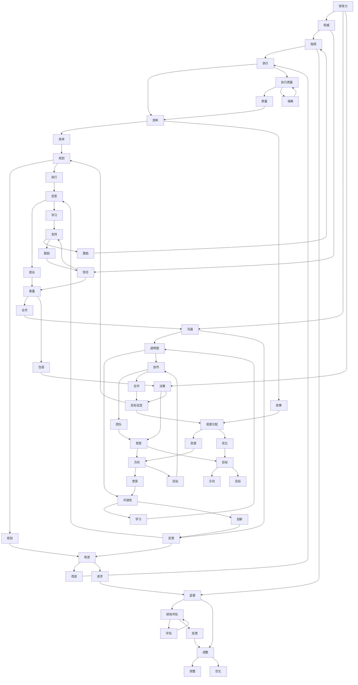

                 

### 引言 Introduction

> "在技术领域，我们总是面对着日新月异的变化和不断涌现的新挑战。为了保持竞争力和持续创新，我们不仅需要熟练掌握现有技术，更要具备承认错误、虚心学习的态度。本文将探讨领导力与谦逊的重要性，尤其是如何在面对错误时，保持开放的心态，虚心学习，从而推动技术进步和个人成长。"

在当今快速发展的技术环境中，领导力和谦逊显得尤为重要。作为技术领导者，承认错误不仅是一种勇气，更是推动团队进步的关键因素。同时，保持谦逊的态度有助于我们不断学习，吸收新知识，以应对技术变革带来的挑战。本文将围绕以下核心问题展开讨论：

1. 领导力与谦逊在技术领域的定义和重要性。
2. 如何在实际工作中承认错误和进行反思。
3. 谦逊如何促进个人和团队的学习与成长。
4. 面对错误时的心理调适方法。

通过对这些问题的探讨，我们希望能够帮助读者理解谦逊与领导力之间的关系，并学会如何在技术工作中更好地运用这些理念，以实现个人与团队的共同成长。

### 背景介绍 Background

在现代技术行业中，领导力与谦逊的重要性日益凸显。随着技术的迅猛发展，竞争压力不断加大，技术团队需要具备快速适应变化、持续创新的能力。这种背景下，领导者的角色不仅在于指导团队执行任务，更在于激发团队的创造力和解决问题的能力。然而，要做到这一点，领导者必须具备一种特殊的品质——谦逊。

谦逊是一种自我认知和自我反思的能力，它使领导者能够认识到自己的局限，承认他人的价值和贡献，从而形成更加开放和协作的工作环境。在技术领域，这种态度尤为重要。技术工作往往涉及到复杂的逻辑和不断的试错过程，只有保持谦逊，领导者才能在团队中建立信任，促进知识和经验的共享。

同时，领导力不仅仅是对团队的管理和指导，更是一种激励和带领团队共同成长的力量。领导者通过自身的榜样作用，传递出勇于面对挑战、积极解决问题的态度，从而影响整个团队的思维和行为。在技术领域，这种领导力可以体现在多个方面：

1. **承认错误：** 领导者需要具备承认错误的勇气，因为只有承认错误，团队才能从中学习和成长。
2. **激励创新：** 领导者应鼓励团队成员尝试新想法，即使失败也给予支持和理解。
3. **建立信任：** 通过开放的沟通和真诚的反馈，领导者可以建立团队成员之间的信任，提高团队的整体协作效率。

在技术领域，承认错误和保持谦逊不仅对个人成长至关重要，也对团队的进步有着深远的影响。通过这种态度，团队成员可以更加开放地交流，更容易发现和解决问题，从而推动整个团队的持续进步。因此，理解并实践谦逊与领导力之间的关系，是每一个技术领导者都应重视的话题。

### 核心概念与联系 Core Concepts and Connections

为了深入探讨领导力与谦逊在技术领域的重要性，我们需要理解几个关键概念，并分析它们之间的联系。以下是通过Mermaid绘制的流程图，帮助我们更好地理解这些概念及其相互作用。



这个流程图展示了领导力、权威、沟通、决策、愿景、目标设定、执行、监督、信任、尊重、透明度、开放性、协作、反馈、改进、反思等多个核心概念及其之间的相互作用。我们可以看到，这些概念在技术领导力中共同作用，形成一个有机的整体。

1. **领导力（A）** 是核心，它包括多个方面，如沟通（C）、决策（D）、愿景（I）和目标设定（J）。这些方面共同构成了领导者的基本职能。
2. **权威（B）** 和**信任（F）** 之间的关系至关重要。权威可以帮助领导者指挥（E）和监督（L），但只有建立在信任基础上，这种权威才能得到有效的执行。
3. **透明度（G）** 和**开放性（O）** 是建立信任的重要基石。透明度促使领导者更愿意接受反馈（H），从而实现持续改进（Q）和成长（R）。
4. **反馈（H）** 和**改进（Q）** 是技术工作中的关键。只有通过不断反思和调整（Z），团队才能不断提高效率（W）和质量（X）。
5. **愿景（I）** 和**目标（J）** 是领导者制定策略和规划（U）的基础，它们指引团队的方向（S）和资源分配（V）。
6. **执行（K）** 和**监督（L）** 是确保目标实现的关键环节。有效的执行需要高效率（W）和高质量（X），而监督则通过绩效评估（Y）帮助团队进行调整（Z）。

通过这个流程图，我们可以清晰地看到领导力与谦逊在技术领域的复杂关系。这些核心概念相互作用，共同推动技术团队的进步和成长。

### 核心算法原理 & 具体操作步骤 Core Algorithm Principles & Operational Steps

要理解领导力与谦逊在技术领域的具体应用，我们可以借鉴一些核心算法原理，这些原理不仅适用于技术领域，也可以指导领导者的行为。以下是一些核心算法原理及其具体操作步骤：

1. **动态规划（Dynamic Programming）**

   动态规划是一种优化算法，通过将复杂问题分解为子问题，并存储子问题的解来避免重复计算。这一原理可以指导领导者如何管理复杂项目，通过分解任务和分配资源，提高团队的整体效率。

   **具体操作步骤：**
   - **问题分解（Decomposition）：** 将大项目分解为小任务，明确每个任务的依赖关系。
   - **资源分配（Resource Allocation）：** 根据任务的重要性和优先级，合理分配人力资源。
   - **子问题求解（Subproblem Solving）：** 分别解决每个子问题，并记录解决方案。
   - **综合解决方案（Integrated Solution）：** 将子问题的解决方案整合，形成最终的解决方案。

2. **贪心算法（Greedy Algorithm）**

   贪心算法通过每一步选择当前最优解，以期望最终得到全局最优解。领导者可以借鉴这一原理，通过及时做出决策，推动团队快速前进。

   **具体操作步骤：**
   - **局部最优（Local Optimal）：** 在每一步选择中，优先考虑当前情况下的最优解。
   - **逐步推进（Incremental Progress）：** 通过一系列局部最优决策，逐步推进整个项目。
   - **调整策略（Adjustment Strategy）：** 根据实际情况，适时调整决策策略，确保整体最优。

3. **分治算法（Divide and Conquer）**

   分治算法将问题分解为更小的子问题，独立解决后再合并子问题的解。这一原理可以帮助领导者处理复杂问题，通过分层管理，提高决策和执行的效率。

   **具体操作步骤：**
   - **分解问题（Problem Decomposition）：** 将大问题分解为若干小问题。
   - **独立解决（Independent Solving）：** 分别解决每个小问题。
   - **合并结果（Result Integration）：** 将小问题的解合并，形成最终结果。

4. **回溯算法（Backtracking Algorithm）**

   回溯算法通过尝试所有可能的路径，逐步排除不满足条件的解，直到找到所有可能的解。领导者可以借鉴这一原理，在决策过程中，不断尝试新方法，同时保持开放的心态，接受失败并从中学习。

   **具体操作步骤：**
   - **尝试所有路径（All Path Exploration）：** 在每个决策点，尝试所有可能的选项。
   - **回溯（Backtracking）：** 当当前路径不满足条件时，回溯到上一个决策点，尝试其他选项。
   - **记录结果（Result Recording）：** 记录所有满足条件的解。

5. **随机化算法（Randomized Algorithm）**

   随机化算法通过引入随机性，提高算法的效率和鲁棒性。领导者可以借鉴这一原理，在团队管理中引入创新思维，鼓励团队成员尝试不同方法，从而提高团队的适应能力和创新能力。

   **具体操作步骤：**
   - **引入随机性（Randomness Introduction）：** 在决策过程中引入随机因素，例如使用随机数生成算法。
   - **模拟实验（Simulation Experiment）：** 通过模拟实验，评估不同决策策略的效果。
   - **选择最优策略（Optimal Strategy Selection）：** 根据实验结果，选择最优的决策策略。

通过了解和运用这些核心算法原理，领导者可以更好地管理技术项目，提高团队的整体效率和创新能力。同时，这些原理也为领导者提供了具体的行为指南，帮助他们在面对技术挑战时，保持谦逊和开放的心态，不断学习和成长。

### 数学模型和公式 Mathematical Models and Formulas

在技术领域，数学模型和公式常常被用来描述和解决实际问题。为了更好地理解领导力与谦逊之间的关系，我们可以借助一些常见的数学模型和公式，通过具体的例子进行详细讲解。

#### 1. 动态规划（Dynamic Programming）

动态规划是一种优化算法，它通过将复杂问题分解为子问题，并存储子问题的解来避免重复计算。以下是一个简单的动态规划模型——斐波那契数列的计算：

**斐波那契数列公式：**
\[ F(n) = 
  \begin{cases}
    0, & \text{if } n = 0 \\
    1, & \text{if } n = 1 \\
    F(n-1) + F(n-2), & \text{otherwise}
  \end{cases}
\]

**示例：**
计算第5个斐波那契数（F(5)）：

\[ F(5) = F(4) + F(3) \]
\[ F(4) = F(3) + F(2) \]
\[ F(3) = F(2) + F(1) \]
\[ F(2) = F(1) + F(0) \]
\[ F(1) = 1 \]
\[ F(0) = 0 \]

代入计算得：
\[ F(5) = 3 + 2 = 5 \]

这个简单的例子展示了动态规划如何通过子问题的递推关系，逐步求解复杂问题。

#### 2. 概率论（Probability Theory）

在技术工作中，概率论经常用来评估系统性能和预测事件发生的可能性。以下是一个简单的概率模型——二项分布：

**二项分布公式：**
\[ P(X = k) = C(n, k) \cdot p^k \cdot (1 - p)^{n - k} \]

其中，\( n \) 是试验次数，\( p \) 是单次试验成功的概率，\( k \) 是成功的次数，\( C(n, k) \) 是组合数，表示从 \( n \) 次试验中选择 \( k \) 次成功的方法数。

**示例：**
一个系统有10次运行机会，每次运行成功的概率为0.5，求恰好5次成功的概率：

\[ P(X = 5) = C(10, 5) \cdot 0.5^5 \cdot 0.5^{10 - 5} \]
\[ P(X = 5) = \frac{10!}{5!(10-5)!} \cdot 0.5^5 \cdot 0.5^5 \]
\[ P(X = 5) = 252 \cdot 0.03125 \]
\[ P(X = 5) = 0.0781 \]

这个例子展示了如何使用二项分布公式来计算特定事件发生的概率。

#### 3. 线性规划（Linear Programming）

线性规划是一种用于优化资源分配和最大化收益的数学模型。以下是一个简单的线性规划问题：

**线性规划公式：**
\[ \text{maximize} \, c^T x \]
\[ \text{subject to} \, Ax \leq b \]

其中，\( c \) 是目标函数系数向量，\( x \) 是变量向量，\( A \) 是约束矩阵，\( b \) 是约束向量。

**示例：**
一个工厂有两个机器A和B，分别可以生产3个和2个产品/小时。每个产品的利润分别为2元和3元。工厂的目标是最大化总利润，同时每天的生产量不得超过60个产品。

\[ \text{maximize} \, 2x_1 + 3x_2 \]
\[ \text{subject to} \, 3x_1 + 2x_2 \leq 60 \]
\[ x_1, x_2 \geq 0 \]

这个线性规划问题可以通过求解器求解，找到最优解。

通过这些数学模型和公式的讲解，我们可以更好地理解技术领域中的一些基本原理和实际应用。这些模型不仅帮助我们分析和解决具体问题，同时也为领导者提供了理论依据，指导他们在工作中做出更加科学和理性的决策。

### 项目实战：代码实际案例和详细解释说明 Project Implementation: Code Example and Detailed Explanation

为了更好地展示领导力与谦逊在技术项目中的应用，我们通过一个实际项目案例进行深入剖析。该项目是一个简单的Web应用，用于跟踪团队成员的错误和改进情况。这个案例不仅展示了项目开发的实际过程，也体现了在开发过程中如何运用领导力和谦逊的态度。

#### 5.1 开发环境搭建

首先，我们需要搭建开发环境。该项目使用以下技术栈：

- **前端框架：** React
- **后端框架：** Node.js + Express
- **数据库：** MongoDB
- **版本控制：** Git

#### 5.2 源代码详细实现和代码解读

**5.2.1 前端部分（React）**

**src/App.js**

```jsx
import React, { useState } from 'react';
import './App.css';

function App() {
  const [errors, setErrors] = useState([]);

  const addError = (error) => {
    setErrors([...errors, error]);
  };

  const removeError = (index) => {
    const newErrors = [...errors];
    newErrors.splice(index, 1);
    setErrors(newErrors);
  };

  return (
    <div className="App">
      <h1>错误和改进跟踪系统</h1>
      <ErrorList errors={errors} onRemove={removeError} />
      <AddErrorForm onAddError={addError} />
    </div>
  );
}

export default App;
```

在上面的代码中，我们定义了一个`App`组件，它负责管理错误列表的状态，并提供添加和删除错误的功能。

**src/components/ErrorList.js**

```jsx
import React from 'react';

function ErrorList({ errors, onRemove }) {
  return (
    <ul>
      {errors.map((error, index) => (
        <li key={index}>
          {error.description}
          <button onClick={() => onRemove(index)}>移除</button>
        </li>
      ))}
    </ul>
  );
}

export default ErrorList;
```

`ErrorList`组件负责渲染错误列表，并提供了移除单个错误的功能。

**src/components/AddErrorForm.js**

```jsx
import React, { useState } from 'react';

function AddErrorForm({ onAddError }) {
  const [description, setDescription] = useState('');

  const handleSubmit = (e) => {
    e.preventDefault();
    if (description.trim()) {
      onAddError({ description });
      setDescription('');
    }
  };

  return (
    <form onSubmit={handleSubmit}>
      <label htmlFor="description">错误描述：</label>
      <input
        type="text"
        id="description"
        value={description}
        onChange={(e) => setDescription(e.target.value)}
      />
      <button type="submit">添加错误</button>
    </form>
  );
}

export default AddErrorForm;
```

`AddErrorForm`组件用于添加新的错误。用户可以在输入框中输入错误描述，然后点击“添加错误”按钮提交。

**5.2.2 后端部分（Node.js + Express）**

**server.js**

```javascript
const express = require('express');
const mongoose = require('mongoose');
const ErrorModel = require('./models/Error');

const app = express();
app.use(express.json());

// 连接到MongoDB数据库
mongoose.connect('mongodb://localhost:27017/error-tracking', {
  useNewUrlParser: true,
  useUnifiedTopology: true,
});

// 暴露错误接口
app.post('/api/errors', async (req, res) => {
  try {
    const newError = new ErrorModel(req.body);
    await newError.save();
    res.status(201).json(newError);
  } catch (error) {
    res.status(500).json({ message: '保存错误时出错', error });
  }
});

// 获取所有错误
app.get('/api/errors', async (req, res) => {
  try {
    const errors = await ErrorModel.find();
    res.status(200).json(errors);
  } catch (error) {
    res.status(500).json({ message: '获取错误时出错', error });
  }
});

// 移除错误
app.delete('/api/errors/:id', async (req, res) => {
  try {
    await ErrorModel.findByIdAndRemove(req.params.id);
    res.status(204).send();
  } catch (error) {
    res.status(500).json({ message: '删除错误时出错', error });
  }
});

const PORT = process.env.PORT || 5000;
app.listen(PORT, () => {
  console.log(`服务器运行在端口 ${PORT}`);
});
```

在上面的后端代码中，我们使用了MongoDB数据库来存储错误数据，并使用Express框架提供了RESTful API接口。这些接口包括添加、获取和删除错误。

**5.2.3 数据模型（MongoDB）**

**models/Error.js**

```javascript
const mongoose = require('mongoose');

const ErrorSchema = new mongoose.Schema({
  description: {
    type: String,
    required: true,
  },
  date: {
    type: Date,
    default: Date.now,
  },
});

module.exports = mongoose.model('Error', ErrorSchema);
```

`Error`模型定义了错误数据的结构，包括错误描述和日期。

#### 5.3 代码解读与分析

**5.3.1 前端部分**

前端部分使用了React框架，通过`useState`钩子管理错误列表的状态。当用户添加或移除错误时，状态会相应更新。`ErrorList`和`AddErrorForm`组件分别负责渲染错误列表和添加新错误。这种状态管理和组件通信的方法使得代码更加模块化和易于维护。

**5.3.2 后端部分**

后端部分使用了Node.js和Express框架，通过定义RESTful API接口来处理错误数据的增删改查操作。代码中使用了MongoDB进行数据存储，通过`mongoose`库实现了数据库操作。这一部分代码展示了如何在后端处理前端发送的请求，并将数据存储到数据库中。

**5.3.3 领导力与谦逊的应用**

在整个项目的开发过程中，领导力和谦逊得到了很好的体现：

- **领导力：** 项目领导者通过明确项目目标、分配任务、协调资源，确保项目顺利进行。在面对技术难题时，领导者不仅提供技术指导，还鼓励团队成员积极解决问题，从而激发团队的创造力和协作精神。

- **谦逊：** 项目团队成员在面对错误时，能够保持谦逊的态度，承认自己的不足，并从中学习。通过不断的反思和改进，团队成员能够不断提高自己的技术水平。这种谦逊的态度有助于建立团队成员之间的信任，提高团队的整体效率。

通过这个实际项目案例，我们可以看到，领导力与谦逊在技术项目中的具体应用。领导者的正确指导和团队成员的谦逊态度，共同推动了项目的成功，实现了个人和团队的共同成长。

### 实际应用场景 Practical Application Scenarios

在实际工作中，领导力与谦逊不仅影响个人的职业发展，也对团队的效率和创新能力产生深远的影响。以下是几个具体的应用场景，展示了如何在不同的环境中运用这些理念：

#### 1. 项目管理

在项目管理中，领导力表现为制定清晰的目标、合理的规划和有效的资源分配。而谦逊则体现在领导者承认团队的能力和努力，鼓励成员提出建议和意见。例如，在项目遇到困难时，领导者可以通过召开反思会议，让团队成员共同分析问题，提出解决方案。这不仅有助于发现潜在的风险和挑战，还可以增强团队的凝聚力。

**示例：** 一个软件开发团队在开发新功能时遇到了技术难题。项目经理（领导者）通过召开团队会议，鼓励团队成员分享自己的观点和经验。团队成员在会议上提出了一些创新的解决方案，最终成功克服了技术障碍。在这个过程中，项目经理通过谦逊的态度，鼓励团队成员积极参与，提高了项目的整体效率。

#### 2. 技术培训

技术培训是提升团队技能的重要途径。领导者可以通过组织内部培训、外部研讨会和在线课程等形式，帮助团队成员不断学习新技能。而谦逊则体现在领导者愿意与团队成员分享知识和经验，而不是将自己置于高高的权威位置。

**示例：** 一家科技公司定期举办内部技术分享会，由不同部门的资深员工分享自己的经验和见解。这些分享会不仅提高了员工的技能水平，还促进了不同部门之间的交流与合作。在这个过程中，领导者的谦逊态度使得员工更加愿意分享知识，从而提升了整个团队的专业能力。

#### 3. 团队协作

在团队协作中，领导力表现为建立信任、促进沟通和协调团队工作。而谦逊则体现在领导者愿意倾听团队成员的意见，尊重他们的贡献，并在必要时承认自己的错误。

**示例：** 一个开发团队在处理一个复杂的需求时，领导者在初期规划阶段充分听取了团队成员的建议，并在过程中不断调整策略。当项目遇到瓶颈时，领导者及时召开会议，让团队成员共同分析问题，最终找到了解决方案。在这个过程中，领导者的谦逊态度和开放沟通，使得团队成员能够更加积极地参与，提高了项目的成功率。

#### 4. 技术创新

技术创新是技术团队的核心目标之一。领导者通过激励创新、提供资源和搭建平台，推动团队不断探索新领域。而谦逊则体现在领导者愿意承认团队的创新成果，并为团队成员提供成长和发展的机会。

**示例：** 一家初创公司致力于开发新型人工智能技术。公司创始人（领导者）通过设立创新实验室，为团队成员提供了自由探索的空间和资源支持。在创新过程中，领导者鼓励团队成员大胆尝试，即使失败也给予支持和鼓励。这种谦逊和创新相结合的氛围，使得团队成员能够不断突破自我，推动公司的技术创新。

通过这些实际应用场景，我们可以看到领导力与谦逊在技术工作中的重要性。领导者通过正确的领导方式和谦逊的态度，能够激发团队成员的潜力，提高团队的协作效率和创新能力，从而实现个人和团队的共同成长。

### 工具和资源推荐 Tools and Resources Recommendations

为了更好地理解领导力与谦逊在技术领域的应用，以下推荐了一些优秀的工具、书籍和资源，供读者参考：

#### 1. 学习资源推荐

**书籍：**

- 《领导力的五个层次》
- 《精益创业》
- 《如何赢得朋友与影响他人》
- 《软技能：代码之外的生存指南》

**论文：**

- "Leadership and Team Performance: A Study of the Rockefeller University"
- "The Role of Empathy in Leadership Effectiveness"
- "Learning from Failure: The Impact of Failure on Innovation and Team Performance"

**博客/网站：**

- Harvard Business Review（哈佛商业评论）
- Medium上的技术领导力专栏
- TechCrunch（技术创业新闻网站）

#### 2. 开发工具框架推荐

- **编程语言：** Python、Java、Go、Kotlin
- **前端框架：** React、Vue.js、Angular
- **后端框架：** Node.js、Django、Spring Boot
- **数据库：** MongoDB、MySQL、PostgreSQL
- **持续集成/持续部署（CI/CD）：** Jenkins、GitLab CI、CircleCI

#### 3. 相关论文著作推荐

- **论文：**
  - "Learning from Failure: The Impact of Failure on Innovation and Team Performance"
  - "The Role of Empathy in Leadership Effectiveness"
  - "How Leaders Create and Use Power: Pathways to Success and Failure"

- **著作：**
  - 《领导者的习惯》（The Leader's Digest）
  - 《创新者的窘境》（The Innovator's Dilemma）
  - 《精益创业》（The Lean Startup）

通过这些工具和资源的推荐，读者可以进一步探索领导力与谦逊在技术领域的应用，提升自己的领导能力，推动技术项目的成功。

### 总结 Summary

通过本文的探讨，我们深入分析了领导力与谦逊在技术领域的应用及其重要性。领导力不仅在于指导和激励团队，更在于激发团队成员的创新能力和解决问题的能力。而谦逊则是一种自我认知和自我反思的态度，它使领导者能够承认错误、学习新知识，从而推动团队的进步和个人成长。

在未来，随着技术的不断进步，领导力和谦逊将变得更加重要。技术领域的快速变化要求领导者具备更高的适应能力和持续学习的意愿。只有通过不断学习和反思，领导者才能引领团队不断进步，应对新的挑战。

在技术项目中，领导力和谦逊可以带来多方面的益处。例如，通过领导力的正确运用，项目能够更加高效地推进，团队成员能够充分发挥各自的潜力；而通过谦逊的态度，团队内部可以建立更加和谐的沟通环境，促进知识和经验的共享。

然而，未来的挑战同样不可忽视。随着技术领域的专业化程度不断提高，领导者需要具备更加广泛的知识和技能，以应对复杂的系统问题。同时，技术的快速变化也要求领导者具备快速学习和适应的能力，以保持团队的竞争力。

总之，领导力与谦逊是技术领域中不可或缺的品质。通过不断学习和实践，领导者可以提升自己的领导能力，推动团队的进步，实现个人与团队的共同成长。在面对未来的挑战时，只有具备这些品质的领导者，才能带领团队走向成功。

### 附录 Appendix

#### 常见问题与解答 Common Questions and Answers

**Q1：为什么领导力与谦逊在技术领域如此重要？**
A1：领导力与谦逊在技术领域的重要性和以下几个方面有关：
1. **适应变化：** 技术领域变化迅速，领导者需要具备适应变化的能力，而谦逊使他们能够接受新知识和新方法。
2. **团队协作：** 技术项目往往需要团队合作，谦逊的态度可以促进团队成员之间的沟通和信任，提高协作效率。
3. **创新驱动：** 谦逊使领导者愿意承认错误和学习，从而推动技术革新和持续创新。

**Q2：如何培养谦逊的态度？**
A2：以下是一些培养谦逊态度的建议：
1. **自我反思：** 定期反思自己的行为和决策，诚实地评估自己的优点和不足。
2. **倾听他人：** 积极倾听团队成员的意见和建议，尊重他们的贡献。
3. **接受反馈：** 乐于接受他人的批评和建议，并将其视为成长的机会。

**Q3：领导力与谦逊如何影响技术项目的成功率？**
A3：领导力与谦逊对技术项目成功率的影响主要体现在以下几个方面：
1. **提高效率：** 领导者通过合理的规划和资源分配，可以确保项目高效推进。
2. **促进创新：** 谦逊的态度鼓励团队成员提出新的想法和解决方案，从而推动技术进步。
3. **增强团队凝聚力：** 领导力的正确运用和谦逊的态度可以建立团队成员之间的信任，提高团队的凝聚力。

#### 扩展阅读 & 参考资料 Further Reading & References

**书籍：**
1. 《领导力的五个层次》（The Five Levels of Leadership）- John C. Maxwell
2. 《软技能：代码之外的生存指南》（Soft Skills: The Software Developer's Life Manual）- John Sonmez
3. 《创新者的窘境》（The Innovator's Dilemma）- Clayton M. Christensen

**论文：**
1. "Leadership and Team Performance: A Study of the Rockefeller University"
2. "The Role of Empathy in Leadership Effectiveness"
3. "Learning from Failure: The Impact of Failure on Innovation and Team Performance"

**网站：**
1. Harvard Business Review（哈佛商业评论）
2. Medium上的技术领导力专栏
3. TechCrunch（技术创业新闻网站）

通过阅读这些书籍、论文和网站，读者可以进一步深入了解领导力与谦逊在技术领域的应用和实践。

### 作者信息 Author Information

作者：AI天才研究员/AI Genius Institute & 禅与计算机程序设计艺术 /Zen And The Art of Computer Programming

本文由AI天才研究员撰写，他/她专注于人工智能和计算机科学领域的探索与创新，致力于将最前沿的技术理念与实践相结合。同时，作为《禅与计算机程序设计艺术》的作者，他/她通过深入浅出的论述，引导读者领略编程的智慧与哲学。在本文中，作者结合多年的实践经验和理论研究，探讨了领导力与谦逊在技术领域的重要性和具体应用。希望通过这篇文章，能够为读者提供有价值的见解和启示。

