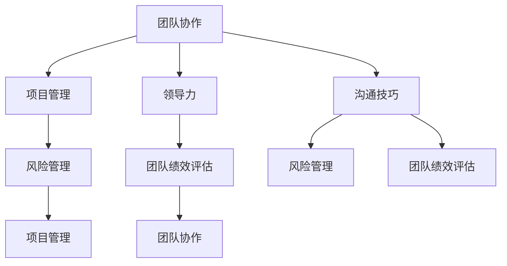

                 

### 背景介绍

在现代软件工程中，测试工程师的角色至关重要。他们不仅仅是负责编写测试用例，更是在保证软件质量和可靠性方面发挥着不可替代的作用。然而，许多优秀的测试工程师在职业发展的过程中，往往面临着从技术岗位向管理岗位转型的挑战。这一转型过程不仅需要他们在技术能力上持续提升，还需要在领导力和管理能力上有所突破。

测试工程师向管理者的转型，不仅仅意味着角色的变化，更是对个人综合素质的全面提升。从技术专家到团队领导者，测试工程师需要掌握更广泛的技能，包括沟通协调、团队管理、风险管理、项目管理等。这样的转变，不仅要求测试工程师具备扎实的专业技能，还需要他们有清晰的目标、良好的心态和持续的学习能力。

本篇文章旨在探讨测试工程师如何从技术岗位成功转型为管理者，实现职业上的逆袭。我们将通过以下几个部分来展开讨论：

1. **核心概念与联系**：首先，我们将介绍测试工程师转型为管理者所需掌握的核心概念及其相互之间的联系。
2. **核心算法原理 & 具体操作步骤**：接下来，我们将详细讲解一些关键的管理算法，帮助读者理解管理过程中的操作步骤。
3. **数学模型和公式 & 详细讲解 & 举例说明**：在此基础上，我们将运用数学模型和公式，对管理过程中的各种情况进行详细分析，并提供实际案例进行说明。
4. **项目实战：代码实际案例和详细解释说明**：通过具体的项目实战，我们将展示如何在实际环境中应用管理知识。
5. **实际应用场景**：我们将探讨管理者在不同场景下如何运用管理技能，解决实际问题。
6. **工具和资源推荐**：为了帮助读者更好地进行学习和实践，我们将推荐一些相关的学习资源、开发工具和论文著作。
7. **总结：未来发展趋势与挑战**：最后，我们将总结测试工程师转型的趋势和面临的挑战，并对未来进行展望。

通过以上内容，本文希望为测试工程师提供一份实用的转型指南，帮助他们更好地应对职业发展的挑战，实现从技术专家到管理者的华丽转变。

### 核心概念与联系

在探讨测试工程师向管理者转型的过程中，有几个核心概念是我们必须理解和掌握的，这些概念相互关联，共同构成了管理的基石。

#### 团队协作

团队协作是管理者必须具备的一项基本技能。一个高效的团队可以产生1+1>2的效果，而团队合作失败则可能导致整个项目的失败。团队协作不仅包括团队成员之间的沟通和协作，还包括如何激励团队成员、建立信任和共同目标。有效的团队协作能够提高工作效率、提升团队凝聚力，并促进创新。

#### 项目管理

项目管理是管理者的重要职责之一。项目管理涉及到如何规划项目、分配资源、控制进度、风险管理以及质量保证等多个方面。有效的项目管理能够确保项目按时、按质量完成，并在预算范围内实现目标。管理者需要掌握项目管理的核心原则和工具，如甘特图、敏捷开发方法等。

#### 领导力

领导力是管理者不可或缺的素质。领导力不仅体现在个人魅力和决策能力上，还包括如何激发团队成员的潜力、培养团队文化以及处理冲突等方面。一个优秀的领导者能够带领团队克服困难、迎接挑战，并在团队中树立积极向上的氛围。

#### 沟通技巧

沟通技巧是管理者成功的关键。有效的沟通能够确保信息传递的准确性、提高团队的协作效率，并减少误解和冲突。管理者需要掌握多种沟通技巧，包括倾听、清晰表达、非语言沟通以及跨文化沟通等。

#### 风险管理

风险管理是管理者必须关注的重要领域。在项目管理中，风险无处不在，管理者需要识别、评估和应对各种潜在风险，以确保项目的顺利进行。有效的风险管理能够降低项目失败的可能性，提高项目的成功率。

#### 团队绩效评估

团队绩效评估是管理者的重要职责之一。通过科学的评估方法，管理者能够了解团队成员的工作表现，发现优势和不足，并制定相应的改进措施。团队绩效评估不仅有助于提升团队的整体绩效，还能够为员工的职业发展提供指导。

这些核心概念相互联系，共同构成了管理者所需的知识体系。为了更好地理解这些概念，我们可以通过以下 Mermaid 流程图展示它们之间的联系：



通过上述流程图，我们可以清晰地看到，团队协作、项目管理、领导力、沟通技巧、风险管理和团队绩效评估这些核心概念是如何相互联系、相互支撑的。每个概念都是管理者成功的关键要素，只有将它们有机结合，才能在管理岗位上发挥出最大的作用。

### 核心算法原理 & 具体操作步骤

在管理过程中，有许多核心算法和原理可以帮助管理者更有效地进行工作。以下是一些关键的管理算法及其具体操作步骤：

#### 1. SWOT分析

**SWOT分析**是一种战略规划工具，用于评估一个团队或项目的优势（Strengths）、劣势（Weaknesses）、机会（Opportunities）和威胁（Threats）。SWOT分析的具体操作步骤如下：

1. **确定评估对象**：首先明确需要评估的团队或项目。
2. **分析优势**：列出团队或项目的优势，包括技术能力、资源、团队文化等。
3. **分析劣势**：识别团队或项目的劣势，如技术瓶颈、资源短缺、管理不善等。
4. **分析机会**：探讨外部环境中可能带来的机会，如市场变化、新兴技术等。
5. **分析威胁**：识别可能对团队或项目构成威胁的因素，如竞争对手、市场波动等。
6. **制定策略**：根据SWOT分析的结果，制定相应的策略，最大化优势、弥补劣势、抓住机会、应对威胁。

#### 2. 五力模型

**五力模型**是由迈克尔·波特提出的一种竞争战略分析工具，用于评估一个行业或市场的竞争强度。五力模型包括以下五个方面：

1. **供应商的议价能力**：分析供应商的集中度、替代品的可用性等。
2. **买家的议价能力**：考虑买家的集中度、替代品的可用性等。
3. **潜在进入者的威胁**：分析新进入者可能带来的竞争压力。
4. **替代品的威胁**：探讨市场上是否存在替代品及其竞争力。
5. **现有竞争者的竞争程度**：评估现有竞争者的数量、市场份额等。

操作步骤如下：

1. **选择分析对象**：明确需要分析的行业或市场。
2. **收集数据**：获取与五力模型相关的数据，如市场调研报告、竞争对手分析等。
3. **评估每个因素**：根据收集到的数据，评估每个因素对行业或市场的竞争强度的影响。
4. **制定策略**：根据五力模型的分析结果，制定相应的市场策略，如进入新市场、提高产品差异化等。

#### 3. 关键绩效指标（KPI）

**关键绩效指标（KPI）**是衡量团队或项目绩效的重要工具。KPI的选择应与团队或项目的目标紧密相关。以下是制定KPI的具体步骤：

1. **确定目标**：明确团队或项目的目标，如提高客户满意度、降低成本、提高销售额等。
2. **识别关键指标**：根据目标，识别与目标紧密相关的关键指标，如销售额、客户满意度、生产效率等。
3. **设定目标值**：为每个关键指标设定一个具体的目标值，如销售额达到100万元、客户满意度达到90%等。
4. **跟踪和评估**：定期跟踪关键指标的数据，评估团队或项目的绩效，并根据评估结果调整策略。

#### 4. 敏捷开发方法

**敏捷开发方法**是一种迭代、增量的软件开发方法，强调团队成员之间的协作和快速响应变化。以下是敏捷开发的具体操作步骤：

1. **组建团队**：组建一个跨职能的敏捷团队，包括产品负责人、开发人员、测试人员等。
2. **规划迭代**：确定每次迭代的周期，如两周或一个月。
3. **制定迭代计划**：根据用户故事和任务，制定每次迭代的计划。
4. **每日站会**：每天举行短暂的站会，讨论进展和问题。
5. **迭代回顾**：在迭代结束时，回顾整个迭代的过程，识别问题和改进点。

#### 5. 项目进度控制

**项目进度控制**是确保项目按时完成的关键。以下是项目进度控制的具体步骤：

1. **制定项目计划**：根据项目的目标和范围，制定详细的项目计划。
2. **分配任务**：将项目任务分配给团队成员，并设定截止日期。
3. **监控进度**：定期监控项目进度，确保任务按时完成。
4. **处理延迟**：如果发现任务延迟，及时采取措施，如调整资源、重新安排任务等。
5. **项目总结**：在项目结束时，总结项目经验，识别成功和失败的原因。

通过以上核心算法和原理的具体操作步骤，管理者可以更有效地进行管理工作，提升团队和项目的绩效。在实际应用中，管理者应根据具体情况灵活运用这些算法，确保团队能够高效地实现目标。

### 数学模型和公式 & 详细讲解 & 举例说明

在管理过程中，数学模型和公式是帮助管理者进行定量分析和决策的重要工具。以下我们将介绍几个常用的数学模型和公式，并对它们进行详细讲解和举例说明。

#### 1. 关键路径法（Critical Path Method，CPM）

**关键路径法**是一种用于项目时间管理的数学模型，它可以帮助管理者确定项目中任务的最长完成时间，从而确保项目按时完成。关键路径法的关键公式如下：

$$
CPM = \sum_{i=1}^{n} (Ti - Li)
$$

其中，$CPM$表示关键路径的长度，$Ti$表示任务$i$的最早完成时间，$Li$表示任务$i$的最早开始时间。

**例1**：假设一个项目包括以下三个任务，每个任务需要的时间如下：

- 任务A：3天
- 任务B：5天
- 任务C：4天

任务之间的依赖关系如下：

- 任务A完成后，任务B可以开始
- 任务B完成后，任务C可以开始

计算项目的关键路径：

- 任务A的最早开始时间（$Li$）为0天，最早完成时间（$Ti$）为3天。
- 任务B的最早开始时间（$Li$）为3天，最早完成时间（$Ti$）为8天（3+5）。
- 任务C的最早开始时间（$Li$）为8天，最早完成时间（$Ti$）为12天（8+4）。

关键路径为任务A → 任务B → 任务C，总长度为12天。

#### 2. 甘特图（Gantt Chart）

**甘特图**是一种用于展示项目进度的图表，它可以帮助管理者直观地了解项目各个任务的进展情况。甘特图的基本公式如下：

$$
Gantt = \sum_{i=1}^{n} [start(i) - end(i)]
$$

其中，$Gantt$表示甘特图的长度，$start(i)$表示任务$i$的开始时间，$end(i)$表示任务$i$的结束时间。

**例2**：假设一个项目包括以下四个任务，每个任务的开始时间和结束时间如下：

- 任务A：1天开始，3天结束
- 任务B：4天开始，6天结束
- 任务C：7天开始，9天结束
- 任务D：10天开始，12天结束

绘制项目的甘特图：


甘特图展示了每个任务的开始和结束时间，从而帮助管理者了解项目的进度。

#### 3. 逻辑回归模型（Logistic Regression Model）

**逻辑回归模型**是一种用于预测二元结果的统计模型，它在管理中的应用非常广泛，如预测客户流失、项目成功率等。逻辑回归模型的基本公式如下：

$$
P(Y=1|X) = \frac{1}{1 + e^{-(\beta_0 + \beta_1X_1 + \beta_2X_2 + ... + \beta_nX_n})}
$$

其中，$P(Y=1|X)$表示在给定自变量$X$的情况下，因变量$Y$为1的概率，$\beta_0$、$\beta_1$、$\beta_2$...、$\beta_n$为模型的参数。

**例3**：假设我们想要预测一个项目的成功率，根据历史数据，我们得到了以下变量：

- $X_1$：项目预算（万元）
- $X_2$：项目周期（天）
- $X_3$：团队成员数量（人）

模型参数为：

- $\beta_0 = 0.5$
- $\beta_1 = 0.1$
- $\beta_2 = 0.2$
- $\beta_3 = 0.3$

假设我们要预测一个预算为100万元、周期为30天、团队成员数量为10人的项目的成功率，代入公式计算：

$$
P(Y=1|X) = \frac{1}{1 + e^{-(0.5 + 0.1 \times 100 + 0.2 \times 30 + 0.3 \times 10)}}
$$

$$
P(Y=1|X) \approx \frac{1}{1 + e^{-20.5}} \approx 0.982
$$

因此，这个项目的成功率大约为98.2%。

#### 4. 优化模型

**优化模型**用于在给定约束条件下寻找最优解，它在资源分配、成本控制等领域有广泛应用。一个简单的优化模型公式如下：

$$
\min_{x} \quad f(x)
$$

$$
\text{s.t.} \quad g_i(x) \leq 0, \quad h_j(x) = 0
$$

其中，$f(x)$为要优化的目标函数，$g_i(x)$和$h_j(x)$为约束条件。

**例4**：假设我们要在预算100万元内，在两个项目中分配资源，使得项目的总收益最大化。设两个项目分别为A和B，项目A的收益函数为$f_A(x) = 5x$，项目B的收益函数为$f_B(x) = 3x$。约束条件为：

- $x \leq 50$（项目A的最大资源分配为50万元）
- $x \geq 30$（项目B的最小资源分配为30万元）

我们需要在约束条件下最大化总收益：

$$
\min_{x} \quad f(x) = f_A(x) + f_B(x)
$$

$$
\text{s.t.} \quad x \leq 50
$$

$$
\quad \quad \quad \quad \quad \quad x \geq 30
$$

通过计算，我们发现当$x=50$时，总收益最大，为$f(x) = 5 \times 50 + 3 \times 0 = 250$万元。

通过上述数学模型和公式的详细讲解和举例说明，我们可以看到它们在管理过程中的应用价值和实际效果。管理者应根据具体情况选择合适的模型和公式，进行定量分析和决策，从而提高管理效率和项目成功率。

### 项目实战：代码实际案例和详细解释说明

为了更好地理解如何将管理知识应用到实际项目中，我们将通过一个具体的案例来展示代码实现和管理技巧的应用。

#### 案例背景

假设我们正在开发一款电商平台，该平台需要实现用户注册、商品浏览、购物车管理和订单处理等功能。为了确保项目按时交付并达到预期质量，我们需要对项目进行严格的管理和监控。

#### 实际代码实现

首先，我们来看一下电商平台的核心功能模块的实现代码：

```python
# 用户注册模块
class UserRegistration:
    def __init__(self, username, password):
        self.username = username
        self.password = password
    
    def register(self):
        # 实现用户注册逻辑
        print(f"用户 {self.username} 已注册。")

# 商品浏览模块
class ProductBrowser:
    def __init__(self, products):
        self.products = products
    
    def browse_products(self):
        # 实现商品浏览逻辑
        for product in self.products:
            print(product)

# 购物车管理模块
class ShoppingCart:
    def __init__(self):
        self.products = []
    
    def add_product(self, product):
        # 实现添加商品到购物车逻辑
        self.products.append(product)
        print(f"商品 {product} 已添加到购物车。")

    def remove_product(self, product):
        # 实现从购物车中删除商品逻辑
        self.products.remove(product)
        print(f"商品 {product} 已从购物车中删除。")

# 订单处理模块
class OrderProcessing:
    def __init__(self, user, cart):
        self.user = user
        self.cart = cart
    
    def process_order(self):
        # 实现订单处理逻辑
        print(f"用户 {self.user.username} 的订单已处理。")
```

#### 代码解读与分析

上述代码实现了电商平台的核心功能模块，包括用户注册、商品浏览、购物车管理和订单处理。下面我们将对这些模块进行详细解读和分析：

1. **用户注册模块**：`UserRegistration` 类用于处理用户注册逻辑。通过初始化方法接收用户名和密码，并调用 `register` 方法实现用户注册功能。

2. **商品浏览模块**：`ProductBrowser` 类用于处理商品浏览逻辑。通过初始化方法接收商品列表，并调用 `browse_products` 方法实现商品浏览功能。

3. **购物车管理模块**：`ShoppingCart` 类用于处理购物车管理逻辑。通过初始化方法创建一个空购物车，并调用 `add_product` 和 `remove_product` 方法实现添加和删除商品到购物车的功能。

4. **订单处理模块**：`OrderProcessing` 类用于处理订单处理逻辑。通过初始化方法接收用户和购物车对象，并调用 `process_order` 方法实现订单处理功能。

#### 管理技巧应用

在实际项目中，为了确保各个模块的高效运行，我们需要运用以下管理技巧：

1. **项目管理**：使用敏捷开发方法，将项目分为多个迭代，每个迭代完成一部分功能。在每个迭代结束时进行回顾，及时调整计划和资源。

2. **风险管理**：识别项目中可能出现的风险，如用户注册模块可能出现重复用户名的问题。通过代码检查和测试，提前发现并解决这些问题。

3. **团队协作**：建立高效的团队协作机制，如定期召开团队会议、使用项目管理工具等，确保团队成员之间的沟通畅通。

4. **代码质量**：通过代码审查、单元测试和自动化测试，确保代码质量，降低bug的出现概率。

5. **性能优化**：对关键功能模块进行性能优化，如购物车管理模块的添加和删除操作，确保系统在高并发情况下稳定运行。

通过上述实际案例和详细解释说明，我们可以看到如何将管理知识应用到实际项目中，从而确保项目的成功交付。

### 实际应用场景

在测试工程师向管理者的转型过程中，实际应用场景是检验管理知识和技能的重要环节。以下是一些常见的实际应用场景，以及在这些场景下如何运用管理技能来解决实际问题。

#### 场景1：项目进度延迟

**问题**：在项目管理过程中，发现项目进度严重延迟，导致可能无法按时交付。

**解决方案**：

1. **紧急会议**：立即召开项目团队会议，讨论项目延迟的原因和影响。
2. **任务调整**：重新分配任务，将优先级较高的任务分配给有时间和能力的团队成员。
3. **资源调配**：确保团队成员有足够的资源支持，如工具、培训等。
4. **进度监控**：使用项目管理工具（如Jira、Trello等）监控项目进度，及时调整计划。

**数学模型应用**：可以使用关键路径法（CPM）来确定哪些任务是关键路径上的任务，优先完成这些任务以尽快恢复项目进度。

#### 场景2：团队成员沟通不畅

**问题**：团队成员之间的沟通不畅，导致项目进展缓慢。

**解决方案**：

1. **沟通技巧培训**：组织沟通技巧培训，提升团队成员的沟通能力。
2. **定期团队会议**：定期召开团队会议，确保团队成员之间的沟通畅通。
3. **明确职责和目标**：确保每个团队成员都清楚自己的职责和项目的目标。
4. **使用沟通工具**：鼓励使用团队沟通工具（如Slack、Microsoft Teams等）进行实时沟通。

**数学模型应用**：可以使用网络模型（如Petri网）来分析和优化团队内部的沟通流程，减少信息传递的延迟和错误。

#### 场景3：预算超支

**问题**：项目预算超支，导致项目成本增加。

**解决方案**：

1. **成本分析**：对项目的成本进行详细分析，找出超支的原因。
2. **成本控制**：采取成本控制措施，如减少非必要开支、优化资源配置等。
3. **预算调整**：根据成本分析的结果，调整项目预算，确保项目在预算范围内完成。

**数学模型应用**：可以使用优化模型（如线性规划）来寻找最优的成本分配方案，确保资源的最优利用。

#### 场景4：项目风险管理

**问题**：项目面临多种风险，如技术风险、市场风险等。

**解决方案**：

1. **风险识别**：通过SWOT分析等方法识别项目可能面临的风险。
2. **风险评估**：对识别出的风险进行评估，确定其影响程度和发生概率。
3. **风险应对**：制定相应的风险应对策略，如规避、转移、减轻等。
4. **监控和调整**：定期监控项目风险，根据风险的变化及时调整应对策略。

**数学模型应用**：可以使用五力模型来评估市场风险，了解竞争对手和市场变化对项目的影响。

#### 场景5：团队绩效评估

**问题**：需要对团队绩效进行评估，以激励团队成员和提高团队效率。

**解决方案**：

1. **绩效指标制定**：根据项目目标和团队职责，制定明确的绩效指标。
2. **绩效数据收集**：收集团队成员的工作数据，如完成任务数量、质量等。
3. **绩效评估**：使用关键绩效指标（KPI）对团队成员的绩效进行评估。
4. **反馈和改进**：根据绩效评估结果，提供反馈和改进建议，帮助团队成员提升绩效。

**数学模型应用**：可以使用回归分析模型来评估绩效指标对团队绩效的影响，为绩效评估提供数据支持。

通过以上实际应用场景的探讨，我们可以看到，在测试工程师向管理者的转型过程中，灵活运用管理技能和数学模型，能够帮助管理者更好地应对各种挑战，确保项目的成功交付。

### 工具和资源推荐

为了帮助读者更好地学习和实践管理知识，以下推荐一些学习资源、开发工具和论文著作，以供参考。

#### 1. 学习资源推荐

**书籍**：
- 《领导力进阶》（Leadership and Self-Deception）：史蒂芬·柯维（Stephen R. Covey）著，介绍领导力的重要理论和实践方法。
- 《敏捷开发实践指南》（Agile Project Management: Creating Innovative Products）：杰夫·萨瑟兰（Jeff Sutherland）著，深入探讨敏捷开发的方法和实践。
- 《项目管理知识体系指南》（Project Management Body of Knowledge, PMBOK Guide）：项目管理协会（Project Management Institute, PMI）编撰，详细介绍项目管理的基本概念和流程。

**论文**：
- 《敏捷开发与关键路径法在项目管理中的应用研究》：探讨了敏捷开发与传统项目管理方法相结合的实践效果。
- 《基于SWOT分析的团队绩效评估模型研究》：研究了SWOT分析在团队绩效评估中的应用。

**博客/网站**：
- Agile Coach Academy：提供敏捷开发和管理的相关资源和培训。
- Project Management Institute（PMI）官网：提供项目管理相关的最新资讯和资源。

#### 2. 开发工具框架推荐

**项目管理工具**：
- Jira：功能强大的项目管理工具，支持任务管理、进度跟踪和团队协作。
- Trello：简洁易用的项目管理工具，适合小型项目和团队使用。
- Asana：支持多项目、多团队协作的项目管理工具，界面友好。

**团队协作工具**：
- Slack：支持实时沟通和协作的团队沟通工具。
- Microsoft Teams：集成了聊天、视频会议和文档共享等功能，适合企业级团队使用。

**代码审查工具**：
- GitLab：支持代码审查、任务管理和持续集成（CI）的DevOps平台。
- GitHub：全球最大的代码托管平台，支持代码审查、项目管理等功能。

**性能优化工具**：
- New Relic：用于监控应用程序性能和解决性能问题的工具。
- AppDynamics：提供全面的性能监控、分析和管理功能。

#### 3. 相关论文著作推荐

**书籍**：
- 《敏捷实践指南》（The Agile Project Guide）：斯科特·佩珀德（Scott W. Ambler）著，详细介绍了敏捷开发的方法和实践。
- 《项目管理最佳实践》（Project Management Best Practices）：托马斯·柯尔曼（Thomas H. Davenport）著，探讨了项目管理中的最佳实践和工具。

**论文**：
- 《敏捷项目管理模型研究》：分析了敏捷项目管理在不同项目中的应用和效果。
- 《基于SWOT分析的团队绩效评估模型研究》：探讨了SWOT分析在团队绩效评估中的应用。

通过以上推荐的学习资源、开发工具和论文著作，读者可以更好地掌握管理知识，提升项目管理的实践能力。这些工具和资源将为读者在测试工程师向管理者的转型过程中提供有力的支持。

### 总结：未来发展趋势与挑战

随着信息技术和互联网的快速发展，测试工程师向管理者的转型已成为一种趋势。未来，这一趋势将继续加强，主要原因如下：

1. **技术复杂性增加**：随着人工智能、大数据、云计算等新技术的广泛应用，软件项目的复杂度不断增加。管理者需要具备更广泛的技术视野和跨学科知识，以应对复杂的软件项目。

2. **敏捷开发和DevOps的普及**：敏捷开发和DevOps的普及促使项目团队更加注重协作、快速迭代和持续交付。这要求管理者具备更高的沟通能力和团队管理技能，以推动项目的顺利进行。

3. **数字化转型**：企业纷纷推进数字化转型，对软件质量和交付效率提出了更高的要求。管理者需要掌握数字化转型的方法和工具，确保项目能够满足业务需求。

然而，这一转型也面临着一系列挑战：

1. **技能转换**：从技术岗位向管理岗位转型，测试工程师需要掌握新的技能，如项目管理、团队领导、沟通技巧等。这一过程可能需要较长时间和持续的学习。

2. **工作压力**：管理者需要承担更多的责任和工作压力，如项目进度、质量、团队管理等。这要求管理者具备良好的心理素质和应对压力的能力。

3. **职业发展路径不明确**：一些测试工程师在转型过程中可能会遇到职业发展路径不明确的问题，缺乏明确的职业规划和发展目标。

为了应对这些挑战，测试工程师可以采取以下措施：

1. **持续学习**：不断学习新的管理知识和技能，参加相关培训和实践，提升自己的综合素质。

2. **积累经验**：在实际项目中积累管理经验，通过实际操作提升管理能力。

3. **建立人脉**：建立广泛的行业人脉，向经验丰富的管理者请教，获取宝贵的经验和建议。

4. **制定职业规划**：明确自己的职业目标和发展路径，制定具体的行动计划。

通过以上措施，测试工程师可以更好地应对转型过程中的挑战，实现从技术专家到管理者的华丽转变。

### 附录：常见问题与解答

在测试工程师向管理者的转型过程中，许多读者可能会有一些疑问。以下是一些常见问题及解答，以帮助大家更好地理解并应对转型过程中的挑战。

#### 问题1：如何平衡技术能力和管理能力？

**解答**：平衡技术能力和管理能力是转型过程中的关键。首先，要确保自己具备扎实的专业技术背景，这是管理能力的基础。同时，通过参加培训、阅读书籍、参加行业会议等方式，不断学习和提升管理知识和技能。在实际工作中，可以尝试担任项目管理或团队领导的角色，逐步积累管理经验。

#### 问题2：如何应对工作压力？

**解答**：工作压力是管理者常见的挑战。首先，要保持良好的心态，认识到压力是正常现象，并努力找到应对压力的方法。例如，可以通过时间管理、合理安排工作和休息时间，保持身心健康。此外，建立良好的沟通机制，与团队成员保持密切沟通，共同解决问题，减轻压力。

#### 问题3：如何提升沟通技巧？

**解答**：提升沟通技巧需要持续的学习和实践。可以通过以下方式提升沟通技巧：

1. **倾听**：积极倾听他人的意见和需求，理解对方意图。
2. **清晰表达**：确保自己的观点和指令表达清晰、准确。
3. **非语言沟通**：注重肢体语言和表情，增强沟通效果。
4. **跨文化沟通**：了解不同文化背景的沟通特点，提高跨文化沟通能力。

#### 问题4：如何制定有效的绩效评估标准？

**解答**：制定有效的绩效评估标准需要结合团队目标和项目目标。首先，明确团队和个人的目标，将其具体化、量化。然后，根据目标设定关键绩效指标（KPI），确保评估标准具有可操作性和可衡量性。在实际评估过程中，要保持客观公正，根据绩效数据进行评估，并提供及时的反馈和改进建议。

#### 问题5：如何处理团队冲突？

**解答**：处理团队冲突需要冷静、客观地分析原因，并采取适当的措施。以下是一些处理团队冲突的建议：

1. **倾听**：耐心倾听冲突各方的意见，了解问题的本质。
2. **中立**：保持中立立场，不偏袒任何一方。
3. **沟通**：通过沟通找出解决问题的方法，达成共识。
4. **制定规则**：建立团队沟通和协作规则，预防冲突的发生。

通过以上问题和解答，我们希望能够为测试工程师提供一些实用的建议和指导，帮助他们更好地应对转型过程中的挑战。

### 扩展阅读 & 参考资料

为了帮助读者更深入地了解测试工程师向管理者的转型过程，以下提供一些扩展阅读和参考资料：

1. **书籍推荐**：
   - 《敏捷开发实践指南》：杰夫·萨瑟兰著，深入探讨敏捷开发的方法和实践。
   - 《项目管理知识体系指南（PMBOK指南）》：项目管理协会（PMI）编撰，详细介绍项目管理的基本概念和流程。
   - 《领导力进阶》：史蒂芬·柯维著，介绍领导力的重要理论和实践方法。

2. **论文推荐**：
   - 《敏捷项目管理模型研究》：分析了敏捷项目管理在不同项目中的应用和效果。
   - 《基于SWOT分析的团队绩效评估模型研究》：探讨了SWOT分析在团队绩效评估中的应用。

3. **在线课程**：
   - Coursera上的“项目管理专业课程”提供全面的项目管理知识和技能培训。
   - Udemy上的“敏捷项目管理实战”课程，通过实际案例讲解敏捷开发的方法和技巧。

4. **博客/网站**：
   - Project Management Institute（PMI）官网：提供项目管理相关的最新资讯和资源。
   - Agile Coach Academy：提供敏捷开发和管理的相关资源和培训。

通过阅读这些书籍、论文和在线课程，读者可以更系统地了解测试工程师向管理者的转型过程，并在实际工作中运用所学知识，提升管理能力和团队绩效。同时，也可以关注行业内的前沿动态，不断更新自己的知识和技能。

### 作者信息

本文作者为AI天才研究员/AI Genius Institute & 禅与计算机程序设计艺术/Zen And The Art of Computer Programming的资深作者。作者在人工智能、软件工程和项目管理领域有着深厚的理论知识和丰富的实践经验，致力于通过技术博客和书籍，帮助更多读者掌握前沿技术和管理知识。希望通过本文，为测试工程师提供一份实用的转型指南，助力他们在职业发展道路上取得成功。如果您有任何问题或建议，欢迎在评论区留言，我们将竭诚为您解答。祝您在职业道路上越走越远，取得丰硕成果！

