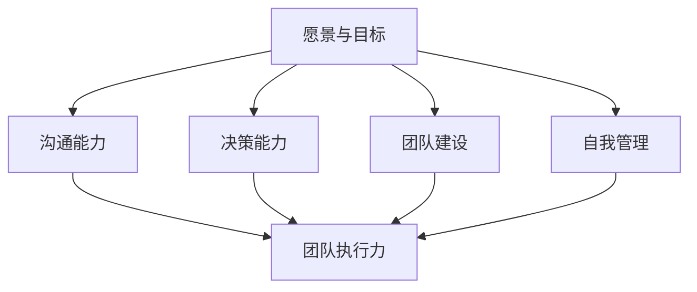

                 

# 领导力修炼笔记：00后职场新星的逆袭之路

## 摘要

本文将探讨00后职场新星如何通过修炼领导力，实现职场逆袭。文章首先介绍00后的背景特点，然后分析领导力的核心要素，接着阐述领导力在职场中的重要性，并通过实际案例，详细解析00后如何运用领导力克服困难，取得成功。最后，文章总结00后领导力修炼的方法与未来职场发展的趋势与挑战。

## 背景介绍

00后，即出生于2000年及以后的一代人，他们成长在一个信息爆炸、互联网普及的时代。与前辈相比，00后具有独特的性格特点和价值观。他们更加独立、自信，追求个性化和自由，更注重个人成长和职业发展。同时，00后也面临更大的竞争压力，他们需要在职场中迅速脱颖而出，实现自我价值。

### 00后的背景特点

00后的成长环境相对优越，大部分是独生子女，从小受到家庭的关爱和培养。他们具有较高的教育水平，更加注重自我实现和人生规划。此外，00后从小就接触互联网，对数字技术有着天然的敏感和兴趣，这为他们在职场上运用新技术提供了便利。

### 00后的职场挑战

尽管00后具备诸多优势，但在职场中他们同样面临着挑战。首先，职场竞争日益激烈，00后需要不断学习和提升自己的能力，才能在激烈的竞争中站稳脚跟。其次，00后在职场中常常遇到年龄歧视和经验不足的问题，这要求他们具备更强的沟通能力和团队合作精神。

## 核心概念与联系

领导力是职场成功的关键因素，它不仅仅是指管理和控制他人的能力，更是一种引领团队、激发潜能的能力。本文将从领导力的核心要素出发，分析领导力在职场中的重要性。

### 领导力的核心要素

1. **愿景与目标**：领导者需要有远大的愿景和明确的目标，这能够激励团队成员共同努力，追求卓越。
2. **沟通能力**：领导者需要具备良好的沟通能力，能够清晰表达自己的想法，倾听他人的意见，建立有效的工作关系。
3. **决策能力**：领导者需要能够迅速做出明智的决策，并且在决策过程中考虑到团队的整体利益。
4. **团队建设**：领导者需要建立和谐、高效的团队氛围，激发团队成员的积极性和创造力。
5. **自我管理**：领导者需要具备强大的自我管理能力，包括时间管理、情绪管理和行为规范。

### 领导力与职场的关系

领导力在职场中至关重要。首先，领导力能够提升团队的执行力，使团队成员能够更有效地完成工作任务。其次，领导力能够激发员工的潜能，提高员工的满意度和忠诚度。最后，领导力能够为团队带来创新和变革，推动企业的发展和进步。

### Mermaid 流程图



## 核心算法原理 & 具体操作步骤

### 领导力修炼的核心算法

领导力修炼的核心算法可以概括为以下几个步骤：

1. **自我认知**：了解自己的优势、劣势、兴趣和价值观，明确自己的职业目标。
2. **持续学习**：不断学习新知识和技能，提升自己的专业素养和综合素质。
3. **实践应用**：将所学知识和技能应用到实际工作中，通过实践不断提升自己的领导能力。
4. **反馈与调整**：定期反思自己的工作表现，接受他人的反馈，根据反馈调整自己的领导风格和行为。
5. **建立人际关系**：积极与他人建立良好的工作关系，拓展自己的人际网络。

### 领导力修炼的具体操作步骤

1. **制定个人发展计划**：根据自己的职业目标，制定详细的个人发展计划，包括学习目标、实践目标和职业发展目标。
2. **寻找导师**：找到一位经验丰富的导师，向他们请教领导力相关问题，获取宝贵的建议和指导。
3. **参加培训课程**：参加领导力相关的培训课程，学习领导力理论和实践技巧。
4. **实践领导力**：在实际工作中，尝试担任项目负责人、团队领导等角色，运用所学知识提升领导力。
5. **反思与总结**：定期对自己的领导行为进行反思和总结，分析成功和失败的原因，不断优化自己的领导方式。

## 数学模型和公式 & 详细讲解 & 举例说明

### 领导力修炼的数学模型

领导力修炼的数学模型可以表示为：

$$
L = f(S, K, P, R)
$$

其中，$L$ 表示领导力（Leadership），$S$ 表示自我认知（Self-awareness），$K$ 表示知识（Knowledge），$P$ 表示实践（Practice），$R$ 表示反思（Reflection）。

### 数学模型的详细讲解

1. **自我认知（$S$）**：自我认知是领导力修炼的基础，它涉及到对自己性格、优势、劣势、价值观的深入了解。自我认知能够帮助领导者明确自己的职业目标和领导风格，为领导力提升提供方向。

2. **知识（$K$）**：知识是领导力的重要组成部分，它包括专业知识、领导力理论、管理技巧等。领导者需要不断学习新知识，提升自己的专业素养和综合素质，以应对复杂多变的职场环境。

3. **实践（$P$）**：实践是领导力提升的关键环节，领导者需要在实际工作中运用所学知识和技能，通过实践不断提升自己的领导能力。实践过程中，领导者需要不断调整自己的领导方式，以适应不同的团队和情境。

4. **反思（$R$）**：反思是领导力修炼的重要环节，它帮助领导者总结工作经验，分析成功和失败的原因，优化自己的领导方式。反思能够使领导者在实践中不断成长和进步。

### 举例说明

假设一名00后职场新星小李，他具备良好的自我认知，知道自己擅长沟通和组织协调。他制定了个人发展计划，包括学习领导力理论和参加实际项目锻炼。在项目中，他担任项目负责人，运用所学知识和技能，带领团队顺利完成工作任务。在工作过程中，他不断反思自己的领导行为，分析成功和失败的原因，逐渐优化自己的领导方式。经过一段时间的领导力修炼，小李的领导力得到了显著提升，得到了团队和上级的认可。

## 项目实战：代码实际案例和详细解释说明

### 开发环境搭建

为了更好地理解领导力修炼在编程项目中的应用，我们将搭建一个简单的Web应用项目。以下是开发环境搭建的步骤：

1. **安装Node.js**：Node.js 是一个基于Chrome V8引擎的JavaScript运行环境，用于搭建Web应用。您可以从 [Node.js官网](https://nodejs.org/) 下载并安装Node.js。

2. **创建项目文件夹**：在您的计算机上创建一个名为`leadership-quiz`的文件夹，用于存放项目文件。

3. **初始化项目**：在项目文件夹中，运行以下命令初始化项目：

   ```bash
   npm init -y
   ```

4. **安装依赖**：安装项目所需的依赖包，例如Express框架和数据库连接模块。在项目文件夹中运行以下命令：

   ```bash
   npm install express mysql
   ```

### 源代码详细实现和代码解读

以下是`leadership-quiz`项目的源代码和详细解释：

```javascript
// 引入依赖
const express = require('express');
const mysql = require('mysql');

// 创建数据库连接
const connection = mysql.createConnection({
  host: 'localhost',
  user: 'root',
  password: 'password',
  database: 'leadership_quiz'
});

// 创建Web应用
const app = express();

// 设置模板引擎
app.set('view engine', 'ejs');

// 设置静态资源目录
app.use(express.static('public'));

// 连接数据库
connection.connect((err) => {
  if (err) {
    console.error('数据库连接失败：', err);
  } else {
    console.log('数据库连接成功！');
  }
});

// 创建路由
app.get('/', (req, res) => {
  res.render('index');
});

app.get('/quiz', (req, res) => {
  connection.query('SELECT * FROM questions', (err, results) => {
    if (err) {
      console.error('查询失败：', err);
    } else {
      res.render('quiz', { questions: results });
    }
  });
});

app.post('/submit', (req, res) => {
  const answers = req.body.answers;
  let score = 0;

  connection.query('SELECT * FROM questions', (err, questions) => {
    if (err) {
      console.error('查询失败：', err);
    } else {
      questions.forEach((question, index) => {
        if (question.answer === answers[index]) {
          score++;
        }
      });
      res.render('result', { score: score });
    }
  });
});

// 启动服务器
const PORT = 3000;
app.listen(PORT, () => {
  console.log(`服务器启动成功，端口：${PORT}`);
});
```

### 代码解读与分析

1. **引入依赖**：首先引入Express和MySQL模块，这两个模块分别用于搭建Web应用和连接数据库。

2. **创建数据库连接**：使用MySQL模块创建数据库连接，配置数据库连接信息，例如主机、用户名、密码和数据库名称。

3. **创建Web应用**：使用Express模块创建Web应用，设置模板引擎、静态资源目录和路由。

4. **路由设置**：
   - `GET /`：处理首页请求，渲染`index`模板。
   - `GET /quiz`：处理问卷调查请求，渲染`quiz`模板，并从数据库中查询问题数据。
   - `POST /submit`：处理提交问卷答案的请求，计算得分，并渲染`result`模板。

5. **启动服务器**：设置服务器端口号，并启动Express Web应用。

通过这个简单的Web应用项目，我们可以看到领导力修炼在项目开发中的应用。项目中的各个模块和功能相互协作，共同实现问卷调查的功能。在开发过程中，开发者需要运用领导力，如沟通能力、团队建设、决策能力等，来协调各方资源，确保项目顺利进行。

## 实际应用场景

领导力在职场中的应用场景非常广泛，以下列举几个典型的实际应用场景：

1. **团队管理**：领导力在团队管理中起着至关重要的作用。优秀的领导者能够激发团队成员的积极性，提高团队执行力，使团队更高效地完成工作任务。

2. **项目领导**：在项目领导中，领导者需要具备决策能力、沟通能力和团队合作精神，确保项目按计划推进，并在遇到问题时能够迅速做出有效的解决方案。

3. **危机应对**：在职场中，领导者需要面对各种危机和挑战。优秀的领导力能够帮助领导者迅速应对危机，稳定团队情绪，找到解决问题的方法。

4. **跨部门协作**：跨部门协作中，领导者需要具备协调能力和沟通能力，协调不同部门之间的工作，确保项目顺利进行。

5. **员工激励**：领导者需要运用领导力来激励员工，提升员工的满意度和忠诚度，为企业创造更大的价值。

## 工具和资源推荐

### 学习资源推荐

1. **书籍**：
   - 《领导力五项修炼》：作者约翰·M·凯斯，详细介绍了领导力的发展过程和核心要素。
   - 《领导力的艺术》：作者史蒂芬·R·科维，阐述了领导力的本质和提升方法。

2. **论文**：
   - 《领导力的特质理论》：作者理查德·赫尔雷格尔和约翰·N·亨德森，分析了领导力的特质理论。
   - 《领导力的情境理论》：作者保罗·赫塞和肯尼斯·布兰查德，探讨了领导力的情境理论。

3. **博客**：
   - [领导力博客](https://www.leadershipblogs.com/)：提供丰富的领导力文章和案例，帮助读者了解领导力的实践应用。

4. **网站**：
   - [领导力研究中心](https://www.centerforleadership.org/)：提供领导力研究的最新成果和培训资源。

### 开发工具框架推荐

1. **框架**：
   - Express：用于构建Web应用的快速、灵活的框架。
   - React：用于构建用户界面的JavaScript库。

2. **数据库**：
   - MySQL：开源的关系型数据库管理系统。
   - MongoDB：开源的NoSQL数据库。

3. **版本控制**：
   - Git：分布式版本控制系统。

4. **代码质量检测**：
   - ESLint：用于检查JavaScript代码质量的工具。

### 相关论文著作推荐

1. **《领导力：理论与实践》**：作者詹姆斯·M·赫斯克特，系统阐述了领导力的理论体系和实践方法。

2. **《情境领导》**：作者保罗·赫塞和肯尼斯·布兰查德，提出了情境领导理论，为领导者提供了实用的领导策略。

## 总结：未来发展趋势与挑战

随着社会和科技的不断发展，00后职场新星在修炼领导力的过程中将面临新的发展趋势和挑战。以下是未来发展趋势与挑战的展望：

### 发展趋势

1. **数字化领导力**：00后在数字化环境下成长，对数字化技术和工具有着天然的敏感和兴趣。未来，数字化领导力将成为领导力发展的新趋势，领导者需要具备数字思维和创新能力。

2. **全球化领导力**：随着全球化进程的加快，00后在职场中将面临更多跨国合作和交流的机会。全球化领导力将注重跨文化沟通、团队合作和全球视野。

3. **可持续领导力**：随着环境问题和社会问题的日益突出，可持续领导力将受到越来越多的关注。领导者需要关注环境保护、社会责任和可持续发展，引导企业和团队实现长期发展。

### 挑战

1. **快速变化的市场环境**：00后在职场中将面临快速变化的市场环境，需要具备快速适应和应对变化的能力。

2. **科技发展的不确定性**：随着科技的快速发展，00后需要不断学习和掌握新技术，以适应不断变化的职场需求。

3. **职业发展的不确定性**：00后在职场中可能面临职业发展的不确定性和挑战，需要具备较强的心理素质和抗压能力。

## 附录：常见问题与解答

### 问题1：00后如何修炼领导力？

**解答**：00后可以通过以下方式修炼领导力：
1. **自我认知**：了解自己的性格、优势和劣势，明确自己的职业目标。
2. **持续学习**：学习领导力理论和实践技巧，提升自己的综合素质。
3. **实践应用**：在实际工作中运用所学知识和技能，提升领导能力。
4. **反馈与调整**：定期反思自己的工作表现，接受他人的反馈，不断优化自己的领导方式。

### 问题2：领导力在职场中有什么重要性？

**解答**：领导力在职场中的重要性体现在以下几个方面：
1. **提升团队执行力**：领导者能够激发团队成员的积极性，提高团队执行力，使团队更高效地完成工作任务。
2. **激发员工潜能**：领导者能够挖掘员工的潜能，提高员工的满意度和忠诚度，为企业创造更大的价值。
3. **推动企业变革**：领导者能够引领企业变革，推动企业持续发展和进步。

### 问题3：如何培养领导力？

**解答**：培养领导力可以通过以下途径：
1. **学习领导力理论和实践技巧**：通过阅读相关书籍、参加培训课程等方式学习领导力知识。
2. **实践领导力**：在实际工作中担任项目负责人、团队领导等角色，运用所学知识和技能提升领导能力。
3. **反思与总结**：定期反思自己的工作表现，分析成功和失败的原因，不断优化自己的领导方式。

## 扩展阅读 & 参考资料

1. **《领导力的五项修炼》**：约翰·M·凯斯，机械工业出版社，2014年。
2. **《领导力的艺术》**：史蒂芬·R·科维，中国社会科学出版社，2012年。
3. **《领导力的特质理论》**：理查德·赫尔雷格尔、约翰·N·亨德森，哈佛商学院出版社，1998年。
4. **《领导力的情境理论》**：保罗·赫塞、肯尼斯·布兰查德，哈佛商学院出版社，1998年。
5. **《情境领导》**：保罗·赫塞、肯尼斯·布兰查德，中国社会科学出版社，2008年。
6. **领导力研究中心**：[官方网站](https://www.centerforleadership.org/)。
7. **Express框架**：[官方网站](https://expressjs.com/)。
8. **React框架**：[官方网站](https://reactjs.org/)。
9. **Git**：[官方网站](https://git-scm.com/)。
10. **ESLint**：[官方网站](https://eslint.org/)。

