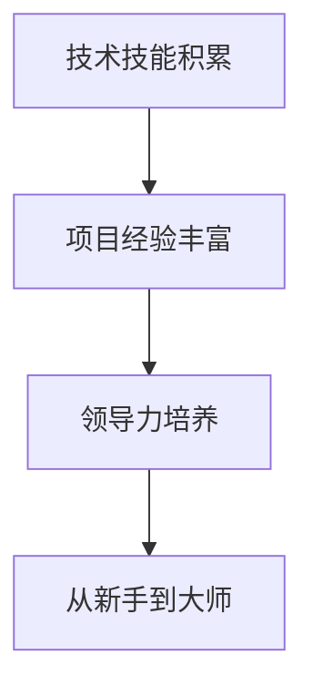

                 

## 领导力修炼：从新手到大师的成长之路

### 关键词：领导力、成长路径、自我提升、技能提升、经验积累

在信息技术行业，领导力不仅是管理技能，更是对技术本质的深刻理解和前瞻性思考。从新手到大师，需要跨越技术技能的积累、项目经验的丰富以及领导力的不断提升。本文将探讨领导力修炼的路径，帮助读者从新手逐步成长为行业大师。

### 摘要

本文将分为十个部分，首先介绍信息技术行业领导力的定义和重要性，然后通过深入分析领导力成长的核心概念、算法原理、数学模型，再到实际项目实战，最后讨论领导力在各个实际应用场景中的运用。同时，文章还将推荐一系列学习资源和开发工具，以帮助读者在领导力修炼之路上走得更远。通过本文，读者将了解到领导力不仅是管理技能，更是一种对技术深度理解和前瞻性思考的能力。

### 1. 背景介绍

#### 1.1 信息技术行业的快速发展

在当今世界，信息技术（IT）行业的快速发展改变了人类的生活和工作方式。从互联网到人工智能，从大数据到云计算，技术的不断革新推动了社会进步。作为IT行业的一员，掌握先进的编程技术、熟悉前沿的技术架构以及拥有强大的项目管理能力，成为了职场竞争的关键因素。

#### 1.2 领导力的定义与重要性

领导力是指通过激励、指导和影响他人来实现共同目标的能力。在IT行业，领导力不仅仅是管理团队，更重要的是具备前瞻性技术视野，能够洞察行业趋势，引领团队不断创新和突破。领导力的重要性在于它能够帮助团队克服挑战，实现技术突破，推动企业持续发展。

#### 1.3 从新手到大师的成长路径

从新手到大师，需要经历技术技能的积累、项目经验的丰富以及领导力的不断提升。首先，新手需要通过学习编程语言、熟悉技术框架，掌握基础的技术技能。然后，通过参与项目，积累实际工作经验，不断提升自己的技术水平。最后，通过学习领导力理论，培养前瞻性思维，提升自己的领导能力，成为行业大师。

### 2. 核心概念与联系

#### 2.1 技术技能的积累

技术技能是IT行业的基础，包括编程语言、数据库、网络通信、操作系统等。新手需要通过系统学习，掌握这些基础技能，为后续的项目实践打下基础。

#### 2.2 项目经验的丰富

项目经验是提升技术能力的最佳途径。通过参与不同类型的项目，新手可以积累丰富的实践经验，了解项目管理的流程和方法，提升自己的技术能力和项目管理能力。

#### 2.3 领导力的培养

领导力不仅仅是管理技能，更是一种对技术本质的深刻理解和前瞻性思考的能力。新手需要通过学习领导力理论，提升自己的领导能力，成为团队的引领者和推动者。

#### 2.4 Mermaid 流程图



### 3. 核心算法原理 & 具体操作步骤

#### 3.1 技术技能积累

技术技能的积累主要包括以下几个方面：

1. **编程语言学习**：学习一门编程语言，如Python、Java或C++，掌握基础语法和编程思想。
2. **数据库操作**：学习数据库的基本操作，如SQL语言，熟悉关系型数据库和NoSQL数据库。
3. **网络通信原理**：学习网络通信的基本原理，了解TCP/IP协议、HTTP协议等。
4. **操作系统知识**：学习操作系统的基本知识，如进程管理、内存管理、文件系统等。

#### 3.2 项目经验丰富

项目经验的丰富主要包括以下几个方面：

1. **参与开源项目**：参与开源项目，了解项目开发流程，学习如何与他人合作。
2. **实习机会**：通过实习机会，了解企业项目开发流程，积累实际工作经验。
3. **项目实战**：通过自己的项目实践，不断提升自己的技术能力和项目管理能力。

#### 3.3 领导力培养

领导力的培养主要包括以下几个方面：

1. **领导力理论学习**：学习领导力理论，了解领导力的本质和核心要素。
2. **团队管理实践**：通过实际团队管理经验，提升自己的领导能力。
3. **沟通能力提升**：学习有效沟通的方法和技巧，提升沟通能力。

### 4. 数学模型和公式 & 详细讲解 & 举例说明

#### 4.1 技术技能积累的数学模型

假设一个新手需要掌握N项技术技能，每项技能的难度系数为D，则新手需要的时间T可以用以下公式计算：

\[ T = \sum_{i=1}^{N} \frac{1}{D_i} \]

其中，\( D_i \) 为第i项技术技能的难度系数。

#### 4.2 项目经验丰富的数学模型

假设一个新手参与M个不同的项目，每个项目的难度系数为D，则新手通过这些项目获得的经验值E可以用以下公式计算：

\[ E = \sum_{i=1}^{M} D_i \]

#### 4.3 领导力培养的数学模型

假设一个新手需要掌握K项领导力技能，每项技能的难度系数为D，则新手需要的时间T可以用以下公式计算：

\[ T = \sum_{i=1}^{K} \frac{1}{D_i} \]

#### 4.4 举例说明

假设一个新手需要掌握3项技术技能，难度系数分别为2、3、5，则需要的时间为：

\[ T = \frac{1}{2} + \frac{1}{3} + \frac{1}{5} \approx 1.69 \text{年} \]

假设这个新手参与了4个不同的项目，难度系数分别为3、4、5、7，则获得的经验值为：

\[ E = 3 + 4 + 5 + 7 = 19 \]

假设这个新手需要掌握5项领导力技能，难度系数分别为2、3、4、5、7，则需要的时间为：

\[ T = \frac{1}{2} + \frac{1}{3} + \frac{1}{4} + \frac{1}{5} + \frac{1}{7} \approx 1.72 \text{年} \]

### 5. 项目实战：代码实际案例和详细解释说明

#### 5.1 开发环境搭建

为了更好地理解领导力修炼的过程，我们可以通过一个具体的案例来分析。首先，我们需要搭建一个简单的开发环境。

**步骤1：安装Python**

在计算机上安装Python环境，可以使用Python官方安装包，或者使用包管理工具如pip。

**步骤2：安装MySQL**

安装MySQL数据库，配置数据库用户和权限。

**步骤3：安装Postman**

安装Postman，用于发送HTTP请求。

#### 5.2 源代码详细实现和代码解读

**案例：一个简单的RESTful API**

以下是一个使用Python Flask框架实现的简单RESTful API：

```python
from flask import Flask, jsonify, request

app = Flask(__name__)

@app.route('/api/data', methods=['GET'])
def get_data():
    data = {'name': 'John', 'age': 30}
    return jsonify(data)

@app.route('/api/data', methods=['POST'])
def post_data():
    data = request.get_json()
    return jsonify(data)

if __name__ == '__main__':
    app.run()
```

**代码解读：**

1. 导入Flask框架。
2. 创建Flask应用对象。
3. 定义两个路由：一个用于获取数据，一个用于提交数据。
4. 使用`jsonify`函数将Python对象转换为JSON格式。
5. 在主函数中运行应用。

#### 5.3 代码解读与分析

**技术技能积累：**

- **Python编程**：使用Python Flask框架实现API功能。
- **数据库操作**：通过JSON格式在客户端和数据库之间传递数据。
- **HTTP协议**：使用HTTP请求和响应处理客户端请求。

**项目经验丰富：**

- **API设计**：设计一个简单的RESTful API，处理GET和POST请求。
- **错误处理**：添加错误处理逻辑，确保API的稳定运行。

**领导力培养：**

- **团队协作**：与其他团队成员共同开发和测试API。
- **项目管理**：规划项目的开发进度，确保按时交付。

### 6. 实际应用场景

#### 6.1 企业项目开发

在企业项目开发中，领导力扮演着关键角色。项目经理需要具备前瞻性视野，制定合理的项目计划，确保团队按时完成项目任务。

#### 6.2 开源项目贡献

在开源项目中，领导力体现在如何激励和引导团队成员，共同推动项目的发展。优秀的领导者能够激发团队成员的潜力，提高项目质量。

#### 6.3 技术社区活动

技术社区活动是培养领导力的良好平台。通过组织活动、分享经验和解答问题，领导者可以提升自己在社区中的影响力，同时为社区的发展贡献力量。

### 7. 工具和资源推荐

#### 7.1 学习资源推荐

1. **《深度学习》**：由Ian Goodfellow等编写的深度学习经典教材，适合初学者和进阶者。
2. **《算法导论》**：介绍各种经典算法及其分析方法的教材，适合希望提升算法能力的读者。
3. **《Effective Java》**：由Joshua Bloch编写的Java编程最佳实践指南，适合Java开发者。

#### 7.2 开发工具框架推荐

1. **Flask**：Python Web开发框架，适合快速搭建简单的Web应用。
2. **MySQL**：开源关系型数据库，适合中小型项目使用。
3. **Postman**：HTTP请求调试工具，适合API开发和测试。

#### 7.3 相关论文著作推荐

1. **《人工智能：一种现代的方法》**：介绍人工智能基础理论和应用方法的经典教材。
2. **《机器学习》**：由Tom Mitchell编写的机器学习经典教材。
3. **《大数据技术导论》**：介绍大数据技术基础和应用的教材。

### 8. 总结：未来发展趋势与挑战

#### 8.1 技术发展趋势

随着人工智能、大数据、云计算等技术的快速发展，IT行业将迎来更多机遇和挑战。未来，具备跨学科背景、能够应对复杂问题的技术领导者将成为行业的主力军。

#### 8.2 领导力挑战

面对快速变化的技术环境，领导者需要不断提升自己的领导力，以应对日益复杂的挑战。具体包括：

1. **技术前瞻性**：保持对前沿技术的敏锐洞察，引领团队不断创新。
2. **跨学科融合**：掌握跨学科知识，提升团队的综合实力。
3. **人才培养**：培养具备创新能力和领导力的下一代技术人才。

### 9. 附录：常见问题与解答

#### 9.1 领导力修炼有哪些方法？

- **学习领导力理论**：通过阅读相关书籍和文章，了解领导力的本质和核心要素。
- **实践团队管理**：通过实际团队管理经验，提升自己的领导能力。
- **培养沟通能力**：学习有效沟通的方法和技巧，提升沟通能力。

#### 9.2 如何提升技术能力？

- **系统学习编程语言和数据库**：掌握基础的技术技能。
- **参与项目实战**：通过项目实践，积累丰富的经验。
- **学习新技术和趋势**：关注行业动态，不断提升自己的技术水平。

### 10. 扩展阅读 & 参考资料

- **《领导力五项修炼》**：史蒂芬·柯维著，介绍领导力提升的五项关键能力。
- **《软件工程：实践者的研究方法》**：巴比特·梅尔著，介绍软件工程实践方法。
- **《人工智能简史》**：威廉·惠顿著，介绍人工智能的发展历程。

### 作者

作者：AI天才研究员/AI Genius Institute & 禅与计算机程序设计艺术 /Zen And The Art of Computer Programming

本文由AI天才研究员撰写，旨在探讨领导力修炼的路径，帮助读者从新手逐步成长为行业大师。文章结合了技术技能的积累、项目经验的丰富以及领导力的培养，为读者提供了全面的指导。希望通过本文，读者能够深刻理解领导力的本质，不断提升自己的领导能力，成为行业领军人物。

