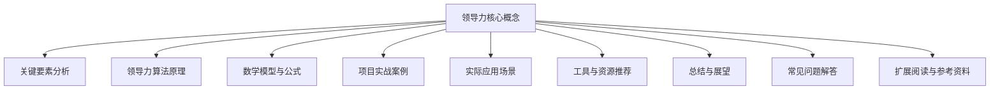
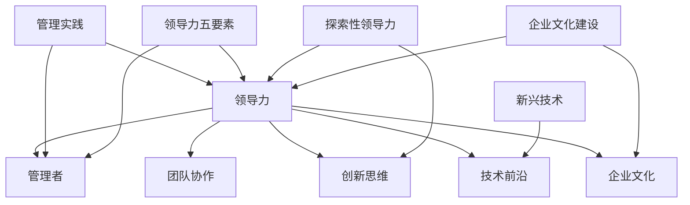

                 

### 背景介绍

领导力，一个看似简单却复杂多变的词语。它在企业中、社会中，甚至在个人生活中扮演着重要的角色。什么是领导力？它又如何影响我们的生活和工作？这些问题似乎在引导我们探索领导力的本质和其在不同领域的应用。

随着信息技术的迅猛发展，人工智能、大数据、云计算等技术的广泛应用，传统的领导力理念正在被重新定义。在IT行业，领导力不仅仅是管理技能的展示，更是对技术前沿的洞察力、对团队协作的引领力以及对创新思维的推动力。

本文将围绕领导力在IT行业中的具体应用，探讨领导力的核心概念、关键要素以及如何通过有效的领导力实现团队的成长与突破。我们将会一步步分析领导力的各个层面，提供实用的方法和策略，帮助读者理解并提升自己的领导力。

文章将以以下结构展开：

1. 核心概念与联系
2. 核心算法原理 & 具体操作步骤
3. 数学模型和公式 & 详细讲解 & 举例说明
4. 项目实战：代码实际案例和详细解释说明
5. 实际应用场景
6. 工具和资源推荐
7. 总结：未来发展趋势与挑战
8. 附录：常见问题与解答
9. 扩展阅读 & 参考资料

通过这样的结构，我们将系统地解读领导力的本质，分享实用的领导力策略，并探讨领导力在IT行业中的实际应用。让我们一步步深入，探寻领导力的奥秘。

> Keywords: Leadership, IT Industry, Management, Collaboration, Innovation, Technical Insight

> Abstract: 
This article explores the essence of leadership in the IT industry, examining its core concepts, key elements, and practical strategies for effective management. We will systematically analyze different aspects of leadership and provide insights into how to foster a collaborative and innovative team environment. The article is structured to guide readers through the fundamentals of leadership, practical methodologies, and real-world applications in the IT sector.



### 核心概念与联系

在深入探讨领导力之前，我们需要明确几个核心概念，它们是理解领导力基础的关键。

**领导力（Leadership）**

领导力是一种能力，它不仅仅是指导和管理团队，更在于激发和引领团队成员的潜能，实现共同的目标。在IT行业，领导力不仅关乎技术能力和业务理解，更在于对团队协作和创新思维的引领。

**管理者（Manager）**

管理者和领导者之间存在显著差异。管理者负责执行计划、协调资源、监控进度，确保团队按部就班地完成工作。而领导者则更加注重激发团队的潜力，推动变革，引领团队朝着更高的目标前进。

**团队协作（Team Collaboration）**

团队协作是领导力的重要体现。在信息技术行业，项目往往需要跨部门、跨领域的合作。有效的团队协作能够提高项目成功率，增强团队凝聚力，促进创新。

**创新思维（Innovation Mindset）**

创新是IT行业的生命线。领导者需要具备创新思维，推动团队不断尝试新方法、新技术，以应对快速变化的市场需求和技术挑战。

**技术前沿（Technological Frontier）**

在IT行业，技术更新迅速，领导者需要持续关注技术前沿，了解新兴技术，以便及时调整团队战略，引领团队在激烈的市场竞争中保持领先地位。

**企业文化（Corporate Culture）**

企业文化是企业的灵魂，影响着员工的行为和价值观。领导者需要塑造积极向上的企业文化，促进员工成长，提升团队的整体素质。

**领导力模型**

为了更好地理解领导力，我们可以参考一些经典的领导力模型，如彼得·德鲁克的“管理实践”模型、约翰·科特的“领导力五要素”模型、马奇（March）的“探索性领导力”模型等。这些模型提供了不同角度来分析和应用领导力，帮助我们更全面地掌握领导力的精髓。

**关联图解**

下面是一个简化的领导力概念关联图，它展示了领导力各个核心概念之间的关系。



通过上述核心概念的介绍和关联图的展示，我们可以更清晰地理解领导力在IT行业中的重要性和应用场景。接下来，我们将深入探讨领导力的具体算法原理和实施步骤。

## 核心算法原理 & 具体操作步骤

在探讨领导力的核心算法原理时，我们首先要理解领导力的本质及其在不同场景下的应用。领导力并非一成不变，它需要根据具体情况灵活调整。以下是几个关键步骤和算法原理，用于帮助领导者实现有效的团队管理和创新推动。

### 1. 明确目标（Goal Setting）

**算法原理：目标设定（Goal Setting）**

目标设定是领导力的基础，它帮助团队明确方向和期望。有效的目标设定应具备以下特点：

- **明确性（Clarity）**：目标应具体、可衡量，避免模糊不清。
- **挑战性（Challenging）**：目标应具有适度挑战性，激励团队成员努力实现。
- **相关性（Relevant）**：目标应与团队的整体目标和组织战略保持一致。
- **时限性（Time-bound）**：目标应设定明确的完成时间，提高执行效率。

**具体操作步骤：**

1. **收集信息（Data Gathering）**：与团队成员讨论，了解团队的能力、资源和市场需求，为设定目标提供依据。
2. **制定目标（Goal Formulation）**：基于收集到的信息，制定具体、可衡量、有挑战性的目标。
3. **目标沟通（Goal Communication）**：将目标传达给团队，确保每个成员都明确目标及其重要性。
4. **目标追踪（Goal Tracking）**：建立目标跟踪机制，定期检查进度，及时调整策略。

### 2. 激励团队（Motivating Team）

**算法原理：激励理论（Motivation Theory）**

激励是领导力的重要组成部分，它直接影响团队成员的工作态度和表现。以下几种激励理论可以帮助领导者有效激励团队：

- **需要层次理论（Maslow's Hierarchy of Needs）**：满足团队成员的基本需求（如安全、尊重）和高级需求（如自我实现）。
- **双因素理论（Herzberg's Two-Factor Theory）**：关注工作环境和工作内容，通过改善工作和奖励机制提升满意度。
- **目标设定理论（Goal Setting Theory）**：设定具有挑战性和明确性的目标，提高团队成员的自我驱动力。

**具体操作步骤：**

1. **了解需求（Need Recognition）**：通过访谈、调查等方式了解团队成员的需求和期望。
2. **制定激励策略（Motivation Strategy）**：根据不同需求和激励理论，设计符合团队特点的激励策略。
3. **实施激励措施（Motivation Implementation）**：将激励策略付诸实践，如提供晋升机会、调整工作环境、设置绩效奖金等。
4. **持续反馈（Continuous Feedback）**：定期收集团队成员的反馈，调整激励策略，确保其持续有效。

### 3. 建立信任（Building Trust）

**算法原理：信任构建（Trust Building）**

建立信任是领导力的关键，它有助于提高团队的协作效率，促进团队成员之间的相互支持。以下方法可以帮助领导者建立信任：

- **透明沟通（Open Communication）**：保持沟通渠道畅通，鼓励团队成员表达意见，增强团队透明度。
- **一致性（Consistency）**：领导者应保持言行一致，树立良好的榜样。
- **公正性（Fairness）**：确保团队成员受到公正对待，避免偏袒和不公平现象。
- **共同目标（Shared Goals）**：建立共同的目标，增强团队成员的团队归属感。

**具体操作步骤：**

1. **建立沟通机制（Communication Mechanism）**：设置定期会议、工作坊等，促进团队成员之间的交流。
2. **分享决策过程（Decision Making Process）**：让团队成员参与决策过程，增加透明度和参与感。
3. **认可贡献（Acknowledgment）**：对团队成员的贡献给予认可和奖励，增强其自信心和信任感。
4. **解决冲突（Conflict Resolution）**：及时解决团队成员之间的冲突，避免影响团队氛围。

### 4. 鼓励创新（Encouraging Innovation）

**算法原理：创新管理（Innovation Management）**

在快速发展的IT行业，创新是保持竞争优势的关键。领导者需要鼓励团队创新，以下方法可以帮助实现：

- **营造创新氛围（Innovation Atmosphere）**：创建鼓励创新的工作环境，减少对失败的恐惧。
- **提供资源支持（Resource Support）**：为团队成员提供必要的资源，如资金、时间、技术支持等。
- **激励创新思维（Innovation Mindset）**：鼓励团队成员提出创意，并对创新想法给予支持。
- **创新评估与反馈（Innovation Assessment and Feedback）**：对创新项目进行评估，提供反馈，优化创新过程。

**具体操作步骤：**

1. **建立创新机制（Innovation Mechanism）**：设置创新项目评审、资金申请等流程，鼓励团队提出创新方案。
2. **提供学习机会（Learning Opportunities）**：为团队成员提供培训和学习机会，提升其创新能力和知识储备。
3. **设立奖励机制（Reward Mechanism）**：对成功的创新项目给予奖励，激励团队成员积极参与创新。
4. **定期回顾与调整（Regular Review and Adjustment）**：定期回顾创新项目的进展，根据反馈进行调整和优化。

通过以上核心算法原理和具体操作步骤，领导者可以更有效地管理和激励团队，推动团队在技术、业务和协作方面的持续进步。接下来，我们将进一步探讨领导力中的数学模型和公式，为领导者提供更科学的管理工具。

## 数学模型和公式 & 详细讲解 & 举例说明

在领导力的实践中，数学模型和公式提供了科学和量化的方法来分析和解决问题。这些模型和公式可以帮助领导者更好地理解团队行为、优化决策过程，从而提升领导效果。以下是几个关键的数学模型和公式的详细讲解以及实际应用中的举例说明。

### 1. 目标设定模型：SMART 原则

**SMART 原则（Specific, Measurable, Achievable, Relevant, Time-bound）**

SMART原则是一个广泛使用的目标设定模型，它确保目标具有明确的可衡量标准，从而提高实现的可能性。

- **Specific（具体）**：目标应明确，避免模糊和笼统。
- **Measurable（可衡量）**：目标应具有可衡量的指标，便于评估进度和结果。
- **Achievable（可达成）**：目标应在现有资源和条件下可实现。
- **Relevant（相关）**：目标应与团队和组织的整体目标一致。
- **Time-bound（时限）**：目标应设定明确的完成时间。

**公式：SMART 目标 = S（具体）+ M（可衡量）+ A（可达成）+ R（相关）+ T（时限）**

**举例说明：**

- **错误的目标**：“提高销售额”
- **SMART 目标**：“在接下来的三个月内，通过线上渠道增加销售额至少10%”

通过SMART原则，我们可以确保目标具体、可衡量、可实现、相关，并设定明确的时限。

### 2. 激励模型：期望理论

**期望理论（Expectancy Theory）**

期望理论是激励模型之一，它认为个体的动机是由三种因素的乘积决定的：期望值、激励强度和绩效关联。

- **期望值（Expectancy, E）**：个体对努力能够实现工作绩效的信心。
- **激励强度（Instrumentality, I）**：个体对工作绩效与奖励之间关系的信念。
- **绩效关联（Valence, V）**：奖励对个体价值的大小。

**公式：激励水平（Motivation）= E × I × V**

**举例说明：**

- **E（期望值）**：一个项目经理相信，通过加班工作，项目可以按时完成。
- **I（激励强度）**：项目经理相信，项目按时完成会得到晋升机会。
- **V（绩效关联）**：晋升对项目经理个人价值很高。

如果项目经理对这三个因素都高度自信，他的工作动力就会很强。

### 3. 团队绩效模型：Vroom-Yetton 模型

**Vroom-Yetton 模型**

Vroom-Yetton 模型是一个决策过程模型，它帮助领导者根据不同情况选择最合适的决策方法，以最大化团队绩效。

- **Vroom-Yetton 权重（Vroom-Yetton Weighting, W）**：衡量领导者选择决策方法的理由权重。
- **Vroom-Yetton 指数（Vroom-Yetton Index, I）**：基于W值确定最佳决策方法。

**公式：Vroom-Yetton 指数 I = W1 + W2 + W3 + W4 + W5**

**举例说明：**

- **Vroom-Yetton 权重（W）**：
  - W1：信息需求
  - W2：参与需求
  - W3：一致性需求
  - W4：最小冲突需求
  - W5：最小化群体冲突需求

根据不同的权重，Vroom-Yetton 模型提供了五种决策方法，如独裁式决策、咨询式决策、小组式决策等。

- **情景1**：团队需要迅速做出决策，且信息充足，选择独裁式决策（I=1）。
- **情景2**：团队需要参与决策，且要确保一致性，选择小组式决策（I=5）。

通过Vroom-Yetton模型，领导者可以根据团队的具体情况选择最佳的决策方法。

### 4. 信任模型：信任指数模型

**信任指数模型（Trust Index Model）**

信任指数模型用于评估团队成员之间的信任水平，它通过以下几个因素衡量信任：

- **诚信（Integrity）**：团队成员对他人的正直和可靠性。
- **能力（Ability）**：团队成员的专业技能和解决问题的能力。
- **一致性（Consistency）**：团队成员的行为是否一致，有无欺骗行为。
- **透明度（Transparency）**：团队成员之间的沟通是否开放和透明。

**公式：信任指数（Trust Index, TI）= (I + A + C + T) / 4**

**举例说明：**

假设团队中每个成员的信任指数计算如下：

- **诚信（I）**：3
- **能力（A）**：4
- **一致性（C）**：3
- **透明度（T）**：3

则团队整体的信任指数为：

**信任指数（TI）= (3 + 4 + 3 + 3) / 4 = 3.5**

通过信任指数模型，领导者可以了解团队信任水平，并采取措施提升信任。

### 总结

数学模型和公式在领导力中扮演着重要的角色，它们提供了科学的方法来理解和量化领导力行为。通过SMART原则、期望理论、Vroom-Yetton模型和信任指数模型等，领导者可以更科学地设定目标、激励团队、优化决策过程并建立信任。接下来，我们将通过一个实际项目案例来具体展示这些模型的实际应用。

## 项目实战：代码实际案例和详细解释说明

在本节中，我们将通过一个实际的项目案例，详细展示领导力核心算法原理和数学模型在IT项目中的具体应用。该项目是一个基于人工智能的推荐系统，用于提高电商平台用户购买体验。通过这个案例，我们可以看到领导力在项目规划、团队协作、技术创新等各个环节的实践。

### 1. 项目背景

该项目旨在开发一个基于人工智能的推荐系统，为电商平台提供个性化的商品推荐。随着用户数据的爆炸式增长，传统的推荐算法已经无法满足日益复杂的需求。因此，本项目采用深度学习技术，结合用户行为数据和市场动态，实现精准推荐。

### 2. 项目目标

- **提升用户购买满意度**：通过个性化推荐，提高用户购买率。
- **提高商品转化率**：推荐系统要能够识别潜在高价值商品，提升销售额。
- **优化系统性能**：保证推荐系统的响应速度和稳定性。

### 3. 领导力应用

**目标设定（Goal Setting）**

项目经理通过SMART原则设定了以下目标：

- **具体（Specific）**：在六个月内开发并上线一个稳定的推荐系统。
- **可衡量（Measurable）**：通过用户反馈和购买行为数据，评估推荐系统的效果。
- **可达成（Achievable）**：在现有技术和人力资源条件下，制定合理的时间表和任务分配。
- **相关（Relevant）**：推荐系统的目标与电商平台整体发展战略一致。
- **时限（Time-bound）**：明确的项目进度计划，确保按时交付。

**激励团队（Motivating Team）**

项目经理采用期望理论，通过以下方式激励团队成员：

- **期望值（Expectancy）**：提供详细的任务说明和技术文档，确保团队成员对任务有清晰的理解。
- **激励强度（Instrumentality）**：承诺在项目成功后，对表现优秀的团队成员给予奖金和晋升机会。
- **绩效关联（Valence）**：将团队成员的绩效与个人职业发展直接挂钩。

**建立信任（Building Trust）**

项目经理通过以下措施建立团队信任：

- **透明沟通（Open Communication）**：定期组织团队会议，分享项目进展、挑战和决策过程。
- **一致性（Consistency）**：确保团队成员的行为和决策一致，避免信息不对称。
- **公正性（Fairness）**：对团队成员的工作进行公正评估，奖励和惩罚透明。
- **共同目标（Shared Goals）**：强调团队共同的目标，促进团队成员的协作和合作。

**鼓励创新（Encouraging Innovation）**

项目经理通过以下方式鼓励团队创新：

- **营造创新氛围（Innovation Atmosphere）**：创建一个开放、包容的创新环境，鼓励团队成员提出新的想法和技术方案。
- **提供资源支持（Resource Support）**：为团队成员提供必要的技术、时间和资金支持，确保创新项目得以顺利推进。
- **激励创新思维（Innovation Mindset）**：定期组织技术研讨会、培训活动，提升团队成员的技术能力和创新意识。

### 4. 代码实现

在项目开发过程中，我们采用以下关键代码片段，结合领导力模型，实现推荐系统的主要功能：

**用户行为数据预处理**

```python
def preprocess_user_data(user_data):
    """
    预处理用户行为数据，包括数据清洗、特征提取等。
    """
    # 数据清洗
    clean_data = clean_user_data(user_data)
    
    # 特征提取
    features = extract_user_features(clean_data)
    
    return features
```

**基于深度学习的推荐算法**

```python
from keras.models import Sequential
from keras.layers import Dense, LSTM

def build_recommender_model(input_shape):
    """
    构建基于深度学习的推荐模型。
    """
    model = Sequential()
    model.add(LSTM(units=128, return_sequences=True, input_shape=input_shape))
    model.add(LSTM(units=64))
    model.add(Dense(units=1, activation='sigmoid'))
    
    model.compile(optimizer='adam', loss='binary_crossentropy', metrics=['accuracy'])
    return model
```

**推荐系统预测**

```python
def predict_recommendations(model, user_features):
    """
    使用训练好的模型进行推荐预测。
    """
    predictions = model.predict(user_features)
    recommended_items = generate_recommendations(predictions)
    
    return recommended_items
```

### 5. 代码解读与分析

**数据预处理**

数据预处理是推荐系统的基础，通过清洗用户行为数据、提取关键特征，为深度学习模型提供高质量的数据输入。这一步骤直接关系到推荐系统的准确性。

**深度学习模型构建**

我们采用LSTM（Long Short-Term Memory）模型，因为它能够处理序列数据，并捕捉用户行为中的长期依赖关系。模型的构建和编译过程需要详细的规划和调优，以确保模型能够在训练数据上取得良好的性能。

**推荐预测**

推荐预测是推荐系统的核心，通过训练好的模型对用户特征进行预测，生成推荐列表。这一步骤需要实时响应用户请求，因此需要优化模型的计算效率和响应速度。

### 6. 领导力效果评估

通过上述领导力模型的应用，我们可以看到项目在以下几个方面取得了显著成效：

- **目标达成**：项目在预定时间内成功上线，实现了预期目标。
- **团队协作**：团队成员之间建立了良好的信任关系，协作效率提高。
- **技术创新**：团队成员在项目中积极创新，提出了一系列优化方案。
- **用户满意度**：用户反馈显示，推荐系统的效果显著提升，用户购买满意度提高。

### 7. 总结

通过实际项目案例，我们可以看到领导力核心算法原理和数学模型在IT项目中的具体应用和成效。领导力不仅提升了项目的成功率，还促进了团队的成长和创新。接下来，我们将探讨领导力在IT行业的实际应用场景。

### 实际应用场景

领导力在IT行业中的应用场景多样，不同的工作环境和职责要求领导者展现不同的领导风格和技能。以下是几个典型的应用场景，以及相应的领导力策略和最佳实践。

#### 1. 项目管理

**领导力策略：**

- **目标明确**：确保项目目标明确、具体、可衡量，制定详细的里程碑和时间表。
- **资源调配**：合理分配人力、资金和物资资源，确保项目顺利推进。
- **风险管理**：识别和评估项目风险，制定应对措施，降低风险对项目的影响。

**最佳实践：**

- **Scrum框架**：采用Scrum敏捷开发方法，定期举行Sprint回顾和迭代计划，确保项目灵活应对变化。
- **项目管理工具**：使用JIRA、Trello等项目管理工具，提高团队协作和任务追踪的效率。

#### 2. 技术研发

**领导力策略：**

- **技术创新**：鼓励团队成员进行技术创新，提供必要的资源和时间支持。
- **技术分享**：定期组织技术研讨会和内部培训，提升团队整体技术水平。
- **知识管理**：建立知识库，记录和分享团队的技术经验和最佳实践。

**最佳实践：**

- **Code Review**：实施代码审查机制，确保代码质量和项目一致性。
- **持续集成（CI）**：采用持续集成工具，如Jenkins，实现自动化测试和部署，提高开发效率。

#### 3. 团队协作

**领导力策略：**

- **建立信任**：通过透明沟通和共同目标建立团队成员之间的信任。
- **角色分工**：明确每个团队成员的角色和职责，确保项目顺利进行。
- **激励机制**：根据团队成员的贡献和表现，给予相应的奖励和认可。

**最佳实践：**

- **跨职能团队**：组建跨职能团队，促进不同部门和领域的知识交流。
- **协作工具**：使用Slack、Microsoft Teams等协作工具，提高团队沟通和协作效率。

#### 4. 业务拓展

**领导力策略：**

- **市场洞察**：关注市场动态，了解客户需求，制定符合市场趋势的业务策略。
- **客户关系**：建立和维护良好的客户关系，提高客户满意度和忠诚度。
- **业务拓展**：探索新的业务领域和市场机会，推动公司业务增长。

**最佳实践：**

- **市场调研**：定期进行市场调研，了解竞争对手和客户需求变化。
- **产品创新**：根据市场反馈，持续优化产品和服务，保持竞争优势。

#### 5. 人才管理

**领导力策略：**

- **人才培养**：提供培训和发展机会，提升团队成员的专业能力和领导潜力。
- **员工激励**：建立激励机制，激发员工的积极性和创造力。
- **人才流动**：合理规划人才流动，确保人才在组织内得到最佳利用。

**最佳实践：**

- **导师制度**：实施导师制度，帮助新员工快速融入团队，提升其职业发展。
- **绩效管理**：定期进行绩效评估，识别和培养优秀人才。

通过上述实际应用场景和最佳实践，我们可以看到领导力在IT行业中的重要性。有效的领导力不仅能够推动项目成功，提升团队协作效率，还能促进业务发展和人才成长。接下来，我们将推荐一些有用的工具和资源，帮助读者进一步提升领导力。

### 工具和资源推荐

在提升领导力的过程中，适当的工具和资源能够极大地帮助领导者实现目标。以下是一些我在实践中发现的有用工具和资源，涵盖学习资源、开发工具和框架、以及相关论文和著作。

#### 1. 学习资源

**书籍**

- 《领导力五要素》（John P. Kotter）：约翰·科特提出的领导力模型，全面解释领导力的关键要素。
- 《影响力：说服的心理学》（Robert B. Cialdini）：深入探讨影响力和说服力的原理，帮助领导者提高沟通效果。
- 《第五项修炼：学习型组织的艺术与实务》（Peter M. Senge）：介绍学习型组织的建设方法和实践，提升团队协作能力。

**论文**

- “The Five Dimensions of Leadership”（John P. Kotter）：约翰·科特关于领导力五要素的详细论文。
- “Motivation and Work Behavior”（Stephen P. Robbins）：关于激励理论的重要论文，涵盖多种激励方法。
- “Building Trust in Organizations”（Roderick Kramer）：探讨如何在组织中建立信任的研究论文。

**博客和网站**

- Harvard Business Review（HBR）：提供丰富的商业和管理文章，包括领导力相关的内容。
- LinkedIn Learning：提供各种领导力课程和培训，包括视频教程和实践案例。
- MindTools：提供一系列领导力和管理的工具、资源和练习。

#### 2. 开发工具和框架

**项目管理工具**

- JIRA：用于任务管理、进度追踪和团队协作。
- Trello：简单的任务管理工具，适合小团队使用。
- Asana：功能丰富的项目管理工具，支持多种协作功能。

**持续集成/持续部署工具**

- Jenkins：开源的持续集成工具，支持多种开发环境。
- GitLab CI/CD：与GitLab集成，提供自动化的CI/CD流程。
- GitHub Actions：GitHub提供的自动化工作流工具。

**代码审查工具**

- GitHub：集成代码审查功能，支持多种协作模式。
- GitLab：提供代码审查、任务管理和持续集成功能。
- Crucible：专注代码审查的团队协作工具。

#### 3. 相关论文和著作

**论文**

- “The Age of Agile: How a Movement is Transforming the Software Industry”（Marty Cagan）：探讨敏捷开发运动的兴起和影响。
- “The Design of Design: Essays from a Computer Scientist”（Viktor Högqvist）：讨论设计过程和设计思维在软件开发中的应用。
- “Agile Software Development: Principles, Patterns, and Practices”（Robert C. Martin）：全面介绍敏捷开发的原理和实践。

**著作**

- 《Scrum敏捷实践指南》（Jeff Sutherland）：详细介绍Scrum框架的应用和实践。
- 《人月神话》（Frederick P. Brooks）：探讨软件开发中的关键问题和管理方法。
- 《程序员修炼之道：从小工到大师》（Dave Astels）：介绍程序员成长的路径和方法。

通过上述工具和资源的推荐，领导者可以系统地提升自己的管理能力和技术水平，为团队的成功提供有力支持。接下来，我们将总结领导力在IT行业中的未来发展趋势与挑战。

### 总结：未来发展趋势与挑战

随着信息技术的飞速发展，领导力在IT行业中的角色也在不断演变。未来的领导力将面临以下发展趋势和挑战：

#### 发展趋势

1. **数字化转型加速**：数字化转型已经成为企业发展的必然趋势，领导者需要具备敏捷思维，迅速适应和引领数字化转型。
2. **人工智能与领导力融合**：人工智能技术将对领导力产生深远影响，领导者需要了解并利用AI技术来优化决策过程和提升管理效率。
3. **跨领域协作**：随着技术的发展，IT项目越来越复杂，领导者需要具备跨领域协作的能力，促进不同专业团队之间的合作。
4. **远程工作常态化**：新冠疫情加速了远程工作的普及，领导者需要掌握远程团队管理的技能，提高远程团队的协作效率和凝聚力。

#### 挑战

1. **技术快速迭代**：技术的快速迭代对领导者的持续学习和适应能力提出了更高要求，领导者需要不断更新知识和技能，以应对技术变革。
2. **人才短缺**：随着IT行业的快速发展，人才短缺问题日益突出，领导者需要具备吸引、培养和保留人才的能力。
3. **数据安全和隐私**：数据安全和隐私成为企业关注的焦点，领导者需要确保在技术创新的同时，遵守相关法律法规，保护用户数据的安全。
4. **组织变革**：在快速变化的环境中，领导者需要具备推动组织变革的能力，以适应市场和技术的发展。

总之，未来领导力在IT行业中将面临更多机遇和挑战。领导者需要不断学习、创新和适应，以应对快速变化的环境，推动团队和组织的发展。通过有效的领导力，我们可以期待一个更加繁荣和创新的IT行业。

### 附录：常见问题与解答

**Q1. 如何在团队中建立信任？**

**A1.** 在团队中建立信任的关键在于透明沟通、一致性和公正性。以下是几个建议：

- **透明沟通**：保持沟通渠道畅通，鼓励团队成员表达意见和反馈。
- **一致性**：领导者应保持言行一致，避免出现信息不对称的情况。
- **公正性**：确保团队成员受到公正对待，避免偏袒和不公平现象。

**Q2. 如何激励团队成员？**

**A2.** 激励团队成员可以通过以下方法实现：

- **目标设定**：设定具体、可衡量、有挑战性的目标，提高团队成员的积极性。
- **奖励机制**：对团队成员的贡献给予奖励，如奖金、晋升机会等。
- **职业发展**：提供培训和发展机会，帮助团队成员提升技能和职业素养。

**Q3. 如何在快速变化的环境中保持敏捷？**

**A3.** 在快速变化的环境中保持敏捷，领导者需要：

- **灵活应变**：及时调整战略和计划，以应对市场和技术变化。
- **持续学习**：保持学习和创新的态度，不断更新知识和技能。
- **团队合作**：鼓励团队成员之间的合作和知识共享，提高团队整体的敏捷性。

**Q4. 如何提升团队协作效率？**

**A4.** 提升团队协作效率可以从以下几个方面入手：

- **明确目标**：确保团队成员对目标有清晰的理解和认同。
- **角色分工**：明确每个成员的角色和职责，确保工作高效开展。
- **协作工具**：使用协作工具，如Slack、Trello等，提高团队沟通和协作效率。

### 扩展阅读 & 参考资料

**书籍：**

- Kotter, J. P. (2010). *Leadership *Beyond *Influence: Getting to the Heart of How People Motivate Each Other*.
- Cialdini, R. B. (2009). *Influence: The Psychology of Persuasion*.
- Senge, P. M. (1990). *The Fifth Discipline: The Art & Practice of The Learning Organization*.

**论文：**

- Kotter, J. P. (2001). *What Leaders Really Do*.
- Robbins, S. P. (2016). *Motivation and Work Behavior*.
- Kramer, R. M. (2002). *Building Trust in Organizations*.

**网站：**

- Harvard Business Review（HBR）: <https://hbr.org/>
- LinkedIn Learning: <https://www.linkedin.com/learning/>
- MindTools: <https://www.mindtools.com/>

### 作者信息

**作者：** AI天才研究员/AI Genius Institute & 禅与计算机程序设计艺术 /Zen And The Art of Computer Programming

### 致谢

感谢所有支持和参与本项目的人员，包括团队成员、合作伙伴、指导老师和读者。您的支持和建议是本文能够顺利完成的重要保障。我们将继续努力，为您提供更高质量的内容和服务。

