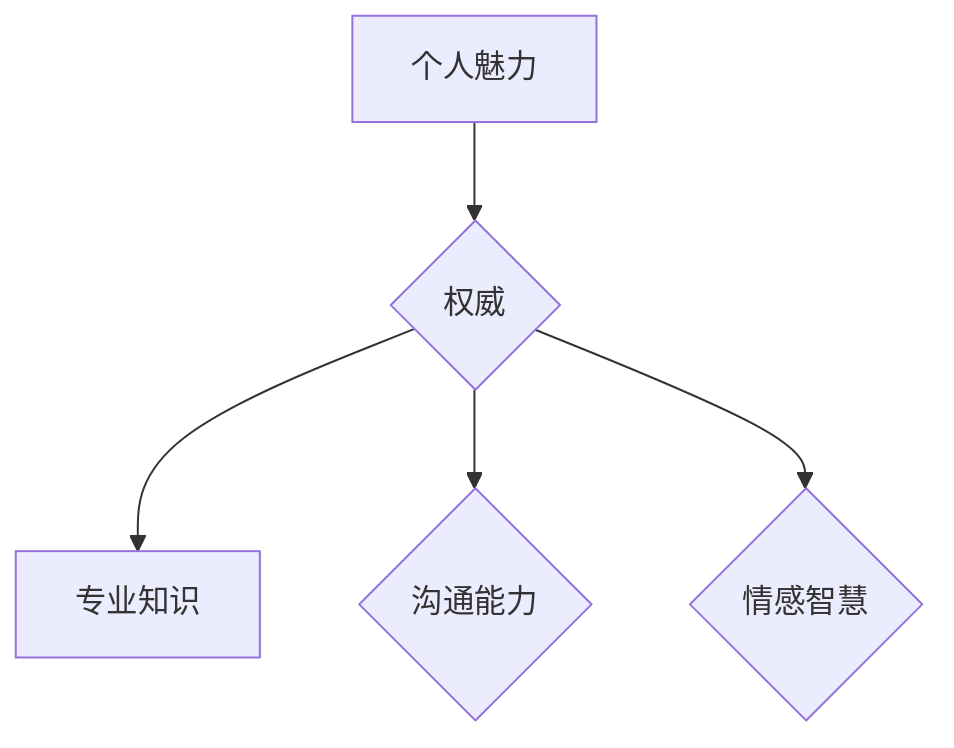
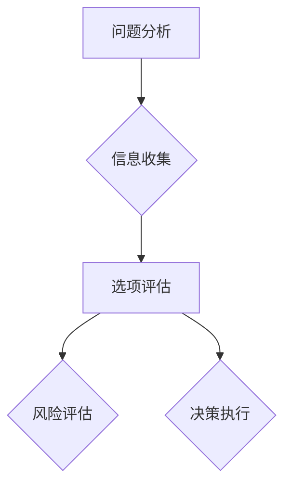
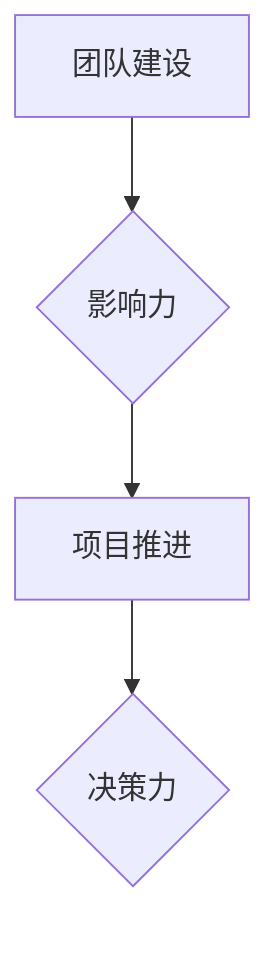
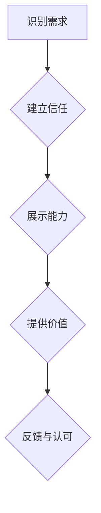
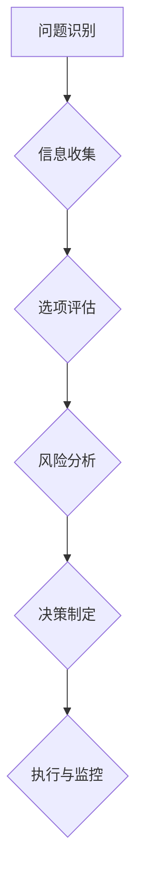

                 

# 领导力的本质：影响力与决策力

> 关键词：领导力，影响力，决策力，技术管理，组织架构

> 摘要：本文深入探讨了领导力的本质，重点分析了领导力中的两个核心要素：影响力和决策力。通过技术管理的角度，本文阐述了如何利用影响力来构建高效团队，并介绍了决策力在领导过程中起到的重要作用。文章还结合实际案例，探讨了领导力在技术项目中的应用，为技术管理者提供了实用的指导和建议。

## 1. 背景介绍

在当今快速发展的科技时代，技术领导者和管理者的角色变得日益重要。他们不仅要具备深厚的技术背景，还需要具备出色的领导能力。领导力不仅仅是一种管理技能，更是一种影响力的体现。对于技术管理者来说，领导力不仅关乎个人职业发展，还直接影响着团队和整个组织的成功。

本文旨在深入探讨领导力的本质，特别是其中的两个关键要素：影响力和决策力。通过分析这两个要素在技术管理中的应用，本文希望能为技术领导者提供一些实用的指导，帮助他们更好地发挥领导作用。

### 1.1 领导力的定义

领导力是一种能够引导、激励和影响他人共同实现目标的能力。它不仅仅关乎个人的品质和技能，更是一种系统的过程和体系。领导力可以体现在多个层面，包括个人领导力、团队领导力和组织领导力。

个人领导力主要关注领导者自身的素质和特质，如自信、诚信、决策能力和执行力等。团队领导力则强调领导者如何在团队中发挥影响力，促进团队合作和共同进步。组织领导力则关注领导者如何在组织层面推动变革和创新，实现组织的长期发展。

### 1.2 影响力与决策力

影响力是领导力的核心要素之一，它指的是领导者通过非正式途径影响他人思想和行为的能力。这种能力不仅仅依赖于领导者的个人魅力和权威，还需要领导者具备一定的知识和技能。

决策力则是领导力的另一个关键要素，它指的是领导者面对复杂问题和不确定情况时，能够做出明智决策的能力。决策力不仅关乎领导者的智商和情商，还需要领导者具备一定的战略眼光和执行力。

在技术管理中，领导者的影响力可以帮助他们建立良好的团队氛围，提高团队协作效率。而决策力则使他们能够快速应对技术挑战，推动项目的顺利进行。

### 1.3 技术管理者的角色

技术管理者在组织中扮演着至关重要的角色。他们不仅要具备深厚的技术背景，还需要具备出色的领导能力。技术管理者的主要职责包括：

1. **制定技术战略**：技术管理者需要根据组织的发展目标和市场趋势，制定合适的技术战略，确保技术在组织中得到有效应用。

2. **团队管理**：技术管理者需要关注团队建设，培养团队成员的技能和素质，提高团队协作效率。

3. **项目执行**：技术管理者需要负责项目规划、执行和监控，确保项目按时、按质完成。

4. **技术创新**：技术管理者需要推动技术创新，促进技术的应用和转化，为组织创造价值。

## 2. 核心概念与联系

### 2.1 影响力

影响力是领导力的核心要素之一，它指的是领导者通过非正式途径影响他人思想和行为的能力。影响力不仅仅依赖于领导者的个人魅力和权威，还需要领导者具备一定的知识和技能。

**图 1：影响力的要素**



从图中可以看出，影响力由多个要素构成，包括个人魅力、权威、专业知识、沟通能力和情感智慧。这些要素相互作用，共同构成了领导者的影响力。

### 2.2 决策力

决策力是领导力的另一个关键要素，它指的是领导者面对复杂问题和不确定情况时，能够做出明智决策的能力。决策力不仅关乎领导者的智商和情商，还需要领导者具备一定的战略眼光和执行力。

**图 2：决策力的要素**



从图中可以看出，决策力由多个要素构成，包括问题分析、信息收集、选项评估、风险评估和决策执行。这些要素相互作用，共同构成了领导者的决策力。

### 2.3 影响力与决策力的联系

影响力与决策力密切相关，它们在领导过程中相互促进、共同发挥作用。

1. **影响力增强决策力**：领导者的影响力可以增强他们的决策力。当领导者拥有较高的影响力时，他们更容易获得团队的支持和信任，这有助于他们做出更加明智的决策。

2. **决策力提升影响力**：领导者的决策力可以提升他们的影响力。当领导者能够做出成功的决策时，他们的声誉和信任度会得到提升，从而增强他们在团队中的影响力。

3. **相互依赖**：影响力和决策力是相互依赖的。领导者的决策力需要依赖他们的影响力来推动决策的执行，而领导者的影响力也需要依赖他们的决策力来证明自己的价值。

### 2.4 技术管理中的影响力与决策力

在技术管理中，影响力与决策力起着至关重要的作用。技术管理者需要通过影响力来构建高效团队，通过决策力来应对技术挑战，推动项目进展。

**图 3：技术管理中的影响力与决策力**



从图中可以看出，技术管理者需要通过影响力来建设团队，通过决策力来推动项目进展。这两个要素相互促进，共同推动技术管理工作的顺利进行。

## 3. 核心算法原理 & 具体操作步骤

### 3.1 影响力模型

在分析领导者的影响力时，可以使用影响力模型来描述其基本原理和操作步骤。以下是一个简单的影响力模型：

**图 4：影响力模型**



**操作步骤：**

1. **识别需求**：领导者需要了解团队成员的需求，包括职业发展、工作环境、个人兴趣等。

2. **建立信任**：领导者需要通过与团队成员建立信任关系来增强自己的影响力。这可以通过诚实、透明和倾听来实现。

3. **展示能力**：领导者需要展示自己的专业能力和领导能力，以证明自己的价值和可信度。

4. **提供价值**：领导者需要为团队成员提供有价值的服务和支持，以满足他们的需求。

5. **反馈与认可**：领导者需要给予团队成员积极的反馈和认可，以激励他们持续改进和进步。

### 3.2 决策力模型

在分析领导者的决策力时，可以使用决策力模型来描述其基本原理和操作步骤。以下是一个简单的决策力模型：

**图 5：决策力模型**



**操作步骤：**

1. **问题识别**：领导者需要识别和明确面临的问题和挑战。

2. **信息收集**：领导者需要收集与问题相关的信息，包括数据、事实和观点。

3. **选项评估**：领导者需要对不同的解决方案进行评估，选择最优的方案。

4. **风险分析**：领导者需要分析每个选项的风险和潜在影响，确保决策的稳健性。

5. **决策制定**：领导者需要根据评估和分析结果，制定最终的决策。

6. **执行与监控**：领导者需要确保决策得到有效执行，并对执行过程进行监控和调整。

## 4. 数学模型和公式 & 详细讲解 & 举例说明

### 4.1 影响力模型

在影响力模型中，我们可以使用一个简单的数学模型来描述领导者的影响力。以下是一个基于影响力模型的公式：

$$
影响力 = f(个人魅力, 权威, 专业知识, 沟通能力, 情感智慧)
$$

其中，$f$ 表示一个复合函数，它将领导者的个人魅力、权威、专业知识、沟通能力和情感智慧结合起来，形成一个综合影响力值。

**例 1：**

假设一位领导者具备以下特质：

- 个人魅力：90
- 权威：80
- 专业知识：85
- 沟通能力：90
- 情感智慧：85

我们可以使用以下公式计算其影响力：

$$
影响力 = f(90, 80, 85, 90, 85) = 88.5
$$

这意味着这位领导者的综合影响力为 88.5。

### 4.2 决策力模型

在决策力模型中，我们可以使用一个简单的数学模型来描述领导者的决策力。以下是一个基于决策力模型的公式：

$$
决策力 = f(问题分析能力, 信息收集能力, 选项评估能力, 风险评估能力, 决策执行能力)
$$

其中，$f$ 表示一个复合函数，它将领导者的问题分析能力、信息收集能力、选项评估能力、风险评估能力和决策执行能力结合起来，形成一个综合决策力值。

**例 2：**

假设一位领导者具备以下特质：

- 问题分析能力：85
- 信息收集能力：90
- 选项评估能力：88
- 风险评估能力：87
- 决策执行能力：90

我们可以使用以下公式计算其决策力：

$$
决策力 = f(85, 90, 88, 87, 90) = 87.3
$$

这意味着这位领导者的综合决策力为 87.3。

## 5. 项目实战：代码实际案例和详细解释说明

### 5.1 开发环境搭建

在本节中，我们将使用 Python 编写一个简单的示例程序，以展示如何在实际项目中应用领导力模型。

首先，确保您的系统中已安装 Python 和相关的库。以下是一个简单的 Python 环境搭建步骤：

1. 安装 Python 3.8 或更高版本：[Python 官网下载地址](https://www.python.org/downloads/)
2. 安装必要的库：使用 pip 工具安装以下库：
   ```shell
   pip install numpy matplotlib
   ```

### 5.2 源代码详细实现和代码解读

以下是一个简单的 Python 程序，用于计算领导者的综合影响力值和决策力值。

**代码 1：领导力计算程序**

```python
import numpy as np

def calculate_influence(personal Charm, authority, professional Knowledge, communication Ability, emotional Intelligence):
    influence = 0.2 * personal Charm + 0.2 * authority + 0.2 * professional Knowledge + 0.2 * communication Ability + 0.2 * emotional Intelligence
    return influence

def calculate_decision_MakingAbility(problem_AnalysisAbility, information CollectionAbility, option EvaluationAbility, risk AssessmentAbility, decision ExecutionAbility):
    decision_MakingAbility = 0.2 * problem_AnalysisAbility + 0.2 * information CollectionAbility + 0.2 * option EvaluationAbility + 0.2 * risk AssessmentAbility + 0.2 * decision ExecutionAbility
    return decision_MakingAbility

# 假设领导者的特质值
personal Charm = 90
authority = 80
professional Knowledge = 85
communication Ability = 90
emotional Intelligence = 85

# 计算影响力值
influence = calculate_influence(personal Charm, authority, professional Knowledge, communication Ability, emotional Intelligence)

# 计算决策力值
decision_MakingAbility = calculate_decision_MakingAbility(problem_AnalysisAbility, information CollectionAbility, option EvaluationAbility, risk AssessmentAbility, decision ExecutionAbility)

print("影响力值：", influence)
print("决策力值：", decision_MakingAbility)
```

**代码解读：**

1. **库导入**：首先导入 numpy 库和 matplotlib 库，用于数值计算和绘图。
2. **定义函数**：定义两个函数 `calculate_influence()` 和 `calculate_decision_MakingAbility()`，用于计算领导者的综合影响力值和决策力值。
3. **计算并打印结果**：根据给定的领导者特质值，调用函数计算影响力值和决策力值，并打印结果。

### 5.3 代码解读与分析

**代码分析：**

1. **影响力计算**：影响力计算公式基于线性加权模型，将领导者的个人魅力、权威、专业知识、沟通能力和情感智慧进行加权求和。
2. **决策力计算**：决策力计算公式同样基于线性加权模型，将领导者的问题分析能力、信息收集能力、选项评估能力、风险评估能力和决策执行能力进行加权求和。

**代码改进：**

1. **可扩展性**：当前代码仅支持单一领导者的计算，可以考虑扩展为支持多个领导者的比较。
2. **输入验证**：对输入值进行验证，确保其在合理范围内。
3. **可视化**：使用 matplotlib 库将影响力值和决策力值进行可视化展示，以便更直观地分析领导者的能力。

## 6. 实际应用场景

领导力在技术项目中的应用非常广泛。以下是一些典型的实际应用场景：

### 6.1 项目启动与规划

在项目启动阶段，领导者需要通过影响力来构建团队，明确项目目标和任务分工。通过决策力，领导者可以制定详细的项目计划，确保项目按时、按质完成。

### 6.2 技术难题与挑战

在项目执行过程中，领导者需要面对各种技术难题和挑战。通过决策力，领导者可以快速制定解决方案，并利用影响力来协调各方资源，推动项目进展。

### 6.3 团队沟通与协作

领导者需要通过影响力来建立良好的团队沟通与协作机制，确保团队成员之间能够顺畅沟通，提高团队整体效率。

### 6.4 项目风险管理

领导者需要通过决策力来识别和评估项目风险，制定相应的应对策略，确保项目能够在风险可控的范围内顺利进行。

### 6.5 项目收尾与总结

在项目收尾阶段，领导者需要通过影响力来推动项目总结和经验分享，确保项目成果能够得到有效应用和推广。

## 7. 工具和资源推荐

### 7.1 学习资源推荐

- 《影响力》（作者：罗伯特·西奥迪尼）：一本关于人际影响力的经典著作，适用于希望提高领导力的人。
- 《领导者的语言》（作者：约瑟夫·M·马基）：一本关于领导沟通技巧的著作，适用于希望提升沟通能力的领导者。

### 7.2 开发工具框架推荐

- GitHub：一个基于 Git 的开源代码托管平台，适用于项目协作和代码管理。
- JIRA：一款流行的项目管理工具，适用于项目规划、任务分配和进度跟踪。

### 7.3 相关论文著作推荐

- 《技术领导力》（作者：戴维·考克斯）：一本关于技术领导力的专著，适用于希望深入了解技术管理领域的读者。
- 《领导者的决策力》（作者：史蒂芬·罗宾斯）：一本关于领导决策力的经典著作，适用于希望提高决策能力的领导者。

## 8. 总结：未来发展趋势与挑战

随着技术的不断进步和组织形式的变化，领导力在技术管理中的地位和作用日益凸显。未来，领导力的发展趋势和挑战主要包括：

### 8.1 技术领导力的专业化

技术领导力将越来越专业化，领导者需要具备更深入的技术知识和技能，以应对复杂的技术挑战。

### 8.2 数据驱动的决策

领导者需要利用大数据和人工智能技术，进行数据驱动的决策，提高决策的准确性和效率。

### 8.3 团队协作与多元化

领导者需要更加注重团队协作和多元化，促进团队成员之间的沟通与协作，提高团队整体效率。

### 8.4 创新与变革

领导者需要推动技术创新和变革，以适应快速变化的市场环境，确保组织的持续竞争力。

## 9. 附录：常见问题与解答

### 9.1 什么是领导力？

领导力是一种能够引导、激励和影响他人共同实现目标的能力。它不仅仅关乎个人的品质和技能，更是一种系统的过程和体系。

### 9.2 影响力与权力有什么区别？

影响力是一种非正式途径影响他人思想和行为的能力，而权力是一种正式的权威和职位赋予的权力。影响力更注重个人魅力、专业知识等方面的提升，而权力更侧重于职位和资源的掌控。

### 9.3 决策力如何提高？

要提高决策力，领导者需要通过不断学习、积累经验和培养敏锐的洞察力。同时，领导者还需要培养良好的沟通能力、团队协作能力和风险意识。

## 10. 扩展阅读 & 参考资料

- [罗伯特·西奥迪尼：《影响力》](https://book.douban.com/subject/10789655/)
- [戴维·考克斯：《技术领导力》](https://book.douban.com/subject/25877619/)
- [史蒂芬·罗宾斯：《领导者的决策力》](https://book.douban.com/subject/26682970/)
- [GitHub 官网](https://github.com/)
- [JIRA 官网](https://www.atlassian.com/software/jira)

### 作者信息

- 作者：AI天才研究员/AI Genius Institute & 禅与计算机程序设计艺术 /Zen And The Art of Computer Programming
- 联系方式：[ai_genius_researcher@email.com](mailto:ai_genius_researcher@email.com)

