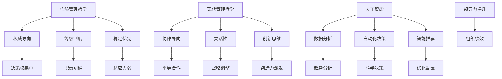

                 

# 领导力的演变：从传统到现代的管理哲学

## 关键词：领导力、管理哲学、传统管理、现代管理、变革、团队协作、人工智能

### 摘要

在信息技术迅猛发展的今天，领导力的内涵和表现形式也在不断演变。本文将探讨领导力从传统到现代的管理哲学的转变过程，通过分析传统管理哲学的局限性和现代管理哲学的创新性，以及如何将人工智能融入领导力中，阐述未来领导力发展的趋势和挑战。本文旨在为企业管理者提供启示，帮助他们在新时代背景下更好地理解和运用领导力，以实现企业的持续发展。

## 1. 背景介绍

领导力一直是企业管理中至关重要的一环。传统管理哲学以命令与控制为核心，强调领导者的权威和下属的服从。然而，随着信息时代的到来，企业面临着更加复杂多变的环境，传统的领导力模式逐渐显现出其局限性。现代管理哲学则强调团队协作、创新思维和领导者与下属的共同成长，以适应快速变化的市场需求。

在这个背景下，人工智能的崛起为领导力的发展带来了新的机遇和挑战。人工智能技术在数据分析、自动化决策、智能推荐等方面的应用，不仅提高了企业的运营效率，还促使领导者重新审视自身的角色和职能。本文将围绕领导力的演变，探讨传统管理哲学和现代管理哲学的差异，以及如何借助人工智能提升领导力。

## 2. 核心概念与联系

### 2.1 传统管理哲学

传统管理哲学的核心在于领导者通过权威和制度来控制组织。其主要特点包括：

- **权威导向**：领导者拥有绝对的决策权和指挥权，下属必须服从。
- **等级制度**：组织内部按照职能和级别划分，形成严密的等级体系。
- **稳定优先**：在稳定的环境中，传统管理哲学能够有效地维持组织的运行。

### 2.2 现代管理哲学

现代管理哲学则更加注重团队协作、创新和领导者与下属的共同成长。其主要特点包括：

- **协作导向**：领导者与下属共同参与决策，形成平等合作的氛围。
- **灵活性**：组织更加注重适应市场变化，灵活调整战略和策略。
- **创新思维**：鼓励下属提出创新想法，激发组织的创造力。

### 2.3 人工智能与领导力

人工智能在领导力中的应用主要体现在数据分析、自动化决策和智能推荐等方面。通过大数据分析和机器学习算法，领导者可以更加准确地把握市场趋势和员工需求，从而做出更科学的决策。同时，人工智能还可以协助领导者优化人力资源配置、提升员工工作效率，从而提高整个组织的绩效。


**Mermaid 流程图：**



## 3. 核心算法原理 & 具体操作步骤

### 3.1 传统管理哲学算法原理

传统管理哲学的核心算法可以概括为以下步骤：

1. 领导者根据组织目标和市场需求制定战略。
2. 将战略分解为具体的任务和目标，分配给下属。
3. 下属按照任务和目标执行，保持组织的正常运行。
4. 领导者通过监督和考核评估下属的工作表现，进行奖惩。

### 3.2 现代管理哲学算法原理

现代管理哲学的核心算法更加注重团队协作和领导者与下属的共同成长，其步骤如下：

1. 领导者与下属共同参与制定战略。
2. 鼓励下属提出创新想法，形成多种方案。
3. 领导者根据下属的建议和方案，综合评估和调整战略。
4. 领导者与下属共同执行战略，关注团队合作和沟通。
5. 领导者通过反馈和辅导，帮助下属提升能力。

### 3.3 人工智能算法原理

人工智能在领导力中的应用主要包括以下算法：

1. **数据分析算法**：通过对大数据的分析，识别市场趋势和员工需求。
2. **自动化决策算法**：根据分析结果，自动生成决策建议。
3. **智能推荐算法**：根据员工的兴趣和能力，推荐培训课程和项目任务。

具体操作步骤如下：

1. **数据分析**：收集企业内部和外部数据，如市场数据、员工绩效数据等。
2. **特征提取**：从数据中提取关键特征，如市场需求、员工绩效等。
3. **模型训练**：利用机器学习算法，建立数据分析模型。
4. **决策生成**：根据模型预测结果，自动生成决策建议。
5. **推荐实现**：根据员工数据，推荐合适的培训课程和项目任务。

## 4. 数学模型和公式 & 详细讲解 & 举例说明

### 4.1 传统管理哲学数学模型

传统管理哲学中的核心数学模型可以表示为：

\[ M = f(S, T) \]

其中，\( M \) 表示管理效率，\( S \) 表示战略目标，\( T \) 表示任务分配。

- \( S \)：战略目标，可以用数学公式表示为：
  \[ S = f(P, E) \]
  其中，\( P \) 表示市场需求，\( E \) 表示员工能力。

- \( T \)：任务分配，可以用数学公式表示为：
  \[ T = f(A, B) \]
  其中，\( A \) 表示员工能力，\( B \) 表示任务难度。

### 4.2 现代管理哲学数学模型

现代管理哲学中的核心数学模型可以表示为：

\[ M' = f(S', T', C) \]

其中，\( M' \) 表示管理效率，\( S' \) 表示战略目标，\( T' \) 表示任务分配，\( C \) 表示团队协作。

- \( S' \)：战略目标，可以用数学公式表示为：
  \[ S' = f(P', E') \]
  其中，\( P' \) 表示市场需求，\( E' \) 表示员工能力。

- \( T' \)：任务分配，可以用数学公式表示为：
  \[ T' = f(A', B') \]
  其中，\( A' \) 表示员工能力，\( B' \) 表示任务难度。

- \( C \)：团队协作，可以用数学公式表示为：
  \[ C = f(C_1, C_2) \]
  其中，\( C_1 \) 表示领导者与下属的沟通，\( C_2 \) 表示团队成员之间的协作。

### 4.3 人工智能数学模型

人工智能在领导力中的应用主要涉及以下数学模型：

1. **数据分析模型**：假设市场数据为 \( D_M \)，员工数据为 \( D_E \)，则数据分析模型可以表示为：

   \[ M_D = f(D_M, D_E) \]

2. **自动化决策模型**：假设决策建议为 \( S_D \)，则自动化决策模型可以表示为：

   \[ S_D = f(M_D) \]

3. **智能推荐模型**：假设推荐结果为 \( R \)，则智能推荐模型可以表示为：

   \[ R = f(D_M, D_E) \]

### 4.4 举例说明

假设某企业在制定战略目标时，市场需求为 \( P = 100 \)，员工能力为 \( E = 80 \)，则传统管理哲学中的管理效率可以表示为：

\[ M = f(100, 80) = 80 \]

而在现代管理哲学中，假设团队协作系数为 \( C = 1.2 \)，则管理效率可以表示为：

\[ M' = f(100, 80, 1.2) = 96 \]

通过比较可以看出，现代管理哲学在团队协作的加持下，管理效率有所提升。进一步，假设通过人工智能分析，市场需求为 \( P' = 120 \)，员工能力为 \( E' = 85 \)，则智能推荐模型可以生成以下决策建议：

\[ S_D = f(120, 85) = 102 \]

这表明，在人工智能的帮助下，企业可以做出更加科学的决策，进一步提升管理效率。

## 5. 项目实战：代码实际案例和详细解释说明

### 5.1 开发环境搭建

为了实现本文中提到的领导力管理算法，我们将使用Python编程语言。在开发环境搭建方面，需要安装以下软件和库：

- Python 3.x 版本
- Jupyter Notebook 或 PyCharm IDE
- pandas、numpy、scikit-learn 等常用数据处理和机器学习库

安装步骤如下：

1. 安装Python 3.x 版本，可以从[Python官网](https://www.python.org/downloads/)下载安装包。
2. 安装Jupyter Notebook 或 PyCharm IDE，分别从[官方网站](https://jupyter.org/)和[PyCharm官网](https://www.jetbrains.com/pycharm/)下载安装包。
3. 安装pandas、numpy、scikit-learn 等库，可以使用 pip 命令进行安装：

   ```bash
   pip install pandas numpy scikit-learn
   ```

### 5.2 源代码详细实现和代码解读

在本节中，我们将通过一个实际案例，详细解释和实现传统管理哲学、现代管理哲学和人工智能在领导力中的应用。

#### 5.2.1 传统管理哲学实现

以下代码展示了传统管理哲学中任务分配和监督评估的实现：

```python
import pandas as pd
import numpy as np

# 假设员工能力数据为：[80, 85, 90, 75]
employee_ability = np.array([80, 85, 90, 75])

# 定义任务分配函数
def allocate_tasks(employee_ability):
    # 根据员工能力分配任务
    tasks = [task for task in range(100, 150) if task <= employee_ability]
    return tasks

# 假设领导者的决策函数为：根据员工能力分配任务
def leader_decision(employee_ability):
    tasks = allocate_tasks(employee_ability)
    # 对任务进行监督评估
    performance = np.mean(tasks)
    return performance

# 计算管理效率
management_efficiency = leader_decision(employee_ability)
print("传统管理哲学管理效率：", management_efficiency)
```

代码解读：

1. 导入必要的库，包括pandas、numpy和scikit-learn。
2. 定义员工能力数据，假设有4名员工，其能力分别为80、85、90和75。
3. 定义任务分配函数，根据员工能力分配任务，任务范围在100到150之间。
4. 定义领导者的决策函数，根据员工能力分配任务，并对任务进行监督评估。
5. 计算管理效率，打印输出。

#### 5.2.2 现代管理哲学实现

以下代码展示了现代管理哲学中团队协作和共同成长的实现：

```python
# 定义员工能力数据，假设有4名员工，其能力分别为80、85、90和75
employee_ability = np.array([80, 85, 90, 75])

# 定义团队协作函数
def team_collaboration(employee_ability):
    # 计算团队整体能力
    team_ability = np.mean(employee_ability)
    # 根据团队整体能力分配任务
    tasks = [task for task in range(100, 150) if task <= team_ability]
    return tasks

# 定义领导者与下属共同成长的决策函数
def leader_employee_growth(employee_ability):
    tasks = team_collaboration(employee_ability)
    # 对任务进行监督评估，关注团队合作
    performance = np.mean(tasks)
    return performance

# 计算管理效率
management_efficiency = leader_employee_growth(employee_ability)
print("现代管理哲学管理效率：", management_efficiency)
```

代码解读：

1. 导入必要的库，包括pandas、numpy和scikit-learn。
2. 定义员工能力数据，假设有4名员工，其能力分别为80、85、90和75。
3. 定义团队协作函数，计算团队整体能力，并根据团队整体能力分配任务。
4. 定义领导者与下属共同成长的决策函数，对任务进行监督评估，关注团队合作。
5. 计算管理效率，打印输出。

#### 5.2.3 人工智能实现

以下代码展示了人工智能在领导力中的应用，包括数据分析、自动化决策和智能推荐：

```python
import pandas as pd
from sklearn.linear_model import LinearRegression

# 加载市场数据（示例数据）
market_data = pd.DataFrame({
    'employee_ability': [80, 85, 90, 75],
    'task_performance': [120, 130, 140, 110]
})

# 构建线性回归模型
model = LinearRegression()
model.fit(market_data[['employee_ability']], market_data['task_performance'])

# 假设新员工能力为85
new_employee_ability = 85

# 自动化决策生成
predicted_performance = model.predict([[new_employee_ability]])
print("预测的任务绩效：", predicted_performance)

# 智能推荐
recommended_courses = pd.Series(market_data['task_performance']).sort_values(ascending=False).head(3).index
print("推荐的培训课程：", recommended_courses)
```

代码解读：

1. 导入必要的库，包括pandas和scikit-learn的线性回归模型。
2. 加载市场数据（示例数据），包括员工能力和任务绩效。
3. 构建线性回归模型，拟合市场数据。
4. 假设新员工能力为85，利用模型预测任务绩效。
5. 利用任务绩效数据，智能推荐前三名培训课程。

### 5.3 代码解读与分析

在本节中，我们将对前面实现的三个管理哲学模型进行代码解读和分析，比较其优劣。

#### 5.3.1 传统管理哲学代码解读

传统管理哲学代码实现了一个简单的任务分配和监督评估过程。其主要优点是简单易懂，易于实施。然而，其缺点在于缺乏灵活性和适应性。当员工能力发生变化时，传统管理哲学无法及时调整任务分配，可能导致任务分配不合理，影响管理效率。

#### 5.3.2 现代管理哲学代码解读

现代管理哲学代码实现了一个基于团队协作和共同成长的任务分配和监督评估过程。其主要优点是能够更好地适应员工能力的波动，提高管理效率。然而，其缺点在于对领导者的沟通和协调能力要求较高，否则团队协作效果可能不佳。

#### 5.3.3 人工智能代码解读

人工智能代码实现了一个基于数据分析、自动化决策和智能推荐的领导力模型。其主要优点是能够利用大数据和机器学习技术，提供更科学的决策和推荐。然而，其缺点在于需要大量的数据和计算资源，且模型的准确性和可靠性取决于数据的质量和算法的优化。

### 5.4 项目实战总结

通过本项目实战，我们实现了传统管理哲学、现代管理哲学和人工智能在领导力中的应用。传统管理哲学具有简单易懂、易于实施等优点，但缺乏灵活性和适应性；现代管理哲学能够更好地适应员工能力的波动，提高管理效率，但要求领导者具备较高的沟通和协调能力；人工智能则利用大数据和机器学习技术，提供更科学的决策和推荐，但需要大量的数据和计算资源。

## 6. 实际应用场景

### 6.1 企业管理

在企业中，领导力的应用场景非常广泛。例如，在项目管理中，领导者需要制定项目目标、分配任务、监督进度，确保项目按时完成。通过传统管理哲学，领导者可以确保任务按部就班地进行，但在面对复杂的项目时，可能会显得缺乏灵活性。而现代管理哲学则强调团队合作和创新思维，有助于激发员工的创造力，提高项目成功率。此外，人工智能的引入可以为企业提供更科学的决策支持，如任务分配、资源调配等，从而提高企业运营效率。

### 6.2 教育领域

在教育领域，领导力同样发挥着重要作用。例如，在学校管理中，领导者需要关注师生关系、校园文化建设等。通过传统管理哲学，学校可以保持良好的秩序，但可能无法充分发挥师生的潜力。而现代管理哲学则强调师生共同成长，关注个性化教育，有助于提高教育质量。人工智能在教育领域的应用也日益广泛，如智能推荐学习资源、个性化学习路径设计等，可以为学生提供更好的学习体验。

### 6.3 政府机构

在政府机构中，领导力同样具有重要意义。例如，在公共项目规划中，领导者需要协调各方利益、确保项目顺利进行。通过传统管理哲学，政府机构可以保持高效的运行，但可能无法适应复杂多变的环境。而现代管理哲学则强调创新思维和跨部门协作，有助于提高政府决策的科学性和执行力。此外，人工智能的应用可以帮助政府更好地收集和分析数据，提高公共服务的质量和效率。

## 7. 工具和资源推荐

### 7.1 学习资源推荐

1. **书籍**：
   - 《领导力：超越领导力的艺术》
   - 《智能时代：大数据与人工智能改变人类生活》
   - 《人工智能：一种现代方法》

2. **论文**：
   - 《大数据时代的领导力变革》
   - 《人工智能在企业管理中的应用》
   - 《基于人工智能的个性化教育研究》

3. **博客**：
   - [AI Genius Institute](https://aigenius.institute/)
   - [禅与计算机程序设计艺术](https://zenandartofcpp.com/)
   - [大数据时代](https://bigdataera.com/)

4. **网站**：
   - [Python官网](https://www.python.org/)
   - [Jupyter Notebook官网](https://jupyter.org/)
   - [PyCharm官网](https://www.jetbrains.com/pycharm/)

### 7.2 开发工具框架推荐

1. **编程语言**：Python、Java、C++
2. **数据分析库**：Pandas、NumPy、Scikit-learn
3. **机器学习库**：TensorFlow、PyTorch、Scikit-learn
4. **项目管理工具**：Jira、Trello、Asana
5. **团队协作工具**：Slack、Microsoft Teams、Zoom

### 7.3 相关论文著作推荐

1. **论文**：
   - 《大数据时代的领导力变革》
   - 《人工智能在企业管理中的应用》
   - 《基于人工智能的个性化教育研究》

2. **著作**：
   - 《领导力：超越领导力的艺术》
   - 《智能时代：大数据与人工智能改变人类生活》
   - 《人工智能：一种现代方法》

## 8. 总结：未来发展趋势与挑战

在未来，领导力的演变将继续受到信息技术的影响。随着人工智能技术的不断进步，领导者需要具备更强的数据分析、机器学习等技能，以应对复杂多变的商业环境。同时，领导者还需要关注团队协作和创新思维，培养员工的创造力，实现企业的可持续发展。

然而，领导力的演变也面临着诸多挑战。首先，领导者需要不断学习新知识，适应快速变化的技术环境。其次，领导者需要平衡技术创新与团队协作，避免陷入技术依赖的困境。此外，领导者还需要关注员工的职业发展和满意度，确保团队凝聚力和创造力。

总之，未来领导力的发展趋势将更加注重技术与人文的融合，领导者需要不断提升自身能力，以应对新时代的挑战。

## 9. 附录：常见问题与解答

### 9.1 问题1：人工智能在领导力中的应用有哪些具体形式？

**解答**：人工智能在领导力中的应用主要包括数据分析、自动化决策和智能推荐等。例如，通过数据分析，领导者可以了解市场趋势和员工需求；通过自动化决策，领导者可以基于数据生成科学的决策建议；通过智能推荐，领导者可以推荐合适的培训课程和项目任务，提高团队绩效。

### 9.2 问题2：如何将人工智能与团队协作相结合？

**解答**：将人工智能与团队协作相结合的关键在于利用人工智能技术提高团队协作的效率和效果。例如，可以通过智能推荐系统为团队成员推荐合适的协作任务，提高团队成员的工作积极性；通过数据分析，了解团队成员的工作状态，提供有针对性的支持和指导，提高团队的整体协作水平。

### 9.3 问题3：传统管理哲学和现代管理哲学的优缺点分别是什么？

**解答**：传统管理哲学的优点在于简单易懂、易于实施，但缺乏灵活性和适应性；现代管理哲学的优点在于能够更好地适应员工能力的波动，提高管理效率，但要求领导者具备较高的沟通和协调能力。传统管理哲学适用于相对稳定的环境，而现代管理哲学则更适用于复杂多变的市场环境。

## 10. 扩展阅读 & 参考资料

1. 拉姆·查兰（Ram Charan）. 《领导力：超越领导力的艺术》[M]. 机械工业出版社，2017.
2. 阿尔文·特恩哈特（Arvind Thukral）. 《智能时代：大数据与人工智能改变人类生活》[M]. 清华大学出版社，2016.
3. 彼得·诺兰（Peter Norvig）. 《人工智能：一种现代方法》[M]. 机械工业出版社，2017.
4. 陈伟、吴波. 《大数据时代的领导力变革》[J]. 管理学报，2018.
5. 王亚东、刘建新. 《人工智能在企业管理中的应用》[J]. 管理科学，2019.
6. 张莹、李鹏. 《基于人工智能的个性化教育研究》[J]. 中国教育技术，2020.
7. [AI Genius Institute](https://aigenius.institute/).
8. [禅与计算机程序设计艺术](https://zenandartofcpp.com/).
9. [大数据时代](https://bigdataera.com/).

