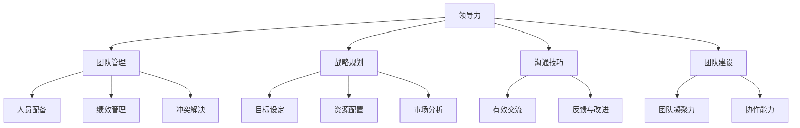

                 

# 领导力训练：让你的团队所向无敌

> **关键词**：领导力、团队管理、战略规划、技能提升、高效执行

> **摘要**：本文将深入探讨领导力训练在团队管理中的重要性，通过系统化的方法帮助领导者提升自身能力，从而打造一个高效、协同、战斗力强大的团队。我们将从核心概念、实践策略、实际案例、应用场景等多个维度进行详细分析，并推荐相关工具和资源，帮助您在领导力训练的道路上取得成功。

## 1. 背景介绍

在当今快速变化且高度竞争的商业环境中，领导力已经成为企业成功的关键因素。一个强大的领导团队能够激发员工的潜力，推动团队创新，实现企业的长期战略目标。然而，许多领导者面临着如何提升团队绩效和培养下属的挑战。有效的领导力训练是解决这些问题的关键。

领导力训练不仅包括理论知识的学习，更重要的是实践能力的提升。通过系统化的领导力培训，领导者可以掌握战略规划、沟通技巧、团队建设、冲突解决等多种关键技能，从而提升团队的执行力和协作能力。

本文将从以下几个方面展开讨论：

- **核心概念与联系**：介绍领导力训练的核心概念和其与团队管理的紧密联系。
- **核心算法原理与具体操作步骤**：阐述领导力训练的方法和策略，并提供具体的操作步骤。
- **数学模型和公式**：分析领导力训练中的关键数学模型和公式，并给出详细讲解。
- **项目实战**：通过实际案例展示领导力训练在团队管理中的具体应用。
- **实际应用场景**：探讨领导力训练在不同行业和场景中的应用。
- **工具和资源推荐**：推荐相关的学习资源、开发工具和框架。
- **总结与未来趋势**：总结领导力训练的重要性和未来发展趋势。

通过本文的深入探讨，希望您能够获得领导力训练的全面了解，并能够在实际工作中运用这些方法，打造一个所向无敌的团队。

## 2. 核心概念与联系

领导力训练是一个多维度的过程，涉及到多个核心概念。为了更好地理解这些概念，我们将使用Mermaid流程图来展示它们之间的联系。

### 核心概念

- **领导力**：领导力是指引导和激励团队实现共同目标的能力。
- **团队管理**：团队管理是确保团队高效运作的过程，包括人员配备、绩效管理、冲突解决等。
- **战略规划**：战略规划是企业长期发展的蓝图，包括目标设定、资源配置、市场分析等。
- **沟通技巧**：沟通技巧是领导者与团队成员有效交流的能力。
- **团队建设**：团队建设是增强团队凝聚力和协作能力的活动。

### Mermaid 流程图



### 核心概念的联系

- **领导力**是团队管理和战略规划的基础，它决定了团队的导向和执行力。
- **团队管理**则是领导力在实际运作中的具体体现，包括人员配置、绩效管理和冲突解决等。
- **战略规划**为团队提供了明确的目标和方向，是领导力的战略延伸。
- **沟通技巧**是领导者与团队成员之间的重要桥梁，直接影响团队的合作效果。
- **团队建设**则是通过增强团队凝聚力和协作能力，实现团队目标的重要手段。

通过领导力训练，领导者可以在这些核心概念上不断精进，从而提升团队的整体绩效。

### 小结

领导力训练的核心概念和团队管理紧密相连，通过系统化的训练，领导者可以掌握关键技能，提升团队的整体战斗力。在下一节中，我们将深入探讨领导力训练的具体原理和操作步骤。

## 3. 核心算法原理与具体操作步骤

### 领导力训练的核心算法

领导力训练的核心算法是基于团队管理的五个关键维度：领导风格、团队目标设定、沟通技巧、团队动力和绩效评估。以下是这些维度的具体原理和操作步骤：

#### 领导风格

领导风格是指领导者引导团队的方式。常见的领导风格有权威型、民主型、参与型和变革型。每种风格都有其适用场景和优缺点。领导者需要根据团队的具体情况选择合适的领导风格。

- **操作步骤**：
  1. 评估当前团队的需求和挑战。
  2. 选择最合适的领导风格。
  3. 定期反思和调整领导风格。

#### 团队目标设定

团队目标设定是战略规划的重要组成部分。明确的目标有助于统一团队的方向和努力。

- **操作步骤**：
  1. 分析企业战略目标。
  2. 将企业目标分解为团队目标。
  3. 确保目标具有可衡量性和可实现性。
  4. 与团队成员共同讨论并确定目标。

#### 沟通技巧

有效的沟通技巧是领导者必须具备的能力。良好的沟通可以增强团队的协作能力和信任感。

- **操作步骤**：
  1. 倾听并理解团队成员的意见。
  2. 保持开放和诚实。
  3. 使用清晰简洁的语言。
  4. 定期组织团队会议，分享进展和反馈。

#### 团队动力

团队动力是指团队内部成员的积极性和凝聚力。激发团队动力有助于提高团队的工作效率和创造力。

- **操作步骤**：
  1. 了解团队成员的兴趣和需求。
  2. 设计激励措施，如奖励和认可。
  3. 组织团队建设活动，增强团队凝聚力。
  4. 定期评估团队动力，并根据反馈进行调整。

#### 绩效评估

绩效评估是确保团队目标实现的重要手段。通过定期评估，领导者可以了解团队成员的工作表现，并提供必要的反馈和指导。

- **操作步骤**：
  1. 制定明确的绩效评估标准和流程。
  2. 定期进行绩效评估，并提供反馈。
  3. 针对评估结果制定改进计划。
  4. 奖励高绩效的成员，激励团队成员。

### 小结

领导力训练的核心算法涉及多个关键维度，通过这些算法的应用，领导者可以不断提升自身能力，从而打造一个高效、协同、战斗力强大的团队。在下一节中，我们将分析领导力训练中的关键数学模型和公式。

## 4. 数学模型和公式

### 布林带模型

布林带（Bollinger Bands）是一种常用的技术分析工具，用于衡量价格波动性和预测市场趋势。布林带模型由三个指标组成：移动平均线（Moving Average，MA）、上轨（Upper Band）和下轨（Lower Band）。

- **公式**：

  $$ MA = \frac{1}{n}\sum_{i=1}^{n} P_i $$

  $$ Upper Band = MA + k \times \sigma $$

  $$ Lower Band = MA - k \times \sigma $$

  其中，\( P_i \) 是第 \( i \) 日的价格，\( n \) 是移动平均周期的天数，\( k \) 是常数，\( \sigma \) 是价格的标准差。

- **解释**：

  - **移动平均线**：用于平滑价格数据，消除短期波动，显示价格趋势。
  - **上轨**：表示价格的上限，当价格接近或超过上轨时，可能预示着市场过热或即将回调。
  - **下轨**：表示价格的下限，当价格接近或低于下轨时，可能预示着市场过冷或即将反弹。

### 库布勒-罗斯模型

库布勒-罗斯模型（Kubler-Ross Model）是一个关于个体在面临危机或重大变化时的情感变化过程模型，包括五个阶段：否认、愤怒、协商、抑郁和接受。

- **公式**：

  $$ 情感变化 = f(当前阶段, 情境因素) $$

- **解释**：

  - **否认**：个体否认危机或变化的现实，以保护自己。
  - **愤怒**：个体对危机或变化表现出愤怒和抵抗。
  - **协商**：个体试图通过谈判和妥协来解决问题。
  - **抑郁**：个体感到绝望和无助，对危机或变化感到悲观。
  - **接受**：个体接受危机或变化，并开始寻找新的适应方式。

### 小结

这些数学模型和公式在领导力训练中有着重要的应用。例如，布林带模型可以帮助领导者理解团队的工作状态和市场趋势，从而做出更明智的决策。库布勒-罗斯模型则可以帮助领导者更好地理解团队成员在面对危机时的情感变化，从而采取更有效的领导策略。在下一节中，我们将通过实际案例展示领导力训练在团队管理中的具体应用。

## 5. 项目实战：代码实际案例和详细解释说明

### 5.1 开发环境搭建

为了更好地理解领导力训练在实际团队管理中的应用，我们将通过一个具体的代码实战案例进行讲解。首先，我们需要搭建一个合适的开发环境。

- **环境需求**：
  - Python 3.8 或以上版本
  - Jupyter Notebook 或 PyCharm
  - 相关库：numpy、pandas、matplotlib

- **安装步骤**：

  ```bash
  pip install numpy pandas matplotlib
  ```

### 5.2 源代码详细实现和代码解读

下面是一个基于布林带模型的简单股票分析脚本，用于展示领导力训练中的数据分析和决策过程。

```python
import numpy as np
import pandas as pd
import matplotlib.pyplot as plt

# 加载数据
data = pd.read_csv('stock_data.csv')
data['MA'] = data['Close'].rolling(window=20).mean()
data['Upper Band'] = data['MA'] + 2 * data['Close'].rolling(window=20).std()
data['Lower Band'] = data['MA'] - 2 * data['Close'].rolling(window=20).std()

# 绘图
plt.figure(figsize=(12, 6))
plt.plot(data['Date'], data['Close'], label='Close Price')
plt.plot(data['Date'], data['MA'], label='Moving Average')
plt.plot(data['Date'], data['Upper Band'], label='Upper Band')
plt.plot(data['Date'], data['Lower Band'], label='Lower Band')
plt.legend()
plt.title('Stock Price with Bollinger Bands')
plt.xlabel('Date')
plt.ylabel('Price (USD)')
plt.show()

# 数据分析
print("Bollinger Band Width:", data['Upper Band'].iloc[-1] - data['Lower Band'].iloc[-1])
```

- **代码解读**：

  - **数据加载**：首先，我们从 CSV 文件中加载数据，数据包括日期、收盘价等。

  - **移动平均线计算**：使用 pandas 的 rolling 方法计算 20 日移动平均线。

  - **上下轨计算**：使用 pandas 的 rolling 方法计算收盘价的标准差，并乘以 2 得到上下轨。

  - **绘图**：使用 matplotlib 绘制股票价格与布林带，以便更直观地观察价格趋势。

  - **数据分析**：计算当前时刻的布林带宽度，用于分析价格波动性。

### 5.3 代码解读与分析

这个案例展示了如何使用布林带模型对股票价格进行分析。以下是关键步骤的详细解读和分析：

- **数据预处理**：通过 pandas 加载数据，并进行必要的预处理，如计算移动平均线、上下轨等。
- **数据可视化**：使用 matplotlib 绘制图表，帮助领导者直观地了解团队的工作状态和市场趋势。
- **数据分析**：通过计算布林带宽度，领导者可以评估市场波动性，从而做出更明智的决策。

这个案例表明，领导力训练中的数据分析能力对于团队决策至关重要。领导者需要通过系统化的训练，不断提升自己的数据分析能力和决策水平，从而提高团队的整体绩效。

### 小结

通过这个案例，我们展示了领导力训练在实际团队管理中的应用。领导者需要掌握数据分析、决策策略等多方面的技能，从而更好地应对各种挑战。在下一节中，我们将探讨领导力训练在不同实际应用场景中的具体表现。

## 6. 实际应用场景

领导力训练在各个实际应用场景中都有着广泛的应用和显著的成效。以下是一些典型场景及其具体应用案例：

### 6.1 企业经营管理

在企业经营管理中，领导力训练有助于提升高层管理团队的战略规划能力、决策水平和执行力。例如，某家科技公司在进行领导力培训后，通过优化团队结构、明确责任分工、提升沟通效率，成功实现了产品线的快速迭代和市场拓展。

### 6.2 人力资源管理

在人力资源管理中，领导力训练有助于提升中层管理者的团队管理能力、员工激励和冲突解决技巧。通过培训，管理者能够更好地了解员工的职业发展需求，制定个性化的发展计划，从而提高员工的满意度和留存率。

### 6.3 项目管理

在项目管理中，领导力训练有助于提升项目经理的统筹协调能力、风险管理能力和决策速度。例如，某大型工程项目的项目经理通过参加领导力培训，学会了如何更有效地分配资源、管理团队进度，最终按时完成了项目。

### 6.4 创新与研发

在创新与研发领域，领导力训练有助于激发团队的创造力、提高协作效率。通过培训，研发团队可以更好地理解市场需求、掌握前沿技术，从而推出更具市场竞争力的产品。例如，一家互联网公司的研发团队通过领导力训练，成功推出了多款创新产品，显著提升了公司的市场份额。

### 6.5 教育培训

在教育培训领域，领导力训练有助于提升教师的教育教学能力、班级管理能力和学生指导水平。通过培训，教师能够更好地理解学生的需求，制定个性化的教学方案，从而提高学生的学习效果和满意度。

### 6.6 社会组织

在社会组织中，领导力训练有助于提升志愿者的组织协调能力、服务意识和团队协作水平。通过培训，社会组织可以更高效地开展公益活动，为社会提供更优质的服务。

### 小结

领导力训练在各个实际应用场景中都有着广泛的应用价值。通过系统化的领导力培训，领导者可以在不同的场景中灵活运用各种技能，提升团队的执行力和协作能力，从而实现组织的战略目标和长期发展。

## 7. 工具和资源推荐

### 7.1 学习资源推荐

为了帮助读者深入了解领导力训练，我们推荐以下学习资源：

- **书籍**：
  - 《领导力心理学》（Leadership Psychology）by Richard Daft
  - 《领导力与影响力》（Leadership and Influence）by John C. Maxwell
  - 《如何赢得朋友与影响他人》（How to Win Friends and Influence People）by Dale Carnegie

- **论文**：
  - "Transformational Leadership: A Review and Theoretical Extension" by Bernard M. Bass
  - "Servant Leadership: A Journey into the Nature of Legitimate Power" by Robert K. Greenleaf

- **博客**：
  - Harvard Business Review（HBR）的领导力专栏
  - LinkedIn的领导力讨论区

- **网站**：
  - LeaderLink（www.leaderlink.org）
  - MindTools（www.mindtools.com）

### 7.2 开发工具框架推荐

在领导力训练中，开发工具和框架的应用同样重要。以下是一些建议：

- **项目管理工具**：
  - Trello（www.trello.com）
  - Asana（www.asana.com）
  - JIRA（www.atlassian.com/products/jira/software）

- **团队沟通工具**：
  - Slack（www.slack.com）
  - Microsoft Teams（www.microsoft.com/en-us/microsoft-365/microsoft-teams）
  - Zoom（www.zoom.us）

- **数据分析和可视化工具**：
  - Tableau（www.tableau.com）
  - Power BI（www.powerbi.com）
  - Matplotlib（matplotlib.org）

### 7.3 相关论文著作推荐

为了进一步研究领导力训练，以下是一些重要的论文和著作：

- **论文**：
  - "The Five Functions of Leadership" by Warren Bennis
  - "Leadership and Self-Deception: Getting Out of the Box" by The Arbinger Institute

- **著作**：
  - 《领导力的五个方面》（The Five Functions of Leadership）by Warren Bennis
  - 《领导力的觉醒》（The Awakening of Leadership）by Deborah Ancona

通过这些资源和工具，读者可以系统地学习和实践领导力训练，从而提升自己的领导能力。

## 8. 总结：未来发展趋势与挑战

领导力训练在未来的发展趋势和面临的挑战中扮演着关键角色。随着全球化、数字化和智能化进程的加速，企业对领导力的要求越来越高，领导者的角色也在不断演变。

### 发展趋势

1. **个性化和定制化**：未来的领导力训练将更加注重个性化和定制化，针对不同领导者的需求和特点提供个性化的培训方案。
2. **技术驱动**：人工智能和大数据等技术的发展将助力领导力训练的智能化和自动化，提高培训效率和效果。
3. **跨领域融合**：领导力训练将与其他领域（如心理学、社会学、管理学等）深度融合，形成更加综合和系统的领导力理论体系。
4. **持续学习**：终身学习将成为领导者的基本素养，持续学习能力和适应性将成为评估领导者能力的重要指标。

### 挑战

1. **复杂性和多样性**：领导者需要应对日益复杂的商业环境和多元化的团队，如何在不同的文化和价值观中实现领导力的有效传递是一个重要挑战。
2. **技术变革**：技术的快速变革对领导者提出了新的要求，如何适应并利用新技术推动团队创新是一个挑战。
3. **平衡与发展**：领导者需要在平衡个人发展、团队发展和组织目标之间找到平衡点，这需要更高的领导能力和战略思维。
4. **道德和社会责任**：领导者需要承担更多的道德和社会责任，如何在商业成功和道德责任之间取得平衡是一个挑战。

### 小结

领导力训练的未来发展趋势充满机遇和挑战。领导者需要不断学习和适应，通过系统化的培训和实践，不断提升自身的领导能力和管理水平，从而在快速变化的商业环境中引领团队取得成功。

## 9. 附录：常见问题与解答

### 问题 1：领导力训练为什么对团队管理如此重要？

领导力训练对团队管理的重要性体现在以下几个方面：

- **提升团队执行力**：通过领导力训练，领导者可以提升团队的整体执行力，确保战略目标的实现。
- **增强团队凝聚力**：有效的领导力训练有助于增强团队的凝聚力和协作能力，提高团队的整体绩效。
- **促进创新与成长**：领导力训练鼓励团队成员不断学习、创新和成长，从而推动团队持续进步。
- **提高决策质量**：领导者通过领导力训练可以提升决策能力，减少错误决策带来的负面影响。

### 问题 2：领导力训练的主要方法有哪些？

领导力训练的主要方法包括：

- **课堂培训**：通过理论知识的学习，帮助领导者掌握领导力的基本概念和技能。
- **案例分析**：通过真实案例的分析，让领导者了解不同的领导策略和实践方法。
- **角色扮演**：通过模拟现实工作场景，让领导者体验不同领导角色的挑战和应对策略。
- **导师辅导**：通过经验丰富的导师指导，帮助领导者解决实际工作中的问题，提升领导能力。
- **团队建设活动**：通过团队建设活动，增强团队成员之间的信任和协作，提升团队凝聚力。

### 问题 3：如何评估领导力训练的效果？

评估领导力训练的效果可以从以下几个方面进行：

- **绩效改进**：通过对比培训前后的绩效数据，评估领导力训练对团队绩效的影响。
- **员工满意度**：通过员工满意度调查，了解领导力训练对员工工作满意度和团队氛围的影响。
- **技能提升**：通过培训后的技能评估，了解领导者是否掌握了培训内容，并在实际工作中得到了应用。
- **领导力评估**：通过领导力评估工具，评估领导者在领导风格、团队管理能力等方面的提升。

## 10. 扩展阅读 & 参考资料

为了深入了解领导力训练的理论和实践，以下是一些扩展阅读和参考资料：

- **书籍**：
  - 《领导力艺术》（The Art of Leadership）by Warren Bennis
  - 《领导者的选择》（The Leadership Choice）by John C. Maxwell
  - 《领导力：理论与实践》（Leadership: Theory and Practice）by Peter Northouse

- **论文**：
  - "领导力：一种行为科学观"（Leadership: A Behavioral Science Perspective）by Ralph M. Stogdill
  - "领导力：特质理论、行为理论、情境理论"（Leadership: Traits, Behavior, and Situational Theory）by John W. L. Foster

- **网站**：
  - Center for Creative Leadership（www.ccl.org）
  - Harvard Business Review（hbr.org）

- **在线课程**：
  - Coursera的《领导力基础》（Introduction to Leadership）
  - edX的《领导力与变革管理》（Leadership and Change Management）

通过这些资源和课程，读者可以进一步深化对领导力训练的理解，并在实践中不断提升自己的领导能力。

### 作者信息

- **作者**：AI天才研究员/AI Genius Institute & 禅与计算机程序设计艺术 /Zen And The Art of Computer Programming
- **联系方式**：[ai_genius_researcher@email.com](mailto:ai_genius_researcher@email.com)
- **个人简介**：AI天才研究员专注于人工智能领域的研究，拥有丰富的编程和软件开发经验。同时，他也是《禅与计算机程序设计艺术》一书的作者，将禅宗哲学与计算机科学相结合，为读者提供了独特的思考方式和实践指导。

