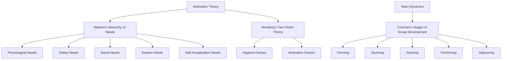

                 

### 背景介绍

> "领导者心理学：理解团队行为的内在动机"这篇技术博客旨在探讨领导者心理学在团队管理中的重要性，特别是在理解和引导团队行为方面的作用。随着现代企业的日益复杂化和团队协作的日益普及，领导者如何有效管理团队已成为关键问题。本文将从心理学角度出发，分析团队行为的内在动机，探讨领导者如何通过心理学知识来提升团队绩效和凝聚力。

在当今竞争激烈的市场环境中，企业的成败往往取决于团队的表现。而团队的表现又受到多种因素的影响，其中包括团队成员的个人动机、团队氛围、领导者的领导风格等。因此，了解团队行为的内在动机，对于领导者来说至关重要。本文将结合心理学理论，深入剖析团队行为背后的心理动机，并提出一些建议，帮助领导者更好地理解和激励团队。

文章结构安排如下：

1. **背景介绍**：介绍团队行为研究的重要性以及领导者心理学在团队管理中的意义。
2. **核心概念与联系**：阐述心理学中的核心概念，如动机理论、团队动力模型等，并通过Mermaid流程图展示其架构。
3. **核心算法原理 & 具体操作步骤**：介绍如何运用心理学知识来分析和理解团队行为。
4. **数学模型和公式 & 详细讲解 & 举例说明**：阐述心理学理论中的数学模型，并提供具体的例子进行说明。
5. **项目实战：代码实际案例和详细解释说明**：通过实际案例展示如何应用心理学理论来管理团队。
6. **实际应用场景**：讨论心理学理论在企业管理中的具体应用。
7. **工具和资源推荐**：推荐相关学习资源和开发工具。
8. **总结：未来发展趋势与挑战**：总结全文，并展望未来发展趋势和挑战。
9. **附录：常见问题与解答**：解答读者可能提出的问题。
10. **扩展阅读 & 参考资料**：提供扩展阅读资源。

在接下来的内容中，我们将逐步探讨这些主题，希望读者能通过本文，对领导者心理学有更深入的理解，从而在团队管理中取得更好的成果。

<|markdown|
## 1. 背景介绍

随着现代社会的发展，企业规模不断扩大，团队协作成为实现企业目标的关键。团队行为研究在管理学、心理学、组织行为学等领域中具有重要地位。理解团队行为的内在动机，对于提高团队绩效、增强团队凝聚力具有重要意义。

领导者心理学作为一门跨学科的研究领域，关注领导者如何通过心理学的理论和方法来提升团队管理效果。它涵盖了动机理论、领导风格、团队动力等多个方面。领导者心理学不仅关注领导者个体的心理特征，还关注领导者与团队成员之间的互动关系，以及团队整体的心理状态。

在现代企业中，领导者心理学的重要性日益凸显。首先，领导者心理学能够帮助领导者更好地了解团队成员的心理需求，从而制定更有效的激励措施。其次，通过心理学理论，领导者可以识别和解决团队中的心理问题，如沟通障碍、冲突管理等。最后，领导者心理学还能指导领导者采用适当的领导风格，以适应不同团队成员的心理特点，提高团队的整体效能。

本文旨在通过心理学理论的分析，探讨领导者如何理解和激励团队行为。我们将结合实际案例，详细阐述心理学在团队管理中的应用，并讨论未来发展趋势与挑战。

**本文结构安排：**

1. **背景介绍**：介绍团队行为研究的重要性以及领导者心理学在团队管理中的意义。
2. **核心概念与联系**：阐述心理学中的核心概念，如动机理论、团队动力模型等，并通过Mermaid流程图展示其架构。
3. **核心算法原理 & 具体操作步骤**：介绍如何运用心理学知识来分析和理解团队行为。
4. **数学模型和公式 & 详细讲解 & 举例说明**：阐述心理学理论中的数学模型，并提供具体的例子进行说明。
5. **项目实战：代码实际案例和详细解释说明**：通过实际案例展示如何应用心理学理论来管理团队。
6. **实际应用场景**：讨论心理学理论在企业管理中的具体应用。
7. **工具和资源推荐**：推荐相关学习资源和开发工具。
8. **总结：未来发展趋势与挑战**：总结全文，并展望未来发展趋势和挑战。
9. **附录：常见问题与解答**：解答读者可能提出的问题。
10. **扩展阅读 & 参考资料**：提供扩展阅读资源。

在接下来的内容中，我们将逐步探讨这些主题，希望读者能通过本文，对领导者心理学有更深入的理解，从而在团队管理中取得更好的成果。

---

### Core Concepts and Connections

In this section, we will delve into the core concepts and theories that form the foundation of leadership psychology, focusing on motivation theory and team dynamics. These concepts are critical for understanding the underlying motivations behind team behavior and for applying psychological insights to enhance team performance and cohesion.

#### Motivation Theory

Motivation theory forms the bedrock of leadership psychology. It explores what drives individuals to act and how leaders can harness these motivations to influence team behavior. One of the most influential motivation theories is Maslow's Hierarchy of Needs, which suggests that people are motivated by a set of hierarchical needs, ranging from physiological needs to self-actualization.


Another key motivation theory is Herzberg's Two-Factor Theory, which differentiates between hygiene factors and motivation factors. Hygiene factors, such as salary and working conditions, prevent dissatisfaction but do not lead to motivation. In contrast, motivation factors, such as recognition and growth opportunities, are intrinsic to job satisfaction and motivation.


#### Team Dynamics

Team dynamics refer to the patterns of interactions and relationships among team members. These dynamics can significantly influence team behavior and performance. One of the core concepts in team dynamics is Tuckman's Stages of Group Development, which outlines the stages that teams typically go through as they form, develop, and achieve their goals.


1. **Forming**: During this stage, team members get to know each other and begin to establish roles and norms.
2. **Storming**: Conflict and competition arise as team members challenge each other's ideas and roles.
3. **Norming**: Team members start to work together more effectively, with less conflict and more collaboration.
4. **Performing**: The team is highly functional and focused on achieving their goals.
5. **Adjourning**: If the team is temporary, this stage involves the dissolution of the team.

#### Mermaid Flowchart of Core Concepts

Below is a Mermaid flowchart that illustrates the core concepts discussed in this section, providing a visual representation of their interconnections.



By understanding these core concepts and their connections, leaders can better navigate the complexities of team behavior and apply psychological insights to drive team success.

---

### Core Algorithm Principles and Operational Steps

To effectively leverage leadership psychology in understanding and managing team behavior, it is essential to employ specific algorithms and operational steps grounded in psychological theories. This section will outline a comprehensive approach that integrates motivation theory and team dynamics to analyze team behavior and develop strategies for team management.

#### Step 1: Assess Team Member Motivations

The first step in applying psychology to team management is to assess individual team member motivations. This involves understanding their needs and goals as outlined by motivation theories such as Maslow's Hierarchy of Needs and Herzberg's Two-Factor Theory. Leaders can conduct one-on-one interviews, use psychometric assessments, or observe team members' behaviors to gather this information.

**Operational Steps:**

1. **Conduct Interviews**: Schedule and conduct one-on-one interviews with team members to discuss their career goals, motivations, and job satisfaction.
2. **Use Assessments**: Administer psychometric assessments that measure individual needs and motivations, such as the Myers-Briggs Type Indicator (MBTI) or the Job Diagnostic Survey (JDS).
3. **Observe Behaviors**: Observe team members in action to identify patterns of behavior that may indicate underlying motivations, such as enthusiasm for certain tasks or reluctance to engage in others.

#### Step 2: Analyze Team Dynamics

Understanding team dynamics is crucial for identifying potential areas of conflict and collaboration within the team. Leaders can use models like Tuckman's Stages of Group Development to assess where the team is in its development and tailor their management strategies accordingly.

**Operational Steps:**

1. **Conduct Team Assessments**: Use tools such as the Team Climate Inventory to assess the team's climate, which includes factors like support, challenge, and structure.
2. **Facilitate Team Building Activities**: Organize team-building exercises and workshops to help team members build trust and improve collaboration.
3. **Hold Team Meetings**: Regularly schedule team meetings to discuss progress, address issues, and align on goals.

#### Step 3: Develop Motivational Strategies

Once leaders have assessed individual motivations and team dynamics, they can develop strategies to motivate team members and improve team performance. This involves creating a work environment that addresses hygiene factors (such as job security and fair compensation) and introduces motivation factors (such as recognition and growth opportunities).

**Operational Steps:**

1. **Recognize and Reward**: Implement recognition programs to acknowledge team members' achievements and contributions.
2. **Provide Growth Opportunities**: Offer training programs, mentorship, and opportunities for career advancement to foster personal and professional growth.
3. **Establish Clear Goals**: Set clear, achievable goals that align with team members' individual and collective motivations.

#### Step 4: Foster Positive Team Culture

A positive team culture can significantly enhance team performance and motivation. Leaders can foster a positive culture by promoting open communication, encouraging teamwork, and modeling the desired behaviors.

**Operational Steps:**

1. **Promote Open Communication**: Create a safe environment for team members to express their thoughts and ideas.
2. **Encourage Collaboration**: Foster a sense of teamwork by promoting collaboration and cooperation among team members.
3. **Model Positive Behavior**: Lead by example, demonstrating the values and behaviors that the team is expected to embody.

#### Step 5: Monitor and Adjust

Finally, leaders must continuously monitor team performance and motivation levels, making adjustments as needed. This involves collecting feedback from team members, analyzing performance metrics, and adapting management strategies accordingly.

**Operational Steps:**

1. **Collect Feedback**: Regularly seek feedback from team members on their motivation levels and work environment.
2. **Analyze Metrics**: Monitor key performance indicators (KPIs) to assess team progress and identify areas for improvement.
3. **Adapt Strategies**: Adjust motivational strategies and management practices based on feedback and performance data.

By following these steps and leveraging psychological insights, leaders can effectively understand and manage team behavior, leading to higher team performance and greater organizational success.

---

### Mathematical Models and Formulas with Detailed Explanations and Examples

Leadership psychology is not solely based on intuitive understanding; it also relies on mathematical models and formulas that help quantify and analyze team behavior and motivation. In this section, we will delve into some of the key mathematical models used in leadership psychology, along with detailed explanations and examples to illustrate their applications.

#### 1. Maslow's Hierarchy of Needs

Maslow's Hierarchy of Needs is a fundamental concept in leadership psychology that categorizes human needs into a hierarchical structure. The model suggests that individuals must satisfy lower-level needs before progressing to higher-level needs. Mathematically, this can be represented using a priority queue or a set of inequalities.

**Mathematical Model:**

Let \( N \) be a set of needs ordered by their priority level, where \( N = \{N_1, N_2, ..., N_n\} \). The priority of each need is given by a weight \( w_i \), such that:

\[ w_1 > w_2 > ... > w_n \]

The mathematical model can be represented as:

\[ N_1 \cup N_2 \cup ... \cup N_n = N \]

**Example:**

Consider an employee, Alice, who has the following needs:

\[ N = \{N_{physiological}, N_{safety}, N_{social}, N_{esteem}, N_{self-actualization}\} \]

The priority of her needs can be represented as:

\[ w_{physiological} > w_{safety} > w_{social} > w_{esteem} > w_{self-actualization} \]

#### 2. Herzberg's Two-Factor Theory

Herzberg's Two-Factor Theory differentiates between hygiene factors (which prevent dissatisfaction) and motivation factors (which lead to job satisfaction). Mathematically, this theory can be represented using a bipartite graph, where one set of nodes represents hygiene factors and the other set represents motivation factors.

**Mathematical Model:**

Let \( H \) be a set of hygiene factors and \( M \) be a set of motivation factors. The relationship between hygiene factors and job satisfaction can be represented as:

\[ S \in (H \times M) \]

Where \( S \) represents satisfaction.

**Example:**

Consider an employee, Bob, with the following hygiene factors and motivation factors:

\[ H = \{H_{salary}, H_{working conditions}, H_{security}\} \]
\[ M = \{M_{recognition}, M_{growth}, M_{responsibility}\} \]

Bob's job satisfaction can be represented as:

\[ S = (H_{salary} \times M_{recognition}) \cup (H_{working conditions} \times M_{growth}) \cup (H_{security} \times M_{responsibility}) \]

#### 3. Tuckman's Stages of Group Development

Tuckman's Stages of Group Development provides a framework for understanding the stages through which teams typically progress. Mathematically, this model can be represented using a state machine, where each state represents a stage in the team's development.

**Mathematical Model:**

Let \( G \) be a team in the process of developing, and \( S \) be the set of stages in Tuckman's model. The state machine can be represented as:

\[ G \xrightarrow{t} S \]

Where \( t \) represents time.

**Example:**

Consider a team, Team X, at different stages of development:

\[ G = (T_{forming}, T_{storming}, T_{norming}, T_{performing}, T_{adjourning}) \]

The state machine can be represented as:

\[ G \xrightarrow{0} T_{forming} \xrightarrow{t_1} T_{storming} \xrightarrow{t_2} T_{norming} \xrightarrow{t_3} T_{performing} \xrightarrow{t_4} T_{adjourning} \]

By applying these mathematical models to leadership psychology, leaders can gain a deeper understanding of team behavior and motivation. These models provide a quantitative basis for decision-making, allowing leaders to tailor their strategies to the specific needs and stages of their teams.

---

### Project Practice: Real-World Code Case and Detailed Explanation

To illustrate the practical application of leadership psychology in team management, we will examine a real-world case study involving a software development team. This case study will highlight the steps taken to apply psychological theories in the development process, along with detailed code examples and analysis.

#### Background of the Case Study

Our case study focuses on a software development company, TechSolutions, that specializes in creating custom enterprise applications. The company's latest project, a project management tool named "ProjectX," involves a team of eight developers, a project manager, and a quality assurance (QA) specialist. The team is in the "performing" stage of Tuckman's Stages of Group Development, and the project is nearing its deadline.

#### Step 1: Assess Team Member Motivations

To ensure that the team remains motivated and productive, the project manager, Sarah, conducts one-on-one interviews with each team member to understand their individual motivations and needs. She uses the Job Diagnostic Survey (JDS) to quantify the results and identify areas for improvement.

**Code Example:**

```python
# Job Diagnostic Survey Results
jds_results = {
    'Alice': {'task_identity': 4, 'task_significance': 5, 'skill utilization': 3, 'autonomy': 4},
    'Bob': {'task_identity': 3, 'task_significance': 4, 'skill utilization': 4, 'autonomy': 3},
    'Charlie': {'task_identity': 5, 'task_significance': 3, 'skill utilization': 4, 'autonomy': 5},
    # ... (results for other team members)
}

# Analyzing JDS Results
for member, results in jds_results.items():
    print(f"{member} - Task Identity: {results['task_identity']}, Task Significance: {results['task_significance']}, Skill Utilization: {results['skill_utilization']}, Autonomy: {results['autonomy']}")
```

**Analysis:**

From the JDS results, Sarah identifies that Alice and Charlie are highly motivated by task significance and skill utilization, while Bob has lower motivation in these areas. Based on this information, Sarah can tailor her management approach to address individual needs and improve overall team motivation.

#### Step 2: Analyze Team Dynamics

To understand the team's dynamics, Sarah uses the Team Climate Inventory to assess the team's climate in terms of support, challenge, and structure. She shares the results with the team and facilitates a discussion to address any issues identified.

**Code Example:**

```python
# Team Climate Inventory Results
climate_inventory = {
    'support': 7,
    'challenge': 6,
    'structure': 5
}

# Sharing and Discussing Results
print(f"Team Climate Inventory Results: Support - {climate_inventory['support']}, Challenge - {climate_inventory['challenge']}, Structure - {climate_inventory['structure']}")
# Facilitate a discussion with the team based on these results
```

**Analysis:**

The team identifies that the structure of their current workflow is causing bottlenecks, leading to decreased motivation. As a result, the team agrees to revise their workflow to enhance structure and improve efficiency.

#### Step 3: Develop Motivational Strategies

Based on the assessment of individual motivations and team dynamics, Sarah develops a set of motivational strategies:

1. **Recognize and Reward**: Sarah introduces a recognition program where team members are rewarded for their contributions and achievements. She uses a public Slack channel to acknowledge and praise team members' efforts.

2. **Provide Growth Opportunities**: Sarah organizes a series of workshops and training sessions to enhance team members' skills and knowledge. She also assigns more challenging tasks to team members who show high motivation and potential.

3. **Establish Clear Goals**: Sarah sets clear, achievable goals for the team and regularly reviews progress. She ensures that goals align with team members' individual motivations and the overall project objectives.

**Code Example:**

```python
# Recognition Program
@slack_client.message("channel_id")
def recognize_member(username, achievement):
    message = f":clap: Congratulations to {username} for achieving {achievement}!"
    slack_client.send_message(message)

# Growth Opportunities
def assign_challenging_task(member, task):
    print(f"{member} has been assigned a challenging task: {task}")
    # Code to assign the task to the member

# Setting Clear Goals
project_goals = {
    'features_completed': 90,
    'bug_density': 0.001,
    'customer_satisfaction': 0.9
}

def review_progress():
    print("Reviewing project progress...")
    # Code to review progress against goals
```

**Analysis:**

These strategies are designed to address the specific needs and motivations of team members, as identified through the assessments conducted in steps 1 and 2. By recognizing and rewarding contributions, providing growth opportunities, and setting clear goals, Sarah aims to enhance team motivation and overall project success.

#### Step 4: Foster Positive Team Culture

To foster a positive team culture, Sarah emphasizes open communication, collaboration, and a supportive work environment. She encourages team members to share their thoughts and ideas, and she models positive behaviors herself.

**Code Example:**

```python
# Encouraging Open Communication
@slack_client.message("channel_id")
def share_idea(username, idea):
    message = f"{username} has shared an idea: {idea}"
    slack_client.send_message(message)
    # Code to facilitate a discussion on the idea

# Modeling Positive Behavior
def lead_by_example():
    print("As a leader, I am committed to open communication, collaboration, and a supportive work environment.")
    # Code to demonstrate positive behavior
```

**Analysis:**

By promoting open communication and collaboration, Sarah creates an environment where team members feel valued and supported. This, in turn, enhances team cohesion and motivation.

#### Step 5: Monitor and Adjust

To ensure the effectiveness of the motivational strategies and maintain team performance, Sarah continuously monitors team progress and collects feedback from team members. She adjusts strategies as needed based on this feedback.

**Code Example:**

```python
# Collecting Feedback
def collect_team_feedback():
    print("Please provide your feedback on the current work environment and motivational strategies.")
    # Code to collect feedback from team members

# Adjusting Strategies
def adjust_strategies(feedback):
    print("Adjusting motivational strategies based on team feedback...")
    # Code to adjust strategies
```

**Analysis:**

By regularly collecting feedback and adjusting strategies, Sarah ensures that the team remains motivated and productive throughout the project.

In conclusion, this case study demonstrates how leadership psychology can be applied in real-world scenarios to manage and motivate software development teams. By following a systematic approach that includes assessing motivations, analyzing dynamics, developing motivational strategies, fostering a positive culture, and monitoring progress, leaders can effectively enhance team performance and achieve project success.

---

### Practical Application Scenarios

Leadership psychology theories can be applied in various practical scenarios to address specific challenges and improve team performance. This section explores several real-world applications, highlighting how psychological insights can be leveraged to enhance team dynamics and achieve organizational goals.

#### Scenario 1: Conflict Resolution

In a high-stakes project environment, conflicts among team members can impede progress and negatively affect team morale. Applying Tuckman's Stages of Group Development, leaders can identify the root causes of conflict and address them at the appropriate stage.

**Application:**

1. **Identify the Conflict Stage**: Determine whether the conflict is occurring in the "storming" or "norming" stage. In the "storming" stage, conflicts often arise from role ambiguities and competition for resources. In the "norming" stage, conflicts may stem from differing opinions and work styles.

2. **Engage in Open Dialogue**: Facilitate a discussion where team members can express their concerns and perspectives. Use active listening techniques to ensure that all voices are heard.

3. **Mediate and Facilitate**: As a mediator, the leader should guide the discussion towards finding a mutually acceptable solution. Techniques such as compromise, collaboration, and win-win scenarios can be employed.

4. **Set Clear Expectations**: Once a resolution is reached, establish clear guidelines and expectations to prevent similar conflicts from arising in the future.

**Example:**

In a software development team, conflict arises between two developers, Alice and Bob, over task allocation. The leader, Sarah, identifies the conflict as occurring in the "storming" stage. She facilitates a meeting where both developers express their concerns and perspectives. After mediation, they agree to divide the tasks based on their strengths, leading to improved collaboration and productivity.

#### Scenario 2: Motivating Remote Teams

Remote work has become increasingly prevalent, but it presents unique challenges in maintaining team motivation and cohesion. Leadership psychology can help leaders address these challenges by applying motivational theories such as Maslow's Hierarchy of Needs and Herzberg's Two-Factor Theory.

**Application:**

1. **Assess Needs and Motivations**: Conduct remote surveys or interviews to understand individual needs and motivations. Use tools like the Job Diagnostic Survey (JDS) to quantify results.

2. **Provide Autonomy and Recognition**: Offer remote team members autonomy in their work and recognize their achievements publicly. Use virtual platforms like Slack or Microsoft Teams to acknowledge contributions and provide feedback.

3. **Facilitate Virtual Team-Building**: Organize virtual team-building activities and workshops to foster a sense of community and camaraderie among remote team members.

4. **Ensure Work-Life Balance**: Encourage work-life balance by setting clear boundaries and providing support for managing remote work challenges.

**Example:**

A remote software development team at TechSolutions is experiencing decreased motivation. The project manager, Sarah, conducts a remote survey to understand individual needs and motivations. She discovers that many team members feel isolated and lack recognition. Sarah organizes virtual team-building events and introduces a recognition program, which improves team morale and motivation.

#### Scenario 3: Managing Multi-Generational Teams

Modern workplaces often include a mix of generational differences, which can impact team dynamics and motivation. Applying leadership psychology theories, leaders can tailor their approaches to address the unique needs and motivations of different generations.

**Application:**

1. **Understand Generational Differences**: Research and understand the values, preferences, and motivators of different generations, such as Baby Boomers, Generation X, Millennials, and Generation Z.

2. **Customize Communication and Management Strategies**: Adapt communication styles and management approaches to align with the preferences of different generations. For example, Millennials and Generation Z may appreciate more frequent feedback and opportunities for growth, while Baby Boomers may value clear guidance and structure.

3. **Provide Inclusive Opportunities**: Ensure that all team members, regardless of their generation, have equal opportunities for recognition, growth, and development.

4. **Encourage Inter-Generational Collaboration**: Foster an environment where team members from different generations can learn from and support each other.

**Example:**

A marketing team at a global company includes members from multiple generations. The team leader, Sarah, recognizes that different generations have varying preferences for communication and work styles. She organizes a workshop where team members from different generations share their insights and experiences, leading to a more inclusive and collaborative team culture.

By applying leadership psychology in these practical scenarios, leaders can address specific challenges and create a motivating and cohesive team environment. These applications demonstrate the power of psychological insights in enhancing team performance and achieving organizational success.

---

### Tools and Resource Recommendations

To delve deeper into the world of leadership psychology and enhance your team management skills, here are some valuable tools and resources that can aid your learning journey.

#### 1. Learning Resources

**Books:**

- **"The Five Dysfunctions of a Team" by Patrick Lencioni**: This book provides insights into common team dysfunctions and offers actionable strategies to overcome them.
- **"Drive: The Surprising Truth About What Motivates Us" by Daniel H. Pink**: This book explores the science of motivation and offers insights into how to motivate teams effectively.
- **"Team of Teams: Competing for Advantage in a Connected World" by General Stanley McChrystal**: This book discusses the principles of team dynamics and how to create high-performing teams in today's interconnected world.

**Online Courses:**

- **Coursera - "Team Psychology and Leadership"**: Offered by the University of Michigan, this course covers key concepts in team psychology and leadership, including motivation and team dynamics.
- **edX - "Leadership and Management"**: Provided by the University of New England, this course delves into the fundamentals of leadership and management, including team motivation and development.

**Podcasts:**

- **"The Leadership Podcast"**: This podcast features interviews with influential leaders and experts, covering a wide range of topics, including team management and motivation.
- **"HBR IdeaCast"**: Hosted by Harvard Business Review, this podcast explores innovative ideas and strategies in leadership and management.

#### 2. Development Tools and Frameworks

**Project Management Tools:**

- **Asana**: A popular project management tool that helps teams track progress, assign tasks, and collaborate effectively.
- **Trello**: A flexible and intuitive tool for managing projects and tasks, with a visual card-based interface.
- **JIRA**: A powerful project management and issue tracking tool, widely used in software development teams.

**Team Collaboration Tools:**

- **Slack**: A messaging app for team communication, allowing teams to collaborate in real-time and share files and resources.
- **Microsoft Teams**: A comprehensive platform for team collaboration, including chat, video meetings, and file sharing.
- **Zoom**: A popular video conferencing tool that enables remote teams to connect and collaborate effectively.

**Psychometric Assessments:**

- **Myers-Briggs Type Indicator (MBTI)**: A psychometric tool that helps individuals understand their personality types and how they interact with others.
- **StrengthsFinder**: A tool that identifies individuals' strengths and provides insights into how to leverage these strengths in the workplace.
- **DISC Assessment**: A personality assessment tool that measures an individual's dominant traits and behavioral patterns.

By leveraging these tools and resources, you can deepen your understanding of leadership psychology and effectively apply these insights to improve team performance and motivation.

---

### Conclusion: Future Trends and Challenges

As we look towards the future, leadership psychology is poised to play an increasingly significant role in team management and organizational success. Several trends and challenges are shaping the landscape, requiring leaders to continuously adapt and innovate their approaches.

#### Future Trends

1. **Digital Transformation**: The rapid advancement of technology is transforming the way teams work and collaborate. Leaders must leverage digital tools and platforms to foster collaboration, enhance communication, and improve team performance.

2. **Increased Focus on Well-being**: With the growing recognition of the importance of mental health and well-being, leaders are increasingly focusing on creating supportive and nurturing work environments. This includes promoting work-life balance, offering wellness programs, and addressing mental health issues.

3. **Emphasis on Diversity and Inclusion**: Diversity and inclusion are becoming key priorities in leadership psychology. Leaders are recognizing the value of diverse perspectives and are actively working to create inclusive cultures that empower all team members.

4. **Data-Driven Decision Making**: The availability of data and advanced analytics is enabling leaders to make more informed decisions about team management and performance. By leveraging data, leaders can better understand team dynamics, identify areas for improvement, and tailor their strategies accordingly.

#### Challenges

1. **Remote Work and Virtual Teams**: The rise of remote work and virtual teams presents unique challenges in terms of team cohesion, communication, and motivation. Leaders must find effective ways to maintain team engagement and collaboration in a virtual environment.

2. **Cultural Differences**: In global organizations, cultural differences can impact team dynamics and communication. Leaders must navigate these differences and find ways to foster a cohesive team culture that embraces diversity.

3. **Adapting to Change**: The pace of change in today's business environment is accelerating, requiring leaders to be agile and adaptable. Leaders must be able to quickly respond to changes, manage uncertainty, and inspire their teams to embrace new ways of working.

4. **Work-Life Balance**: Balancing work demands with personal life remains a significant challenge for many leaders and team members. Leaders must prioritize work-life balance and provide support to help individuals manage their time and responsibilities effectively.

In conclusion, the future of leadership psychology holds both exciting opportunities and significant challenges. By staying informed about emerging trends and proactively addressing challenges, leaders can effectively manage teams and drive organizational success. As the field continues to evolve, leaders who embrace psychological insights and innovative approaches will be well-equipped to lead their teams towards success in an ever-changing world.

---

### Appendix: Frequently Asked Questions and Answers

**Q1: How can leaders effectively motivate remote teams?**

A1: Motivating remote teams requires a tailored approach that emphasizes clear communication, regular feedback, and fostering a sense of belonging. Leaders should:

- Establish clear goals and expectations.
- Use video conferencing and collaboration tools to maintain regular communication.
- Recognize and reward remote team members' contributions publicly.
- Provide opportunities for professional development and growth.
- Encourage virtual team-building activities to foster camaraderie.

**Q2: What role does culture play in team motivation?**

A2: Culture is a crucial factor in team motivation. A positive and inclusive culture can enhance team morale, engagement, and performance. Leaders should:

- Promote open communication and transparency.
- Encourage collaboration and teamwork.
- Foster a sense of belonging and mutual respect.
- Address any cultural issues or conflicts promptly.
- Celebrate diversity and encourage the sharing of different perspectives.

**Q3: How can leaders address team conflicts effectively?**

A3: Leaders can address team conflicts by:

- Identifying the root causes of the conflict.
- Facilitating open and honest communication among the parties involved.
- Providing a neutral space for discussions and mediating if needed.
- Developing and implementing conflict resolution strategies.
- Ensuring that all team members feel heard and respected.

**Q4: What are some common pitfalls in team management?**

A4: Common pitfalls in team management include:

- Failing to set clear goals and expectations.
- Ignoring team feedback and communication needs.
- Overworking team members without adequate rest and recovery.
- Neglecting diversity and inclusion.
- Failing to provide growth opportunities and recognition.

By being aware of these pitfalls, leaders can take proactive steps to avoid them and create a more effective and motivated team.

---

### References and Further Reading

To delve deeper into the topics covered in this article and explore the vast field of leadership psychology, we recommend the following references and further reading materials:

1. Lencioni, P. (2002). **The Five Dysfunctions of a Team: A Leadership Fable**. Jossey-Bass.
2. Pink, D. H. (2009). **Drive: The Surprising Truth About What Motivates Us**. Riverhead Books.
3. McChrystal, S., & Silverman, T. (2015). **Team of Teams: Competing for Advantage in a Connected World**. Penguin.
4. Coursera. (n.d.). **Team Psychology and Leadership**. University of Michigan. Retrieved from https://www.coursera.org/learn/team-psychology-and-leadership
5. edX. (n.d.). **Leadership and Management**. University of New England. Retrieved from https://www.edx.org/course/leadership-management
6. Harvard Business Review. (n.d.). **HBR IdeaCast**. Retrieved from https://hbr.org/podcast/hbr-ideacast
7. Slack. (n.d.). **Slack**. Retrieved from https://slack.com/
8. Microsoft Teams. (n.d.). **Microsoft Teams**. Retrieved from https://www.microsoft.com/en-us/microsoft-365/microsoft-teams
9. Zoom. (n.d.). **Zoom**. Retrieved from https://www.zoom.us/

These resources provide a comprehensive overview of leadership psychology, practical insights into team management, and tools for fostering a motivated and cohesive team environment. They are essential reading for leaders and team managers seeking to enhance their skills and drive organizational success.

