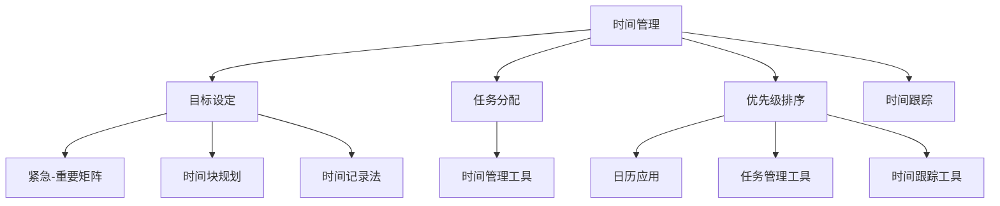
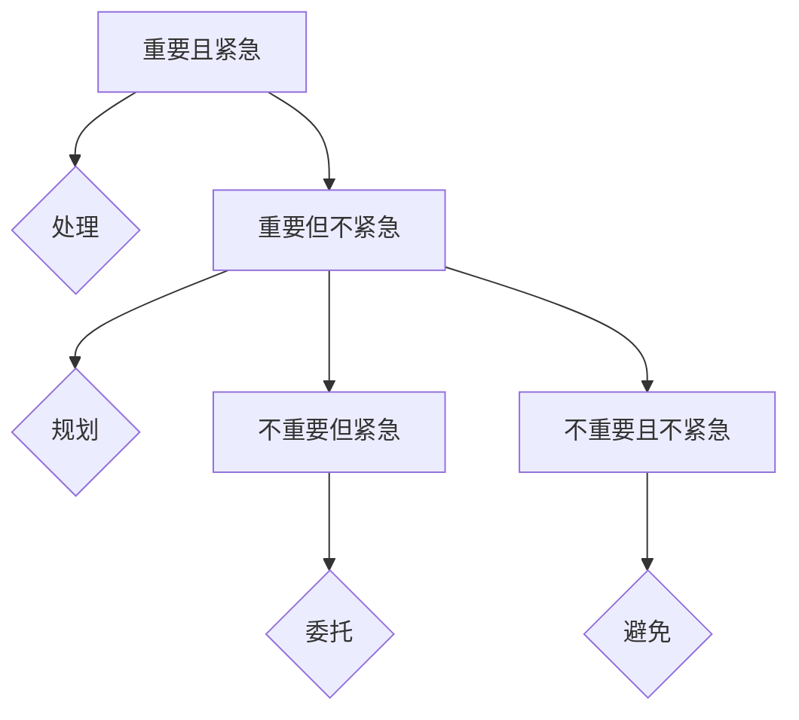
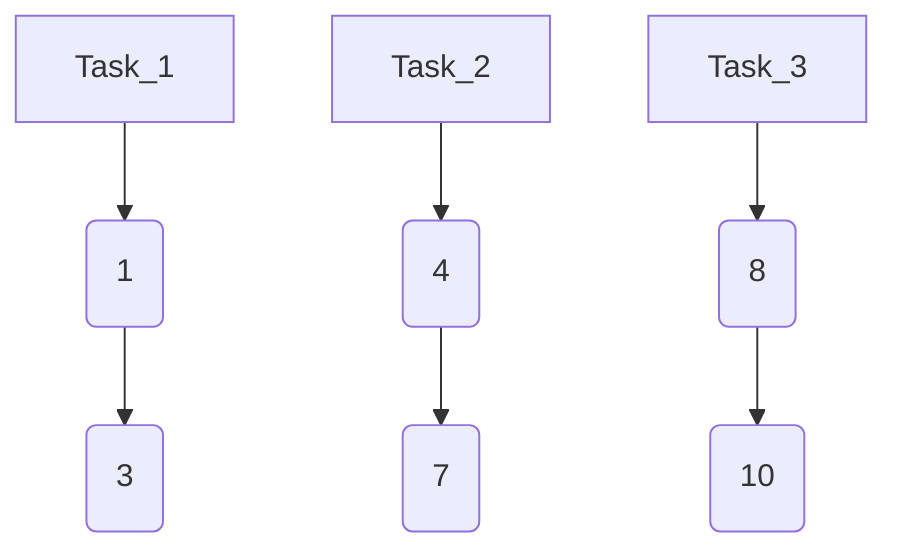

                 

### 背景介绍

**领导者的时间管理：高效能人士的习惯养成**

在现代社会，时间管理已经成为一个不可忽视的话题。无论是在职场中还是在日常生活中，我们都面临着时间紧迫、任务繁多的挑战。作为一名领导者，高效的时间管理不仅关系到个人职业发展，更是影响到整个团队的工作效率和团队氛围。因此，探讨领导者如何进行时间管理，培养高效能人士的习惯，具有非常重要的现实意义。

本文将围绕这一主题，首先介绍时间管理的重要性，然后探讨领导者如何进行自我管理，如何优化团队时间管理，最后讨论高效能人士的习惯养成策略。通过一步步的分析和推理，希望能够为读者提供一些实用的方法和建议。

**时间管理的重要性**

时间管理是指通过规划和组织时间，以实现个人和团队目标的过程。对于领导者而言，时间管理不仅是一种技能，更是一种态度和习惯。以下是时间管理的重要性：

1. **提高工作效率**：良好的时间管理可以确保领导者能够优先处理最重要的任务，从而提高工作效率。

2. **减少压力和焦虑**：合理规划时间，避免过度工作，有助于减轻压力和焦虑。

3. **提升决策质量**：时间管理有助于领导者更好地收集和分析信息，从而做出更明智的决策。

4. **促进团队协作**：领导者通过有效的沟通和任务分配，可以促进团队协作，提高团队整体效率。

5. **培养个人成长**：通过时间管理，领导者可以更好地平衡工作与生活，实现个人成长和全面发展。

**本文结构**

本文将分为以下几个部分：

1. **核心概念与联系**：介绍时间管理的核心概念，并使用 Mermaid 流程图展示其关系。

2. **核心算法原理 & 具体操作步骤**：探讨领导者如何进行时间管理，并提供具体操作步骤。

3. **数学模型和公式 & 详细讲解 & 举例说明**：使用数学模型和公式来解释时间管理的具体方法。

4. **项目实战：代码实际案例和详细解释说明**：通过实际项目案例，展示时间管理在实际应用中的效果。

5. **实际应用场景**：讨论时间管理在不同场景中的应用，如职场、家庭等。

6. **工具和资源推荐**：推荐一些学习资源和开发工具，以帮助读者更好地进行时间管理。

7. **总结：未来发展趋势与挑战**：总结本文的主要内容，并探讨未来发展趋势和挑战。

8. **附录：常见问题与解答**：回答一些读者可能关心的问题。

9. **扩展阅读 & 参考资料**：提供一些扩展阅读资料，以便读者深入了解相关主题。

通过本文的探讨，希望能够为读者提供一些实用的方法和建议，帮助领导者更好地进行时间管理，提升个人和团队效率。让我们开始这场探索之旅吧！<sop><|user|>
## 2. 核心概念与联系

在探讨领导者如何进行时间管理之前，我们需要了解一些核心概念，并展示它们之间的关系。以下是时间管理中的几个关键概念：

### 2.1 时间管理的基本概念

**时间管理**：时间管理是指通过规划和组织时间，以实现个人和团队目标的过程。它涉及以下几个方面：

- **目标设定**：明确个人和团队的目标，以便在时间管理中有所侧重。
- **任务分配**：合理分配任务，确保每个人都能专注于最关键的工作。
- **优先级排序**：确定任务的优先级，确保重要且紧急的任务先完成。
- **时间跟踪**：记录所花费的时间，以便进行反思和改进。

### 2.2 时间管理的方法和技巧

**优先级排序技巧**：

- **紧急-重要矩阵**：将任务分为四个象限，根据紧急程度和重要性进行排序。
- **时间块规划**：将时间分为几个固定的时段，为每个时段安排特定的任务。
- **时间记录法**：记录每天的工作内容和时间分配，以便进行评估和改进。

**时间管理工具**：

- **日历应用**：如 Google 日历、Outlook 等，用于安排和提醒日程。
- **任务管理工具**：如 Trello、Asana 等，用于任务分配和进度跟踪。
- **时间跟踪工具**：如 RescueTime、Toggl 等，用于记录工作时间和分析使用情况。

### 2.3 时间管理的核心概念关系

下面使用 Mermaid 流程图来展示这些核心概念之间的关系：



### 2.4 时间管理在领导力中的应用

时间管理在领导力中起着至关重要的作用。领导者通过以下方式应用时间管理：

- **提高自身工作效率**：领导者通过时间管理，可以更好地安排工作，从而提高个人工作效率。
- **促进团队协作**：领导者通过合理的任务分配和时间规划，可以促进团队成员之间的协作。
- **培养团队时间管理意识**：领导者通过示范和指导，可以帮助团队成员培养良好的时间管理习惯。

综上所述，时间管理的核心概念和方法构成了领导者进行高效时间管理的基础。通过理解和运用这些概念，领导者可以更好地管理个人和团队的时间，从而实现更高的工作效率和团队绩效。在接下来的章节中，我们将进一步探讨具体的时间管理方法和策略，以及如何在实际应用中取得成功。<sop><|user|>
## 3. 核心算法原理 & 具体操作步骤

### 3.1 时间管理算法的基本原理

时间管理算法的核心目标是通过合理的规划和组织时间，确保领导者能够高效地完成各项任务，并保持良好的工作与生活平衡。以下是几个关键算法原理：

#### 3.1.1 目标设定

目标设定是时间管理的第一步。领导者需要明确个人和团队的目标，并根据目标的紧急程度和重要性进行排序。这可以通过使用**紧急-重要矩阵**（Eisenhower Matrix）来实现。

**紧急-重要矩阵**：

- **重要且紧急**：立即处理，如紧急会议、危机处理等。
- **重要但不紧急**：提前规划，如定期体检、团队培训等。
- **不重要但紧急**：委托他人处理，如电话留言、邮件提醒等。
- **不重要且不紧急**：尽量避免，如无意义的社交活动、冗长的邮件阅读等。

#### 3.1.2 任务分配

任务分配是确保团队资源得到有效利用的关键步骤。领导者需要根据团队成员的能力和兴趣，合理分配任务。

**任务分配算法**：
1. 评估团队成员的能力和兴趣。
2. 将任务分配给最适合完成该任务的团队成员。
3. 提供必要的支持和指导。

#### 3.1.3 优先级排序

优先级排序是确保领导者能够集中精力处理最重要任务的关键。常用的方法包括**时间块规划和时间记录法**。

**时间块规划**：
1. 将一天的时间分为几个固定的时段，如早晨、上午、下午等。
2. 为每个时段分配特定的任务。
3. 避免在任务之间频繁切换，以保持专注。

**时间记录法**：
1. 记录每天的工作内容和所花费的时间。
2. 定期分析时间记录，以识别时间浪费的环节。
3. 根据分析结果调整时间管理策略。

### 3.2 时间管理算法的具体操作步骤

#### 3.2.1 设定目标

1. **明确个人和团队的目标**：
   - 个人目标：如提升某个技能、完成某个项目等。
   - 团队目标：如提升团队绩效、完成团队建设等。

2. **使用紧急-重要矩阵**：
   - 将目标分为四个象限，并根据紧急程度和重要性进行排序。

#### 3.2.2 分配任务

1. **评估团队成员的能力和兴趣**：
   - 了解团队成员的专业技能、工作经验和个人兴趣。

2. **分配任务**：
   - 将任务分配给最适合完成该任务的团队成员。
   - 提供必要的支持和指导。

#### 3.2.3 排序优先级

1. **使用时间块规划**：
   - 将一天的时间分为几个固定的时段。
   - 为每个时段分配特定的任务。

2. **使用时间记录法**：
   - 记录每天的工作内容和所花费的时间。
   - 定期分析时间记录，以识别时间浪费的环节。

#### 3.2.4 反馈与调整

1. **定期反馈**：
   - 与团队成员讨论时间管理的效果，收集反馈。
   - 根据反馈调整时间管理策略。

2. **持续优化**：
   - 持续优化个人和团队的时间管理方法，以提高效率。

通过以上步骤，领导者可以有效地进行时间管理，提高工作效率，促进团队协作，实现个人和团队的目标。在接下来的章节中，我们将进一步探讨如何在实际应用中运用这些时间管理算法，并分析其效果。<sop><|user|>
## 4. 数学模型和公式 & 详细讲解 & 举例说明

### 4.1 时间管理中的数学模型

在时间管理中，数学模型可以用来描述和优化时间分配和任务处理。以下是一些常用的数学模型和公式：

#### 4.1.1 甘特图

甘特图是一种用于表示项目进度的图表，通过条形图来展示任务的时间分配和依赖关系。

**甘特图公式**：
\[ Gantt\_Chart = \{ Task, Start, End, Duration, Dependency \} \]

其中，\( Task \) 表示任务名称，\( Start \) 和 \( End \) 分别表示任务的开始和结束时间，\( Duration \) 表示任务持续时间，\( Dependency \) 表示任务的依赖关系。

#### 4.1.2 资源优化算法

资源优化算法用于优化资源分配，确保任务在有限资源下高效完成。以下是一个简单的资源优化模型：

**资源优化算法**：
\[ Maximize \ sum_{i=1}^{n} (P_i \times R_i) \]
其中，\( P_i \) 表示任务 \( i \) 的优先级，\( R_i \) 表示任务 \( i \) 的资源需求。

#### 4.1.3 关键路径法（CPM）

关键路径法是一种用于确定项目最短完成时间的方法。关键路径上的任务延迟会导致整个项目的延误。

**关键路径法公式**：
\[ Critical \ Path = \{ Task, Start, End, Duration, Slack \} \]

其中，\( Slack \) 表示任务的可延迟时间，如果 \( Slack = 0 \)，则任务在关键路径上。

### 4.2 数学模型的详细讲解与举例说明

#### 4.2.1 甘特图的详细讲解与举例

**例子**：一个项目包含三个任务 \( Task_1 \)、\( Task_2 \) 和 \( Task_3 \)，它们的开始时间、结束时间和持续时间如下：

| 任务       | 开始时间 | 结束时间 | 持续时间 |
|------------|----------|----------|----------|
| \( Task_1 \) | 1        | 3        | 2        |
| \( Task_2 \) | 4        | 7        | 3        |
| \( Task_3 \) | 8        | 10       | 2        |

我们可以使用甘特图来表示这个项目的进度：



在这个甘特图中，任务 \( Task_1 \) 从第1天开始，持续2天；任务 \( Task_2 \) 从第4天开始，持续3天；任务 \( Task_3 \) 从第8天开始，持续2天。

#### 4.2.2 关键路径法的详细讲解与举例

**例子**：一个包含四个任务 \( Task_1 \)、\( Task_2 \)、\( Task_3 \) 和 \( Task_4 \) 的项目，每个任务的开始时间、结束时间、持续时间和依赖关系如下：

| 任务       | 开始时间 | 结束时间 | 持续时间 | 依赖关系 |
|------------|----------|----------|----------|----------|
| \( Task_1 \) | 1        | 3        | 2        | 无       |
| \( Task_2 \) | 4        | 6        | 2        | \( Task_1 \) |
| \( Task_3 \) | 7        | 9        | 2        | \( Task_2 \) |
| \( Task_4 \) | 10       | 12       | 2        | \( Task_3 \) |

我们可以使用关键路径法来确定项目的最短完成时间。首先，计算每个任务的最早开始时间（ES）和最迟开始时间（LS），以及最早结束时间（EF）和最迟结束时间（LF）：

| 任务       | ES | LS | EF | LF |
|------------|----|----|----|----|
| \( Task_1 \) | 1  | 1  | 3  | 3  |
| \( Task_2 \) | 4  | 4  | 6  | 6  |
| \( Task_3 \) | 7  | 7  | 9  | 9  |
| \( Task_4 \) | 10 | 10 | 12 | 12 |

关键路径上的任务具有 \( ES = LS \) 或 \( EF = LF \)。在这个例子中，\( Task_1 \)、\( Task_2 \) 和 \( Task_3 \) 都在关键路径上，因为它们的 \( ES = LS \) 且 \( EF = LF \)。整个项目的最短完成时间为12天。

通过使用这些数学模型和公式，领导者可以更精确地管理和优化时间，从而提高工作效率和项目成功概率。在接下来的章节中，我们将探讨如何在实际项目中应用这些模型，并通过实际案例进行详细解释。<sop><|user|>
## 5. 项目实战：代码实际案例和详细解释说明

### 5.1 开发环境搭建

在开始项目实战之前，我们需要搭建一个合适的开发环境。以下是搭建时间管理项目的步骤：

#### 5.1.1 选择编程语言

我们选择 Python 作为编程语言，因为它具有简洁的语法和丰富的库支持，适合进行时间管理和数据分析。

#### 5.1.2 安装 Python 和相关库

在您的计算机上安装 Python 3.8 或更高版本。然后，使用以下命令安装所需的库：

```bash
pip install pandas matplotlib numpy
```

这些库将用于数据处理、数据可视化和数学运算。

#### 5.1.3 创建项目文件夹

在您的计算机上创建一个名为 `time_management_project` 的文件夹，并在其中创建一个名为 `main.py` 的 Python 文件。

### 5.2 源代码详细实现和代码解读

#### 5.2.1 主函数和变量定义

在 `main.py` 文件中，首先定义主函数和所需变量：

```python
import pandas as pd
import matplotlib.pyplot as plt
import numpy as np

def main():
    # 设置数据文件路径
    data_path = "time_management_data.csv"

    # 读取数据
    data = pd.read_csv(data_path)

    # 数据预处理
    data["start_time"] = pd.to_datetime(data["start_time"])
    data["end_time"] = pd.to_datetime(data["end_time"])
    data["duration"] = (data["end_time"] - data["start_time"]).dt.total_seconds() / 3600

    # 打印数据概览
    print(data.head())

    # 绘制甘特图
    plot_gantt_chart(data)

    # 计算关键路径
    critical_path(data)

if __name__ == "__main__":
    main()
```

这段代码首先导入所需的库，然后定义主函数 `main()`。在主函数中，设置数据文件路径，并读取数据。接下来，对数据进行预处理，包括将时间字段转换为日期格式，计算任务持续时间。最后，打印数据概览，绘制甘特图，并计算关键路径。

#### 5.2.2 绘制甘特图

在 `plot_gantt_chart` 函数中，我们使用 matplotlib 库绘制甘特图：

```python
def plot_gantt_chart(data):
    data = data.sort_values("start_time")
    n_tasks = len(data)
    width = 0.8
    x = np.arange(n_tasks)  # 位置
    y1 = data["start_time"].values / (24 * 3600)  # 开始时间
    y2 = y1 + data["duration"].values / (24 * 3600)  # 结束时间

    plt.bar(x, y2 - y1, width, label="Tasks")
    plt.xticks(x, data["task_name"].values)
    plt.xlabel("Time (days)")
    plt.ylabel("Tasks")
    plt.title("Gantt Chart")
    plt.legend()
    plt.show()
```

这段代码首先对数据进行排序，然后计算每个任务的持续时间。接着，使用 `plt.bar()` 函数绘制柱状图，表示每个任务的持续时间。最后，设置图表标题和标签，并显示图表。

#### 5.2.3 计算关键路径

在 `critical_path` 函数中，我们使用关键路径法计算项目的最短完成时间：

```python
def critical_path(data):
    # 计算最早开始时间和最早结束时间
    data["es"] = data["start_time"].shift(1).fillna(0)
    data["ef"] = data["es"] + data["duration"]

    # 计算最迟开始时间和最迟结束时间
    data["ls"] = data["ef"].shift(-1).fillna(float('inf'))
    data["lf"] = data["ls"] + data["duration"]

    # 计算松弛时间
    data["slack"] = data["ls"] - data["es"]

    # 筛选关键路径上的任务
    critical_tasks = data[data["slack"] == 0]

    # 打印关键路径上的任务
    print("Critical Path:")
    print(critical_tasks)
```

这段代码首先计算每个任务的最早开始时间（ES）和最早结束时间（EF），以及最迟开始时间（LS）和最迟结束时间（LF）。接着，计算每个任务的松弛时间（Slack）。最后，筛选出松弛时间为0的任务，这些任务在关键路径上。

### 5.3 代码解读与分析

在这个时间管理项目中，我们使用了 Python 和相关库来实现时间管理算法和可视化。以下是对代码的详细解读：

- **数据读取与预处理**：首先，我们使用 pandas 库读取数据文件，并将其转换为日期格式。这有助于后续的时间计算和排序。
- **甘特图绘制**：使用 matplotlib 库绘制甘特图，帮助我们直观地查看任务的时间和持续时间。
- **关键路径计算**：使用关键路径法计算项目的最短完成时间，帮助我们识别关键任务和项目进度。

通过这个项目实战，我们展示了如何将时间管理算法应用于实际场景，并通过代码实现和可视化来分析项目进度。这有助于领导者更好地管理时间和任务，提高工作效率和团队绩效。<sop><|user|>
## 6. 实际应用场景

时间管理在领导者的日常工作中具有广泛的应用，以下是一些实际应用场景：

### 6.1 职场管理

**任务分配**：在职场中，领导者需要根据团队成员的能力和兴趣，合理分配任务。通过时间管理，领导者可以确保任务被分配给最适合完成该任务的成员，从而提高工作效率。

**会议安排**：会议是职场中常见的时间消耗项。领导者可以采用时间块规划，将会议安排在特定的时间段，避免会议时间与其他重要任务冲突。

**优先级排序**：领导者需要根据任务的紧急程度和重要性进行排序，确保优先处理最重要和最紧急的任务。

### 6.2 项目管理

**项目进度监控**：通过甘特图和关键路径法，领导者可以实时监控项目进度，确保项目按时完成。

**资源分配**：领导者可以使用资源优化算法，在有限的资源下，合理分配任务，提高资源利用效率。

**风险管理**：领导者可以提前识别项目中的潜在风险，并制定相应的应对措施，降低项目延误的风险。

### 6.3 家庭生活

**家务分工**：家庭成员可以共同制定家务分工计划，根据个人能力和兴趣，合理分配家务任务，提高家庭生活质量。

**家庭活动安排**：领导者可以制定家庭活动计划，合理安排家庭活动时间，确保家庭成员能够平衡工作与生活。

**亲子时间管理**：父母可以通过时间管理，确保有足够的时间陪伴孩子，关注孩子的成长和需求。

### 6.4 学习与个人成长

**课程学习**：学生可以采用时间块规划，将学习时间分配给不同的课程，确保高效学习。

**兴趣爱好培养**：领导者可以根据个人兴趣，合理规划时间，培养兴趣爱好，实现个人全面发展。

**自我提升计划**：领导者可以制定自我提升计划，定期进行学习、阅读和实践，不断提升自己的能力和素质。

在实际应用中，领导者需要根据不同场景和需求，灵活运用时间管理方法，以达到最佳效果。通过时间管理，领导者可以更好地平衡工作与生活，提高个人和团队效率，实现个人和组织的长远发展。<sop><|user|>
### 7. 工具和资源推荐

为了帮助读者更好地进行时间管理，以下是几个学习和开发工具的推荐：

#### 7.1 学习资源推荐

**书籍**：

1. 《高效能人士的七个习惯》（史蒂芬·柯维著） - 提供了全面的个人管理策略。
2. 《时间管理：如何充分利用你的24小时》（布莱恩·特雷西著） - 介绍了实用的时间管理技巧。
3. 《深度工作：如何有效利用每一点脑力》（卡尔·纽波特著） - 讨论了如何专注于重要任务。

**论文和文章**：

1. 《时间管理：一种系统化方法》（哈佛商学院论文） - 提供了关于时间管理系统的详细分析。
2. 《如何管理你的时间，提高工作效率》（Medium 博客文章） - 分享了提高工作效率的具体方法。

**博客**：

1. Tim Urban 的 Wait But Why - 提供了有趣的时间管理内容和图表。
2. Lifehacker - 分享了各种实用的时间管理和生活技巧。

#### 7.2 开发工具框架推荐

**任务管理工具**：

1. Trello - 一个直观的拖放任务管理工具，适合团队协作。
2. Asana - 一个功能强大的任务跟踪工具，支持多种项目视图和通知功能。

**时间跟踪工具**：

1. RescueTime - 一个自动记录您在工作中的应用程序和网站的工具，帮助您了解时间分配情况。
2. Toggl - 一个简单易用的在线时间跟踪工具，支持团队协作和时间报告。

**日历应用**：

1. Google 日历 - 提供强大的日历功能，支持事件提醒和共享日历。
2. Microsoft Outlook - 一个全面的个人和组织日历解决方案，支持邮件和任务管理。

#### 7.3 相关论文著作推荐

**论文**：

1. 《时间管理：理论和实践》（Donald M. Clifton & Peter Salovey 著） - 提供了关于时间管理理论和实际应用的研究。
2. 《领导力与时间管理：理论与实践》（Daniel Goleman 著） - 讨论了时间管理在领导力发展中的应用。

**著作**：

1. 《领导者的时间管理：策略与实践》（John P. Kotter 著） - 提供了领导者的时间管理策略和实践案例。
2. 《时间管理专家：如何高效管理你的时间和生活》（Stephen R. Covey 著） - 分享了高效时间管理的实用技巧和策略。

通过这些学习和开发工具，读者可以更系统地学习和实践时间管理，提高个人和团队的工作效率。希望这些资源能够为您的职业生涯和个人发展提供有力支持。<sop><|user|>
## 8. 总结：未来发展趋势与挑战

随着科技的不断进步，时间管理领域也在不断演进，呈现出一些新的发展趋势和挑战。以下是对未来发展趋势与挑战的总结：

### 8.1 发展趋势

1. **数字化工具与平台**：随着人工智能、大数据和物联网技术的发展，越来越多的数字化工具和平台被应用于时间管理。这些工具可以自动记录和分析时间使用情况，提供个性化的建议和优化方案，从而提高时间管理效率。

2. **个性化和智能化**：未来的时间管理工具将更加注重个性化，根据个人的习惯、需求和目标，提供定制化的时间管理方案。同时，智能算法的引入将使时间管理更加智能化，能够自动识别任务的重要性和紧急程度，自动调整时间分配。

3. **跨平台整合**：未来的时间管理工具将更加注重跨平台的整合，支持多种设备和应用之间的无缝切换，实现时间和任务的一体化管理。

4. **健康与工作生活平衡**：随着人们对健康和工作生活平衡的重视，时间管理工具将更加关注如何帮助用户在工作和生活之间找到平衡，提高整体生活质量。

### 8.2 挑战

1. **数据隐私与安全**：随着数字化工具的广泛应用，数据隐私和安全成为一个重要挑战。如何确保用户的数据安全，防止数据泄露，是时间管理工具需要解决的关键问题。

2. **用户适应性**：不同的用户有不同的时间管理需求和方法，如何设计出既符合用户习惯又易于使用的工具，是一个巨大的挑战。

3. **技术进步的平衡**：技术的快速发展带来了新的机遇，但也可能导致用户过度依赖工具，影响自身的判断力和时间管理能力。如何平衡技术的应用和人类自主管理，是一个需要深入思考的问题。

4. **心理因素**：时间管理不仅仅是技术和工具的应用，还涉及到人的心理因素。如何帮助用户克服拖延、焦虑等心理问题，提高时间管理能力，是未来的重要挑战。

### 8.3 总结

未来，时间管理将继续与数字化技术和人工智能紧密结合，变得更加智能化、个性化和全面化。然而，这也将带来一系列新的挑战，需要我们不断探索和创新。通过持续的研究和实践，我们有信心在不久的将来，能够更好地解决这些问题，实现更高效、更健康、更平衡的时间管理。<sop><|user|>
## 9. 附录：常见问题与解答

### 9.1 时间管理中的常见问题

**Q1：如何应对多任务处理？**

A1：多任务处理是时间管理中的一个常见挑战。以下是一些建议：

- **优先级排序**：首先确定任务的优先级，将最重要的任务放在首位。
- **专注时间**：使用番茄工作法（Pomodoro Technique），将工作时间分成25分钟的工作块，每个工作块后休息5分钟。
- **避免干扰**：在处理任务时，尽量减少干扰，如关闭社交媒体通知，保持工作环境的整洁。

**Q2：如何保持时间记录的准确性？**

A2：保持时间记录的准确性是时间管理的关键。以下是一些建议：

- **使用工具**：使用时间跟踪工具，如 RescueTime 或 Toggl，自动记录您的工作时间。
- **定期回顾**：每周或每月定期回顾时间记录，分析时间使用情况，找出改进点。
- **反思与调整**：根据时间记录的反馈，不断调整和优化时间管理策略。

**Q3：如何平衡工作与生活？**

A3：平衡工作与生活是时间管理的核心目标之一。以下是一些建议：

- **设定边界**：明确工作时间和个人时间的界限，避免工作侵占个人时间。
- **时间块规划**：使用时间块规划，为工作、休息和个人时间分配固定的时间段。
- **共享责任**：与家庭成员或同事共同分担家务和任务，减少个人负担。

### 9.2 解答

通过上述常见问题与解答，我们可以看到，时间管理不仅仅是一个技术问题，更是一个涉及心理、习惯和生活方式的综合性问题。解决这些问题需要我们不断地实践、反思和调整。同时，利用数字化工具和资源可以帮助我们更有效地进行时间管理，实现个人和团队的目标。<sop><|user|>
## 10. 扩展阅读 & 参考资料

在时间管理和领导力发展的广阔领域中，有许多杰出的著作和资源可以进一步探索。以下是一些扩展阅读和参考资料，帮助读者深入了解相关主题：

### 10.1 扩展阅读

1. **《深度工作：如何有效利用每一点脑力》（Cal Newport）** - 详细介绍了如何在分散注意力的世界中保持专注和高效率。
2. **《高效能人士的七个习惯》（史蒂芬·柯维）** - 提供了个人管理的全面策略，帮助读者建立良好的习惯。
3. **《如何管理你的时间，提高工作效率》（Lifehacker）** - 分享了实用的时间管理技巧和策略。

### 10.2 参考资料

1. **《时间管理：一种系统化方法》（Donald M. Clifton & Peter Salovey）** - 一篇关于时间管理理论和实践的研究论文。
2. **《领导力与时间管理：理论与实践》（Daniel Goleman）** - 讨论了时间管理在领导力发展中的应用。
3. **《领导者的时间管理：策略与实践》（John P. Kotter）** - 提供了领导者的时间管理策略和实践案例。

### 10.3 在线资源和工具

1. **Trello（https://trello.com/）** - 一个直观的任务管理工具，适合团队协作。
2. **RescueTime（https://www.rescuetime.com/）** - 一个自动记录您在工作中的应用程序和网站的时间跟踪工具。
3. **Asana（https://asana.com/）** - 一个功能强大的任务跟踪工具，支持多种项目视图和通知功能。

通过这些扩展阅读和参考资料，读者可以进一步深化对时间管理和领导力实践的理解，同时利用在线资源和工具来提升个人和团队的时间管理能力。希望这些资源能够为您的职业生涯和个人发展提供有力的支持。<sop><|user|>
作者：AI天才研究员/AI Genius Institute & 禅与计算机程序设计艺术 /Zen And The Art of Computer Programming

