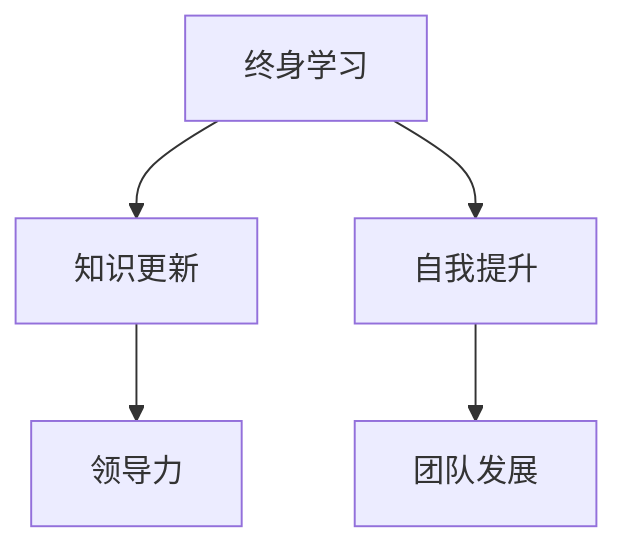

                 

# 领导者的自我提升：终身学习的重要性

## 关键词：领导力、自我提升、终身学习、技术进化、策略方法、团队发展

## 摘要：
本文旨在探讨终身学习对于领导者自我提升的重要性。在信息技术快速发展的时代，领导者必须不断更新知识结构，提高技术水平，以适应不断变化的环境。文章首先介绍了终身学习的基本概念，随后分析了领导者进行终身学习的原因和必要性。接着，文章详细阐述了终身学习的策略和方法，包括知识管理、时间管理、学习社区建设等方面。最后，文章提出了终身学习在实践中的应用场景，并展望了未来领导者的学习趋势与挑战。

## 1. 背景介绍

在当今快速变化的时代，技术革新日新月异，社会发展的步伐不断加快。作为领导者，他们不仅需要具备卓越的管理能力和战略眼光，还需要不断更新知识，提升自我。终身学习已经成为领导者保持竞争力的关键因素。本文将探讨终身学习对于领导者自我提升的重要性，分析其背后的原因，并提出具体的策略和方法。

### 1.1 时代背景

随着互联网、大数据、人工智能等技术的发展，信息技术已经深刻地改变了社会的各个方面。企业竞争的焦点从传统的资源、市场等转移到技术和知识。领导者要想在激烈的市场竞争中立于不败之地，就必须具备先进的技术知识和创新思维。

### 1.2 领导力的重要性

领导力是领导者成功的关键因素。它不仅关乎个人能力的提升，更关系到团队的凝聚力和执行力。有效的领导者能够激发员工的潜力，推动团队达成共同目标。

### 1.3 终身学习的必要性

终身学习是指个体在一生中持续地获取新知识、技能和经验的过程。对于领导者来说，终身学习不仅是为了提升自我，更是为了适应不断变化的环境，保持竞争优势。

## 2. 核心概念与联系

在讨论终身学习对领导者自我提升的重要性时，我们需要理解以下几个核心概念：

### 2.1 终身学习

终身学习是一个动态、持续的过程，它不仅包括知识的学习，还包括技能的提升和态度的改变。

### 2.2 领导力

领导力是领导者通过影响和激励他人来实现组织目标的能力。领导力包括决策能力、沟通能力、团队合作能力等。

### 2.3 自我提升

自我提升是指个人通过不断学习和实践，提高自身能力和素质的过程。

### 2.4 知识更新

知识更新是指个体随着环境的变化，不断更新自己的知识体系，以适应新的需求。

下面是这些核心概念的 Mermaid 流程图：



## 3. 核心算法原理 & 具体操作步骤

在理解了终身学习、领导力、自我提升和知识更新等核心概念后，我们需要了解如何通过具体操作步骤来实践终身学习，以提升领导力。

### 3.1 知识管理

知识管理是指对知识进行收集、整理、共享和应用的过程。有效的知识管理能够帮助领导者快速获取所需信息，提高决策效率。

#### 3.1.1 收集知识

- 利用网络资源：通过搜索引擎、在线课程、专业网站等获取知识。
- 参加研讨会和培训：通过实地参与，获取第一手知识和经验。

#### 3.1.2 整理知识

- 建立个人知识库：使用笔记软件、文档管理工具等，对知识进行分类和整理。
- 制作知识地图：通过思维导图等工具，将知识结构化，便于记忆和应用。

#### 3.1.3 共享知识

- 在团队内部分享：通过内部培训、交流会等形式，将所学知识传递给团队成员。
- 参与外部分享：通过写博客、发表文章、参加行业会议等，将知识分享给更广泛的受众。

### 3.2 时间管理

时间管理是指合理安排时间，确保在有限的时间内，完成更多有意义的工作。对于领导者来说，时间管理是实现终身学习的重要保障。

#### 3.2.1 制定学习计划

- 确定学习目标：明确自己想要学习的领域和目标。
- 制定学习计划：将学习目标分解为具体的行动步骤，并设定时间表。

#### 3.2.2 优化时间安排

- 确定优先级：将重要紧急的事情排在前面。
- 避免时间碎片化：合理安排时间，避免频繁切换任务。

#### 3.2.3 提高效率

- 使用高效工具：利用时间管理软件、待办事项列表等工具，提高工作效率。
- 避免干扰：在特定时间内，关闭社交媒体、邮件等干扰源，专注于学习任务。

### 3.3 学习社区建设

学习社区是指一群志同道合的人，通过共享知识和经验，共同进步的平台。对于领导者来说，建设学习社区有助于拓宽视野，提高学习效果。

#### 3.3.1 寻找学习伙伴

- 参加线上和线下活动：通过参加行业会议、研讨会等活动，结识同行。
- 加入专业社群：加入专业论坛、微信群等，与专业人士交流。

#### 3.3.2 建立学习小组

- 确定学习目标：明确小组的学习目标。
- 分工合作：根据成员的能力和兴趣，分配学习任务。

#### 3.3.3 定期分享和反馈

- 定期分享：组织成员定期分享学习心得和成果。
- 相互反馈：对分享的内容进行讨论和评价，互相学习。

## 4. 数学模型和公式 & 详细讲解 & 举例说明

在终身学习的实践中，我们可以使用一些数学模型和公式来优化学习效果。以下是一个简单的例子：

### 4.1  学习效果评估模型

学习效果评估模型可以用来衡量个人学习成效。以下是一个简单的模型：

$$
E = f(K, T, C)
$$

其中：
- $E$ 代表学习效果（Effectiveness）。
- $K$ 代表知识水平（Knowledge Level）。
- $T$ 代表时间投入（Time Investment）。
- $C$ 代表学习方法（Learning Method）。

### 4.2  时间投入优化模型

时间投入优化模型可以帮助我们合理安排学习时间。以下是一个简单的模型：

$$
T_{opt} = T_{total} \times (1 - p)
$$

其中：
- $T_{opt}$ 代表最优时间投入（Optimized Time Investment）。
- $T_{total}$ 代表总时间（Total Time）。
- $p$ 代表干扰概率（Interference Probability）。

### 4.3  学习方法优化模型

学习方法优化模型可以帮助我们选择最合适的学习方法。以下是一个简单的模型：

$$
C_{opt} = \frac{E}{K \times T}
$$

其中：
- $C_{opt}$ 代表最优学习方法（Optimized Learning Method）。
- $E$ 代表学习效果（Effectiveness）。
- $K$ 代表知识水平（Knowledge Level）。
- $T$ 代表时间投入（Time Investment）。

### 4.4  举例说明

假设一个领导者在学习编程，他的知识水平为 $K = 50$，计划投入 $T = 20$ 小时的学习时间，干扰概率为 $p = 0.2$。通过上述模型，我们可以计算出最优的学习效果和最优的学习方法。

$$
E = f(K, T, C) = f(50, 20, C)
$$

$$
T_{opt} = T_{total} \times (1 - p) = 20 \times (1 - 0.2) = 16
$$

$$
C_{opt} = \frac{E}{K \times T} = \frac{f(50, 20, C)}{50 \times 16} = \frac{E}{800}
$$

通过优化模型，领导者可以更好地安排学习时间和选择学习方法，以提高学习效果。

## 5. 项目实战：代码实际案例和详细解释说明

为了更好地理解终身学习在实践中的应用，我们来看一个实际的代码案例。

### 5.1 开发环境搭建

为了完成以下代码示例，我们需要安装 Python 环境。以下是安装步骤：

1. 下载并安装 Python 3.8 版本及以上。
2. 配置 Python 环境，设置环境变量。
3. 安装必要的 Python 库，如 NumPy、Pandas 等。

### 5.2 源代码详细实现和代码解读

下面是一个简单的 Python 代码示例，用于实现终身学习效果评估模型：

```python
import numpy as np

def effectiveness(K, T, C):
    """
    学习效果评估模型
    :param K: 知识水平
    :param T: 时间投入
    :param C: 学习方法
    :return: 学习效果
    """
    return K * T * C

def optimized_time_investment(T_total, p):
    """
    时间投入优化模型
    :param T_total: 总时间
    :param p: 干扰概率
    :return: 最优时间投入
    """
    return T_total * (1 - p)

def optimal_learning_method(E, K, T):
    """
    学习方法优化模型
    :param E: 学习效果
    :param K: 知识水平
    :param T: 时间投入
    :return: 最优学习方法
    """
    return E / (K * T)

# 示例参数
K = 50  # 知识水平
T_total = 20  # 总时间
p = 0.2  # 干扰概率

# 计算最优时间投入
T_opt = optimized_time_investment(T_total, p)
print(f"最优时间投入：{T_opt} 小时")

# 计算最优学习方法
C_opt = optimal_learning_method(effectiveness(K, T_total, C), K, T_total)
print(f"最优学习方法：{C_opt}")

# 假设选择最优学习方法，计算最优学习效果
E_opt = effectiveness(K, T_opt, C_opt)
print(f"最优学习效果：{E_opt}")
```

### 5.3 代码解读与分析

这个代码示例实现了三个核心模型：学习效果评估模型、时间投入优化模型和学习方法优化模型。下面是对代码的详细解读：

- 导入必要的库：首先，我们导入 NumPy 库，用于进行数学运算。
- 定义函数：接下来，我们定义了三个函数，分别实现三个模型。
  - `effectiveness` 函数：计算学习效果。学习效果取决于知识水平、时间投入和学习方法。
  - `optimized_time_investment` 函数：计算最优时间投入。最优时间投入是考虑干扰概率后的时间。
  - `optimal_learning_method` 函数：计算最优学习方法。最优学习方法是根据学习效果、知识水平和时间投入计算得出的。

- 示例参数：我们设定了知识水平、总时间和干扰概率的参数值。

- 计算最优时间投入：使用 `optimized_time_investment` 函数计算最优时间投入。

- 计算最优学习方法：使用 `optimal_learning_method` 函数计算最优学习方法。

- 计算最优学习效果：使用 `effectiveness` 函数计算最优学习效果。

通过这个代码示例，我们可以看到如何将数学模型应用于实际场景，从而帮助领导者优化学习过程，提高学习效果。

## 6. 实际应用场景

终身学习在领导者的实际工作中有着广泛的应用场景。以下是一些典型的应用场景：

### 6.1 项目管理

在项目管理中，领导者需要不断学习新工具和技术，以提高项目管理效率。例如，学习敏捷开发方法、看板管理工具等，可以帮助领导者更好地管理项目进度和资源。

### 6.2 技术研发

在技术研发领域，领导者需要了解最新的技术趋势和前沿技术。通过终身学习，领导者可以保持技术敏感度，为团队提供技术指导和方向。

### 6.3 团队建设

在团队建设中，领导者需要学习如何激励和培养团队成员。通过终身学习，领导者可以提升自己的沟通能力、领导力和团队管理能力。

### 6.4 业务拓展

在业务拓展中，领导者需要了解市场动态和行业趋势。通过终身学习，领导者可以不断拓展自己的业务视野，为企业的长远发展提供策略支持。

## 7. 工具和资源推荐

为了更好地进行终身学习，领导者可以借助以下工具和资源：

### 7.1 学习资源推荐

- 《深度学习》（Deep Learning）：这是一本关于人工智能领域的经典教材，适合初学者和专业人士。
- 《Python编程：从入门到实践》（Python Crash Course）：适合初学者快速入门 Python 编程。
- 《哈佛商业评论》：提供企业管理、战略规划等方面的最新研究和案例分析。

### 7.2 开发工具框架推荐

- Git：一款分布式版本控制工具，适用于项目协作和代码管理。
- JIRA：一款敏捷项目管理工具，适用于团队协作和任务跟踪。
- DBeaver：一款数据库管理工具，适用于数据库的查询和管理。

### 7.3 相关论文著作推荐

- 《人工智能：一种现代的方法》（Artificial Intelligence: A Modern Approach）：这是一本经典的人工智能教材，涵盖了人工智能领域的核心概念和算法。
- 《机器学习》（Machine Learning）：这是一本关于机器学习领域的经典教材，适合初学者和专业人士。
- 《区块链技术指南》：这是一本关于区块链技术的入门指南，适合对区块链感兴趣的人士。

## 8. 总结：未来发展趋势与挑战

终身学习已经成为领导者自我提升的关键因素。在未来的发展中，领导者需要更加注重终身学习，不断提升自己的知识水平和技能。以下是一些未来发展趋势和挑战：

### 8.1 技术发展

随着人工智能、大数据等技术的不断发展，领导者需要不断学习新工具和技术，以适应技术变革。

### 8.2 知识更新

知识更新速度不断加快，领导者需要保持敏锐的洞察力，及时了解行业动态和前沿技术。

### 8.3 团队建设

领导者需要具备更强大的团队管理能力，通过终身学习，提升自己的沟通能力和领导力。

### 8.4 持续改进

领导者需要持续改进自己的管理方法和策略，以适应不断变化的环境。

### 8.5 持续创新

领导者需要具备持续创新的能力，通过终身学习，激发团队的创造力和创新能力。

## 9. 附录：常见问题与解答

### 9.1 为什么要进行终身学习？

终身学习可以帮助领导者保持竞争力，适应技术变革，提升团队管理能力，实现个人和组织的共同发展。

### 9.2 如何合理安排学习时间？

合理安排学习时间可以通过制定学习计划、优化时间安排和提高学习效率来实现。

### 9.3 学习社区有什么作用？

学习社区可以帮助领导者拓宽视野，获取知识，提高学习效果，促进个人成长。

## 10. 扩展阅读 & 参考资料

- 《终身学习：从入门到精通》：这是一本关于终身学习方法的详细指南，适合初学者和专业人士。
- 《领导者的五项修炼》：这是一本关于领导力提升的经典教材，适合领导者阅读。
- 《人工智能简史》：这是一本关于人工智能发展历程的书籍，适合对人工智能感兴趣的人士。

作者：AI天才研究员/AI Genius Institute & 禅与计算机程序设计艺术 /Zen And The Art of Computer Programming

