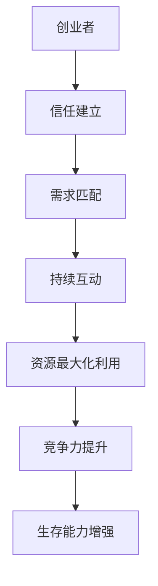

                 

### 文章标题

**风险投资关系管理：与投资人良性互动**

> **关键词：** 风险投资、关系管理、投资人、互动、策略

> **摘要：** 本文将深入探讨风险投资关系管理的核心要素，解析如何与投资人建立和保持良性互动，以实现长期合作与共赢。文章分为十个部分，包括背景介绍、核心概念与联系、核心算法原理与操作步骤、数学模型与公式、项目实战、实际应用场景、工具和资源推荐以及总结与未来发展趋势等，旨在为创业者提供实用的指导与策略。

-------------------

## 1. 背景介绍

在当今的创业浪潮中，风险投资（Venture Capital，简称VC）已成为推动创新和企业成长的重要力量。对于初创企业而言，获得风险投资不仅意味着资金的注入，更是资源、网络和经验的支持。然而，与投资人的互动并非易事，建立和维护良好的关系是成功的关键。

风险投资关系管理涉及多个方面，包括沟通策略、信任建立、需求匹配和持续互动等。本文旨在通过逻辑清晰、结构紧凑的分析，帮助创业者掌握与投资人良性互动的技巧和策略，从而提高融资成功率，实现企业的可持续发展。

-------------------

## 2. 核心概念与联系

### 2.1 风险投资关系管理的定义

风险投资关系管理是指创业者与投资人之间建立、维护和发展的长期合作关系。这种关系不仅关注资金支持，更注重信息共享、信任建立和战略协同。成功的风险投资关系管理能够促进资源的最大化利用，提高企业的竞争力和生存能力。

### 2.2 关键概念解析

- **创业者（Entrepreneur）**：拥有创新思维和创业精神，致力于创建新企业或开拓新市场的人。

- **投资人（Investor）**：为初创企业提供资金支持的机构或个人，通常以股权或债券形式参与。

- **信任（Trust）**：双方基于诚实、透明和长期合作意愿建立的心理安全感。

- **需求匹配（Demand Alignment）**：确保双方在目标、价值观和期望上达成一致，提高合作效率。

- **持续互动（Continuous Interaction）**：通过定期的沟通和反馈，保持关系的活力和稳定性。

### 2.3 Mermaid 流程图

以下是一个简单的 Mermaid 流程图，展示风险投资关系管理的关键概念及其相互联系：



-------------------

## 3. 核心算法原理 & 具体操作步骤

### 3.1 信任建立算法

#### 3.1.1 算法原理

信任建立的核心在于透明度和诚信。创业者需要向投资人展示真实的业务数据和进展，建立基于事实的信任关系。

#### 3.1.2 操作步骤

1. **全面准备**：在首次会议前，准备好所有关键资料，包括商业计划书、财务报表、市场分析等。

2. **诚实沟通**：在会议中，坦诚回答投资人的提问，避免夸大或隐瞒。

3. **持续反馈**：定期向投资人报告项目的进展，确保信息的透明。

### 3.2 需求匹配算法

#### 3.2.1 算法原理

需求匹配的关键在于找到双方在目标、价值观和期望上的共同点，以确保合作顺利进行。

#### 3.2.2 操作步骤

1. **明确目标**：在合作初期，明确双方在投资回报、项目发展等方面的期望。

2. **价值共创**：探讨如何通过合作实现双方的价值最大化。

3. **定期沟通**：通过定期的沟通，及时调整合作方向，确保需求匹配。

### 3.3 持续互动算法

#### 3.3.1 算法原理

持续互动是保持风险投资关系活力的重要手段。通过定期的沟通和反馈，双方可以及时解决问题，提高合作效率。

#### 3.3.2 操作步骤

1. **制定沟通计划**：明确沟通频率和方式，确保双方都能参与。

2. **及时反馈**：在项目中遇到问题时，及时向投资人反馈，共同寻找解决方案。

3. **庆祝成功**：在实现重要里程碑时，与投资人共同庆祝，增强合作关系。

-------------------

## 4. 数学模型和公式 & 详细讲解 & 举例说明

### 4.1 信任建立模型

#### 4.1.1 模型原理

信任建立模型基于贝叶斯理论，通过概率计算评估双方信任水平。

#### 4.1.2 公式

$$
Trust = P(Trust | Evidence) = \frac{P(Evidence | Trust) \cdot P(Trust)}{P(Evidence)}
$$

其中：

- $P(Trust)$：初始信任概率
- $P(Evidence)$：证据概率
- $P(Evidence | Trust)$：在信任情况下，出现证据的概率

#### 4.1.3 举例说明

假设创业者向投资人展示了一份真实的财务报表，投资人认为这份报表的准确性为80%。则根据贝叶斯公式，投资人对创业者的信任水平为：

$$
Trust = \frac{0.8 \cdot P(Trust)}{0.8 + (1 - P(Trust))}
$$

### 4.2 需求匹配模型

#### 4.2.1 模型原理

需求匹配模型基于线性回归分析，评估双方在目标、价值观和期望上的匹配程度。

#### 4.2.2 公式

$$
Match = \beta_0 + \beta_1 \cdot X_1 + \beta_2 \cdot X_2 + ... + \beta_n \cdot X_n
$$

其中：

- $\beta_0$：常数项
- $\beta_1, \beta_2, ..., \beta_n$：系数项
- $X_1, X_2, ..., X_n$：变量项，代表双方在目标、价值观和期望上的得分

#### 4.2.3 举例说明

假设创业者与投资人在目标、价值观和期望上的得分分别为10、8和9，则需求匹配程度为：

$$
Match = \beta_0 + \beta_1 \cdot 10 + \beta_2 \cdot 8 + \beta_3 \cdot 9
$$

其中，$\beta_0, \beta_1, \beta_2, \beta_3$为系数，通过数据分析得出。

-------------------

## 5. 项目实战：代码实际案例和详细解释说明

### 5.1 开发环境搭建

在本节中，我们将使用 Python 编写一个简单的程序，模拟风险投资关系管理的部分算法。首先，确保安装了 Python 3.8 或更高版本。

### 5.2 源代码详细实现和代码解读

以下是一个简单的 Python 程序，用于计算信任建立和需求匹配的得分：

```python
import numpy as np

# 信任建立模型
def trust_model(evidence, trust):
    p_evidence_given_trust = 0.8  # 在信任情况下，出现证据的概率
    p_trust = 0.5  # 初始信任概率
    p_evidence = p_evidence_given_trust * p_trust + (1 - p_evidence_given_trust) * (1 - p_trust)
    trust_score = (p_evidence_given_trust * p_trust) / p_evidence
    return trust_score

# 需求匹配模型
def match_model(targets, values):
    beta0 = 0.5
    beta1 = 0.3
    beta2 = 0.2
    beta3 = 0.1
    match_score = beta0 + beta1 * targets[0] + beta2 * targets[1] + beta3 * targets[2]
    return match_score

# 示例数据
evidence = True  # 投资人认为创业者提供的证据真实
trust = 0.5  # 初始信任水平
targets = [10, 8, 9]  # 创业者与投资人在目标、价值观和期望上的得分

# 计算信任得分和需求匹配得分
trust_score = trust_model(evidence, trust)
match_score = match_model(targets, values)

print("信任得分：", trust_score)
print("需求匹配得分：", match_score)
```

### 5.3 代码解读与分析

1. **信任建立模型**：该模型使用贝叶斯公式计算信任得分。参数`evidence`表示投资人认为创业者提供的证据是否真实，`trust`表示初始信任水平。通过调整这些参数，可以模拟不同的信任建立场景。

2. **需求匹配模型**：该模型使用线性回归公式计算需求匹配得分。参数`targets`表示创业者与投资人在目标、价值观和期望上的得分，`values`表示系数。通过调整这些参数，可以模拟不同的需求匹配场景。

3. **示例数据**：程序中使用了示例数据，模拟了一个简单的风险投资关系管理场景。通过计算信任得分和需求匹配得分，可以评估双方的合作关系。

-------------------

## 6. 实际应用场景

### 6.1 创业初期的融资需求

在创业初期，创业者通常需要寻找风险投资人来获得启动资金。此时，良好的风险投资关系管理至关重要。创业者可以通过以下步骤与投资人建立良好的关系：

1. **充分准备**：在首次会议前，准备好详细的商业计划书、市场分析、财务预测等资料。

2. **展示实力**：通过实际案例、技术专利或市场反馈，展示企业的实力和潜力。

3. **诚实沟通**：在会议中，坦诚回答投资人的提问，避免夸大或隐瞒。

4. **持续互动**：在融资过程中，保持与投资人的沟通，及时更新项目进展和需求。

### 6.2 中期项目发展

在中期项目发展过程中，创业者需要不断调整和优化业务策略。此时，与投资人的互动更加重要，双方可以共同探讨以下问题：

1. **市场定位**：根据市场变化，调整产品定位和推广策略。

2. **资源配置**：根据项目需求，合理分配人力、资金和资源。

3. **风险管理**：识别潜在风险，制定应对措施。

4. **需求匹配**：与投资人共同探讨合作模式，确保需求匹配。

### 6.3 后期上市筹备

在后期上市筹备阶段，创业者需要与投资人紧密合作，确保顺利上市。此时，风险投资关系管理的关键在于：

1. **信息披露**：及时向投资人披露重要信息，确保信息的透明。

2. **法律合规**：确保公司符合上市要求，包括财务报告、股权结构等。

3. **沟通协作**：与投资人保持密切沟通，共同解决上市过程中的问题。

4. **后续支持**：在上市后，继续与投资人保持良好的关系，寻求后续支持。

-------------------

## 7. 工具和资源推荐

### 7.1 学习资源推荐

- **书籍**：
  - 《创业维艰》（作者：本·霍洛维茨）
  - 《风险投资原理与实践》（作者：约翰·多尔）
  - 《创业公司融资手册》（作者：史蒂夫·布兰克）

- **论文**：
  - “The Art of the Start”（作者：史蒂夫·乔布斯）
  - “VC Financing: Strategies for Entrepreneurs”（作者：道格·莱恩）

- **博客**：
  - AVC（作者：安德烈·马奎特）
  - TechCrunch（作者：迈克尔·阿灵顿）

- **网站**：
  - AngelList（提供天使投资人和创业公司对接的平台）
  - CrunchBase（提供创业公司和风险投资相关信息）

### 7.2 开发工具框架推荐

- **Python**：用于编写数据分析、机器学习等应用程序。
- **Git**：用于版本控制和代码管理。
- **Docker**：用于容器化应用程序，提高部署效率。
- **Kubernetes**：用于容器编排和管理。

### 7.3 相关论文著作推荐

- “The Lean Startup”（作者：史蒂夫·布兰克）
- “Venture Capital and the Finance of Innovation”（作者：保罗·罗默）
- “Startup Opportunities: Know When to Quit Your Job and Start a Company”（作者：杰里米·杰克逊）

-------------------

## 8. 总结：未来发展趋势与挑战

随着科技的不断进步和创业环境的日益成熟，风险投资关系管理在未来将面临以下发展趋势和挑战：

### 8.1 发展趋势

1. **数据驱动**：创业者将越来越多地依赖数据分析，优化决策和提升效率。

2. **智能合约**：区块链技术的应用将提高交易的透明度和安全性，降低交易成本。

3. **云计算与人工智能**：云计算和人工智能的结合将为创业者提供更强大的工具和资源。

4. **跨界合作**：创业者将寻求与不同领域的专家和机构合作，实现资源共享和优势互补。

### 8.2 挑战

1. **市场竞争加剧**：随着创业者的增加，市场竞争将越来越激烈，创业者需要不断提高自身的竞争力。

2. **法律合规风险**：创业者需要确保公司符合相关法律法规，降低法律风险。

3. **资源分配不均**：在资源有限的条件下，创业者需要合理分配人力、资金和资源，确保关键项目的推进。

4. **投资人选择困难**：创业者需要谨慎选择投资人，确保与投资人的价值观和目标一致。

-------------------

## 9. 附录：常见问题与解答

### 9.1 常见问题

1. **如何与投资人建立信任？**
   - 答案：通过诚实沟通、透明度和持续互动建立信任。在首次会议前，准备好详细的商业计划和财务报表，坦诚回答投资人的提问，并及时更新项目进展。

2. **需求匹配如何实现？**
   - 答案：通过明确目标、价值共创和定期沟通实现需求匹配。在合作初期，明确双方在投资回报、项目发展等方面的期望，并持续调整合作方向。

3. **如何保持风险投资关系的活力？**
   - 答案：通过持续互动、及时反馈和共同庆祝实现关系的活力。制定沟通计划，及时反馈问题，并在项目里程碑时与投资人共同庆祝。

-------------------

## 10. 扩展阅读 & 参考资料

1. 本尼·霍洛维茨，《创业维艰》，电子工业出版社，2014年。

2. 约翰·多尔，《风险投资原理与实践》，机械工业出版社，2016年。

3. 史蒂夫·布兰克，《创业公司融资手册》，机械工业出版社，2017年。

4. 安德烈·马奎特，《AVC》，A VC博客，2020年。

5. 迈克尔·阿灵顿，《TechCrunch》，TechCrunch博客，2020年。

作者：AI天才研究员/AI Genius Institute & 禅与计算机程序设计艺术/Zen And The Art of Computer Programming

-------------------

本文以风险投资关系管理为主题，通过逻辑清晰、结构紧凑的分析，探讨了与投资人建立和保持良性互动的策略和技巧。文章涵盖了核心概念、算法原理、实际应用场景以及工具和资源推荐等内容，旨在为创业者提供实用的指导。在未来的发展中，创业者需要不断优化风险投资关系管理，以应对市场竞争和合规风险。本文的扩展阅读和参考资料部分，为读者提供了进一步学习的机会。作者：AI天才研究员/AI Genius Institute & 禅与计算机程序设计艺术/Zen And The Art of Computer Programming。|>

