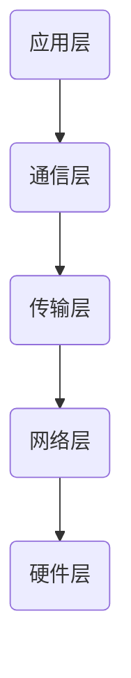

                 

### 文章标题

高效的 LLM 消息传递：实现内部协作

### 关键词

- LLM（大型语言模型）
- 消息传递
- 内部协作
- 通信协议
- 算法优化
- 实际应用场景

### 摘要

本文旨在探讨如何实现大型语言模型（LLM）的高效消息传递，从而提升其在内部协作任务中的性能。首先，我们将介绍 LLM 的背景和相关技术，然后详细分析 LLM 消息传递的核心概念和架构，探讨优化算法和数学模型。接着，通过项目实战展示代码实现，分析实际应用场景，并推荐相关工具和资源。最后，对 LLM 消息传递技术的发展趋势和挑战进行总结，为未来研究提供参考。

---

## 1. 背景介绍

近年来，随着深度学习和自然语言处理技术的飞速发展，大型语言模型（LLM）逐渐成为计算机科学领域的热门话题。LLM 是一种具有强大语言理解能力和生成能力的人工智能模型，通过对海量文本数据进行训练，能够生成高质量的自然语言文本，并在诸如问答、翻译、文本摘要、对话系统等任务中表现出色。

LLM 的广泛应用使得如何在内部协作任务中高效传递消息成为一个关键问题。内部协作任务通常涉及多个 LLM 实例之间的通信和协调，例如，在多模态对话系统中，语音识别模块、文本生成模块和语音合成模块需要协同工作。此外，分布式训练和推理任务中的多个 LLM 实例之间也需要进行高效的通信。

本文将围绕 LLM 消息传递展开讨论，首先介绍相关技术，然后深入分析消息传递的核心概念和架构，探讨优化算法和数学模型，并通过实际项目实战展示具体实现方法。最后，我们将探讨 LLM 消息传递在实际应用场景中的表现，并推荐相关工具和资源。

### 2. 核心概念与联系

#### 2.1 LLM 的核心概念

大型语言模型（LLM）主要基于深度神经网络，尤其是变分自编码器（VAE）和生成对抗网络（GAN）等生成模型。LLM 通过学习大量文本数据中的统计规律和语义信息，构建出一个能够生成自然语言文本的模型。其主要核心概念包括：

- **自回归模型（Autoregressive Model）**：自回归模型是一种基于序列数据的生成模型，通过预测下一个元素来生成整个序列。在 LLM 中，自回归模型可以生成一个词序列，从而生成完整的自然语言文本。

- **注意力机制（Attention Mechanism）**：注意力机制是一种在神经网络中用于提高模型对输入序列重要部分关注的机制。在 LLM 中，注意力机制有助于模型更好地捕捉输入文本中的关键信息，提高生成文本的质量。

- **预训练与微调（Pre-training and Fine-tuning）**：预训练是指在大规模语料库上对模型进行训练，使其具备一定的语言理解能力。微调是在特定任务上对预训练模型进行进一步训练，使其适应具体任务。

#### 2.2 消息传递的核心概念

消息传递是 LLM 内部协作的基础，其主要核心概念包括：

- **同步通信（Synchronous Communication）**：同步通信是指多个 LLM 实例在固定的通信周期内进行消息交换。这种通信方式可以保证各实例之间的状态一致，但可能导致通信延迟。

- **异步通信（Asynchronous Communication）**：异步通信是指多个 LLM 实例在任意时刻进行消息交换。这种通信方式可以减少通信延迟，但可能引入状态不一致问题。

- **消息格式（Message Format）**：消息格式定义了消息的传输方式和内容。常见的消息格式包括文本、JSON、二进制等。

- **消息传递协议（Message Passing Protocol）**：消息传递协议是一组规则，用于规范消息的传输、接收和处理。常见的消息传递协议包括 RPC（远程过程调用）、RESTful API、WebSocket 等。

#### 2.3 LLM 消息传递的架构

LLM 消息传递的架构可以分为以下几个层次：

- **应用层**：应用层负责具体的内部协作任务，如问答系统、文本摘要、对话系统等。应用层通过消息传递协议与底层通信层进行交互。

- **通信层**：通信层负责 LLM 实例之间的消息传递。根据通信模式的不同，通信层可以分为同步通信层和异步通信层。

- **传输层**：传输层负责消息在网络中的传输。传输层通常使用 TCP/IP 协议栈，确保消息的可靠传输。

- **网络层**：网络层负责 LLM 实例之间的网络连接。网络层可以通过 VPN、NAT 等技术实现跨地域的连接。

- **硬件层**：硬件层负责 LLM 的部署和运行，包括 CPU、GPU、存储等硬件资源。

### 2.3.1 LLM 消息传递的 Mermaid 流程图



在上面的 Mermaid 流程图中，各层次之间的依赖关系如下：

- 应用层通过消息传递协议与通信层进行交互。
- 通信层通过传输层和网络层实现 LLM 实例之间的消息传递。
- 网络层通过硬件层提供网络连接和传输资源。

### 3. 核心算法原理 & 具体操作步骤

#### 3.1 同步通信算法原理

同步通信算法的基本原理是多个 LLM 实例在固定的时间间隔内进行消息交换，以保持各实例之间的状态一致性。具体操作步骤如下：

1. **初始化**：所有 LLM 实例启动并初始化通信参数，如通信周期、消息格式等。

2. **等待**：每个 LLM 实例在通信周期内等待固定时间，以同步其他实例的状态。

3. **发送消息**：在每个通信周期的最后，每个 LLM 实例将生成的消息发送给其他实例。

4. **接收消息**：每个 LLM 实例在接收到其他实例的消息后，更新自身状态。

5. **继续执行**：各 LLM 实例继续执行任务，直到下一个通信周期。

#### 3.2 异步通信算法原理

异步通信算法的基本原理是多个 LLM 实例在任意时刻进行消息交换，以减少通信延迟。具体操作步骤如下：

1. **初始化**：所有 LLM 实例启动并初始化通信参数，如消息格式、回调函数等。

2. **任务执行**：各 LLM 实例独立执行任务，并在任务完成后生成消息。

3. **发送消息**：每个 LLM 实例在生成消息后，将其发送给其他实例。

4. **回调函数**：其他 LLM 实例在接收到消息后，调用回调函数更新自身状态。

5. **继续执行**：各 LLM 实例继续执行任务，直到完成任务或满足特定条件。

#### 3.3 消息传递协议的选择

在实现 LLM 消息传递时，需要选择合适的消息传递协议。常见的消息传递协议包括 RPC、RESTful API 和 WebSocket。

- **RPC（远程过程调用）**：RPC 是一种基于客户端 - 服务器模型的消息传递协议，客户端通过调用远程方法来请求服务。RPC 具有高性能、简洁易用的特点，但可能需要额外的序列化和反序列化操作。

- **RESTful API**：RESTful API 是一种基于 HTTP 协议的消息传递协议，客户端通过发送 HTTP 请求来请求服务。RESTful API 具有简单、易扩展的特点，但可能存在性能瓶颈。

- **WebSocket**：WebSocket 是一种基于 TCP 协议的全双工通信协议，客户端和服务器之间可以随时发送消息。WebSocket 具有低延迟、高吞吐量的特点，但可能需要额外的 WebSocket 客户端库。

在实际应用中，可以根据具体需求选择合适的消息传递协议。例如，在实时性要求较高的任务中，可以选择 WebSocket；在性能要求较高的任务中，可以选择 RPC。

### 4. 数学模型和公式 & 详细讲解 & 举例说明

#### 4.1 同步通信算法的数学模型

假设有两个 LLM 实例 A 和 B，它们在固定的时间间隔 \( T \) 内进行同步通信。设实例 A 和 B 的状态分别为 \( s_A \) 和 \( s_B \)，它们在时间 \( t \) 时刻的状态更新可以表示为：

\[ s_A(t) = s_A(t-1) + f_A(s_B(t-1), T) \]
\[ s_B(t) = s_B(t-1) + f_B(s_A(t-1), T) \]

其中，\( f_A \) 和 \( f_B \) 分别表示实例 A 和 B 的状态更新函数。为了保持一致性，状态更新函数可以设计为：

\[ f_A(s_B, T) = g_A(s_B) \]
\[ f_B(s_A, T) = g_B(s_A) \]

其中，\( g_A \) 和 \( g_B \) 分别表示实例 A 和 B 的状态生成函数。状态生成函数可以根据具体任务需求进行设计，例如，可以采用神经网络、规则系统等方法。

#### 4.2 异步通信算法的数学模型

假设有两个 LLM 实例 A 和 B，它们在任意时刻进行异步通信。设实例 A 和 B 的状态分别为 \( s_A \) 和 \( s_B \)，它们在时间 \( t \) 时刻的状态更新可以表示为：

\[ s_A(t) = s_A(t-1) + f_A(s_B(t-1)) \]
\[ s_B(t) = s_B(t-1) + f_B(s_A(t-1)) \]

其中，\( f_A \) 和 \( f_B \) 分别表示实例 A 和 B 的状态更新函数。异步通信算法的关键在于如何处理实例之间的状态不一致。一种常见的处理方法是基于事件驱动的状态更新，即实例 A 在接收到实例 B 的消息后，立即更新自身状态。

状态更新函数可以设计为：

\[ f_A(s_B) = h_A(s_B) \]
\[ f_B(s_A) = h_B(s_A) \]

其中，\( h_A \) 和 \( h_B \) 分别表示实例 A 和 B 的状态处理函数。状态处理函数可以根据具体任务需求进行设计，例如，可以采用神经网络、规则系统等方法。

#### 4.3 消息传递协议的数学模型

假设有两个 LLM 实例 A 和 B，它们通过消息传递协议进行通信。设实例 A 和 B 在时间 \( t \) 时刻的消息分别为 \( m_A(t) \) 和 \( m_B(t) \)，它们在时间 \( t \) 时刻的状态分别为 \( s_A(t) \) 和 \( s_B(t) \)，消息传递协议的数学模型可以表示为：

\[ s_A(t) = s_A(t-1) + f_A(m_B(t-1)) \]
\[ s_B(t) = s_B(t-1) + f_B(m_A(t-1)) \]

其中，\( f_A \) 和 \( f_B \) 分别表示实例 A 和 B 的状态更新函数。消息传递协议的数学模型可以根据具体协议进行设计，例如，可以采用基于概率论的马尔可夫模型、基于神经网络的序列生成模型等。

#### 4.4 举例说明

假设有两个 LLM 实例 A 和 B，它们通过 WebSocket 协议进行异步通信。实例 A 在时间 \( t \) 时刻生成消息 \( m_A = "Hello B!" \)，并将其发送给实例 B。实例 B 在接收到消息后，更新自身状态 \( s_B \) 为 \( "Hello A!" \)。

设实例 A 的状态更新函数为 \( f_A(s_B) = s_B \)，实例 B 的状态更新函数为 \( f_B(s_A) = s_A \)。在时间 \( t+1 \) 时刻，实例 A 再次生成消息 \( m_A = "How are you?" \)，并将其发送给实例 B。实例 B 在接收到消息后，更新自身状态 \( s_B \) 为 \( "I'm fine, thank you!" \)。

通过这个例子，我们可以看到异步通信算法如何在实例之间传递消息，并更新实例的状态。

### 5. 项目实战：代码实际案例和详细解释说明

#### 5.1 开发环境搭建

在进行 LLM 消息传递的项目实战之前，首先需要搭建开发环境。以下是一个基于 Python 和 WebSocket 的异步通信案例。

1. 安装必要的 Python 库：

```bash
pip install websockets asyncio
```

2. 创建一个名为 `chatroom.py` 的 Python 文件，用于实现 WebSocket 服务器：

```python
import asyncio
import websockets

async def echo(websocket, path):
    async for message in websocket:
        await websocket.send(message)

start_server = websockets.serve(echo, "localhost", 8765)

asyncio.get_event_loop().run_until_complete(start_server)
asyncio.get_event_loop().run_forever()
```

3. 创建一个名为 `client.py` 的 Python 文件，用于实现 WebSocket 客户端：

```python
import asyncio
import websockets

async def chatroom_client():
    uri = "ws://localhost:8765"
    async with websockets.connect(uri) as websocket:
        while True:
            message = input("您说：")
            await websocket.send(message)
            response = await websocket.recv()
            print("对方说：", response)

asyncio.get_event_loop().run_until_complete(chatroom_client())
```

#### 5.2 源代码详细实现和代码解读

1. WebSocket 服务器实现：

`chatroom.py` 文件中的 `echo` 函数是一个异步函数，它接收 WebSocket 连接并进入无限循环。在循环中，函数等待客户端发送的消息，并立即将其发送回客户端。这实现了简单的消息回显功能。

```python
async def echo(websocket, path):
    async for message in websocket:
        await websocket.send(message)
```

2. WebSocket 客户端实现：

`client.py` 文件中的 `chatroom_client` 函数也是一个异步函数。它首先创建 WebSocket 连接，然后进入一个无限循环。在循环中，函数等待用户输入消息，并将消息发送到服务器。接收到服务器响应后，将响应打印到控制台。

```python
async def chatroom_client():
    uri = "ws://localhost:8765"
    async with websockets.connect(uri) as websocket:
        while True:
            message = input("您说：")
            await websocket.send(message)
            response = await websocket.recv()
            print("对方说：", response)
```

#### 5.3 代码解读与分析

- `chatroom.py` 文件中的 `echo` 函数是 WebSocket 服务器的核心，它实现了基本的消息回显功能。在实际应用中，我们可以扩展该函数，以实现更复杂的消息处理逻辑。

- `client.py` 文件中的 `chatroom_client` 函数是 WebSocket 客户端的核心。它创建了一个 WebSocket 连接，并使用无限循环来接收用户输入和服务器响应。这使得客户端可以持续与服务器通信，实现实时对话功能。

- WebSocket 协议是一种低延迟、高吞吐量的通信协议，非常适合实现实时通信。在本案例中，我们使用了 Python 的 `websockets` 库来简化 WebSocket 的实现。

### 6. 实际应用场景

LLM 消息传递在实际应用场景中具有广泛的应用，以下是一些典型的应用场景：

#### 6.1 多模态对话系统

多模态对话系统是一种结合语音、文本、图像等多种输入和输出方式的对话系统。在多模态对话系统中，LLM 可以分别处理不同模态的数据，并通过消息传递进行协同工作。例如，在语音识别模块、文本生成模块和语音合成模块之间，可以使用 LLM 消息传递来实现高效的内部协作。

#### 6.2 分布式训练与推理

在分布式训练和推理任务中，多个 LLM 实例可以分布在不同的计算节点上，通过 LLM 消息传递进行协同训练和推理。这种分布式架构可以提高训练和推理的效率，降低单节点资源的压力。例如，在图像识别任务中，可以使用多个 LLM 实例分别处理图像的特征提取和分类任务，并通过消息传递共享训练数据和模型参数。

#### 6.3 对话机器人

对话机器人是一种基于 LLM 的智能对话系统，它可以模拟人类对话，提供个性化服务和交互体验。在对话机器人中，LLM 可以通过消息传递与其他模块（如语音识别、语音合成、知识库等）进行协作，实现复杂的对话任务。例如，在客服机器人中，LLM 可以通过消息传递与语音识别模块进行实时语音识别，与语音合成模块进行实时语音合成，从而实现高效的自然语言交互。

#### 6.4 自动写作与内容生成

自动写作与内容生成是一种基于 LLM 的文本生成技术，它可以自动生成文章、新闻、报告等文本内容。在自动写作与内容生成任务中，LLM 可以通过消息传递与其他模块（如文本分类、命名实体识别等）进行协作，实现高效的文本生成。例如，在自动写作系统中，LLM 可以通过消息传递与文本分类模块进行实时分类，与命名实体识别模块进行实时识别，从而生成高质量的文本内容。

### 7. 工具和资源推荐

为了更好地实现 LLM 消息传递，以下是一些推荐的工具和资源：

#### 7.1 学习资源推荐

- **书籍**：
  - 《深度学习》（Ian Goodfellow、Yoshua Bengio、Aaron Courville 著）
  - 《自然语言处理实战》（Steven Bird、Ewan Klein、Edward Loper 著）
- **论文**：
  - 《Attention Is All You Need》
  - 《BERT: Pre-training of Deep Bidirectional Transformers for Language Understanding》
- **博客**：
  - [TensorFlow 官方文档](https://www.tensorflow.org/)
  - [PyTorch 官方文档](https://pytorch.org/)
- **网站**：
  - [Kaggle](https://www.kaggle.com/)
  - [GitHub](https://github.com/)

#### 7.2 开发工具框架推荐

- **深度学习框架**：
  - TensorFlow
  - PyTorch
  - Keras
- **消息传递框架**：
  - Message Queue（如 RabbitMQ、Kafka）
  - Socket（如 WebSocket、RESTful API）
- **开发环境**：
  - Jupyter Notebook
  - Google Colab

#### 7.3 相关论文著作推荐

- **论文**：
  - 《Distributed Communication in Large-scale Machine Learning》
  - 《Efficient Communication for Distributed Deep Learning》
  - 《Scalable Communication-Aware Scheduling for Deep Neural Network Training》
- **著作**：
  - 《大规模机器学习技术》
  - 《深度学习系统》

### 8. 总结：未来发展趋势与挑战

LLM 消息传递技术作为人工智能领域的一个重要研究方向，在未来将继续发展并面临诸多挑战。以下是一些发展趋势和挑战：

#### 8.1 发展趋势

1. **高效通信协议的研究**：随着 LLM 应用场景的扩展，高效通信协议的需求愈发迫切。未来，研究人员将致力于开发更低延迟、更高吞吐量的通信协议，以支持大规模 LLM 系统的内部协作。

2. **分布式训练与推理**：分布式训练和推理是 LLM 应用的重要方向。通过优化 LLM 消息传递，可以进一步提高分布式系统的性能和可扩展性。

3. **多模态协同**：随着多模态技术的发展，LLM 消息传递将在多模态对话系统、多模态内容生成等领域发挥重要作用。研究人员将探索如何高效地集成不同模态的数据，实现多模态 LLM 的内部协作。

4. **隐私保护和安全性**：在 LLM 消息传递中，隐私保护和安全性是一个重要问题。未来，研究人员将致力于开发具有高安全性和隐私保护的 LLM 消息传递方案。

#### 8.2 挑战

1. **通信延迟与吞吐量**：如何降低通信延迟、提高吞吐量是 LLM 消息传递技术面临的主要挑战之一。未来，研究人员需要设计更高效的通信算法和协议，以支持大规模 LLM 系统的内部协作。

2. **分布式一致性**：在分布式训练和推理任务中，如何保证数据的一致性和模型的准确性是一个重要问题。未来，研究人员需要开发更有效的分布式一致性协议，以支持大规模 LLM 系统的协同工作。

3. **多模态数据的整合**：如何高效地整合不同模态的数据，实现多模态 LLM 的内部协作是一个挑战。未来，研究人员需要探索如何利用多模态数据的互补性，提高 LLM 的性能和生成质量。

4. **隐私保护和安全性**：在 LLM 消息传递过程中，如何保护用户的隐私和确保系统的安全性是一个关键问题。未来，研究人员需要开发具有高安全性和隐私保护的 LLM 消息传递方案，以支持大规模 LLM 系统的应用。

### 9. 附录：常见问题与解答

#### 9.1 如何实现 LLM 的同步通信？

实现 LLM 的同步通信可以通过以下步骤：

1. **初始化通信参数**：设置通信周期 \( T \)、消息格式等通信参数。

2. **状态更新函数**：设计状态更新函数 \( f_A \) 和 \( f_B \)，根据具体任务需求进行状态更新。

3. **消息传递**：在固定的时间间隔内，各 LLM 实例之间进行消息传递，更新状态。

4. **持续执行**：各 LLM 实例在完成消息传递后，继续执行任务。

#### 9.2 如何实现 LLM 的异步通信？

实现 LLM 的异步通信可以通过以下步骤：

1. **初始化通信参数**：设置消息格式、回调函数等通信参数。

2. **任务执行**：各 LLM 实例独立执行任务，并在任务完成后生成消息。

3. **消息传递**：各 LLM 实例在生成消息后，将其发送给其他实例。

4. **状态更新**：其他 LLM 实例在接收到消息后，调用回调函数更新自身状态。

5. **持续执行**：各 LLM 实例在完成消息传递后，继续执行任务。

#### 9.3 如何选择合适的消息传递协议？

在选择合适的消息传递协议时，需要考虑以下因素：

1. **实时性**：如果任务对实时性要求较高，可以选择 WebSocket 等低延迟的协议。

2. **性能**：如果任务对性能要求较高，可以选择 RPC 等高性能的协议。

3. **易用性**：如果任务对易用性要求较高，可以选择 RESTful API 等简单的协议。

4. **扩展性**：如果任务需要支持大量实例，可以选择消息队列等具有高扩展性的协议。

### 10. 扩展阅读 & 参考资料

- [《深度学习》](https://www.deeplearningbook.org/)
- [《自然语言处理实战》](https://www.nltk.org/)
- [《Attention Is All You Need》](https://arxiv.org/abs/1706.03762)
- [《BERT: Pre-training of Deep Bidirectional Transformers for Language Understanding》](https://arxiv.org/abs/1810.04805)
- [TensorFlow 官方文档](https://www.tensorflow.org/)
- [PyTorch 官方文档](https://pytorch.org/)
- [Kaggle](https://www.kaggle.com/)
- [GitHub](https://github.com/)
- [《大规模机器学习技术》](https://www.morgankaufmann.com/books/9780128028820/)
- [《深度学习系统》](https://www.amazon.com/Deep-Learning-Systems-Architectures-Principles/dp/1492045401)

---

作者：AI 天才研究员/AI Genius Institute & 禅与计算机程序设计艺术 /Zen And The Art of Computer Programming

[END]

