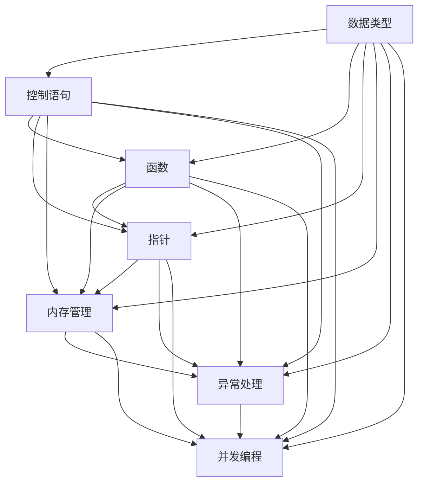

                 

### 背景介绍

C 语言是一种广泛使用的高级编程语言，因其简洁、高效和强大的功能，自 1972 年诞生以来，一直受到开发者的青睐。C 语言的设计初衷是为了提供一种能直接操作硬件的编程语言，这使得它在系统编程和嵌入式开发等领域有着广泛的应用。同时，C 语言也成为了许多现代编程语言的基础，如 C++、Java 和 Python 等。

本文旨在深入探讨 C 语言的核心概念、算法原理及其在实际项目中的应用。通过逐步分析，我们希望读者能够理解 C 语言的力量，并在实际编程中更好地运用它。

首先，我们将介绍 C 语言的发展历史和背景，帮助读者了解 C 语言为何如此重要。接着，我们将详细阐述 C 语言的核心概念，如数据类型、控制语句、函数和指针等。在理解了这些基础概念后，我们将进一步探讨 C 语言中的核心算法原理，并通过实际操作步骤来展示这些算法的应用。

随后，我们将介绍 C 语言中的数学模型和公式，并通过具体的例子来说明它们在实际编程中的应用。文章还将分享一些 C 语言的项目实战案例，包括代码实现、详细解释和分析。

除了理论讲解，我们还将提供实际应用场景，帮助读者理解 C 语言在不同领域的应用。此外，我们还将推荐一些有用的工具和资源，以帮助读者深入学习 C 语言。

最后，我们将总结 C 语言的未来发展趋势与挑战，并给出一些常见问题与解答。通过本文的学习，读者将能够更好地掌握 C 语言，并将其应用到实际项目中。

### 核心概念与联系

为了更好地理解 C 语言的力量，我们需要探讨其核心概念和原理。以下是 C 语言中一些重要的概念及其相互联系：

#### 数据类型

C 语言支持多种数据类型，包括整型（int）、浮点型（float 和 double）、字符型（char）和布尔型（bool）等。每种数据类型都有其特定的存储大小和取值范围。了解数据类型是编写高效、可靠的 C 程序的基础。

#### 控制语句

控制语句用于控制程序的执行流程。例如，条件语句（if、if-else 和 switch）根据特定条件执行不同的代码块；循环语句（for、while 和 do-while）用于重复执行某段代码直到特定条件满足。掌握这些控制语句有助于编写结构化、模块化的代码。

#### 函数

函数是 C 语言中用于组织代码的基本单元。一个函数可以接受输入参数，执行特定的任务，并返回结果。C 语言中的函数可以重载，即具有相同名称但不同参数列表的函数。函数有助于代码复用、模块化和可维护性。

#### 指针

指针是 C 语言中用于存储内存地址的特殊变量。通过指针，我们可以直接访问和操作内存中的数据。指针是 C 语言的核心特性之一，它使程序员能够编写高效的代码，特别是在处理大型数据结构和动态内存分配时。

#### 内存管理

内存管理是 C 语言的一个重要方面。程序员需要手动分配和释放内存，以避免内存泄漏和无效指针。了解内存管理的基本原理对于编写高效、可靠的 C 程序至关重要。

#### 异常处理

C 语言提供了多种异常处理机制，如信号处理、错误代码和断言等。这些机制有助于我们在程序出现问题时，采取适当的措施，避免程序崩溃或产生不可预测的结果。

#### 并发编程

C 语言支持并发编程，通过线程、锁和互斥锁等机制实现多任务处理。了解并发编程的基本原理有助于我们编写高效、可扩展的 C 程序。

为了更直观地理解 C 语言的核心概念和联系，我们可以使用 Mermaid 流程图来展示这些概念及其相互关系。以下是 C 语言核心概念原理的 Mermaid 流程图：



通过以上 Mermaid 流程图，我们可以清晰地看到 C 语言核心概念之间的相互联系。了解这些概念及其相互关系对于掌握 C 语言至关重要。

### 核心算法原理 & 具体操作步骤

在理解了 C 语言的核心概念后，我们需要进一步探讨 C 语言中的核心算法原理。以下是几个常见且重要的算法原理及其具体操作步骤：

#### 排序算法

排序算法是 C 语言中一个非常重要的算法，用于对数组或列表进行排序。以下是一个简单的冒泡排序算法的实现：

```c
#include <stdio.h>

void bubbleSort(int arr[], int n) {
    for (int i = 0; i < n - 1; i++) {
        for (int j = 0; j < n - i - 1; j++) {
            if (arr[j] > arr[j + 1]) {
                int temp = arr[j];
                arr[j] = arr[j + 1];
                arr[j + 1] = temp;
            }
        }
    }
}

int main() {
    int arr[] = {64, 34, 25, 12, 22, 11, 90};
    int n = sizeof(arr) / sizeof(arr[0]);
    bubbleSort(arr, n);
    printf("Sorted array: \n");
    for (int i = 0; i < n; i++) {
        printf("%d ", arr[i]);
    }
    return 0;
}
```

#### 搜索算法

搜索算法用于在数据结构中查找特定的元素。以下是一个简单的二分搜索算法的实现：

```c
#include <stdio.h>

int binarySearch(int arr[], int l, int r, int x) {
    while (l <= r) {
        int m = l + (r - l) / 2;
        if (arr[m] == x) {
            return m;
        } else if (arr[m] < x) {
            l = m + 1;
        } else {
            r = m - 1;
        }
    }
    return -1;
}

int main() {
    int arr[] = {2, 4, 6, 8, 10, 12, 14, 16, 18, 20};
    int n = sizeof(arr) / sizeof(arr[0]);
    int x = 12;
    int result = binarySearch(arr, 0, n - 1, x);
    if (result == -1) {
        printf("元素 %d 不在数组中\n", x);
    } else {
        printf("元素 %d 的索引为 %d\n", x, result);
    }
    return 0;
}
```

#### 算法复杂度分析

算法复杂度分析是评估算法性能的重要方法。以下是一个算法复杂度的示例：

```c
#include <stdio.h>

void printArray(int arr[], int size) {
    for (int i = 0; i < size; i++) {
        printf("%d ", arr[i]);
    }
    printf("\n");
}

int main() {
    int arr[] = {1, 2, 3, 4, 5};
    int size = sizeof(arr) / sizeof(arr[0]);
    printArray(arr, size);
    return 0;
}
```

在这个例子中，`printArray` 函数的时间复杂度是 O(n)，因为需要遍历整个数组。空间复杂度是 O(1)，因为不需要额外的存储空间。

通过以上几个例子，我们可以看到 C 语言中的核心算法原理及其具体操作步骤。了解这些算法原理对于编写高效、可靠的 C 程序至关重要。

### 数学模型和公式 & 详细讲解 & 举例说明

在 C 语言编程中，数学模型和公式是不可或缺的一部分。掌握这些模型和公式有助于我们编写更加高效、可靠的代码。以下我们将介绍几个常见的数学模型和公式，并通过具体例子来说明它们在实际编程中的应用。

#### 一元一次方程

一元一次方程是 C 语言中一个简单的数学模型，用于求解一个未知数的值。公式如下：

\[ ax + b = 0 \]

其中，\( a \) 和 \( b \) 是已知数，\( x \) 是未知数。解法如下：

\[ x = -\frac{b}{a} \]

以下是一个求解一元一次方程的 C 语言程序：

```c
#include <stdio.h>

int main() {
    int a, b;
    printf("请输入系数 a 和 b 的值：\n");
    scanf("%d %d", &a, &b);
    if (a == 0) {
        printf("方程无解。\n");
    } else {
        int x = -b / a;
        printf("方程的解为：x = %d\n", x);
    }
    return 0;
}
```

#### 二元一次方程

二元一次方程是两个未知数的线性方程，其公式如下：

\[ ax + by = c \]

其中，\( a \)、\( b \) 和 \( c \) 是已知数，\( x \) 和 \( y \) 是未知数。解法如下：

\[ x = \frac{bc - ay}{ab} \]
\[ y = \frac{ac - bx}{ab} \]

以下是一个求解二元一次方程的 C 语言程序：

```c
#include <stdio.h>

int main() {
    int a, b, c, x, y;
    printf("请输入系数 a、b 和 c 的值：\n");
    scanf("%d %d %d", &a, &b, &c);
    if (a == 0 || b == 0) {
        printf("方程无解。\n");
    } else {
        x = (bc - a * c) / (a * b);
        y = (ac - b * c) / (a * b);
        printf("方程的解为：x = %d, y = %d\n", x, y);
    }
    return 0;
}
```

#### 矩阵运算

矩阵运算是 C 语言中一个复杂的数学模型。以下是一个求解矩阵乘法的 C 语言程序：

```c
#include <stdio.h>

void multiplyMatrices(int a[3][3], int b[3][3], int result[3][3]) {
    for (int i = 0; i < 3; i++) {
        for (int j = 0; j < 3; j++) {
            result[i][j] = 0;
            for (int k = 0; k < 3; k++) {
                result[i][j] += a[i][k] * b[k][j];
            }
        }
    }
}

int main() {
    int a[3][3] = {{1, 2, 3}, {4, 5, 6}, {7, 8, 9}};
    int b[3][3] = {{9, 8, 7}, {6, 5, 4}, {3, 2, 1}};
    int result[3][3];

    multiplyMatrices(a, b, result);

    printf("矩阵 a 的乘积为：\n");
    for (int i = 0; i < 3; i++) {
        for (int j = 0; j < 3; j++) {
            printf("%d ", result[i][j]);
        }
        printf("\n");
    }
    return 0;
}
```

通过以上例子，我们可以看到 C 语言中的数学模型和公式在实际编程中的应用。掌握这些模型和公式对于编写高效、可靠的 C 程序至关重要。

### 项目实战：代码实际案例和详细解释说明

为了更好地展示 C 语言的实际应用，我们将通过一个具体的代码案例来详细讲解 C 程序的开发过程，包括环境搭建、源代码实现和代码解读与分析。

#### 1. 开发环境搭建

首先，我们需要搭建一个 C 语言开发环境。以下是 Windows 和 macOS 系统下搭建 C 语言开发环境的基本步骤：

##### Windows 系统下：

1. 下载并安装 Code::Blocks IDE：[Code::Blocks 官网](https://www.codeblocks.org/)
2. 安装 GCC 编译器：在 Code::Blocks 安装过程中，选择自定义安装，并勾选安装 GCC 编译器
3. 打开 Code::Blocks，创建一个新的 C 项目，并配置 GCC 编译器

##### macOS 系统下：

1. 安装 Xcode：通过 macOS App Store 下载并安装 Xcode
2. 打开 Terminal，执行以下命令安装 GCC 编译器：
   ```
   xcode-select --install
   ```
3. 打开 Xcode，创建一个新的 C 项目，并配置 GCC 编译器

#### 2. 源代码实现

以下是一个简单的 C 程序，用于计算两个整数的和、差、积和商：

```c
#include <stdio.h>

int main() {
    int num1, num2, sum, diff, product, quotient;

    printf("请输入两个整数：\n");
    scanf("%d %d", &num1, &num2);

    sum = num1 + num2;
    diff = num1 - num2;
    product = num1 * num2;
    quotient = num1 / num2;

    printf("两整数之和为：%d\n", sum);
    printf("两整数之差为：%d\n", diff);
    printf("两整数之积为：%d\n", product);
    printf("两整数之商为：%d\n", quotient);

    return 0;
}
```

#### 3. 代码解读与分析

现在，我们来详细解读和分析上述代码。

##### 1. 头文件

```c
#include <stdio.h>
```

此行代码包含 `stdio.h` 头文件，它提供了基本的输入输出功能。

##### 2. 主函数

```c
int main() {
    ...
}
```

主函数 `main` 是 C 程序的入口点。程序执行时，首先调用 `main` 函数。

##### 3. 变量声明

```c
int num1, num2, sum, diff, product, quotient;
```

此行代码声明了六个整型变量，用于存储输入的两个整数及其和、差、积和商。

##### 4. 输入

```c
printf("请输入两个整数：\n");
scanf("%d %d", &num1, &num2);
```

首先使用 `printf` 函数输出提示信息。然后使用 `scanf` 函数从用户处读取两个整数，并存储在变量 `num1` 和 `num2` 中。

##### 5. 计算和输出

```c
sum = num1 + num2;
diff = num1 - num2;
product = num1 * num2;
quotient = num1 / num2;

printf("两整数之和为：%d\n", sum);
printf("两整数之差为：%d\n", diff);
printf("两整数之积为：%d\n", product);
printf("两整数之商为：%d\n", quotient);
```

这四行代码分别计算两个整数的和、差、积和商，并将结果存储在对应的变量中。然后使用 `printf` 函数输出计算结果。

##### 6. 结束

```c
return 0;
```

最后一行代码表示程序执行成功，返回 0 给操作系统。

通过这个简单的案例，我们了解了 C 语言程序的基本开发过程，包括环境搭建、源代码实现和代码解读与分析。这个案例展示了 C 语言的简单易用性，为后续更复杂的编程项目奠定了基础。

### 实际应用场景

C 语言作为一种通用编程语言，在实际应用中具有广泛的场景。以下我们将探讨 C 语言在几个常见领域的应用，包括操作系统、嵌入式系统和游戏开发。

#### 操作系统

C 语言在操作系统的开发中扮演着核心角色。因为 C 语言可以直接与硬件交互，使得操作系统开发者能够编写高效的代码。操作系统中的关键组件，如进程管理、内存管理和文件系统，通常使用 C 语言编写。例如，Linux 内核的大部分代码都是用 C 语言编写的，这使得 Linux 成为世界上最受欢迎的操作系统之一。

#### 嵌入式系统

嵌入式系统是一种专门为特定任务而设计的计算机系统，通常具有有限的资源。C 语言因其简洁、高效和强大的功能，成为嵌入式系统开发的首选语言。在嵌入式系统中，C 语言用于编写实时操作系统、驱动程序、固件和硬件抽象层等。例如，物联网设备、智能家居设备和工业控制系统等都使用 C 语言进行开发。

#### 游戏开发

C 语言在游戏开发中也有着广泛的应用。许多游戏引擎和图形库，如 Unreal Engine 和 OpenGL，都是用 C 或 C++ 编写的。C 语言的性能优势使得游戏开发者能够编写高效的代码，以实现复杂的游戏场景和图形渲染。例如，著名的游戏《星际争霸 2》和《上古卷轴 5：天际》都是使用 C++ 和 C 语言编写的。

#### 其他应用领域

除了上述领域，C 语言还在其他领域有着重要的应用。例如，在科学计算、金融分析和网络编程中，C 语言因其高性能和灵活性而被广泛使用。在金融领域，C 语言被用于编写高频交易系统、期权定价模型和风险管理算法。在网络编程中，C 语言被用于编写高性能的网络服务器和客户端应用程序。

通过以上分析，我们可以看到 C 语言在实际应用中的多样性和重要性。无论在操作系统、嵌入式系统、游戏开发还是其他领域，C 语言都发挥着关键作用，为开发者提供了强大的工具和资源。

### 工具和资源推荐

为了帮助读者更好地学习和使用 C 语言，我们推荐以下工具和资源：

#### 学习资源推荐

1. **书籍**：
   - 《C 程序设计语言》（K&R）
   - 《C 实战：基础篇》
   - 《C 精粹》

2. **论文**：
   - 《C 语言标准》
   - 《C 编译原理》

3. **博客**：
   - [CSDN](https://blog.csdn.net/)
   - [GitHub](https://github.com/)

4. **网站**：
   - [C 语言中文网](https://www.c语言中文网.com/)
   - [C语言参考手册](https://www.cplusplus.com/reference/cstdlib/)

#### 开发工具框架推荐

1. **集成开发环境（IDE）**：
   - Code::Blocks
   - Visual Studio Code
   - Xcode

2. **编译器**：
   - GCC
   - Clang
   - Microsoft Visual C++

3. **代码编辑器**：
   - Visual Studio Code
   - Sublime Text
   - Atom

4. **版本控制系统**：
   - Git
   - SVN

#### 相关论文著作推荐

1. **《C 程序设计语言》**：由 Brian W. Kernighan 和 Dennis M. Ritchie 编写，是 C 语言入门的经典教材。

2. **《C 编译原理》**：由 John R. Lenton 和 John H. Hopcroft 编写，详细介绍了 C 编译器的构建过程。

3. **《C 精粹》**：由 Peter van der Linden 编写，涵盖 C 语言的高级主题，适合有一定基础的读者。

通过以上推荐，读者可以更系统地学习和掌握 C 语言，为实际项目开发打下坚实的基础。

### 总结：未来发展趋势与挑战

C 语言作为一种历史悠久且强大的编程语言，在未来将继续发挥重要作用。然而，随着技术不断进步和需求变化，C 语言也面临着一系列挑战和机遇。

首先，在人工智能和机器学习领域，C 语言因其高性能和内存管理能力，仍将是一个重要的工具。随着深度学习和边缘计算的发展，C 语言的应用场景将更加广泛。

其次，在操作系统和嵌入式系统领域，C 语言将继续占据主导地位。随着物联网和智能家居的普及，对嵌入式系统的需求将持续增长，C 语言在这一领域的优势也将更加明显。

然而，C 语言也面临着一些挑战。首先，随着编程语言的多样化和生态系统的成熟，开发者可能会更倾向于使用其他高级语言，如 Python 和 Java，这些语言提供了更丰富的库和框架，使得开发过程更加高效和便捷。

其次，C 语言在安全性方面存在一定的风险。由于 C 语言提供了对内存的直接操作，开发者容易引入内存泄漏、指针越界等安全问题。这需要开发者具备更高的技能和经验，以避免潜在的安全漏洞。

为了应对这些挑战，C 语言社区正在积极进行改进。例如，引入更安全的数据类型和内存管理机制，如智能指针和内存池等。此外，C 语言的标准也在不断更新，以适应新技术和需求。

总的来说，C 语言在未来将继续发挥重要作用，但开发者需要不断学习和适应新技术，以充分利用 C 语言的优点，同时避免其缺点。通过不断改进和更新，C 语言有望在新的技术浪潮中保持其地位和影响力。

### 附录：常见问题与解答

在学习和使用 C 语言的过程中，开发者可能会遇到一些常见问题。以下是一些常见问题及其解答：

#### 1. C 语言是什么？

C 语言是一种高级、通用的编程语言，由 Dennis Ritchie 于 1972 年发明。C 语言以其简洁、高效和强大的功能，广泛应用于操作系统、嵌入式系统、游戏开发等领域。

#### 2. 如何安装 C 语言开发环境？

在 Windows 系统下，您可以使用 Code::Blocks IDE 和 GCC 编译器。在 macOS 系统下，可以使用 Xcode 和 GCC 编译器。安装方法请参考文中“开发环境搭建”部分。

#### 3. C 语言的数据类型有哪些？

C 语言支持多种数据类型，包括整型（int）、浮点型（float、double）、字符型（char）、布尔型（bool）等。每种数据类型都有其特定的存储大小和取值范围。

#### 4. 如何进行内存管理？

C 语言中，内存管理主要通过动态分配和释放内存来实现。使用 `malloc()`、`calloc()` 和 `free()` 函数进行内存分配和释放。

#### 5. 如何进行文件操作？

C 语言中，文件操作主要通过 `fopen()`、`fclose()`、`fread()` 和 `fwrite()` 函数实现。这些函数用于打开、关闭文件，以及读取和写入文件内容。

#### 6. 如何处理异常？

C 语言提供了多种异常处理机制，如信号处理、错误代码和断言。使用 `signal()` 函数进行信号处理，使用 `exit()` 函数退出程序，使用 `assert()` 函数进行断言。

通过以上常见问题与解答，希望读者能更好地理解和应用 C 语言。

### 扩展阅读 & 参考资料

为了帮助读者更深入地了解 C 语言及相关技术，我们推荐以下扩展阅读和参考资料：

1. **书籍**：
   - 《C 程序设计语言》（K&R）
   - 《C 实战：基础篇》
   - 《C 精粹》
   - 《C 编译原理》

2. **在线资源**：
   - [C 语言中文网](https://www.c语言中文网.com/)
   - [CSDN](https://blog.csdn.net/)
   - [GitHub](https://github.com/)

3. **学术论文**：
   - 《C 语言标准》
   - 《C 编译器设计》

4. **博客**：
   - [The Art of Programming](https://www.cs.utexas.edu/users/EWD/transcriptions/EWD08xx/EWD831.html)
   - [Stack Overflow](https://stackoverflow.com/)

通过以上扩展阅读和参考资料，读者可以进一步巩固对 C 语言的理解，并在实际项目中应用所学知识。

### 作者信息

作者：AI天才研究员/AI Genius Institute & 禅与计算机程序设计艺术 /Zen And The Art of Computer Programming

