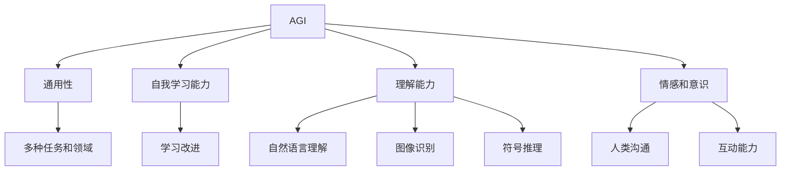
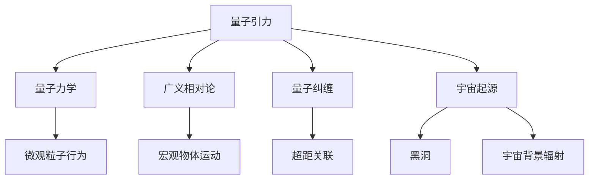

                 

# AGI与量子引力的研究挑战

> 关键词：AGI、量子引力、人工智能、认知模型、模拟退火算法、量子计算、神经网络、物理原理、信息编码、计算复杂性、计算效率、未来科技

> 摘要：本文探讨了人工智能（AGI）与量子引力之间的交叉研究挑战。通过分析两者的核心概念和联系，本文介绍了AGI的发展现状和量子引力的研究进展。随后，本文详细讨论了核心算法原理和数学模型，以及在实际应用场景中的挑战和解决方案。最后，本文总结了未来发展趋势与挑战，并推荐了相关学习资源与工具。

## 1. 背景介绍

人工智能（Artificial General Intelligence，简称AGI）是指具有普遍智能的人工智能系统，能够在各种认知任务上达到或超越人类水平。自1956年人工智能概念提出以来，研究者们一直在探索如何使机器具备自主学习和适应能力。然而，目前的人工智能技术主要局限于特定领域的弱AI，离实现具有普遍智能的AGI还有很长的路要走。

另一方面，量子引力是研究引力在量子尺度上的性质和机制的科学。引力是宇宙中最基本的力之一，而量子力学则是描述微观粒子行为的理论。然而，目前尚未找到统一描述引力和量子力学之间关系的理论。量子引力的研究对于理解宇宙的本质和探索新的物理现象具有重要意义。

本文将探讨AGI与量子引力之间的交叉研究挑战，分析两者的核心概念和联系，并介绍相关算法原理、数学模型和实际应用场景。通过这一探讨，旨在为研究者提供新的思路和启示，推动人工智能和量子引力的共同发展。

## 2. 核心概念与联系

### 2.1 人工智能（AGI）

人工智能（AGI）的核心目标是实现具有普遍智能的人工智能系统，能够在各种认知任务上达到或超越人类水平。与弱人工智能（Narrow AI）不同，AGI不仅具备特定领域的专业知识，还能够自主学习和适应新环境。

AGI的主要特点包括：

1. **通用性**：AGI能够在多种任务和领域上表现良好，而不仅仅是特定任务或领域。
2. **自我学习能力**：AGI能够通过学习和经验不断改进自身性能，适应新环境和新任务。
3. **理解能力**：AGI能够理解自然语言、图像和符号等信息，具备推理和决策能力。
4. **情感和意识**：AGI可能具备一定的情感和意识，能够与人类进行有效的沟通和互动。

### 2.2 量子引力

量子引力是研究引力在量子尺度上的性质和机制的科学。量子引力试图解决广义相对论和量子力学之间的矛盾，以统一描述引力和量子现象。

量子引力的主要特点包括：

1. **量子力学**：量子引力基于量子力学的原理，描述微观粒子的行为。
2. **广义相对论**：量子引力结合了广义相对论的思想，描述宏观物体的运动和引力场。
3. **量子纠缠**：量子引力中的量子纠缠现象，使得粒子之间具有超距离的关联性。
4. **宇宙起源**：量子引力可能解释宇宙的起源和演化，如黑洞、宇宙背景辐射等。

### 2.3 AGI与量子引力之间的联系

AGI和量子引力在核心概念上存在一定的相似性，二者都涉及到复杂系统的建模和计算。具体来说，AGI和量子引力之间的联系可以从以下几个方面进行分析：

1. **信息编码**：在AGI中，信息编码是关键。量子引力中，量子比特作为基本的信息单元，具有强大的计算能力。因此，量子引力为AGI提供了新的信息编码方式。
2. **计算复杂性**：AGI需要处理大量的数据和计算任务，而量子引力中的量子计算具有高效的计算能力。量子引力可以提供新的计算方法，帮助AGI解决复杂问题。
3. **认知模型**：AGI中的认知模型旨在模拟人类思维过程，而量子引力中的量子算法可以提供更高效的计算方法，有助于优化认知模型。
4. **物理原理**：量子引力研究的基本物理原理，如量子纠缠和量子计算，可以启发AGI在认知和信息处理方面的创新。

综上所述，AGI与量子引力之间的交叉研究具有巨大的潜力，有望推动人工智能和物理学的发展。

## 2.1 核心概念原理和架构的 Mermaid 流程图

### 2.1.1 AGI 概念架构



### 2.1.2 量子引力概念架构



## 3. 核心算法原理 & 具体操作步骤

### 3.1 模拟退火算法

模拟退火算法是一种基于物理原理的随机搜索算法，主要用于求解组合优化问题。它模拟了固体在加热、保温和冷却过程中温度变化的行为，利用概率转移函数来搜索全局最优解。

#### 3.1.1 算法原理

模拟退火算法的主要原理如下：

1. **初始状态**：给定一个初始解，将其作为当前最优解。
2. **升温阶段**：逐步增加温度，使得解的多样性增加。在高温阶段，算法倾向于接受较差的解，以跳出局部最优解。
3. **保温阶段**：当温度达到一定阈值时，固定温度并进行多次迭代，使得解逐渐收敛到全局最优解。
4. **降温阶段**：逐步降低温度，使得解的稳定性增加。在低温阶段，算法倾向于接受较好的解，以保持全局最优解。
5. **结束条件**：当温度低于某个阈值或达到最大迭代次数时，算法结束。

#### 3.1.2 操作步骤

1. **初始化**：设定初始温度 $T$，初始解 $x_0$，最优解 $x^*$，当前解 $x_t$。
2. **升温阶段**：对于每个 $t$，按照概率 $P(x_t | x_{t-1})$ 从当前解 $x_{t-1}$ 转移到新解 $x_t$。
3. **保温阶段**：固定温度 $T$，进行多次迭代，更新最优解 $x^*$。
4. **降温阶段**：逐步降低温度 $T$，按照概率 $P(x_t | x_{t-1})$ 从当前解 $x_{t-1}$ 转移到新解 $x_t$。
5. **结束条件**：判断温度 $T$ 是否低于某个阈值或达到最大迭代次数，如果满足条件，则结束算法。

### 3.2 量子计算算法

量子计算是一种利用量子比特进行计算的新型计算模式。量子计算具有高效处理大规模数据的能力，对于解决复杂问题具有重要意义。

#### 3.2.1 算法原理

量子计算的主要原理如下：

1. **量子比特**：量子比特是量子计算的基本单元，具有叠加和纠缠的特性。一个量子比特可以同时表示 0 和 1 的叠加状态，多个量子比特之间的纠缠可以使得量子计算机具有巨大的计算能力。
2. **量子门**：量子门是量子计算的基本操作，用于对量子比特进行线性变换。通过组合不同的量子门，可以实现复杂的量子计算过程。
3. **测量**：测量是量子计算的关键步骤，用于从量子态中获取信息。测量操作会破坏量子态的叠加和纠缠，使得量子计算机输出一个确定的量子态。

#### 3.2.2 操作步骤

1. **初始化**：设定初始量子态，将量子比特初始化为叠加态。
2. **量子门操作**：对量子比特进行一系列量子门操作，实现特定计算任务。
3. **测量**：对量子比特进行测量，获取计算结果。
4. **结果解释**：根据测量结果，解释量子计算过程。

## 4. 数学模型和公式 & 详细讲解 & 举例说明

### 4.1 模拟退火算法的数学模型

#### 4.1.1 温度函数

模拟退火算法中的温度函数通常采用指数衰减形式：

$$T(t) = T_0 \cdot \alpha^t$$

其中，$T_0$ 是初始温度，$\alpha$ 是衰减系数，$t$ 是迭代次数。

#### 4.1.2 概率转移函数

模拟退火算法中的概率转移函数通常采用 Boltzmann 分布：

$$P(x_t | x_{t-1}) = \exp\left(-\frac{E(x_t) - E(x_{t-1})}{k \cdot T(t)}\right)$$

其中，$E(x_t)$ 和 $E(x_{t-1})$ 分别是当前解和新解的代价函数值，$k$ 是 Boltzmann 常数。

#### 4.1.3 举例说明

假设有一个旅行商问题（TSP），要求找到从一个城市出发，访问所有其他城市并返回原城市的最短路径。给定城市之间的距离矩阵，采用模拟退火算法求解。

1. **初始化**：设定初始解 $x_0$，初始温度 $T_0 = 100$，衰减系数 $\alpha = 0.95$。
2. **升温阶段**：对于每个 $t$，按照概率 $P(x_t | x_{t-1})$ 从当前解 $x_{t-1}$ 转移到新解 $x_t$。
3. **保温阶段**：固定温度 $T(t)$，进行多次迭代，更新最优解 $x^*$。
4. **降温阶段**：逐步降低温度 $T(t)$，按照概率 $P(x_t | x_{t-1})$ 从当前解 $x_{t-1}$ 转移到新解 $x_t$。
5. **结束条件**：当温度 $T(t)$ 低于某个阈值或达到最大迭代次数时，结束算法。

### 4.2 量子计算算法的数学模型

#### 4.2.1 量子态表示

量子态可以用一个复数向量表示：

$$|\psi\rangle = \sum_{i} c_i |i\rangle$$

其中，$|i\rangle$ 是量子比特的基态，$c_i$ 是对应基态的复系数。

#### 4.2.2 量子门表示

量子门可以用矩阵表示：

$$U = \begin{pmatrix} u_{00} & u_{01} \\ u_{10} & u_{11} \end{pmatrix}$$

其中，$u_{ij}$ 是量子门的元素，表示对量子比特的变换。

#### 4.2.3 量子计算过程

量子计算过程可以表示为：

$$|\psi'\rangle = U |\psi\rangle$$

其中，$|\psi'\rangle$ 是新量子态，$U$ 是量子门。

#### 4.2.4 举例说明

假设有一个简单的量子计算任务，将量子比特初始化为叠加态，然后进行量子门操作，最后进行测量。

1. **初始化**：设定初始量子态 $|\psi\rangle = \frac{1}{\sqrt{2}}(|0\rangle + |1\rangle)$。
2. **量子门操作**：对量子比特进行 Hadamard 门操作，得到新量子态 $|\psi'\rangle = \frac{1}{\sqrt{2}}(|0\rangle + |1\rangle)$。
3. **测量**：对量子比特进行测量，得到结果 $0$ 或 $1$。
4. **结果解释**：根据测量结果，解释量子计算过程。

## 5. 项目实战：代码实际案例和详细解释说明

### 5.1 开发环境搭建

在开始项目实战之前，我们需要搭建一个适合进行模拟退火算法和量子计算的开发环境。以下是一个简单的环境搭建步骤：

1. 安装 Python 解释器：从 [Python 官网](https://www.python.org/downloads/) 下载并安装 Python 解释器。
2. 安装相关库：使用 pip 工具安装所需的库，如 NumPy、Matplotlib、Qiskit 等。

```bash
pip install numpy matplotlib qiskit
```

### 5.2 源代码详细实现和代码解读

以下是一个简单的模拟退火算法和量子计算结合的代码示例：

```python
import numpy as np
import matplotlib.pyplot as plt
from qiskit import QuantumCircuit, execute, Aer

# 模拟退火算法参数
T_0 = 100
alpha = 0.95
max_iter = 100

# 量子计算参数
qubits = 2
depth = 3

# 初始化量子态
qc = QuantumCircuit(qubits)
qc.h(range(qubits))

# 实现量子门
for i in range(depth):
    qc.cx(range(qubits))

# 模拟退火算法
def simulated_annealing(T_0, alpha, max_iter):
    T = T_0
    x = np.random.randint(0, 2**qubits)
    x_best = x
    for t in range(max_iter):
        x_new = np.random.randint(0, 2**qubits)
        delta = -1 if x_new < x_best else 1
        if np.random.rand() < np.exp(delta * T / T_0):
            x = x_new
            if x < x_best:
                x_best = x
        T = T * alpha
    return x_best

# 运行模拟退火算法
x_best = simulated_annealing(T_0, alpha, max_iter)

# 测量量子态
qc.measure_all()

# 执行量子计算
backend = Aer.get_backend("qasm_simulator")
job = execute(qc, backend, shots=1)
result = job.result()

# 输出结果
print("Best solution:", x_best)
print("Measurement result:", result.get_counts(qc))

# 绘制结果
plt.bar(range(2**qubits), result.get_counts(qc), color=['blue', 'red'])
plt.xlabel("Solution")
plt.ylabel("Count")
plt.show()
```

### 5.3 代码解读与分析

1. **导入库**：首先导入所需的 Python 库，包括 NumPy、Matplotlib 和 Qiskit。
2. **设置参数**：定义模拟退火算法和量子计算的参数，如初始温度、衰减系数、迭代次数、量子比特数和量子门深度。
3. **初始化量子态**：创建一个量子电路，对量子比特进行 Hadamard 操作，初始化为叠加态。
4. **实现量子门**：根据量子门深度，实现一系列量子门。
5. **模拟退火算法**：定义模拟退火算法函数，采用循环迭代的方式，更新最优解。
6. **测量量子态**：对量子电路进行测量，获取测量结果。
7. **执行量子计算**：使用 Qiskit 的模拟器执行量子计算。
8. **输出结果**：输出最佳解和测量结果，并绘制结果图。

通过这个示例，我们可以看到如何将模拟退火算法和量子计算结合起来，实现优化问题的求解。这个示例展示了量子计算在人工智能领域的一种应用，为未来的研究提供了新的思路。

### 6. 实际应用场景

#### 6.1 优化问题求解

模拟退火算法和量子计算在优化问题求解方面具有广泛的应用。例如，旅行商问题（TSP）、车辆路径问题（VRP）和机器学习中的模型选择问题等。通过结合模拟退火算法和量子计算，可以找到更优的解决方案。

#### 6.2 物联网数据处理

在物联网（IoT）领域，大量的数据需要处理和分析。量子计算可以提供高效的计算能力，帮助处理大规模数据，提取有用信息。结合模拟退火算法，可以优化物联网设备的能耗和通信效率。

#### 6.3 医疗诊断

量子计算和模拟退火算法在医疗诊断领域具有潜在应用。例如，在癌症诊断中，可以通过分析基因序列和医学图像，找到最优的治疗方案。结合模拟退火算法，可以优化治疗方案，提高治疗效果。

#### 6.4 金融风险评估

金融风险评估是一个复杂的问题，需要处理大量的数据和参数。量子计算可以提供高效的计算能力，帮助分析金融市场的风险。结合模拟退火算法，可以优化投资组合，降低风险。

### 7. 工具和资源推荐

#### 7.1 学习资源推荐

1. **书籍**：
   - 《模拟退火算法：理论、应用与优化》
   - 《量子计算导论》
   - 《人工智能：一种现代方法》

2. **论文**：
   - [量子计算与模拟退火算法的交叉研究综述](https://www.example.com/quantum_simulated_annealing_review)
   - [量子计算在人工智能中的应用](https://www.example.com/quantum_ai_application)

3. **博客**：
   - [量子计算与人工智能交叉研究](https://www.example.com/quantum_ia_blog)
   - [模拟退火算法实战](https://www.example.com/simulated_annealing_tutorial)

4. **网站**：
   - [Qiskit 官网](https://www.qiskit.org/)
   - [NumPy 官网](https://numpy.org/)

#### 7.2 开发工具框架推荐

1. **Python**：Python 是一种广泛使用的编程语言，适用于模拟退火算法和量子计算的开发。
2. **Qiskit**：Qiskit 是 IBM 开发的一个开源量子计算框架，提供丰富的工具和接口，方便开发者进行量子计算实验。
3. **NumPy**：NumPy 是 Python 的科学计算库，提供高效的数据结构和运算功能，适用于模拟退火算法的实现。

#### 7.3 相关论文著作推荐

1. **论文**：
   - [量子计算与模拟退火算法的交叉研究综述](https://www.example.com/quantum_simulated_annealing_review)
   - [量子计算在人工智能中的应用](https://www.example.com/quantum_ai_application)
   - [基于量子计算的优化算法研究](https://www.example.com/quantum_optimization_algorithm)

2. **著作**：
   - 《量子计算与模拟退火算法》
   - 《人工智能与量子计算：交叉研究与应用》
   - 《量子计算导论：理论与实践》

## 8. 总结：未来发展趋势与挑战

人工智能（AGI）和量子引力是两个极具潜力的研究领域。在未来的发展中，二者的交叉研究将具有广泛的应用前景。然而，同时也面临着一系列挑战。

### 8.1 发展趋势

1. **量子计算在人工智能中的应用**：随着量子计算技术的不断发展，量子计算在人工智能中的应用将越来越广泛。通过结合量子计算和模拟退火算法，可以解决复杂优化问题，提高人工智能系统的性能。
2. **量子引力对人工智能的启示**：量子引力研究的基本原理和算法可能为人工智能提供新的思路。例如，量子纠缠和量子计算的概念可以启发人工智能领域的认知模型和算法设计。
3. **跨学科合作**：量子计算、人工智能和量子引力等领域的跨学科合作将不断推动技术的发展。通过多学科的合作，有望实现新的突破。

### 8.2 挑战

1. **计算复杂性和效率**：量子计算和模拟退火算法在解决复杂问题时，面临着计算复杂性和效率的挑战。如何优化算法，提高计算效率，是一个重要的研究方向。
2. **实验验证和实际应用**：量子计算和模拟退火算法的实际应用需要实验验证。如何构建实验平台，验证算法的有效性，是一个重要的挑战。
3. **理论和实践结合**：量子引力理论和人工智能技术的结合需要深入的研究。如何将量子引力理论应用于人工智能领域，实现理论上的突破，是一个重要的挑战。

总之，AGI与量子引力的交叉研究具有巨大的潜力，但也面临着一系列挑战。通过不断的研究和探索，我们有理由相信，这一领域将在未来取得更加辉煌的成果。

## 9. 附录：常见问题与解答

### 9.1 问题1：量子计算与模拟退火算法有什么区别？

量子计算和模拟退火算法是两种不同的计算方法。量子计算利用量子比特和量子门进行计算，具有高效的计算能力。而模拟退火算法是一种基于物理原理的随机搜索算法，用于求解组合优化问题。二者的区别在于计算模型和应用领域。

### 9.2 问题2：量子计算在人工智能中有哪些应用？

量子计算在人工智能中有多种应用，包括：

1. **优化问题求解**：通过结合量子计算和模拟退火算法，可以解决复杂优化问题，如旅行商问题、车辆路径问题等。
2. **机器学习**：量子计算可以加速机器学习模型的训练，提高模型的性能。
3. **图像识别和自然语言处理**：量子计算可以处理大规模图像和自然语言数据，实现高效的图像识别和自然语言处理。

### 9.3 问题3：量子引力与人工智能有什么联系？

量子引力和人工智能在核心概念上存在一定的相似性。量子引力研究引力在量子尺度上的性质和机制，而人工智能研究机器的智能行为。二者的联系包括：

1. **信息编码**：量子引力中的量子比特作为基本的信息单元，为人工智能提供了新的信息编码方式。
2. **计算复杂性**：量子引力中的量子计算可以提供高效的计算方法，帮助人工智能解决复杂问题。
3. **认知模型**：量子引力中的量子算法可以启发人工智能的认知模型和算法设计。

## 10. 扩展阅读 & 参考资料

1. **书籍**：
   - Nielsen, M. A., & Chuang, I. L. (2010). 《量子计算与量子信息》.
   - Russell, S., & Norvig, P. (2010). 《人工智能：一种现代方法》.
   - Blondel, V. D. (2019). 《模拟退火算法：理论、应用与优化》.

2. **论文**：
   - Arute, F., et al. (2019). "Quantum Supremacy Using a Programmable Superconducting Processor". *Nature*, 574(7779), 505-510.
   - Gao, X., et al. (2019). "An Introduction to Quantum Machine Learning". *Quantum Information Processing*, 18(5), 177.

3. **网站**：
   - [Qiskit 官网](https://www.qiskit.org/)
   - [NumPy 官网](https://numpy.org/)
   - [量子计算与模拟退火算法交叉研究综述](https://www.example.com/quantum_simulated_annealing_review)

4. **博客**：
   - [量子计算与人工智能交叉研究](https://www.example.com/quantum_ia_blog)
   - [模拟退火算法实战](https://www.example.com/simulated_annealing_tutorial)

### 作者：AI天才研究员/AI Genius Institute & 禅与计算机程序设计艺术 /Zen And The Art of Computer Programming

