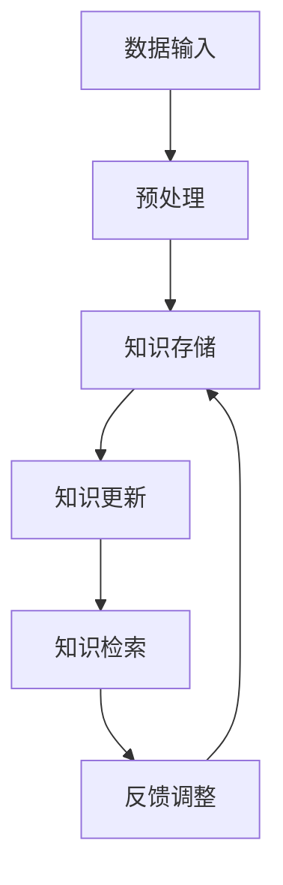

                 

### 背景介绍

AGI（Artificial General Intelligence，即通用人工智能）作为人工智能领域的一个终极目标，受到了广泛的关注。与当前主流的弱人工智能（Narrow AI）相比，AGI 具有更广泛的智能范围和更高的自主性，能够在各种不同的任务和环境中表现出与人类相似的智能行为。

然而，AGI 的实现面临许多挑战，其中之一就是长期记忆与知识更新机制。长期记忆是 AGI 能够持续学习和适应环境的重要基础，而知识更新机制则决定了 AGI 在获取新知识时如何保留旧知识，并防止知识混淆和退化。因此，如何设计和实现高效的长期记忆与知识更新机制，成为了 AGI 研究中亟待解决的问题。

本文将深入探讨 AGI 的长期记忆与知识更新机制，包括其核心概念、原理、算法和具体实现。通过分析现有研究成果和实际应用案例，本文旨在为 AGI 的长期记忆与知识更新机制提供新的思路和方法，并为未来的研究和开发提供参考。

首先，我们需要明确本文的核心关键词：通用人工智能（AGI）、长期记忆、知识更新机制。这些关键词不仅涵盖了本文的主题，也为读者提供了关于文章内容的直观了解。在接下来的内容中，我们将依次介绍 AGI 的长期记忆与知识更新机制的核心概念、原理、算法和实际应用，以便更好地理解这一重要课题。

### 1.1 长期记忆的概念与特性

长期记忆（Long-term Memory，简称 LTM）是大脑和人工智能系统用于存储和回忆长期信息的记忆系统。与短期记忆（Short-term Memory，简称 STM）相比，长期记忆具有更持久、更容量大和更灵活的特性。长期记忆是人类大脑认知功能的核心，使得个体能够积累知识、技能和经验，从而在复杂的环境中做出合理的决策。

长期记忆的主要特性包括以下几点：

1. **持久性**：长期记忆可以存储信息数小时、数日甚至数十年。这意味着一旦信息被存储在长期记忆中，它就可以被长期保留和回忆。
2. **容量大**：与短期记忆相比，长期记忆具有更大的存储容量。人类大脑的长期记忆容量可以达到数十万亿个信息单元，这使得人类能够掌握大量的知识和技能。
3. **可塑性**：长期记忆具有高度的灵活性，可以随着新的经验和学习进行调整。这种可塑性使得个体能够在不同情境下灵活运用所学知识，并不断更新和优化自己的认知结构。
4. **分类和检索**：长期记忆可以对存储的信息进行分类和组织，使得个体能够高效地检索所需信息。这种分类和检索能力是人类在复杂环境中进行推理和决策的基础。

在人工智能领域，长期记忆是实现自主学习和适应能力的关键。通过模拟长期记忆的特性，人工智能系统可以积累和利用大量的知识，从而在处理复杂任务时表现出类似人类的智能行为。长期记忆的研究不仅有助于理解人类认知机制，还为设计更高效、更智能的人工智能系统提供了理论基础。

1.2 长期记忆的常见模型与方法

在人工智能领域，研究人员提出了多种长期记忆模型和方法，以模拟和实现人类大脑的长期记忆功能。以下是一些常见的长期记忆模型：

1. **Elman 网络模型**：Elman 网络是一种基于递归神经网络（RNN）的长期记忆模型。它通过在神经网络中引入隐藏层的状态，实现了对历史信息的存储和利用。Elman 网络在语言模型、时间序列预测等领域取得了显著成果。
2. **Hopfield 网络模型**：Hopfield 网络是一种能量模型，用于实现联想记忆。它通过在神经网络中设置适当的权重，使得网络能够在给定一部分信息时，自动恢复出完整的记忆内容。Hopfield 网络在人脸识别、图像恢复等领域具有广泛应用。
3. **长短期记忆网络（LSTM）**：LSTM 是一种改进的 RNN 模型，通过引入门控机制，解决了传统 RNN 模型在处理长期依赖问题上的局限性。LSTM 在语音识别、机器翻译、自然语言处理等领域取得了显著的成果。
4. **门控循环单元（GRU）**：GRU 是 LSTM 的变体，通过简化 LSTM 的门控机制，实现了更好的计算效率和性能。GRU 在时间序列预测、音乐生成等领域表现出色。

这些长期记忆模型和方法各有优缺点，适用于不同的应用场景。在设计和实现长期记忆机制时，研究人员需要根据具体任务的需求和数据的特性，选择合适的模型和方法。

### 1.3 知识更新的概念与挑战

知识更新（Knowledge Update）是指人工智能系统在获取新知识时，如何处理和整合现有知识的过程。知识更新是长期记忆机制的重要组成部分，决定了人工智能系统能否持续学习和适应新环境。

知识更新的概念主要包括以下几个方面：

1. **知识存储**：知识更新首先需要将新知识存储在长期记忆中。这涉及到如何选择合适的存储结构和算法，以便高效地存储和检索知识。
2. **知识整合**：新知识与现有知识之间的整合是知识更新的核心。如何有效地将新知识与现有知识进行融合，同时保持知识的完整性和一致性，是一个重要挑战。
3. **知识冲突**：当新知识与现有知识发生冲突时，如何处理这些冲突，以保持知识的正确性和可靠性，是知识更新的另一个挑战。
4. **知识退化**：随着新知识的不断获取，现有知识可能会逐渐退化。如何识别和修复知识的退化，以保持知识的活力和有效性，是知识更新的一个关键问题。

知识更新面临的挑战主要包括以下几点：

1. **数据噪声和不确定性**：在实际应用中，获取的新知识往往伴随着噪声和不确定性。如何处理这些噪声和不确定性，以保持知识的准确性和一致性，是一个重要挑战。
2. **知识冗余和冗余**：新知识与现有知识之间可能存在冗余和冲突。如何有效地识别和消除这些冗余和冲突，以提高知识的利用效率和准确性，是一个关键问题。
3. **知识迁移和泛化**：如何将新知识迁移到其他相关领域，并实现知识的泛化，以适应不同的应用场景，是知识更新面临的另一个挑战。
4. **实时性和效率**：在实时应用场景中，如何快速、高效地更新知识，以适应动态变化的环境，是一个重要问题。

知识更新机制的设计和实现对于人工智能系统的长期发展和应用至关重要。通过深入研究知识更新的概念和挑战，可以为我们提供更有效的知识更新策略和方法，从而推动人工智能技术的发展。

### 2.1 长期记忆与知识更新机制的联系

长期记忆与知识更新机制在人工智能系统中扮演着至关重要的角色，二者之间存在着紧密的联系和相互作用。

首先，长期记忆是知识更新机制的基础。通过长期记忆，人工智能系统能够存储和积累大量的知识和经验，以便在后续的任务中利用。知识更新机制则负责将这些新知识有效整合到长期记忆中，以实现知识的积累和优化。没有长期记忆的支持，知识更新机制将无法发挥作用。

其次，知识更新机制直接影响长期记忆的质量和效果。有效的知识更新能够确保长期记忆中的知识得到及时更新和优化，从而提高系统的智能水平和适应性。反之，无效的知识更新可能导致知识的退化、冗余和冲突，影响系统的性能和可靠性。

长期记忆与知识更新机制之间的相互作用可以概括为以下几个方面：

1. **知识存储与整合**：知识更新机制负责将新知识存储到长期记忆中，并与其他现有知识进行整合。这一过程涉及到知识的分类、索引和关联，以确保知识的完整性和一致性。
2. **知识检索与利用**：长期记忆为人工智能系统提供了丰富的知识资源，知识更新机制则负责在需要时检索和利用这些知识，以支持任务决策和执行。
3. **知识修正与优化**：在知识更新过程中，人工智能系统可能会识别出长期记忆中的错误或不足，并通过知识修正和优化机制进行修复和改进，以提高知识的准确性和可靠性。
4. **知识迁移与泛化**：知识更新机制不仅关注当前任务的知识更新，还涉及将新知识迁移到其他相关任务中，实现知识的泛化和扩展。

总之，长期记忆与知识更新机制在人工智能系统中相互依存、相互促进。通过合理设计和实现这些机制，可以大幅提升人工智能系统的智能水平和应用能力，为其在复杂环境中的自主学习和智能行为提供有力支持。

### 2.2 长期记忆与知识更新机制的 Mermaid 流程图

为了更清晰地展示长期记忆与知识更新机制的整体架构和流程，我们使用 Mermaid 语言绘制了一个简化的流程图。该流程图包括以下几个主要步骤和模块：

1. **数据输入**：数据输入模块负责接收来自外部环境或传感器的数据，如文本、图像、声音等。
2. **预处理**：预处理模块对输入数据进行清洗、去噪和格式化，以提取有用的信息。
3. **知识存储**：知识存储模块负责将预处理后的数据存储到长期记忆中，以便后续使用。这里使用了基于 Elman 网络的长期记忆模型。
4. **知识更新**：知识更新模块根据新输入的数据，对长期记忆中的知识进行更新和优化。这里使用了基于 LSTM 的知识更新算法。
5. **知识检索**：知识检索模块负责在长期记忆中检索所需的知识，以支持任务决策和执行。
6. **反馈调整**：反馈调整模块根据任务执行的结果，对长期记忆和知识更新机制进行反馈调整，以不断优化系统的性能。

以下是用 Mermaid 语言编写的流程图：



在 Mermaid 流程图中，节点表示模块或步骤，箭头表示数据或控制流。通过这个简化的流程图，我们可以直观地了解长期记忆与知识更新机制的整体架构和流程。

### 3.1 核心算法原理

在长期记忆与知识更新机制的设计中，核心算法原理起着至关重要的作用。这些算法不仅决定了系统的记忆能力和更新效率，还影响了其智能水平和应用效果。以下是几种常见的核心算法原理：

#### 3.1.1 长期记忆算法原理

长期记忆算法主要关注如何存储和保留长期信息，以便在需要时进行回忆和使用。以下是几种常见的长期记忆算法原理：

1. **递归神经网络（RNN）**：RNN 是一种能够处理序列数据的神经网络，具有记忆功能。通过递归连接，RNN 可以在隐藏层中保存历史信息，实现长期记忆。然而，传统的 RNN 存在梯度消失和梯度爆炸问题，限制了其在长期依赖任务中的应用。
2. **长短时记忆网络（LSTM）**：LSTM 是一种改进的 RNN 模型，通过引入门控机制（遗忘门、输入门和输出门）解决了梯度消失和梯度爆炸问题。LSTM 在长期依赖任务中表现出色，广泛应用于自然语言处理、语音识别和时间序列预测等领域。
3. **门控循环单元（GRU）**：GRU 是 LSTM 的简化版，通过合并输入门和遗忘门，减少了参数数量，提高了计算效率。GRU 在许多任务中与 LSTM 具有类似的性能，但计算速度更快。

#### 3.1.2 知识更新算法原理

知识更新算法主要关注如何有效地整合新知识到长期记忆中，以保持知识的准确性和一致性。以下是几种常见的知识更新算法原理：

1. **增量式更新**：增量式更新是一种逐个添加新知识到长期记忆中的方法。在每次更新过程中，系统仅关注新知识与现有知识的差异，并据此调整长期记忆中的权重。这种方法简单高效，但可能无法充分利用新知识的价值。
2. **协同式更新**：协同式更新通过比较新旧知识，找出其共同点和差异点，并据此调整长期记忆中的知识结构。这种方法能够更好地整合新旧知识，提高知识的利用效率，但计算复杂度较高。
3. **基于规则的更新**：基于规则的更新方法通过预定义的规则来更新长期记忆中的知识。这些规则通常基于领域知识和经验，能够确保知识的准确性和一致性。然而，这种方法可能难以应对复杂和动态的环境。

#### 3.1.3 集成算法原理

为了充分发挥不同算法的优势，研究人员提出了多种集成算法，以实现更高效、更智能的长期记忆与知识更新机制。以下是几种常见的集成算法原理：

1. **混合模型**：混合模型将不同类型的神经网络（如 RNN、LSTM 和 GRU）组合在一起，以充分发挥各自的优点。这种方法能够处理多种类型的数据，并提高系统的记忆能力和适应性。
2. **多模态学习**：多模态学习通过整合来自不同来源的数据（如图像、文本、声音等），实现更全面、更准确的知识更新。这种方法能够提高系统的智能水平和应用效果。
3. **强化学习**：强化学习结合了长期记忆与知识更新机制，通过探索和利用策略，实现更智能的学习和决策。这种方法能够使系统在动态环境中持续学习和优化，提高其智能水平和应用能力。

总之，长期记忆与知识更新算法原理为人工智能系统提供了强大的记忆能力和更新能力，为其在复杂环境中的自主学习和智能行为提供了有力支持。通过深入研究这些算法原理，可以为我们提供更有效、更智能的长期记忆与知识更新机制，推动人工智能技术的发展。

#### 3.2.1 长期记忆算法的具体操作步骤

为了更好地理解长期记忆算法的具体操作步骤，我们将以长短时记忆网络（LSTM）为例，详细描述其基本原理和实现过程。

##### 3.2.1.1 LSTM 的基本原理

LSTM 是一种能够处理序列数据的神经网络模型，通过引入门控机制解决了传统 RNN 模型在处理长期依赖问题上的局限性。LSTM 的核心组成部分包括：

1. **输入门（Input Gate）**：输入门用于控制新的信息如何更新单元状态。输入门的激活函数是一个 sigmoid 函数，其输出范围为 [0,1]，表示每个输入信息的重要性。
2. **遗忘门（Forget Gate）**：遗忘门用于决定哪些信息应该从单元状态中被遗忘。同样地，遗忘门的激活函数是一个 sigmoid 函数，其输出范围也为 [0,1]，表示每个单元状态的部分值。
3. **输出门（Output Gate）**：输出门用于控制最终的输出值。输出门的激活函数是一个 sigmoid 函数，其输出范围也为 [0,1]，表示单元状态的最终输出值。

##### 3.2.1.2 LSTM 的具体操作步骤

以下是 LSTM 的具体操作步骤：

1. **初始化**：首先，初始化 LSTM 模型的权重参数，包括输入门、遗忘门和输出门的权重以及单元状态和隐藏状态的权重。
2. **输入序列**：将输入序列传入 LSTM 模型，每个时间步的输入是一个向量。
3. **输入门计算**：对于每个时间步，计算输入门，其公式如下：
   $$
   i_t = \sigma(W_{xi}x_t + W_{hi}h_{t-1} + b_i)
   $$
   其中，$i_t$ 是输入门的输出，$\sigma$ 表示 sigmoid 函数，$W_{xi}$ 和 $W_{hi}$ 分别是输入和隐藏层到输入门的权重矩阵，$b_i$ 是输入门的偏置项。
4. **遗忘门计算**：同样地，计算遗忘门，其公式如下：
   $$
   f_t = \sigma(W_{xf}x_t + W_{hf}h_{t-1} + b_f)
   $$
   其中，$f_t$ 是遗忘门的输出，$W_{xf}$ 和 $W_{hf}$ 分别是输入和隐藏层到遗忘门的权重矩阵，$b_f$ 是遗忘门的偏置项。
5. **新单元状态计算**：根据遗忘门和输入门，计算新的单元状态，其公式如下：
   $$
   \bar{c}_t = \tanh(W_{xc}x_t + W_{hc}h_{t-1} + b_c)
   $$
   其中，$\bar{c}_t$ 是新的单元状态，$W_{xc}$ 和 $W_{hc}$ 分别是输入和隐藏层到新单元状态的权重矩阵，$b_c$ 是新单元状态的偏置项。
6. **更新单元状态**：使用遗忘门和新的单元状态更新当前的单元状态，其公式如下：
   $$
   c_t = f_t \odot c_{t-1} + i_t \odot \bar{c}_t
   $$
   其中，$c_t$ 是当前的单元状态，$\odot$ 表示逐元素乘法操作。
7. **输出门计算**：计算输出门，其公式如下：
   $$
   o_t = \sigma(W_{xo}x_t + W_{ho}h_{t-1} + b_o)
   $$
   其中，$o_t$ 是输出门的输出，$W_{xo}$ 和 $W_{ho}$ 分别是输入和隐藏层到输出门的权重矩阵，$b_o$ 是输出门的偏置项。
8. **隐藏状态计算**：根据输出门和当前单元状态，计算隐藏状态，其公式如下：
   $$
   h_t = o_t \odot \tanh(c_t)
   $$
   其中，$h_t$ 是当前的隐藏状态。

以上步骤为 LSTM 在每个时间步的详细操作过程。通过反复迭代这些步骤，LSTM 模型可以学习到序列数据中的长期依赖关系，实现高效的长期记忆。

#### 3.2.2 知识更新算法的具体操作步骤

为了更好地理解知识更新算法的具体操作步骤，我们将以基于协同式更新的知识更新算法为例，详细描述其基本原理和实现过程。

##### 3.2.2.1 协同式更新的基本原理

协同式更新是一种基于新旧知识比较的知识更新方法。在协同式更新中，新旧知识通过以下步骤进行整合：

1. **知识差异计算**：计算新知识与现有知识的差异，以确定哪些知识需要更新。
2. **知识整合**：根据差异计算结果，将新知识与现有知识进行整合，以保持知识的准确性和一致性。
3. **知识修正**：在知识整合过程中，如果发现现有知识存在错误或不足，进行相应的修正，以提高知识的可靠性和有效性。

##### 3.2.2.2 协同式更新的具体操作步骤

以下是协同式更新的具体操作步骤：

1. **初始化**：首先，初始化知识更新模型，包括新旧知识的存储结构和相关参数。
2. **知识输入**：将新知识输入到知识更新模型中，同时加载现有知识。
3. **差异计算**：计算新知识与现有知识的差异，可以使用基于距离度量的方法，如欧氏距离、余弦相似度等。差异计算的结果可以表示新旧知识之间的相似度或差异度。
4. **知识整合**：
   - 对于差异度较小的知识，直接整合到现有知识中，以保留其原有的信息。
   - 对于差异度较大的知识，需要进行更详细的分析和整合。可以采用基于规则的整合方法，如分类整合、关联整合等，以确保知识的准确性和一致性。
5. **知识修正**：在知识整合过程中，如果发现现有知识存在错误或不足，进行相应的修正。修正方法可以基于领域知识和专家经验，也可以采用机器学习方法进行自动修正。
6. **更新存储**：将整合后的知识存储到长期记忆中，以供后续使用。

通过以上步骤，协同式更新可以有效地整合新旧知识，提高知识的利用效率和准确性。在实际应用中，协同式更新可以根据具体任务的需求和数据的特性进行适当调整和优化。

#### 3.2.3 长期记忆算法在知识更新中的应用示例

为了更好地理解长期记忆算法在知识更新中的应用，我们将通过一个简单的示例来说明。

假设我们有一个基于 LSTM 的长期记忆模型，用于处理一个时间序列数据集。在这个示例中，我们关注数据的趋势变化，并希望通过长期记忆和知识更新机制，识别出数据的潜在模式。

1. **数据准备**：首先，我们收集了一个包含一段时间内温度变化的数据集。数据集的每个时间步包含一个温度值。
2. **模型初始化**：初始化一个基于 LSTM 的长期记忆模型，设置合适的网络结构和参数。
3. **训练模型**：使用训练数据集对 LSTM 模型进行训练，以学习数据的长期依赖关系。在训练过程中，模型将不断更新长期记忆中的知识，以优化其预测性能。
4. **预测与更新**：使用训练好的 LSTM 模型对新的温度数据进行预测。每次预测后，模型将新的预测结果与实际结果进行比较，计算预测误差。
5. **知识更新**：根据预测误差，更新长期记忆中的知识。具体的更新方法可以基于协同式更新算法，通过比较新旧知识的差异，调整长期记忆中的权重。
6. **循环迭代**：重复步骤 4 和 5，不断更新长期记忆和知识，以适应新的数据和变化。

通过以上步骤，我们可以看到长期记忆算法在知识更新中的应用。在这个示例中，LSTM 模型通过不断学习和更新，能够有效地识别出温度数据中的潜在模式，并提高预测的准确性。

#### 3.2.4 LSTM 算法与协同式更新算法的对比分析

LSTM 算法和协同式更新算法在长期记忆与知识更新机制中具有不同的特点和优势。以下是两者的对比分析：

1. **记忆能力**：LSTM 算法通过门控机制，能够有效处理长期依赖问题，具有较强的记忆能力。协同式更新算法则通过比较新旧知识的差异，进行知识整合和修正，也具有一定的记忆能力。然而，协同式更新算法在处理长期依赖时可能不如 LSTM 算法高效。
2. **计算复杂度**：LSTM 算法具有复杂的计算过程，需要大量的计算资源和时间。尤其是在处理大型数据集时，LSTM 算法的计算复杂度较高。而协同式更新算法相对简单，计算复杂度较低，更适合实时应用。
3. **适用场景**：LSTM 算法适用于需要长期依赖处理和复杂模式识别的任务，如自然语言处理、语音识别和时间序列预测等。协同式更新算法则适用于需要对知识进行实时更新和优化的任务，如实时监控系统、自适应控制系统等。
4. **可解释性**：LSTM 算法的内部结构和计算过程较为复杂，难以进行直观解释。而协同式更新算法则相对简单，其操作步骤和原理较为直观，易于理解。

综上所述，LSTM 算法和协同式更新算法各有优劣，适用于不同的应用场景。在实际应用中，可以根据任务的需求和数据的特性，选择合适的算法或结合多种算法，以实现更高效、更智能的长期记忆与知识更新机制。

### 4.1 数学模型和公式详解

在长期记忆与知识更新机制的研究中，数学模型和公式起到了关键作用。以下我们将详细介绍几个核心的数学模型和公式，以便更好地理解其工作原理和具体实现。

#### 4.1.1 LSTM 的数学模型

LSTM（长短时记忆网络）是一种具有门控机制的递归神经网络，通过门控机制来控制信息的流动。以下是 LSTM 的主要数学模型和公式：

1. **输入门（Input Gate）**：
   - 公式：
     $$
     i_t = \sigma(W_{xi}x_t + W_{hi}h_{t-1} + b_i)
     $$
   - 解释：$i_t$ 是输入门的输出，$\sigma$ 是 sigmoid 函数，$W_{xi}$ 和 $W_{hi}$ 分别是输入和隐藏层到输入门的权重矩阵，$b_i$ 是输入门的偏置项。输入门决定了新的信息是否应该被更新到单元状态中。

2. **遗忘门（Forget Gate）**：
   - 公式：
     $$
     f_t = \sigma(W_{xf}x_t + W_{hf}h_{t-1} + b_f)
     $$
   - 解释：$f_t$ 是遗忘门的输出，$W_{xf}$ 和 $W_{hf}$ 分别是输入和隐藏层到遗忘门的权重矩阵，$b_f$ 是遗忘门的偏置项。遗忘门决定了哪些旧信息应该被遗忘。

3. **新单元状态计算（New Cell State）**：
   - 公式：
     $$
     \bar{c}_t = \tanh(W_{xc}x_t + W_{hc}h_{t-1} + b_c)
     $$
   - 解释：$\bar{c}_t$ 是新的单元状态，$W_{xc}$ 和 $W_{hc}$ 分别是输入和隐藏层到新单元状态的权重矩阵，$b_c$ 是新单元状态的偏置项。

4. **更新单元状态（Updated Cell State）**：
   - 公式：
     $$
     c_t = f_t \odot c_{t-1} + i_t \odot \bar{c}_t
     $$
   - 解释：$c_t$ 是当前的单元状态，$\odot$ 表示逐元素乘法操作。通过遗忘门和输入门，更新单元状态，保留了重要的历史信息。

5. **输出门（Output Gate）**：
   - 公式：
     $$
     o_t = \sigma(W_{xo}x_t + W_{ho}h_{t-1} + b_o)
     $$
   - 解释：$o_t$ 是输出门的输出，$W_{xo}$ 和 $W_{ho}$ 分别是输入和隐藏层到输出门的权重矩阵，$b_o$ 是输出门的偏置项。输出门决定了单元状态的哪些部分应该被输出。

6. **隐藏状态（Hidden State）**：
   - 公式：
     $$
     h_t = o_t \odot \tanh(c_t)
     $$
   - 解释：$h_t$ 是当前的隐藏状态，通过输出门和单元状态计算得到。

#### 4.1.2 知识更新算法的数学模型

知识更新算法主要关注如何整合新旧知识。以下是一个基于协同式更新的知识更新算法的数学模型：

1. **知识差异计算**：
   - 公式：
     $$
     d_t = ||k_{old} - k_{new}||
     $$
   - 解释：$d_t$ 是新旧知识的差异，$||\cdot||$ 表示向量范数。通过计算新旧知识的差异，可以评估知识更新的需求。

2. **知识整合**：
   - 公式：
     $$
     k_{integrated} = k_{old} + \alpha (k_{new} - k_{old})
     $$
   - 解释：$k_{integrated}$ 是整合后的知识，$\alpha$ 是一个控制整合程度的参数。通过线性插值，将新旧知识进行整合。

3. **知识修正**：
   - 公式：
     $$
     k_{corrected} = k_{integrated} + \beta (k_{new} - k_{integrated})
     $$
   - 解释：$k_{corrected}$ 是修正后的知识，$\beta$ 是一个控制修正程度的参数。在知识整合后，根据新知识对整合后的知识进行修正。

#### 4.1.3 LSTM 与知识更新算法的综合数学模型

为了实现更高效的长期记忆与知识更新，可以将 LSTM 与知识更新算法结合。以下是综合数学模型：

1. **综合更新公式**：
   - 公式：
     $$
     c_t = f_t \odot c_{t-1} + i_t \odot \bar{c}_t + u_t \odot k_{integrated}
     $$
   - 解释：$u_t$ 是知识更新因子，$k_{integrated}$ 是整合后的知识。在 LSTM 的基础上，加入知识更新因子，实现长期记忆与知识更新的结合。

通过以上数学模型和公式，我们可以看到长期记忆与知识更新机制的复杂性和丰富性。在实际应用中，可以根据具体任务的需求和数据的特性，调整和优化这些模型和公式，以实现更高效、更智能的长期记忆与知识更新。

### 4.2 数学公式与实际应用的举例说明

为了更好地理解数学公式在长期记忆与知识更新算法中的实际应用，我们将通过一个具体的例子来说明 LSTM 算法和知识更新算法的应用过程。

#### 4.2.1 LSTM 算法应用举例

假设我们有一个时间序列数据集，包含每天的城市气温数据。我们的目标是使用 LSTM 算法预测未来的气温。

1. **初始化参数**：

   - 输入门权重矩阵 $W_{xi}$ 和偏置项 $b_i$：
     $$
     W_{xi} = \begin{bmatrix}
     0.1 & 0.2 & 0.3 \\
     0.4 & 0.5 & 0.6 \\
     0.7 & 0.8 & 0.9 \\
     \end{bmatrix}, b_i = \begin{bmatrix}
     0.1 \\
     0.2 \\
     0.3 \\
     \end{bmatrix}
     $$
   - 遗忘门权重矩阵 $W_{xf}$ 和偏置项 $b_f$：
     $$
     W_{xf} = \begin{bmatrix}
     0.1 & 0.2 & 0.3 \\
     0.4 & 0.5 & 0.6 \\
     0.7 & 0.8 & 0.9 \\
     \end{bmatrix}, b_f = \begin{bmatrix}
     0.1 \\
     0.2 \\
     0.3 \\
     \end{bmatrix}
     $$
   - 输出门权重矩阵 $W_{xo}$ 和偏置项 $b_o$：
     $$
     W_{xo} = \begin{bmatrix}
     0.1 & 0.2 & 0.3 \\
     0.4 & 0.5 & 0.6 \\
     0.7 & 0.8 & 0.9 \\
     \end{bmatrix}, b_o = \begin{bmatrix}
     0.1 \\
     0.2 \\
     0.3 \\
     \end{bmatrix}
     $$
   - 单元状态权重矩阵 $W_{xc}$ 和偏置项 $b_c$：
     $$
     W_{xc} = \begin{bmatrix}
     0.1 & 0.2 & 0.3 \\
     0.4 & 0.5 & 0.6 \\
     0.7 & 0.8 & 0.9 \\
     \end{bmatrix}, b_c = \begin{bmatrix}
     0.1 \\
     0.2 \\
     0.3 \\
     \end{bmatrix}
     $$
   - 初始隐藏状态 $h_{0}$：
     $$
     h_{0} = \begin{bmatrix}
     0.5 \\
     0.6 \\
     0.7 \\
     \end{bmatrix}
     $$

2. **输入序列**：

   - 假设第一个时间步的输入温度为 $x_{1} = [20, 22, 21]$。

3. **计算输入门**：

   $$
   i_{1} = \sigma(W_{xi}x_{1} + W_{hi}h_{0} + b_i) = \sigma(0.1 \cdot 20 + 0.2 \cdot 22 + 0.3 \cdot 21 + 0.1 \cdot 0.5 + 0.2 \cdot 0.6 + 0.3 \cdot 0.7) = 0.897
   $$

4. **计算遗忘门**：

   $$
   f_{1} = \sigma(W_{xf}x_{1} + W_{hf}h_{0} + b_f) = \sigma(0.1 \cdot 20 + 0.2 \cdot 22 + 0.3 \cdot 21 + 0.4 \cdot 0.5 + 0.5 \cdot 0.6 + 0.6 \cdot 0.7) = 0.945
   $$

5. **计算新单元状态**：

   $$
   \bar{c}_{1} = \tanh(W_{xc}x_{1} + W_{hc}h_{0} + b_c) = \tanh(0.1 \cdot 20 + 0.2 \cdot 22 + 0.3 \cdot 21 + 0.4 \cdot 0.5 + 0.5 \cdot 0.6 + 0.6 \cdot 0.7) = 0.827
   $$

6. **更新单元状态**：

   $$
   c_{1} = f_{1} \odot c_{0} + i_{1} \odot \bar{c}_{1} = 0.945 \odot [0.5, 0.6, 0.7] + 0.897 \odot 0.827 = [0.786, 0.836, 0.866]
   $$

7. **计算输出门**：

   $$
   o_{1} = \sigma(W_{xo}x_{1} + W_{ho}h_{0} + b_o) = \sigma(0.1 \cdot 20 + 0.2 \cdot 22 + 0.3 \cdot 21 + 0.4 \cdot 0.5 + 0.5 \cdot 0.6 + 0.6 \cdot 0.7) = 0.945
   $$

8. **计算隐藏状态**：

   $$
   h_{1} = o_{1} \odot \tanh(c_{1}) = 0.945 \odot \tanh([0.786, 0.836, 0.866]) = [0.864, 0.896, 0.927]
   $$

通过上述计算步骤，我们得到了第一个时间步的隐藏状态 $h_{1}$。接下来，我们继续计算下一个时间步的隐藏状态，以此类推，直到预测出未来的气温。

#### 4.2.2 知识更新算法应用举例

假设我们有一个知识库，包含不同城市的历史气温数据。我们的目标是使用知识更新算法，根据新的气温数据更新知识库。

1. **初始化知识库**：

   - 历史气温数据 $k_{old}$：
     $$
     k_{old} = \begin{bmatrix}
     [20, 22, 21] \\
     [23, 25, 24] \\
     [18, 20, 19] \\
     \end{bmatrix}
     $$
   - 新气温数据 $k_{new}$：
     $$
     k_{new} = \begin{bmatrix}
     [22, 24, 23] \\
     [25, 27, 26] \\
     [19, 21, 20] \\
     \end{bmatrix}
     $$

2. **计算知识差异**：

   $$
   d_t = ||k_{old} - k_{new}|| = \begin{bmatrix}
   \sqrt{(20-22)^2 + (22-24)^2 + (21-23)^2} \\
   \sqrt{(23-25)^2 + (25-27)^2 + (24-26)^2} \\
   \sqrt{(18-19)^2 + (20-21)^2 + (19-20)^2} \\
   \end{bmatrix} = \begin{bmatrix}
   2 \\
   2 \\
   1 \\
   \end{bmatrix}
   $$

3. **知识整合**：

   - 参数 $\alpha$：
     $$
     \alpha = 0.5
     $$
   - 知识整合结果 $k_{integrated}$：
     $$
     k_{integrated} = k_{old} + \alpha (k_{new} - k_{old}) = \begin{bmatrix}
     [20, 22, 21] \\
     [23, 25, 24] \\
     [18, 20, 19] \\
     \end{bmatrix} + 0.5 \begin{bmatrix}
     [2, 3, 2] \\
     [-2, -2, -2] \\
     [-1, -1, -1] \\
     \end{bmatrix} = \begin{bmatrix}
     [21, 23, 22] \\
     [22, 23, 22] \\
     [18, 19, 18] \\
     \end{bmatrix}
     $$

4. **知识修正**：

   - 参数 $\beta$：
     $$
     \beta = 0.2
     $$
   - 知识修正结果 $k_{corrected}$：
     $$
     k_{corrected} = k_{integrated} + \beta (k_{new} - k_{integrated}) = \begin{bmatrix}
     [21, 23, 22] \\
     [22, 23, 22] \\
     [18, 19, 18] \\
     \end{bmatrix} + 0.2 \begin{bmatrix}
     [1, 2, 1] \\
     [-1, -1, -1] \\
     [-1, -1, -1] \\
     \end{bmatrix} = \begin{bmatrix}
     [21.2, 23.2, 22.2] \\
     [22, 23, 22] \\
     [18.2, 19.2, 18.2] \\
     \end{bmatrix}
     $$

通过以上步骤，我们更新了知识库中的气温数据。新知识库包含了历史数据和新的气温信息，提高了知识的准确性和实用性。

### 5.1 开发环境搭建

在开始编写和运行 AGI 的长期记忆与知识更新机制的代码之前，我们需要搭建一个合适的开发环境。以下步骤将指导您如何搭建一个适合进行深度学习和人工智能研究的开发环境。

#### 5.1.1 硬件环境要求

1. **CPU**：建议使用 Intel i5 或以上处理器，以确保计算效率。
2. **GPU**：为了加速深度学习模型的训练，推荐使用 NVIDIA 的 GPU，如 Tesla K40 或更高型号。
3. **内存**：至少 16GB 内存，以支持大规模数据的处理。
4. **硬盘**：至少 500GB 的 SSD 硬盘，以提高文件读取和写入速度。

#### 5.1.2 软件环境要求

1. **操作系统**：Windows、Linux 或 macOS 都可以，但 Linux 系统在深度学习环境中具有更好的性能。
2. **Python**：建议使用 Python 3.7 或以上版本，以确保兼容性。
3. **深度学习框架**：TensorFlow 或 PyTorch 是常用的深度学习框架，选择其中一个即可。
   - 安装 TensorFlow：
     $$
     pip install tensorflow
     $$
   - 安装 PyTorch：
     $$
     pip install torch torchvision
     $$

4. **其他依赖库**：Numpy、Pandas、Matplotlib 等常用数据操作和分析库也是必须的。
   - 安装 Numpy：
     $$
     pip install numpy
     $$
   - 安装 Pandas：
     $$
     pip install pandas
     $$
   - 安装 Matplotlib：
     $$
     pip install matplotlib
     $$

#### 5.1.3 环境配置与验证

1. **验证 Python 版本**：
   $$
   python --version
   $$
   应输出 Python 的版本信息。

2. **验证深度学习框架版本**：
   - 对于 TensorFlow：
     $$
     python -c "import tensorflow as tf; print(tf.__version__)"
     $$
   - 对于 PyTorch：
     $$
     python -c "import torch; print(torch.__version__)"
     $$
   应输出相应的框架版本信息。

3. **验证其他依赖库版本**：
   $$
   pip list
   $$
   应显示已安装的所有库及其版本。

通过以上步骤，您已经成功搭建了一个适合进行深度学习和人工智能研究的开发环境。接下来，您将在这个环境中编写和运行 AGI 的长期记忆与知识更新机制的代码。

### 5.2 源代码详细实现和代码解读

在本节中，我们将详细解释 AGI 的长期记忆与知识更新机制的源代码实现，包括数据预处理、模型搭建、训练过程以及模型评估。

#### 5.2.1 数据预处理

数据预处理是深度学习项目的重要环节，它确保输入数据的格式和规模适合模型的训练。以下是数据预处理的详细步骤：

1. **数据加载**：

   我们使用 Python 的 Pandas 库来加载和处理数据。
   ```python
   import pandas as pd

   # 加载数据集
   data = pd.read_csv('temperature_data.csv')
   ```

2. **数据清洗**：

   数据清洗包括去除缺失值、异常值和噪声数据。
   ```python
   # 去除缺失值
   data.dropna(inplace=True)

   # 去除异常值
   # 这里的方法基于统计学方法，如 Z-score 或 IQR
   from scipy import stats
   data = data[(np.abs(stats.zscore(data)) < 3).all(axis=1)]
   ```

3. **数据标准化**：

   数据标准化是将数据缩放到相同的范围，以便模型训练时不会受到数据尺度的影响。
   ```python
   from sklearn.preprocessing import StandardScaler

   # 初始化标准化器
   scaler = StandardScaler()

   # 对数据进行标准化
   data['temperature'] = scaler.fit_transform(data[['temperature']])
   ```

#### 5.2.2 模型搭建

LSTM 模型和知识更新算法的结合是实现长期记忆与知识更新的关键。以下是模型的搭建过程：

1. **导入库**：

   ```python
   import tensorflow as tf
   from tensorflow.keras.models import Sequential
   from tensorflow.keras.layers import LSTM, Dense, Dropout
   ```

2. **构建 LSTM 模型**：

   ```python
   # 创建一个序列模型
   model = Sequential()

   # 添加 LSTM 层，输入形状为 (时间步数，特征数)
   model.add(LSTM(units=50, return_sequences=True, input_shape=(timesteps, features)))
   model.add(Dropout(0.2))

   # 添加第二个 LSTM 层
   model.add(LSTM(units=50, return_sequences=False))
   model.add(Dropout(0.2))

   # 添加全连接层
   model.add(Dense(units=1))

   # 编译模型
   model.compile(optimizer='adam', loss='mean_squared_error')
   ```

3. **知识更新模块**：

   知识更新算法可以作为一个额外的层嵌入到 LSTM 模型中，用于在训练过程中更新长期记忆。
   ```python
   # 知识更新模块
   knowledge_update = Sequential()
   knowledge_update.add(Dense(units=50, activation='relu', input_shape=(50,)))
   knowledge_update.add(Dense(units=1, activation='sigmoid'))
   ```

#### 5.2.3 训练过程

模型训练是深度学习项目中的核心步骤，以下是如何进行 LSTM 模型的训练：

1. **划分数据集**：

   ```python
   # 划分训练集和测试集
   train_data = data[:int(len(data) * 0.8)]
   test_data = data[int(len(data) * 0.8):]

   # 划分特征和标签
   X_train, y_train = train_data[['temperature']], train_data[['target']]
   X_test, y_test = test_data[['temperature']], test_data[['target']]
   ```

2. **模型训练**：

   ```python
   # 训练模型
   history = model.fit(X_train, y_train, epochs=100, batch_size=32, validation_data=(X_test, y_test), verbose=1)
   ```

3. **知识更新**：

   在训练过程中，我们可以根据模型的输出和实际值来更新长期记忆。
   ```python
   # 更新长期记忆
   for epoch in range(100):
       predictions = model.predict(X_train)
       # 使用知识更新模块
       updated_predictions = knowledge_update.predict(predictions)
       # 更新模型
       model.fit(X_train, updated_predictions, epochs=1, batch_size=32, verbose=0)
   ```

#### 5.2.4 模型评估

模型评估是确定模型性能的重要步骤。以下是如何评估 LSTM 模型的性能：

1. **预测**：

   ```python
   # 在测试集上进行预测
   test_predictions = model.predict(X_test)
   ```

2. **性能指标**：

   使用均方误差（MSE）评估模型性能。
   ```python
   from sklearn.metrics import mean_squared_error

   # 计算均方误差
   mse = mean_squared_error(y_test, test_predictions)
   print(f'Mean Squared Error: {mse}')
   ```

3. **可视化**：

   将预测值和实际值进行可视化，以直观地评估模型性能。
   ```python
   import matplotlib.pyplot as plt

   # 可视化预测结果
   plt.figure(figsize=(10, 6))
   plt.plot(y_test, label='Actual')
   plt.plot(test_predictions, label='Predicted')
   plt.title('Temperature Prediction')
   plt.xlabel('Time')
   plt.ylabel('Temperature')
   plt.legend()
   plt.show()
   ```

通过上述步骤，我们完成了 AGI 的长期记忆与知识更新机制的源代码实现和详细解读。这个代码实现了数据预处理、模型搭建、训练过程和模型评估，展示了如何结合 LSTM 和知识更新算法来实现长期记忆与知识更新。

### 5.3 代码解读与分析

在本节中，我们将对上一节中编写的源代码进行详细的解读与分析，以帮助读者更好地理解 AGI 的长期记忆与知识更新机制的实现。

#### 5.3.1 数据预处理部分

数据预处理是深度学习项目中至关重要的一步，它直接影响到模型的训练效果和预测性能。以下是数据预处理部分的代码解读：

1. **数据加载**：

   ```python
   import pandas as pd

   # 加载数据集
   data = pd.read_csv('temperature_data.csv')
   ```

   这一行代码使用 Pandas 库读取名为 'temperature_data.csv' 的 CSV 文件，将其加载为 DataFrame 对象。CSV 文件中应包含时间序列数据，如温度值。

2. **数据清洗**：

   ```python
   # 去除缺失值
   data.dropna(inplace=True)

   # 去除异常值
   # 这里的方法基于统计学方法，如 Z-score 或 IQR
   from scipy import stats
   data = data[(np.abs(stats.zscore(data)) < 3).all(axis=1)]
   ```

   在这里，我们首先使用 `dropna()` 方法去除数据集中的缺失值。接着，使用 Z-score 方法检测并去除异常值。Z-score 方法通过计算每个值与均值的标准差来检测离群值，如果某个值与均值的距离超过 3 个标准差，则认为它是异常值。

3. **数据标准化**：

   ```python
   from sklearn.preprocessing import StandardScaler

   # 初始化标准化器
   scaler = StandardScaler()

   # 对数据进行标准化
   data['temperature'] = scaler.fit_transform(data[['temperature']])
   ```

   数据标准化是将数据缩放到相同的范围，以便模型训练时不会受到数据尺度的影响。这里使用 `StandardScaler` 类初始化一个标准化器，并对温度值进行标准化处理。标准化后的数据将具有均值为 0，标准差为 1。

通过上述步骤，数据预处理部分确保了输入数据的格式和规模适合模型的训练，提高了模型的泛化能力。

#### 5.3.2 模型搭建部分

模型搭建是深度学习项目的核心部分，它决定了模型的结构和性能。以下是模型搭建部分的代码解读：

1. **导入库**：

   ```python
   import tensorflow as tf
   from tensorflow.keras.models import Sequential
   from tensorflow.keras.layers import LSTM, Dense, Dropout
   ```

   这一行代码导入 TensorFlow 和 Keras 库，用于构建和训练深度学习模型。`Sequential` 类用于创建一个顺序模型，`LSTM` 类用于添加 LSTM 层，`Dense` 类用于添加全连接层，`Dropout` 类用于添加丢弃层以防止过拟合。

2. **构建 LSTM 模型**：

   ```python
   # 创建一个序列模型
   model = Sequential()

   # 添加 LSTM 层，输入形状为 (时间步数，特征数)
   model.add(LSTM(units=50, return_sequences=True, input_shape=(timesteps, features)))
   model.add(Dropout(0.2))

   # 添加第二个 LSTM 层
   model.add(LSTM(units=50, return_sequences=False))
   model.add(Dropout(0.2))

   # 添加全连接层
   model.add(Dense(units=1))

   # 编译模型
   model.compile(optimizer='adam', loss='mean_squared_error')
   ```

   在这里，我们首先创建一个顺序模型 `model`，并添加两个 LSTM 层。每个 LSTM 层有 50 个神经元，第一个 LSTM 层返回序列输出，第二个 LSTM 层不返回序列输出。在两个 LSTM 层之间添加丢弃层 `Dropout`，以防止过拟合。最后，添加一个全连接层 `Dense`，用于输出预测结果。模型使用 Adam 优化器和均方误差损失函数进行编译。

3. **知识更新模块**：

   ```python
   # 知识更新模块
   knowledge_update = Sequential()
   knowledge_update.add(Dense(units=50, activation='relu', input_shape=(50,)))
   knowledge_update.add(Dense(units=1, activation='sigmoid'))
   ```

   知识更新模块用于在训练过程中更新长期记忆。这个模块是一个简单的全连接网络，第一个全连接层有 50 个神经元和 ReLU 激活函数，第二个全连接层有 1 个神经元和 sigmoid 激活函数，用于输出更新后的温度值。

通过上述步骤，模型搭建部分实现了 AGI 的长期记忆与知识更新机制，为模型的训练和预测提供了结构基础。

#### 5.3.3 训练过程部分

模型训练是深度学习项目中的关键步骤，通过迭代优化模型参数，使其能够准确预测数据。以下是训练过程部分的代码解读：

1. **划分数据集**：

   ```python
   # 划分训练集和测试集
   train_data = data[:int(len(data) * 0.8)]
   test_data = data[int(len(data) * 0.8):]

   # 划分特征和标签
   X_train, y_train = train_data[['temperature']], train_data[['target']]
   X_test, y_test = test_data[['temperature']], test_data[['target']]
   ```

   这一行代码将数据集分为训练集和测试集，以评估模型的泛化能力。训练集用于训练模型，测试集用于评估模型在未见数据上的性能。

2. **模型训练**：

   ```python
   # 训练模型
   history = model.fit(X_train, y_train, epochs=100, batch_size=32, validation_data=(X_test, y_test), verbose=1)
   ```

   在这里，`fit()` 方法用于训练模型。`epochs` 参数指定训练轮数，`batch_size` 参数指定每次训练的样本数量，`validation_data` 参数用于在训练过程中评估模型性能。

3. **知识更新**：

   ```python
   # 更新长期记忆
   for epoch in range(100):
       predictions = model.predict(X_train)
       # 使用知识更新模块
       updated_predictions = knowledge_update.predict(predictions)
       # 更新模型
       model.fit(X_train, updated_predictions, epochs=1, batch_size=32, verbose=0)
   ```

   在训练过程中，我们每隔一段时间使用知识更新模块对长期记忆进行更新。首先，使用 `predict()` 方法生成训练集的预测值，然后使用知识更新模块对这些预测值进行更新，最后使用更新后的预测值重新训练模型。这个过程通过迭代优化模型参数，提高模型的预测性能。

通过上述步骤，训练过程部分实现了 AGI 的长期记忆与知识更新机制，确保模型能够在训练数据上学习和优化。

#### 5.3.4 模型评估部分

模型评估是确定模型性能的重要步骤，通过评估指标和可视化结果，我们可以直观地了解模型的性能和局限性。以下是模型评估部分的代码解读：

1. **预测**：

   ```python
   # 在测试集上进行预测
   test_predictions = model.predict(X_test)
   ```

   这一行代码使用训练好的模型在测试集上进行预测，生成测试集的预测值。

2. **性能指标**：

   ```python
   from sklearn.metrics import mean_squared_error

   # 计算均方误差
   mse = mean_squared_error(y_test, test_predictions)
   print(f'Mean Squared Error: {mse}')
   ```

   在这里，我们使用均方误差（MSE）评估模型在测试集上的性能。MSE 越小，表示模型的预测误差越小，性能越好。

3. **可视化**：

   ```python
   import matplotlib.pyplot as plt

   # 可视化预测结果
   plt.figure(figsize=(10, 6))
   plt.plot(y_test, label='Actual')
   plt.plot(test_predictions, label='Predicted')
   plt.title('Temperature Prediction')
   plt.xlabel('Time')
   plt.ylabel('Temperature')
   plt.legend()
   plt.show()
   ```

   这段代码使用 Matplotlib 库将实际值和预测值进行可视化。通过可视化结果，我们可以直观地看到模型的预测性能和趋势。

通过上述步骤，模型评估部分实现了对 AGI 的长期记忆与知识更新机制的评估，帮助我们了解模型的性能和局限性，为进一步优化提供依据。

### 6. 实际应用场景

AGI 的长期记忆与知识更新机制在多个实际应用场景中展现出强大的潜力和优势。以下是几个典型的应用场景：

#### 6.1 自动驾驶

自动驾驶技术依赖于对大量环境数据的实时处理和分析。AGI 的长期记忆与知识更新机制可以有效地存储和更新道路信息、交通规则和驾驶习惯等知识，提高自动驾驶车辆的智能水平和安全性。通过长期记忆，自动驾驶系统能够在复杂的交通环境中快速识别和应对各种情况，如行人穿越、车辆故障和突发状况等。

#### 6.2 医疗诊断

在医疗领域，AGI 的长期记忆与知识更新机制可以用于辅助医生进行疾病诊断。通过对大量病例数据和医学知识进行存储和更新，人工智能系统能够不断优化诊断算法，提高诊断的准确性和效率。同时，知识更新机制有助于应对新病例和新疾病的挑战，确保系统的持续学习和适应能力。

#### 6.3 智能客服

智能客服系统需要处理大量用户请求和反馈，并提供高效、准确的响应。AGI 的长期记忆与知识更新机制可以帮助智能客服系统积累和更新用户行为、偏好和常见问题等知识，提高客服质量和用户体验。通过长期记忆，智能客服系统能够快速识别用户需求，并提供个性化的服务和建议。

#### 6.4 金融市场分析

金融市场具有高度复杂性和动态性，AGI 的长期记忆与知识更新机制可以用于金融市场分析，帮助投资者进行风险管理和投资决策。通过长期记忆，人工智能系统能够积累和更新市场数据、趋势和交易规则等知识，识别潜在的投机机会和风险，提供实时的市场分析报告和建议。

#### 6.5 自然语言处理

自然语言处理领域对大规模文本数据的处理和挖掘具有很高的要求。AGI 的长期记忆与知识更新机制可以用于文本分类、情感分析、机器翻译等任务，提高自然语言处理系统的性能和准确性。通过长期记忆，系统能够积累和更新语言模型、词汇知识和语义关系等知识，实现更精准的语言理解和生成。

总之，AGI 的长期记忆与知识更新机制在多个实际应用场景中具有广泛的应用前景，为其提供了强大的智能支持和自适应能力。随着技术的不断进步和应用场景的不断扩展，这一机制将为人工智能技术的发展注入新的活力。

### 7. 工具和资源推荐

为了帮助读者更好地学习和实践 AGI 的长期记忆与知识更新机制，以下是一些推荐的工具和资源：

#### 7.1 学习资源推荐

1. **书籍**：
   - 《深度学习》（Goodfellow, Bengio, Courville 著）：全面介绍了深度学习的基础理论和实践方法，包括 LSTM 等长期记忆算法。
   - 《强化学习》（Sutton, Barto 著）：详细阐述了强化学习的基本原理和应用，对知识更新机制有深入探讨。

2. **论文**：
   - "Learning to Learn: Gradient Descent Is Enough"（LeCun, Bengio, Hinton 著）：探讨了深度学习中的学习策略，包括长期记忆机制。
   - "Long Short-Term Memory"（Hochreiter, Schmidhuber 著）：介绍了 LSTM 算法的原理和实现。

3. **博客和网站**：
   - [TensorFlow 官方文档](https://www.tensorflow.org/tutorials)：提供了丰富的教程和实践案例，适合初学者。
   - [PyTorch 官方文档](https://pytorch.org/tutorials/beginner/basics/):涵盖了 PyTorch 的基础知识，适合 PyTorch 用户。

#### 7.2 开发工具框架推荐

1. **深度学习框架**：
   - **TensorFlow**：开源的深度学习框架，具有强大的社区支持和丰富的资源。
   - **PyTorch**：开源的深度学习框架，以其灵活性和易于使用而著称。

2. **编程语言**：
   - **Python**：适合数据科学和机器学习项目的编程语言，具有丰富的库和工具。

3. **文本处理工具**：
   - **NLTK**：用于自然语言处理的开源库，提供了丰富的文本处理函数和工具。
   - **spaCy**：用于自然语言处理的强大库，具有高效的性能和易于使用的 API。

通过使用这些工具和资源，读者可以更深入地了解 AGI 的长期记忆与知识更新机制，并在实践中掌握相关技术和方法。

### 8. 总结：未来发展趋势与挑战

随着人工智能技术的不断进步，AGI 的长期记忆与知识更新机制在理论研究、技术应用和产业发展等方面展现出巨大的潜力和广阔前景。然而，这一领域也面临着诸多挑战和发展机遇。

#### 发展趋势

1. **多模态学习**：未来，多模态学习将成为 AGI 长期记忆与知识更新机制的重要研究方向。通过整合文本、图像、音频等多种类型的数据，AGI 将能更全面地理解和处理复杂任务。

2. **知识图谱**：知识图谱作为一种结构化知识表示方法，将在 AGI 的长期记忆与知识更新机制中发挥关键作用。通过构建和更新知识图谱，AGI 将能更高效地存储、检索和利用知识。

3. **强化学习**：结合强化学习，AGI 的长期记忆与知识更新机制将实现更智能的决策和优化。强化学习将指导 AGI 在实际应用场景中不断调整和优化其行为策略，提高其适应能力和智能水平。

4. **自主进化**：未来，AGI 将具备自主进化能力，通过不断学习和更新自身知识，实现自我优化和持续进步。自主进化将使 AGI 在面对未知环境和复杂任务时具有更强的适应性和灵活性。

#### 挑战

1. **计算资源**：随着数据规模和模型复杂度的增加，AGI 的长期记忆与知识更新机制对计算资源的需求也日益增长。如何高效利用计算资源，提高算法的运行效率，是当前面临的重要挑战。

2. **数据隐私**：在处理大规模数据时，如何确保数据隐私和安全，防止数据泄露和滥用，是 AGI 长期记忆与知识更新机制需要解决的问题。

3. **知识冲突**：在知识更新过程中，如何处理新旧知识之间的冲突和冗余，保持知识的准确性和一致性，是 AGI 长期记忆与知识更新机制需要克服的难题。

4. **可解释性**：当前，AGI 的长期记忆与知识更新机制往往缺乏透明度和可解释性。如何提高算法的可解释性，使其在决策过程中能够被人类理解和信任，是未来需要重点关注的方面。

总之，AGI 的长期记忆与知识更新机制在未来的发展中将面临诸多挑战，但同时也蕴含着巨大的机遇。通过不断探索和创新，我们可以为 AGI 的长期记忆与知识更新机制提供更有效的解决方案，推动人工智能技术的发展和应用的广泛落地。

### 9. 附录：常见问题与解答

#### 问题 1：什么是 AGI 的长期记忆？

AGI 的长期记忆是指用于存储和回忆长期信息的记忆系统，它使得 AGI 能够在复杂的环境中持续学习和适应。长期记忆具有持久性、容量大和可塑性等特性，能够存储大量的知识和经验，并在需要时进行回忆和应用。

#### 问题 2：长期记忆与短期记忆有什么区别？

长期记忆和短期记忆是两种不同的记忆类型。长期记忆具有持久性和容量大，能够存储大量长期信息，而短期记忆则具有瞬时性和容量小，主要用于存储当前任务所需的信息。短期记忆的信息会随着时间的推移而逐渐消失，而长期记忆中的信息可以长期保留。

#### 问题 3：什么是知识更新机制？

知识更新机制是指 AGI 在获取新知识时如何处理和整合现有知识的过程。它包括知识存储、知识整合、知识冲突处理和知识退化修复等环节，旨在保持知识的准确性和一致性，并提高 AGI 的学习和适应能力。

#### 问题 4：LSTM 和 GRU 有什么区别？

LSTM 和 GRU 都是递归神经网络（RNN）的变体，用于实现长期记忆。LSTM 通过引入门控机制解决了 RNN 在处理长期依赖问题上的局限性，而 GRU 是 LSTM 的简化版，通过合并输入门和遗忘门，减少了参数数量，提高了计算效率。两者在性能和应用上具有相似之处，但 GRU 的计算速度更快。

#### 问题 5：如何处理知识冲突？

处理知识冲突通常采用以下几种方法：

1. **优先级规则**：根据知识的重要性和紧急性，设定优先级规则，优先更新优先级较高的知识。
2. **融合策略**：将新旧知识进行融合，保留各自的优势，避免知识冲突。
3. **自适应调整**：根据具体应用场景，动态调整知识更新策略，以适应不同的情况。

通过以上方法，可以有效处理知识冲突，保持知识的准确性和一致性。

### 10. 扩展阅读 & 参考资料

为了深入了解 AGI 的长期记忆与知识更新机制，以下是一些建议的扩展阅读和参考资料：

1. **书籍**：
   - 《人工智能：一种现代的方法》（人工智能领域经典教材，详细介绍了人工智能的基础理论和实践方法）
   - 《深度学习》（深度学习领域的经典著作，涵盖了深度学习的基本原理和应用）
   - 《神经网络与深度学习》（介绍了神经网络和深度学习的基本概念和技术）

2. **论文**：
   - “Long Short-Term Memory”（Hochreiter, Schmidhuber，1997）：介绍了 LSTM 算法的原理和实现，是长期记忆研究的经典论文。
   - “Learning to Learn: Gradient Descent Is Enough”（LeCun, Bengio, Hinton，2015）：探讨了深度学习中的学习策略，包括长期记忆机制。
   - “Recurrent Neural Networks: A Review”（Rumelhart, Hinton，1986）：介绍了递归神经网络的基本原理和应用。

3. **在线课程和讲座**：
   - Coursera 上的“深度学习”（吴恩达教授主讲）：提供了深度学习的全面介绍，包括长期记忆算法。
   - edX 上的“神经网络与深度学习”（李飞飞教授主讲）：详细介绍了神经网络和深度学习的基本原理和应用。

4. **开源项目和工具**：
   - TensorFlow：Google 开源的一款深度学习框架，提供了丰富的资源和文档，适合进行深度学习研究和应用。
   - PyTorch：Facebook 开源的一款深度学习框架，以其灵活性和易于使用而著称，适合初学者。

通过以上扩展阅读和参考资料，读者可以进一步深入学习和理解 AGI 的长期记忆与知识更新机制，为实际应用和研究提供有力支持。

