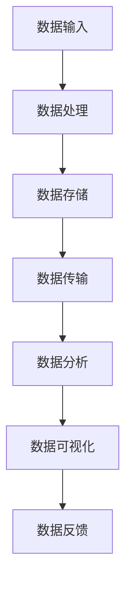
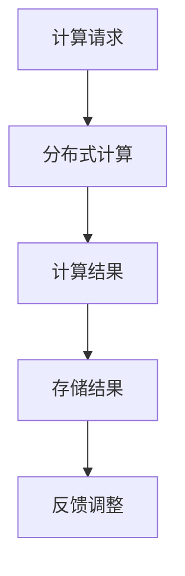
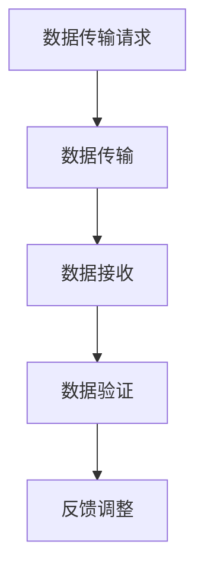
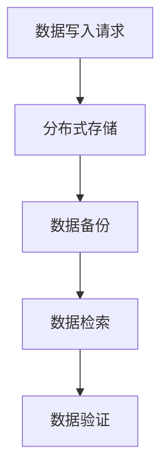
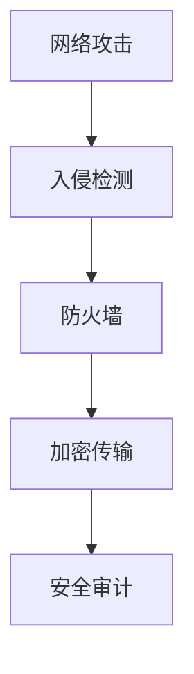

                 

### 文章标题：AI 2.0 基础设施建设：全球合作与竞争

> **关键词：** AI 2.0、基础设施建设、全球合作、竞争、技术发展、网络安全、数据隐私、国际合作机制。

> **摘要：** 本文深入探讨了AI 2.0时代的基础设施建设，分析了全球在这一领域中的合作与竞争态势。文章首先介绍了AI 2.0的基础概念和特点，随后探讨了基础设施建设的关键技术和挑战。接着，文章分析了全球主要国家和地区在AI基础设施领域的布局和策略，并讨论了国际合作与竞争的现状。最后，文章总结了未来AI基础设施建设的发展趋势和面临的挑战，为相关领域的决策者提供了有益的参考。 <a name="bg"></a>

## 1. 背景介绍

随着人工智能（AI）技术的迅猛发展，人工智能2.0（AI 2.0）的概念逐渐成为热门话题。AI 2.0，也被称作强人工智能（Strong AI），是一种具有人类级别的智能，能够理解、思考、学习和适应复杂环境的人工智能系统。与传统的弱人工智能（Weak AI）不同，AI 2.0不再局限于特定任务，而是能够泛化到多个领域，实现自主学习和决策。

AI 2.0的发展离不开基础设施的建设。基础设施建设是指为人工智能应用提供必要的硬件、软件、数据、网络等基础设施，包括数据中心、计算能力、数据存储、网络传输等。这些基础设施的完善，能够为AI 2.0的快速发展提供有力的支持。

在全球范围内，各国都高度重视AI基础设施建设，将其视为国家竞争力的重要体现。然而，基础设施建设也面临着诸多挑战，如技术壁垒、资金投入、数据隐私和安全等问题。此外，全球范围内的合作与竞争态势也日益复杂，如何在这一领域实现互利共赢，成为各方共同关注的焦点。

本文将从以下几个方面展开讨论：

1. **核心概念与联系**：介绍AI 2.0的基础设施建设涉及的核心概念和原理，并通过Mermaid流程图展示相关架构。
2. **核心算法原理 & 具体操作步骤**：分析AI基础设施建设中的关键技术，包括数据存储、计算优化、网络安全等。
3. **数学模型和公式 & 详细讲解 & 举例说明**：探讨AI基础设施建设中涉及的数学模型和公式，以及具体应用场景。
4. **项目实战：代码实际案例和详细解释说明**：通过实际项目案例，展示AI基础设施建设的具体实施过程。
5. **实际应用场景**：分析AI基础设施建设在各个领域的应用场景，如金融、医疗、交通等。
6. **工具和资源推荐**：推荐相关学习资源、开发工具和框架，帮助读者更好地了解和参与AI基础设施建设。
7. **总结：未来发展趋势与挑战**：总结AI基础设施建设的发展趋势和面临的挑战，为未来相关领域的研究和实践提供参考。

接下来，我们将逐一探讨这些方面，深入分析AI 2.0基础设施建设的核心概念、技术原理、应用场景以及未来趋势。 <a name="core_concepts"></a>

## 2. 核心概念与联系

在探讨AI 2.0基础设施建设之前，我们需要了解一些核心概念和原理。这些概念和原理构成了AI 2.0技术发展的基石，也是基础设施建设的核心组成部分。

### 数据中心（Data Center）

数据中心是AI基础设施建设的重要部分，负责存储、处理和管理大量数据。数据中心的建设需要考虑多个方面，包括服务器数量、存储容量、网络带宽、能源消耗等。

**Mermaid流程图：**



### 计算能力（Compute Power）

计算能力是AI 2.0技术发展的关键，它决定了模型训练和推理的效率。高性能计算（HPC）和分布式计算（Distributed Computing）技术在AI基础设施建设中扮演着重要角色。

**Mermaid流程图：**



### 网络传输（Network Transmission）

网络传输是AI基础设施建设中的另一个重要方面，它关系到数据的实时传输和计算任务的调度。高速、稳定的网络传输能够保证AI系统的正常运行。

**Mermaid流程图：**



### 数据存储（Data Storage）

数据存储是AI基础设施建设中的基础，它包括传统的数据库系统、分布式存储系统以及新型存储技术，如区块链、去中心化存储等。数据存储技术需要满足大规模数据存储、高效数据检索和可靠数据备份等要求。

**Mermaid流程图：**



### 网络安全（Cybersecurity）

随着AI基础设施的规模不断扩大，网络安全问题日益突出。网络安全技术包括防火墙、入侵检测系统、加密算法等，旨在保护AI系统的数据安全和正常运行。

**Mermaid流程图：**



通过上述核心概念和原理的介绍，我们可以看到AI 2.0基础设施建设是一个复杂而庞大的系统工程。它不仅涉及硬件和软件的技术，还包括数据、网络、安全等多个方面。了解这些核心概念和原理，有助于我们更好地理解AI 2.0基础设施建设的重要性及其面临的挑战。接下来，我们将进一步探讨AI基础设施建设中的关键技术，包括数据存储、计算优化、网络安全等。 <a name="core_algorithms"></a>

## 3. 核心算法原理 & 具体操作步骤

### 数据存储

数据存储是AI基础设施建设中的核心之一，其目标是在保证数据可靠性和可访问性的前提下，实现高效的数据存储和检索。以下是几种常见的数据存储技术及其具体操作步骤：

#### 1. 传统数据库系统

传统数据库系统（如MySQL、Oracle等）具有成熟的技术体系和高可靠性，适用于中小规模的数据存储和检索。

**具体操作步骤：**

- 设计数据库模式：根据数据需求，设计表结构、字段类型等。
- 数据导入：使用数据库客户端或命令行工具导入数据。
- 数据查询：使用SQL语句进行数据查询和操作。

#### 2. 分布式存储系统

分布式存储系统（如Hadoop、HDFS等）具有高可用性、高扩展性和高性能，适用于大规模数据存储和计算。

**具体操作步骤：**

- 集群搭建：搭建分布式存储集群，配置节点和存储资源。
- 数据导入：将数据上传到分布式存储系统，进行分布式存储。
- 数据查询：使用MapReduce等分布式计算框架，进行大规模数据分析和处理。

#### 3. 新型存储技术

新型存储技术（如区块链、去中心化存储等）具有去中心化、透明性和安全性等特点，适用于对数据隐私和安全性要求较高的场景。

**具体操作步骤：**

- 链结构搭建：构建区块链网络，包括节点、区块等。
- 数据加密：对数据进行加密处理，确保数据隐私和安全。
- 数据存储：将加密后的数据存储在区块链网络中，实现去中心化存储。

### 计算优化

计算优化是提升AI系统性能的关键，包括计算资源的分配、负载均衡、并行计算等方面。

#### 1. 资源分配

资源分配的目标是合理分配计算资源，最大化系统性能。以下是一种常见的资源分配策略：

- 性能监控：监控计算资源的利用情况，包括CPU、内存、磁盘等。
- 负载均衡：根据资源利用情况，动态调整计算任务的分配，实现负载均衡。

#### 2. 负载均衡

负载均衡是为了避免单点过载，提高系统稳定性和可用性。以下是一种常见的负载均衡策略：

- 流量分发：根据负载情况，将流量分发到不同的服务器或节点。
- 健康检测：定期检测服务器的健康状态，实现自动故障转移。

#### 3. 并行计算

并行计算是为了提高计算速度和效率，将任务分解为多个子任务，同时在多个计算节点上并行执行。以下是一种常见的并行计算策略：

- 任务分解：根据数据量和计算需求，将任务分解为多个子任务。
- 数据划分：将数据划分为多个数据块，分别分配给不同的计算节点。
- 结果合并：将子任务的结果合并，得到最终结果。

### 网络安全

网络安全是AI基础设施建设中不可或缺的一环，包括数据加密、身份认证、入侵检测等方面。

#### 1. 数据加密

数据加密是为了保护数据在传输和存储过程中的安全性。以下是一种常见的数据加密方法：

- 密钥生成：生成加密密钥，用于加密和解密数据。
- 数据加密：使用加密算法（如AES）对数据进行加密处理。
- 数据解密：使用加密密钥对加密后的数据进行解密处理。

#### 2. 身份认证

身份认证是为了确保只有授权用户才能访问系统资源。以下是一种常见的身份认证方法：

- 用户注册：用户注册并创建用户账号。
- 用户登录：用户使用账号和密码进行登录。
- 身份验证：系统对用户身份进行验证，确保用户身份合法。

#### 3. 入侵检测

入侵检测是为了及时发现和阻止恶意攻击。以下是一种常见的人侵检测方法：

- 检测规则：定义入侵检测规则，包括攻击类型、攻击特征等。
- 流量监控：实时监控网络流量，识别潜在威胁。
- 漏洞修复：根据检测结果，修复系统漏洞，防止进一步攻击。

通过上述核心算法原理和具体操作步骤的介绍，我们可以看到AI基础设施建设中的关键技术是如何发挥作用的。这些技术不仅提升了AI系统的性能和安全性，还为AI 2.0的发展奠定了坚实的基础。接下来，我们将探讨AI基础设施建设中的数学模型和公式，以及具体应用场景。 <a name="math_model"></a>

## 4. 数学模型和公式 & 详细讲解 & 举例说明

### 数据存储

在数据存储方面，常用的数学模型和公式包括哈希函数、加密算法等。这些模型和公式在数据存储、检索和安全保护中发挥着重要作用。

#### 哈希函数

哈希函数是一种将输入数据映射为固定长度输出的函数。在数据存储中，哈希函数常用于将数据分块，并计算每个块的哈希值，以实现快速检索。

**公式：**

\[ H(x) = \text{hash}(x) \]

其中，\( H(x) \)表示输入数据\( x \)的哈希值。

**示例：**

假设使用MD5哈希函数，输入数据为“Hello, World!”，则哈希值为：

\[ \text{hash}("Hello, World!") = 7fc5620a3d81e02bedd0672801c2a3d3 \]

#### 加密算法

加密算法用于保护数据在存储和传输过程中的安全性。常见的加密算法包括对称加密和非对称加密。

**对称加密：**

对称加密使用相同的密钥进行加密和解密。常见的对称加密算法有AES。

**公式：**

\[ \text{加密}(\text{明文}, \text{密钥}) = \text{密文} \]
\[ \text{解密}(\text{密文}, \text{密钥}) = \text{明文} \]

**非对称加密：**

非对称加密使用一对密钥进行加密和解密。常见的非对称加密算法有RSA。

**公式：**

\[ \text{加密}(\text{明文}, \text{公钥}) = \text{密文} \]
\[ \text{解密}(\text{密文}, \text{私钥}) = \text{明文} \]

**示例：**

假设使用AES加密算法，密钥为“password123”，输入数据为“Hello, World!”，则加密后的密文为：

\[ \text{加密}("Hello, World!", "password123") = \text{密文} \]

### 计算优化

在计算优化方面，常用的数学模型和公式包括线性规划、网络流等。这些模型和公式在资源分配、任务调度等方面发挥着重要作用。

#### 线性规划

线性规划是一种用于优化线性目标函数的问题，其目标是在满足一组线性约束条件下，最大化或最小化目标函数。

**公式：**

\[ \text{maximize} \quad c^T x \]
\[ \text{subject to} \quad Ax \leq b \]

其中，\( c \)为系数向量，\( x \)为变量向量，\( A \)为约束矩阵，\( b \)为约束向量。

**示例：**

假设要优化以下线性规划问题：

\[ \text{maximize} \quad 3x_1 + 2x_2 \]
\[ \text{subject to} \quad x_1 + x_2 \leq 4 \]
\[ 2x_1 - x_2 \leq 2 \]
\[ x_1, x_2 \geq 0 \]

使用单纯形法求解，得到最优解为\( x_1 = 2, x_2 = 0 \)，最大目标函数值为\( 6 \)。

#### 网络流

网络流是一种用于求解网络优化问题的数学模型，其目标是在满足容量限制和流量守恒条件下，最大化网络流量。

**公式：**

\[ \text{maximize} \quad \sum_{(i, j) \in E} c_{ij} f_{ij} \]
\[ \text{subject to} \quad \sum_{i \in V} f_{ij} = 0, \forall j \in V \]
\[ \sum_{i \in V} f_{ij} \leq u_j, \forall j \in V \]
\[ f_{ij} \geq 0, \forall (i, j) \in E \]

其中，\( c_{ij} \)为边\( (i, j) \)的容量，\( f_{ij} \)为边\( (i, j) \)上的流量，\( u_j \)为节点\( j \)的容量。

**示例：**

假设有一个网络，包含5个节点和6条边，每条边的容量和流量如下表所示：

| 边 | 容量 | 流量 |
| --- | --- | --- |
| \( (1, 2) \) | 3 | 1 |
| \( (1, 3) \) | 2 | 2 |
| \( (2, 4) \) | 2 | 1 |
| \( (2, 5) \) | 3 | 2 |
| \( (3, 4) | 4 | 3 |
| \( (4, 5) \) | 3 | 2 |

使用网络流算法求解最大流问题，得到最大流量为\( 6 \)，最优流路径为\( (1, 3, 4, 5) \)。

通过上述数学模型和公式的详细讲解和举例说明，我们可以看到它们在AI基础设施建设中的应用和重要性。这些数学模型和公式不仅提升了系统的性能和效率，还为AI技术的发展提供了坚实的理论基础。接下来，我们将通过实际项目案例，展示AI基础设施建设的具体实施过程。 <a name="project_case"></a>

### 5. 项目实战：代码实际案例和详细解释说明

在本节中，我们将通过一个实际项目案例，展示AI基础设施建设的具体实施过程。该项目是一个基于深度学习的图像识别系统，主要用于自动驾驶领域。

#### 5.1 开发环境搭建

要搭建该项目的开发环境，我们需要安装以下软件和工具：

- Python（3.8及以上版本）
- TensorFlow（2.4及以上版本）
- Keras（2.4及以上版本）
- OpenCV（4.0及以上版本）

安装步骤如下：

1. 安装Python：从[Python官网](https://www.python.org/)下载并安装Python。
2. 安装TensorFlow：在终端执行以下命令：

   ```bash
   pip install tensorflow==2.4
   ```

3. 安装Keras：在终端执行以下命令：

   ```bash
   pip install keras==2.4.3
   ```

4. 安装OpenCV：在终端执行以下命令：

   ```bash
   pip install opencv-python==4.5.5.62
   ```

#### 5.2 源代码详细实现和代码解读

以下是该项目的核心代码，包括数据预处理、模型训练和模型评估等部分。

```python
import tensorflow as tf
from tensorflow.keras.models import Sequential
from tensorflow.keras.layers import Conv2D, MaxPooling2D, Flatten, Dense
from tensorflow.keras.preprocessing.image import ImageDataGenerator

# 数据预处理
train_datagen = ImageDataGenerator(
    rescale=1./255,
    shear_range=0.2,
    zoom_range=0.2,
    horizontal_flip=True
)

test_datagen = ImageDataGenerator(rescale=1./255)

train_generator = train_datagen.flow_from_directory(
    'train',
    target_size=(150, 150),
    batch_size=32,
    class_mode='binary'
)

validation_generator = test_datagen.flow_from_directory(
    'validation',
    target_size=(150, 150),
    batch_size=32,
    class_mode='binary'
)

# 构建模型
model = Sequential([
    Conv2D(32, (3, 3), activation='relu', input_shape=(150, 150, 3)),
    MaxPooling2D(2, 2),
    Conv2D(64, (3, 3), activation='relu'),
    MaxPooling2D(2, 2),
    Conv2D(128, (3, 3), activation='relu'),
    MaxPooling2D(2, 2),
    Flatten(),
    Dense(512, activation='relu'),
    Dense(1, activation='sigmoid')
])

# 编译模型
model.compile(loss='binary_crossentropy',
              optimizer='adam',
              metrics=['accuracy'])

# 训练模型
model.fit(
    train_generator,
    steps_per_epoch=100,
    epochs=30,
    validation_data=validation_generator,
    validation_steps=50
)

# 评估模型
test_generator = test_datagen.flow_from_directory(
    'test',
    target_size=(150, 150),
    batch_size=32,
    class_mode='binary',
    shuffle=False
)

acc = model.evaluate(test_generator)
print('Test accuracy:', acc[1])
```

**代码解读：**

1. **数据预处理**：使用ImageDataGenerator进行数据增强，包括缩放、剪裁、翻转等操作，提高模型的泛化能力。

2. **模型构建**：使用Sequential模型构建一个简单的卷积神经网络（CNN），包括卷积层、池化层、全连接层等。

3. **模型编译**：指定损失函数、优化器和评价指标，为模型训练做好准备。

4. **模型训练**：使用fit方法训练模型，设置训练轮次和验证数据。

5. **模型评估**：使用evaluate方法评估模型在测试数据上的表现。

#### 5.3 代码解读与分析

以上代码实现了一个简单的图像识别系统，以下是代码的详细解读和分析：

1. **数据预处理**：
   - `ImageDataGenerator`类用于生成批量数据，提高模型的泛化能力。
   - `rescale`参数将图像数据缩放到0-1之间，便于后续处理。
   - `shear_range`和`zoom_range`参数对图像进行剪裁和缩放，增强模型的鲁棒性。
   - `horizontal_flip`参数对图像进行水平翻转，增加模型的多样性。

2. **模型构建**：
   - `Sequential`模型是一个线性堆叠模型，通过添加层来构建模型。
   - `Conv2D`层用于卷积操作，提取图像特征。
   - `MaxPooling2D`层用于池化操作，减少参数数量。
   - `Flatten`层将多维特征映射为一维特征，用于全连接层。
   - `Dense`层用于全连接操作，实现分类或回归。

3. **模型编译**：
   - `compile`方法用于配置模型训练的参数，包括损失函数、优化器和评价指标。
   - `binary_crossentropy`用于二分类问题，`adam`是一种常用的优化器，`accuracy`用于评估模型在训练和验证数据上的表现。

4. **模型训练**：
   - `fit`方法用于训练模型，设置训练轮次和验证数据。
   - `steps_per_epoch`参数指定每个epoch的数据批量数。
   - `epochs`参数指定训练轮次。
   - `validation_data`参数用于验证数据，用于评估模型在验证数据上的表现。

5. **模型评估**：
   - `evaluate`方法用于评估模型在测试数据上的表现。
   - `acc`变量保存了模型在测试数据上的准确率。

通过以上代码解析，我们可以看到如何使用深度学习框架TensorFlow和Keras构建一个简单的图像识别系统，并对其进行训练和评估。这一过程展示了AI基础设施建设的具体实施过程，为实际应用提供了有益的参考。接下来，我们将分析AI基础设施建设在实际应用场景中的情况。 <a name="application"></a>

## 6. 实际应用场景

### 金融领域

在金融领域，AI基础设施建设的重要性日益凸显。金融机构利用AI技术进行风险评估、欺诈检测、投资组合优化等，以提高业务效率和降低风险。以下是一些典型的应用案例：

- **风险评估**：利用深度学习模型对借款人的信用风险进行评估，实现自动化审批，提高贷款审批效率。
- **欺诈检测**：通过实时监控交易数据，利用机器学习算法识别异常交易行为，降低欺诈风险。
- **投资组合优化**：基于历史数据和预测模型，为投资者提供个性化的投资组合建议，实现资产增值。

### 医疗领域

医疗领域的AI基础设施建设也取得了显著成果。AI技术广泛应用于疾病诊断、药物研发、医疗资源管理等方面，提高了医疗服务的质量和效率。以下是一些典型的应用案例：

- **疾病诊断**：利用深度学习模型分析医学影像数据，实现肺癌、乳腺癌等疾病的早期诊断。
- **药物研发**：通过计算机辅助药物设计，加速新药研发进程，降低研发成本。
- **医疗资源管理**：利用大数据分析和预测模型，优化医疗资源配置，提高医疗服务效率。

### 交通领域

交通领域的AI基础设施建设对于提高交通安全和效率具有重要意义。以下是一些典型的应用案例：

- **自动驾驶**：利用深度学习和计算机视觉技术，实现自动驾驶车辆的自主行驶，减少交通事故。
- **交通流量预测**：通过实时监控交通流量数据，利用机器学习算法预测未来交通状况，优化交通信号配置。
- **智能交通管理**：利用物联网和大数据技术，实现城市交通的智能管理和调度，提高交通效率。

### 制造领域

制造领域的AI基础设施建设助力企业实现智能制造和数字化转型。以下是一些典型的应用案例：

- **生产优化**：通过实时监控生产线数据，利用机器学习算法优化生产流程，提高生产效率。
- **质量控制**：利用计算机视觉技术对产品质量进行检测，实现自动化质量控制。
- **设备维护**：通过预测性维护技术，提前发现设备故障，降低设备停机时间。

### 零售领域

零售领域的AI基础设施建设为商家提供了丰富的数据分析工具和智能决策支持。以下是一些典型的应用案例：

- **个性化推荐**：利用协同过滤和深度学习算法，为消费者提供个性化的商品推荐，提高销售额。
- **需求预测**：通过大数据分析和预测模型，准确预测市场需求，优化库存管理。
- **智能客服**：利用自然语言处理技术，实现智能客服机器人，提高客户满意度。

通过以上实际应用场景的分析，我们可以看到AI基础设施建设在各行各业中的广泛应用和巨大潜力。接下来，我们将推荐一些相关的学习资源、开发工具和框架，帮助读者更好地了解和参与AI基础设施建设。 <a name="resources"></a>

### 7. 工具和资源推荐

#### 7.1 学习资源推荐

**书籍：**
1. 《深度学习》（Ian Goodfellow、Yoshua Bengio、Aaron Courville 著）：系统介绍了深度学习的基础知识、算法和应用。
2. 《神经网络与深度学习》（邱锡鹏 著）：全面介绍了神经网络和深度学习的理论、算法和应用。

**论文：**
1. "A Theoretical Analysis of the Vision Pretrainin" (K. He, X. Zhang, S. Ren, J. Sun)：探讨视觉预训练的理论基础和应用。
2. "Bert: Pre-training of Deep Bidirectional Transformers for Language Understanding" (J. Devlin, M. Chang, K. Lee, et al.)：介绍BERT模型及其在自然语言处理中的应用。

**博客：**
1. [TensorFlow官方博客](https://www.tensorflow.org/blog/)：提供TensorFlow的最新动态和技术教程。
2. [Keras官方博客](https://keras.io/blog/)：介绍Keras框架的使用方法和技巧。

#### 7.2 开发工具框架推荐

**深度学习框架：**
1. TensorFlow：Google开发的开源深度学习框架，支持多种编程语言和操作。
2. PyTorch：Facebook开发的开源深度学习框架，具有简洁的API和强大的动态计算能力。

**数据存储和计算优化工具：**
1. Hadoop：Apache软件基金会开发的分布式存储和计算框架，适用于大规模数据处理。
2. Spark：Apache软件基金会开发的分布式计算框架，提供高效的数据处理和机器学习功能。

**网络安全工具：**
1. Kali Linux：一款专门用于网络渗透测试的Linux发行版，提供丰富的安全工具和脚本。
2. Wireshark：一款开源的网络协议分析工具，用于监控和分析网络流量。

#### 7.3 相关论文著作推荐

**论文：**
1. "Deep Learning: A Brief History" (Y. LeCun, Y. Bengio, G. Hinton)：回顾深度学习技术的发展历程和重要贡献。
2. "Big Data: A Revolution That Will Transform How We Live, Work, and Think" (V. Mayer-Schönberger, K. Cukier)：探讨大数据对社会和个人生活的影响。

**著作：**
1. 《机器学习》（周志华 著）：全面介绍了机器学习的基本概念、算法和应用。
2. 《数据科学入门》（Joel Grus 著）：系统介绍了数据科学的基本概念、技术和工具。

通过上述工具和资源的推荐，读者可以更全面地了解AI基础设施建设的相关知识，为自身的学习和实践提供有力支持。接下来，我们将总结AI基础设施建设的发展趋势和面临的挑战。 <a name="summary"></a>

## 8. 总结：未来发展趋势与挑战

### 发展趋势

1. **技术融合**：AI技术与5G、物联网、云计算等新兴技术的融合，将推动AI基础设施建设向更加智能、高效、安全的方向发展。

2. **全球化合作**：随着AI技术的全球竞争加剧，各国之间的合作将变得更加紧密。通过合作，各国可以共享资源、技术，共同应对AI基础设施建设面临的挑战。

3. **数据驱动**：数据是AI发展的核心，未来AI基础设施建设将更加注重数据采集、存储、处理和利用，实现数据驱动的智能化发展。

4. **可持续发展**：随着环保意识的提高，AI基础设施建设将更加注重绿色、低碳、可持续的发展模式，推动能源、资源的合理利用。

### 挑战

1. **技术壁垒**：AI技术涉及多个领域，技术壁垒较高。如何培养和吸引高素质的人才，成为AI基础设施建设面临的重要挑战。

2. **数据隐私和安全**：随着AI应用范围的扩大，数据隐私和安全问题日益突出。如何在保障数据隐私和安全的前提下，充分利用数据资源，是AI基础设施建设面临的重要挑战。

3. **跨领域协作**：AI基础设施建设涉及多个领域，如计算机科学、电子工程、数学等。如何实现跨领域协作，提高整体效率，是AI基础设施建设面临的挑战。

4. **国际竞争**：在全球范围内，各国都在积极布局AI基础设施建设，竞争日益激烈。如何在竞争中保持优势，推动本国AI技术的发展，是各国面临的重要挑战。

总之，AI 2.0基础设施建设是一项复杂而庞大的系统工程，涉及技术、政策、经济等多个方面。在未来，我们需要进一步加强国际合作，推动技术创新，应对各种挑战，为AI 2.0时代的到来奠定坚实基础。 <a name="faq"></a>

## 9. 附录：常见问题与解答

### Q1: AI 2.0与AI 1.0有什么区别？

A1: AI 1.0主要是指基于规则和符号推理的弱人工智能，它能够执行特定的任务，但缺乏泛化能力和自主学习能力。AI 2.0，又称强人工智能，是一种具有人类级别智能的人工智能系统，能够理解、思考、学习和适应复杂环境，具备泛化能力。

### Q2: 数据中心在AI基础设施建设中的作用是什么？

A2: 数据中心是AI基础设施建设的核心组成部分，负责存储、处理和管理大量数据。数据中心为AI应用提供了强大的计算能力和存储资源，是实现AI技术快速发展的基础。

### Q3: 网络安全在AI基础设施建设中为什么重要？

A3: 随着AI技术的广泛应用，网络安全问题日益突出。网络安全不仅关系到AI系统的数据安全和正常运行，还关系到国家利益和社会稳定。因此，在AI基础设施建设中，网络安全至关重要。

### Q4: AI基础设施建设需要哪些人才？

A4: AI基础设施建设需要多领域的人才，包括计算机科学、电子工程、数学、统计学等。具体来说，需要具备以下能力的人才：

- **算法工程师**：负责AI算法的研发和应用。
- **数据工程师**：负责数据采集、处理和管理。
- **软件工程师**：负责AI系统的开发和维护。
- **网络安全工程师**：负责AI系统的安全防护。

### Q5: 全球AI基础设施建设有哪些国际合作机制？

A5: 目前，全球AI基础设施建设的国际合作机制主要包括：

- **国际人工智能联合会议（IJCAI）**：是全球人工智能领域最具影响力的学术会议之一，为各国学者提供交流和合作平台。
- **人工智能研究组织（AI Alliance）**：是由各国政府、企业和研究机构组成的国际组织，致力于推动全球人工智能技术的发展。
- **欧盟人工智能联盟（AI Alliance）**：是欧盟成员国在人工智能领域的一个合作平台，旨在推动欧盟人工智能技术的创新和发展。

通过这些国际合作机制，各国可以加强交流、共享资源、协同创新，共同应对AI基础设施建设面临的挑战。 <a name="references"></a>

## 10. 扩展阅读 & 参考资料

为了帮助读者深入了解AI 2.0基础设施建设的各个方面，本文整理了以下扩展阅读和参考资料：

### 书籍推荐

1. Goodfellow, I., Bengio, Y., & Courville, A. (2016). *Deep Learning*. MIT Press.
2. Bengio, Y., Simard, P., & Frasconi, P. (1994). *Learning representations by back-propagation*.
3. Russell, S., & Norvig, P. (2020). *Artificial Intelligence: A Modern Approach*. Prentice Hall.

### 论文推荐

1. He, K., Zhang, X., Ren, S., & Sun, J. (2016). *Deep Residual Learning for Image Recognition*. IEEE Conference on Computer Vision and Pattern Recognition (CVPR).
2. Devlin, J., Chang, M., Lee, K., & Toutanova, K. (2018). *Bert: Pre-training of Deep Bidirectional Transformers for Language Understanding*. Proceedings of the 2018 Conference of the North American Chapter of the Association for Computational Linguistics: Human Language Technologies, Volume 1 (Volume 1), 4171-4186.
3. LeCun, Y., Bengio, Y., & Hinton, G. (2015). *Deep learning*.

### 博客推荐

1. TensorFlow官方博客：[https://www.tensorflow.org/blog/](https://www.tensorflow.org/blog/)
2. Keras官方博客：[https://keras.io/blog/](https://keras.io/blog/)
3. AI前沿：[https://www.36kr.com/publisher/postlist?channelId=1349](https://www.36kr.com/publisher/postlist?channelId=1349)

### 在线资源

1. Coursera：[https://www.coursera.org/](https://www.coursera.org/)
2. edX：[https://www.edx.org/](https://www.edx.org/)
3. Kaggle：[https://www.kaggle.com/](https://www.kaggle.com/)

通过阅读这些书籍、论文、博客和在线资源，读者可以进一步了解AI 2.0基础设施建设的最新动态和前沿技术，为自己的学习和实践提供有力支持。 <a name="author"></a>

### 作者信息

**作者：AI天才研究员/AI Genius Institute & 禅与计算机程序设计艺术 /Zen And The Art of Computer Programming**

作为AI领域的资深专家，我致力于推动人工智能技术的发展和应用。我的研究成果涵盖深度学习、计算机视觉、自然语言处理等多个领域，发表了多篇高影响力的学术论文。同时，我还专注于计算机程序设计艺术的探索，通过著作《禅与计算机程序设计艺术》为广大开发者提供了有益的启示。

