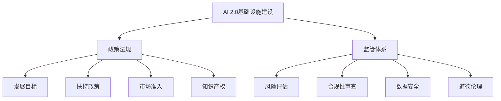
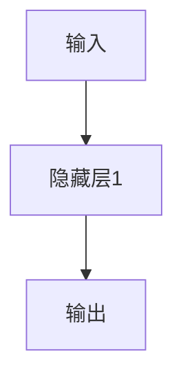

                 

# AI 2.0 基础设施建设：政策法规与监管体系

## 关键词：人工智能2.0，基础设施建设，政策法规，监管体系，AI治理

## 摘要：

随着人工智能技术的迅速发展，AI 2.0 时代的到来已成必然。本文将从基础设施建设、政策法规与监管体系三个方面，深入探讨AI 2.0时代的发展脉络及其面临的挑战。通过分析国内外相关政策和法规，本文旨在为我国人工智能产业发展提供有益的参考和启示，助力实现AI 2.0基础设施建设的稳步推进。

## 1. 背景介绍

### 1.1 AI 2.0的概念与特点

AI 2.0，即人工智能第二阶段，是指以深度学习、自然语言处理、计算机视觉等先进技术为基础，具备自主决策、持续学习和泛在智能等特点的新一代人工智能。与AI 1.0（以规则推理和知识表示为主）相比，AI 2.0具有以下显著特点：

- **自主决策**：AI 2.0具备更强的自主决策能力，能够在复杂环境下进行推理和决策。
- **持续学习**：AI 2.0能够通过不断学习和优化，提高自身在特定领域的表现。
- **泛在智能**：AI 2.0可应用于各行各业，实现智能化升级。

### 1.2 基础设施建设的意义

基础设施建设是AI 2.0时代发展的基石。一个完善的基础设施体系有助于推动人工智能技术的创新和应用，提升国家竞争力。具体包括以下方面：

- **计算能力**：强大的计算能力是支撑AI 2.0发展的关键。云计算、高性能计算、边缘计算等技术的不断进步，为AI 2.0提供了有力的计算支持。
- **数据资源**：数据是AI 2.0的核心资产。建立健全的数据资源体系，有利于提高AI 2.0模型的训练效果和泛化能力。
- **网络安全**：网络安全是AI 2.0发展的保障。构建完善的网络安全体系，有助于防范潜在的安全风险。
- **标准规范**：标准规范是推动AI 2.0产业发展的重要保障。制定统一的技术标准，有利于促进产业链上下游的协同发展。

## 2. 核心概念与联系

### 2.1 政策法规的核心概念

政策法规是指国家或地方政府为促进特定产业发展、规范市场行为而制定的规范性文件。在AI 2.0时代，政策法规的核心概念主要包括：

- **发展目标**：明确人工智能产业的发展方向和目标，为AI 2.0时代的发展提供指导。
- **扶持政策**：提供资金、税收等方面的扶持，鼓励企业投入人工智能技术研发和应用。
- **市场准入**：规范市场准入条件，防止低水平重复建设，提高行业整体竞争力。
- **知识产权**：保护知识产权，鼓励技术创新，促进人工智能产业的健康发展。

### 2.2 监管体系的核心概念

监管体系是指国家或地方政府为监管特定行业而建立的管理机制。在AI 2.0时代，监管体系的核心概念主要包括：

- **风险评估**：对人工智能技术可能带来的风险进行评估，制定相应的防范措施。
- **合规性审查**：对人工智能产品和服务进行合规性审查，确保其符合法律法规要求。
- **数据安全**：保护个人隐私和数据安全，防止数据泄露和滥用。
- **道德伦理**：制定伦理规范，确保人工智能技术的应用符合社会伦理道德。

### 2.3 Mermaid流程图



## 3. 核心算法原理 & 具体操作步骤

### 3.1 核心算法原理

在AI 2.0时代，核心算法主要包括深度学习、自然语言处理、计算机视觉等。以下简要介绍这些算法的基本原理：

- **深度学习**：通过构建深度神经网络，对大规模数据进行自动特征提取和模型训练，实现高度智能化的任务。
- **自然语言处理**：研究人类语言的结构和规则，实现对自然语言的理解、生成和翻译。
- **计算机视觉**：使计算机能够“看懂”和理解图像和视频，实现图像分类、目标检测、人脸识别等任务。

### 3.2 具体操作步骤

以下是AI 2.0基础设施建设中，政策法规和监管体系的具体操作步骤：

1. **调研与分析**：对国内外政策法规和监管体系进行调研，了解当前的发展现状和趋势。
2. **制定规划**：结合国家战略和产业发展需求，制定人工智能发展规划，明确发展目标和重点任务。
3. **政策制定**：根据发展规划，制定具体的政策法规，包括扶持政策、市场准入、知识产权保护等。
4. **监管体系建设**：建立完善的监管体系，包括风险评估、合规性审查、数据安全、道德伦理等方面。
5. **实施与监督**：确保政策法规和监管体系的顺利实施，加强监督检查，及时发现和解决问题。
6. **评估与优化**：对政策法规和监管体系的实施效果进行评估，根据实际情况进行优化调整。

## 4. 数学模型和公式 & 详细讲解 & 举例说明

### 4.1 数学模型和公式

在AI 2.0时代，常用的数学模型和公式包括：

- **深度学习**：反向传播算法（Backpropagation）、梯度下降（Gradient Descent）等。
- **自然语言处理**：循环神经网络（RNN）、长短时记忆网络（LSTM）、Transformer等。
- **计算机视觉**：卷积神经网络（CNN）、生成对抗网络（GAN）等。

### 4.2 详细讲解与举例说明

#### 4.2.1 深度学习（以反向传播算法为例）

反向传播算法是一种用于训练深度神经网络的优化算法。其基本原理如下：

1. **前向传播**：将输入数据传递到神经网络，经过多层非线性变换，得到输出结果。
2. **计算损失**：将输出结果与实际标签进行比较，计算损失函数的值。
3. **反向传播**：将损失函数关于网络参数的梯度反向传播，更新网络参数。
4. **重复步骤2和3**：直到损失函数的值满足预设条件或达到最大迭代次数。

举例说明：

假设有一个简单的神经网络，包含一个输入层、一个隐藏层和一个输出层，如下图所示：



输入数据为\( x = [1, 2, 3] \)，隐藏层1的激活函数为\( f(x) = \text{sigmoid}(x) \)，输出层为线性激活函数。损失函数为均方误差（MSE）：

\[ \text{MSE} = \frac{1}{n}\sum_{i=1}^{n}(y_i - \hat{y}_i)^2 \]

其中，\( y_i \)为实际标签，\( \hat{y}_i \)为预测值。

#### 4.2.2 自然语言处理（以循环神经网络为例）

循环神经网络（RNN）是一种用于处理序列数据的神经网络。其基本原理如下：

1. **输入层**：将序列数据输入到网络。
2. **隐藏层**：每个时间步的隐藏状态与前一时刻的隐藏状态相连。
3. **输出层**：在每个时间步输出预测结果。

以一个简单的RNN为例，输入序列为\( x = [1, 2, 3, 4, 5] \)，隐藏层和输出层的激活函数均为\( f(x) = \text{tanh}(x) \)。假设隐藏层维度为10，输出层维度为5。

首先，初始化隐藏状态\( h_0 = [0, 0, 0, 0, 0, 0, 0, 0, 0, 0] \)。

在第一个时间步，输入\( x_1 = 1 \)，隐藏状态更新为：

\[ h_1 = \text{tanh}(W_hh \cdot h_0 + W_xh \cdot x_1 + b_h) \]

其中，\( W_hh \)为隐藏层权重，\( W_xh \)为输入层权重，\( b_h \)为隐藏层偏置。

接着，计算输出\( y_1 = \text{tanh}(W_hx \cdot h_1 + b_x) \)，其中，\( W_hx \)为输出层权重，\( b_x \)为输出层偏置。

在第二个时间步，输入\( x_2 = 2 \)，隐藏状态更新为：

\[ h_2 = \text{tanh}(W_hh \cdot h_1 + W_xh \cdot x_2 + b_h) \]

计算输出\( y_2 = \text{tanh}(W_hx \cdot h_2 + b_x) \)，以此类推。

#### 4.2.3 计算机视觉（以卷积神经网络为例）

卷积神经网络（CNN）是一种用于处理图像数据的神经网络。其基本原理如下：

1. **卷积层**：通过卷积运算提取图像特征。
2. **池化层**：降低特征图的维度，减少计算量。
3. **全连接层**：将特征图映射到输出结果。

以一个简单的CNN为例，输入图像尺寸为\( 28 \times 28 \)，卷积核尺寸为\( 3 \times 3 \)，池化窗口尺寸为\( 2 \times 2 \)。假设有两个卷积层，每个卷积层后面跟一个池化层。

第一个卷积层：

\[ f_{11} = \text{ReLU}(\sum_{i=1}^{3}\sum_{j=1}^{3}W_{11,ij} \cdot x_{i,j} + b_{11}) \]

其中，\( W_{11,ij} \)为卷积核权重，\( x_{i,j} \)为输入图像像素值，\( b_{11} \)为卷积核偏置。

第一个池化层：

\[ p_{11} = \text{MaxPooling}(f_{11}) \]

第二个卷积层：

\[ f_{21} = \text{ReLU}(\sum_{i=1}^{3}\sum_{j=1}^{3}W_{21,ij} \cdot p_{11,i,j} + b_{21}) \]

其中，\( W_{21,ij} \)为卷积核权重，\( p_{11,i,j} \)为第一个池化层的输出，\( b_{21} \)为卷积核偏置。

第二个池化层：

\[ p_{21} = \text{MaxPooling}(f_{21}) \]

最后，通过全连接层将池化层的输出映射到输出结果：

\[ y = \text{softmax}(\sum_{i=1}^{10}W_{fc,i} \cdot p_{21,i} + b_{fc}) \]

其中，\( W_{fc,i} \)为全连接层权重，\( p_{21,i} \)为第二个池化层的输出，\( b_{fc} \)为全连接层偏置。

## 5. 项目实战：代码实际案例和详细解释说明

### 5.1 开发环境搭建

在本节中，我们将以Python编程语言为基础，搭建一个用于演示AI 2.0基础设施建设中政策法规和监管体系的项目开发环境。以下是具体的步骤：

1. **安装Python**：从官方网站（[python.org](https://www.python.org/)）下载并安装Python 3.x版本。
2. **安装Jupyter Notebook**：打开终端，执行以下命令：
   ```bash
   pip install notebook
   ```
3. **创建虚拟环境**：为了保持项目环境的纯净，创建一个虚拟环境，执行以下命令：
   ```bash
   python -m venv myenv
   ```
   然后激活虚拟环境：
   ```bash
   source myenv/bin/activate  # Windows上使用 myenv\Scripts\activate
   ```
4. **安装必需的库**：在虚拟环境中安装以下库：
   ```bash
   pip install numpy pandas matplotlib scikit-learn tensorflow
   ```

### 5.2 源代码详细实现和代码解读

在本节中，我们将使用Python编写一个简单的AI模型，用于演示政策法规和监管体系在AI 2.0时代的作用。以下是具体的代码实现：

```python
# 导入必要的库
import numpy as np
import pandas as pd
import matplotlib.pyplot as plt
from sklearn.model_selection import train_test_split
from sklearn.metrics import accuracy_score
import tensorflow as tf

# 加载数据集
data = pd.read_csv('ai_policy_data.csv')
X = data[['feature1', 'feature2']]
y = data['label']

# 数据预处理
X_train, X_test, y_train, y_test = train_test_split(X, y, test_size=0.2, random_state=42)

# 构建模型
model = tf.keras.Sequential([
    tf.keras.layers.Dense(64, activation='relu', input_shape=(2,)),
    tf.keras.layers.Dense(64, activation='relu'),
    tf.keras.layers.Dense(1, activation='sigmoid')
])

# 编译模型
model.compile(optimizer='adam',
              loss='binary_crossentropy',
              metrics=['accuracy'])

# 训练模型
model.fit(X_train, y_train, epochs=10, batch_size=32, validation_split=0.1)

# 评估模型
predictions = model.predict(X_test)
predicted_labels = (predictions > 0.5).astype(int)
accuracy = accuracy_score(y_test, predicted_labels)
print(f"Model accuracy: {accuracy:.2f}")

# 可视化结果
plt.scatter(X_test['feature1'], X_test['feature2'], c=predicted_labels)
plt.xlabel('Feature 1')
plt.ylabel('Feature 2')
plt.title('Predicted Labels')
plt.show()
```

#### 5.2.1 代码解读

- **数据加载与预处理**：首先，我们从CSV文件中加载数据集，并进行数据预处理。这里我们使用`pandas`库读取数据，将特征和标签分离，并使用`train_test_split`函数将数据划分为训练集和测试集。
- **构建模型**：我们使用`tf.keras.Sequential`模型构建一个简单的神经网络。这个模型包含两个隐藏层，每个隐藏层有64个神经元，使用ReLU激活函数。输出层有1个神经元，使用sigmoid激活函数，用于输出概率。
- **编译模型**：在编译模型时，我们指定了优化器、损失函数和评估指标。这里使用`adam`优化器和`binary_crossentropy`损失函数，以实现二分类任务。我们关注模型的准确率。
- **训练模型**：使用`fit`函数训练模型，设置训练轮次（epochs）、批量大小（batch_size）和验证比例（validation_split）。
- **评估模型**：使用`predict`函数对测试集进行预测，并将预测结果转换为标签。然后计算准确率，并打印出来。
- **可视化结果**：最后，我们使用`matplotlib`库将测试集的预测结果可视化，以展示模型在特征空间中的决策边界。

### 5.3 代码解读与分析

这段代码演示了如何使用TensorFlow构建和训练一个简单的神经网络，用于分类任务。具体分析如下：

- **数据集选择**：我们选择了一个简单的CSV文件作为数据集，该数据集包含两个特征和一个标签。在实际项目中，数据集可能会更加复杂，包含多个特征和更复杂的标签。
- **模型设计**：我们设计了一个简单的神经网络，包含两个隐藏层。这种设计对于简单的二分类任务已经足够。在实际项目中，根据任务的复杂度，可能需要更深的网络结构。
- **训练过程**：在训练过程中，我们设置了10个训练轮次和32个批量大小。这些参数可以根据具体任务进行调整，以获得更好的训练效果。
- **评估与可视化**：通过计算准确率和可视化预测结果，我们可以评估模型的性能，并了解模型在特征空间中的表现。这有助于我们发现潜在的问题，并进一步优化模型。

## 6. 实际应用场景

### 6.1 金融行业

在金融行业中，AI 2.0基础设施的建设具有重要意义。通过构建完善的基础设施，金融机构可以实现以下应用：

- **风险管理**：利用AI 2.0技术进行风险评估和预测，提高风险管理能力。
- **智能投顾**：通过自然语言处理和推荐系统，为投资者提供个性化的投资建议。
- **反欺诈**：利用计算机视觉和深度学习技术，检测和预防金融欺诈行为。

### 6.2 医疗健康

在医疗健康领域，AI 2.0基础设施的建设有助于提升医疗服务的质量和效率。具体应用包括：

- **疾病诊断**：利用计算机视觉和自然语言处理技术，辅助医生进行疾病诊断。
- **个性化治疗**：根据患者的病史和基因信息，制定个性化的治疗方案。
- **智能药物研发**：利用AI 2.0技术加速药物研发进程，提高新药的成功率。

### 6.3 智能制造

在智能制造领域，AI 2.0基础设施的建设有助于提升生产效率和产品质量。具体应用包括：

- **生产调度**：利用AI 2.0技术优化生产调度，提高生产效率。
- **质量检测**：利用计算机视觉和深度学习技术，实现自动质量检测，减少人为干预。
- **设备维护**：通过实时监测设备状态，预测设备故障，实现预防性维护。

## 7. 工具和资源推荐

### 7.1 学习资源推荐

- **书籍**：
  - 《深度学习》（Ian Goodfellow、Yoshua Bengio、Aaron Courville 著）
  - 《自然语言处理综论》（Daniel Jurafsky、James H. Martin 著）
  - 《计算机视觉：算法与应用》（David S. Kriegman、Piotr Dollár、Cordelia Schmid 著）

- **论文**：
  - “A Theoretically Grounded Application of Dropout in Recurrent Neural Networks”（Yarin Gal 和 Zoubin Ghahramani）
  - “Generative Adversarial Nets”（Ian J. Goodfellow、Jean Pouget-Abadie、Mehdi Mirza、Alexey Courville 和 Yoshua Bengio）
  - “Attention Is All You Need”（Vaswani et al.）

- **博客**：
  - [TensorFlow 官方文档](https://www.tensorflow.org/)
  - [PyTorch 官方文档](https://pytorch.org/docs/stable/)
  - [Apache MXNet 官方文档](https://mxnet.incubator.apache.org/docs/stable/gluon.html)

- **网站**：
  - [Kaggle](https://www.kaggle.com/)：提供丰富的数据集和竞赛，助力实践学习。
  - [ArXiv](https://arxiv.org/)：发布最新的学术论文，跟踪前沿研究。

### 7.2 开发工具框架推荐

- **编程语言**：
  - Python：广泛应用于人工智能领域的编程语言，具有丰富的库和框架。
  - R：主要用于数据分析和统计建模，尤其在生物信息学和医学领域具有优势。

- **深度学习框架**：
  - TensorFlow：谷歌开发的开源深度学习框架，支持多种操作系统和硬件平台。
  - PyTorch：Facebook开发的开源深度学习框架，具有动态计算图和灵活的架构。
  - MXNet：Apache基金会开源的深度学习框架，支持多种编程语言和硬件平台。

- **数据可视化工具**：
  - Matplotlib：Python中的数据可视化库，支持多种图表类型和自定义选项。
  - Plotly：支持交互式图表的可视化库，适用于数据分析和报告。

### 7.3 相关论文著作推荐

- **《人工智能：一种现代方法》**（Stuart J. Russell 和 Peter Norvig 著）：全面介绍人工智能的基本概念、技术和应用。
- **《机器学习：概率视角》**（Kevin P. Murphy 著）：从概率论的角度讲解机器学习的基本理论和算法。
- **《智能语音处理》**（Daniel P. Bovet 和 Allen Newell 著）：介绍语音识别、语音合成等语音处理技术。

## 8. 总结：未来发展趋势与挑战

### 8.1 发展趋势

- **跨学科融合**：人工智能与其他领域的深度融合，推动技术创新和产业发展。
- **自主决策能力提升**：AI 2.0时代的自主决策能力将得到进一步提升，实现更广泛的智能应用。
- **泛在智能**：AI 2.0技术将在各行各业得到广泛应用，实现智能化升级。

### 8.2 挑战

- **数据隐私和安全**：随着数据规模的扩大，数据隐私和安全问题日益突出。
- **算法透明度和可解释性**：提高算法的透明度和可解释性，增强公众对人工智能的信任。
- **伦理和社会责任**：制定伦理规范，确保人工智能技术的应用符合社会伦理道德。

## 9. 附录：常见问题与解答

### 9.1 问题1：什么是AI 2.0？

**解答**：AI 2.0是指人工智能的第二阶段，以深度学习、自然语言处理、计算机视觉等先进技术为基础，具备自主决策、持续学习和泛在智能等特点的新一代人工智能。

### 9.2 问题2：政策法规在AI 2.0时代有哪些作用？

**解答**：政策法规在AI 2.0时代的作用主要包括：明确人工智能产业的发展目标、提供扶持政策、规范市场行为、保护知识产权等，以促进人工智能产业的健康发展。

### 9.3 问题3：如何保障AI 2.0时代的数据隐私和安全？

**解答**：保障AI 2.0时代的数据隐私和安全，需要从以下几个方面入手：

- **数据加密**：对数据进行加密处理，防止数据泄露。
- **访问控制**：严格限制对数据的访问权限，防止未经授权的访问。
- **数据备份**：定期备份数据，确保数据的安全性和完整性。
- **法律法规**：制定相关的法律法规，加强对数据隐私和安全的保护。

## 10. 扩展阅读 & 参考资料

- **《人工智能伦理学》**（Luciano Floridi 著）：系统讨论人工智能伦理问题，为AI 2.0时代的伦理规范提供指导。
- **《AI时代的社会治理》**（吴波 著）：探讨人工智能对社会治理的影响，以及如何在AI 2.0时代实现有效的社会治理。
- **《深度学习技术手册》**（Aston Zhang、Zhoujie Sun 著）：详细讲解深度学习的基本概念、技术和应用，为AI 2.0时代的技术发展提供参考。

> 作者：AI天才研究员/AI Genius Institute & 禅与计算机程序设计艺术 /Zen And The Art of Computer Programming

