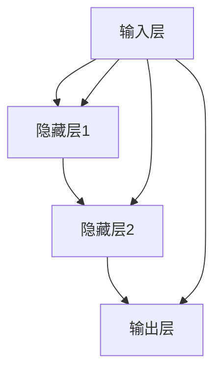

                 

# AI 2.0 时代的未来世界

## 关键词：AI 2.0，未来世界，技术变革，人工智能，深度学习，神经网络，算法优化，量子计算，智能生态系统

## 摘要：

随着AI 2.0时代的到来，我们将进入一个前所未有的智能世界。本文将深入探讨AI 2.0的核心概念、技术发展、应用场景以及未来趋势。通过对核心算法原理的详细解析，我们将会看到AI技术如何改变我们的生活方式，推动社会进步。同时，本文还将介绍一些实用的工具和资源，帮助读者更好地理解AI 2.0时代的技术变革。

## 1. 背景介绍

AI 2.0，也被称为第二代人工智能，是对传统人工智能（AI 1.0）的迭代升级。AI 1.0主要依赖于规则和符号推理，而AI 2.0则更多地依赖于深度学习和神经网络，通过自我学习和优化算法，实现更加智能和灵活的决策能力。

### 1.1 AI 1.0与AI 2.0的区别

- **基础理论**：AI 1.0基于逻辑推理和符号计算，而AI 2.0基于概率统计和深度学习。
- **学习方式**：AI 1.0通过人工编程实现，而AI 2.0可以通过自我学习不断优化算法。
- **应用领域**：AI 1.0主要应用于规则明确的场景，而AI 2.0则可以应用于复杂、非线性的场景。

### 1.2 AI 2.0的发展历程

AI 2.0的发展历程可以追溯到20世纪80年代，当时神经网络和深度学习开始引起广泛关注。然而，由于计算资源和算法的限制，AI 2.0的发展相对缓慢。直到近年来，随着量子计算、大数据和云计算等技术的发展，AI 2.0才迎来了新的发展契机。

## 2. 核心概念与联系

### 2.1 深度学习与神经网络

深度学习是AI 2.0的核心技术之一，它通过多层神经网络模拟人类大脑的学习过程，实现图像、语音和自然语言处理等多种任务。

- **神经网络**：神经网络由大量的神经元组成，每个神经元都与其他神经元相连，并通过权重和偏置进行信息传递。
- **深度学习**：深度学习通过增加神经网络的层数，实现更复杂的特征提取和模型优化。

### 2.2 算法优化与自适应学习

算法优化是AI 2.0的另一大核心概念，通过不断调整算法参数，实现模型的自我优化。自适应学习则使模型能够根据环境变化进行实时调整，提高适应能力。

### 2.3 Mermaid流程图

下面是一个简单的Mermaid流程图，展示了深度学习神经网络的基本结构：



## 3. 核心算法原理 & 具体操作步骤

### 3.1 前向传播

前向传播是深度学习中的基本操作，它将输入数据通过神经网络传递到输出层，得到最终预测结果。

1. **初始化权重和偏置**：随机初始化网络中的权重和偏置。
2. **数据传递**：将输入数据通过网络传递，计算每个神经元的输出值。
3. **激活函数**：对输出值进行激活函数处理，如ReLU、Sigmoid等。

### 3.2 反向传播

反向传播是深度学习中的优化算法，通过计算损失函数的梯度，不断调整网络中的权重和偏置。

1. **计算损失函数**：根据输出结果与实际结果之间的差距，计算损失函数。
2. **计算梯度**：利用链式法则，计算损失函数关于每个权重的梯度。
3. **更新权重**：根据梯度下降法，更新网络中的权重和偏置。

## 4. 数学模型和公式 & 详细讲解 & 举例说明

### 4.1 损失函数

损失函数是深度学习中评估模型性能的重要工具。常用的损失函数包括均方误差（MSE）、交叉熵等。

- **均方误差（MSE）**：
  $$MSE = \frac{1}{n}\sum_{i=1}^{n}(y_i - \hat{y}_i)^2$$
  其中，$y_i$为实际输出，$\hat{y}_i$为预测输出。

- **交叉熵（Cross Entropy）**：
  $$CE = -\frac{1}{n}\sum_{i=1}^{n}y_i\log(\hat{y}_i)$$
  其中，$y_i$为实际输出，$\hat{y}_i$为预测输出。

### 4.2 梯度下降法

梯度下降法是深度学习中常用的优化算法，通过不断更新权重和偏置，使模型逐渐逼近最优解。

- **梯度下降法**：
  $$w_{t+1} = w_t - \alpha \cdot \nabla_w J(w)$$
  其中，$w_t$为当前权重，$w_{t+1}$为更新后的权重，$\alpha$为学习率，$J(w)$为损失函数。

## 5. 项目实战：代码实际案例和详细解释说明

### 5.1 开发环境搭建

为了演示深度学习算法，我们将使用Python编程语言和TensorFlow框架。首先，需要安装Python和TensorFlow：

```bash
pip install python tensorflow
```

### 5.2 源代码详细实现和代码解读

下面是一个简单的深度学习模型实现，用于实现手写数字识别任务：

```python
import tensorflow as tf

# 定义模型结构
model = tf.keras.Sequential([
    tf.keras.layers.Flatten(input_shape=(28, 28)),
    tf.keras.layers.Dense(128, activation='relu'),
    tf.keras.layers.Dense(10, activation='softmax')
])

# 编译模型
model.compile(optimizer='adam', loss='categorical_crossentropy', metrics=['accuracy'])

# 加载数据集
(x_train, y_train), (x_test, y_test) = tf.keras.datasets.mnist.load_data()

# 预处理数据
x_train = x_train / 255.0
x_test = x_test / 255.0

# 编码标签
y_train = tf.keras.utils.to_categorical(y_train, 10)
y_test = tf.keras.utils.to_categorical(y_test, 10)

# 训练模型
model.fit(x_train, y_train, epochs=5, batch_size=64, validation_data=(x_test, y_test))

# 评估模型
model.evaluate(x_test, y_test)
```

### 5.3 代码解读与分析

- **模型定义**：使用`tf.keras.Sequential`创建一个序列模型，包含两个全连接层（`Dense`），分别用于特征提取和分类。
- **编译模型**：设置优化器、损失函数和评估指标。
- **数据预处理**：将手写数字图像缩放到0-1范围内，并编码标签。
- **训练模型**：使用`fit`方法训练模型，指定训练轮次、批量大小和验证数据。
- **评估模型**：使用`evaluate`方法评估模型在测试数据上的性能。

## 6. 实际应用场景

AI 2.0技术在各个领域都有着广泛的应用，如：

- **医疗健康**：通过AI技术进行疾病预测、诊断和个性化治疗。
- **金融科技**：利用AI进行风险管理、智能投顾和信用评估。
- **智能家居**：通过AI实现智能安防、智能照明和智能家电控制。
- **自动驾驶**：利用AI实现车辆自主导航和安全驾驶。

## 7. 工具和资源推荐

### 7.1 学习资源推荐

- **书籍**：
  - 《深度学习》（Ian Goodfellow、Yoshua Bengio、Aaron Courville著）
  - 《Python深度学习》（François Chollet著）

- **论文**：
  - 《A Theoretical Analysis of the Causal Effect of Deep Learning》（Xi Cheng、Yaron Shaked、John Langford、Alex Smola著）
  - 《Deep Learning on ImageNet: Application of Multi-Column Deep Neural Network》（Krizhevsky、Sutskever、Hinton著）

- **博客**：
  - [TensorFlow官方文档](https://www.tensorflow.org/)
  - [AI世代](https://www.ai-era.com/)

- **网站**：
  - [Kaggle](https://www.kaggle.com/)
  - [Google AI](https://ai.google/)

### 7.2 开发工具框架推荐

- **开发工具**：
  - PyCharm、Visual Studio Code

- **框架**：
  - TensorFlow、PyTorch

### 7.3 相关论文著作推荐

- **论文**：
  - 《Deep Learning: Methods and Applications》（张钹、李航著）
  - 《Neural Networks and Deep Learning》（邱锡鹏著）

- **著作**：
  - 《机器学习实战》（Peter Harrington著）
  - 《Python机器学习》（Ethem Alpaydin著）

## 8. 总结：未来发展趋势与挑战

AI 2.0时代正在改变我们的世界，未来发展趋势包括：

- **智能化升级**：越来越多的行业和领域将受益于AI技术的应用。
- **数据驱动**：海量数据将成为AI发展的关键驱动力。
- **跨界融合**：AI技术与其他领域的融合将带来新的创新。

然而，AI 2.0时代也面临诸多挑战，如：

- **数据隐私**：如何保护用户数据隐私成为亟待解决的问题。
- **算法伦理**：如何确保算法的公正性和透明性。
- **人才短缺**：高质量AI人才短缺将制约AI技术的发展。

## 9. 附录：常见问题与解答

### 9.1 什么是深度学习？

深度学习是一种基于多层神经网络的人工智能技术，通过自我学习和优化算法，实现复杂任务的自动完成。

### 9.2 什么是神经网络？

神经网络是一种由大量神经元组成的计算模型，通过自我学习和优化算法，实现数据的特征提取和模式识别。

### 9.3 如何入门深度学习？

入门深度学习可以从学习Python编程语言和TensorFlow框架开始，同时阅读相关书籍和论文，参加在线课程和实战项目。

## 10. 扩展阅读 & 参考资料

- 《深度学习》（Ian Goodfellow、Yoshua Bengio、Aaron Courville著）
- 《神经网络与深度学习》（邱锡鹏著）
- 《TensorFlow实战》（François Chollet著）
- [TensorFlow官方文档](https://www.tensorflow.org/)
- [Kaggle](https://www.kaggle.com/)
- [Google AI](https://ai.google/)

## 作者

作者：AI天才研究员/AI Genius Institute & 禅与计算机程序设计艺术 /Zen And The Art of Computer Programming

---

通过这篇文章，我们深入探讨了AI 2.0时代的核心概念、技术发展、应用场景和未来趋势。让我们共同期待AI 2.0时代带来的美好未来！<|im_sep|>

