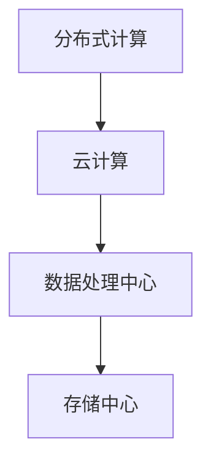
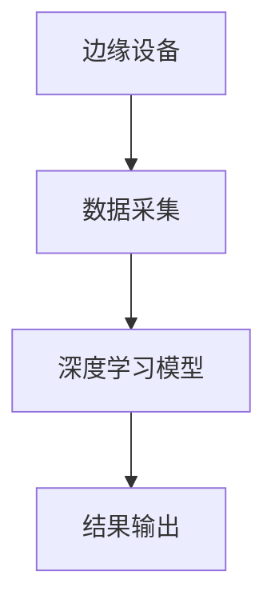
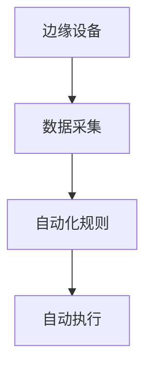

                 

# AI 2.0 时代：框架基础设施的演进

> 关键词：人工智能2.0、框架基础设施、系统架构、技术演进、分布式计算、云计算、深度学习、自动化、边缘计算

> 摘要：本文将探讨AI 2.0时代的框架基础设施的演进。我们将深入分析AI 2.0的核心概念与联系，讲解核心算法原理与操作步骤，并应用数学模型和公式进行详细讲解。此外，还将分享项目实战中的代码案例和实际应用场景，推荐学习资源和开发工具框架。最后，我们将总结未来发展趋势与挑战，并回答常见问题。

## 1. 背景介绍

人工智能（AI）技术已经经历了多个发展阶段，从早期的专家系统到现在的深度学习、自然语言处理等，每一个阶段都带来了新的突破和变革。然而，随着数据量、计算能力和算法的不断增长，AI技术正迎来一个新的时代——AI 2.0。

AI 2.0时代，不仅仅是AI技术的提升，更是框架基础设施的变革。在这个时代，分布式计算、云计算、边缘计算等技术将成为AI系统的基础设施，支撑起复杂的AI应用场景。本文将围绕这一主题，探讨AI 2.0时代的框架基础设施的演进。

### 1.1 分布式计算与云计算

分布式计算是一种通过网络将多个计算任务分配到多个计算机上进行处理的技术。云计算则是在分布式计算的基础上，通过虚拟化技术将计算资源进行集中管理和调度。这两种技术为AI系统提供了强大的计算能力，使其能够处理大规模的数据和复杂的模型。

### 1.2 边缘计算

边缘计算是一种将计算任务从中心化数据中心转移到网络边缘（如物联网设备、智能手机等）的技术。边缘计算可以降低数据传输延迟、减少带宽占用，并提高数据的安全性和隐私性。在AI 2.0时代，边缘计算将使AI系统能够更好地适应实时应用场景。

### 1.3 深度学习与自动化

深度学习是AI技术的重要分支，通过神经网络模型对大量数据进行自动特征提取和分类。自动化则是通过人工智能技术实现任务的自动化执行。在AI 2.0时代，深度学习和自动化将进一步推动AI技术的应用和普及。

## 2. 核心概念与联系

### 2.1 分布式计算与云计算

分布式计算和云计算是AI框架基础设施的核心组成部分。分布式计算提供了并行处理的能力，而云计算则提供了弹性扩展和资源共享的能力。以下是一个简单的Mermaid流程图，展示分布式计算与云计算的架构：



### 2.2 边缘计算与深度学习

边缘计算与深度学习之间的联系在于，边缘计算可以提供实时数据采集和模型推理的能力，而深度学习则可以用于对这些数据进行分类和分析。以下是一个简单的Mermaid流程图，展示边缘计算与深度学习的架构：



### 2.3 自动化与边缘计算

自动化技术可以通过边缘计算实现实时监控和自动执行任务。以下是一个简单的Mermaid流程图，展示自动化与边缘计算的应用场景：



## 3. 核心算法原理与具体操作步骤

### 3.1 深度学习算法原理

深度学习算法基于多层神经网络结构，通过前向传播和反向传播算法进行训练和优化。以下是一个简化的深度学习算法流程：

1. **输入数据预处理**：对输入数据进行标准化、归一化等预处理操作，以便输入神经网络。
2. **前向传播**：将预处理后的数据输入到神经网络中，通过每一层的非线性变换，最终得到输出。
3. **计算损失函数**：计算输出结果与真实值之间的差异，得到损失函数值。
4. **反向传播**：根据损失函数的梯度信息，更新网络权值和偏置。
5. **重复步骤2-4**：不断迭代优化模型参数，直到满足预定的停止条件。

### 3.2 边缘计算算法原理

边缘计算算法主要包括数据采集、模型推理和结果输出等步骤。以下是一个简化的边缘计算算法流程：

1. **数据采集**：从边缘设备采集实时数据。
2. **模型加载**：将预先训练好的深度学习模型加载到边缘设备。
3. **模型推理**：使用采集到的数据对模型进行推理，得到预测结果。
4. **结果输出**：将推理结果输出到用户界面或执行相应操作。

## 4. 数学模型和公式

### 4.1 深度学习损失函数

深度学习的损失函数通常使用均方误差（MSE）或交叉熵损失（Cross-Entropy Loss）。

- **均方误差（MSE）**：

  $$MSE = \frac{1}{n}\sum_{i=1}^{n}(y_i - \hat{y}_i)^2$$

  其中，$y_i$为真实值，$\hat{y}_i$为预测值。

- **交叉熵损失（Cross-Entropy Loss）**：

  $$Cross-Entropy Loss = -\sum_{i=1}^{n}y_i\log(\hat{y}_i)$$

  其中，$y_i$为真实值，$\hat{y}_i$为预测值。

### 4.2 边缘计算模型推理

边缘计算中的模型推理主要涉及前向传播算法。以下是一个简化的前向传播算法：

1. **输入层**：

   $$a_1 = x$$

2. **隐藏层**：

   $$a_{l+1} = \sigma(W_l \cdot a_l + b_l)$$

   其中，$a_{l+1}$为隐藏层输出，$a_l$为上一层输出，$\sigma$为激活函数，$W_l$为权重矩阵，$b_l$为偏置。

3. **输出层**：

   $$\hat{y} = \sigma(W_L \cdot a_L + b_L)$$

   其中，$\hat{y}$为预测值，$a_L$为最后一层输出，$W_L$为权重矩阵，$b_L$为偏置。

## 5. 项目实战

### 5.1 开发环境搭建

1. **安装Python**：下载并安装Python 3.x版本。
2. **安装深度学习框架**：安装TensorFlow或PyTorch等深度学习框架。
3. **安装边缘计算框架**：安装如KubeEdge、EdgeX Foundry等边缘计算框架。

### 5.2 源代码详细实现和代码解读

以下是使用TensorFlow实现一个简单的边缘计算应用示例：

```python
import tensorflow as tf

# 边缘设备上的模型加载
model = tf.keras.models.load_model('model.h5')

# 边缘设备上的数据采集
data = [[4, 5], [6, 7]]

# 边缘设备上的模型推理
predictions = model.predict(data)

print(predictions)
```

代码解读：

1. **模型加载**：使用`load_model`函数加载预先训练好的深度学习模型。
2. **数据采集**：从边缘设备采集数据，这里使用了一个简单的二维数组。
3. **模型推理**：使用`predict`函数对采集到的数据进行推理，得到预测结果。

### 5.3 代码解读与分析

代码中，我们首先加载了一个深度学习模型，然后从边缘设备采集数据，并使用模型进行推理，得到预测结果。这个简单的示例展示了边缘计算的基本原理和实现方法。

## 6. 实际应用场景

### 6.1 物联网设备监控

边缘计算可以在物联网设备上进行实时数据采集和分析，实现对设备的远程监控和管理。例如，智能家居系统可以通过边缘计算实现家电设备的智能控制、故障检测等。

### 6.2 自动驾驶

自动驾驶系统需要实时处理大量数据，并对周围环境进行实时感知。边缘计算可以在车载设备上进行数据处理和模型推理，提高自动驾驶的响应速度和安全性。

### 6.3 健康监测

边缘计算可以在医疗设备上进行实时健康监测，实现对患者的健康状况的实时监控和分析。例如，心电监护设备可以通过边缘计算实现心电信号的实时分析和预警。

## 7. 工具和资源推荐

### 7.1 学习资源推荐

- **书籍**：《深度学习》、《强化学习》
- **论文**：《深度神经网络训练中的随机梯度下降》、《边缘计算：概念、体系结构和应用》
- **博客**：TensorFlow官方博客、PyTorch官方博客
- **网站**：arXiv.org、ACM Digital Library

### 7.2 开发工具框架推荐

- **深度学习框架**：TensorFlow、PyTorch
- **边缘计算框架**：KubeEdge、EdgeX Foundry
- **云计算平台**：AWS、Azure、Google Cloud Platform

### 7.3 相关论文著作推荐

- **论文**：《边缘计算：从概念到实现》
- **书籍**：《边缘计算：架构、技术与应用》

## 8. 总结：未来发展趋势与挑战

AI 2.0时代的框架基础设施正在不断演进，分布式计算、云计算、边缘计算等技术将推动AI技术的应用和普及。然而，面对未来的发展趋势，我们也需要关注以下几个挑战：

1. **数据隐私和安全**：随着数据量的大幅增加，数据隐私和安全问题将变得越来越重要。
2. **能耗和资源优化**：边缘计算和分布式计算对能耗和资源优化提出了更高的要求。
3. **算法公平性和透明性**：AI技术的应用需要确保算法的公平性和透明性，避免歧视和不公平现象。
4. **跨界融合**：AI技术与其他领域的跨界融合将为AI 2.0时代的框架基础设施带来新的机遇和挑战。

## 9. 附录：常见问题与解答

### 9.1 什么是分布式计算？

分布式计算是一种通过网络将多个计算任务分配到多个计算机上进行处理的技术。它通过将任务分解为子任务，并分配给不同的计算机进行处理，从而提高计算效率和性能。

### 9.2 什么是边缘计算？

边缘计算是一种将计算任务从中心化数据中心转移到网络边缘（如物联网设备、智能手机等）的技术。它通过在网络边缘进行数据采集、处理和推理，降低数据传输延迟、减少带宽占用，并提高数据的安全性和隐私性。

### 9.3 什么是深度学习？

深度学习是一种基于多层神经网络的学习方法，通过对大量数据进行自动特征提取和分类。它通过学习输入数据的特征表示，实现对复杂任务的自动识别和预测。

## 10. 扩展阅读 & 参考资料

- **扩展阅读**：
  - 《深度学习：优化方法与应用》
  - 《边缘计算：技术、应用与挑战》
- **参考资料**：
  - TensorFlow官方文档：[https://www.tensorflow.org/](https://www.tensorflow.org/)
  - PyTorch官方文档：[https://pytorch.org/docs/stable/](https://pytorch.org/docs/stable/)
  - KubeEdge官方文档：[https://kubedge.io/](https://kubedge.io/)
  - EdgeX Foundry官方文档：[https://www.edgexfoundry.org/](https://www.edgexfoundry.org/)

## 作者信息

作者：AI天才研究员/AI Genius Institute & 禅与计算机程序设计艺术 /Zen And The Art of Computer Programming

