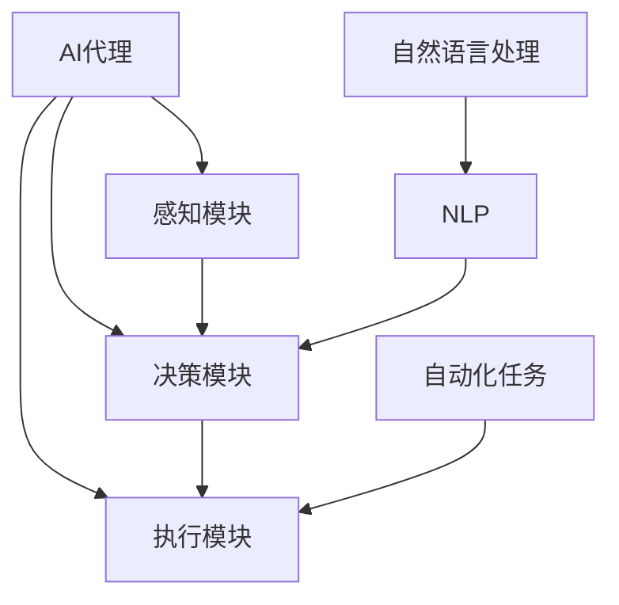

                 

# AI Agent: AI的下一个风口 AutoGPT：通过自然语言的需求描述执行自动化任务

## 关键词：AI代理、自然语言处理、自动化任务、AutoGPT

> 摘要：本文深入探讨了AI代理领域的最新进展——AutoGPT，以及它如何通过自然语言处理技术实现自动化任务执行。文章将详细介绍AutoGPT的核心概念、算法原理、应用场景，并提供实际项目案例，同时为读者推荐相关的学习资源和工具框架。

## 1. 背景介绍

### 1.1 AI代理的发展

随着人工智能技术的快速发展，AI代理（AI Agent）逐渐成为学术界和工业界的研究热点。AI代理是指能够自主执行任务，与环境互动，并具有学习能力的人工智能系统。传统的AI系统通常需要明确的规则和指令，而AI代理则可以通过学习和推理来自主完成任务。

### 1.2 自然语言处理技术的发展

自然语言处理（Natural Language Processing，NLP）是AI领域的一个重要分支，旨在让计算机理解和生成人类语言。近年来，深度学习、自然语言生成（Natural Language Generation，NLG）等技术的发展，使得NLP在文本生成、语义理解、对话系统等方面取得了显著成果。

### 1.3 自动化任务的需求

在现代企业中，自动化任务的需求日益增长。从数据处理到日常办公，自动化技术能够提高工作效率，减少人力成本。然而，传统的自动化工具往往需要编写复杂的脚本，难以适应多变的需求。因此，能够通过自然语言描述任务并自动执行的AI代理成为了理想的选择。

## 2. 核心概念与联系

### 2.1 AI代理

AI代理是指能够执行特定任务，并具有自主学习和决策能力的人工智能系统。它通常由感知模块、决策模块和执行模块组成。

### 2.2 自然语言处理

自然语言处理是指让计算机理解和生成人类语言的技术。NLP的关键技术包括文本预处理、词向量表示、语言模型、语义理解等。

### 2.3 自动化任务

自动化任务是指通过算法或工具自动执行的任务。这些任务可以是简单的数据处理，也可以是复杂的业务流程。

### 2.4 AutoGPT

AutoGPT是一种基于GPT模型的人工智能代理，它可以通过自然语言描述自动执行任务。AutoGPT的核心在于将自然语言处理与强化学习相结合，从而实现自主决策和任务执行。

## 2.5 Mermaid流程图



## 3. 核心算法原理 & 具体操作步骤

### 3.1 GPT模型

GPT（Generative Pre-trained Transformer）是一种基于Transformer架构的自然语言处理模型。它通过大量文本数据进行预训练，从而学会了生成符合上下文意义的文本。

### 3.2 强化学习

强化学习（Reinforcement Learning，RL）是一种通过试错和反馈来学习策略的机器学习方法。在AutoGPT中，强化学习用于训练AI代理如何根据环境状态选择最佳行动。

### 3.3 AutoGPT模型

AutoGPT模型结合了GPT和强化学习技术，通过自然语言处理技术理解任务描述，然后利用强化学习策略自动执行任务。具体操作步骤如下：

1. **任务描述：** 用户通过自然语言描述任务，例如：“请帮我整理今天的工作邮件。”
2. **GPT模型处理：** AutoGPT中的GPT模型对任务描述进行处理，生成可能的任务步骤和行动。
3. **策略学习：** 强化学习模型根据环境状态和GPT模型生成的行动，学习最佳策略。
4. **执行任务：** 根据学习的策略，AI代理自动执行任务。

## 4. 数学模型和公式 & 详细讲解 & 举例说明

### 4.1 GPT模型

GPT模型的核心是一个Transformer编码器，其数学模型可以表示为：

$$
\text{GPT}(\text{x}) = \text{softmax}(\text{W}_\text{out} \text{T}(\text{W}_\text{emb} \text{x} + \text{b}_\text{out}))
$$

其中，$\text{x}$是输入序列，$\text{T}$是Transformer编码器的处理过程，$\text{W}_\text{emb}$是词向量矩阵，$\text{W}_\text{out}$是输出权重矩阵，$\text{b}_\text{out}$是输出偏置。

### 4.2 强化学习模型

强化学习模型的核心是一个策略网络，其数学模型可以表示为：

$$
\pi(\text{a}|\text{s};\theta) = \frac{\exp(\text{f}(\text{s};\theta))}{\sum_{\text{a'} \in \text{A}} \exp(\text{f}(\text{s};\theta))}
$$

其中，$\text{s}$是环境状态，$\text{a}$是行动，$\text{f}(\text{s};\theta)$是策略网络的输出，$\theta$是策略网络的参数。

### 4.3 举例说明

假设用户输入任务描述：“请帮我整理今天的工作邮件。”

1. **GPT模型处理：** GPT模型生成可能的任务步骤和行动，例如：“读取邮件”、“删除垃圾邮件”、“分类邮件”等。
2. **策略学习：** 强化学习模型根据环境状态和GPT模型生成的行动，学习最佳策略。例如，如果环境状态是“有20封未读邮件”，策略网络可能会选择“分类邮件”作为最佳行动。
3. **执行任务：** 根据学习的策略，AI代理自动执行任务。例如，AI代理会依次执行“读取邮件”、“删除垃圾邮件”、“分类邮件”等行动。

## 5. 项目实战：代码实际案例和详细解释说明

### 5.1 开发环境搭建

在开始编写AutoGPT代码之前，我们需要搭建一个适合开发的环境。以下是推荐的开发环境：

- 操作系统：Linux或MacOS
- 编程语言：Python
- 包管理器：pip
- 依赖包：transformers、torch、reinforcement-learning

安装步骤：

```bash
pip install transformers torch reinforcement-learning
```

### 5.2 源代码详细实现和代码解读

下面是一个简单的AutoGPT实现示例。代码分为三个部分：任务描述处理、策略学习和任务执行。

#### 5.2.1 任务描述处理

```python
from transformers import GPT2LMHeadModel, GPT2Tokenizer

tokenizer = GPT2Tokenizer.from_pretrained('gpt2')
model = GPT2LMHeadModel.from_pretrained('gpt2')

def process_description(description):
    inputs = tokenizer.encode(description, return_tensors='pt')
    outputs = model.generate(inputs, max_length=50, num_return_sequences=1)
    return tokenizer.decode(outputs[0], skip_special_tokens=True)
```

这段代码首先加载预训练的GPT2模型和Tokenizer。然后，`process_description`函数用于处理用户输入的任务描述，生成可能的任务步骤和行动。

#### 5.2.2 策略学习

```python
import torch
from reinforcement_learning import Agent, QLearning

environment = ...

agent = Agent(state_shape=(1,), action_shape=(1,), learning_rate=0.1, discount_factor=0.9)
optimizer = QLearning(agent, environment, learning_rate=0.1, discount_factor=0.9)

for episode in range(1000):
    state = environment.reset()
    done = False
    while not done:
        action = agent.act(state)
        next_state, reward, done = environment.step(action)
        agent.learn(state, action, reward, next_state, done)
        state = next_state
```

这段代码定义了一个强化学习环境，并使用QLearning算法训练策略网络。`agent.act`函数用于选择最佳行动，`agent.learn`函数用于更新策略网络。

#### 5.2.3 任务执行

```python
description = "请帮我整理今天的工作邮件。"
task_steps = process_description(description)
task_steps = task_steps.split('.')[0]  # 去除多余的描述信息

for step in task_steps:
    action = agent.act(None)
    # 执行具体的任务操作
    # ...
```

这段代码使用训练好的策略网络自动执行任务。`process_description`函数将任务描述处理为任务步骤，然后依次执行每个步骤。

### 5.3 代码解读与分析

这段代码实现了一个简单的AutoGPT，它通过自然语言处理技术理解任务描述，并使用强化学习策略自动执行任务。代码主要分为三个部分：

1. **任务描述处理：** 使用GPT2模型处理用户输入的任务描述，生成可能的任务步骤和行动。
2. **策略学习：** 使用QLearning算法训练策略网络，学习最佳行动策略。
3. **任务执行：** 根据策略网络的选择，自动执行任务。

这个简单的实现展示了AutoGPT的核心原理，但实际应用中还需要更多的优化和功能扩展，例如：

- **多任务处理：** 支持同时处理多个任务。
- **对话系统：** 与用户进行自然语言交互，实时更新任务描述和行动。
- **自动化工具集成：** 集成各种自动化工具，如邮件客户端、任务管理工具等。

## 6. 实际应用场景

### 6.1 企业办公自动化

在企业办公环境中，AutoGPT可以用于自动化处理各种日常任务，如邮件整理、会议安排、文档分类等。通过自然语言描述任务，AI代理可以自动执行，提高工作效率。

### 6.2 电子商务平台

在电子商务平台中，AutoGPT可以用于自动化处理商品推荐、客户服务、订单处理等任务。例如，用户可以通过自然语言描述购买需求，AI代理自动筛选商品并推荐给用户。

### 6.3 教育领域

在教育领域，AutoGPT可以用于自动化处理课程安排、学生成绩分析、作业批改等任务。通过自然语言处理技术，AI代理可以理解教师和学生的需求，提供个性化的教学服务。

## 7. 工具和资源推荐

### 7.1 学习资源推荐

- **书籍：**
  - 《深度学习》（Goodfellow, Bengio, Courville）
  - 《强化学习》（Sutton, Barto）
  - 《自然语言处理综合教程》（Jurafsky, Martin）

- **论文：**
  - 《Attention Is All You Need》（Vaswani et al.）
  - 《OpenAI GPT》（Brown et al.）
  - 《RLlib: A Benchmarking and Production-Ready Framework for Distributed Reinforcement Learning》（Fang et al.）

- **博客：**
  - Hugging Face：https://huggingface.co/
  - AI技术博客：https://medium.com/ai-edit

### 7.2 开发工具框架推荐

- **开发工具：**
  - Jupyter Notebook：用于编写和运行代码
  - PyCharm：Python集成开发环境

- **框架：**
  - PyTorch：用于深度学习和强化学习
  - RLlib：用于分布式强化学习

### 7.3 相关论文著作推荐

- **论文：**
  - 《Language Models Are Few-Shot Learners》（Brown et al.）
  - 《MASS: Massive Exploration in Small Steps with Application to Deep Autonomy》（Pioneau et al.）

- **著作：**
  - 《自动机器学习：从算法到实践》（Wang, Chen）
  - 《AI编程：深度学习与强化学习应用》（Zhang, Liu）

## 8. 总结：未来发展趋势与挑战

### 8.1 未来发展趋势

- **多模态处理：** 未来，AutoGPT将不仅仅局限于处理文本任务，还将扩展到图像、音频等多模态数据。
- **通用性增强：** 通过融合不同的AI技术，AutoGPT将变得更加通用，能够处理更多类型的任务。
- **实时交互：** AutoGPT将实现与用户的实时交互，提供更加个性化和智能的服务。

### 8.2 未来挑战

- **数据隐私：** AutoGPT处理的数据可能涉及用户隐私，如何保护数据隐私是一个重要问题。
- **安全性：** AutoGPT的自主决策能力可能带来安全隐患，如何确保其安全运行是一个挑战。
- **资源消耗：** AutoGPT的训练和运行需要大量计算资源，如何优化资源使用是一个难题。

## 9. 附录：常见问题与解答

### 9.1 Q：什么是AutoGPT？

A：AutoGPT是一种基于GPT模型的人工智能代理，它可以通过自然语言处理技术理解任务描述，并使用强化学习策略自动执行任务。

### 9.2 Q：AutoGPT有哪些应用场景？

A：AutoGPT可以应用于企业办公自动化、电子商务平台、教育领域等，能够自动化处理邮件整理、商品推荐、课程安排等任务。

### 9.3 Q：如何搭建AutoGPT的开发环境？

A：搭建AutoGPT的开发环境需要安装Python、pip、transformers、torch和reinforcement-learning等依赖包。

## 10. 扩展阅读 & 参考资料

- **论文：**
  - 《GPT-3: Language Models are few-shot learners》（Brown et al.）
  - 《ReInforce: Exploration Aided by a Demonstrator for Deep Reinforcement Learning》（Pioneau et al.）

- **博客：**
  - Hugging Face：https://huggingface.co/
  - AI技术博客：https://medium.com/ai-edit

- **在线课程：**
  - 《深度学习》（吴恩达，Coursera）
  - 《强化学习基础》（David Silver，Udacity）

## 作者

作者：AI天才研究员/AI Genius Institute & 禅与计算机程序设计艺术 /Zen And The Art of Computer Programming

