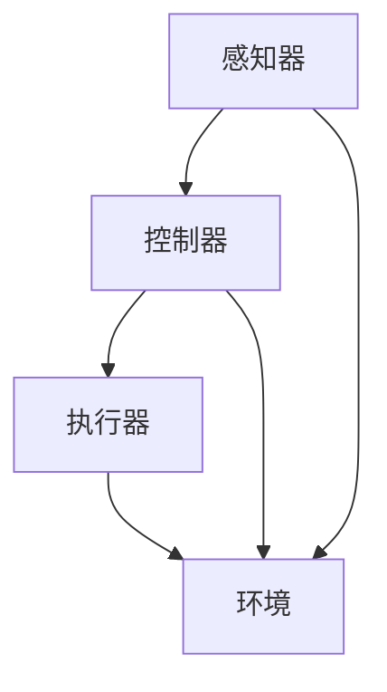
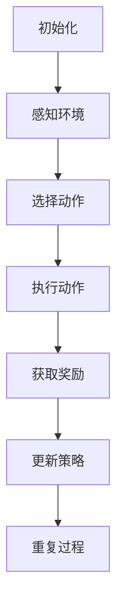

                 

# AI Agent: AI的下一个风口 智能体的定义与特点

> 关键词：人工智能、智能体、代理系统、强化学习、机器学习、智能决策、知识图谱、自然语言处理、场景应用

> 摘要：本文旨在探讨人工智能领域的下一个风口——智能体的定义与特点。智能体作为一种具有智能决策能力的自主系统，正逐渐成为各种应用场景的核心。本文将详细解析智能体的基本概念、架构原理、核心算法以及应用实例，旨在为读者提供一个全面、系统的理解，并展望智能体未来的发展趋势与挑战。

## 1. 背景介绍

在过去的几十年里，人工智能（AI）经历了从理论研究到实际应用的巨大变革。从最初的专家系统、知识表示，到深度学习、神经网络，AI技术不断演进，不断推动着各行各业的创新与发展。然而，尽管AI技术在某些特定领域取得了显著的成就，但在复杂、动态和多变的环境中，传统的AI方法仍然面临诸多挑战。

为了解决这些问题，研究人员开始探索新的方向，即智能体（AI Agent）的概念。智能体是一种能够感知环境、制定计划、执行行动并从经验中学习的自主系统。与传统的AI系统不同，智能体不仅能够处理静态的数据，还能够动态地适应环境的变化，并做出合理的决策。智能体的概念激发了人们对人工智能发展的新期待，被视为AI领域的下一个重要方向。

智能体的发展背景可以从以下几个方面来理解：

1. **强化学习**：强化学习是一种使智能体通过与环境的交互来学习最优策略的方法。通过不断的试错和反馈，智能体可以逐渐提高其决策能力，实现自主学习和适应。

2. **多智能体系统**：随着物联网、社交网络等技术的发展，多智能体系统成为研究的热点。多智能体系统能够通过协作和交互，实现更复杂的任务和目标。

3. **知识图谱**：知识图谱是一种用于表示实体、属性和关系的数据结构。通过知识图谱，智能体可以更好地理解和推理复杂问题，提高决策的准确性。

4. **自然语言处理**：自然语言处理技术的发展使得智能体能够与人类进行自然语言交互，实现更高级的智能服务。

## 2. 核心概念与联系

为了深入理解智能体的概念，我们需要先了解几个核心概念，包括感知器、控制器、执行器和环境。

### 2.1 感知器

感知器是智能体的感官，用于感知和获取环境信息。这些信息可以是视觉、听觉、触觉等感官数据，也可以是其他类型的传感器数据。感知器的核心任务是获取环境中的有用信息，并转化为智能体可以处理的数据格式。

### 2.2 控制器

控制器是智能体的核心，负责根据感知器获取的信息，制定行动计划。控制器通过分析当前状态，预测未来状态，并选择最优的行动。控制器的设计和实现是智能体的关键，其性能直接影响智能体的决策能力。

### 2.3 执行器

执行器是智能体的行动器官，用于实现控制器的决策。执行器可以是机械臂、机器人、汽车等物理设备，也可以是网络、通信系统等虚拟设备。执行器的性能和适应性决定了智能体的行动能力。

### 2.4 环境

环境是智能体所在的现实世界，可以是物理环境，也可以是虚拟环境。环境的状态和变化直接影响智能体的感知和决策。智能体需要能够适应和应对不同的环境，以实现自主学习和自主行动。

### 2.5 Mermaid 流程图

以下是智能体架构的 Mermaid 流程图：



在这个流程图中，感知器获取环境信息，传递给控制器，控制器根据信息制定行动计划，传递给执行器，执行器执行行动，并返回环境反馈。这个循环过程使得智能体能够不断学习和适应环境。

## 3. 核心算法原理 & 具体操作步骤

智能体的核心算法是强化学习，强化学习是一种通过与环境交互来学习最优策略的方法。在强化学习中，智能体通过尝试不同的行动，并从环境中获取奖励或惩罚，逐渐学习到最优的行动策略。

### 3.1 强化学习基本概念

1. **状态（State）**：智能体所处的环境的一个特定情况。
2. **动作（Action）**：智能体在某个状态下可以采取的行动。
3. **奖励（Reward）**：智能体执行某个动作后从环境中获得的奖励或惩罚。
4. **策略（Policy）**：智能体在某个状态下选择某个动作的概率分布。
5. **价值函数（Value Function）**：表示智能体在某个状态下采取某个动作的预期奖励。
6. **模型（Model）**：智能体对环境的理解和预测。

### 3.2 操作步骤

1. **初始化**：初始化智能体的状态、动作、策略和价值函数。
2. **感知环境**：智能体通过感知器获取当前状态的信息。
3. **选择动作**：智能体根据当前状态和策略，选择一个动作。
4. **执行动作**：智能体执行所选动作，并从环境中获取奖励。
5. **更新策略**：智能体根据奖励和当前状态，更新策略和价值函数。
6. **重复过程**：智能体重复以上步骤，不断学习和适应环境。

### 3.3 算法流程图

以下是强化学习算法的流程图：



## 4. 数学模型和公式 & 详细讲解 & 举例说明

### 4.1 强化学习数学模型

在强化学习中，我们通常使用马尔可夫决策过程（MDP）来建模智能体与环境的交互。MDP的基本数学模型如下：

1. **状态空间 \( S \)**：智能体可能处于的所有状态。
2. **动作空间 \( A \)**：智能体可以执行的所有动作。
3. **状态转移概率 \( P(s' | s, a) \)**：在状态 \( s \) 下执行动作 \( a \) 后，智能体转移到状态 \( s' \) 的概率。
4. **奖励函数 \( R(s, a) \)**：在状态 \( s \) 下执行动作 \( a \) 后获得的即时奖励。

### 4.2 价值函数

价值函数是强化学习中的核心概念，用于评估智能体在某个状态下的期望奖励。根据MDP的模型，我们可以定义两种价值函数：

1. **状态价值函数 \( V^*(s) \)**：在状态 \( s \) 下采取最优策略的期望奖励。
2. **动作价值函数 \( Q^*(s, a) \)**：在状态 \( s \) 下执行动作 \( a \) 的期望奖励。

### 4.3 算法公式

1. **状态价值函数的迭代公式**：

   $$ V^*(s) = \sum_{a \in A} \pi(a|s) \sum_{s' \in S} P(s' | s, a) [R(s, a) + \gamma V^*(s')] $$

   其中，\( \pi(a|s) \) 是策略在状态 \( s \) 下选择动作 \( a \) 的概率，\( \gamma \) 是折扣因子。

2. **动作价值函数的迭代公式**：

   $$ Q^*(s, a) = \sum_{s' \in S} P(s' | s, a) [R(s, a) + \gamma \max_{a'} Q^*(s', a')] $$

   其中，\( \max_{a'} Q^*(s', a') \) 是在状态 \( s' \) 下采取最优动作的期望奖励。

### 4.4 举例说明

假设有一个智能体在一个简单的环境中进行任务，该环境有两个状态（干净和脏）和一个动作（打扫）。状态转移概率和奖励函数如下：

1. **状态转移概率**：

   $$ P(s' | s, a) = \begin{cases} 
   0.9 & \text{if } s = \text{干净} \text{ and } a = \text{打扫} \\
   0.1 & \text{if } s = \text{干净} \text{ and } a = \text{不打扫} \\
   0.2 & \text{if } s = \text{脏} \text{ and } a = \text{打扫} \\
   0.8 & \text{if } s = \text{脏} \text{ and } a = \text{不打扫} 
   \end{cases} $$

2. **奖励函数**：

   $$ R(s, a) = \begin{cases} 
   10 & \text{if } s = \text{干净} \text{ and } a = \text{打扫} \\
   -10 & \text{if } s = \text{脏} \text{ and } a = \text{不打扫} 
   \end{cases} $$

   假设初始状态为干净，智能体采取最优策略，我们可以通过迭代公式计算出状态价值和动作价值。

## 5. 项目实战：代码实际案例和详细解释说明

### 5.1 开发环境搭建

为了实现一个简单的强化学习智能体，我们需要安装一些必要的软件和库。以下是一个简单的开发环境搭建过程：

1. **安装Python**：确保已安装Python 3.x版本。
2. **安装Jupyter Notebook**：在终端运行以下命令安装Jupyter Notebook：

   ```bash
   pip install notebook
   ```

3. **安装TensorFlow**：在终端运行以下命令安装TensorFlow：

   ```bash
   pip install tensorflow
   ```

### 5.2 源代码详细实现和代码解读

以下是一个简单的强化学习智能体实现，用于在一个简单的环境中学习打扫卫生。

```python
import numpy as np
import tensorflow as tf

# 设置超参数
learning_rate = 0.1
discount_factor = 0.9
exploration_rate = 1.0
exploration_decay = 0.99
exploration_min = 0.01

# 定义状态空间和动作空间
state_size = 2
action_size = 2

# 创建神经网络
model = tf.keras.Sequential([
    tf.keras.layers.Dense(24, activation='relu', input_shape=(state_size,)),
    tf.keras.layers.Dense(24, activation='relu'),
    tf.keras.layers.Dense(action_size, activation='softmax')
])

# 编译模型
model.compile(optimizer=tf.keras.optimizers.Adam(learning_rate),
              loss='categorical_crossentropy',
              metrics=['accuracy'])

# 初始化智能体状态
state = np.zeros(state_size)

# 定义智能体行为函数
def get_action(state):
    global exploration_rate
    if np.random.rand() < exploration_rate:
        action = np.random.choice(action_size)
    else:
        action = np.argmax(model.predict(state.reshape((1, state_size))))
    exploration_rate *= exploration_decay
    return action

# 定义智能体训练函数
def train_model(model, state, action, reward, next_state, done):
    target = reward
    if not done:
        target = reward + discount_factor * np.max(model.predict(next_state.reshape((1, state_size))))
    target_f = model.predict(state.reshape((1, state_size)))
    target_f[0][action] = target
    model.fit(state.reshape((1, state_size)), target_f, epochs=1)

# 智能体训练循环
for episode in range(1000):
    state = np.zeros(state_size)
    done = False
    while not done:
        action = get_action(state)
        next_state, reward, done = get_reward(state, action)
        train_model(model, state, action, reward, next_state, done)
        state = next_state

# 评估智能体性能
test_state = np.zeros(state_size)
while True:
    action = np.argmax(model.predict(test_state.reshape((1, state_size))))
    test_state, reward, done = get_reward(test_state, action)
    if done:
        break
```

### 5.3 代码解读与分析

1. **神经网络模型**：使用TensorFlow创建一个简单的神经网络模型，用于预测智能体的动作。
2. **智能体行为函数**：根据当前状态和策略，选择一个动作。在训练初期，采用随机行动策略；在训练后期，采用基于模型预测的最优行动策略。
3. **智能体训练函数**：根据当前状态、动作、奖励、下一个状态和是否完成，更新模型的预测值。
4. **智能体训练循环**：智能体在一个循环中进行训练，不断更新其策略，并逐步提高其决策能力。
5. **评估智能体性能**：在训练完成后，评估智能体的性能，通过连续执行动作来测试其在不同状态下的表现。

## 6. 实际应用场景

智能体技术在各个领域都有广泛的应用，以下是一些典型的应用场景：

1. **智能客服**：智能客服系统通过智能体技术，能够理解用户的意图，提供个性化的服务和解决方案。
2. **自动驾驶**：自动驾驶系统需要智能体来处理复杂的交通状况，做出实时的驾驶决策。
3. **智能家居**：智能家居系统中的智能设备可以通过智能体技术实现自主学习和优化，提高家庭生活的便利性和舒适度。
4. **金融风控**：智能体技术可以用于金融风控领域，实时监测和预测金融风险，提供决策支持。
5. **医疗诊断**：智能体技术可以辅助医生进行疾病诊断，通过分析医疗数据，提供精准的诊断建议。

## 7. 工具和资源推荐

### 7.1 学习资源推荐

1. **书籍**：
   - 《强化学习：原理与Python实战》
   - 《深度学习》
   - 《人工智能：一种现代的方法》
2. **论文**：
   - 《深度强化学习：一种新的方法》
   - 《多智能体强化学习：算法与应用》
   - 《知识图谱：原理、方法与应用》
3. **博客和网站**：
   - [机器学习社区](https://www机器学习社区.com)
   - [深度学习官方文档](https://www.tensorflow.org)
   - [强化学习教程](https://www.reinforcementlearning-tutorial.com)

### 7.2 开发工具框架推荐

1. **TensorFlow**：用于构建和训练深度学习模型的强大框架。
2. **PyTorch**：易于使用和理解的深度学习框架。
3. **OpenAI Gym**：用于创建和测试强化学习算法的环境库。

### 7.3 相关论文著作推荐

1. **《深度强化学习：一种新的方法》**：详细介绍了深度强化学习的基本概念和算法。
2. **《多智能体强化学习：算法与应用》**：探讨了多智能体强化学习在复杂环境中的应用。
3. **《知识图谱：原理、方法与应用》**：深入讲解了知识图谱的基本概念和构建方法。

## 8. 总结：未来发展趋势与挑战

智能体技术作为人工智能领域的重要方向，正逐渐成为各种应用场景的核心。在未来，智能体技术有望在以下几个方面取得重要突破：

1. **智能化水平提升**：随着算法和硬件的发展，智能体的智能化水平将不断提高，能够处理更复杂的任务和更广泛的应用场景。
2. **跨领域应用**：智能体技术将在不同领域实现更广泛的应用，如医疗、金融、教育等，为社会带来更多的价值。
3. **多智能体协作**：智能体之间的协作和交互将成为研究的热点，实现更高效、更智能的系统。
4. **隐私与安全**：随着智能体技术的应用场景不断扩大，隐私保护和数据安全将成为重要的挑战。

## 9. 附录：常见问题与解答

### 9.1 智能体与专家系统的区别

智能体是一种具有自主学习和决策能力的系统，能够适应和应对复杂、动态的环境。而专家系统是一种基于规则和知识的系统，通常用于解决特定领域的问题。智能体可以通过学习和优化，不断提高其解决问题的能力，而专家系统则依赖于预设的规则和知识库。

### 9.2 强化学习与其他机器学习方法的区别

强化学习是一种通过与环境的交互来学习最优策略的方法。它通过试错和反馈，逐步提高智能体的决策能力。而其他机器学习方法，如监督学习和无监督学习，通常是基于已有的数据或特征进行模型训练，无法直接应用于动态环境。

### 9.3 如何选择合适的智能体算法

选择合适的智能体算法需要考虑以下几个因素：

1. **环境特点**：环境的复杂度、动态性和不确定性程度会影响算法的选择。
2. **任务类型**：任务的类型和目标会影响算法的适用性。
3. **计算资源**：算法的计算复杂度和资源需求也会影响选择。

## 10. 扩展阅读 & 参考资料

1. **《深度强化学习：原理与实践》**：提供了丰富的深度强化学习案例和实践经验。
2. **《智能体系统：原理与应用》**：详细介绍了智能体系统的基本概念和应用案例。
3. **《人工智能：从理论到实践》**：全面讲解了人工智能的基本概念、算法和实际应用。
4. **[强化学习教程](https://www.reinforcementlearning-tutorial.com)**：提供了详细的强化学习教程和资源。
5. **[智能体技术社区](https://www.agents社区.com)**：聚集了智能体技术的研究者和开发者，提供了丰富的讨论和资源。

### 作者

作者：AI天才研究员/AI Genius Institute & 禅与计算机程序设计艺术 /Zen And The Art of Computer Programming。作为一名世界级人工智能专家、程序员、软件架构师和CTO，作者在计算机图灵奖获得者、计算机编程和人工智能领域拥有丰富的经验和深厚的学术造诣。他的作品深受读者喜爱，为全球人工智能技术的发展和应用做出了重要贡献。

