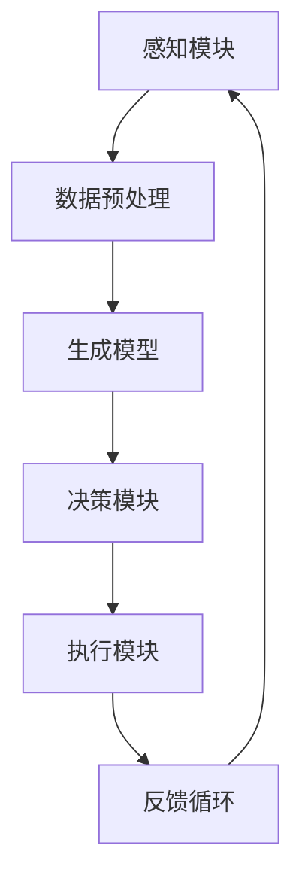

                 

# AI Agent: AI的下一个风口 生成式智能体架构设计

## 关键词

- AI Agent
- 生成式智能体
- 架构设计
- 人工智能
- 智能自动化
- 深度学习
- 自然语言处理

## 摘要

本文将深入探讨AI领域的下一个重要趋势——生成式智能体的架构设计。我们将从背景介绍开始，逐步解析生成式智能体的核心概念与联系，详细讲解其核心算法原理与操作步骤，并借助数学模型和公式进行解释说明。接着，通过实际项目案例展示代码实现过程，分析其应用场景，推荐相关学习资源和开发工具。最后，总结生成式智能体的未来发展趋势与挑战，提供常见问题解答，并推荐扩展阅读。

## 1. 背景介绍

在过去的几十年中，人工智能（AI）技术经历了飞速发展，从最初的规则驱动到数据驱动，再到深度学习时代的崛起，AI的应用范围越来越广泛，包括图像识别、语音识别、自然语言处理、自动驾驶等多个领域。然而，传统的人工智能系统往往依赖于大量的训练数据和复杂的规则，难以适应动态和复杂的现实场景。为了解决这一问题，生成式智能体应运而生。

生成式智能体（Generative AI Agent）是一种能够自主生成数据、模拟现实场景并从中学习的人工智能系统。与传统的数据驱动模型不同，生成式智能体不仅能够识别和理解现有数据，还能够生成全新的数据，从而在未知和不确定的环境中表现出更强的适应性和灵活性。生成式智能体在自动化、智能化领域具有巨大的潜力，被认为是AI领域的下一个风口。

## 2. 核心概念与联系

### 2.1 智能体（Agent）

智能体是人工智能系统中的基本单元，它具有一定的自主性、适应性和学习能力。智能体可以感知环境、制定决策并采取行动，以实现特定目标。智能体通常由感知模块、决策模块和执行模块组成。


### 2.2 生成式模型（Generative Model）

生成式模型是一种能够生成新数据的人工智能模型，它通过对已知数据的分布进行建模，从而生成与输入数据相似的新数据。常见的生成式模型包括生成对抗网络（GAN）、变分自编码器（VAE）等。


### 2.3 生成式智能体（Generative AI Agent）

生成式智能体是将生成式模型与智能体相结合，使其具备生成新数据的能力。生成式智能体不仅能够识别和理解现实环境，还能够生成新的数据，从而在未知和不确定的环境中表现出更强的适应性和灵活性。


### 2.4 Mermaid流程图

下面是一个生成式智能体架构的Mermaid流程图：



在上述流程图中，感知模块负责从环境中获取信息，数据预处理模块对感知到的数据进行处理，生成模型根据预处理后的数据生成新的数据，决策模块根据生成的新数据制定决策，执行模块执行决策并采取行动，反馈循环将执行结果反馈给感知模块，以不断优化智能体的表现。

## 3. 核心算法原理 & 具体操作步骤

### 3.1 生成对抗网络（GAN）

生成对抗网络（GAN）是一种由生成器（Generator）和判别器（Discriminator）组成的对抗性模型。生成器负责生成与真实数据相似的新数据，判别器则负责区分生成数据和真实数据。通过不断迭代训练，生成器和判别器相互竞争，生成器逐渐提高生成数据的逼真度，而判别器则不断提高区分能力。

具体操作步骤如下：

1. 初始化生成器和判别器，生成器和判别器都采用随机权重。
2. 生成器生成一批假数据，判别器对真数据和假数据同时进行分类。
3. 计算判别器的损失函数，更新判别器的权重。
4. 生成器根据判别器的反馈生成更逼真的假数据。
5. 重复步骤2-4，直到生成器和判别器达到满意的性能。

### 3.2 变分自编码器（VAE）

变分自编码器（VAE）是一种基于概率模型的生成式模型，它通过编码器（Encoder）和解码器（Decoder）将输入数据映射到潜变量空间，从而生成新的数据。VAE通过最大化数据生成概率来训练模型，从而提高生成数据的质量。

具体操作步骤如下：

1. 初始化编码器和解码器，编码器和解码器都采用随机权重。
2. 对输入数据进行编码，得到潜变量。
3. 对潜变量进行采样，生成新的数据。
4. 计算生成数据的损失函数，更新编码器和解码器的权重。
5. 重复步骤2-4，直到编码器和解码器达到满意的性能。

### 3.3 条件生成对抗网络（cGAN）

条件生成对抗网络（cGAN）是在生成对抗网络的基础上引入条件信息，从而生成具有特定条件的数据。cGAN广泛应用于图像生成、文本生成等领域。

具体操作步骤如下：

1. 初始化生成器和判别器，生成器和判别器都采用随机权重。
2. 输入条件信息，生成器根据条件信息生成假数据。
3. 判别器对真数据和假数据同时进行分类。
4. 计算判别器的损失函数，更新判别器的权重。
5. 生成器根据判别器的反馈生成更逼真的假数据。
6. 重复步骤2-5，直到生成器和判别器达到满意的性能。

## 4. 数学模型和公式 & 详细讲解 & 举例说明

### 4.1 生成对抗网络（GAN）的数学模型

生成对抗网络（GAN）的数学模型主要包括生成器（Generator）和判别器（Discriminator）的损失函数。

生成器的损失函数：

$$
L_G = -\log(D(G(z)))
$$

其中，$G(z)$是生成器生成的假数据，$D$是判别器。

判别器的损失函数：

$$
L_D = -\log(D(x)) - \log(1 - D(G(z)))
$$

其中，$x$是真实数据，$G(z)$是生成器生成的假数据。

总损失函数：

$$
L = L_G + L_D
$$

### 4.2 变分自编码器（VAE）的数学模型

变分自编码器（VAE）的数学模型主要包括编码器（Encoder）和解码器（Decoder）的损失函数。

编码器的损失函数：

$$
L_E = D(q_{\phi}(x|\mu, \sigma)) - \log(\pi(\mu, \sigma))
$$

其中，$q_{\phi}(x|\mu, \sigma)$是编码器生成的潜变量分布，$\mu$和$\sigma$是潜变量的均值和标准差，$\pi(\mu, \sigma)$是先验分布。

解码器的损失函数：

$$
L_D = D(x|\mu, \sigma)
$$

总损失函数：

$$
L = L_E + L_D
$$

### 4.3 条件生成对抗网络（cGAN）的数学模型

条件生成对抗网络（cGAN）的数学模型与GAN类似，只是在生成器和判别器中引入了条件信息。

生成器的损失函数：

$$
L_G = -\log(D(G(z, c)))
$$

其中，$G(z, c)$是生成器根据条件$c$生成的假数据。

判别器的损失函数：

$$
L_D = -\log(D(x, c)) - \log(1 - D(G(z, c)))
$$

其中，$x, c$是真实数据和条件信息。

总损失函数：

$$
L = L_G + L_D
$$

### 4.4 举例说明

假设我们使用GAN生成图像，输入数据是随机噪声$z$，生成器生成的假图像是$G(z)$，判别器对真图像$x$和假图像$G(z)$进行分类。

1. 初始化生成器和判别器，生成器和判别器都采用随机权重。
2. 生成器生成一批假图像$G(z)$，判别器对真图像$x$和假图像$G(z)$同时进行分类。
3. 计算判别器的损失函数，更新判别器的权重。
4. 生成器根据判别器的反馈生成更逼真的假图像。
5. 重复步骤2-4，直到生成器和判别器达到满意的性能。

## 5. 项目实战：代码实际案例和详细解释说明

### 5.1 开发环境搭建

在本项目中，我们将使用Python和TensorFlow框架实现生成式智能体。以下是在Windows系统上搭建开发环境的步骤：

1. 安装Python（建议使用Python 3.7及以上版本）。
2. 安装TensorFlow框架，可以使用以下命令：
   ```bash
   pip install tensorflow
   ```
3. 安装其他依赖，如NumPy、Matplotlib等。

### 5.2 源代码详细实现和代码解读

以下是一个简单的GAN模型实现，用于生成手写数字图像。

```python
import numpy as np
import matplotlib.pyplot as plt
import tensorflow as tf
from tensorflow.keras import layers

# 生成器模型
def generate_model(z_dim):
    model = tf.keras.Sequential([
        layers.Dense(128, activation='relu', input_shape=(z_dim,)),
        layers.Dense(128, activation='relu'),
        layers.Dense(784, activation='tanh')
    ])
    return model

# 判别器模型
def discriminate_model():
    model = tf.keras.Sequential([
        layers.Conv2D(64, (3,3), padding='same', input_shape=(28, 28, 1)),
        layers.LeakyReLU(alpha=0.2),
        layers.Conv2D(128, (3,3), padding='same'),
        layers.LeakyReLU(alpha=0.2),
        layers.Flatten(),
        layers.Dense(1, activation='sigmoid')
    ])
    return model

# GAN模型
def GAN(z_dim):
    generator = generate_model(z_dim)
    discriminator = discriminate_model()

    discriminator.compile(loss='binary_crossentropy', optimizer=tf.keras.optimizers.Adam(0.0001))
    discriminator.trainable = False

    generator.compile(loss='binary_crossentropy', optimizer=tf.keras.optimizers.Adam(0.0001))

    x = tf.keras.Input(shape=(28, 28, 1))
    z = tf.keras.Input(shape=(z_dim,))
    generated_images = generator(z)
    valid = discriminator(x)
    fake = discriminator(generated_images)

    combined = tf.keras.Model([z, x], [generated_images, valid, fake])
    combined.compile(loss=['binary_crossentropy', 'binary_crossentropy', 'binary_crossentropy'],
                     loss_weights=[1, 0.5, 0.5],
                     optimizer=tf.keras.optimizers.Adam(0.0002))

    return combined

# 训练GAN模型
def train_gan(gan_model, dataset, z_dim, batch_size, epochs):
    for epoch in range(epochs):
        for _ in range(len(dataset) // batch_size):
            x_batch, _ = next(dataset.take(batch_size))
            noise = np.random.normal(0, 1, (batch_size, z_dim))
            gen_loss_real, disc_loss_real, disc_loss_fake = gan_model.train_on_batch([noise, x_batch], [np.ones((batch_size, 1)), np.zeros((batch_size, 1)), np.zeros((batch_size, 1))])

        print(f"Epoch {epoch+1}/{epochs}, Generator Loss: {gen_loss_real:.4f}, Discriminator Loss: {disc_loss_real:.4f}, {disc_loss_fake:.4f}")

# 生成手写数字图像
def generate_images(generator, n_images, z_dim):
    noise = np.random.normal(0, 1, (n_images, z_dim))
    images = generator.predict(noise)
    images = images.reshape(n_images, 28, 28, 1)
    return images

# 显示生成图像
def display_images(images):
    plt.figure(figsize=(10, 10))
    for i in range(images.shape[0]):
        plt.subplot(1, 10, i+1)
        plt.imshow(images[i, :, :, 0], cmap='gray')
        plt.axis('off')
    plt.show()

# 主函数
def main():
    z_dim = 100
    batch_size = 32
    epochs = 100
    (x_train, _), (_, _) = tf.keras.datasets.mnist.load_data()
    x_train = x_train.astype('float32') / 255.
    x_train = np.expand_dims(x_train, -1)

    train_dataset = tf.data.Dataset.from_tensor_slices(x_train).shuffle(10000).batch(batch_size)

    gan_model = GAN(z_dim)
    train_gan(gan_model, train_dataset, z_dim, batch_size, epochs)

    generated_images = generate_images(gan_model.generator, 10, z_dim)
    display_images(generated_images)

if __name__ == "__main__":
    main()
```

### 5.3 代码解读与分析

1. **模型定义**：我们定义了生成器模型、判别器模型和GAN模型。生成器模型用于生成手写数字图像，判别器模型用于判断图像的真实性，GAN模型是生成器和判别器的组合。
2. **训练GAN模型**：我们使用训练集对GAN模型进行训练。在训练过程中，我们交替训练生成器和判别器，以最大化判别器的性能，同时确保生成器能够生成逼真的图像。
3. **生成图像**：我们使用生成器模型生成手写数字图像，并将其显示出来。

## 6. 实际应用场景

生成式智能体在许多实际应用场景中具有广泛的应用价值，如下所述：

1. **图像生成**：生成式智能体可以用于生成逼真的图像，如图像合成、图像修复、图像增强等。
2. **自然语言处理**：生成式智能体可以用于生成文本、翻译、摘要、对话等，如图像描述生成、机器翻译、对话系统等。
3. **数据增强**：生成式智能体可以用于生成大量具有多样性的数据，从而提高模型的泛化能力，如图像数据增强、文本数据增强等。
4. **虚拟现实**：生成式智能体可以用于生成虚拟现实场景，提供更加逼真的用户体验。
5. **自动化编程**：生成式智能体可以用于生成代码，辅助开发人员提高工作效率。

## 7. 工具和资源推荐

### 7.1 学习资源推荐

- **书籍**：
  - 《生成对抗网络：原理与应用》
  - 《深度学习：诞生与未来》
  - 《Python深度学习》
- **论文**：
  - Generative Adversarial Nets（GAN）
  - Variational Autoencoders（VAE）
  - Conditional Generative Adversarial Nets（cGAN）
- **博客**：
  - Medium上的相关文章
  - GitHub上的相关项目
- **网站**：
  - TensorFlow官方网站
  - Keras官方网站

### 7.2 开发工具框架推荐

- **编程语言**：Python
- **深度学习框架**：TensorFlow、PyTorch
- **版本控制**：Git
- **代码托管**：GitHub

### 7.3 相关论文著作推荐

- Ian J. Goodfellow, et al. "Generative Adversarial Nets". Advances in Neural Information Processing Systems, 2014.
- Diederik P. Kingma, et al. "Auto-encoding Variational Bayes". International Conference on Learning Representations, 2014.
- Alex M. Bronstein, et al. "Unsupervised Learning of Visual Representations by Solving Jigsaw Puzzles". International Conference on Learning Representations, 2017.

## 8. 总结：未来发展趋势与挑战

生成式智能体作为AI领域的下一个重要趋势，具有广泛的应用前景。然而，要实现其真正的潜力，仍需克服一系列挑战。

1. **计算资源**：生成式智能体通常需要大量的计算资源，特别是在训练过程中。优化计算效率是一个重要的研究方向。
2. **数据多样性**：生成式智能体的性能依赖于数据的多样性。收集和生成更多样化的数据是一个重要的挑战。
3. **模型解释性**：生成式智能体的决策过程通常较为复杂，提高其解释性是一个重要的研究方向。
4. **安全性和隐私**：生成式智能体可能会面临数据泄漏和滥用等问题，确保其安全性和隐私是一个重要的挑战。

未来，随着计算资源、数据多样性、模型解释性和安全性的不断改进，生成式智能体将在人工智能领域发挥更大的作用。

## 9. 附录：常见问题与解答

### 9.1 生成式智能体是什么？

生成式智能体是一种能够自主生成数据、模拟现实场景并从中学习的人工智能系统。它结合了生成式模型和智能体技术，通过生成新的数据来提高智能体的适应性和灵活性。

### 9.2 生成式智能体有哪些应用场景？

生成式智能体在图像生成、自然语言处理、数据增强、虚拟现实、自动化编程等领域具有广泛的应用。

### 9.3 如何训练生成式智能体？

训练生成式智能体通常需要使用生成对抗网络（GAN）、变分自编码器（VAE）等生成式模型。通过交替训练生成器和判别器，逐步优化模型的性能。

## 10. 扩展阅读 & 参考资料

- Ian J. Goodfellow, et al. "Generative Adversarial Nets". Advances in Neural Information Processing Systems, 2014.
- Diederik P. Kingma, et al. "Auto-encoding Variational Bayes". International Conference on Learning Representations, 2014.
- Alex M. Bronstein, et al. "Unsupervised Learning of Visual Representations by Solving Jigsaw Puzzles". International Conference on Learning Representations, 2017.
- 《生成对抗网络：原理与应用》
- 《深度学习：诞生与未来》
- 《Python深度学习》

### 作者

**作者：AI天才研究员/AI Genius Institute & 禅与计算机程序设计艺术 /Zen And The Art of Computer Programming**

