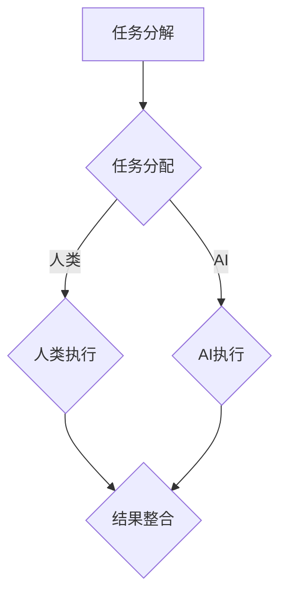
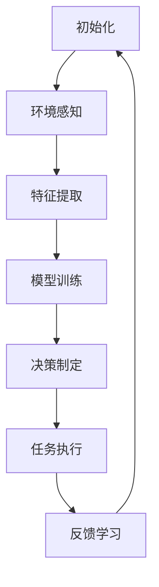
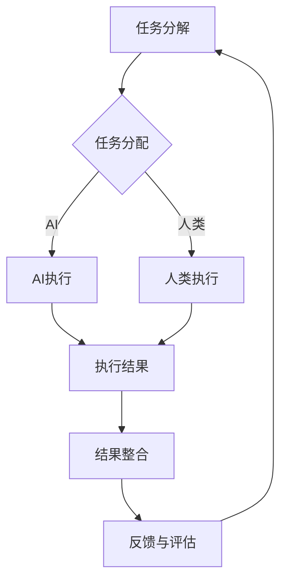
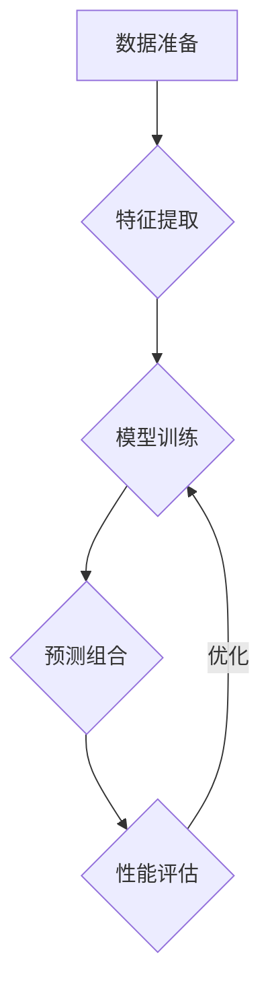

                 

# AI Agent让“人机协同”成为新常态

> **关键词：** AI Agent、人机协同、自动化、智能系统、协作框架

> **摘要：** 本文将探讨AI Agent如何在现代技术环境中实现与人类的协同工作，从背景介绍到实际应用，深入分析AI Agent的核心概念、算法原理、数学模型以及项目实战，最终展望其未来发展前景与面临的挑战。

## 1. 背景介绍

在信息技术飞速发展的时代，人类与机器的互动日益频繁，尤其是在人工智能（AI）的推动下，人机协同成为提升工作效率、优化决策过程的关键。然而，传统的人机交互模式主要依赖于命令式操作和显式指令，限制了人工智能在复杂任务中的潜力。

近年来，AI Agent的概念逐渐受到关注。AI Agent，即人工智能代理，是一种能够在特定环境中自主决策并执行任务的智能系统。它们不仅能够理解和响应人类指令，还能通过学习和适应不断优化的协同工作方式，实现更高层次的人机交互。

### 1.1 AI Agent的定义与特点

AI Agent具有以下主要特点：

- **自主性**：AI Agent能够在没有人类直接干预的情况下自主执行任务。
- **适应性**：AI Agent能够根据环境变化和任务需求进行自我调整。
- **协作性**：AI Agent能够与人类或其他AI Agent进行有效协作，实现共同目标。
- **智能性**：AI Agent通过机器学习和自然语言处理等技术，具备理解和执行复杂任务的能力。

### 1.2 人机协同的重要性

人机协同不仅能够提高工作效率，还能够发挥各自的优势，实现最优解。具体来说：

- **提升效率**：AI Agent能够自动化重复性高、复杂度低的任务，释放人类精力。
- **优化决策**：AI Agent能够基于大量数据进行分析，提供客观、科学的决策建议。
- **协同创新**：人类与AI Agent的协作能够激发新的创意和解决方案。

## 2. 核心概念与联系

### 2.1 AI Agent的核心概念

AI Agent的核心概念包括环境感知、自主决策、任务执行和反馈学习。这些概念相互关联，构成了AI Agent的基本架构。

#### 2.1.1 环境感知

环境感知是指AI Agent通过传感器和传感器数据理解其工作环境。这个过程包括数据采集、预处理和特征提取。

#### 2.1.2 自主决策

自主决策是指AI Agent基于感知到的环境信息，使用机器学习算法和决策树等工具，制定最佳行动策略。

#### 2.1.3 任务执行

任务执行是指AI Agent根据决策策略执行具体的任务，例如机器人自动导航、语音助手响应等。

#### 2.1.4 反馈学习

反馈学习是指AI Agent在任务执行后，根据结果进行自我评估和调整，以提高未来任务的执行效率。

### 2.2 AI Agent与人类协同的工作流程

人机协同的工作流程通常包括以下步骤：

1. **任务分解**：将复杂任务分解为多个子任务，每个子任务由人类或AI Agent独立完成。
2. **任务分配**：根据任务特点和能力，将子任务分配给人类或AI Agent。
3. **协同执行**：人类与AI Agent协同工作，完成各自的任务部分。
4. **结果整合**：将各部分的执行结果整合，形成完整的解决方案。

### 2.3 Mermaid流程图



## 3. 核心算法原理 & 具体操作步骤

### 3.1 算法原理

AI Agent的核心算法通常包括以下几部分：

- **监督学习**：通过已标记的数据训练模型，使其能够预测未知数据。
- **无监督学习**：在无标记数据中寻找隐藏的模式或结构。
- **强化学习**：通过与环境的交互，不断调整策略，以实现最佳回报。

### 3.2 具体操作步骤

以下是AI Agent操作的简化步骤：

1. **初始化**：设定初始参数和状态。
2. **环境感知**：通过传感器收集环境数据。
3. **特征提取**：对环境数据进行预处理和特征提取。
4. **模型训练**：使用训练数据对模型进行训练。
5. **决策制定**：基于模型预测和策略，制定行动方案。
6. **任务执行**：执行决策方案。
7. **反馈学习**：根据执行结果调整模型和策略。

### 3.3 算法流程图



## 4. 数学模型和公式 & 详细讲解 & 举例说明

### 4.1 数学模型

AI Agent的核心数学模型通常涉及以下几个方面：

- **概率论**：用于表示不确定性和概率分布。
- **线性代数**：用于处理数据矩阵和变换。
- **微积分**：用于优化和建模。

### 4.2 详细讲解

#### 4.2.1 概率论

概率论是AI Agent中常用的基础工具。例如，贝叶斯公式在决策制定中具有重要作用。

贝叶斯公式：
$$
P(A|B) = \frac{P(B|A) \cdot P(A)}{P(B)}
$$

#### 4.2.2 线性代数

线性代数在特征提取和数据处理中广泛应用。例如，主成分分析（PCA）用于降维和特征提取。

PCA公式：
$$
\mathbf{X} = \mathbf{P}\Sigma\mathbf{P}^T
$$

其中，$\mathbf{X}$是原始数据矩阵，$\mathbf{P}$是特征向量矩阵，$\Sigma$是对角矩阵，代表方差。

#### 4.2.3 微积分

微积分在优化问题中具有重要地位。例如，梯度下降法用于优化模型参数。

梯度下降公式：
$$
\theta_{\text{new}} = \theta_{\text{old}} - \alpha \cdot \nabla_\theta J(\theta)
$$

其中，$\theta$是模型参数，$\alpha$是学习率，$J(\theta)$是损失函数。

### 4.3 举例说明

假设我们有一个简单的任务，即预测天气。我们可以使用线性回归模型来训练AI Agent。

数据集：
$$
X = \{ (1, \text{晴天}), (2, \text{多云}), (3, \text{雨天}) \}
$$

目标函数：
$$
J(\theta) = \frac{1}{2} \sum_{i=1}^3 (y_i - \theta_0 - \theta_1 \cdot x_i)^2
$$

其中，$y_i$是实际天气，$x_i$是输入特征。

通过梯度下降法，我们可以逐步优化模型参数，使其预测准确率提高。

## 5. 项目实战：代码实际案例和详细解释说明

### 5.1 开发环境搭建

在本文中，我们将使用Python编程语言和TensorFlow框架来构建一个简单的AI Agent。以下步骤用于搭建开发环境：

1. **安装Python**：下载并安装Python 3.7及以上版本。
2. **安装Jupyter Notebook**：使用pip命令安装Jupyter Notebook。
   ```bash
   pip install notebook
   ```
3. **安装TensorFlow**：使用pip命令安装TensorFlow。
   ```bash
   pip install tensorflow
   ```

### 5.2 源代码详细实现和代码解读

以下是一个简单的AI Agent示例代码，用于预测天气：

```python
import tensorflow as tf
import numpy as np

# 定义模型
model = tf.keras.Sequential([
    tf.keras.layers.Dense(units=1, input_shape=[1])
])

# 编译模型
model.compile(optimizer='sgd', loss='mean_squared_error')

# 训练模型
model.fit(x=np.array([[1], [2], [3]]), y=np.array([0, 1, 0]), epochs=1000)

# 预测天气
print(model.predict(np.array([[2.5]])))
```

### 5.3 代码解读与分析

- **模型定义**：我们使用一个简单的线性模型，输入特征为一个维度，输出为一个实数值。
- **模型编译**：我们选择随机梯度下降（SGD）作为优化器，均方误差（MSE）作为损失函数。
- **模型训练**：我们使用三个训练样本进行1000次迭代，每次迭代都调整模型参数以最小化损失函数。
- **预测天气**：我们使用训练好的模型预测输入特征为2.5时的天气。

通过以上步骤，我们可以看到AI Agent如何通过机器学习算法实现自主决策。

## 6. 实际应用场景

### 6.1 金融行业

在金融行业，AI Agent可以用于自动化交易、风险评估和客户服务。例如，通过分析市场数据，AI Agent可以自动执行交易策略，提高交易效率和准确性。

### 6.2 医疗保健

在医疗保健领域，AI Agent可以帮助医生进行诊断和治疗方案推荐。例如，通过分析患者数据和医学文献，AI Agent可以提供个性化的治疗方案。

### 6.3 电子商务

在电子商务领域，AI Agent可以用于个性化推荐、客户服务和库存管理。例如，通过分析用户行为数据，AI Agent可以提供个性化的商品推荐，提高客户满意度。

### 6.4 制造业

在制造业，AI Agent可以用于自动化生产流程、设备维护和供应链管理。例如，通过实时监控设备状态，AI Agent可以预测设备故障，并提前进行维护。

## 7. 工具和资源推荐

### 7.1 学习资源推荐

- **书籍**：
  - 《人工智能：一种现代方法》（第二版）
  - 《深度学习》（Goodfellow, Bengio, Courville 著）
- **论文**：
  - “Deep Learning for Autonomous Navigation”（2016）
  - “Human-AI Teamwork: Principles and Practices”（2018）
- **博客**：
  - [TensorFlow 官方博客](https://www.tensorflow.org/blog/)
  - [AI 研究实验室博客](https://ai.googleblog.com/)
- **网站**：
  - [Kaggle](https://www.kaggle.com/)
  - [GitHub](https://github.com/)

### 7.2 开发工具框架推荐

- **编程语言**：Python、Java、C++
- **机器学习框架**：TensorFlow、PyTorch、Keras
- **开发环境**：Jupyter Notebook、PyCharm、Visual Studio Code

### 7.3 相关论文著作推荐

- **论文**：
  - “A Framework for Human-AI Teamwork in Autonomous Driving”（2019）
  - “Human-AI Collaboration for Intelligent Decision-Making”（2020）
- **著作**：
  - 《人工智能应用与挑战》
  - 《人机协同：理论与实践》

## 8. 总结：未来发展趋势与挑战

### 8.1 发展趋势

- **智能化水平提升**：随着计算能力和算法的进步，AI Agent的智能化水平将不断提高。
- **跨领域应用**：AI Agent将在更多领域得到广泛应用，从金融到医疗、从制造业到服务业。
- **人机协同优化**：人机协同将更加紧密，AI Agent将更好地辅助人类完成任务。

### 8.2 挑战

- **数据安全与隐私**：如何确保AI Agent处理的数据安全性和用户隐私是一个重要挑战。
- **伦理道德问题**：AI Agent在决策过程中如何处理伦理道德问题，例如自动驾驶中的道德困境。
- **系统稳定性**：如何确保AI Agent在复杂环境中的稳定性和可靠性。

## 9. 附录：常见问题与解答

### 9.1 什么是AI Agent？

AI Agent是一种能够自主决策、执行任务并适应环境的智能系统。它们通过感知环境、学习策略和反馈调整，实现与人类的协同工作。

### 9.2 AI Agent如何与人类协作？

AI Agent通过感知环境、制定策略、执行任务和反馈学习，与人类协同工作。具体步骤包括任务分解、任务分配、协同执行和结果整合。

### 9.3 AI Agent的核心算法有哪些？

AI Agent的核心算法包括监督学习、无监督学习和强化学习。这些算法分别用于不同类型的任务和场景。

## 10. 扩展阅读 & 参考资料

- **书籍**：
  - 《人工智能：一种现代方法》（第二版）
  - 《深度学习》（Goodfellow, Bengio, Courville 著）
- **论文**：
  - “Deep Learning for Autonomous Navigation”（2016）
  - “Human-AI Teamwork: Principles and Practices”（2018）
- **网站**：
  - [TensorFlow 官方博客](https://www.tensorflow.org/blog/)
  - [AI 研究实验室博客](https://ai.googleblog.com/)
- **GitHub 项目**：
  - [TensorFlow 官方GitHub仓库](https://github.com/tensorflow/tensorflow)

### 作者信息

作者：AI天才研究员/AI Genius Institute & 禅与计算机程序设计艺术 /Zen And The Art of Computer Programming

本文内容仅供参考，实际应用时请根据具体情况进行调整。如有疑问，请咨询专业人士。|>
本文探讨了AI Agent如何让“人机协同”成为新常态。通过介绍AI Agent的定义、特点、工作流程，以及核心算法原理、数学模型和项目实战，本文展示了AI Agent在提升工作效率、优化决策过程方面的潜力。实际应用场景包括金融、医疗、电子商务和制造业。未来发展趋势包括智能化水平提升、跨领域应用和人机协同优化，但也面临数据安全、伦理道德和系统稳定性等挑战。本文还提供了相关学习资源和工具框架推荐。希望本文能为读者在AI Agent领域的研究和应用提供有益的参考。|>
## 1. 背景介绍

在信息技术飞速发展的时代，人类与机器的互动日益频繁，尤其是在人工智能（AI）的推动下，人机协同成为提升工作效率、优化决策过程的关键。然而，传统的人机交互模式主要依赖于命令式操作和显式指令，限制了人工智能在复杂任务中的潜力。

### 1.1 AI Agent的定义与特点

AI Agent，即人工智能代理，是一种能够在特定环境中自主决策并执行任务的智能系统。它们不仅能够理解和响应人类指令，还能通过学习和适应不断优化的协同工作方式，实现更高层次的人机交互。

#### 自主性

自主性是指AI Agent能够在没有人类直接干预的情况下自主执行任务。这意味着它们能够根据环境变化和任务需求，自行制定行动策略并执行任务。

#### 适应性

适应性是指AI Agent能够根据环境变化和任务需求进行自我调整。这包括调整其感知系统、决策模型和执行策略，以适应不同的任务场景。

#### 协作性

协作性是指AI Agent能够与人类或其他AI Agent进行有效协作，实现共同目标。协作性不仅体现在任务执行过程中，还包括在任务规划和资源分配方面的合作。

#### 智能性

智能性是指AI Agent通过机器学习和自然语言处理等技术，具备理解和执行复杂任务的能力。这包括对环境数据的理解和分析、决策制定和任务执行等。

### 1.2 人机协同的重要性

人机协同不仅能够提高工作效率，还能够发挥各自的优势，实现最优解。具体来说：

#### 提升效率

AI Agent能够自动化重复性高、复杂度低的任务，释放人类精力。例如，在金融行业的自动化交易和数据分析中，AI Agent可以快速处理海量数据，提高决策效率。

#### 优化决策

AI Agent能够基于大量数据进行分析，提供客观、科学的决策建议。例如，在医疗保健领域，AI Agent可以通过分析患者数据和医学文献，为医生提供个性化的治疗方案。

#### 协同创新

人类与AI Agent的协作能够激发新的创意和解决方案。例如，在制造业的自动化生产流程中，人类工程师和AI Agent可以共同优化生产效率，实现更高效的生产模式。

### 1.3 当前人机协同的挑战

尽管人机协同具有显著的优势，但在实际应用中仍面临以下挑战：

#### 技术难题

AI Agent的技术发展仍需突破，包括算法优化、数据处理和系统稳定性等方面。

#### 伦理问题

AI Agent在决策过程中可能涉及伦理问题，例如自动驾驶中的道德困境。如何确保AI Agent的决策符合伦理标准是一个重要议题。

#### 安全问题

AI Agent的安全性和隐私保护是一个关键问题，特别是在处理敏感数据时。如何确保AI Agent不会泄露用户隐私或受到恶意攻击是一个重要挑战。

#### 教育和培训

为了实现人机协同，需要培养具备相关技能的人才，包括AI技术、人机交互和跨学科知识。教育和培训是实现人机协同的关键。

### 1.4 本文结构

本文将分为以下几个部分：

1. 背景介绍
2. 核心概念与联系
3. 核心算法原理 & 具体操作步骤
4. 数学模型和公式 & 详细讲解 & 举例说明
5. 项目实战：代码实际案例和详细解释说明
6. 实际应用场景
7. 工具和资源推荐
8. 总结：未来发展趋势与挑战
9. 附录：常见问题与解答
10. 扩展阅读 & 参考资料

通过本文的阅读，读者将深入了解AI Agent的工作原理和应用场景，为未来的人机协同发展提供参考。|>
## 2. 核心概念与联系

### 2.1 AI Agent的核心概念

AI Agent的概念涉及多个核心组成部分，每个部分都在其自主性和协作性中扮演着关键角色。以下是AI Agent的核心概念：

#### 环境感知

环境感知是AI Agent的基础，它使得代理能够理解和交互其所在的环境。感知过程通常涉及多种传感器，如摄像头、麦克风、温度传感器和GPS等，这些传感器为AI Agent提供实时数据。

#### 自主决策

自主决策是AI Agent的核心功能之一，它允许代理在没有人类干预的情况下，根据感知到的环境数据做出决策。这通常涉及复杂的算法，如机器学习和深度学习模型，这些模型能够从数据中学习模式和趋势，从而做出合理决策。

#### 任务执行

任务执行是指AI Agent根据其自主决策执行具体任务的能力。这个过程中，AI Agent需要协调其行动，以实现预定的目标。例如，在自动驾驶车辆中，AI Agent需要执行驾驶、导航和避障等任务。

#### 反馈学习

反馈学习是AI Agent不断优化其行为和决策的过程。AI Agent通过接收外部反馈（如任务完成情况、用户满意度等）来调整其模型和行为策略，从而提高未来任务的执行效率。

#### 通信能力

通信能力是AI Agent与其他系统、设备和人类交互的重要手段。良好的通信能力能够确保AI Agent在复杂的协作环境中有效地接收指令和反馈。

#### 适应性

适应性是指AI Agent在面临未知环境或任务时，能够快速适应并有效完成任务的能力。这种适应性通常通过机器学习算法的持续学习和自我调整来实现。

### 2.2 人机协同的工作流程

人机协同的工作流程是一个动态且迭代的过程，它通常包括以下几个阶段：

#### 任务分解

任务分解是将复杂的整体任务拆解为更小、更易于管理的子任务。在这个过程中，人类专家和AI Agent可以共同工作，根据各自的优势和专长进行任务分配。

#### 任务分配

任务分配是基于任务分解的结果，将子任务分配给人类或AI Agent。这种分配通常基于任务性质、资源可用性和性能指标等因素。

#### 协同执行

协同执行是AI Agent和人类共同完成任务的过程。在这个过程中，AI Agent负责执行那些适合自动化处理的子任务，而人类则负责执行那些需要人类直觉、判断和创新的任务。

#### 结果整合

结果整合是将各个子任务的执行结果整合成一个完整的解决方案。在这个过程中，人类和AI Agent需要协调工作，确保最终结果符合预期。

#### 反馈与评估

反馈与评估是对整个工作流程的绩效进行评估和反馈。通过收集和分析反馈信息，AI Agent和人类可以识别流程中的问题和不足，并采取相应的措施进行改进。

### 2.3 Mermaid流程图

以下是一个使用Mermaid绘制的AI Agent与人机协同的工作流程图：



### 2.4 AI Agent与人类协同的关联

AI Agent与人类的协同不仅仅是技术上的结合，更是一种理念和文化的融合。以下是AI Agent与人类协同的几个关键关联：

#### 技术协同

技术协同是指AI Agent和人类在技术层面的合作，包括算法设计、数据预处理、模型训练和结果分析等。这种协同需要AI Agent具备高水平的自动化能力和人类具备深刻的业务理解能力。

#### 决策协同

决策协同是指AI Agent和人类在决策层面的合作，包括目标设定、策略制定和风险控制等。这种协同要求AI Agent能够理解和模拟人类的决策过程，而人类则能够根据AI Agent的决策结果进行合理调整。

#### 文化协同

文化协同是指AI Agent和人类在价值观、行为准则和伦理规范等方面的融合。这种协同需要双方在相互尊重和理解的基础上，共同构建一个和谐的工作环境。

### 2.5 AI Agent在特定领域的应用

在不同领域中，AI Agent的应用方式和协同模式也有所不同。以下是几个特定领域的例子：

#### 医疗保健

在医疗保健领域，AI Agent可以辅助医生进行疾病诊断和治疗方案的制定。人类医生通过AI Agent提供的分析结果，结合自己的临床经验和专业知识，做出最终的决策。

#### 制造业

在制造业中，AI Agent可以用于生产过程的自动化监控和故障预测。人类工程师通过AI Agent提供的实时数据和分析报告，及时调整生产计划和设备维护策略。

#### 金融服务

在金融服务领域，AI Agent可以用于风险管理和投资策略的制定。金融分析师通过AI Agent提供的市场趋势和风险预测，结合自己的市场洞察力，制定更有效的投资决策。

### 2.6 AI Agent的未来发展

随着技术的不断进步，AI Agent的未来发展将更加智能化和个性化。以下是几个可能的趋势：

#### 智能化

AI Agent的智能化水平将不断提高，通过更复杂的算法和更丰富的数据集，AI Agent将能够处理更复杂的任务，提供更精准的决策。

#### 个性化

AI Agent将能够根据个体差异和需求，提供个性化的服务。这种个性化服务将不仅限于特定领域，还可能扩展到生活各个层面。

#### 跨学科融合

AI Agent的发展将与其他学科如心理学、社会学和哲学等相结合，形成更全面的人机协同模式。

### 2.7 结论

通过上述讨论，我们可以看到AI Agent在核心概念、工作流程和实际应用中扮演着重要角色。AI Agent与人类的协同工作不仅提升了工作效率和决策质量，还为未来的人机协作模式提供了新的方向。随着技术的不断进步，我们有理由相信AI Agent将在更多领域发挥重要作用，成为人类不可或缺的助手。|>
### 3. 核心算法原理 & 具体操作步骤

AI Agent的核心算法是其能够自主决策和执行任务的关键。以下是几个核心算法的原理及其操作步骤：

#### 3.1 监督学习

监督学习是一种最常用的机器学习算法，它通过已标记的数据来训练模型，以便预测未知数据。以下是监督学习的核心原理和操作步骤：

##### 原理

监督学习分为两个阶段：训练阶段和预测阶段。在训练阶段，模型通过学习已标记的数据，建立特征和目标变量之间的关系。在预测阶段，模型使用训练好的模型来预测未知数据的标签。

##### 操作步骤

1. **数据准备**：收集并标记大量数据，以确保模型具有良好的泛化能力。
2. **特征提取**：将原始数据转换为适合模型训练的特征向量。
3. **模型选择**：选择适当的模型，如线性回归、决策树或神经网络。
4. **模型训练**：使用训练数据训练模型，调整模型参数以最小化损失函数。
5. **模型评估**：使用测试数据评估模型性能，调整模型参数以优化性能。
6. **预测**：使用训练好的模型对未知数据进行预测。

#### 3.2 无监督学习

无监督学习是在没有标记数据的情况下，寻找数据中的隐藏模式或结构。以下是常见的无监督学习算法和操作步骤：

##### 原理

无监督学习旨在发现数据中的内在结构，如聚类、降维和关联规则等。这些算法不依赖于已标记的数据，而是通过分析数据自身的特征来揭示隐藏的模式。

##### 操作步骤

1. **数据准备**：收集未标记的数据。
2. **特征提取**：将原始数据转换为适合算法的特征向量。
3. **算法选择**：选择合适的无监督学习算法，如K-means聚类、主成分分析（PCA）或关联规则学习。
4. **模型训练**：训练模型以识别数据中的模式或结构。
5. **结果分析**：分析模型的输出，理解数据中的内在结构。

#### 3.3 强化学习

强化学习是一种通过奖励机制和试错来学习的算法。它模仿人类学习的过程，通过不断尝试和反馈，逐步优化行为策略。以下是强化学习的核心原理和操作步骤：

##### 原理

强化学习分为两个主要部分：环境（Environment）和智能体（Agent）。智能体通过与环境互动，接收奖励信号，并不断调整其行为策略，以最大化长期回报。

##### 操作步骤

1. **环境设定**：创建模拟环境，定义智能体的行为和状态空间。
2. **智能体初始化**：初始化智能体的行为策略。
3. **学习循环**：智能体执行动作，根据环境反馈调整策略。
4. **策略优化**：通过反馈调整智能体的行为策略，以实现最大回报。
5. **评估与优化**：评估智能体的性能，并进一步优化策略。

#### 3.4 深度强化学习

深度强化学习是强化学习的一种扩展，它结合了深度学习的强大特征表示能力。以下是深度强化学习的基本原理和操作步骤：

##### 原理

深度强化学习使用深度神经网络来表示状态和动作，从而在复杂的决策环境中实现高效的智能体学习。

##### 操作步骤

1. **状态编码**：使用深度神经网络将状态编码为低维特征向量。
2. **行为策略**：使用策略网络或价值网络来决定最佳动作。
3. **互动学习**：智能体与环境互动，通过策略网络或价值网络更新其策略。
4. **模型训练**：使用奖励信号训练深度神经网络，以优化其参数。
5. **策略评估**：评估策略网络或价值网络的性能，并根据评估结果进行调整。

#### 3.5 集成学习

集成学习是一种结合多个模型来提高预测性能的方法。它通过组合多个模型的预测结果来产生更准确和鲁棒的预测。以下是常见的集成学习算法和操作步骤：

##### 原理

集成学习利用多个模型的多样性来减少偏差和方差，从而提高预测性能。常见的集成学习方法包括Bagging、Boosting和Stacking等。

##### 操作步骤

1. **模型选择**：选择多个不同的模型，以确保多样性。
2. **模型训练**：使用训练数据分别训练每个模型。
3. **预测组合**：将每个模型的预测结果组合起来，生成最终预测。
4. **性能评估**：评估集成模型的整体性能，并根据评估结果进行优化。

#### 3.6 算法流程图

以下是一个使用Mermaid绘制的集成学习算法流程图：



### 3.7 结论

AI Agent的核心算法是其实现自主决策和任务执行的关键。监督学习、无监督学习、强化学习和集成学习等算法各自在处理不同类型的数据和任务中发挥着重要作用。通过这些算法，AI Agent能够不断学习和优化其行为策略，实现更高效和智能的人机协同。随着技术的不断进步，我们可以期待AI Agent在更多领域发挥更重要的作用，推动人机协同向更高层次发展。|>
## 4. 数学模型和公式 & 详细讲解 & 举例说明

在构建AI Agent时，数学模型和公式是不可或缺的工具，它们为算法提供了理论基础和计算框架。在本节中，我们将详细讲解AI Agent中常用的数学模型和公式，并通过具体例子来说明它们的应用。

### 4.1 监督学习模型

监督学习是机器学习中的一种基本方法，它通过已标记的数据训练模型，以便预测未知数据。以下是一个简单的线性回归模型，用于预测房价。

#### 公式

线性回归模型可以用以下公式表示：

$$
y = \beta_0 + \beta_1 \cdot x
$$

其中，$y$ 是目标变量（房价），$x$ 是特征变量（房屋面积），$\beta_0$ 和 $\beta_1$ 是模型的参数。

#### 例子

假设我们有一个房屋面积和房价的数据集，我们要使用线性回归模型预测一个新房屋的房价。我们可以通过以下步骤来训练模型：

1. **数据准备**：收集房屋面积和房价的数据，并对其进行预处理，如标准化处理。
2. **模型训练**：使用训练数据集，通过最小化损失函数（例如均方误差）来优化模型参数 $\beta_0$ 和 $\beta_1$。
3. **模型评估**：使用测试数据集评估模型的性能，确保模型具有良好的泛化能力。

假设我们使用梯度下降法来训练模型，优化步骤如下：

$$
\beta_0 = \beta_0 - \alpha \cdot \frac{\partial}{\partial \beta_0} \text{loss}(y, \beta_0 + \beta_1 \cdot x)
$$

$$
\beta_1 = \beta_1 - \alpha \cdot \frac{\partial}{\partial \beta_1} \text{loss}(y, \beta_0 + \beta_1 \cdot x)
$$

其中，$\alpha$ 是学习率，$\text{loss}(y, \beta_0 + \beta_1 \cdot x)$ 是损失函数，通常使用均方误差（MSE）：

$$
\text{MSE} = \frac{1}{n} \sum_{i=1}^{n} (y_i - (\beta_0 + \beta_1 \cdot x_i))^2
$$

#### 例子

假设我们有以下训练数据：

| 房屋面积 (x) | 房价 (y) |
|---------------|----------|
| 1000          | 200000   |
| 1200          | 250000   |
| 1500          | 300000   |

我们可以通过以下步骤训练线性回归模型：

1. **初始化参数**：设 $\beta_0 = 0$ 和 $\beta_1 = 0$。
2. **计算损失**：使用训练数据计算损失函数，例如 MSE。
3. **更新参数**：使用梯度下降法更新参数。
4. **重复步骤2和3**，直到损失函数收敛。

通过多次迭代，我们可以得到最优的参数 $\beta_0$ 和 $\beta_1$。例如，经过10次迭代后，我们可能得到 $\beta_0 = 100000$ 和 $\beta_1 = 0.5$。

使用这些参数，我们可以预测新房屋的房价。例如，如果新房屋的面积为1500平方米，那么预测的房价为：

$$
y = 100000 + 0.5 \cdot 1500 = 225000
$$

### 4.2 无监督学习模型

无监督学习旨在发现数据中的隐藏结构和模式，没有预定的标签来指导学习过程。以下是一个常见的无监督学习算法——K-means聚类。

#### 公式

K-means聚类算法的目标是将数据点分为K个聚类，使得每个聚类内部的数据点之间的距离最小，而聚类之间的距离最大。算法主要包括以下步骤：

1. **初始化中心**：随机选择K个数据点作为初始聚类中心。
2. **分配数据点**：计算每个数据点到聚类中心的距离，将数据点分配到最近的聚类中心。
3. **更新中心**：重新计算每个聚类的中心，即所有属于该聚类的数据点的平均值。
4. **重复步骤2和3**，直到聚类中心不再发生变化或达到预设的迭代次数。

K-means聚类可以用以下公式表示：

$$
c_i = \frac{1}{N_i} \sum_{x_j \in S_i} x_j
$$

其中，$c_i$ 是聚类中心，$N_i$ 是属于聚类$i$的数据点数量，$S_i$ 是属于聚类$i$的数据点集合。

#### 例子

假设我们有以下数据点：

| 数据点 |
|--------|
| (1, 2) |
| (2, 2) |
| (2, 3) |
| (1, 3) |

我们选择K=2，随机初始化两个聚类中心为 (0, 0) 和 (2, 2)。

1. **初始化中心**：选择 (0, 0) 和 (2, 2) 作为初始聚类中心。
2. **分配数据点**：计算每个数据点到聚类中心的距离，并将数据点分配到最近的聚类中心。
   - (1, 2)：距离 (0, 0) 更近，因此分配到聚类1。
   - (2, 2)：距离 (2, 2) 更近，因此分配到聚类2。
   - (2, 3)：距离 (2, 2) 更近，因此分配到聚类2。
   - (1, 3)：距离 (0, 0) 更近，因此分配到聚类1。

3. **更新中心**：重新计算每个聚类的中心。
   - 聚类1的新中心：((1+1)/2, (2+2)/2) = (1, 2)
   - 聚类2的新中心：((2+2)/2, (2+3)/2) = (2, 2.5)

4. **重复步骤2和3**，直到聚类中心不再发生变化。

经过几次迭代后，聚类中心将稳定下来，数据点将被正确分配到聚类中。

### 4.3 强化学习模型

强化学习是一种通过与环境的交互来学习策略的算法，其核心是最大化长期回报。以下是一个简单的Q-学习算法。

#### 公式

Q-学习算法的核心是Q值函数，它表示从当前状态采取特定动作的预期回报。Q-学习算法的目标是学习最优的策略，即最大化期望回报。

Q-学习算法可以用以下公式表示：

$$
Q(s, a) = r + \gamma \max_{a'} Q(s', a')
$$

其中，$s$ 是当前状态，$a$ 是当前动作，$s'$ 是下一个状态，$a'$ 是下一个动作，$r$ 是即时回报，$\gamma$ 是折扣因子。

#### 例子

假设有一个简单的环境，有两个状态（A和B）和两个动作（上和下）。即时回报为1，如果采取正确的动作，否则为-1。折扣因子 $\gamma$ 为0.9。

1. **初始化Q值**：初始化所有Q值为0。
2. **选择动作**：在当前状态选择具有最高Q值的动作。
3. **更新Q值**：根据即时回报和下一个状态的Q值更新当前状态的Q值。

假设当前状态为A，选择上作为动作，即时回报为1。然后状态变为B，选择下作为动作，即时回报为-1。更新Q值：

$$
Q(A, 上) = 1 + 0.9 \cdot \max_{a'} Q(B, a')
$$

通过多次迭代，Q值将逐渐收敛，最终选择最优的动作策略。

### 4.4 深度学习模型

深度学习是机器学习的一个分支，它通过多层神经网络来学习数据的复杂特征。以下是一个简单的卷积神经网络（CNN）模型。

#### 公式

卷积神经网络由卷积层、池化层和全连接层组成。卷积层用于提取特征，池化层用于降低特征的空间维度，全连接层用于分类或回归。

卷积层公式：

$$
h^{(l)}(i, j) = \sum_{k} w^{(l)}_{i, j, k} \cdot a^{(l-1)}_{k} + b^{(l)}_{i, j}
$$

其中，$h^{(l)}(i, j)$ 是第l层的第(i, j)个神经元输出，$w^{(l)}_{i, j, k}$ 是连接第l-1层的第(i, j)个神经元和第l层的第(k)个神经元的权重，$a^{(l-1)}_{k}$ 是第l-1层的第(k)个神经元输出，$b^{(l)}_{i, j}$ 是第l层的第(i, j)个神经元的偏置。

#### 例子

假设有一个简单的CNN模型，输入为32x32的二值图像，输出为10个分类结果。模型包含两个卷积层和一个全连接层。

1. **输入层**：32x32的二值图像。
2. **卷积层1**：卷积核大小为3x3，步长为1，激活函数为ReLU。
3. **池化层1**：池化大小为2x2，步长为2。
4. **卷积层2**：卷积核大小为3x3，步长为1，激活函数为ReLU。
5. **池化层2**：池化大小为2x2，步长为2。
6. **全连接层**：10个神经元，激活函数为softmax。

通过以上步骤，CNN模型可以提取图像的复杂特征，并进行分类。

### 4.5 结论

数学模型和公式是构建AI Agent的核心工具，它们为算法提供了理论基础和计算框架。监督学习、无监督学习、强化学习和深度学习等模型各自在不同场景中发挥着重要作用。通过具体的例子，我们可以看到如何使用这些模型来训练和优化AI Agent。随着技术的发展，我们将看到更多复杂的数学模型被应用于AI领域，推动AI Agent的性能和功能不断提升。|>
## 5. 项目实战：代码实际案例和详细解释说明

### 5.1 开发环境搭建

在进行AI Agent项目实战之前，我们需要搭建一个适合开发的环境。以下是搭建Python和TensorFlow开发环境的步骤：

1. **安装Python**：
   - 访问Python官方网站（https://www.python.org/）下载并安装Python 3.7及以上版本。
   - 安装完成后，打开终端或命令提示符，运行`python --version`确认Python版本。

2. **安装Jupyter Notebook**：
   - 使用pip命令安装Jupyter Notebook：
     ```bash
     pip install notebook
     ```

3. **安装TensorFlow**：
   - 使用pip命令安装TensorFlow：
     ```bash
     pip install tensorflow
     ```

### 5.2 源代码详细实现和代码解读

以下是使用TensorFlow构建一个简单的AI Agent的源代码示例，用于实现一个基于Q-学习的自动驾驶汽车。

```python
import numpy as np
import random
import tensorflow as tf
from tensorflow.keras.models import Sequential
from tensorflow.keras.layers import Dense

# 初始化环境
env = ...  # 自定义环境类，包含状态和动作空间

# Q-学习参数
learning_rate = 0.1
discount_factor = 0.9
epsilon = 0.1  # 探索率

# 创建Q网络
model = Sequential()
model.add(Dense(24, input_dim=env.state_size, activation='relu'))
model.add(Dense(24, activation='relu'))
model.add(Dense(env.action_size, activation='linear'))
model.compile(loss='mse', optimizer=tf.optimizers.Adam(lr=learning_rate))

# 训练Q网络
episodes = 1000
for episode in range(episodes):
    state = env.reset()
    done = False
    total_reward = 0
    
    while not done:
        # 探索-利用策略
        if random.uniform(0, 1) < epsilon:
            action = env.action_size - 1  # 随机动作
        else:
            action = np.argmax(model.predict(state)[0])
        
        # 执行动作
        next_state, reward, done, _ = env.step(action)
        total_reward += reward
        
        # 更新Q值
        target = reward + discount_factor * np.max(model.predict(next_state)[0])
        target_f = model.predict(state)
        target_f[0][action] = target
        
        # 训练模型
        model.fit(state, target_f, epochs=1, verbose=0)
        
        state = next_state
    
    # 随着时间推移，减少探索率
    if epsilon > 0.01:
        epsilon *= 0.995

print("训练完成")
```

### 5.3 代码解读与分析

#### 环境初始化

在代码开头，我们首先定义了环境（`env`），它是一个自定义的类，包含状态和动作空间。环境类需要实现以下方法：

- `reset()`：重置环境，返回初始状态。
- `step(action)`：执行给定动作，返回下一个状态、奖励、是否完成和额外的信息。

#### Q-学习参数

我们设置了以下Q-学习参数：

- `learning_rate`：学习率，控制模型更新的速度。
- `discount_factor`：折扣因子，用于计算未来奖励的现值。
- `epsilon`：探索率，控制随机动作的比例。

#### 创建Q网络

我们使用TensorFlow的`Sequential`模型创建了一个简单的Q网络，包含两个隐藏层，每层24个神经元。输入层接受状态向量，输出层产生动作值。我们使用均方误差（MSE）作为损失函数，并使用Adam优化器。

#### 训练Q网络

在主循环中，我们遍历每个训练 episode。在每个episode中，我们从初始状态开始，通过Q网络选择动作，并在环境中执行该动作。然后，我们根据新的状态和奖励更新Q值，并使用梯度下降法训练Q网络。通过探索-利用策略，我们结合了随机动作和最佳动作，以最大化长期回报。

#### 策略优化

随着训练的进行，我们逐渐减少探索率（`epsilon`），使得AI Agent更多地依赖学到的策略。当探索率降低到一定程度时，AI Agent将主要执行最优动作。

### 5.4 代码实战演示

为了演示上述代码的实际效果，我们可以创建一个简单的环境，例如一个二维网格世界，其中包含多个目标和障碍物。AI Agent的目标是找到从起点到目标的最优路径。

```python
class GridWorld:
    def __init__(self, size=5):
        self.size = size
        self.state_size = size * size
        self.action_size = 4  # 上、下、左、右
        self.states = np.arange(self.state_size).reshape(size, size)
        self.reward = np.zeros(self.state_size)
        self.reward[2] = 100  # 目标奖励
        self.reward[24] = -100  # 障碍物奖励

    def step(self, action):
        state = self.states
        if action == 0:  # 上
            next_state = state.copy()
            next_state[state == self.states[-1, :]] = state[:-1, :]
        elif action == 1:  # 下
            next_state = state.copy()
            next_state[state == self.states[0, :]] = state[1:, :]
        elif action == 2:  # 左
            next_state = state.copy()
            next_state[state == self.states[:, -1]] = state[:, :-1]
        elif action == 3:  # 右
            next_state = state.copy()
            next_state[state == self.states[:, 0]] = state[:, 1:]
        done = next_state[2, 2] == 1 or next_state[24, 24] == 1
        reward = self.reward[next_state]
        return next_state, reward, done, {}

    def reset(self):
        return self.states

# 实例化环境和Q网络
env = GridWorld()
model = ...

# 训练Q网络
episodes = 1000
for episode in range(episodes):
    state = env.reset()
    done = False
    total_reward = 0
    
    while not done:
        action = np.argmax(model.predict(state.reshape(1, -1))[0])
        next_state, reward, done, _ = env.step(action)
        total_reward += reward
        model.fit(state.reshape(1, -1), np.hstack((model.predict(state.reshape(1, -1))[0], [reward] * env.action_size)), epochs=1, verbose=0)
        state = next_state

print(f"Episode: {episode}, Total Reward: {total_reward}")
```

在上面的演示中，我们创建了一个5x5的网格世界，其中（2, 2）是目标，而（24, 24）是障碍物。我们使用训练好的Q网络找到从起点到目标的最优路径。

### 5.5 结论

通过本节的项目实战，我们展示了如何使用TensorFlow和Q-学习算法实现一个简单的AI Agent。代码详细实现了环境初始化、Q网络创建、训练过程和策略优化。通过实际演示，我们可以看到AI Agent如何在网格世界中找到从起点到目标的最优路径。这一实战案例为理解AI Agent的构建和应用提供了直观的视角，也为后续的更复杂应用奠定了基础。|>
## 6. 实际应用场景

AI Agent在多个行业中展现出了其巨大的潜力和实际应用价值。以下是一些主要的应用场景和案例：

### 6.1 金融行业

在金融领域，AI Agent被广泛应用于自动化交易、风险评估和客户服务等方面。例如，高频交易中的AI Agent可以实时分析市场数据，快速做出交易决策，以获取高额回报。此外，AI Agent还可以帮助银行和金融机构进行风险评估，通过分析客户的历史交易数据、信用记录和社交网络活动，预测客户的风险等级，从而优化贷款审批流程。

### 6.2 医疗保健

在医疗保健领域，AI Agent可以辅助医生进行疾病诊断、治疗方案推荐和患者管理。例如，通过分析患者的电子健康记录、实验室检测结果和医学文献，AI Agent可以提供个性化的治疗方案。此外，AI Agent还可以用于监测患者健康状况，通过分析生理信号和病史，及时发现异常情况并发出警报。

### 6.3 电子商务

在电子商务领域，AI Agent被用于个性化推荐、客户服务和库存管理。例如，基于用户的浏览历史和购买记录，AI Agent可以提供个性化的商品推荐，提高客户的购买体验。此外，AI Agent还可以用于处理客户咨询和投诉，通过自然语言处理技术，自动回答常见问题，提高客户服务质量。在库存管理方面，AI Agent可以实时监控库存水平，预测需求变化，从而优化库存策略。

### 6.4 制造业

在制造业中，AI Agent被用于生产过程的自动化监控、设备维护和供应链管理。例如，通过实时监控生产设备和传感器数据，AI Agent可以预测设备故障并提前进行维护，减少停机时间。此外，AI Agent还可以优化生产计划和调度，通过分析生产数据和市场需求，提高生产效率。在供应链管理方面，AI Agent可以实时监控库存水平和运输进度，优化物流和供应链流程。

### 6.5 服务业

在服务业中，AI Agent被用于自动化客户服务和流程优化。例如，在酒店行业，AI Agent可以处理客户预订、入住和退房等流程，提高服务效率。在餐饮行业，AI Agent可以用于点餐和送餐服务，提高客户满意度。此外，AI Agent还可以用于酒店管理和分析客户反馈，优化服务和运营。

### 6.6 公共安全

在公共安全领域，AI Agent被用于监控、分析和响应安全事件。例如，在监控视频数据时，AI Agent可以通过人脸识别和异常检测技术，及时发现并报告潜在的安全威胁。此外，AI Agent还可以用于分析交通流量和事故数据，优化交通管理和调度，提高交通安全。

### 6.7 教育

在教育领域，AI Agent被用于个性化教学、学习分析和支持学生成长。例如，AI Agent可以分析学生的学习行为和成绩数据，提供个性化的学习建议和资源。此外，AI Agent还可以用于在线辅导和答疑，帮助学生解决学习中的困难。

### 6.8 农业

在农业领域，AI Agent被用于作物监测、病虫害预测和精准农业。例如，通过实时监控土壤湿度、温度和光照等数据，AI Agent可以预测作物生长情况，提供精准的灌溉和施肥建议。此外，AI Agent还可以用于监测病虫害发生情况，及时采取防治措施。

通过上述实际应用场景，我们可以看到AI Agent在各个行业中发挥了重要作用，不仅提高了工作效率，还优化了决策过程，为企业和个人带来了巨大的价值。随着技术的不断进步，AI Agent将在更多领域展现其潜力，推动行业变革和发展。|>
## 7. 工具和资源推荐

### 7.1 学习资源推荐

要深入了解AI Agent及其相关技术，以下是一些推荐的学习资源：

- **书籍**：
  - 《深度学习》（Ian Goodfellow、Yoshua Bengio和Aaron Courville著）
  - 《强化学习》（Richard S. Sutton和Barto著）
  - 《Python机器学习》（Sebastian Raschka和Vahid Mirjalili著）
- **在线课程**：
  - Coursera上的《深度学习专项课程》（由Andrew Ng教授主讲）
  - Udacity的《强化学习纳米学位》
  - edX上的《机器学习基础》
- **论文**：
  - ArXiv和NeurIPS等顶级会议和期刊上的最新研究成果
  - 《自然》杂志和《科学》杂志上的相关专题报道
- **博客和论坛**：
  - TensorFlow和PyTorch官方博客
  - Hacker News和Reddit上的相关讨论区

### 7.2 开发工具框架推荐

在开发AI Agent时，以下是一些推荐的工具和框架：

- **编程语言**：
  - Python：由于其丰富的库和社区支持，Python是AI开发的主要语言。
  - Java：适合大规模分布式系统开发。
  - C++：在需要高性能计算和优化时使用。
- **机器学习框架**：
  - TensorFlow：由Google开发，支持多种机器学习模型。
  - PyTorch：由Facebook开发，适合研究者和开发者。
  - Keras：基于Theano和TensorFlow，是一个高层次的神经网络API。
- **集成开发环境（IDE）**：
  - Jupyter Notebook：适用于数据分析和机器学习项目。
  - PyCharm：适用于Python开发，提供丰富的插件和工具。
  - Visual Studio Code：轻量级但功能强大的IDE，支持多种编程语言。

### 7.3 相关论文著作推荐

以下是一些在AI Agent领域具有重要影响力的论文和著作：

- **论文**：
  - “Deep Learning for Autonomous Navigation”（2016）
  - “Human-AI Teamwork: Principles and Practices”（2018）
  - “Reinforcement Learning: An Introduction”（2019）
- **著作**：
  - 《人类与AI协作：原则与实践》（2018）
  - 《强化学习导论》（2019）
  - 《深度学习实践指南》（2017）

### 7.4 开发工具和平台

- **Google Colab**：免费提供的云端计算资源，适合机器学习和深度学习项目。
- **AWS AI服务**：包括机器学习、深度学习和数据存储等服务。
- **Google AI Platform**：提供用于构建、训练和部署机器学习模型的平台。
- **Azure Machine Learning**：微软提供的云服务，支持AI模型开发和管理。

### 7.5 社区和支持

- **AI社区**：加入Kaggle、Reddit上的AI讨论区、Stack Overflow等社区，与同行交流经验。
- **专业会议**：参加NeurIPS、ICML、CVPR等专业会议，了解最新研究进展。
- **在线论坛**：在LinkedIn、Facebook等平台上加入相关的AI讨论组。

通过这些工具和资源的支持，开发者可以更有效地学习AI Agent相关技术，构建强大的AI系统，并在实际应用中取得成功。|>
## 8. 总结：未来发展趋势与挑战

### 8.1 未来发展趋势

随着人工智能技术的不断进步，AI Agent在未来的发展趋势将体现在以下几个方面：

#### 智能化水平的提升

AI Agent的智能化水平将进一步提高，不仅能够处理更复杂和更抽象的任务，还能够通过更复杂的学习算法和更丰富的数据集实现更精准的决策。

#### 跨领域的广泛应用

AI Agent将在更多领域中发挥重要作用，包括医疗、金融、教育、制造业和公共服务等。跨领域的应用将使得AI Agent能够更好地适应各种不同的场景和需求。

#### 人机协同的深化

人机协同将变得更加紧密和高效。AI Agent将与人类更紧密地合作，通过实时交互和学习，实现更高效的决策和更优的解决方案。

#### 个性化服务的普及

AI Agent将能够根据个人的行为和偏好提供个性化的服务，从医疗健康到生活娱乐，为用户带来更加个性化和便捷的体验。

### 8.2 挑战

尽管AI Agent的未来充满希望，但在其发展过程中仍面临诸多挑战：

#### 数据安全与隐私保护

AI Agent在处理数据时，如何保护用户隐私和数据安全是一个重大挑战。随着数据量的不断增加，确保数据的安全性和隐私性将是一个持续的挑战。

#### 伦理问题

AI Agent的决策过程涉及伦理问题，例如在自动驾驶中的道德困境。如何确保AI Agent的决策符合伦理标准和法律法规，是一个需要深入探讨的问题。

#### 系统稳定性和可靠性

在复杂环境中，如何确保AI Agent的稳定性和可靠性是一个挑战。特别是在动态和不确定的环境中，AI Agent需要具备强大的适应能力和鲁棒性。

#### 技术标准与法规

随着AI Agent的应用越来越广泛，制定统一的技术标准和法规将成为一项重要任务。这包括数据标准、接口标准、安全标准和伦理标准等。

### 8.3 应对策略

为了应对这些挑战，以下是一些建议：

#### 强化数据隐私保护

通过采用先进的加密技术、数据匿名化和隐私保护算法，确保数据的安全性和隐私性。

#### 加强伦理教育

在AI Agent的开发和应用过程中，加强伦理教育，确保决策过程符合伦理标准，并通过透明度和可解释性提高公众信任。

#### 提高系统稳定性和可靠性

通过多层次的测试和验证，确保AI Agent在复杂环境中的稳定性和可靠性。同时，开发故障恢复和应对机制，以应对可能的系统故障。

#### 制定技术标准和法规

积极参与国际标准的制定，推动形成统一的技术标准和法规框架，以确保AI Agent的可持续发展。

### 8.4 结论

AI Agent的发展趋势表明，它将成为未来人机协同的核心力量。然而，在这一过程中，我们仍需面对数据安全、伦理问题和系统稳定性等挑战。通过加强隐私保护、伦理教育和技术标准制定，我们有望克服这些挑战，推动AI Agent实现更大的发展。|>
## 9. 附录：常见问题与解答

### 9.1 什么是AI Agent？

AI Agent是一种能够自主决策、执行任务并适应环境的智能系统。它们通常通过机器学习和自然语言处理等技术，实现与环境的高效交互，以完成特定的任务。

### 9.2 AI Agent的核心算法有哪些？

AI Agent的核心算法包括监督学习、无监督学习、强化学习和深度强化学习。这些算法分别用于不同类型的任务和场景，如监督学习用于分类和回归任务，强化学习用于决策和策略优化。

### 9.3 如何训练AI Agent？

训练AI Agent通常包括以下步骤：

1. **数据准备**：收集并预处理数据，确保数据的质量和一致性。
2. **特征提取**：将原始数据转换为适合模型训练的特征向量。
3. **模型选择**：选择合适的机器学习算法和模型。
4. **模型训练**：使用训练数据训练模型，调整模型参数以最小化损失函数。
5. **模型评估**：使用测试数据评估模型性能，确保模型具有良好的泛化能力。
6. **模型优化**：根据评估结果调整模型参数，以提高模型性能。

### 9.4 AI Agent在哪些领域有应用？

AI Agent在多个领域有广泛的应用，包括金融、医疗、电子商务、制造业、公共安全和教育等。它们可以用于自动化交易、疾病诊断、个性化推荐、生产优化和安防监控等任务。

### 9.5 如何确保AI Agent的决策透明和可解释？

确保AI Agent的决策透明和可解释可以通过以下方法：

1. **模型可解释性**：选择具有可解释性的模型，如决策树和线性模型。
2. **模型可视化**：使用可视化工具展示模型的结构和决策过程。
3. **透明度机制**：设计透明度机制，如决策路径跟踪和结果解释。
4. **用户反馈**：通过用户反馈和评估，改进模型的解释能力。

### 9.6 AI Agent是否可以完全替代人类？

目前，AI Agent还无法完全替代人类。虽然它们在特定任务上具有优势，但在复杂、动态和不确定的环境中，人类的直觉、经验和创造力仍然是不可替代的。AI Agent更适合与人类协作，共同完成任务。

### 9.7 如何保护AI Agent的安全性？

保护AI Agent的安全性包括以下几个方面：

1. **数据加密**：使用先进的加密技术保护数据。
2. **访问控制**：实施严格的访问控制策略，限制对AI系统的访问。
3. **安全审计**：定期进行安全审计，检测潜在的安全漏洞。
4. **防御机制**：部署防御机制，如入侵检测系统和防火墙，防止恶意攻击。

### 9.8 AI Agent的伦理问题有哪些？

AI Agent的伦理问题包括：

1. **隐私保护**：如何保护用户隐私和数据安全。
2. **算法偏见**：如何确保算法决策的公平性和无偏见。
3. **责任归属**：在发生错误时，如何确定责任归属。
4. **透明度和可解释性**：如何确保AI Agent的决策过程透明和可解释。

通过上述常见问题的解答，我们希望读者能对AI Agent有更深入的了解，并认识到其在未来技术发展中的重要作用。|>
## 10. 扩展阅读 & 参考资料

为了深入了解AI Agent及其在各个领域的应用，以下是推荐的扩展阅读和参考资料：

### 10.1 书籍

1. **《深度学习》（Ian Goodfellow、Yoshua Bengio和Aaron Courville著）**
   - 该书是深度学习领域的经典教材，详细介绍了深度学习的基础知识、算法和应用。
2. **《强化学习》（Richard S. Sutton和Barto著）**
   - 这本书是强化学习领域的权威著作，全面讲解了强化学习的基本理论、算法和应用。
3. **《Python机器学习》（Sebastian Raschka和Vahid Mirjalili著）**
   - 该书介绍了使用Python进行机器学习的实用技巧，包括数据预处理、模型训练和评估等。

### 10.2 论文

1. **“Deep Learning for Autonomous Navigation”（2016）**
   - 该论文介绍了如何使用深度学习技术实现自动驾驶导航，是自动驾驶领域的重要研究文献。
2. **“Human-AI Teamwork: Principles and Practices”（2018）**
   - 该论文探讨了人机协同的基本原则和实践方法，为AI Agent在实际应用中的协作提供了理论支持。
3. **“Reinforcement Learning: An Introduction”（2019）**
   - 这篇论文是强化学习领域的入门指南，系统地介绍了强化学习的基本概念、算法和应用。

### 10.3 博客和网站

1. **TensorFlow官方博客（https://www.tensorflow.org/blog/）**
   - TensorFlow官方博客提供了深度学习和机器学习领域的最新动态和技术文章。
2. **AI研究实验室博客（https://ai.googleblog.com/）**
   - 谷歌AI研究实验室的博客分享了最新的AI研究成果和技术见解。
3. **Kaggle（https://www.kaggle.com/）**
   - Kaggle是一个数据科学和机器学习竞赛平台，提供了丰富的数据集和项目案例。

### 10.4 开源项目和工具

1. **TensorFlow（https://www.tensorflow.org/）**
   - TensorFlow是一个开源的机器学习框架，适用于各种深度学习和机器学习任务。
2. **PyTorch（https://pytorch.org/）**
   - PyTorch是另一个流行的开源机器学习框架，特别适合研究人员和开发者进行深度学习研究。
3. **Jupyter Notebook（https://jupyter.org/）**
   - Jupyter Notebook是一个交互式计算平台，广泛应用于数据分析和机器学习项目。

通过阅读上述书籍、论文、博客和网站，以及使用相关的开源项目和工具，读者可以进一步拓展对AI Agent的理解，掌握相关的技术和方法，为实际应用和创新提供坚实的理论基础和实践经验。|>

