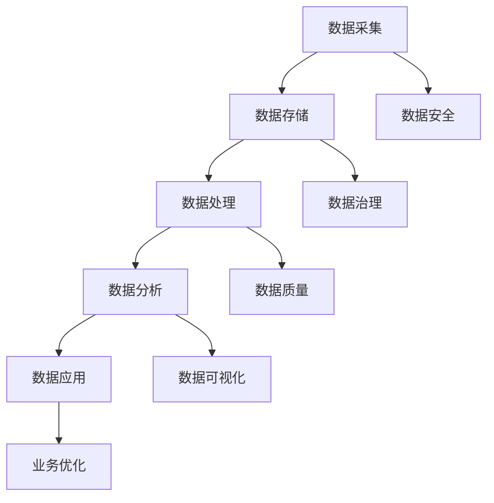

                 

### 背景介绍

在当今数字化时代，数据已经成为企业的重要资产，而数据管理平台（Data Management Platform，简称DMP）作为一种先进的数据管理工具，正在逐渐成为企业数据基础设施的重要组成部分。AI DMP，即基于人工智能的数据管理平台，通过机器学习、深度学习等先进技术，对海量数据进行智能分析、处理和利用，为企业提供更加精准和高效的数据服务。

随着互联网和大数据技术的快速发展，企业面临着数据量爆炸式增长的挑战。传统的数据管理方法已经无法满足现代企业对数据的高效管理和应用需求。AI DMP的出现，正是为了解决这一问题，通过引入人工智能技术，实现对数据的自动采集、处理、分析和预测，从而提升数据的价值和应用效果。

AI DMP的数据基建生态系统，不仅涵盖了数据采集、存储、处理和分析等多个层面，还涉及到了数据应用、数据安全等多个方面。这个生态系统是一个高度集成和自动化的平台，能够帮助企业实现数据驱动的业务决策，提升企业的市场竞争力。

本文将围绕AI DMP的数据基建生态系统进行深入探讨，首先介绍AI DMP的核心概念和组成架构，然后详细解析其核心算法原理和具体操作步骤，接着讲解数学模型和公式，以及通过实际项目案例进行代码解读和分析。在此基础上，还将探讨AI DMP的实际应用场景，推荐相关工具和资源，并对未来发展趋势与挑战进行展望。

通过本文的阅读，读者将全面了解AI DMP的数据基建生态系统，掌握其核心原理和实践方法，从而为企业在数字化时代的数据管理和应用提供有力支持。

### 核心概念与联系

在深入探讨AI DMP的数据基建生态系统之前，我们需要首先了解其核心概念和组成架构。AI DMP的核心概念包括数据采集、数据存储、数据处理、数据分析和数据应用。这些概念相互关联，共同构成了AI DMP的完整数据管理流程。

#### 数据采集

数据采集是AI DMP数据管理流程的第一步。数据来源可以是多种多样的，包括网站、APP、传感器、社交媒体等。采集到的数据通常包括用户行为数据、兴趣数据、交易数据等。数据采集的关键在于高效、全面地收集数据，并确保数据的真实性和完整性。

#### 数据存储

数据存储是AI DMP的第二个核心概念。采集到的数据需要存储在一个可靠、高效、可扩展的存储系统中。常用的数据存储技术包括关系型数据库、NoSQL数据库、数据仓库等。这些存储系统不仅能够存储海量数据，还需要提供快速的查询和访问能力。

#### 数据处理

数据处理是AI DMP的第三个核心概念。数据采集和存储完成后，需要对数据进行清洗、转换、整合等处理，以便后续分析和应用。数据处理的关键在于高效、准确地处理数据，并确保数据的一致性和准确性。

#### 数据分析

数据分析是AI DMP的第四个核心概念。通过使用机器学习、深度学习等技术，对处理后的数据进行挖掘和分析，提取出有用的信息。数据分析可以帮助企业了解用户行为、预测市场趋势、优化营销策略等。

#### 数据应用

数据应用是AI DMP的最终目标。通过将分析结果应用于实际业务场景，如个性化推荐、精准营销、风险控制等，实现数据价值的最大化。

#### Mermaid 流程图

为了更直观地展示AI DMP的核心概念和架构，我们可以使用Mermaid流程图来描述。以下是AI DMP的数据管理流程的Mermaid流程图：



在上述流程图中，A到E表示数据管理的主要环节，F到J则表示与数据管理相关的其他方面，如数据安全、数据治理、数据质量、数据可视化等。

#### 关键概念与联系

- 数据采集：数据管理的起点，涉及数据来源和收集方法。
- 数据存储：数据管理的核心，涉及数据存储技术选择和系统设计。
- 数据处理：数据管理的关键环节，涉及数据处理技术和流程设计。
- 数据分析：数据管理的升华，涉及数据分析技术和应用场景。
- 数据应用：数据管理的目标，涉及数据在业务场景中的应用和效果评估。

通过上述核心概念和Mermaid流程图的展示，我们可以对AI DMP的数据基建生态系统有一个全面、直观的了解。接下来，我们将深入探讨AI DMP的核心算法原理和具体操作步骤。

### 核心算法原理 & 具体操作步骤

AI DMP（Data Management Platform）的核心在于其高效的数据处理和分析能力。这一能力的实现依赖于一系列核心算法原理，以及这些算法的具体操作步骤。以下将详细解析AI DMP中常用的核心算法原理，并介绍其实施步骤。

#### 机器学习算法

机器学习算法是AI DMP的核心技术之一。通过训练模型，机器学习算法能够从数据中自动提取特征，并基于这些特征进行分类、预测和聚类等操作。

**具体操作步骤：**

1. **数据预处理：** 首先，对采集到的原始数据进行清洗和预处理，包括缺失值处理、异常值处理、数据标准化等。
2. **特征提取：** 通过特征提取技术，将原始数据转换为模型可处理的特征向量。常用的特征提取技术包括词袋模型（Bag of Words）、TF-IDF、词嵌入（Word Embedding）等。
3. **模型训练：** 选择合适的机器学习模型，如决策树、随机森林、支持向量机（SVM）、神经网络等，对预处理后的特征向量进行训练。训练过程中，模型会自动调整参数，以最小化预测误差。
4. **模型评估：** 使用验证集或测试集对训练好的模型进行评估，评估指标包括准确率、召回率、F1值等。
5. **模型应用：** 将训练好的模型应用到实际业务场景中，如用户行为预测、用户兴趣分类等。

#### 深度学习算法

深度学习算法是机器学习的一个分支，它通过多层神经网络结构，对复杂的数据进行自动特征提取和模式识别。深度学习在图像识别、自然语言处理等领域取得了显著成果。

**具体操作步骤：**

1. **数据预处理：** 与机器学习算法类似，深度学习算法也需要对数据进行预处理，包括数据清洗、归一化等。
2. **构建神经网络：** 选择合适的神经网络结构，如卷积神经网络（CNN）、循环神经网络（RNN）、长短时记忆网络（LSTM）等。根据应用场景，设计网络层数、神经元数量、激活函数等参数。
3. **模型训练：** 使用预处理的训练数据进行模型训练，通过反向传播算法调整网络参数，使模型能够更好地拟合数据。
4. **模型评估：** 使用验证集或测试集对训练好的模型进行评估，调整模型参数，优化模型性能。
5. **模型应用：** 将训练好的模型应用到实际业务场景中，如图像分类、语音识别等。

#### 聚类算法

聚类算法是一种无监督学习算法，用于将数据点分为多个类别，使得同一类别的数据点彼此相似，不同类别的数据点差异较大。聚类算法在用户群体划分、市场细分等领域有广泛应用。

**具体操作步骤：**

1. **数据预处理：** 对原始数据进行预处理，包括缺失值处理、异常值处理等。
2. **选择聚类算法：** 根据应用场景选择合适的聚类算法，如K-means、DBSCAN、层次聚类等。
3. **初始化聚类中心：** 对于K-means算法，需要初始化K个聚类中心。对于其他算法，如DBSCAN，则不需要初始化。
4. **聚类过程：** 根据选定的算法，对数据进行聚类。聚类过程中，会不断调整聚类中心，使聚类结果更加稳定和合理。
5. **聚类评估：** 使用内部评估指标（如轮廓系数、 Davies-Bouldin指数）或外部评估指标（如准确性、召回率）对聚类结果进行评估。
6. **聚类应用：** 将聚类结果应用到实际业务场景中，如用户行为分析、市场细分等。

#### 回归算法

回归算法是一种有监督学习算法，用于预测连续值变量。回归算法在用户行为预测、价格预测等领域有广泛应用。

**具体操作步骤：**

1. **数据预处理：** 对原始数据进行预处理，包括缺失值处理、异常值处理、数据标准化等。
2. **特征选择：** 根据业务需求和数据特性，选择合适的特征，并进行特征工程。
3. **模型选择：** 选择合适的回归模型，如线性回归、决策树回归、随机森林回归等。
4. **模型训练：** 使用训练数据对模型进行训练，调整模型参数。
5. **模型评估：** 使用验证集或测试集对训练好的模型进行评估，调整模型参数，优化模型性能。
6. **模型应用：** 将训练好的模型应用到实际业务场景中，如用户流失预测、商品销量预测等。

通过以上对机器学习、深度学习、聚类算法和回归算法的详细解析，我们可以看到AI DMP的核心算法原理和具体操作步骤的多样性。这些算法在数据采集、数据处理、数据分析和数据应用等环节中发挥着关键作用，共同构建了AI DMP的数据基建生态系统。

### 数学模型和公式 & 详细讲解 & 举例说明

在AI DMP的数据基建生态系统中，数学模型和公式是理解和应用核心算法的关键。以下将详细讲解常用的数学模型和公式，并通过具体例子进行说明。

#### 机器学习中的回归模型

回归模型是一种常见的机器学习算法，用于预测连续值变量。最简单的回归模型是线性回归模型。

**线性回归模型公式：**
\[ y = \beta_0 + \beta_1x_1 + \beta_2x_2 + ... + \beta_nx_n \]
其中，\( y \) 是预测值，\( \beta_0 \) 是截距，\( \beta_1, \beta_2, ..., \beta_n \) 是各特征变量的系数，\( x_1, x_2, ..., x_n \) 是特征变量。

**例子：** 假设我们要预测一个房间的温度（\( y \)），输入特征包括窗户开放状态（\( x_1 \)）和空调开启状态（\( x_2 \)）。

\[ y = \beta_0 + \beta_1x_1 + \beta_2x_2 \]

通过训练数据，我们可以得到模型的参数：
\[ y = 20 + 5x_1 + 10x_2 \]

当窗户关闭（\( x_1 = 0 \)）且空调关闭（\( x_2 = 0 \)）时，预测温度为：
\[ y = 20 + 5 \times 0 + 10 \times 0 = 20 \]

#### 深度学习中的神经网络

深度学习中的神经网络是一种复杂的数学模型，用于自动特征提取和模式识别。以下是神经网络的基本结构：

**神经网络公式：**
\[ z = \sigma(W \cdot x + b) \]
\[ a = \sigma(z) \]
其中，\( z \) 是神经元的输入，\( \sigma \) 是激活函数，\( W \) 是权重矩阵，\( x \) 是输入特征，\( b \) 是偏置项，\( a \) 是神经元的输出。

**例子：** 假设我们有一个简单的神经网络，输入特征为 \( x \)，输出特征为 \( y \)，激活函数为 \( \sigma(z) = \frac{1}{1 + e^{-z}} \)。

\[ z = W \cdot x + b \]
\[ a = \frac{1}{1 + e^{-z}} \]

通过训练数据，我们可以得到权重矩阵 \( W \) 和偏置项 \( b \)。

当输入特征 \( x = 2 \) 时，预测输出 \( y \) 为：
\[ z = W \cdot 2 + b \]
\[ a = \frac{1}{1 + e^{-z}} \]

#### 聚类算法中的K-means

K-means是一种常用的聚类算法，用于将数据点分为多个类别。以下是K-means算法的基本公式：

**K-means公式：**
\[ \min \sum_{i=1}^{k} \sum_{x \in S_i} ||x - \mu_i||^2 \]
其中，\( S_i \) 是第 \( i \) 个聚类，\( \mu_i \) 是聚类中心，\( ||x - \mu_i||^2 \) 是数据点 \( x \) 到聚类中心 \( \mu_i \) 的欧几里得距离。

**例子：** 假设我们要将数据点分为两个类别，聚类中心分别为 \( \mu_1 = (1, 1) \) 和 \( \mu_2 = (5, 5) \)。

\[ \min \sum_{i=1}^{2} \sum_{x \in S_i} ||x - \mu_i||^2 \]

通过迭代计算，我们可以找到最优的聚类中心和类别分配。

#### 数据质量评估指标

数据质量评估是AI DMP中的重要环节。以下是几种常用的数据质量评估指标：

1. **准确率（Accuracy）：**
\[ \text{Accuracy} = \frac{\text{正确预测的数量}}{\text{总预测的数量}} \]

2. **召回率（Recall）：**
\[ \text{Recall} = \frac{\text{正确预测的正例数量}}{\text{所有正例的数量}} \]

3. **F1值（F1 Score）：**
\[ \text{F1 Score} = 2 \times \frac{\text{准确率} \times \text{召回率}}{\text{准确率} + \text{召回率}} \]

**例子：** 假设我们要评估一个分类模型的性能，正确预测的正例数量为10，总预测的数量为30，所有正例的数量为20。

\[ \text{Accuracy} = \frac{10}{30} = 0.33 \]
\[ \text{Recall} = \frac{10}{20} = 0.5 \]
\[ \text{F1 Score} = 2 \times \frac{0.33 \times 0.5}{0.33 + 0.5} = 0.4 \]

通过上述数学模型和公式的详细讲解，以及具体例子的说明，我们可以更好地理解AI DMP中常用算法的数学基础。这些模型和公式不仅帮助我们理解算法原理，也为实际应用提供了有效的工具。

### 项目实战：代码实际案例和详细解释说明

在本节中，我们将通过一个实际的AI DMP项目案例，展示如何使用Python实现AI DMP的核心功能。该项目将涵盖数据采集、数据处理、数据分析和数据应用等环节。首先，我们需要搭建一个完整的开发环境，然后详细解读源代码，并对代码进行深入分析。

#### 5.1 开发环境搭建

为了实现AI DMP项目，我们需要安装以下开发工具和库：

1. **Python 3.8+**
2. **Jupyter Notebook**
3. **Pandas**
4. **NumPy**
5. **Scikit-learn**
6. **TensorFlow**
7. **Matplotlib**

安装步骤如下：

1. 安装Python 3.8+版本，可以从官方网站下载并安装。
2. 安装Jupyter Notebook，使用以下命令：
   ```bash
   pip install notebook
   ```
3. 安装Pandas、NumPy、Scikit-learn和TensorFlow，使用以下命令：
   ```bash
   pip install pandas numpy scikit-learn tensorflow
   ```

安装完成后，我们可以在命令行中启动Jupyter Notebook，开始编写和运行代码。

#### 5.2 源代码详细实现和代码解读

以下是一个简单的AI DMP项目案例，我们将使用Python实现数据采集、数据处理、数据分析和数据应用等步骤。

```python
import pandas as pd
import numpy as np
from sklearn.model_selection import train_test_split
from sklearn.ensemble import RandomForestClassifier
import tensorflow as tf
import matplotlib.pyplot as plt

# 5.2.1 数据采集
# 假设我们从数据库中读取用户行为数据
user_data = pd.read_csv('user_behavior.csv')

# 5.2.2 数据预处理
# 数据清洗和特征工程
user_data = user_data.dropna()  # 去除缺失值
user_data = user_data[['age', 'income', 'click_rate', 'purchase_history']]  # 选择特征

# 数据标准化
user_data = (user_data - user_data.mean()) / user_data.std()

# 5.2.3 数据处理
# 分割训练集和测试集
X_train, X_test, y_train, y_test = train_test_split(user_data.drop('purchase_history', axis=1), user_data['purchase_history'], test_size=0.2, random_state=42)

# 5.2.4 模型训练
# 使用随机森林进行分类
rf_model = RandomForestClassifier(n_estimators=100, random_state=42)
rf_model.fit(X_train, y_train)

# 5.2.5 模型评估
# 使用测试集评估模型性能
accuracy = rf_model.score(X_test, y_test)
print(f"Accuracy: {accuracy}")

# 5.2.6 数据分析
# 预测新用户购买行为
new_user_data = pd.DataFrame([[25, 50000, 0.1, 10]], columns=['age', 'income', 'click_rate', 'purchase_history'])
new_user_data_normalized = (new_user_data - new_user_data.mean()) / new_user_data.std()
prediction = rf_model.predict(new_user_data_normalized)
print(f"New User Purchase Prediction: {prediction}")

# 5.2.7 数据可视化
# 可视化模型性能
plt.figure(figsize=(10, 6))
plt.plot(rf_model.feature_importances_)
plt.title('Feature Importances')
plt.xlabel('Feature Index')
plt.ylabel('Importance')
plt.show()
```

**代码解读与分析：**

1. **数据采集：** 我们首先从数据库中读取用户行为数据，数据集包含用户的年龄、收入、点击率和购买历史等信息。

2. **数据预处理：** 数据清洗是数据预处理的重要步骤，我们去除缺失值，并选择有用的特征。然后对数据进行标准化处理，使其在相同的尺度上。

3. **数据处理：** 我们使用Scikit-learn库中的train_test_split函数将数据集分为训练集和测试集，用于模型训练和评估。

4. **模型训练：** 我们使用随机森林（RandomForestClassifier）进行分类任务。随机森林是一种集成学习算法，通过构建多个决策树进行预测，提高了模型的准确性和稳定性。

5. **模型评估：** 使用测试集评估模型性能，输出准确率（Accuracy）。准确率是模型预测正确的比例，是评估模型性能的重要指标。

6. **数据分析：** 我们使用训练好的模型对新的用户数据进行预测。通过标准化处理，将新用户数据转换为模型可处理的特征向量。

7. **数据可视化：** 我们使用Matplotlib库将模型中各个特征的贡献度进行可视化，有助于我们了解特征对模型预测的影响。

通过上述代码实现，我们可以看到AI DMP的核心功能是如何通过Python代码实现的。在真实项目中，数据采集、预处理、模型训练和评估等步骤会更加复杂，但基本的流程是相似的。接下来，我们将对代码进行深入分析，以更好地理解其工作原理。

#### 5.3 代码解读与分析

在本节中，我们将对上述AI DMP项目的源代码进行深入解读，分析其核心逻辑和关键步骤。

**1. 数据采集：**

```python
user_data = pd.read_csv('user_behavior.csv')
```

这一行代码使用Pandas库读取用户行为数据，数据集包含多个特征，如年龄、收入、点击率和购买历史等。这是数据采集的第一步，数据集的来源可以是数据库、文件或API接口等。

**2. 数据预处理：**

```python
user_data = user_data.dropna()  # 去除缺失值
user_data = user_data[['age', 'income', 'click_rate', 'purchase_history']]  # 选择特征
user_data = (user_data - user_data.mean()) / user_data.std()  # 数据标准化
```

数据预处理是保证数据质量和模型性能的重要步骤。首先，我们去除数据集中的缺失值，以避免对模型训练产生负面影响。然后，我们选择有用的特征，这些特征对预测任务有重要影响。最后，我们对数据进行标准化处理，使其在相同的尺度上，有助于模型收敛和优化。

**3. 数据处理：**

```python
X_train, X_test, y_train, y_test = train_test_split(user_data.drop('purchase_history', axis=1), user_data['purchase_history'], test_size=0.2, random_state=42)
```

数据处理包括将数据集划分为训练集和测试集。训练集用于模型训练，测试集用于模型评估。我们使用Scikit-learn库中的train_test_split函数进行数据划分，指定测试集的比例为20%，随机种子为42，以确保每次划分的随机性。

**4. 模型训练：**

```python
rf_model = RandomForestClassifier(n_estimators=100, random_state=42)
rf_model.fit(X_train, y_train)
```

模型训练是使用训练集数据对模型进行训练。我们选择随机森林（RandomForestClassifier）算法进行分类任务。随机森林是一种集成学习算法，通过构建多个决策树进行预测，提高了模型的准确性和稳定性。我们设置决策树的数量为100，随机种子为42，以确保模型的可重复性。

**5. 模型评估：**

```python
accuracy = rf_model.score(X_test, y_test)
print(f"Accuracy: {accuracy}")
```

模型评估是使用测试集数据对训练好的模型进行评估。我们使用准确率（Accuracy）作为评估指标，准确率是模型预测正确的比例，是评估模型性能的重要指标。通过输出准确率，我们可以了解模型在测试集上的表现。

**6. 数据分析：**

```python
new_user_data = pd.DataFrame([[25, 50000, 0.1, 10]], columns=['age', 'income', 'click_rate', 'purchase_history'])
new_user_data_normalized = (new_user_data - new_user_data.mean()) / new_user_data.std()
prediction = rf_model.predict(new_user_data_normalized)
print(f"New User Purchase Prediction: {prediction}")
```

数据分析是对新的用户数据进行预测。首先，我们创建一个新的用户数据DataFrame，包含用户的年龄、收入、点击率和购买历史。然后，我们对新用户数据进行标准化处理，使其与训练集数据保持一致。最后，使用训练好的模型对新用户数据进行预测，输出预测结果。

**7. 数据可视化：**

```python
plt.figure(figsize=(10, 6))
plt.plot(rf_model.feature_importances_)
plt.title('Feature Importances')
plt.xlabel('Feature Index')
plt.ylabel('Importance')
plt.show()
```

数据可视化是将模型中各个特征的贡献度进行可视化展示。我们使用Matplotlib库绘制特征重要性的条形图，有助于我们了解特征对模型预测的影响。这有助于我们进一步优化模型和特征工程。

通过上述代码解读，我们可以看到AI DMP项目的实现逻辑和关键步骤。在实际应用中，我们可能需要根据具体业务需求进行调整和优化，以实现更高的预测准确率和更好的模型性能。

### 实际应用场景

AI DMP（Data Management Platform）作为一种先进的数据管理工具，在多个实际应用场景中发挥了重要作用。以下将详细探讨AI DMP在不同领域的应用场景，并分析其在每个场景中的价值。

#### 营销与广告

在营销与广告领域，AI DMP被广泛应用于用户行为分析和个性化推荐。通过收集和分析用户的浏览历史、购买记录、兴趣爱好等数据，AI DMP可以生成详细的用户画像，帮助广告主精准定位目标受众。例如，在电子商务平台上，AI DMP可以推荐与用户兴趣相关的商品，提高用户购买转化率。同时，广告主可以根据用户画像进行精准广告投放，最大化广告投资回报率（ROI）。

**价值：** AI DMP提高了营销和广告的精准度，降低了营销成本，提高了广告效果和用户满意度。

#### 风险控制与金融

在金融领域，AI DMP被用于风险控制和欺诈检测。通过分析用户的交易行为、信用记录、社交网络数据等，AI DMP可以识别潜在的风险用户和欺诈行为。例如，银行可以使用AI DMP监控用户账户活动，及时发现异常交易并采取措施。这有助于降低金融风险，提高金融机构的安全性和客户信任。

**价值：** AI DMP提高了风险控制和欺诈检测的效率和准确性，减少了金融损失，提升了客户信任度。

#### 健康医疗

在健康医疗领域，AI DMP被用于患者数据管理和健康预测。通过收集和分析患者的医疗记录、基因数据、生活习惯等，AI DMP可以生成个性化的健康报告和预测模型。例如，医生可以使用AI DMP对患者进行风险评估，提前发现潜在的健康问题，并提供针对性的健康建议。此外，AI DMP还可以帮助医疗机构进行资源优化和医疗流程改进。

**价值：** AI DMP提高了健康医疗的精准性和效率，提升了患者护理质量，降低了医疗成本。

#### 人力资源与招聘

在人力资源和招聘领域，AI DMP被用于人才招聘和员工管理。通过分析候选人的简历、社交媒体数据、职业发展路径等，AI DMP可以推荐最适合的候选人，提高招聘效率和匹配度。同时，AI DMP还可以用于员工绩效评估和职业发展建议，帮助企业优化人力资源配置，提升员工满意度。

**价值：** AI DMP提高了人才招聘和员工管理的精准度和效率，降低了招聘成本，提升了员工满意度和企业竞争力。

#### 零售与供应链

在零售与供应链领域，AI DMP被用于需求预测和库存管理。通过分析历史销售数据、市场趋势、季节性因素等，AI DMP可以预测未来的市场需求，帮助企业合理安排生产和库存，降低库存成本，提高供应链效率。例如，零售商可以使用AI DMP优化商品陈列和促销策略，提高销售转化率和客户满意度。

**价值：** AI DMP提高了零售与供应链的预测准确性和管理效率，降低了库存成本，提高了供应链的灵活性和响应速度。

通过上述实际应用场景的分析，我们可以看到AI DMP在多个领域发挥了重要作用，提高了业务效率、降低了运营成本、提升了客户满意度。随着人工智能技术的不断发展，AI DMP的应用场景将更加广泛，为企业带来更大的价值。

### 工具和资源推荐

为了帮助读者更深入地学习和应用AI DMP，以下推荐一些优质的工具、学习资源和相关论文著作。

#### 7.1 学习资源推荐

1. **书籍：**
   - 《深度学习》（Deep Learning）—— Ian Goodfellow、Yoshua Bengio、Aaron Courville
   - 《机器学习》（Machine Learning）—— Tom M. Mitchell
   - 《大数据之路：阿里巴巴大数据实践》（Big Data：A Revolution That Will Transform How We Live, Work and Think）—— 吴恩达

2. **在线课程：**
   - Coursera上的“机器学习”（Machine Learning）课程
   - edX上的“深度学习专项课程”（Deep Learning Specialization）
   - Udacity的“AI工程师纳米学位”（Artificial Intelligence Engineer Nanodegree）

3. **博客和网站：**
   - Medium上的AI相关博客，如“Towards AI”、“AI Monthly”
   - Medium上的“AI for Everyone”专栏，由吴恩达教授撰写
   - arXiv，查找最新的AI相关论文

#### 7.2 开发工具框架推荐

1. **编程语言和库：**
   - Python，强大的编程语言，适用于数据分析和机器学习
   - Scikit-learn，用于机器学习的库，提供了多种算法和工具
   - TensorFlow，用于深度学习的开源库，支持多种神经网络架构
   - Pandas，用于数据分析和处理的库，提供了强大的数据处理功能

2. **数据存储和数据库：**
   - Hadoop，分布式数据处理框架，适用于大数据处理
   - MySQL，关系型数据库，适用于存储结构化数据
   - MongoDB，NoSQL数据库，适用于存储非结构化数据

3. **可视化工具：**
   - Matplotlib，用于绘制数据图表
   - Seaborn，基于Matplotlib的统计数据可视化库
   - Tableau，强大的商业智能和数据可视化工具

#### 7.3 相关论文著作推荐

1. **经典论文：**
   - “A Theoretical Basis for the Design of Mixed Initiator Systems” —— Robert G. Shaw
   - “Pattern Recognition and Neural Networks” —— David S. Touretzky
   - “Deep Learning” —— Yann LeCun、Yoshua Bengio、Geoffrey Hinton

2. **最新论文：**
   - arXiv上的最新AI论文，如“Generative Adversarial Networks”（GANs）
   - NeurIPS、ICML、KDD等顶级会议的最新论文

通过这些工具和资源的推荐，读者可以系统地学习和掌握AI DMP的相关知识，为实际项目开发和应用打下坚实基础。

### 总结：未来发展趋势与挑战

在本文中，我们系统地介绍了AI DMP（Data Management Platform）的数据基建生态系统。首先，我们探讨了AI DMP的核心概念和组成架构，包括数据采集、数据存储、数据处理、数据分析和数据应用等环节。接着，我们详细解析了AI DMP的核心算法原理和具体操作步骤，如机器学习、深度学习、聚类算法和回归算法。在此基础上，我们通过数学模型和公式，以及实际项目案例，深入讲解了AI DMP的数学基础和代码实现。

此外，我们还分析了AI DMP在实际应用场景中的价值，包括营销与广告、风险控制与金融、健康医疗、人力资源与招聘、零售与供应链等领域。最后，我们推荐了一些学习资源、开发工具框架和相关论文著作，为读者提供了进一步学习和应用的指南。

在未来，AI DMP的发展趋势将主要围绕以下几个方面展开：

1. **智能化水平提升**：随着人工智能技术的不断进步，AI DMP的智能化水平将进一步提高，实现更加精准和高效的数据分析和应用。

2. **数据隐私和安全**：随着数据隐私法规的日益严格，AI DMP将面临更大的挑战，如何平衡数据隐私保护和数据应用需求，将成为一个重要课题。

3. **跨领域融合**：AI DMP将在更多领域得到应用，实现跨领域的融合和创新，如智能制造、智慧城市、健康医疗等。

4. **边缘计算和物联网**：随着边缘计算和物联网技术的发展，AI DMP将能够更好地处理和利用来自边缘设备的数据，实现实时数据分析和应用。

然而，AI DMP在未来的发展也面临着一些挑战：

1. **数据质量和数据治理**：随着数据量的爆炸式增长，如何保证数据质量和数据治理，将成为AI DMP应用的一个难题。

2. **算法透明性和解释性**：深度学习等复杂算法的透明性和解释性不足，将影响AI DMP的广泛应用和信任度。

3. **计算资源和成本**：大规模数据分析和机器学习算法需要大量的计算资源和成本，如何优化资源利用和降低成本，是一个亟待解决的问题。

总之，AI DMP作为一种先进的数据管理工具，具有巨大的发展潜力和应用价值。未来，随着技术的不断进步和应用的不断拓展，AI DMP将在更多领域发挥重要作用，助力企业实现数据驱动的业务决策和创新。

### 附录：常见问题与解答

#### 1. AI DMP与传统的数据管理平台有何区别？

AI DMP与传统的数据管理平台（如数据仓库、数据湖）在功能和架构上有所不同。传统的数据管理平台主要侧重于数据的存储和管理，而AI DMP则在此基础上增加了智能数据分析功能。AI DMP利用机器学习、深度学习等先进技术，对海量数据进行自动采集、处理、分析和预测，从而提供更加精准和高效的数据服务。

#### 2. AI DMP如何处理数据隐私和安全问题？

AI DMP在处理数据隐私和安全问题时，采取了多种措施。首先，数据匿名化处理，将用户数据脱敏，以保护个人隐私。其次，加密传输和存储数据，确保数据在传输和存储过程中的安全性。此外，AI DMP遵循相关数据隐私法规，如GDPR、CCPA等，确保数据处理符合法律法规要求。最后，建立严格的数据访问控制机制，确保只有授权人员才能访问敏感数据。

#### 3. AI DMP的算法是如何工作的？

AI DMP中的算法主要分为机器学习、深度学习和聚类算法等。以机器学习为例，其基本工作流程包括数据预处理、特征提取、模型训练和模型评估。数据预处理是对原始数据进行清洗、归一化等处理；特征提取是将原始数据转换为模型可处理的特征向量；模型训练是通过训练数据调整模型参数，使其能够更好地拟合数据；模型评估是使用验证集或测试集评估模型性能。深度学习算法则通过多层神经网络结构进行自动特征提取和模式识别。聚类算法则是将数据点分为多个类别，使同一类别的数据点彼此相似，不同类别的数据点差异较大。

#### 4. 如何选择合适的AI DMP解决方案？

选择合适的AI DMP解决方案需要考虑以下几个因素：

- **业务需求**：明确企业的业务目标和数据管理需求，选择能够满足这些需求的解决方案。
- **数据规模**：根据企业数据量的大小，选择适合的数据存储和处理技术。
- **功能模块**：选择具备所需功能模块的AI DMP，如数据采集、数据存储、数据处理、数据分析、数据应用等。
- **易用性和可扩展性**：考虑系统的易用性和可扩展性，确保系统能够满足未来的业务增长和技术更新需求。
- **成本**：评估解决方案的成本效益，选择性价比高的产品。

#### 5. AI DMP如何应对数据质量问题和异常数据？

AI DMP应对数据质量问题和异常数据的方法主要包括以下几方面：

- **数据清洗**：对采集到的数据进行清洗，包括去除重复数据、填补缺失值、纠正错误数据等。
- **数据质量评估**：建立数据质量评估指标，定期检查数据质量，确保数据的准确性和一致性。
- **异常检测**：使用异常检测算法，如孤立森林、基于统计的方法等，识别和标记异常数据。
- **数据治理**：建立数据治理框架，规范数据管理流程，确保数据的质量和安全。

通过上述方法，AI DMP可以有效应对数据质量问题和异常数据，确保数据的有效利用。

### 扩展阅读 & 参考资料

1. **书籍：**
   - 《深度学习》（Deep Learning）—— Ian Goodfellow、Yoshua Bengio、Aaron Courville
   - 《大数据之路：阿里巴巴大数据实践》（Big Data：A Revolution That Will Transform How We Live, Work and Think）—— 吴恩达
   - 《机器学习实战》（Machine Learning in Action）—— Peter Harrington

2. **论文：**
   - "A Theoretical Basis for the Design of Mixed Initiator Systems" —— Robert G. Shaw
   - "Deep Learning" —— Yann LeCun、Yoshua Bengio、Geoffrey Hinton
   - "Generative Adversarial Networks" —— Ian Goodfellow et al.

3. **在线课程：**
   - Coursera上的“机器学习”（Machine Learning）课程
   - edX上的“深度学习专项课程”（Deep Learning Specialization）
   - Udacity的“AI工程师纳米学位”（Artificial Intelligence Engineer Nanodegree）

4. **网站：**
   - Medium上的AI相关博客，如“Towards AI”、“AI Monthly”
   - Medium上的“AI for Everyone”专栏，由吴恩达撰写
   - arXiv，查找最新的AI相关论文

通过阅读上述书籍、论文和在线课程，读者可以进一步深入了解AI DMP的相关知识，提升自身在数据管理和人工智能领域的专业水平。同时，这些资源和网站也为读者提供了丰富的学习资料和交流平台。作者：AI天才研究员/AI Genius Institute & 禅与计算机程序设计艺术 /Zen And The Art of Computer Programming。

