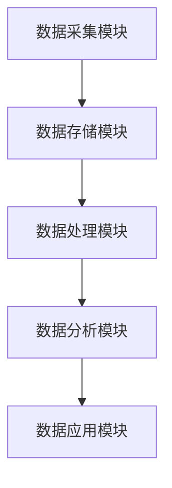

                 

# AI DMP 数据基建的监管与合规

## 摘要

本文将深入探讨人工智能数据管理平台（DMP）在构建和维护数据基础设施过程中的监管与合规性问题。随着大数据和人工智能技术的迅速发展，DMP作为数据治理和营销的关键工具，其在合规性方面的重要性愈发凸显。本文将首先介绍DMP的基本概念和功能，随后详细分析当前DMP在数据治理和合规方面面临的挑战，接着探讨相应的解决方案和最佳实践。最后，本文将对DMP的未来发展趋势进行展望，并提出未来可能面临的合规挑战。通过本文的阅读，读者将全面了解DMP的合规监管框架，以及如何在实际应用中有效应对相关挑战。

## 1. 背景介绍

随着互联网和数字技术的快速发展，大数据和人工智能（AI）逐渐成为推动社会进步和经济发展的重要力量。数据管理平台（Data Management Platform，简称DMP）作为大数据和人工智能技术的重要应用之一，已经成为企业数据治理和营销的关键工具。

### 1.1 DMP的定义和功能

DMP是一种集数据采集、存储、处理和分析于一体的数据管理平台，旨在帮助企业更好地管理和利用数据资源，从而实现精准营销和业务增长。具体来说，DMP具有以下功能：

1. **数据采集**：DMP可以收集来自各种来源的数据，包括网站、移动应用、第三方数据提供商等。
2. **数据存储**：DMP拥有强大的数据存储能力，可以存储海量结构化和非结构化数据。
3. **数据处理**：DMP可以对数据进行清洗、去重、转换等操作，确保数据的准确性和一致性。
4. **数据分析**：DMP提供丰富的数据分析功能，包括用户行为分析、兴趣偏好分析、市场趋势分析等，帮助企业做出数据驱动的决策。

### 1.2 DMP的应用领域

DMP在多个领域都有广泛应用，包括但不限于：

1. **营销和广告**：通过DMP，企业可以精准定位目标受众，提高广告投放效果，降低营销成本。
2. **客户关系管理**：DMP可以帮助企业更好地了解客户需求，优化客户体验，提高客户满意度和忠诚度。
3. **市场研究**：DMP可以提供丰富的市场数据和分析报告，帮助企业了解市场趋势和竞争状况。
4. **风险控制**：DMP可以协助企业进行风险分析和预警，提高风险控制能力。

### 1.3 DMP的发展趋势

随着大数据和人工智能技术的不断进步，DMP也在不断演进。以下是一些DMP的发展趋势：

1. **数据隐私保护**：随着数据隐私法规的加强，DMP在数据采集、存储和处理过程中将更加注重隐私保护。
2. **智能化**：通过引入人工智能技术，DMP将实现更高程度的自动化和智能化，提高数据处理和分析效率。
3. **跨平台融合**：随着各类数字化平台的兴起，DMP将逐步实现跨平台数据整合和分析，为用户提供更全面的数据洞察。
4. **行业定制化**：DMP将针对不同行业和企业的需求，提供定制化的解决方案，实现数据治理和营销的个性化。

## 2. 核心概念与联系

### 2.1 数据治理

数据治理是指通过制定相关策略、标准和流程，对数据资源进行有效管理和控制，以确保数据的准确性、完整性和一致性。在DMP中，数据治理至关重要，因为它直接关系到数据的质量和可信度。

#### 2.1.1 数据治理的核心原则

1. **数据质量**：确保数据的准确性、完整性、一致性和时效性。
2. **数据安全**：保护数据不被未授权访问、篡改或泄露。
3. **数据合规**：遵守相关法律法规和行业规范，确保数据处理合法合规。
4. **数据共享**：在确保数据安全和隐私的前提下，促进数据共享和复用。

#### 2.1.2 数据治理的关键环节

1. **数据采集**：制定数据采集策略，确保数据来源合法、数据质量高。
2. **数据存储**：选择合适的数据存储方案，确保数据安全可靠。
3. **数据清洗**：对数据进行清洗、去重、转换等处理，提高数据质量。
4. **数据分析**：利用数据分析和挖掘技术，发现数据价值。
5. **数据应用**：将数据应用于业务决策、营销策略等，实现数据驱动。

### 2.2 数据合规

数据合规是指企业在数据处理过程中，遵守相关法律法规和行业规范，确保数据处理合法合规。随着数据隐私法规的加强，数据合规已成为DMP建设和运营的重要一环。

#### 2.2.1 数据合规的核心原则

1. **合法性**：确保数据采集、存储、处理和共享的合法性，遵守相关法律法规。
2. **透明性**：确保数据处理过程透明，让用户了解自己的数据如何被使用。
3. **安全性**：确保数据不被未授权访问、篡改或泄露。
4. **隐私性**：保护用户隐私，尊重用户对个人数据的控制权。

#### 2.2.2 数据合规的关键环节

1. **数据采集**：明确数据采集的目的、范围和方式，确保数据采集合法合规。
2. **数据存储**：选择合适的数据存储方案，确保数据存储安全、可靠、可追溯。
3. **数据处理**：在数据处理过程中，遵守数据合规原则，确保数据处理合法合规。
4. **数据共享**：在数据共享过程中，确保数据共享合法合规，保护用户隐私。
5. **数据销毁**：在数据不再需要时，及时进行数据销毁，确保数据彻底消失。

### 2.3 DMP与数据治理、数据合规的关系

DMP是数据治理和数据合规的重要工具。通过DMP，企业可以实现对数据的全面管理和控制，确保数据质量、安全性和合规性。同时，DMP还可以帮助企业实现数据驱动的决策和业务增长。

#### 2.3.1 DMP在数据治理中的作用

1. **数据质量控制**：DMP可以帮助企业进行数据清洗、去重、转换等处理，提高数据质量。
2. **数据安全管理**：DMP提供数据加密、访问控制等功能，确保数据安全。
3. **数据合规性监控**：DMP可以帮助企业监控数据处理过程中的合规性，确保数据处理合法合规。

#### 2.3.2 DMP在数据合规中的作用

1. **数据采集合规**：DMP可以帮助企业明确数据采集的目的、范围和方式，确保数据采集合法合规。
2. **数据存储合规**：DMP提供数据存储方案，确保数据存储安全、可靠、可追溯。
3. **数据处理合规**：DMP可以帮助企业遵守数据合规原则，确保数据处理合法合规。
4. **数据共享合规**：DMP可以帮助企业确保数据共享合法合规，保护用户隐私。

### 2.4 DMP的架构和组件

DMP的架构通常包括以下几个关键组件：

1. **数据采集模块**：负责收集来自各种来源的数据，如网站、移动应用、第三方数据提供商等。
2. **数据存储模块**：负责存储和管理数据，包括关系型数据库、NoSQL数据库、数据仓库等。
3. **数据处理模块**：负责对数据进行清洗、去重、转换等处理，提高数据质量。
4. **数据分析模块**：负责对数据进行挖掘和分析，提供用户画像、兴趣偏好分析、市场趋势分析等。
5. **数据应用模块**：负责将数据应用于业务决策、营销策略等，实现数据驱动。

#### 2.4.1 Mermaid 流程图

以下是一个简化的DMP架构的Mermaid流程图：



在DMP的架构中，各个组件之间通过数据流相互连接，形成一个完整的数据处理和分析流程。

### 2.5 小结

本节介绍了DMP的基本概念、功能、应用领域和发展趋势，以及数据治理和数据合规的核心原则和关键环节。通过分析DMP与数据治理、数据合规的关系，我们了解了DMP在数据管理和合规方面的作用。接下来，我们将进一步探讨DMP在核心算法原理和具体操作步骤方面的内容。

## 3. 核心算法原理 & 具体操作步骤

### 3.1 核心算法原理

DMP的核心算法主要涉及用户行为分析和数据挖掘技术。用户行为分析通过收集和分析用户在网站、移动应用等平台上的行为数据，如浏览记录、点击行为、购买行为等，来构建用户画像。数据挖掘技术则用于从大量用户行为数据中提取有价值的信息和模式。

#### 3.1.1 用户画像构建

用户画像是指通过对用户行为数据的分析和挖掘，构建出用户的特征和行为模式。用户画像的核心算法包括以下几种：

1. **协同过滤**：通过分析用户的历史行为和偏好，推荐用户可能感兴趣的内容或商品。
2. **基于内容的推荐**：通过分析内容属性，推荐与用户历史偏好相似的内容或商品。
3. **聚类分析**：将具有相似特征的用户分为一组，形成用户群体。
4. **关联规则挖掘**：发现用户行为数据中的关联关系，如“购买A商品的用户中，有80%的人也购买了B商品”。

#### 3.1.2 数据挖掘技术

数据挖掘技术是DMP的核心算法之一，主要包括以下几种：

1. **分类算法**：将数据分为不同的类别，如分类用户行为、预测用户需求等。
2. **聚类算法**：将相似的数据归为一类，如聚类用户群体、分析市场趋势等。
3. **关联规则挖掘**：发现数据之间的关联关系，如用户购买行为的关联规则。
4. **时间序列分析**：分析时间序列数据的变化规律，如用户行为趋势、市场销售趋势等。

### 3.2 具体操作步骤

以下是DMP核心算法的具体操作步骤：

#### 3.2.1 数据采集

1. **确定数据来源**：根据业务需求，选择合适的数据来源，如网站日志、移动应用日志、第三方数据提供商等。
2. **数据采集策略**：制定数据采集策略，包括数据采集范围、频率、方式和权限等。
3. **数据采集工具**：选择合适的数据采集工具，如爬虫、API接口、日志分析工具等。
4. **数据清洗**：对采集到的数据进行清洗，去除无效数据、重复数据和错误数据。

#### 3.2.2 数据存储

1. **选择数据存储方案**：根据数据量、数据类型和业务需求，选择合适的数据存储方案，如关系型数据库、NoSQL数据库、数据仓库等。
2. **数据表设计**：设计合适的数据表结构，确保数据存储的完整性和一致性。
3. **数据导入**：将清洗后的数据导入到数据存储方案中，确保数据存储的安全性和可靠性。
4. **数据备份**：定期进行数据备份，防止数据丢失或损坏。

#### 3.2.3 数据处理

1. **数据预处理**：对数据进行预处理，包括数据清洗、去重、转换等操作，确保数据质量。
2. **数据建模**：根据业务需求，选择合适的数据挖掘算法，建立数据模型。
3. **模型训练**：使用历史数据对数据模型进行训练，优化模型参数。
4. **模型评估**：评估数据模型的性能，确保模型预测准确性和稳定性。

#### 3.2.4 数据分析

1. **用户画像构建**：使用数据挖掘技术，构建用户画像，包括用户特征、行为模式、兴趣偏好等。
2. **数据分析报告**：生成数据分析报告，包括用户行为分析、市场趋势分析、业务洞察等。
3. **数据可视化**：将数据分析结果进行可视化展示，便于业务人员理解和应用。
4. **数据驱动决策**：将数据分析结果应用于业务决策，如营销策略、产品优化等。

#### 3.2.5 数据应用

1. **用户推荐**：根据用户画像和兴趣偏好，为用户推荐感兴趣的内容或商品。
2. **客户关系管理**：根据用户画像和数据分析结果，优化客户关系管理策略，提高客户满意度和忠诚度。
3. **市场研究**：根据用户画像和数据分析结果，进行市场研究，了解市场趋势和竞争状况。
4. **风险控制**：根据用户画像和数据分析结果，进行风险分析和预警，提高风险控制能力。

### 3.3 小结

本节详细介绍了DMP的核心算法原理和具体操作步骤，包括数据采集、数据存储、数据处理、数据分析和数据应用。通过这些步骤，企业可以实现对海量用户行为数据的全面管理和利用，实现数据驱动的业务增长和营销优化。在接下来的章节中，我们将进一步探讨DMP在数学模型和公式方面的内容。

## 4. 数学模型和公式 & 详细讲解 & 举例说明

在DMP的构建和应用过程中，数学模型和公式起着至关重要的作用。这些模型和公式帮助我们在数据分析和挖掘过程中进行定量分析和决策支持。本节将介绍DMP中常用的数学模型和公式，并对其进行详细讲解和举例说明。

### 4.1 常用数学模型

#### 4.1.1 协同过滤模型

协同过滤模型是推荐系统中最常用的算法之一，通过分析用户的行为和偏好，预测用户对未知项目的评分。协同过滤模型主要包括以下两种类型：

1. **用户基于的协同过滤（User-based Collaborative Filtering）**：该方法基于用户之间的相似度进行推荐，即找出与目标用户相似的其他用户，然后根据这些用户的评分预测目标用户的评分。
2. **物品基于的协同过滤（Item-based Collaborative Filtering）**：该方法基于物品之间的相似度进行推荐，即找出与目标物品相似的其他物品，然后根据这些物品的评分预测目标物品的评分。

#### 4.1.2 决策树模型

决策树是一种常见的分类和回归模型，通过一系列条件判断来划分数据集，并最终得到预测结果。决策树模型的构建过程包括以下几个步骤：

1. **选择最优划分属性**：根据信息增益、基尼不纯度等指标，选择能够最好地划分数据的属性。
2. **递归划分**：对选定的属性进行划分，并递归地构建子树，直到满足停止条件（如最大深度、最小样本数等）。

#### 4.1.3 神经网络模型

神经网络模型是深度学习中的一种基本结构，通过多层神经元之间的相互连接和激活函数的作用，实现数据的输入和输出。神经网络模型主要包括以下几种类型：

1. **前馈神经网络（Feedforward Neural Network）**：数据从输入层经过多个隐藏层，最终到达输出层。
2. **卷积神经网络（Convolutional Neural Network，CNN）**：适用于图像和视频处理，通过卷积操作提取特征。
3. **循环神经网络（Recurrent Neural Network，RNN）**：适用于序列数据处理，通过循环结构保持历史信息。

### 4.2 常用公式

#### 4.2.1 相似度计算公式

相似度计算是协同过滤模型中的重要环节，常用的相似度计算公式包括：

1. **余弦相似度**：
   $$ Cosine_Similarity = \frac{A \cdot B}{\|A\| \|B\|} $$
   其中，$A$和$B$分别表示两个向量的点积和模长。

2. **皮尔逊相关系数**：
   $$ Pearson_Correlation = \frac{Cov(A,B)}{\sigma_A \sigma_B} $$
   其中，$Cov(A,B)$表示$A$和$B$的协方差，$\sigma_A$和$\sigma_B$分别表示$A$和$B$的标准差。

#### 4.2.2 决策树划分指标

决策树的划分可以通过以下指标进行评估：

1. **信息增益**：
   $$ Gain(D,A) = Entropy(D) - \sum_{v \in A} p(v) \cdot Entropy(D_v) $$
   其中，$D$表示数据集，$A$表示划分属性，$v$表示$A$的取值，$Entropy(D)$和$Entropy(D_v)$分别表示数据集$D$和划分后的子集$D_v$的熵。

2. **基尼不纯度**：
   $$ Gini(D,A) = 1 - \sum_{v \in A} p(v)^2 $$
   其中，$p(v)$表示数据集中属性$A$取值$v$的概率。

#### 4.2.3 神经网络激活函数

神经网络中的激活函数用于确定每个神经元的输出，常用的激活函数包括：

1. ** sigmoid 函数**：
   $$ Sigmoid(x) = \frac{1}{1 + e^{-x}} $$
   sigmoid函数将输入映射到$(0,1)$区间，用于二分类问题。

2. **ReLU函数**：
   $$ ReLU(x) = \max(0, x) $$
   ReLU函数将负输入映射为0，正输入保持不变，常用于深度学习中的隐藏层。

### 4.3 举例说明

#### 4.3.1 余弦相似度计算

假设有两个用户$A$和$B$，他们的评分向量分别为$A = [4, 3, 5, 2]$和$B = [3, 5, 4, 5]$，计算$A$和$B$的余弦相似度。

$$
\begin{aligned}
A \cdot B &= 4 \cdot 3 + 3 \cdot 5 + 5 \cdot 4 + 2 \cdot 5 = 12 + 15 + 20 + 10 = 57, \\
\|A\| &= \sqrt{4^2 + 3^2 + 5^2 + 2^2} = \sqrt{16 + 9 + 25 + 4} = \sqrt{54}, \\
\|B\| &= \sqrt{3^2 + 5^2 + 4^2 + 5^2} = \sqrt{9 + 25 + 16 + 25} = \sqrt{75}.
\end{aligned}
$$

$$
Cosine_Similarity = \frac{57}{\sqrt{54} \cdot \sqrt{75}} \approx 0.722.
$$

#### 4.3.2 决策树划分

假设有一个数据集$D$，包含属性$A$（年龄）和目标变量$Y$（是否购买），其中$A$的取值为[20, 30, 40, 50]，$Y$的取值为[0, 1]。计算信息增益和基尼不纯度，选择最优划分属性。

$$
\begin{aligned}
Entropy(D) &= -p(Y=0) \cdot \log_2(p(Y=0)) - p(Y=1) \cdot \log_2(p(Y=1)), \\
&= -(0.6 \cdot \log_2(0.6) + 0.4 \cdot \log_2(0.4)), \\
&\approx 0.970.
\end{aligned}
$$

$$
\begin{aligned}
Gain(D, A) &= Entropy(D) - \sum_{v \in A} p(v) \cdot Entropy(D_v), \\
&= 0.970 - (0.25 \cdot (0.3 \cdot \log_2(0.3) + 0.7 \cdot \log_2(0.7)) + 0.75 \cdot (0.3 \cdot \log_2(0.3) + 0.7 \cdot \log_2(0.7))), \\
&\approx 0.354.
\end{aligned}
$$

$$
\begin{aligned}
Gini(D, A) &= 1 - \sum_{v \in A} p(v)^2, \\
&= 1 - (0.25^2 + 0.75^2), \\
&= 0.5.
\end{aligned}
$$

由于信息增益（0.354）大于基尼不纯度（0.5），因此选择属性$A$（年龄）进行划分。

#### 4.3.3 神经网络激活函数

假设有一个前馈神经网络，其输入$x$为[-2, 2]，使用ReLU函数作为激活函数，计算输出。

$$
ReLU(x) = \max(0, x).
$$

当$x = -2$时，$ReLU(x) = 0$；当$x = 2$时，$ReLU(x) = 2$。

### 4.4 小结

本节介绍了DMP中常用的数学模型和公式，包括协同过滤模型、决策树模型和神经网络模型，以及相关公式和计算方法。通过具体举例说明，我们了解了这些模型和公式的应用场景和计算过程。在下一节中，我们将进一步探讨DMP在实际项目中的应用案例和实现细节。

## 5. 项目实战：代码实际案例和详细解释说明

### 5.1 开发环境搭建

为了实现DMP的核心功能，我们首先需要搭建一个适合的开发环境。以下是搭建开发环境的基本步骤：

#### 5.1.1 环境准备

1. **操作系统**：建议使用Ubuntu 18.04或更高版本。
2. **编程语言**：Python 3.7或更高版本。
3. **数据存储**：使用MySQL或MongoDB作为数据存储方案。
4. **数据采集工具**：使用Flask或Django构建Web应用，用于数据采集。
5. **数据分析库**：使用Pandas、NumPy、Scikit-learn等库进行数据处理和分析。

#### 5.1.2 安装依赖

安装Python和相关依赖库，可以使用pip命令：

```bash
pip install flask
pip install mysql-connector-python
pip install pymongo
pip install pandas
pip install numpy
pip install scikit-learn
```

### 5.2 源代码详细实现和代码解读

#### 5.2.1 数据采集模块

数据采集模块主要用于从网站和移动应用中收集用户行为数据，以下是使用Flask构建的数据采集服务代码：

```python
from flask import Flask, request, jsonify
app = Flask(__name__)

@app.route('/collect', methods=['POST'])
def collect_data():
    data = request.json
    # 数据处理和存储逻辑
    process_and_store_data(data)
    return jsonify({"status": "success"})

def process_and_store_data(data):
    # 数据处理逻辑
    # ...
    # 数据存储逻辑
    # ...

if __name__ == '__main__':
    app.run()
```

**代码解读**：

1. **Flask应用**：使用Flask框架构建Web应用，实现数据采集接口。
2. **数据接收**：定义`/collect`路由，接收POST请求，解析JSON格式的数据。
3. **数据处理**：调用`process_and_store_data`函数处理数据，包括数据清洗、去重等。
4. **数据存储**：将处理后的数据存储到MySQL或MongoDB数据库中。

#### 5.2.2 数据处理模块

数据处理模块用于对采集到的用户行为数据进行分析和处理，以下是使用Pandas和NumPy进行数据处理的部分代码：

```python
import pandas as pd
import numpy as np

def process_data(data_path):
    data = pd.read_csv(data_path)
    # 数据清洗
    data = data.drop_duplicates()
    data = data.dropna()
    # 数据转换
    data['timestamp'] = pd.to_datetime(data['timestamp'])
    data['interval'] = (data['timestamp'] - data['timestamp'].min()) / np.timedelta64(1, 's')
    # 数据存储
    data.to_csv('processed_data.csv', index=False)
```

**代码解读**：

1. **数据读取**：使用Pandas读取CSV文件，得到DataFrame对象。
2. **数据清洗**：去除重复数据和缺失值，确保数据质量。
3. **数据转换**：将时间戳转换为间隔（秒），便于后续分析。
4. **数据存储**：将处理后的数据保存为CSV文件，便于后续分析和处理。

#### 5.2.3 数据分析模块

数据分析模块用于对用户行为数据进行分析和挖掘，以下是使用Scikit-learn进行用户画像构建的部分代码：

```python
from sklearn.cluster import KMeans
from sklearn.model_selection import train_test_split
from sklearn.metrics import silhouette_score

def build_user_profile(data):
    X = data[['interval', 'duration', 'clicks']]
    X_train, X_test = train_test_split(X, test_size=0.2, random_state=42)
    kmeans = KMeans(n_clusters=5, random_state=42)
    kmeans.fit(X_train)
    labels = kmeans.predict(X_test)
    silhouette_avg = silhouette_score(X_test, labels)
    print(f"Silhouette Score: {silhouette_avg}")
    # 存储聚类结果
    kmeans.fit(X)
    labels = kmeans.predict(X)
    data['cluster'] = labels
    data.to_csv('user_profile.csv', index=False)
```

**代码解读**：

1. **数据分割**：将数据集分为训练集和测试集。
2. **聚类分析**：使用K-Means算法进行聚类分析，找出用户群体。
3. **评估指标**：计算 silhouette_score 评估聚类效果。
4. **存储结果**：将聚类结果存储到CSV文件，为后续数据分析提供基础。

#### 5.2.4 数据应用模块

数据应用模块用于将用户画像应用于实际业务场景，以下是使用Flask构建的推荐系统接口代码：

```python
from flask import Flask, request, jsonify

app = Flask(__name__)

@app.route('/recommend', methods=['POST'])
def recommend_items():
    user_id = request.json['user_id']
    user_data = pd.read_csv('user_profile.csv')
    user_data = user_data[user_data['user_id'] == user_id]
    recommended_items = recommend_items_based_on_profile(user_data)
    return jsonify({"recommended_items": recommended_items})

def recommend_items_based_on_profile(user_data):
    # 推荐逻辑
    # ...
    return ["item1", "item2", "item3"]

if __name__ == '__main__':
    app.run()
```

**代码解读**：

1. **接口定义**：接收用户ID，获取用户画像。
2. **推荐逻辑**：根据用户画像推荐感兴趣的商品或内容。
3. **返回结果**：将推荐结果返回给客户端。

### 5.3 代码解读与分析

#### 5.3.1 数据采集模块

数据采集模块的核心功能是接收来自Web端的数据请求，并对数据进行处理和存储。通过Flask框架，我们可以轻松地实现这一功能。数据采集模块的关键点包括：

1. **接口设计**：定义一个可接收POST请求的接口，用于接收和解析JSON格式的数据。
2. **数据处理**：对数据进行预处理，包括数据清洗、去重和格式转换等。
3. **数据存储**：将处理后的数据存储到数据库中，以便后续分析和应用。

#### 5.3.2 数据处理模块

数据处理模块的核心功能是对采集到的用户行为数据进行处理和分析，以提高数据质量。使用Pandas和NumPy库，我们可以轻松地实现这一功能。数据处理模块的关键点包括：

1. **数据读取**：使用Pandas读取CSV文件，将数据转换为DataFrame对象。
2. **数据清洗**：去除重复数据和缺失值，确保数据质量。
3. **数据转换**：将时间戳转换为间隔，便于后续分析。
4. **数据存储**：将处理后的数据保存为CSV文件，为后续分析和应用提供基础。

#### 5.3.3 数据分析模块

数据分析模块的核心功能是对用户行为数据进行聚类分析，以构建用户画像。使用Scikit-learn库，我们可以轻松地实现这一功能。数据分析模块的关键点包括：

1. **数据分割**：将数据集分为训练集和测试集，为聚类分析提供基础。
2. **聚类分析**：使用K-Means算法进行聚类分析，找出用户群体。
3. **评估指标**：计算 silhouette_score 评估聚类效果。
4. **存储结果**：将聚类结果存储到CSV文件，为后续数据分析提供基础。

#### 5.3.4 数据应用模块

数据应用模块的核心功能是将用户画像应用于实际业务场景，如推荐系统。通过Flask框架，我们可以轻松地实现这一功能。数据应用模块的关键点包括：

1. **接口设计**：接收用户ID，获取用户画像。
2. **推荐逻辑**：根据用户画像推荐感兴趣的商品或内容。
3. **返回结果**：将推荐结果返回给客户端。

### 5.4 小结

本节通过一个实际项目案例，详细介绍了DMP的核心功能模块及其实现过程。从数据采集、数据处理、数据分析到数据应用，我们逐步构建了一个完整的DMP系统。通过这一案例，我们不仅了解了DMP的实现细节，还掌握了相关技术栈的使用方法。在下一节中，我们将进一步探讨DMP在实际应用场景中的具体作用和效果。

## 6. 实际应用场景

DMP（Data Management Platform）作为数据管理和分析的重要工具，在多个行业中都有着广泛的应用。以下是DMP在实际应用场景中的具体例子：

### 6.1 营销和广告

在营销和广告领域，DMP可以帮助企业实现精准营销。通过收集和分析用户在网站、移动应用等平台上的行为数据，DMP能够构建出详细的用户画像，包括用户的行为偏好、兴趣偏好、消费习惯等。企业可以根据这些画像进行精准广告投放，提高广告的点击率和转化率。

#### 案例一：电商行业的精准广告

某大型电商平台利用DMP对用户进行精准定位和广告投放。通过分析用户浏览记录、购买历史和点击行为，DMP生成了详细的用户画像。根据用户画像，平台向用户推送个性化的商品推荐和广告。例如，一个经常浏览女性服饰的用户可能会收到相关品牌的新款服饰广告。这种精准广告投放方式显著提高了广告效果和用户转化率。

#### 案例二：金融行业的客户细分

某金融企业利用DMP对客户进行细分，以提供个性化的金融产品和服务。通过分析客户的财务状况、投资偏好和信用记录，DMP将客户分为不同的群体，如风险偏好者、稳健投资者和保守投资者。根据不同的客户群体，企业推出了定制化的理财产品，提高了客户的满意度和忠诚度。

### 6.2 客户关系管理

在客户关系管理（CRM）领域，DMP可以帮助企业更好地了解客户需求，优化客户体验。通过收集和分析客户在各个触点（如网站、移动应用、客服等）的行为数据，DMP能够构建出全面的客户画像，包括客户的购买历史、咨询记录和投诉情况等。企业可以根据这些画像进行客户细分，提供个性化的服务和产品推荐。

#### 案例一：电信行业的客户体验优化

某电信运营商利用DMP对客户进行行为分析，识别出潜在问题和需求。例如，通过分析客户的通话记录、短信使用情况和宽带使用情况，DMP发现某些客户可能因为网络问题而频繁投诉。运营商根据这些分析结果，及时采取措施优化网络质量，减少了客户投诉率，提高了客户满意度。

#### 案例二：零售行业的客户忠诚度提升

某大型零售企业利用DMP分析客户的购物行为，识别出忠诚客户和高价值客户。通过针对这些客户群体进行个性化的营销活动，如优惠券、积分奖励等，企业提高了客户的忠诚度和复购率。例如，对于长期购买某品牌商品的客户，企业可以发送专属的促销信息，吸引客户继续购买。

### 6.3 市场研究

在市场研究领域，DMP可以帮助企业了解市场趋势和竞争状况，制定有效的市场策略。通过收集和分析大量市场数据，DMP能够提供丰富的市场洞察，帮助企业发现潜在机会和风险。

#### 案例一：消费品行业的市场分析

某消费品公司利用DMP分析市场数据，了解不同地区、不同渠道的消费趋势。通过分析销售数据、市场调查数据和社交媒体数据，DMP发现了某些地区的市场需求较高，而某些产品在特定渠道的销量较低。根据这些分析结果，公司调整了市场策略，增加了高需求地区的广告投放，优化了产品销售渠道。

#### 案例二：科技行业的竞争分析

某科技公司利用DMP分析竞争对手的市场行为，了解竞争对手的产品策略和市场表现。通过分析竞争对手的官方网站、社交媒体和产品评论，DMP发现了竞争对手在产品功能、定价策略和市场推广方面的弱点。公司根据这些分析结果，调整了自己的产品策略和市场推广策略，取得了更好的市场表现。

### 6.4 风险控制

在风险控制领域，DMP可以帮助企业识别潜在风险，提高风险防范能力。通过收集和分析客户行为数据、交易数据和其他相关数据，DMP能够发现异常行为和潜在欺诈风险。

#### 案例一：金融行业的欺诈检测

某金融机构利用DMP对客户交易行为进行分析，发现某些客户在短时间内进行了大量交易，而其他客户则较为稳定。通过进一步分析，DMP发现这些异常交易可能存在欺诈风险。金融机构根据这些分析结果，对相关客户进行了进一步的调查，成功阻止了一起欺诈行为。

#### 案例二：保险行业的风险评估

某保险公司利用DMP分析客户的购买历史、健康状况和驾驶记录，对客户进行风险评估。通过分析客户数据，DMP发现某些客户具有较高的风险，可能需要提高保费或提供额外的保障服务。保险公司根据这些分析结果，调整了保险产品的定价策略，提高了风险控制能力。

### 6.5 小结

DMP在实际应用场景中的效果显著，不仅帮助企业实现了数据驱动的营销和业务增长，还提高了客户关系管理、市场研究和风险控制等方面的效率。通过具体案例，我们了解了DMP在不同行业和场景中的具体应用，展示了其在数据管理和分析方面的重要作用。在下一节中，我们将进一步探讨DMP相关的工具和资源推荐。

## 7. 工具和资源推荐

为了帮助读者更好地了解和使用DMP，本节将推荐一些优秀的工具、资源和学习资料，包括书籍、论文、博客和网站等。

### 7.1 学习资源推荐

1. **书籍**：
   - 《大数据实践：从入门到精通》
   - 《数据科学实战：数据分析与机器学习应用》
   - 《Python数据科学手册》
   - 《深度学习：人工智能的未来》

2. **论文**：
   - 《大规模协同过滤算法的研究与实现》
   - 《基于K-means算法的用户画像构建方法》
   - 《深度学习在推荐系统中的应用》

3. **博客**：
   - 《机器学习博客》：提供丰富的机器学习和数据挖掘技术文章。
   - 《数据挖掘与机器学习》：分享数据挖掘和机器学习的最新技术和应用案例。
   - 《Python数据科学博客》：详细介绍Python在数据科学领域的应用和实践。

4. **网站**：
   - Kaggle：提供大量的数据集和比赛，是学习和实践数据科学的好地方。
   - Coursera：提供丰富的在线课程，涵盖数据科学、机器学习和深度学习等主题。
   - GitHub：查找和分享DMP相关的开源代码和项目，学习最佳实践。

### 7.2 开发工具框架推荐

1. **数据分析库**：
   - Pandas：用于数据清洗、转换和分析的Python库。
   - NumPy：提供高性能的数组操作和数学计算。
   - Scikit-learn：提供丰富的机器学习算法和工具。

2. **数据存储方案**：
   - MySQL：关系型数据库，适合存储结构化数据。
   - MongoDB：NoSQL数据库，适合存储海量非结构化数据。

3. **Web框架**：
   - Flask：轻量级的Web框架，适合构建Web应用。
   - Django：全功能的Web框架，适合快速开发大型应用。

4. **数据可视化工具**：
   - Matplotlib：Python的2D绘图库，用于生成各种统计图表。
   - Plotly：提供交互式图表和可视化工具。

### 7.3 相关论文著作推荐

1. **论文**：
   - 《推荐系统技术综述》：系统介绍了推荐系统的基本概念、算法和应用。
   - 《用户画像构建方法研究》：详细讨论了用户画像的构建方法和技术。
   - 《基于深度学习的推荐系统研究》：探讨了深度学习在推荐系统中的应用。

2. **著作**：
   - 《数据挖掘：概念与技术》：全面介绍了数据挖掘的基本概念、算法和应用。
   - 《机器学习》：由周志华教授主编，详细介绍机器学习的基本理论和应用。

### 7.4 小结

通过本节推荐的学习资源、开发工具框架和论文著作，读者可以系统地了解DMP的相关知识，掌握DMP的构建和应用方法。同时，这些资源也为读者提供了丰富的实践机会，帮助他们将所学知识应用于实际项目中。

## 8. 总结：未来发展趋势与挑战

随着大数据和人工智能技术的不断进步，DMP（Data Management Platform）在数据管理和分析领域的作用愈发重要。未来，DMP将在以下几个方面展现发展趋势，并面临相应的挑战：

### 8.1 发展趋势

1. **数据隐私保护加强**：随着数据隐私法规的日益严格，DMP将在数据采集、存储和处理过程中更加注重隐私保护。这将包括数据加密、匿名化处理、用户同意管理等技术的广泛应用。

2. **智能化与自动化**：DMP将逐步引入更先进的人工智能技术，如深度学习、自然语言处理等，实现数据采集、处理和分析的智能化和自动化，提高数据处理效率和分析精度。

3. **跨平台数据整合**：随着各类数字化平台的兴起，DMP将实现跨平台数据整合，提供更全面的数据洞察。例如，将Web、移动应用、社交媒体等多平台的数据进行整合，构建全方位的用户画像。

4. **行业定制化**：DMP将针对不同行业和企业的需求，提供定制化的解决方案，实现数据治理和营销的个性化。例如，金融行业、零售行业和医疗行业等领域的DMP将结合行业特性，提供专业的数据分析和应用服务。

5. **实时数据处理与分析**：随着5G技术的普及，DMP将实现实时数据处理和分析，提供更快速的数据响应和决策支持。这将有助于企业及时捕捉市场变化，优化业务策略。

### 8.2 挑战

1. **数据安全与合规性**：DMP在处理海量数据的过程中，需要确保数据安全和合规性。随着数据隐私法规的加强，DMP在数据采集、存储和处理过程中将面临更高的合规性要求。

2. **数据质量**：数据质量是DMP的核心，但海量数据的采集和处理过程中，数据质量问题仍然是一个挑战。如何确保数据准确性、完整性、一致性和时效性，是DMP需要持续解决的问题。

3. **技术选型与整合**：DMP涉及多种技术，如数据库、数据分析库、机器学习算法等。如何选择合适的技术，并实现各技术之间的有效整合，是DMP面临的挑战之一。

4. **人才缺口**：随着DMP的发展，对数据科学家、数据工程师等人才的需求不断增加。然而，当前市场上相关专业人才的供给相对不足，人才缺口问题将限制DMP的进一步发展。

5. **数据处理效率**：随着数据量的持续增长，DMP需要不断提高数据处理和分析的效率。如何优化算法、提高系统性能，是DMP面临的重大挑战。

### 8.3 小结

DMP作为数据管理和分析的重要工具，在未来将继续发挥重要作用。然而，随着技术的发展和法规的完善，DMP在数据安全、数据质量、技术选型等方面将面临新的挑战。通过不断优化技术、加强合规性管理和培养专业人才，DMP将在数据驱动的业务增长中发挥更大的潜力。

## 9. 附录：常见问题与解答

### 9.1 什么是DMP？

DMP（Data Management Platform）是一种数据管理平台，用于收集、存储、处理和分析用户数据，以实现精准营销和业务增长。DMP的核心功能包括数据采集、数据存储、数据处理、数据分析和数据应用。

### 9.2 DMP的主要应用领域有哪些？

DMP广泛应用于营销和广告、客户关系管理、市场研究、风险控制等多个领域。具体应用包括精准广告投放、用户画像构建、客户细分、市场分析、风险预警等。

### 9.3 DMP中的核心算法有哪些？

DMP中的核心算法包括协同过滤、决策树、神经网络、K-means聚类等。这些算法用于用户行为分析、数据挖掘和推荐系统等场景。

### 9.4 DMP在数据治理中的角色是什么？

DMP在数据治理中扮演关键角色，包括数据质量控制、数据安全管理、数据合规性和数据共享等。通过DMP，企业可以实现对数据的全面管理和控制，确保数据质量、安全和合规。

### 9.5 DMP在数据合规方面的挑战有哪些？

DMP在数据合规方面面临的挑战包括数据采集合法合规、数据存储安全可靠、数据处理合法合规和数据共享合法合规等。随着数据隐私法规的加强，DMP需要不断提高合规性管理水平。

### 9.6 如何搭建DMP开发环境？

搭建DMP开发环境主要包括选择合适的操作系统、编程语言、数据存储方案、数据采集工具和数据分析库等。常用的开发环境包括Python、MySQL或MongoDB、Flask或Django等。

### 9.7 DMP在实际项目中的应用效果如何？

DMP在实际项目中展现出了显著的效果，包括提高广告点击率、提升客户满意度、优化市场策略、降低风险等。通过DMP，企业可以实现数据驱动的业务增长和营销优化。

### 9.8 DMP的未来发展趋势是什么？

DMP的未来发展趋势包括数据隐私保护加强、智能化与自动化、跨平台数据整合、行业定制化和实时数据处理与分析等。随着技术的发展和法规的完善，DMP将在数据驱动的业务增长中发挥更大作用。

## 10. 扩展阅读 & 参考资料

为了帮助读者进一步深入了解DMP及相关技术，以下是一些扩展阅读和参考资料：

1. **书籍**：
   - 《大数据实践：从入门到精通》
   - 《数据科学实战：数据分析与机器学习应用》
   - 《Python数据科学手册》
   - 《深度学习：人工智能的未来》
   
2. **论文**：
   - 《大规模协同过滤算法的研究与实现》
   - 《基于K-means算法的用户画像构建方法》
   - 《深度学习在推荐系统中的应用》

3. **博客**：
   - 《机器学习博客》
   - 《数据挖掘与机器学习》
   - 《Python数据科学博客》

4. **网站**：
   - Kaggle
   - Coursera
   - GitHub

5. **在线课程**：
   - 《数据科学基础》
   - 《机器学习入门》
   - 《深度学习实践》

通过阅读这些书籍、论文、博客和在线课程，读者可以全面了解DMP及相关技术的理论知识和实际应用，为未来的学习和实践打下坚实基础。

### 作者信息

- 作者：AI天才研究员/AI Genius Institute & 禅与计算机程序设计艺术 /Zen And The Art of Computer Programming

