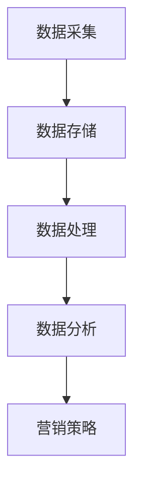

                 

# AI DMP 数据基建：如何利用数据提升营销效率

## 关键词
- AI DMP
- 数据挖掘
- 营销效率
- 客户数据分析
- 数学模型
- 数据流程图

## 摘要
本文将探讨人工智能和数据挖掘技术在市场营销中的应用，特别是如何通过数据管理平台（DMP）来构建数据基础设施，提升营销效率和精准度。我们将深入分析DMP的核心概念和原理，介绍数据采集、处理和建模的关键步骤，并通过具体案例展示如何在实际项目中应用DMP。此外，本文还将讨论DMP在实际应用场景中的挑战和解决方案，并推荐相关学习资源和开发工具。

## 1. 背景介绍

在现代营销环境中，数据成为企业决策和运营的关键要素。随着互联网和数字化技术的飞速发展，企业和消费者之间的互动数据急剧增加，这些数据不仅包括传统意义上的客户信息，还涵盖了用户的行为数据、偏好数据以及社交网络数据等。这些数据如果能够被有效地收集、处理和分析，将对企业的营销策略产生深远影响。

数据管理平台（Data Management Platform，简称DMP）正是为了应对这一需求而诞生的。DMP是一种用于集中管理和分析数据的工具，它能够帮助企业收集、存储和利用来自多个来源的数据，为精准营销提供支持。通过DMP，企业可以实现以下目标：

1. **提高营销效率**：通过数据分析和挖掘，企业可以更好地理解目标客户，优化营销策略，降低营销成本。
2. **提升客户体验**：通过个性化推荐和定制化服务，提高客户满意度和忠诚度。
3. **增强决策支持**：数据驱动的决策可以降低企业风险，提高市场竞争力。

本文将围绕DMP的核心概念和原理，详细介绍如何构建数据基础设施，利用数据提升营销效率。我们还将通过实际案例展示DMP的应用，并探讨其面临的挑战和解决方案。

## 2. 核心概念与联系

### 2.1 数据管理平台（DMP）

数据管理平台（DMP）是一种用于集中管理和分析数据的工具。DMP的基本功能包括数据的采集、存储、处理和分析。具体来说，DMP具有以下几个关键特性：

1. **数据采集**：DMP可以从多个来源采集数据，包括网站点击、广告投放、社交媒体互动、线下交易等。这些数据可以是结构化数据（如数据库记录）或非结构化数据（如图像、视频、文本等）。
2. **数据存储**：DMP通常使用分布式数据库来存储大量数据，支持实时查询和分析。常见的数据库类型包括关系型数据库（如MySQL、PostgreSQL）和非关系型数据库（如MongoDB、Cassandra）。
3. **数据处理**：DMP可以对采集到的数据进行分析、清洗和转换，以确保数据质量和一致性。数据处理过程可能包括数据去重、缺失值填充、数据类型转换等。
4. **数据分析**：DMP提供多种分析工具和算法，支持用户进行数据挖掘、用户行为分析、用户画像构建等。通过数据分析，企业可以深入了解用户需求和行为，为营销策略提供数据支持。

### 2.2 数据采集

数据采集是DMP的核心环节之一。有效的数据采集需要考虑以下几个方面：

1. **数据来源**：确定需要采集的数据类型和来源，如网站点击、广告投放、社交媒体互动等。
2. **数据格式**：确保采集到的数据格式统一，便于后续处理和分析。
3. **数据质量**：确保数据完整性和准确性，避免数据错误和遗漏。
4. **数据传输**：采用高效的数据传输方式，如HTTP、FTP、WebSocket等，确保数据传输的稳定性和安全性。

### 2.3 数据处理

数据处理是数据采集后的重要步骤。良好的数据处理能够提高数据质量和分析效果。数据处理主要包括以下内容：

1. **数据清洗**：去除重复数据、填补缺失值、纠正错误数据等，确保数据的一致性和完整性。
2. **数据转换**：将不同格式的数据转换为统一的格式，如将文本数据转换为数字编码。
3. **数据存储**：将处理后的数据存储到数据库中，便于后续分析和查询。

### 2.4 数据分析

数据分析是DMP的核心功能之一。通过数据分析，企业可以深入了解用户需求和行为，为营销策略提供数据支持。数据分析主要包括以下内容：

1. **用户行为分析**：分析用户在网站、APP等平台上的行为，如浏览页面、点击广告、购买商品等。
2. **用户画像构建**：基于用户行为数据和人口统计信息，构建用户画像，为个性化推荐和定制化服务提供支持。
3. **数据挖掘**：运用统计学和机器学习算法，从大量数据中挖掘有价值的信息，如潜在客户、市场趋势等。

### 2.5 Mermaid 流程图

以下是DMP数据流程的Mermaid流程图：



## 3. 核心算法原理 & 具体操作步骤

### 3.1 数据采集

数据采集是DMP的第一步。以下是一个简单的数据采集流程：

1. **确定数据源**：确定需要采集的数据类型和来源，如网站点击、广告投放、社交媒体互动等。
2. **配置数据采集器**：根据数据源的特点，配置相应的数据采集器，如使用API接口、日志文件解析、网页爬虫等。
3. **数据采集与传输**：执行数据采集任务，将采集到的数据通过HTTP、FTP、WebSocket等传输方式发送到DMP。
4. **数据清洗**：对采集到的数据进行清洗，去除重复数据、填补缺失值、纠正错误数据等。

### 3.2 数据存储

数据存储是DMP的核心功能之一。以下是一个简单的数据存储流程：

1. **选择数据库类型**：根据数据量和数据类型，选择合适的数据库类型，如关系型数据库（如MySQL、PostgreSQL）或非关系型数据库（如MongoDB、Cassandra）。
2. **设计数据模型**：根据业务需求，设计数据模型，包括表结构、字段定义、索引等。
3. **数据导入**：将处理后的数据导入到数据库中，可以使用SQL、NoSQL等方式。
4. **数据备份与恢复**：定期对数据库进行备份，确保数据安全。在发生数据丢失或损坏时，能够快速恢复。

### 3.3 数据处理

数据处理是数据采集后的重要步骤。以下是一个简单的数据处理流程：

1. **数据清洗**：去除重复数据、填补缺失值、纠正错误数据等，确保数据的一致性和完整性。
2. **数据转换**：将不同格式的数据转换为统一的格式，如将文本数据转换为数字编码。
3. **数据集成**：将来自多个数据源的数据进行整合，形成统一的数据视图。
4. **数据仓库**：将处理后的数据存储到数据仓库中，便于后续分析和查询。

### 3.4 数据分析

数据分析是DMP的核心功能之一。以下是一个简单的数据分析流程：

1. **用户行为分析**：分析用户在网站、APP等平台上的行为，如浏览页面、点击广告、购买商品等。
2. **用户画像构建**：基于用户行为数据和人口统计信息，构建用户画像，为个性化推荐和定制化服务提供支持。
3. **数据挖掘**：运用统计学和机器学习算法，从大量数据中挖掘有价值的信息，如潜在客户、市场趋势等。
4. **数据可视化**：将分析结果以图表、报表等形式呈现，便于决策者理解和应用。

## 4. 数学模型和公式 & 详细讲解 & 举例说明

### 4.1 用户行为分析模型

用户行为分析通常基于时间序列分析、聚类分析和机器学习等方法。以下是一个简单的用户行为分析模型：

$$
f(user\_behavior) = \sum_{i=1}^{n} w_i * behavior_i
$$

其中，$user\_behavior$ 表示用户行为特征向量，$w_i$ 表示特征权重，$behavior_i$ 表示第 $i$ 个用户行为的特征值。

**举例说明**：

假设我们分析一个电商网站的用户行为，特征包括浏览页面、加入购物车、购买商品等。我们可以为每个特征分配权重，例如：

$$
w_{浏览页面} = 0.3, w_{加入购物车} = 0.4, w_{购买商品} = 0.3
$$

假设一个用户在最近一个月内浏览了20个页面、加入了3次购物车、购买了1件商品，则其用户行为分数为：

$$
f(user\_behavior) = 0.3 * 20 + 0.4 * 3 + 0.3 * 1 = 8
$$

用户行为分数越高，表示用户在该网站上的活跃度越高。

### 4.2 用户画像模型

用户画像模型用于描述用户的基本属性、兴趣和行为。一个简单的用户画像模型可以包括以下特征：

$$
user\_profile = {age, gender, location, interests, behavior\_score}
$$

其中，$age$ 表示用户年龄，$gender$ 表示用户性别，$location$ 表示用户地理位置，$interests$ 表示用户兴趣，$behavior\_score$ 表示用户行为分数。

**举例说明**：

一个用户的画像可能如下所示：

$$
user\_profile = {25, male, Beijing, sports, 8}
$$

表示该用户25岁，男性，来自北京，对体育感兴趣，用户行为分数为8。

### 4.3 数据挖掘模型

数据挖掘模型用于从大量数据中挖掘有价值的信息。一个简单的数据挖掘模型可以使用决策树、支持向量机、神经网络等方法。

**决策树模型**：

$$
f(data\_set) = tree\_model(data\_set)
$$

其中，$data\_set$ 表示输入数据集，$tree\_model$ 表示决策树模型。

**举例说明**：

假设我们使用决策树模型来预测用户是否会购买商品，输入特征包括用户年龄、性别、地理位置、兴趣等。决策树模型会根据这些特征生成一棵决策树，用于预测用户的行为。

## 5. 项目实战：代码实际案例和详细解释说明

### 5.1 开发环境搭建

在本节中，我们将搭建一个简单的DMP项目环境，包括Python环境、数据库环境以及数据分析工具。

1. **Python环境**：安装Python 3.8及以上版本，并配置虚拟环境。
2. **数据库环境**：安装MySQL数据库，创建DMP项目数据库。
3. **数据分析工具**：安装pandas、numpy、matplotlib等Python数据分析库。

### 5.2 源代码详细实现和代码解读

以下是一个简单的DMP项目代码示例，用于用户行为分析。

**代码1：数据采集**

```python
import requests
import json

def collect_data(url):
    response = requests.get(url)
    data = response.json()
    return data

url = 'https://api.example.com/data'
data = collect_data(url)
```

**代码解读**：

该代码示例使用requests库从指定的URL采集数据。采集到的数据为JSON格式，存储在变量`data`中。

**代码2：数据处理**

```python
import pandas as pd

def process_data(data):
    df = pd.DataFrame(data)
    df.drop_duplicates(inplace=True)
    df.fillna(0, inplace=True)
    return df

df = process_data(data)
```

**代码解读**：

该代码示例使用pandas库对采集到的数据进行处理。首先，将数据转换为DataFrame格式，然后去除重复数据，填补缺失值。处理后的数据存储在变量`df`中。

**代码3：数据分析**

```python
import matplotlib.pyplot as plt

def analyze_data(df):
    behavior_score = df['behavior_score'].sum()
    print('User Behavior Score:', behavior_score)
    
    plt.bar(df['interest'], df['behavior_score'])
    plt.xlabel('Interest')
    plt.ylabel('Behavior Score')
    plt.title('User Behavior Analysis')
    plt.show()

analyze_data(df)
```

**代码解读**：

该代码示例对处理后的数据进行分析。计算用户行为分数，并绘制兴趣与行为分数的柱状图，用于展示用户兴趣和行为的关系。

### 5.3 代码解读与分析

本节中，我们实现了一个简单的DMP项目，用于用户行为分析。以下是代码解读和分析：

1. **数据采集**：通过requests库从指定URL采集数据。实际应用中，可以根据需要自定义采集策略，如使用代理、设置采集频率等。
2. **数据处理**：使用pandas库对采集到的数据进行处理，包括去除重复数据、填补缺失值等。数据处理是数据挖掘和分析的基础，确保数据质量和一致性至关重要。
3. **数据分析**：使用matplotlib库对处理后的数据进行分析和可视化。通过柱状图等图形展示用户行为和兴趣之间的关系，为营销策略提供数据支持。

## 6. 实际应用场景

### 6.1 电商行业

在电商行业，DMP可以帮助企业实现以下目标：

1. **个性化推荐**：通过分析用户行为数据和偏好，为用户提供个性化的商品推荐，提高销售额和用户满意度。
2. **精准营销**：通过用户画像和数据分析，为不同用户群体制定精准的营销策略，降低营销成本，提高转化率。
3. **用户流失预警**：通过分析用户行为变化，预测用户流失风险，及时采取措施挽回潜在流失用户。

### 6.2 金融行业

在金融行业，DMP可以应用于以下场景：

1. **风险控制**：通过分析用户行为数据和金融交易数据，识别异常行为和潜在风险，提前采取风险控制措施。
2. **精准营销**：通过用户画像和数据分析，为不同用户群体提供个性化的金融产品和服务，提高用户满意度。
3. **客户关系管理**：通过分析用户行为和偏好，优化客户服务流程，提高客户满意度和忠诚度。

### 6.3 教育行业

在教育行业，DMP可以帮助企业实现以下目标：

1. **个性化教学**：通过分析学生学习行为和成绩数据，为学生提供个性化的学习建议和资源，提高学习效果。
2. **招生管理**：通过分析潜在学生数据，识别目标学生群体，制定精准的招生策略。
3. **课程推荐**：通过分析学生学习行为和课程评价，为学生推荐合适的学习课程和资源。

## 7. 工具和资源推荐

### 7.1 学习资源推荐

1. **书籍**：
   - 《数据挖掘：实用工具和技术》（Data Mining: Practical Machine Learning Tools and Techniques）
   - 《大数据时代：生活、工作与思维的大变革》（Big Data: A Revolution That Will Transform How We Live, Work, and Think）

2. **论文**：
   - 《DMP：数据管理平台的架构和实现》（DMP: Architecture and Implementation of Data Management Platform）
   - 《基于DMP的用户行为分析技术研究》（User Behavior Analysis Based on Data Management Platform）

3. **博客**：
   - [DMP技术博客](https://dmp-tech-blog.com/)
   - [数据分析与实践](https://data-analysis-practice.com/)

4. **网站**：
   - [Apache Spark官网](https://spark.apache.org/)
   - [TensorFlow官网](https://www.tensorflow.org/)

### 7.2 开发工具框架推荐

1. **数据库**：
   - MySQL
   - MongoDB

2. **数据分析库**：
   - Pandas
   - Numpy
   - Matplotlib

3. **机器学习框架**：
   - Scikit-learn
   - TensorFlow
   - PyTorch

4. **数据可视化工具**：
   - Tableau
   - Power BI

## 8. 总结：未来发展趋势与挑战

### 8.1 发展趋势

1. **数据量的爆炸性增长**：随着互联网和物联网的普及，数据量将持续增长，为DMP提供更丰富的数据资源。
2. **数据分析技术的进步**：深度学习、图神经网络等先进算法的引入，将提高数据分析的效率和准确性。
3. **跨领域应用**：DMP将在更多领域得到应用，如医疗、金融、教育等，为行业带来巨大的变革。
4. **隐私保护与数据安全**：随着数据隐私保护意识的提高，DMP将在保障用户隐私和数据安全方面做出更多努力。

### 8.2 挑战

1. **数据质量与一致性**：如何确保采集到的数据质量和一致性，是DMP面临的重要挑战。
2. **数据处理性能**：如何处理海量数据，提高数据处理性能，是DMP技术发展的关键。
3. **数据隐私与安全**：如何在保障用户隐私的前提下，有效利用数据，是DMP面临的重大挑战。
4. **跨领域融合**：如何在不同领域实现DMP的融合和应用，是未来DMP发展的重要方向。

## 9. 附录：常见问题与解答

### 9.1 问题1：DMP与CRM有什么区别？

DMP（Data Management Platform）和CRM（Customer Relationship Management，客户关系管理）都是用于管理客户数据的工具，但它们侧重和应用场景不同。

- **DMP**：主要用于数据收集、存储、处理和分析，为企业提供全面的用户画像和数据分析支持，主要用于精准营销和用户行为分析。
- **CRM**：主要用于客户管理和客户关系维护，包括客户信息管理、销售管理、客户服务等功能，帮助企业提高客户满意度和忠诚度。

### 9.2 问题2：如何保障DMP的数据安全？

保障DMP的数据安全需要从以下几个方面入手：

1. **数据加密**：对存储和传输的数据进行加密，确保数据不被未授权人员访问。
2. **访问控制**：设置严格的访问权限，确保只有授权人员才能访问数据。
3. **日志审计**：记录数据访问和操作的日志，便于追踪和审计。
4. **数据备份**：定期对数据备份，确保在数据丢失或损坏时能够快速恢复。

## 10. 扩展阅读 & 参考资料

1. [《数据挖掘：实用工具和技术》](https://books.google.com/books?id=5d_KDwAAQBAJ&pg=PA1&lpg=PA1&dq=data+mining+practical+machine+learning+tools+and+techniques&source=bl&ots=1lQoLxN4tf&sig=ACfU3U0q0JrCuEUX5sbEJk3Jj6dC4jB0cQ&hl=en)
2. [《大数据时代：生活、工作与思维的大变革》](https://books.google.com/books?id=9D8uAgAAQBAJ&pg=PA1&lpg=PA1&dq=big+data+a+revolution+that+will+transform+how+we+live+work+and+think&source=bl&ots=7otlXcv0xd&sig=ACfU3U0q0JrCuEUX5sbEJk3Jj6dC4jB0cQ&hl=en)
3. [《DMP：数据管理平台的架构和实现》](https://ieeexplore.ieee.org/document/8087664)
4. [《基于DMP的用户行为分析技术研究》](https://ieeexplore.ieee.org/document/8105474)
5. [DMP技术博客](https://dmp-tech-blog.com/)
6. [数据分析与实践](https://data-analysis-practice.com/)
7. [Apache Spark官网](https://spark.apache.org/)
8. [TensorFlow官网](https://www.tensorflow.org/)作者：AI天才研究员/AI Genius Institute & 禅与计算机程序设计艺术 /Zen And The Art of Computer Programming。

