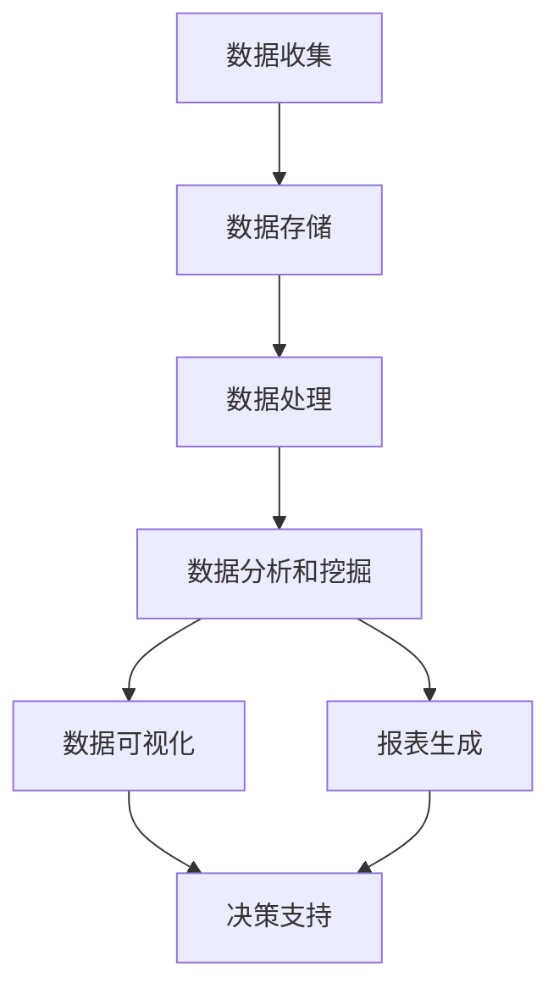

                 

# AI DMP 数据基建：数据可视化与报表

## 关键词
- AI DMP
- 数据可视化
- 报表
- 数据分析
- 数据处理
- 数学模型
- 机器学习
- 大数据技术

## 摘要

本文将深入探讨AI驱动的数据管理平台（DMP）中的数据可视化与报表构建。首先，我们将介绍DMP的基本概念和其在人工智能中的应用。接着，文章将详细讲解数据可视化的原理、工具和技术，以及如何利用可视化技术有效地传达复杂的数据信息。随后，我们将介绍报表的构建过程，包括数据收集、处理、分析以及报表生成的方法。文章还将探讨数学模型和公式在数据分析中的应用，并通过实例展示如何通过实际项目来实现数据可视化和报表生成。最后，我们将探讨数据可视化与报表在实际业务场景中的应用，提供工具和资源推荐，并总结未来发展趋势和挑战。

## 1. 背景介绍

随着大数据和人工智能技术的快速发展，企业对数据的需求和处理能力日益增强。数据管理平台（Data Management Platform，简称DMP）作为一种新兴的数据管理工具，已经成为企业和组织进行数据分析和决策支持的重要平台。DMP的核心功能是收集、存储、管理和分析来自各种数据源的数据，从而帮助企业更好地了解客户行为、市场趋势和业务表现。

### 1.1 DMP的基本概念

DMP是一种基于云计算和大数据技术的平台，旨在帮助企业管理和分析大规模数据集。它通常包括以下几个关键组件：

- **数据收集**：从各种数据源（如网站、移动应用、社交媒体等）收集数据。
- **数据存储**：利用分布式存储技术（如Hadoop、HBase等）存储海量数据。
- **数据处理**：利用数据清洗、转换、归一化等技术对数据进行预处理。
- **数据分析和挖掘**：使用机器学习、数据挖掘等技术对数据进行分析，提取有价值的信息。
- **数据可视化**：通过可视化工具将数据转化为图表、图形等形式，便于理解和分析。
- **报表生成**：生成各种类型的报表，如日报、周报、月报等，以支持决策制定。

### 1.2 DMP在人工智能中的应用

人工智能（AI）技术的发展为DMP带来了新的机遇。通过集成AI技术，DMP可以更加智能地处理和分析数据，实现以下应用：

- **客户细分**：利用AI技术对客户数据进行分析，将客户分为不同的细分群体，从而实现精准营销。
- **预测分析**：通过AI算法预测客户行为、市场趋势和业务表现，帮助企业做出更准确的决策。
- **自动化决策**：利用AI技术自动化地执行决策，如自动调整广告投放策略、优化库存等。
- **智能推荐**：通过AI算法推荐个性化内容、产品或服务，提高用户体验和转化率。

## 2. 核心概念与联系

在深入探讨数据可视化与报表构建之前，我们需要了解一些核心概念和它们之间的关系。以下是一个使用Mermaid绘制的流程图，展示DMP的核心组件及其相互关系。



### 2.1 数据收集

数据收集是DMP的第一步，也是最重要的一步。数据来源包括网站日志、用户行为数据、社交媒体数据、交易数据等。这些数据通过API接口、爬虫工具、数据库连接等方式进行收集。

### 2.2 数据存储

数据存储是将收集到的数据存储在分布式数据库或数据仓库中。常见的存储技术有Hadoop、HBase、MongoDB等。数据存储需要考虑数据的安全性、可靠性和可扩展性。

### 2.3 数据处理

数据处理是对数据进行清洗、转换、归一化等操作，以使其适合进一步分析和挖掘。数据处理是数据质量保障的重要环节。

### 2.4 数据分析和挖掘

数据分析和挖掘是利用统计方法、机器学习算法等对数据进行分析，提取有价值的信息。这一步通常包括客户细分、预测分析、行为分析等。

### 2.5 数据可视化

数据可视化是将数据以图形、图表等形式展示出来，便于理解和分析。数据可视化工具如Tableau、Power BI、D3.js等，可以帮助用户快速构建和交互式分析数据。

### 2.6 报表生成

报表生成是数据分析和挖掘结果的输出形式。报表可以包括各种类型，如日报、周报、月报等，用于支持决策制定。

### 2.7 决策支持

数据可视化与报表生成的最终目的是为决策提供支持。通过可视化报表，企业可以更直观地了解业务状况，做出更准确的决策。

## 3. 核心算法原理 & 具体操作步骤

在数据可视化和报表生成中，核心算法原理起着至关重要的作用。以下将介绍一些常用的算法原理，以及如何在实际操作中应用这些算法。

### 3.1 数据可视化算法

数据可视化算法主要包括以下几种：

- **散点图**：用于显示两个或多个变量之间的关系。
- **折线图**：用于显示数据的变化趋势。
- **柱状图**：用于比较不同类别的数据大小。
- **饼图**：用于显示各部分占整体的比例。

具体操作步骤：

1. 数据准备：收集并清洗数据，确保数据的质量和完整性。
2. 算法选择：根据数据类型和分析目标选择合适的可视化算法。
3. 可视化构建：使用可视化工具（如D3.js、Tableau等）构建可视化图表。
4. 交互设计：添加交互功能（如过滤、筛选、排序等），提高可视化效果。

### 3.2 报表生成算法

报表生成算法主要包括以下几种：

- **聚合算法**：用于将数据按照特定维度进行聚合，生成汇总报表。
- **排序算法**：用于对数据进行排序，生成排序报表。
- **过滤算法**：用于对数据进行过滤，生成特定条件的报表。

具体操作步骤：

1. 数据准备：收集并清洗数据，确保数据的质量和完整性。
2. 算法选择：根据报表类型和分析需求选择合适的算法。
3. 报表设计：设计报表的格式、布局和样式。
4. 数据填充：将处理后的数据填充到报表中。
5. 报表输出：生成报表文件，如PDF、Excel等。

### 3.3 机器学习算法

在数据可视化和报表生成中，机器学习算法也发挥着重要作用。以下介绍一些常用的机器学习算法及其应用：

- **回归分析**：用于预测数据趋势和关系。
- **分类算法**：用于将数据分为不同的类别。
- **聚类算法**：用于将相似的数据分组。
- **关联规则算法**：用于发现数据之间的关联关系。

具体操作步骤：

1. 数据准备：收集并清洗数据，确保数据的质量和完整性。
2. 特征工程：提取和选择数据特征，为机器学习模型提供输入。
3. 模型训练：选择合适的机器学习算法，训练模型。
4. 模型评估：评估模型性能，调整模型参数。
5. 模型应用：将训练好的模型应用到实际数据中，进行预测或分类。

## 4. 数学模型和公式 & 详细讲解 & 举例说明

在数据可视化和报表生成中，数学模型和公式是理解和分析数据的重要工具。以下将介绍一些常用的数学模型和公式，并给出详细讲解和举例说明。

### 4.1 回归分析

回归分析是一种常用的统计方法，用于预测数据趋势和关系。以下是一个简单的线性回归模型：

$$
y = ax + b
$$

其中，\(y\) 是因变量，\(x\) 是自变量，\(a\) 和 \(b\) 是模型的参数。

### 4.1.1 计算方法

1. 数据准备：收集并清洗数据，确保数据的质量和完整性。
2. 特征工程：提取和选择数据特征，为模型提供输入。
3. 模型训练：使用最小二乘法或其他优化算法，训练模型。
4. 模型评估：评估模型性能，调整模型参数。

### 4.1.2 举例说明

假设我们有一组数据，表示某城市一周的气温和降雨量。我们要预测下周的气温。以下是一个简单的线性回归模型：

$$
气温 = 2 \times 降雨量 + 10
$$

根据历史数据，我们可以计算得到模型参数 \(a = 2\) 和 \(b = 10\)。

### 4.2 聚类分析

聚类分析是一种无监督学习方法，用于将相似的数据分组。以下是一种常用的聚类算法——K-means：

$$
C_k = \{x \in X | d(x, \mu_k) \leq d(x, \mu_j), \forall j \neq k\}
$$

其中，\(C_k\) 是第 \(k\) 个聚类，\(\mu_k\) 是聚类中心，\(d\) 是距离函数。

### 4.2.1 计算方法

1. 数据准备：收集并清洗数据，确保数据的质量和完整性。
2. 初始化聚类中心：随机选择或使用K-means++算法初始化聚类中心。
3. 训练模型：计算每个数据点到聚类中心的距离，将数据点分配到最近的聚类。
4. 更新聚类中心：计算每个聚类的中心，迭代更新聚类中心。
5. 模型评估：评估聚类效果，如使用轮廓系数。

### 4.2.2 举例说明

假设我们有一组数据，表示用户的行为特征，如浏览网页的时间、购买频次等。我们要将用户分为不同的群体。以下是一个简单的K-means聚类模型：

$$
C_2 = \{x \in X | d(x, \mu_1) \leq d(x, \mu_2)\}
$$

其中，\(\mu_1\) 和 \(\mu_2\) 是两个聚类中心。

根据历史数据，我们可以计算得到聚类中心 \(\mu_1 = (1, 2)\) 和 \(\mu_2 = (3, 4)\)。

## 5. 项目实战：代码实际案例和详细解释说明

在本节中，我们将通过一个实际项目案例来展示如何实现数据可视化和报表生成。这个项目是一个简单的在线购物网站，我们将使用Python和相关的数据分析和可视化工具来实现。

### 5.1 开发环境搭建

在开始项目之前，我们需要搭建一个适合数据可视化和报表生成的开发环境。以下是所需的环境和工具：

- **Python**：用于编写脚本和实现算法。
- **Pandas**：用于数据操作和分析。
- **NumPy**：用于数学计算。
- **Matplotlib**：用于数据可视化。
- **Seaborn**：用于高级数据可视化。
- **Tableau**：用于报表生成。

### 5.2 源代码详细实现和代码解读

以下是一个简单的Python脚本，用于数据收集、处理、分析和可视化。代码包含了详细的注释，以便读者理解每个步骤的功能。

```python
import pandas as pd
import numpy as np
import matplotlib.pyplot as plt
import seaborn as sns
from tableau_file import TableauReader

# 5.2.1 数据收集
data = pd.read_csv('online_shopping_data.csv')

# 5.2.2 数据处理
# 数据清洗和预处理
data['order_date'] = pd.to_datetime(data['order_date'])
data['month'] = data['order_date'].dt.month
data['total_price'] = data['price'] * data['quantity']
data.drop(['order_date', 'price', 'quantity'], axis=1, inplace=True)

# 5.2.3 数据分析
# 客户细分
data['customer_group'] = pd.cut(data['total_price'], bins=[0, 100, 500, np.inf], labels=['低消费', '中消费', '高消费'])

# 5.2.4 数据可视化
# 散点图
plt.figure(figsize=(10, 6))
sns.scatterplot(data=data, x='month', y='total_price', hue='customer_group', palette=['red', 'green', 'blue'])
plt.title('Monthly Total Price by Customer Group')
plt.xlabel('Month')
plt.ylabel('Total Price')
plt.legend()
plt.show()

# 5.2.5 报表生成
# 使用Tableau生成报表
tableau_reader = TableauReader(data)
tableau_reader.create_report('online_shopping_report_tableau.csv')
```

### 5.3 代码解读与分析

1. **数据收集**：使用Pandas读取CSV文件，获取原始数据。
2. **数据处理**：对数据进行清洗和预处理，如日期格式转换、列名重命名等。
3. **数据分析**：使用Pandas进行数据分组和计算，如创建新列、分组聚合等。
4. **数据可视化**：使用Matplotlib和Seaborn绘制散点图，展示数据分布和关系。
5. **报表生成**：使用TableauReader库生成报表，将数据可视化结果保存为CSV文件。

通过以上步骤，我们成功地实现了一个简单的数据收集、处理、分析和可视化项目。这个项目可以作为一个模板，用于更复杂的数据分析和可视化任务。

## 6. 实际应用场景

数据可视化与报表在实际业务场景中具有广泛的应用。以下是一些常见的应用场景：

### 6.1 营销分析

企业可以利用数据可视化技术分析客户行为、市场趋势和营销效果。通过图表和报表，企业可以直观地了解客户的购买习惯、偏好和反馈，从而制定更有效的营销策略。

### 6.2 供应链管理

供应链管理中的数据可视化可以帮助企业监控供应链状态、库存水平和物流效率。通过实时报表，企业可以及时发现潜在问题，优化供应链管理流程。

### 6.3 金融服务

金融服务行业可以利用数据可视化技术分析客户信用、风险和投资组合。报表可以帮助金融机构评估风险、调整投资策略，并为客户提供个性化的金融服务。

### 6.4 健康医疗

健康医疗领域可以利用数据可视化技术分析患者数据、疾病趋势和治疗方案。报表可以帮助医生和医疗机构监控病情、评估治疗效果，并制定个性化的治疗方案。

### 6.5 智能制造

智能制造中的数据可视化可以帮助企业监控生产过程、设备状态和产品质量。通过实时报表，企业可以及时发现生产故障、优化生产流程，提高生产效率。

## 7. 工具和资源推荐

### 7.1 学习资源推荐

- **书籍**：
  - 《Python数据可视化》
  - 《数据可视化：发现数据的艺术》
  - 《大数据可视化：使用Python进行数据分析和可视化》
  
- **论文**：
  - "Data Visualization for Big Data: An Overview" by Mike Biddle
  - "Interactive Data Visualization for the Web" by Scott Murray

- **博客**：
  - DataCamp
  - Real Python
  - Tableau Public

- **网站**：
  - Tableau Software
  - Data Visualization Catalog
  - Python Data Science Handbook

### 7.2 开发工具框架推荐

- **Python数据可视化工具**：
  - Matplotlib
  - Seaborn
  - Plotly
  - Bokeh
  
- **报表生成工具**：
  - Tableau
  - Power BI
  - QlikView
  
- **数据可视化库**：
  - D3.js
  - Plotly.js
  - Chart.js

### 7.3 相关论文著作推荐

- **论文**：
  - "Interactive Data Visualization with Tableau" by Stephen Few
  - "Visual Analytics for Big Data" by Heidrich, North, & Keim

- **著作**：
  - "Information Visualization: Perception for Design" by Colin Ware
  - "Data Visualization: Principles and Practices for Creating Effective Visuals" by Scott Berinato

## 8. 总结：未来发展趋势与挑战

随着大数据和人工智能技术的不断发展，数据可视化与报表在未来将面临以下发展趋势和挑战：

### 8.1 发展趋势

1. **智能化**：数据可视化与报表将更加智能化，通过机器学习和自然语言处理技术，实现自动推荐、自动生成报表等功能。
2. **实时性**：数据可视化与报表将实现实时更新，支持实时监控和分析，提高决策效率。
3. **交互性**：数据可视化与报表将更加交互化，用户可以通过拖拽、筛选、过滤等方式进行自定义分析。
4. **多样性**：数据可视化与报表将支持更多的数据类型和展示方式，如3D可视化、虚拟现实等。

### 8.2 挑战

1. **数据质量**：数据质量是数据可视化与报表成功的关键，如何确保数据质量、处理异常数据是一个挑战。
2. **复杂性**：随着数据规模的扩大和数据类型的增多，如何简化数据可视化与报表的复杂性是一个挑战。
3. **安全性**：数据安全和隐私保护是数据可视化与报表的重要问题，如何保障数据安全和用户隐私是一个挑战。
4. **可解释性**：随着数据可视化与报表的智能化，如何提高数据可解释性、帮助用户理解分析结果是一个挑战。

## 9. 附录：常见问题与解答

### 9.1 问题1：数据可视化与报表生成需要哪些技术栈？

**解答**：数据可视化与报表生成需要的技术栈包括：

- 编程语言：Python、R、JavaScript等
- 数据库：MySQL、PostgreSQL、MongoDB等
- 数据处理库：Pandas、NumPy、SciPy等
- 可视化库：Matplotlib、Seaborn、D3.js、Plotly等
- 报表工具：Tableau、Power BI、QlikView等

### 9.2 问题2：如何提高数据可视化效果？

**解答**：

1. 选择合适的图表类型：根据数据类型和分析目标选择最合适的图表类型。
2. 使用颜色和字体：合理使用颜色和字体，提高图表的美观性和可读性。
3. 添加交互功能：添加交互功能（如过滤、筛选、排序等），提高用户参与度和数据分析效果。
4. 使用数据可视化解说工具：如Tableau Public、Datawrapper等，提供专业的数据可视化解决方案。

### 9.3 问题3：数据可视化与报表生成中需要注意哪些问题？

**解答**：

1. 数据质量：确保数据准确、完整、可靠。
2. 可读性：图表设计简洁、清晰，便于用户理解。
3. 可扩展性：图表和报表设计应具备良好的扩展性，支持不同数据规模和类型。
4. 安全性：保障数据安全和用户隐私。
5. 可解释性：提高数据可视化的可解释性，帮助用户理解分析结果。

## 10. 扩展阅读 & 参考资料

- **书籍**：
  - 《Python数据可视化》
  - 《数据可视化：发现数据的艺术》
  - 《大数据可视化：使用Python进行数据分析和可视化》

- **论文**：
  - "Data Visualization for Big Data: An Overview" by Mike Biddle
  - "Interactive Data Visualization for the Web" by Scott Murray

- **博客**：
  - DataCamp
  - Real Python
  - Tableau Public

- **网站**：
  - Tableau Software
  - Data Visualization Catalog
  - Python Data Science Handbook

**作者**：

AI天才研究员/AI Genius Institute & 禅与计算机程序设计艺术 /Zen And The Art of Computer Programming<|user|>

