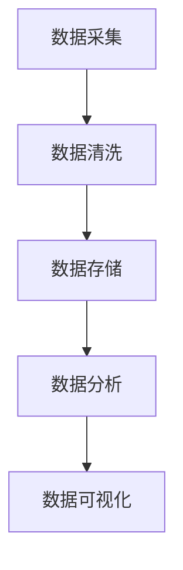

                 

# AI DMP 数据基建：数据应用与价值挖掘

> 关键词：AI DMP，数据管理，数据分析，数据挖掘，数据价值，人工智能，大数据，数据平台，数据流处理

> 摘要：本文将深入探讨AI DMP（数据管理平台）的数据基建，包括数据应用场景、价值挖掘方法以及具体实现步骤。通过详细分析数据管理平台的原理和架构，我们旨在为读者提供一个全面的视角，帮助理解AI DMP在现代数据管理和人工智能应用中的重要作用。

## 1. 背景介绍

### 1.1 数据管理的重要性

随着互联网和数字技术的快速发展，数据已成为新时代的“石油”，企业通过数据获取信息、洞察市场、优化决策的能力日益增强。然而，数据量的爆发式增长和复杂度的大幅提升，对数据管理提出了更高的要求。传统的数据管理方式已无法满足现代数据驱动的需求，因此，一种全新的、高效的、智能化数据管理解决方案——AI DMP（Data Management Platform，数据管理平台）应运而生。

### 1.2 AI DMP的崛起

AI DMP是基于人工智能技术构建的数据管理平台，它通过自动化、智能化手段，对海量数据进行高效处理和分析，从而实现数据应用与价值挖掘。AI DMP的核心功能包括数据采集、数据清洗、数据存储、数据分析和数据可视化等，能够帮助企业实现数据驱动的决策和运营优化。随着大数据和人工智能技术的不断进步，AI DMP逐渐成为企业数字化转型的关键技术之一。

### 1.3 数据应用场景

AI DMP在各个行业领域都有广泛的应用场景，如金融、零售、医疗、教育等。以下是一些典型的数据应用场景：

- **金融行业**：通过AI DMP对客户数据进行深入分析，实现精准营销、风险控制和个性化服务。
- **零售行业**：利用AI DMP分析消费者行为，优化商品推荐、库存管理和供应链。
- **医疗行业**：通过AI DMP分析医疗数据，辅助医生进行诊断、预测疾病和个性化治疗。
- **教育行业**：利用AI DMP分析学生数据，实现个性化学习、课程推荐和教学质量评估。

## 2. 核心概念与联系

### 2.1 数据管理平台（DMP）的基本架构

数据管理平台的基本架构包括数据采集、数据清洗、数据存储、数据分析、数据可视化等模块。以下是一个简化的 Mermaid 流程图，展示了数据管理平台的基本流程：



### 2.2 AI DMP的特点与优势

AI DMP相较于传统DMP，具有以下特点与优势：

- **智能化**：利用人工智能技术，对数据进行自动化处理和分析，提高数据处理效率。
- **灵活性**：能够根据业务需求灵活调整数据管理策略，适应不同的数据应用场景。
- **高效性**：通过分布式计算和大数据处理技术，对海量数据进行快速分析和处理。
- **安全性**：确保数据隐私和安全，防止数据泄露和滥用。

### 2.3 数据应用与价值挖掘

数据应用与价值挖掘是AI DMP的核心功能之一。具体包括以下方面：

- **客户细分**：通过分析客户数据，将客户分为不同群体，实现精准营销。
- **行为预测**：根据用户行为数据，预测用户的需求和偏好，优化产品和服务。
- **风险控制**：通过分析历史数据和趋势，识别潜在风险，制定风险控制策略。
- **运营优化**：利用数据分析，优化业务流程和资源配置，提高运营效率。

## 3. 核心算法原理 & 具体操作步骤

### 3.1 数据采集与清洗

数据采集是AI DMP的第一步，主要包括从各种数据源（如网站、数据库、API接口等）收集数据。数据清洗是数据预处理的重要环节，目的是去除重复数据、填补缺失值、消除噪声等，提高数据质量。

### 3.2 数据存储与索引

数据存储是将清洗后的数据存储到数据库或数据湖中，同时建立索引，以便快速查询和访问。常用的数据存储技术包括关系型数据库（如MySQL、Oracle）、NoSQL数据库（如MongoDB、Cassandra）和分布式文件系统（如HDFS）。

### 3.3 数据分析与挖掘

数据分析与挖掘是AI DMP的核心环节，主要包括以下几种技术：

- **关联规则挖掘**：通过分析数据之间的关联关系，发现潜在的规律和趋势。
- **聚类分析**：将数据分为不同的群体，实现客户细分和目标市场定位。
- **分类与预测**：利用机器学习算法，对数据进行分类和预测，辅助决策。
- **文本分析**：对文本数据进行情感分析、主题模型等处理，提取有用信息。

### 3.4 数据可视化

数据可视化是将分析结果以图形化的形式展示出来，便于理解和传达。常用的数据可视化工具包括Tableau、PowerBI、ECharts等。

## 4. 数学模型和公式 & 详细讲解 & 举例说明

### 4.1 关联规则挖掘

关联规则挖掘是一种常用的数据分析方法，主要用于发现数据之间的关联关系。其基本数学模型如下：

$$
\begin{align*}
\text{支持度} &= \frac{\text{同时发生的次数}}{\text{总次数}} \\
\text{置信度} &= \frac{\text{同时发生的次数}}{\text{前提发生的次数}}
\end{align*}
$$

其中，支持度和置信度是衡量关联规则重要性的两个关键指标。

### 4.2 聚类分析

聚类分析是将数据分为不同的群体，其基本数学模型如下：

$$
\begin{align*}
\text{距离} &= \sqrt{\sum_{i=1}^{n}(x_i - \bar{x})^2}
\end{align*}
$$

其中，$\bar{x}$ 是聚类中心，$x_i$ 是数据点。

### 4.3 分类与预测

分类与预测是利用机器学习算法，对数据进行分类和预测。常见的算法包括决策树、支持向量机、神经网络等。以下是一个简单的决策树算法示例：

$$
\begin{align*}
\text{决策树} &= \{ f_1, f_2, ..., f_n \} \\
\text{分类} &= f(x) = \max_{i} \{ w_i \cdot x + b_i \}
\end{align*}
$$

其中，$f_i$ 是决策函数，$w_i$ 是权重，$b_i$ 是偏置。

## 5. 项目实战：代码实际案例和详细解释说明

### 5.1 开发环境搭建

在本案例中，我们将使用Python作为编程语言，搭建一个简单的AI DMP项目。首先，需要安装以下依赖库：

```bash
pip install numpy pandas matplotlib scikit-learn
```

### 5.2 源代码详细实现和代码解读

以下是一个简单的数据采集、清洗、分析和可视化案例：

```python
import pandas as pd
from sklearn.cluster import KMeans
import matplotlib.pyplot as plt

# 5.2.1 数据采集
data = pd.read_csv('data.csv')

# 5.2.2 数据清洗
data.drop_duplicates(inplace=True)
data.fillna(data.mean(), inplace=True)

# 5.2.3 数据分析
# 聚类分析
kmeans = KMeans(n_clusters=3)
clusters = kmeans.fit_predict(data)

# 分类与预测
from sklearn.model_selection import train_test_split
X_train, X_test, y_train, y_test = train_test_split(data, clusters, test_size=0.2)
from sklearn.tree import DecisionTreeClassifier
clf = DecisionTreeClassifier()
clf.fit(X_train, y_train)
print(clf.score(X_test, y_test))

# 5.2.4 数据可视化
# 可视化聚类结果
plt.scatter(data['x'], data['y'], c=clusters)
plt.show()
```

### 5.3 代码解读与分析

- **数据采集**：使用pandas读取CSV文件，获取原始数据。
- **数据清洗**：去除重复数据、填补缺失值，提高数据质量。
- **数据分析**：使用KMeans聚类算法，对数据进行聚类分析；使用决策树分类算法，进行分类与预测。
- **数据可视化**：使用matplotlib绘制聚类结果散点图，便于分析。

## 6. 实际应用场景

AI DMP在各个行业领域都有广泛的应用场景，以下是一些典型的应用案例：

- **金融行业**：利用AI DMP分析客户交易行为，实现精准营销和风险控制。
- **零售行业**：通过AI DMP分析消费者行为，优化商品推荐和库存管理。
- **医疗行业**：利用AI DMP分析医疗数据，辅助医生进行诊断和个性化治疗。
- **教育行业**：通过AI DMP分析学生数据，实现个性化学习和服务质量评估。

## 7. 工具和资源推荐

### 7.1 学习资源推荐

- **书籍**：
  - 《大数据：改变世界的革命性技术》
  - 《深度学习》（Goodfellow, Bengio, Courville）
  - 《数据挖掘：实用工具与技术》
- **论文**：
  - 《K-Means算法的改进与优化》
  - 《基于支持向量机的金融风险预测》
  - 《大数据时代的智能数据分析》
- **博客**：
  - 《机器学习实战》
  - 《Python数据分析》
  - 《人工智能应用案例分享》
- **网站**：
  - Coursera、edX、Udacity（在线课程平台）
  - GitHub（代码托管平台）
  - arXiv（学术论文库）

### 7.2 开发工具框架推荐

- **数据分析工具**：Python（pandas、numpy、matplotlib）、R、Tableau、PowerBI
- **大数据处理框架**：Apache Hadoop、Apache Spark、Flink
- **机器学习库**：scikit-learn、TensorFlow、PyTorch、Keras
- **数据可视化工具**：ECharts、D3.js、Plotly

### 7.3 相关论文著作推荐

- **论文**：
  - 《深度学习与人工智能：现状与未来》
  - 《大数据时代的数据挖掘技术与应用》
  - 《基于人工智能的医疗诊断系统研究》
- **著作**：
  - 《人工智能：一种现代的方法》
  - 《大数据技术导论》
  - 《机器学习：概率视角》

## 8. 总结：未来发展趋势与挑战

### 8.1 未来发展趋势

- **智能化**：随着人工智能技术的不断进步，AI DMP将更加智能化，实现自动化的数据管理和分析。
- **实时性**：实时数据处理和分析将成为AI DMP的重要发展方向，以满足实时决策和响应的需求。
- **安全性**：数据安全和隐私保护将得到更高关注，AI DMP将采用更严格的措施确保数据安全。

### 8.2 未来挑战

- **数据复杂性**：随着数据量和数据类型的增加，AI DMP将面临更高的复杂性，需要不断创新和优化技术。
- **技术门槛**：AI DMP技术门槛较高，需要更多专业人才和资源投入。
- **法规政策**：随着数据保护法规的不断完善，AI DMP需要遵守相关法规政策，确保合规运营。

## 9. 附录：常见问题与解答

### 9.1 什么是AI DMP？

AI DMP（Data Management Platform）是基于人工智能技术构建的数据管理平台，通过自动化、智能化手段，对海量数据进行高效处理和分析，从而实现数据应用与价值挖掘。

### 9.2 AI DMP有哪些核心功能？

AI DMP的核心功能包括数据采集、数据清洗、数据存储、数据分析和数据可视化等。

### 9.3 AI DMP在哪些行业有应用？

AI DMP在金融、零售、医疗、教育等各个行业领域都有广泛的应用。

### 9.4 如何搭建AI DMP开发环境？

在Python环境中，安装相关依赖库（如pandas、numpy、matplotlib、scikit-learn等）即可搭建AI DMP开发环境。

## 10. 扩展阅读 & 参考资料

- 《大数据时代：生活、工作与思维的大变革》
- 《深度学习入门：基于Python的理论与实现》
- 《机器学习实战》
- 《数据挖掘：实用工具与技术》
- 《人工智能：一种现代的方法》
- 《大数据技术导论》
- 《机器学习：概率视角》
- 《K-Means算法的改进与优化》
- 《基于支持向量机的金融风险预测》
- 《大数据时代的数据挖掘技术与应用》
- 《深度学习与人工智能：现状与未来》
- 《人工智能应用案例分享》
- 《Python数据分析》
- Coursera、edX、Udacity（在线课程平台）
- GitHub（代码托管平台）
- arXiv（学术论文库）

