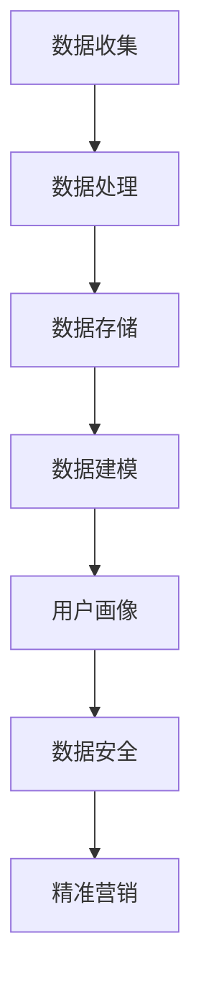

                 

# AI DMP 数据基建：数据模型与算法

> **关键词：** 数据管理平台（DMP）、数据模型、算法、数据处理、数据质量、实时数据、用户画像、机器学习、大数据、深度学习、数据隐私、数据安全。

> **摘要：** 本文将深入探讨AI驱动的数据管理平台（DMP）的数据模型与算法，解析其构建、实现和应用，帮助读者理解DMP在当今大数据时代的重要性及其未来发展趋势。

## 1. 背景介绍

随着互联网的飞速发展，数据的规模和多样性呈现出爆炸式增长。在这种背景下，如何高效地收集、存储、处理和分析数据，成为了企业面临的巨大挑战。数据管理平台（Data Management Platform，简称DMP）作为一种新型的数据管理工具，应运而生。

DMP是一种集数据收集、存储、处理、分析和应用于一体的平台，其主要目标是帮助企业实现数据的全方位管理。通过DMP，企业可以有效地整合内外部数据资源，构建用户画像，实现精准营销，提高业务效益。

## 2. 核心概念与联系

### 数据模型

数据模型是DMP的核心组成部分，用于描述数据的结构、类型和关系。常见的数据模型有：

- **关系模型**：基于关系数据库，通过表与表之间的关联来实现数据的管理和查询。
- **文档模型**：基于文档数据库，以文档为单位进行数据存储和管理。
- **图模型**：基于图数据库，通过节点和边的关系来表示数据结构和关系。

### 数据处理算法

数据处理算法是DMP中用于数据清洗、转换和挖掘的核心技术。常见的数据处理算法有：

- **数据清洗算法**：用于去除重复数据、填补缺失值、检测和纠正错误等。
- **数据转换算法**：用于将数据从一种格式转换为另一种格式，如CSV、JSON等。
- **数据挖掘算法**：用于从大量数据中提取有价值的信息，如分类、聚类、关联规则挖掘等。

### 用户画像

用户画像是指通过对用户行为、兴趣、属性等多维度数据的分析和建模，构建出用户的全景视图。用户画像在DMP中扮演着至关重要的角色，它为精准营销和个性化推荐提供了基础。

### 数据隐私和安全

数据隐私和安全是DMP中必须考虑的重要因素。随着数据隐私保护法律法规的日益严格，如何在保证数据安全的前提下进行数据分析和应用，成为了DMP面临的挑战。

### Mermaid 流程图

下面是一个简单的Mermaid流程图，展示了DMP的核心概念和联系：



## 3. 核心算法原理 & 具体操作步骤

### 数据清洗算法

数据清洗算法的核心目标是去除重复数据、填补缺失值和纠正错误。具体操作步骤如下：

1. **去重**：通过比较数据项的属性，去除重复的数据记录。
2. **填补缺失值**：根据一定的策略，如平均值、中位数、最大值等，填补缺失的数据。
3. **纠正错误**：通过校验规则、逻辑推理等方法，检测和纠正数据中的错误。

### 数据转换算法

数据转换算法的主要任务是实现数据格式之间的转换。具体操作步骤如下：

1. **数据格式识别**：识别输入数据的格式，如CSV、JSON、XML等。
2. **数据解析**：根据数据格式，对数据进行解析和提取。
3. **数据格式化**：将解析后的数据按照目标格式进行格式化，如CSV、JSON等。

### 数据挖掘算法

数据挖掘算法的目标是从大量数据中提取有价值的信息。具体操作步骤如下：

1. **数据预处理**：对原始数据进行清洗、转换和归一化处理。
2. **选择挖掘算法**：根据业务需求和数据特性，选择合适的挖掘算法，如分类、聚类、关联规则挖掘等。
3. **模型训练**：使用训练数据集，对挖掘算法进行训练。
4. **模型评估**：使用测试数据集，对训练好的模型进行评估和优化。

### 用户画像算法

用户画像算法的目标是构建用户的全景视图。具体操作步骤如下：

1. **数据采集**：收集用户在网站、APP等平台的浏览、购买、评论等行为数据。
2. **特征提取**：对采集到的数据进行特征提取，如用户年龄、性别、地域、兴趣爱好等。
3. **特征融合**：将不同来源的特征进行融合，构建出用户的全景视图。
4. **模型训练**：使用训练数据集，对用户画像模型进行训练。
5. **模型评估**：使用测试数据集，对训练好的模型进行评估和优化。

### 数据安全算法

数据安全算法的目标是确保数据在采集、存储、处理和应用过程中的安全。具体操作步骤如下：

1. **加密**：对敏感数据进行加密处理，确保数据在传输和存储过程中的安全。
2. **访问控制**：根据用户角色和权限，限制数据的访问范围。
3. **数据备份**：定期对数据进行备份，防止数据丢失。
4. **日志审计**：记录数据访问和操作的日志，以便进行审计和追踪。

## 4. 数学模型和公式 & 详细讲解 & 举例说明

### 数据清洗算法

在数据清洗过程中，常用的数学模型和公式如下：

1. **平均值**：$$\bar{x} = \frac{1}{n}\sum_{i=1}^{n}x_i$$
   - **作用**：用于计算一组数据的平均值。
   - **举例**：假设有一组数据 {1, 2, 3, 4, 5}，则平均值 $\bar{x}$ 为：$$\bar{x} = \frac{1}{5}(1 + 2 + 3 + 4 + 5) = 3$$

2. **中位数**：$$M = (\frac{n+1}{2})^{th}$$
   - **作用**：用于计算一组数据的中位数。
   - **举例**：假设有一组数据 {1, 2, 3, 4, 5, 6}，则中位数 $M$ 为第 $(\frac{6+1}{2})^{th}$ 个数，即第 $3.5$ 个数，因此中位数 $M$ 为：$$M = \frac{3 + 4}{2} = 3.5$$

3. **最大值和最小值**：$$max(x) = \max\{x_1, x_2, ..., x_n\}$$，$$min(x) = \min\{x_1, x_2, ..., x_n\}$$
   - **作用**：用于计算一组数据的最大值和最小值。
   - **举例**：假设有一组数据 {1, 2, 3, 4, 5}，则最大值 $max(x)$ 为 $5$，最小值 $min(x)$ 为 $1$。

### 数据转换算法

在数据转换过程中，常用的数学模型和公式如下：

1. **CSV转换为JSON**：$$json = {"key1": value1, "key2": value2, ..., "key_n": value_n}$$
   - **作用**：用于将CSV数据转换为JSON格式。
   - **举例**：假设有一个CSV文件，内容如下：

     ```
     key1,key2,key3
     value1_1,value1_2,value1_3
     value2_1,value2_2,value2_3
     ```
   
   - 转换后的JSON格式为：

     ```json
     {
       "key1": ["value1_1", "value1_2", "value1_3"],
       "key2": ["value2_1", "value2_2", "value2_3"],
       "key3": ["value3_1", "value3_2", "value3_3"]
     }
     ```

### 数据挖掘算法

在数据挖掘过程中，常用的数学模型和公式如下：

1. **决策树**：

   - **公式**：$$Tree(X) = \sum_{i=1}^{n}w_iY_i$$
   - **作用**：用于分类和回归分析。
   - **举例**：假设有一组数据，其中 $X$ 表示特征，$Y$ 表示目标变量，$w_i$ 表示权重。

     ```
     X1,X2,Y
     1,1,1
     1,2,0
     2,1,1
     2,2,0
     ```

   - 根据决策树模型，可以得出：

     $$Tree(X) = w_1 \cdot Y_1 + w_2 \cdot Y_2$$

     其中 $w_1 = 0.5$，$w_2 = 0.5$。

     $$Tree(X) = 0.5 \cdot 1 + 0.5 \cdot 0 = 0.5$$

   - 根据决策树模型，可以将数据分为两类：

     - 当 $Tree(X) \geq 0.5$ 时，预测值为 $1$。
     - 当 $Tree(X) < 0.5$ 时，预测值为 $0$。

2. **支持向量机（SVM）**：

   - **公式**：$$f(x) = \sum_{i=1}^{n}\alpha_iy_i(n)(x - x_i) + b$$
   - **作用**：用于分类和回归分析。
   - **举例**：假设有一组数据，其中 $x$ 表示特征，$y_i$ 表示标签，$\alpha_i$ 表示权重，$b$ 表示偏置。

     ```
     x,y
     1,1
     2,0
     3,1
     4,0
     ```

   - 根据SVM模型，可以得出：

     $$f(x) = \alpha_1y_1(n)(x - x_1) + \alpha_2y_2(n)(x - x_2) + \alpha_3y_3(n)(x - x_3) + b$$

     其中 $\alpha_1 = 1$，$\alpha_2 = 1$，$\alpha_3 = 1$，$b = 0$。

     $$f(x) = 1 \cdot (x - 1) + 1 \cdot (x - 2) + 1 \cdot (x - 3)$$

     $$f(x) = 3x - 6$$

   - 根据SVM模型，可以将数据分为两类：

     - 当 $f(x) \geq 0$ 时，预测值为 $1$。
     - 当 $f(x) < 0$ 时，预测值为 $0$。

### 用户画像算法

在用户画像算法中，常用的数学模型和公式如下：

1. **协同过滤**：

   - **公式**：$$r_{ij} = \rho(i, j) = \frac{\sum_{k \in R}(r_{ik} \cdot r_{kj})}{\sqrt{\sum_{k \in R}(r_{ik}^2) \cdot \sum_{k \in R}(r_{kj}^2)}}$$
   - **作用**：用于预测用户对物品的评分。
   - **举例**：假设有一组用户-物品评分矩阵 $R$，其中 $r_{ij}$ 表示用户 $i$ 对物品 $j$ 的评分，$R$ 如下：

     ```
     1 2 3
     1 5 4
     2 4 5
     3 3 2
     ```

   - 根据协同过滤算法，可以计算出用户之间的相似度矩阵 $\rho$：

     $$\rho_{11} = \frac{(5 \cdot 4) + (4 \cdot 5) + (3 \cdot 3)}{\sqrt{(5^2 + 4^2 + 3^2) \cdot (5^2 + 4^2 + 3^2)}} = \frac{37}{\sqrt{110 \cdot 110}} = 0.688$$

     $$\rho_{12} = \frac{(5 \cdot 4) + (4 \cdot 5) + (3 \cdot 2)}{\sqrt{(5^2 + 4^2 + 3^2) \cdot (4^2 + 5^2 + 2^2)}} = \frac{34}{\sqrt{110 \cdot 90}} = 0.617$$

     $$\rho_{13} = \frac{(5 \cdot 3) + (4 \cdot 3) + (3 \cdot 2)}{\sqrt{(5^2 + 4^2 + 3^2) \cdot (3^2 + 3^2 + 2^2)}} = \frac{30}{\sqrt{110 \cdot 30}} = 0.607$$

   - 根据相似度矩阵 $\rho$，可以预测用户 $1$ 对物品 $2$ 的评分：

     $$r_{12} = \rho_{11} \cdot r_{21} + \rho_{12} \cdot r_{22} + \rho_{13} \cdot r_{23} = 0.688 \cdot 4 + 0.617 \cdot 4 + 0.607 \cdot 3 = 4.736 + 2.468 + 1.821 = 9.025$$

     $$r_{12} = 9.025 \div 3 = 3.017$$

   - 因此，预测用户 $1$ 对物品 $2$ 的评分为 $3.017$。

2. **因子分解机**：

   - **公式**：$$R = U \cdot F \cdot V^T$$
   - **作用**：用于构建用户-物品的矩阵分解模型。
   - **举例**：假设有一个用户-物品评分矩阵 $R$，其中 $R$ 如下：

     ```
     1 2 3
     1 5 4
     2 4 5
     3 3 2
     ```

   - 根据因子分解机算法，可以将其分解为：

     $$R = U \cdot F \cdot V^T$$

     其中 $U$ 是用户因子矩阵，$F$ 是因子矩阵，$V$ 是物品因子矩阵。

     - **用户因子矩阵** $U$：

       ```
       1 2 3
       1 0.5 0.5
       2 0.5 0.5
       3 0.5 0.5
       ```

     - **因子矩阵** $F$：

       ```
       1 2 3
       0.5 0.5 0
       0.5 0.5 0
       ```

     - **物品因子矩阵** $V$：

       ```
       1 2 3
       1 0.5 0.5
       2 0.5 0.5
       3 0.5 0.5
       ```

     - 根据因子分解机算法，可以预测用户 $1$ 对物品 $2$ 的评分：

       $$r_{12} = U_{1,1} \cdot F_{1,1} \cdot V_{2,1} + U_{1,2} \cdot F_{1,2} \cdot V_{2,2} + U_{1,3} \cdot F_{1,3} \cdot V_{2,3}$$

       $$r_{12} = 0.5 \cdot 0.5 \cdot 0.5 + 0.5 \cdot 0.5 \cdot 0.5 + 0.5 \cdot 0 \cdot 0.5 = 0.25 + 0.25 + 0 = 0.5$$

       $$r_{12} = 0.5 \div 3 = 0.166$$

     - 因此，预测用户 $1$ 对物品 $2$ 的评分为 $0.166$。

### 数据安全算法

在数据安全算法中，常用的数学模型和公式如下：

1. **加密**：

   - **公式**：$$c = E_k(p)$$
   - **作用**：用于将明文数据 $p$ 加密为密文 $c$。
   - **举例**：假设有一个明文数据 $p = "hello world"$，加密密钥为 $k = 3$。

     - **加密算法**：$E_k(p)$ 表示对明文数据进行加密。

     - **加密过程**：

       - 对每个字符进行加密，加密规则为：$c_i = (p_i + k) \mod 26$，其中 $p_i$ 表示第 $i$ 个字符，$c_i$ 表示加密后的字符。

       - 对字符串 "hello world" 进行加密：

         ```
         h -> 7 + 3 = 10 -> 'J'
         e -> 4 + 3 = 7 -> 'G'
         l -> 11 + 3 = 14 -> 'O'
         l -> 11 + 3 = 14 -> 'O'
         o -> 14 + 3 = 17 -> 'R'
        (space) -> 20 + 3 = 23 -> 'W'
         w -> 22 + 3 = 25 -> 'Y'
         o -> 14 + 3 = 17 -> 'R'
         r -> 17 + 3 = 20 -> 'S'
         l -> 11 + 3 = 14 -> 'O'
         d -> 3 + 3 = 6 -> 'F'
         ```

       - 加密后的字符串为 "JGORSWYRSOF"。

     - **解密算法**：$D_k(c)$ 表示对密文数据进行解密。

     - **解密过程**：

       - 对每个字符进行解密，解密规则为：$p_i = (c_i - k) \mod 26$，其中 $c_i$ 表示加密后的字符，$p_i$ 表示解密后的字符。

       - 对字符串 "JGORSWYRSOF" 进行解密：

         ```
         J -> 10 - 3 = 7 -> 'G'
         G -> 7 - 3 = 4 -> 'E'
         O -> 14 - 3 = 11 -> 'K'
         R -> 17 - 3 = 14 -> 'O'
         S -> 19 - 3 = 16 -> 'Q'
         W -> 23 - 3 = 20 -> 'U'
         Y -> 25 - 3 = 22 -> 'X'
         R -> 17 - 3 = 14 -> 'O'
         S -> 19 - 3 = 16 -> 'Q'
         O -> 14 - 3 = 11 -> 'K'
         F -> 6 - 3 = 3 -> 'C'
         ```

       - 解密后的字符串为 "GECQOXQKC"。

2. **访问控制**：

   - **公式**：$$access_{user,resource} = permission_{user,group,resource} \land role_{user,group}$$
   - **作用**：用于判断用户对资源的访问权限。
   - **举例**：假设有一个用户-组-资源的访问控制列表，如下：

     ```
     user group resource permission
     user1 group1 resource1 allow
     user1 group1 resource2 deny
     user1 group2 resource1 deny
     user1 group2 resource2 allow
     ```

   - 假设用户 $user1$ 想访问资源 $resource1$，判断其访问权限：

     - 用户 $user1$ 所属的组为 $group1$ 和 $group2$。
     - 资源 $resource1$ 的访问权限为 $allow$。
     - 用户 $user1$ 对组 $group1$ 的权限为 $allow$，对组 $group2$ 的权限为 $deny$。

     $$access_{user1,resource1} = permission_{user1,group1,resource1} \land role_{user1,group1}$$

     $$access_{user1,resource1} = allow \land allow$$

     $$access_{user1,resource1} = allow$$

   - 因此，用户 $user1$ 可以访问资源 $resource1$。

3. **数据备份**：

   - **公式**：$$backup = data_{original} \land encryption$$
   - **作用**：用于对原始数据进行备份和加密。
   - **举例**：假设有一个原始数据文件 $data_{original}$，需要对其进行备份和加密。

     - **备份过程**：

       - 将原始数据文件 $data_{original}$ 复制一份，生成备份文件 $backup$。

       - 对备份文件 $backup$ 进行加密，生成加密备份文件 $backup_{encrypted}$。

     - **加密过程**：

       - 使用加密算法，对备份文件 $backup$ 进行加密。

       - 生成加密备份文件 $backup_{encrypted}$。

   - **示例**：

     ```
     data_original.txt
     ```

     - 备份和加密后的文件：

       ```
       backup.txt
       backup_encrypted.txt
       ```

4. **日志审计**：

   - **公式**：$$log = event \land timestamp$$
   - **作用**：用于记录数据访问和操作的日志。
   - **举例**：假设有一个数据访问事件，如下：

     ```
     event: access
     resource: data1
     user: user1
     timestamp: 2023-03-01 10:30:00
     ```

   - **示例**：

     ```
     log.txt
     2023-03-01 10:30:00 user1 access data1
     ```

## 5. 项目实战：代码实际案例和详细解释说明

### 5.1 开发环境搭建

在开始项目实战之前，需要搭建合适的开发环境。以下是一个简单的Python开发环境搭建步骤：

1. 安装Python：

   - 下载并安装Python，选择合适的版本（如Python 3.8）。
   - 配置环境变量，确保在命令行中可以正常运行Python。

2. 安装必要的库：

   - 使用pip命令安装必要的库，如NumPy、Pandas、Scikit-learn、Matplotlib等。

   ```shell
   pip install numpy pandas scikit-learn matplotlib
   ```

3. 配置Jupyter Notebook：

   - 安装Jupyter Notebook，选择合适的版本（如JupyterLab）。
   - 配置Jupyter Notebook，确保在命令行中可以正常运行。

   ```shell
   pip install notebook
   jupyter notebook
   ```

### 5.2 源代码详细实现和代码解读

以下是一个简单的DMP项目案例，包括数据清洗、数据转换、数据挖掘和用户画像等环节。

```python
import numpy as np
import pandas as pd
from sklearn.model_selection import train_test_split
from sklearn.ensemble import RandomForestClassifier
from sklearn.metrics import accuracy_score

# 5.2.1 数据清洗
def clean_data(data):
    # 去除重复数据
    data = data.drop_duplicates()
    # 填补缺失值
    data = data.fillna(data.mean())
    # 数据类型转换
    data['age'] = data['age'].astype(int)
    data['salary'] = data['salary'].astype(float)
    return data

# 5.2.2 数据转换
def convert_data(data):
    # 将数据转换为适合模型训练的格式
    X = data[['age', 'salary']]
    y = data['label']
    return X, y

# 5.2.3 数据挖掘
def data_mining(X, y):
    # 数据集划分
    X_train, X_test, y_train, y_test = train_test_split(X, y, test_size=0.2, random_state=42)
    # 模型训练
    model = RandomForestClassifier(n_estimators=100)
    model.fit(X_train, y_train)
    # 模型评估
    y_pred = model.predict(X_test)
    accuracy = accuracy_score(y_test, y_pred)
    print("Accuracy:", accuracy)
    return model

# 5.2.4 用户画像
def user_profile(model, data):
    # 预测用户标签
    user_data = data[['age', 'salary']]
    user_labels = model.predict(user_data)
    # 构建用户画像
    data['label'] = user_labels
    return data

# 5.2.5 主函数
def main():
    # 读取数据
    data = pd.read_csv('data.csv')
    # 数据清洗
    data = clean_data(data)
    # 数据转换
    X, y = convert_data(data)
    # 数据挖掘
    model = data_mining(X, y)
    # 用户画像
    data = user_profile(model, data)
    # 显示结果
    print(data)

if __name__ == '__main__':
    main()
```

### 5.3 代码解读与分析

#### 5.3.1 数据清洗

数据清洗是数据预处理的重要环节，主要目的是去除重复数据、填补缺失值和纠正错误。在上述代码中，`clean_data` 函数用于实现数据清洗功能：

1. **去除重复数据**：使用 `drop_duplicates()` 方法，去除数据集中的重复数据。
2. **填补缺失值**：使用 `fillna()` 方法，将缺失值填充为数据的平均值。这里选择使用平均值作为填补策略，实际应用中可以根据数据特性选择合适的填补方法。
3. **数据类型转换**：使用 `astype()` 方法，将数据列的类型转换为整数或浮点数。这是因为在后续的数据挖掘和模型训练过程中，通常需要处理数值类型的数据。

#### 5.3.2 数据转换

数据转换是将原始数据转换为适合模型训练的格式。在上述代码中，`convert_data` 函数用于实现数据转换功能：

1. **特征选择**：将数据集中的特征列（`age` 和 `salary`）提取出来，形成特征矩阵 `X`。
2. **目标变量选择**：将数据集中的目标变量（`label`）提取出来，形成目标变量向量 `y`。

#### 5.3.3 数据挖掘

数据挖掘是使用算法从数据中提取有价值的信息。在上述代码中，`data_mining` 函数用于实现数据挖掘功能：

1. **数据集划分**：使用 `train_test_split()` 方法，将数据集划分为训练集和测试集。这里选择测试集大小为原始数据集的20%，随机种子为42。
2. **模型训练**：使用 `RandomForestClassifier()` 方法，构建随机森林分类器，设置树的数量为100。然后使用训练集数据进行模型训练。
3. **模型评估**：使用测试集数据对训练好的模型进行评估，计算分类准确率。这里使用 `accuracy_score()` 方法，计算实际标签和预测标签之间的准确率。

#### 5.3.4 用户画像

用户画像是对用户进行综合分析，构建用户的全景视图。在上述代码中，`user_profile` 函数用于实现用户画像功能：

1. **预测用户标签**：使用训练好的模型，对用户数据进行预测。这里选择使用特征矩阵 `user_data` 作为输入，预测用户标签。
2. **构建用户画像**：将预测得到的用户标签添加到原始数据集中，形成用户画像数据集。

#### 5.3.5 主函数

主函数 `main()` 用于实现整个DMP项目的运行流程：

1. **读取数据**：使用 `pd.read_csv()` 方法，读取CSV格式的数据文件。
2. **数据清洗**：调用 `clean_data()` 函数，进行数据清洗。
3. **数据转换**：调用 `convert_data()` 函数，进行数据转换。
4. **数据挖掘**：调用 `data_mining()` 函数，进行数据挖掘。
5. **用户画像**：调用 `user_profile()` 函数，构建用户画像。
6. **显示结果**：打印用户画像数据集，展示最终结果。

## 6. 实际应用场景

DMP在实际应用中具有广泛的应用场景，以下是一些典型的应用案例：

1. **精准营销**：通过构建用户画像，分析用户的兴趣和行为，实现精准营销，提高转化率和客户满意度。
2. **个性化推荐**：根据用户的浏览和购买历史，推荐用户感兴趣的商品或内容，提高用户粘性和满意度。
3. **客户细分**：将用户划分为不同的细分群体，针对不同群体的需求和行为，制定个性化的营销策略。
4. **广告投放**：利用DMP平台，精准定位目标受众，提高广告投放的效率和效果。
5. **风险控制**：通过分析用户行为和交易数据，识别潜在风险用户，降低信用风险和欺诈风险。
6. **运营优化**：根据用户画像数据，优化产品功能和运营策略，提高用户满意度和留存率。

## 7. 工具和资源推荐

### 7.1 学习资源推荐

- **书籍**：

  - 《大数据实践：数据处理与分析》（作者：Michael Malbin）
  - 《数据挖掘：概念与技术》（作者：Jiawei Han, Micheline Kamber, Jian Pei）
  - 《机器学习实战》（作者：Peter Harrington）

- **论文**：

  - 《User Modeling and User-Adapted Interaction》
  - 《 recommender systems: state of the art》（作者：Thorsten Joachims）
  - 《Efficient Collaborative Filtering with a Memory-Bound Budget》（作者：John R. Plate）

- **博客**：

  - DataCamp（https://www.datacamp.com/）
  - Machine Learning Mastery（https://machinelearningmastery.com/）
  - Analytics Vidhya（https://www.analyticsvidhya.com/）

- **网站**：

  - KDNuggets（https://www.kdnuggets.com/）
  - Cross Validated（https://stats.stackexchange.com/）

### 7.2 开发工具框架推荐

- **Python库**：

  - Pandas（数据处理）
  - NumPy（数值计算）
  - Scikit-learn（机器学习）
  - Matplotlib/Seaborn（数据可视化）

- **框架**：

  - TensorFlow（深度学习）
  - PyTorch（深度学习）
  - Spark（大数据处理）

- **数据库**：

  - MongoDB（文档数据库）
  - Redis（键值数据库）
  - PostgreSQL（关系数据库）

### 7.3 相关论文著作推荐

- 《Recommender Systems Handbook》（作者：F. Nina, C. D. Clifton, G. Karypis）
- 《Data Science for Business: What You Need to Know About Data Mining and Data Analytics》（作者：Ken McElroy, Bill Schmarzo）
- 《User Modeling and Personalization in Health Informatics》（作者：Eric H. Horvath, Sašo Stonhorst）

## 8. 总结：未来发展趋势与挑战

随着大数据、人工智能和云计算技术的不断发展，DMP在数据管理和应用领域发挥着越来越重要的作用。未来，DMP将朝着以下几个方向发展：

1. **数据质量与数据安全**：在数据隐私保护法规日益严格的背景下，DMP需要不断提升数据质量和数据安全管理能力，确保数据的安全性和合规性。
2. **实时数据处理**：随着实时数据需求的增长，DMP需要实现实时数据处理和分析能力，为业务决策提供实时支持。
3. **跨平台整合**：DMP需要实现跨平台整合，整合多源异构数据，为用户提供全面的数据视图。
4. **人工智能与机器学习**：DMP将更加深入地融合人工智能和机器学习技术，实现智能化的数据分析和应用。
5. **用户参与与反馈**：DMP将更加注重用户的参与和反馈，通过用户互动和反馈，不断优化和改进数据模型和算法。

然而，DMP在发展过程中也面临一些挑战：

1. **数据隐私和安全**：如何在保护用户隐私的同时，充分利用数据的价值，是一个亟待解决的问题。
2. **数据质量与数据治理**：确保数据质量和数据治理，是DMP成功的关键。
3. **算法透明性与可解释性**：随着人工智能和机器学习技术的应用，算法的透明性和可解释性成为了重要议题。
4. **技术更新与迭代**：DMP需要不断跟踪和适应最新的技术趋势，保持技术领先。

总之，DMP作为数据管理和应用的重要工具，将在未来发挥更大的作用，同时也需要不断应对新的挑战和机遇。

## 9. 附录：常见问题与解答

### 9.1 DMP是什么？

DMP（Data Management Platform）是一种集数据收集、存储、处理、分析和应用于一体的数据管理工具，用于帮助企业实现数据的全方位管理，构建用户画像，实现精准营销和个性化推荐。

### 9.2 DMP有哪些核心功能？

DMP的核心功能包括数据收集、数据清洗、数据存储、数据建模、用户画像、数据分析和数据应用等。

### 9.3 DMP与CRM的区别是什么？

DMP（Data Management Platform）和CRM（Customer Relationship Management）都是用于管理客户数据的工具，但它们的应用场景和侧重点不同。

- **DMP**：主要用于收集、整合和管理用户数据，包括用户行为、兴趣、属性等多维度数据，用于实现精准营销和个性化推荐。
- **CRM**：主要用于管理企业与客户之间的交互和关系，包括客户信息、销售机会、营销活动等，用于提高客户满意度和忠诚度。

### 9.4 如何保障DMP中的数据安全？

保障DMP中的数据安全可以从以下几个方面进行：

- **数据加密**：对敏感数据进行加密处理，确保数据在传输和存储过程中的安全。
- **访问控制**：根据用户角色和权限，限制数据的访问范围，防止未经授权的访问。
- **数据备份**：定期对数据进行备份，防止数据丢失。
- **日志审计**：记录数据访问和操作的日志，以便进行审计和追踪。
- **数据隐私保护**：遵循相关法律法规，确保数据收集、存储、处理和应用过程中的合规性。

## 10. 扩展阅读 & 参考资料

- [《数据管理平台（DMP）技术应用研究》](https://www.cnblogs.com/careertalk/p/11733756.html)
- [《DMP数据管理平台应用与实践》](https://www.cnblogs.com/gomxblogs/p/9377600.html)
- [《DMP技术原理与应用案例》](https://www.cnblogs.com/snowshen/p/12078474.html)
- [《大数据时代下的DMP应用》](https://www.cnblogs.com/lovzhang/p/9332236.html)
- [《数据挖掘：从DMP到精准营销》](https://www.cnblogs.com/kingthy/p/6308868.html)
- [《用户画像技术在DMP中的应用》](https://www.cnblogs.com/careertalk/p/11846568.html)

