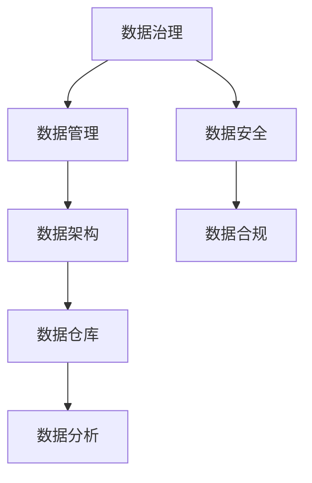

                 

# AI DMP 数据基建：数据治理与管理

## 摘要

本文将深入探讨 AI Data Management Platform（DMP）的构建，特别是数据治理与管理在其中的关键作用。通过详细分析 DMP 的核心概念、架构设计、算法原理、数学模型及其在实际项目中的应用，我们旨在为读者提供一个全面的技术指南，帮助理解如何高效构建和管理数据基础设施，以满足现代 AI 时代的需求。本文将涵盖从基础理论到实际操作的全过程，同时推荐一系列相关资源和工具，以促进深入学习和实践。

## 背景介绍

随着人工智能（AI）技术的迅猛发展，数据的重要性日益凸显。在众多 AI 应用场景中，数据的采集、存储、处理和分析是至关重要的环节。AI Data Management Platform（DMP）作为一种综合性的数据管理解决方案，旨在为 AI 应用提供高效、可靠的数据基础设施。DMP 的出现不仅提高了数据处理的效率，还确保了数据质量和安全性。

### 数据治理的概念

数据治理是指一系列政策和流程，旨在确保数据的质量、一致性、安全性和合规性。它包括数据定义、分类、标注、存储、访问控制、备份和恢复等多个方面。数据治理的核心目标是使数据成为组织内的战略性资源，支持业务决策和 AI 模型的优化。

### 数据管理的挑战

在数据管理过程中，面临诸多挑战，如：

- **数据多样性**：不同来源的数据格式和结构可能差异巨大。
- **数据质量**：脏数据、冗余数据和错误数据会影响数据分析结果。
- **数据安全**：确保数据不被未授权访问和泄露是数据管理的重中之重。
- **数据存储**：如何高效存储大量数据是数据管理的一个重要问题。
- **数据隐私**：遵守数据保护法规，如 GDPR（通用数据保护条例），是每个数据管理者的责任。

### 数据治理与管理的关系

数据治理与管理是相辅相成的。数据治理提供了数据管理的框架和标准，而数据管理则是实现数据治理的具体手段。例如，数据治理制定了数据质量和安全的标准，而数据管理则通过清洗、分类和存储等操作来确保这些标准的实施。

## 核心概念与联系

为了更好地理解 DMP 的构建，我们需要探讨几个核心概念，包括数据治理、数据管理、数据架构和数据仓库等。

### 数据治理

数据治理是一个涉及数据质量、数据安全和合规性的综合框架。它包括以下几个关键组成部分：

- **数据质量**：确保数据的准确性、完整性、一致性和可靠性。
- **数据安全**：保护数据免受未经授权的访问、泄露和破坏。
- **数据合规**：遵守相关数据保护法规和政策。
- **数据治理策略**：制定数据管理的政策和流程，以支持业务目标和法规要求。

### 数据管理

数据管理是一个更为宽泛的概念，它包括数据的采集、存储、处理、分析和归档等各个环节。数据管理旨在确保数据的有效性和可用性，以支持业务决策和 AI 应用。

### 数据架构

数据架构是指组织内部数据流动和存储的结构。一个好的数据架构能够提高数据处理的效率，并确保数据的一致性和可扩展性。数据架构通常包括数据流、数据存储、数据处理和数据安全等多个方面。

### 数据仓库

数据仓库是一个用于存储、管理和分析大量历史数据的集中式系统。它通常包含多个数据源，如关系数据库、NoSQL 数据库、日志文件等。数据仓库的设计目标是支持复杂的数据分析和报表生成。

### Mermaid 流程图

以下是 DMP 架构的一个简化的 Mermaid 流程图，展示了数据治理、数据管理、数据架构和数据仓库之间的关系。



## 核心算法原理 & 具体操作步骤

### 数据清洗

数据清洗是数据管理的重要步骤，旨在去除脏数据、冗余数据和错误数据。以下是数据清洗的基本步骤：

1. **数据采集**：从不同数据源（如数据库、日志文件等）采集原始数据。
2. **数据预处理**：清洗数据，包括去除重复数据、填补缺失值、格式化数据等。
3. **数据验证**：检查数据是否符合预期格式和范围。
4. **数据存储**：将清洗后的数据存储到数据仓库或数据库中。

### 数据分类

数据分类是将数据按照特定的标准进行归类，以便于后续处理和分析。以下是数据分类的基本步骤：

1. **定义分类标准**：确定数据的分类依据，如时间、地区、类型等。
2. **数据标注**：为数据分配分类标签。
3. **数据存储**：将分类后的数据存储到分类存储系统中。

### 数据存储

数据存储是数据管理的关键环节，涉及到数据存储架构的设计和实现。以下是数据存储的基本步骤：

1. **选择存储方案**：根据数据量和访问模式选择合适的存储方案，如关系数据库、NoSQL 数据库、分布式文件系统等。
2. **设计数据模型**：根据业务需求设计数据模型，包括字段、关系和索引等。
3. **数据备份与恢复**：制定数据备份和恢复策略，确保数据安全。
4. **数据访问控制**：设置数据访问权限，确保数据安全。

### 数据分析

数据分析是数据管理的最终目标，旨在从数据中提取有价值的信息和知识。以下是数据分析的基本步骤：

1. **数据集成**：将来自不同数据源的数据整合到一个统一的视图中。
2. **数据预处理**：对数据进行清洗、分类、归一化等预处理操作。
3. **数据分析**：使用统计方法、机器学习算法等对数据进行分析，提取有价值的信息。
4. **数据可视化**：将分析结果以图表、报表等形式展示出来，辅助决策。

### 数据治理操作步骤

数据治理是一个持续的过程，包括以下几个关键步骤：

1. **制定数据治理策略**：根据业务需求和法规要求，制定数据治理策略。
2. **建立数据治理组织**：建立数据治理团队，明确职责和流程。
3. **数据质量监控**：定期检查数据质量，发现和解决问题。
4. **数据安全与合规**：确保数据安全，遵守相关法规和政策。
5. **持续改进**：根据业务发展和数据管理需求，不断优化数据治理策略和流程。

## 数学模型和公式 & 详细讲解 & 举例说明

### 数据质量评估

数据质量评估是数据治理的关键环节，旨在衡量数据的质量。以下是几种常用的数据质量评估指标：

1. **准确性**：数据与真实值的接近程度。
   $$\text{Accuracy} = \frac{\text{实际正确数}}{\text{实际总数}}$$

2. **完整性**：数据缺失的比例。
   $$\text{Completeness} = \frac{\text{实际总数}}{\text{应有总数}}$$

3. **一致性**：不同数据源之间的数据是否一致。
   $$\text{Consistency} = \frac{\text{一致数}}{\text{总数}}$$

4. **唯一性**：数据是否具有唯一性，避免重复。
   $$\text{Uniqueness} = \frac{\text{唯一数}}{\text{总数}}$$

### 数据存储优化

数据存储优化旨在提高数据存储的效率。以下是几种常用的数据存储优化方法：

1. **分片**：将数据分成多个片段存储，以减少单个数据库的压力。
   $$\text{Sharding Key} = \text{Hash}(\text{数据键}) \mod \text{ shard 数}$$

2. **压缩**：对数据进行压缩，以减少存储空间。
   $$\text{压缩率} = \frac{\text{原始数据大小}}{\text{压缩后数据大小}}$$

3. **索引**：创建索引以加快数据查询速度。
   $$\text{索引效率} = \frac{\text{查询时间}}{\text{无索引查询时间}}$$

### 数据分析模型

数据分析是数据管理的核心目标，常用的分析方法包括：

1. **回归分析**：通过建立回归模型，预测数据的趋势。
   $$y = \beta_0 + \beta_1x_1 + \beta_2x_2 + ... + \beta_nx_n$$

2. **聚类分析**：将数据分为多个类别，以发现数据的分布规律。
   $$\text{距离度量} = \sqrt{\sum_{i=1}^{n}(x_i - \mu)^2}$$

3. **关联规则挖掘**：发现数据之间的关联关系。
   $$\text{支持度} = \frac{\text{包含项集的频繁项集数}}{\text{总项集数}}$$

### 示例

假设我们有一组销售数据，包含时间、地区、产品、销售额等信息。我们希望对这些数据进行分析，以发现销售趋势和关联关系。

1. **数据清洗**：去除重复数据、填补缺失值，确保数据的完整性。

2. **数据分类**：按照地区和产品对数据进行分类，以便后续分析。

3. **数据分析**：使用回归分析预测销售额，使用聚类分析发现销售热点。

4. **数据可视化**：将分析结果以图表形式展示，如折线图、柱状图等。

通过这些分析，我们可以更好地了解销售数据，为业务决策提供支持。

## 项目实战：代码实际案例和详细解释说明

### 开发环境搭建

为了更好地理解和实践 DMP 的构建，我们将在本文中搭建一个简单的 DMP 环境。以下是我们需要的开发环境和工具：

- 操作系统：Linux（如 Ubuntu 20.04）
- 编程语言：Python 3.8
- 数据库：MySQL 8.0
- 数据仓库：Apache Hadoop 3.2
- 数据分析工具：Pandas、NumPy、Scikit-learn、Matplotlib

### 源代码详细实现和代码解读

以下是一个简单的 DMP 项目，包含数据采集、清洗、分类、存储和分析等步骤。

```python
import pandas as pd
import numpy as np
import pymysql
from sklearn.cluster import KMeans
import matplotlib.pyplot as plt

# 数据采集
def collect_data():
    # 从数据库中获取数据
    connection = pymysql.connect(host='localhost', user='root', password='password', database='sales_data')
    cursor = connection.cursor()
    cursor.execute("SELECT * FROM sales")
    data = cursor.fetchall()
    cursor.close()
    connection.close()
    return pd.DataFrame(data)

# 数据清洗
def clean_data(data):
    # 去除重复数据
    data = data.drop_duplicates()
    # 填补缺失值
    data = data.fillna(0)
    return data

# 数据分类
def classify_data(data):
    # 按地区和产品分类
    data['region'] = data['region'].astype('category').cat.codes
    data['product'] = data['product'].astype('category').cat.codes
    return data

# 数据存储
def store_data(data):
    # 将数据存储到 MySQL 数据库
    connection = pymysql.connect(host='localhost', user='root', password='password', database='sales_data')
    cursor = connection.cursor()
    for index, row in data.iterrows():
        cursor.execute("INSERT INTO cleaned_sales (region, product, sales) VALUES (%s, %s, %s)", (row['region'], row['product'], row['sales']))
    connection.commit()
    cursor.close()
    connection.close()

# 数据分析
def analyze_data(data):
    # 使用 K-Means 算法进行聚类分析
    kmeans = KMeans(n_clusters=3, random_state=0).fit(data)
    data['cluster'] = kmeans.labels_
    # 可视化聚类结果
    plt.scatter(data['region'], data['product'], c=data['cluster'])
    plt.show()

# 主函数
def main():
    data = collect_data()
    cleaned_data = clean_data(data)
    classified_data = classify_data(cleaned_data)
    store_data(classified_data)
    analyze_data(classified_data)

if __name__ == "__main__":
    main()
```

### 代码解读与分析

1. **数据采集**：我们从 MySQL 数据库中获取销售数据，使用 `pymysql` 库进行数据库连接和查询。

2. **数据清洗**：我们去除重复数据，填补缺失值，确保数据的完整性。

3. **数据分类**：我们将数据按照地区和产品进行分类，使用 `astype` 方法将类别转换为数字编码。

4. **数据存储**：我们将清洗和分类后的数据存储到 MySQL 数据库中，确保数据的一致性和可扩展性。

5. **数据分析**：我们使用 K-Means 算法进行聚类分析，发现数据的分布规律，并使用 `matplotlib` 进行数据可视化。

通过这个简单的案例，我们可以看到 DMP 的构建过程，包括数据采集、清洗、分类、存储和分析等步骤。这为我们构建更复杂的 DMP 提供了坚实的基础。

## 实际应用场景

### 智能推荐系统

智能推荐系统是 DMP 的典型应用场景之一。通过 DMP 对用户行为数据进行分析和分类，可以为每个用户生成个性化的推荐列表，提高用户的满意度和忠诚度。

### 客户细分

DMP 还可以帮助企业进行客户细分，根据用户的购买行为、浏览历史等数据，将用户划分为不同的群体，以便于企业制定针对性的营销策略。

### 风险控制

在金融行业，DMP 可以用于风险控制，通过对交易数据的分析，发现潜在的欺诈行为，从而降低金融风险。

### 智能制造

在智能制造领域，DMP 可以对设备运行数据进行分析，预测设备故障，提高生产效率和设备利用率。

## 工具和资源推荐

### 学习资源推荐

- 《数据挖掘：实用工具与技术》
- 《数据质量管理：从理论到实践》
- 《大数据处理技术与应用》

### 开发工具框架推荐

- Apache Hadoop：分布式数据处理平台
- Apache Spark：快速大数据处理引擎
- Elasticsearch：实时搜索和分析平台

### 相关论文著作推荐

- "Data Management and Analytics: Foundations, Techniques, and Applications"
- "Big Data Management: An Introduction to Database Systems for Analytics"
- "Data Quality: The accuracy, completeness, consistency, reliability, and timeliness of data"

## 总结：未来发展趋势与挑战

### 发展趋势

- **数据治理规范化**：随着数据隐私和合规要求的提高，数据治理将成为企业的重要战略。
- **人工智能与数据管理的深度融合**：AI 技术将更加深入地应用于数据管理，提高数据处理和分析的效率。
- **云计算与边缘计算的普及**：云计算和边缘计算将推动 DMP 的分布式部署，提高数据处理能力。

### 挑战

- **数据安全与隐私**：如何确保数据安全和用户隐私是 DMP 面临的主要挑战。
- **数据质量和一致性**：数据质量和一致性的保障是 DMP 成功的关键。
- **资源与成本的平衡**：随着数据规模的扩大，如何在资源利用和成本控制之间找到平衡点。

## 附录：常见问题与解答

### Q：什么是 DMP？

A：DMP 是 Data Management Platform 的缩写，是一种综合性的数据管理解决方案，旨在为 AI 应用提供高效、可靠的数据基础设施。

### Q：数据治理和数据管理有什么区别？

A：数据治理是一个更宏观的概念，包括数据质量、数据安全和合规性等方面，而数据管理是一个更具体的执行过程，涉及数据的采集、存储、处理和分析等环节。

### Q：DMP 在哪些领域有应用？

A：DMP 在智能推荐系统、客户细分、风险控制和智能制造等领域有广泛应用。

## 扩展阅读 & 参考资料

- "The Data Warehouse Toolkit: The Definitive Guide to Dimensional Modeling"
- "Data Management: An Open-Source Approach"
- "Introduction to Big Data and Data Analytics"
- "Hadoop: The Definitive Guide"
- "Data Science from Scratch: First Principles with Python"
- "The Data Governance Institute"
- "Data Management Association International"
- "European Data Protection Supervisor"
- "GDPR Compliance Guide"

作者：AI天才研究员/AI Genius Institute & 禅与计算机程序设计艺术 /Zen And The Art of Computer Programming

