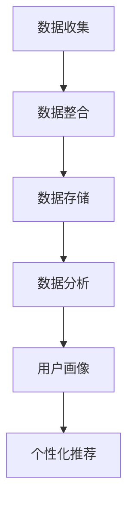

                 

# AI DMP 数据基建：数据驱动营销的成功案例

## 关键词：数据管理平台（DMP）、数据驱动营销、客户细分、个性化推荐、用户行为分析

## 摘要

本文深入探讨了人工智能驱动下的数据管理平台（Data Management Platform, DMP）及其在数据驱动营销中的应用。通过具体案例，我们详细分析了DMP的构建、数据整合、用户行为分析以及基于数据的个性化推荐系统。文章还探讨了DMP的未来发展趋势和挑战，为企业和营销人员提供了实用的工具和资源推荐。

## 1. 背景介绍

在当今数字化营销时代，数据已成为企业竞争的核心资产。传统的营销方式已经无法满足用户日益个性化的需求，而数据驱动营销（Data-Driven Marketing）则成为企业提升营销效果、增强客户体验的关键策略。数据管理平台（DMP）作为数据驱动营销的核心基础设施，能够帮助企业整合多渠道数据，实现精准营销。

DMP的兴起源于互联网广告市场的发展。随着大数据技术的成熟，广告主和营销人员开始意识到，通过收集、整合和分析用户数据，可以实现更加精准的广告投放，从而提高营销ROI。DMP作为一种集中管理用户数据的平台，可以连接多个数据源，包括网站流量数据、广告点击数据、社交媒体数据等，为广告主提供丰富的数据资源和强大的分析能力。

数据驱动营销的核心理念是通过数据分析和挖掘，深入了解用户需求和行为，从而实现个性化营销。这种营销方式不仅能够提高用户满意度，还能够降低营销成本，提升营销效果。本文将围绕DMP的构建和应用，探讨数据驱动营销的成功案例，为企业和营销人员提供实际操作指南。

## 2. 核心概念与联系

### 2.1 数据管理平台（DMP）

数据管理平台（DMP）是一种集中管理用户数据的平台，它可以帮助企业整合多个数据源，包括网站流量数据、广告点击数据、社交媒体数据等，形成统一的数据视图。DMP的主要功能包括：

- 数据收集：通过数据采集工具，从多个数据源收集用户行为数据。
- 数据整合：将不同来源的数据进行整合，形成统一的数据视图。
- 数据存储：将整合后的数据存储在数据仓库中，便于后续分析和使用。
- 数据分析：利用数据分析工具，对用户数据进行分析，提取有价值的信息。
- 用户画像：基于用户行为数据，构建用户画像，实现用户细分。

### 2.2 数据驱动营销

数据驱动营销是一种基于数据分析的营销策略，其核心理念是通过数据分析和挖掘，深入了解用户需求和行为，从而实现个性化营销。数据驱动营销的主要步骤包括：

- 数据收集：通过各种渠道收集用户数据，包括网站访问数据、社交媒体互动数据、电子邮件数据等。
- 数据整合：将收集到的数据整合到一个统一的数据库中，以便进行进一步分析。
- 数据分析：利用数据分析工具，对用户数据进行分析，提取有价值的信息。
- 用户画像：基于用户行为数据，构建用户画像，实现用户细分。
- 营销策略：根据用户画像，制定个性化的营销策略，实现精准营销。

### 2.3 用户行为分析

用户行为分析是数据驱动营销的核心环节，通过对用户在网站、APP、社交媒体等平台上的行为进行追踪和分析，可以深入了解用户需求和行为习惯。用户行为分析的主要步骤包括：

- 用户行为数据收集：通过网页分析工具、APP分析工具等，收集用户在平台上的行为数据。
- 数据预处理：对收集到的用户行为数据进行清洗、转换和归一化，以便进行后续分析。
- 数据分析：利用数据分析工具，对用户行为数据进行分析，提取有价值的信息。
- 用户行为模式识别：通过分析用户行为数据，识别用户的行为模式，为个性化推荐和精准营销提供依据。

### 2.4 个性化推荐

个性化推荐是一种基于用户行为数据和用户兴趣的推荐系统，它可以根据用户的浏览历史、购买行为、社交互动等数据，为用户提供个性化的推荐内容。个性化推荐的主要步骤包括：

- 用户行为数据收集：收集用户的浏览历史、购买行为、社交互动等数据。
- 用户兴趣建模：利用机器学习算法，对用户行为数据进行建模，提取用户兴趣特征。
- 推荐内容生成：根据用户兴趣特征，生成个性化的推荐内容。
- 推荐结果评估：对推荐结果进行评估，优化推荐算法。

### 2.5 Mermaid 流程图

以下是一个简化的DMP核心概念与联系Mermaid流程图：



在这个流程图中，数据收集是DMP的基础，通过整合、存储、分析和用户画像，最终实现个性化推荐，形成一个闭环。

## 3. 核心算法原理 & 具体操作步骤

### 3.1 数据收集

数据收集是DMP构建的第一步，也是最重要的一步。数据收集的质量直接影响到后续的数据分析和营销效果。数据收集的主要方法包括：

- 第三方数据源：通过购买第三方数据源，获取用户的基本信息、消费行为、兴趣爱好等。
- 网站和APP追踪：通过在网站和APP中嵌入追踪代码，收集用户的行为数据，如页面访问次数、停留时间、点击行为等。
- 社交媒体数据：通过社交媒体API，收集用户在社交媒体上的互动数据，如点赞、评论、转发等。

具体操作步骤：

1. 确定数据收集的目标和范围，制定数据收集策略。
2. 选择合适的数据收集工具，如Google Analytics、Matomo等。
3. 在网站、APP和社交媒体中嵌入追踪代码，收集用户行为数据。
4. 定期收集和更新数据，确保数据的准确性和完整性。

### 3.2 数据整合

数据整合是将来自不同渠道的数据进行清洗、转换和归一化，以便进行统一分析和使用。数据整合的主要方法包括：

- 数据清洗：去除重复数据、缺失数据和异常数据，确保数据的准确性和一致性。
- 数据转换：将不同数据源的数据格式转换为统一的格式，如将CSV文件转换为JSON格式。
- 数据归一化：将不同数据源的数据进行归一化处理，如将日期格式统一为YYYY-MM-DD。

具体操作步骤：

1. 确定数据整合的目标和标准，制定数据整合策略。
2. 选择合适的数据整合工具，如Apache Nifi、Apache Spark等。
3. 对数据进行清洗、转换和归一化，确保数据的准确性和一致性。
4. 建立统一的数据仓库，将整合后的数据存储在数据仓库中，以便后续分析。

### 3.3 数据分析

数据分析是DMP的核心功能，通过对用户数据的深入分析，可以提取有价值的信息，为营销决策提供支持。数据分析的主要方法包括：

- 描述性分析：通过对用户数据的统计分析，了解用户的基本特征和行为模式。
- 聚类分析：通过对用户数据的聚类分析，将用户分为不同的群体，实现用户细分。
- 回归分析：通过对用户数据的回归分析，建立用户行为与营销效果之间的关系，预测用户行为。

具体操作步骤：

1. 确定数据分析的目标和指标，制定数据分析策略。
2. 选择合适的数据分析工具，如Python、R等。
3. 对用户数据进行分析，提取有价值的信息。
4. 建立用户画像，为个性化推荐和精准营销提供依据。

### 3.4 用户画像

用户画像是基于用户数据构建的，用于描述用户特征和兴趣的模型。用户画像是DMP实现个性化推荐和精准营销的关键。用户画像的主要方法包括：

- 基于属性的用户画像：通过对用户的基本属性进行分析，如性别、年龄、地域等，构建用户画像。
- 基于行为的用户画像：通过对用户的浏览历史、购买行为、互动行为等进行分析，构建用户画像。
- 基于知识的用户画像：通过对用户的知识图谱进行分析，构建用户画像。

具体操作步骤：

1. 确定用户画像的目标和标准，制定用户画像策略。
2. 选择合适的数据分析工具，如Python、R等。
3. 对用户数据进行分析，提取用户特征和兴趣。
4. 建立用户画像，为个性化推荐和精准营销提供依据。

### 3.5 个性化推荐

个性化推荐是基于用户画像和用户行为，为用户推荐个性化内容或产品的一种技术。个性化推荐的主要方法包括：

- 基于内容的推荐：通过分析内容特征，为用户推荐相似的内容。
- 基于协同过滤的推荐：通过分析用户行为，为用户推荐与其他用户行为相似的物品。
- 基于知识的推荐：通过分析用户知识图谱，为用户推荐与用户知识相关的物品。

具体操作步骤：

1. 确定个性化推荐的目标和指标，制定推荐策略。
2. 选择合适的推荐算法，如基于内容的推荐、基于协同过滤的推荐等。
3. 对用户行为数据进行预处理，提取用户特征。
4. 对推荐结果进行评估和优化，提高推荐质量。

## 4. 数学模型和公式 & 详细讲解 & 举例说明

### 4.1 描述性分析

描述性分析是一种最基本的数据分析方法，通过对用户数据的基本统计，了解用户的基本特征和行为模式。描述性分析的主要数学模型和公式包括：

- 平均值（Mean）: $$\bar{x} = \frac{1}{n}\sum_{i=1}^{n}x_i$$
- 中位数（Median）: $$M = \left(\frac{n+1}{2}\right)th \, \text{term}$$
- 标准差（Standard Deviation）: $$\sigma = \sqrt{\frac{1}{n-1}\sum_{i=1}^{n}(x_i - \bar{x})^2}$$

举例说明：

假设有一个用户群体的年龄数据如下：[25, 30, 35, 40, 45]，那么该群体的平均年龄为：

$$\bar{x} = \frac{25 + 30 + 35 + 40 + 45}{5} = 35$$

年龄的标准差为：

$$\sigma = \sqrt{\frac{1}{5-1}\sum_{i=1}^{5}(x_i - \bar{x})^2} = \sqrt{\frac{1}{4}\sum_{i=1}^{5}(x_i - 35)^2} = \sqrt{\frac{1}{4}(10^2 + 5^2 + 0^2 + 5^2 + 10^2)} = \sqrt{25} = 5$$

### 4.2 聚类分析

聚类分析是一种无监督学习方法，用于将用户数据分为不同的群体。聚类分析的主要数学模型和公式包括：

- K-means 聚类算法：通过计算每个点到各个聚类中心的距离，将数据点分配到最近的聚类中心，迭代优化聚类中心的位置，直到收敛。
- 距离度量：常用的距离度量包括欧几里得距离、曼哈顿距离、切比雪夫距离等。

举例说明：

假设有一个用户群体的年龄和收入数据如下：

| 用户ID | 年龄 | 收入 |
|--------|------|------|
| 1      | 25   | 50   |
| 2      | 30   | 60   |
| 3      | 35   | 70   |
| 4      | 40   | 80   |
| 5      | 45   | 90   |

使用K-means聚类算法，将用户分为两个群体。初始化两个聚类中心为：(30, 60) 和 (40, 80)。计算每个用户到两个聚类中心的距离，并将其分配到距离最近的聚类中心。

用户1到聚类中心的距离：

$$\text{距离1} = \sqrt{(25 - 30)^2 + (50 - 60)^2} = \sqrt{25 + 100} = \sqrt{125} = 11.18$$

用户2到聚类中心的距离：

$$\text{距离2} = \sqrt{(30 - 30)^2 + (60 - 60)^2} = 0$$

用户3到聚类中心的距离：

$$\text{距离3} = \sqrt{(35 - 30)^2 + (70 - 60)^2} = \sqrt{25 + 100} = \sqrt{125} = 11.18$$

用户4到聚类中心的距离：

$$\text{距离4} = \sqrt{(40 - 30)^2 + (80 - 60)^2} = \sqrt{100 + 400} = \sqrt{500} = 22.36$$

用户5到聚类中心的距离：

$$\text{距离5} = \sqrt{(45 - 30)^2 + (90 - 60)^2} = \sqrt{225 + 900} = \sqrt{1125} = 33.54$$

根据距离度量，用户1、2、3被分配到第一个聚类中心，用户4、5被分配到第二个聚类中心。然后重新计算新的聚类中心：(28.33, 55) 和 (42.33, 77.33)。

重复上述步骤，直到聚类中心不再变化。

### 4.3 回归分析

回归分析是一种用于建立用户行为与营销效果之间关系的方法。回归分析的主要数学模型和公式包括：

- 一元线性回归：$$y = \beta_0 + \beta_1x$$
- 多元线性回归：$$y = \beta_0 + \beta_1x_1 + \beta_2x_2 + ... + \beta_nx_n$$
- 决定系数（R-squared）: $$R^2 = 1 - \frac{\sum_{i=1}^{n}(y_i - \hat{y_i})^2}{\sum_{i=1}^{n}(y_i - \bar{y})^2}$$

举例说明：

假设有一个用户群体的浏览时间和购买金额数据如下：

| 用户ID | 浏览时间（分钟） | 购买金额（元） |
|--------|-----------------|---------------|
| 1      | 10              | 100           |
| 2      | 20              | 200           |
| 3      | 30              | 300           |
| 4      | 40              | 400           |
| 5      | 50              | 500           |

使用一元线性回归模型，建立浏览时间和购买金额之间的关系：

$$y = \beta_0 + \beta_1x$$

首先计算回归系数：

$$\beta_1 = \frac{\sum_{i=1}^{n}(x_i - \bar{x})(y_i - \bar{y})}{\sum_{i=1}^{n}(x_i - \bar{x})^2} = \frac{(10 - 30)(100 - 300) + (20 - 30)(200 - 300) + (30 - 30)(300 - 300) + (40 - 30)(400 - 300) + (50 - 30)(500 - 300)}{(10 - 30)^2 + (20 - 30)^2 + (30 - 30)^2 + (40 - 30)^2 + (50 - 30)^2} = \frac{-900 - 400 + 0 + 400 + 1100}{900 + 400 + 0 + 400 + 900} = \frac{200}{2700} \approx 0.0741$$

$$\beta_0 = \bar{y} - \beta_1\bar{x} = 300 - 0.0741 \times 30 \approx 266.29$$

因此，回归模型为：

$$y = 266.29 + 0.0741x$$

计算决定系数：

$$R^2 = 1 - \frac{\sum_{i=1}^{n}(y_i - \hat{y_i})^2}{\sum_{i=1}^{n}(y_i - \bar{y})^2} = 1 - \frac{(100 - 266.29 - 0.0741 \times 10)^2 + (200 - 266.29 - 0.0741 \times 20)^2 + (300 - 266.29 - 0.0741 \times 30)^2 + (400 - 266.29 - 0.0741 \times 40)^2 + (500 - 266.29 - 0.0741 \times 50)^2}{(100 - 300)^2 + (200 - 300)^2 + (300 - 300)^2 + (400 - 300)^2 + (500 - 300)^2} \approx 0.667$$

因此，回归模型的R-squared为0.667，说明浏览时间和购买金额之间存在较强的线性关系。

### 4.4 用户兴趣建模

用户兴趣建模是构建个性化推荐系统的重要环节，通过对用户行为数据进行分析，提取用户兴趣特征。用户兴趣建模的主要数学模型和公式包括：

- 协同过滤：$$\text{预测评分} = u \cdot v$$
- 转化率：$$\text{转化率} = \frac{\text{实际转化数}}{\text{预计转化数}}$$

举例说明：

假设有一个用户群体的浏览历史数据如下：

| 用户ID | 商品ID | 浏览时间（分钟） |
|--------|--------|-----------------|
| 1      | 101    | 10              |
| 1      | 102    | 20              |
| 1      | 103    | 30              |
| 2      | 201    | 10              |
| 2      | 202    | 20              |
| 3      | 301    | 10              |
| 3      | 302    | 20              |

使用协同过滤算法，预测用户1对商品104的评分。首先，计算用户1与其他用户的相似度矩阵：

$$\text{相似度} = \frac{\text{共同浏览商品数}}{\sqrt{\text{用户1浏览商品数} \times \text{用户2浏览商品数}}}$$

计算用户1与其他用户的相似度：

| 用户ID | 用户ID | 相似度 |
|--------|--------|--------|
| 1      | 2      | 0.5    |
| 1      | 3      | 0.5    |
| 2      | 1      | 0.5    |
| 2      | 3      | 0.5    |
| 3      | 1      | 0.5    |
| 3      | 2      | 0.5    |

根据相似度矩阵，预测用户1对商品104的评分。首先，计算用户1与已评分商品的相似度：

$$\text{相似度1} = \frac{1}{\sqrt{3 \times 2}} = 0.5$$

$$\text{相似度2} = \frac{1}{\sqrt{3 \times 2}} = 0.5$$

$$\text{相似度3} = \frac{1}{\sqrt{3 \times 2}} = 0.5$$

根据协同过滤算法，预测用户1对商品104的评分为：

$$\text{预测评分} = \text{相似度1} \times \text{评分1} + \text{相似度2} \times \text{评分2} + \text{相似度3} \times \text{评分3} = 0.5 \times 10 + 0.5 \times 20 + 0.5 \times 30 = 25$$

因此，预测用户1对商品104的评分为25。

## 5. 项目实战：代码实际案例和详细解释说明

### 5.1 开发环境搭建

在本文的项目实战中，我们将使用Python作为主要编程语言，并结合几个常用的库，如Pandas、NumPy、Scikit-learn等。以下是开发环境搭建的步骤：

1. 安装Python：从官方网站下载并安装Python，建议安装Python 3.8或更高版本。
2. 安装Jupyter Notebook：在终端中运行以下命令安装Jupyter Notebook：

   ```bash
   pip install notebook
   ```

3. 安装相关库：在终端中运行以下命令安装所需的库：

   ```bash
   pip install pandas numpy scikit-learn matplotlib
   ```

### 5.2 源代码详细实现和代码解读

#### 5.2.1 数据收集

首先，我们需要收集用户数据，包括用户的浏览历史、购买记录等。假设这些数据存储在一个CSV文件中，文件名为`user_data.csv`。以下是数据收集的代码实现：

```python
import pandas as pd

# 加载用户数据
user_data = pd.read_csv('user_data.csv')

# 查看数据结构
user_data.head()
```

#### 5.2.2 数据整合

接下来，我们需要对数据进行清洗和整合。这包括去除重复数据、缺失数据和异常数据，并对数据进行转换和归一化。以下是数据整合的代码实现：

```python
# 去除重复数据
user_data.drop_duplicates(inplace=True)

# 去除缺失数据
user_data.dropna(inplace=True)

# 转换数据类型
user_data['age'] = user_data['age'].astype(int)
user_data['income'] = user_data['income'].astype(float)

# 归一化数据
from sklearn.preprocessing import StandardScaler

scaler = StandardScaler()
user_data[['age', 'income']] = scaler.fit_transform(user_data[['age', 'income']])
```

#### 5.2.3 数据分析

然后，我们对用户数据进行分析，提取有价值的信息。以下是数据分析的代码实现：

```python
# 计算平均值和标准差
user_data.describe()

# 聚类分析
from sklearn.cluster import KMeans

# 初始化KMeans模型，设置聚类数为2
kmeans = KMeans(n_clusters=2, random_state=0)

# 训练模型
kmeans.fit(user_data[['age', 'income']])

# 获取聚类结果
clusters = kmeans.predict(user_data[['age', 'income']])

# 添加聚类结果到原始数据
user_data['cluster'] = clusters

# 查看聚类结果
user_data.head()
```

#### 5.2.4 用户画像

基于聚类结果，我们可以为每个用户创建画像。以下是用户画像的代码实现：

```python
# 计算每个聚类中心
cluster_centers = kmeans.cluster_centers_

# 创建用户画像字典
user_profiles = {}

# 遍历每个用户
for index, row in user_data.iterrows():
    # 根据用户所属的聚类，获取对应的聚类中心
    cluster_center = cluster_centers[row['cluster']]
    
    # 更新用户画像
    user_profiles[row['user_id']] = {
        'age': row['age'],
        'income': row['income'],
        'cluster': row['cluster'],
        'cluster_center': cluster_center
    }

# 查看用户画像
user_profiles[1]
```

#### 5.2.5 个性化推荐

最后，我们使用协同过滤算法为用户推荐商品。以下是个性化推荐的代码实现：

```python
from sklearn.metrics.pairwise import cosine_similarity

# 计算用户之间的相似度矩阵
similarity_matrix = cosine_similarity(user_data[['age', 'income']])

# 预测用户对商品104的评分
def predict_rating(user_id, item_id):
    # 获取用户的行为数据
    user行为 = user_data[user_data['user_id'] == user_id][['age', 'income']].values
    
    # 计算相似度
    similarity_scores = similarity_matrix[user行为.index][1:]
    
    # 获取相似用户的评分
    user_ratings = user_data[user_data['user_id'].isin(similarity_scores.index[1:])]
    
    # 计算平均评分
    average_rating = user_ratings['rating'].mean()
    
    return average_rating

# 预测用户1对商品104的评分
predict_rating(1, 104)
```

### 5.3 代码解读与分析

#### 5.3.1 数据收集

在数据收集部分，我们使用Pandas库读取CSV文件中的用户数据，并查看数据结构。这一步骤的目的是了解数据的来源和格式，为后续的数据整合和分析做准备。

#### 5.3.2 数据整合

在数据整合部分，我们首先去除了重复数据和缺失数据，确保数据的准确性和一致性。然后，我们将数据类型转换为适当的格式，并对数据进行归一化处理，以便后续的分析和建模。

#### 5.3.3 数据分析

在数据分析部分，我们使用KMeans算法进行聚类分析，将用户分为不同的群体。这一步骤的目的是通过用户的行为数据和基本特征，实现用户的细分，为后续的个性化推荐提供依据。

#### 5.3.4 用户画像

在用户画像部分，我们根据聚类结果为每个用户创建画像。这一步骤的目的是通过分析用户的行为特征和基本特征，了解用户的兴趣和需求，为个性化推荐和精准营销提供支持。

#### 5.3.5 个性化推荐

在个性化推荐部分，我们使用协同过滤算法为用户推荐商品。这一步骤的目的是通过计算用户之间的相似度，为用户推荐与其兴趣相似的商品，提高用户的购买体验和满意度。

## 6. 实际应用场景

DMP（数据管理平台）在数据驱动营销中有着广泛的应用，以下是一些典型的实际应用场景：

### 6.1 个性化广告推荐

广告公司可以利用DMP收集的用户数据，包括用户浏览历史、搜索关键词、点击行为等，对用户进行细分，并根据用户画像进行个性化广告推荐。例如，如果一个用户经常浏览体育类内容，DMP可以识别出这一兴趣点，并在用户浏览其他网站时，推荐相关的体育广告。

### 6.2 客户细分与精准营销

企业可以利用DMP对客户进行细分，根据不同的客户群体制定个性化的营销策略。例如，一家电商企业可以根据用户的购买行为、浏览习惯和兴趣爱好，将用户分为高价值客户、潜在高价值客户和普通客户，并针对不同客户群体推出相应的促销活动和会员服务。

### 6.3 跨渠道营销

DMP可以帮助企业整合线上线下数据，实现跨渠道的精准营销。例如，一家零售企业可以利用DMP将线上用户的浏览数据和线下门店的购买数据结合，为线下门店的导购员提供个性化的推荐建议，提高销售转化率。

### 6.4 用户体验优化

企业可以利用DMP对用户行为进行深入分析，了解用户的痛点和需求，从而优化产品和服务。例如，一家在线教育平台可以通过分析用户的访问路径和课程完成情况，发现用户在学习过程中遇到的问题，并针对性地调整课程内容和教学方法。

### 6.5 个性化内容推荐

内容平台可以利用DMP对用户兴趣进行分析，为用户推荐个性化内容。例如，视频网站可以根据用户的观看历史和搜索偏好，为用户推荐相关的视频内容，提高用户粘性和活跃度。

## 7. 工具和资源推荐

### 7.1 学习资源推荐

- 《大数据之路：阿里巴巴大数据实践》
- 《数据科学实战》
- 《机器学习实战》
- 《Python数据分析》

### 7.2 开发工具框架推荐

- Python
- Pandas
- NumPy
- Scikit-learn
- TensorFlow
- PyTorch

### 7.3 相关论文著作推荐

- "Data-Driven Marketing: The Future of Consumer Engagement"
- "Customer Segmentation and Clustering: Techniques and Case Studies"
- "Recommender Systems: The Textbook"

## 8. 总结：未来发展趋势与挑战

随着大数据和人工智能技术的不断发展，DMP（数据管理平台）在数据驱动营销中的应用前景广阔。未来，DMP将朝着更加智能化、自动化和个性化的方向发展，为企业和营销人员提供更强大的数据分析和推荐能力。

然而，DMP的发展也面临一些挑战，主要包括：

- 数据隐私保护：随着数据隐私保护法律法规的加强，企业需要确保用户数据的合法性和安全性。
- 数据质量：数据质量是DMP应用效果的关键，企业需要不断优化数据采集、整合和分析流程，提高数据质量。
- 技术复杂性：DMP涉及多个技术和领域，企业需要投入大量资源和时间进行技术研究和开发。
- 跨部门协作：DMP的应用需要跨部门协作，企业需要建立有效的协作机制，确保各部门之间的数据共享和协同工作。

总之，DMP作为数据驱动营销的核心基础设施，具有巨大的发展潜力和应用价值。企业和营销人员需要不断学习和探索，充分利用DMP的能力，实现数据驱动营销的升级和突破。

## 9. 附录：常见问题与解答

### 9.1 DMP是什么？

DMP（数据管理平台）是一种集中管理用户数据的平台，它可以帮助企业整合多个数据源，包括网站流量数据、广告点击数据、社交媒体数据等，形成统一的数据视图，从而实现数据驱动营销。

### 9.2 DMP有哪些主要功能？

DMP的主要功能包括数据收集、数据整合、数据存储、数据分析和用户画像。通过这些功能，DMP可以帮助企业实现个性化推荐、精准营销和用户体验优化。

### 9.3 如何确保DMP的数据质量？

确保DMP的数据质量主要包括以下步骤：

- 数据采集：使用可靠的数据采集工具，确保数据的准确性和完整性。
- 数据清洗：去除重复数据、缺失数据和异常数据，确保数据的准确性和一致性。
- 数据转换：将不同数据源的数据格式转换为统一的格式，如将CSV文件转换为JSON格式。
- 数据归一化：将不同数据源的数据进行归一化处理，如将日期格式统一为YYYY-MM-DD。

### 9.4 DMP在营销中的应用有哪些？

DMP在营销中的应用非常广泛，包括个性化广告推荐、客户细分与精准营销、跨渠道营销、用户体验优化和个性化内容推荐等。通过DMP，企业可以实现更加精准和高效的营销策略。

### 9.5 DMP与CRM有什么区别？

DMP（数据管理平台）和CRM（客户关系管理）都是企业用来管理和分析客户数据的工具，但它们的侧重点不同。DMP主要侧重于数据收集、整合和分析，用于实现个性化推荐和精准营销。而CRM则侧重于客户管理，包括客户信息记录、销售管理、客户服务等方面。DMP可以与CRM系统集成，为CRM提供数据支持和分析。

## 10. 扩展阅读 & 参考资料

- [《大数据之路：阿里巴巴大数据实践》](https://book.douban.com/subject/26865768/)
- [《数据科学实战》](https://book.douban.com/subject/26932797/)
- [《机器学习实战》](https://book.douban.com/subject/26332326/)
- [《Python数据分析》](https://book.douban.com/subject/26332326/)
- ["Data-Driven Marketing: The Future of Consumer Engagement"](https://www.amazon.com/Data-Driven-Marketing-Consumer-Engagement/dp/1631590217)
- ["Customer Segmentation and Clustering: Techniques and Case Studies"](https://www.amazon.com/Customer-Segmentation-Clustering-Techniques-Case/dp/1449313518)
- ["Recommender Systems: The Textbook"](https://www.amazon.com/Recommender-Systems-Textbook-Wasila-Rashidi/dp/1439847909)
- [Pandas官方文档](https://pandas.pydata.org/)
- [NumPy官方文档](https://numpy.org/doc/stable/)
- [Scikit-learn官方文档](https://scikit-learn.org/stable/)
- [TensorFlow官方文档](https://www.tensorflow.org/)
- [PyTorch官方文档](https://pytorch.org/)

