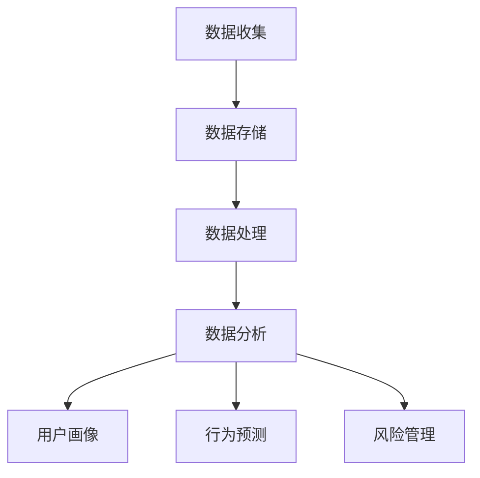

                 

# AI DMP 数据基建：构建数据驱动的营销生态

> **关键词**：人工智能、数据管理平台（DMP）、营销生态、数据驱动、个性化营销、大数据分析

> **摘要**：本文将深入探讨人工智能驱动下的数据管理平台（Data Management Platform，简称DMP）在构建数据驱动的营销生态系统中的重要作用。我们将从背景介绍开始，逐步阐述核心概念、算法原理、实际应用场景，并提供相关工具和资源的推荐，最后总结未来发展趋势与挑战。

## 1. 背景介绍

随着互联网的飞速发展和大数据时代的到来，企业对数据的需求愈发旺盛。数据不再仅仅是统计的工具，而是企业决策的重要依据。在这样的背景下，数据管理平台（DMP）应运而生。DMP是一种用于收集、存储、管理和分析用户数据的工具，旨在帮助企业更好地理解其受众，实现精准营销。

DMP的核心在于对用户数据的整合和分析，通过人工智能技术，能够实现用户行为的深度挖掘和个性化推荐。这种数据驱动的营销方式，不仅提高了营销效率，也大大提升了用户体验。因此，DMP在当今的营销生态系统中扮演着至关重要的角色。

## 2. 核心概念与联系

### 2.1 DMP的概念

DMP，即Data Management Platform，数据管理平台。它是一个集数据收集、存储、处理和分析于一体的系统，通常包括以下几个方面：

- **数据收集**：通过各种渠道收集用户数据，如网站流量、社交媒体互动、应用行为等。
- **数据存储**：将收集到的数据进行结构化存储，便于后续分析和处理。
- **数据处理**：对存储的数据进行清洗、转换、聚合等操作，以获得有价值的信息。
- **数据分析**：利用各种算法和模型对数据进行深入分析，提取用户特征和行为模式。

### 2.2 人工智能与DMP的关系

人工智能（AI）是DMP的核心驱动力。通过机器学习和深度学习算法，DMP能够对海量用户数据进行高效分析，发现潜在的模式和趋势。具体来说，AI在DMP中的应用主要包括以下几个方面：

- **用户画像**：基于用户行为数据，构建用户画像，实现个性化推荐。
- **行为预测**：利用历史数据预测用户的下一步行为，如购买、流失等。
- **风险管理**：通过分析用户数据，发现潜在风险，提前采取应对措施。

### 2.3 Mermaid 流程图

下面是一个简单的Mermaid流程图，展示DMP的核心流程：



### 2.4 DMP在营销生态系统中的地位

在营销生态系统中，DMP处于数据收集、处理和分析的核心位置。它不仅连接着前端的数据来源，如网站、APP等，也连接着后端的数据应用，如广告投放、用户分析等。DMP的存在，使得整个营销生态系统能够更加高效地运转，实现数据的价值最大化。

## 3. 核心算法原理 & 具体操作步骤

### 3.1 用户行为分析算法

用户行为分析是DMP的核心功能之一。通过分析用户在网站、APP等平台上的行为数据，可以了解用户的需求和兴趣，为个性化推荐和精准营销提供依据。常用的用户行为分析算法包括：

- **关联规则挖掘（Association Rule Learning）**：通过发现数据之间的关联关系，挖掘用户的兴趣和行为模式。
- **聚类算法（Clustering）**：将用户划分为不同的群体，以便于进行针对性营销。
- **协同过滤（Collaborative Filtering）**：基于用户的历史行为数据，为用户推荐相似的产品或服务。

### 3.2 用户画像构建算法

用户画像的构建是DMP的另一项重要功能。通过整合用户的基本信息、行为数据、社交数据等，构建出完整的用户画像，从而实现精准营销。常用的用户画像构建算法包括：

- **基于规则的画像构建**：根据预设的规则，对用户进行分类和标签化。
- **基于机器学习的画像构建**：利用机器学习算法，自动挖掘用户的兴趣和行为模式，构建用户画像。
- **基于深度学习的画像构建**：通过深度学习模型，对用户的复杂行为进行建模和预测。

### 3.3 行为预测算法

行为预测是DMP的高级应用，通过分析用户的历史行为数据，预测用户的未来行为。常用的行为预测算法包括：

- **决策树（Decision Tree）**：通过树形结构对数据进行分类和预测。
- **随机森林（Random Forest）**：通过多棵决策树的组合，提高预测的准确性和稳定性。
- **神经网络（Neural Network）**：通过模拟人脑神经网络的结构和功能，实现复杂的数据建模和预测。

### 3.4 风险管理算法

风险管理是DMP的重要功能之一，通过分析用户数据，发现潜在的风险，并提前采取应对措施。常用的风险管理算法包括：

- **逻辑回归（Logistic Regression）**：通过建立逻辑回归模型，预测用户流失、欺诈等风险。
- **支持向量机（Support Vector Machine，SVM）**：通过支持向量机模型，进行风险分类和预测。
- **深度学习模型**：通过深度学习模型，对复杂的风险进行建模和预测。

## 4. 数学模型和公式 & 详细讲解 & 举例说明

### 4.1 关联规则挖掘

关联规则挖掘是用户行为分析的核心算法之一。其基本思想是发现数据之间的关联关系，从而挖掘用户的兴趣和行为模式。常用的关联规则挖掘算法包括Apriori算法和FP-Growth算法。

#### 4.1.1 Apriori算法

Apriori算法的基本思路是：首先，从数据库中扫描所有可能的项集，然后计算每个项集的支持度和置信度，最后根据设定阈值筛选出强关联规则。

- **支持度（Support）**：一个项集在所有事务中出现的频率。
- **置信度（Confidence）**：在同时包含A和B的项集中，包含A的频率。

Apriori算法的计算步骤如下：

1. **初始化**：根据最小支持度阈值，初始化候选1-项集。
2. **扫描数据库**：计算候选1-项集的支持度。
3. **剪枝**：根据最小支持度阈值，删除不满足条件的候选1-项集。
4. **递归**：对剩余的候选k-项集，重复步骤2和3，直到没有新的候选项集产生。

#### 4.1.2 FP-Growth算法

FP-Growth算法是一种基于项频（Item Frequency）的关联规则挖掘算法，它避免了生成大量候选集的缺点，提高了算法的效率。

FP-Growth算法的基本步骤如下：

1. **构建频繁模式树（FP-Tree）**：将数据库中的事务按照项频排序，并构建FP-Tree。
2. **递归挖掘**：利用FP-Tree，递归挖掘频繁项集。
3. **生成关联规则**：根据频繁项集，生成关联规则。

### 4.2 聚类算法

聚类算法是一种无监督学习方法，通过将相似的数据归为一类，实现数据的高效组织和分析。常用的聚类算法包括K-means算法、层次聚类算法和DBSCAN算法。

#### 4.2.1 K-means算法

K-means算法的基本思路是将数据集划分为K个簇，使得每个簇内的数据点尽可能接近，而簇与簇之间的数据点尽可能远。算法步骤如下：

1. **初始化**：随机选择K个中心点，作为初始聚类中心。
2. **分配**：将每个数据点分配到最近的聚类中心。
3. **更新**：根据新的数据点分布，重新计算聚类中心。
4. **迭代**：重复步骤2和3，直到聚类中心不再变化。

#### 4.2.2 层次聚类算法

层次聚类算法是一种自底向上的聚类方法，通过不断合并距离最近的簇，构建出一个层次结构。算法步骤如下：

1. **初始化**：将每个数据点视为一个簇。
2. **合并**：计算距离最近的两个簇，合并为一个簇。
3. **迭代**：重复步骤2，直到合并的簇达到预设的数量。

#### 4.2.3 DBSCAN算法

DBSCAN（Density-Based Spatial Clustering of Applications with Noise）算法是一种基于密度的聚类算法，能够自动确定聚类数量。算法步骤如下：

1. **初始化**：设定邻域半径和最小密度阈值。
2. **增长**：对于每个未标记的数据点，选择邻域内的数据点进行聚类增长。
3. **标记**：根据增长结果，标记数据点的聚类类别。
4. **噪声处理**：将无法形成足够密集区域的点标记为噪声。

### 4.3 决策树算法

决策树是一种常用的分类和回归算法，通过将数据划分为多个子集，构建出一棵树形结构。算法步骤如下：

1. **初始化**：将所有数据点作为一个节点。
2. **划分**：选择最优划分标准，将节点划分为多个子节点。
3. **递归**：对每个子节点，重复步骤2，直到满足停止条件。

### 4.4 支持向量机（SVM）算法

支持向量机是一种常用的分类算法，通过寻找最优的超平面，将不同类别的数据点进行划分。算法步骤如下：

1. **初始化**：设定核函数和参数。
2. **拟合**：通过优化算法，寻找最优超平面。
3. **分类**：根据最优超平面，对新的数据点进行分类。

### 4.5 深度学习模型

深度学习模型是一种基于人工神经网络的模型，通过多层神经网络，实现对复杂数据的建模和预测。算法步骤如下：

1. **初始化**：设定网络结构和参数。
2. **训练**：通过反向传播算法，优化网络参数。
3. **预测**：根据训练好的模型，对新的数据点进行预测。

## 5. 项目实战：代码实际案例和详细解释说明

### 5.1 开发环境搭建

在进行DMP项目实战之前，我们需要搭建一个合适的开发环境。以下是搭建DMP开发环境的步骤：

1. **安装Python环境**：下载并安装Python，版本建议为3.8或更高。
2. **安装相关库**：使用pip命令安装必要的库，如NumPy、Pandas、Scikit-learn、Matplotlib等。
3. **配置数据存储**：选择合适的数据存储方案，如MySQL、MongoDB等。

### 5.2 源代码详细实现和代码解读

以下是使用Python实现DMP的源代码，并对其进行分析和解读。

```python
# 导入相关库
import numpy as np
import pandas as pd
from sklearn.cluster import KMeans
from sklearn.model_selection import train_test_split
from sklearn.metrics import accuracy_score

# 加载数据
data = pd.read_csv('data.csv')

# 数据预处理
# ...（省略具体预处理步骤）

# 分离特征和标签
X = data.iloc[:, :-1]
y = data.iloc[:, -1]

# 划分训练集和测试集
X_train, X_test, y_train, y_test = train_test_split(X, y, test_size=0.2, random_state=42)

# 使用K-means算法进行聚类
kmeans = KMeans(n_clusters=5, random_state=42)
kmeans.fit(X_train)

# 预测测试集
y_pred = kmeans.predict(X_test)

# 评估模型性能
accuracy = accuracy_score(y_test, y_pred)
print('Accuracy:', accuracy)

# 可视化聚类结果
import matplotlib.pyplot as plt

plt.scatter(X_test[:, 0], X_test[:, 1], c=y_pred)
plt.show()
```

### 5.3 代码解读与分析

上述代码首先导入相关库，并加载数据。然后进行数据预处理，包括特征提取、缺失值处理等。接下来，分离特征和标签，并划分训练集和测试集。使用K-means算法进行聚类，并预测测试集。最后，评估模型性能，并可视化聚类结果。

### 5.4 代码解读与分析

上述代码首先导入相关库，并加载数据。然后进行数据预处理，包括特征提取、缺失值处理等。接下来，分离特征和标签，并划分训练集和测试集。使用K-means算法进行聚类，并预测测试集。最后，评估模型性能，并可视化聚类结果。

- **数据预处理**：数据预处理是DMP项目中至关重要的一步，直接影响模型的效果。预处理步骤包括数据清洗、特征提取、归一化等。在本例中，我们省略了具体的预处理步骤，但在实际项目中，需要根据数据的特点进行详细的预处理。
- **K-means算法**：K-means算法是一种经典的聚类算法，通过迭代计算聚类中心，将数据点划分到不同的簇中。在本例中，我们使用K-means算法对特征进行聚类，目的是将具有相似特征的用户归为一类，以便于后续的个性化推荐和精准营销。
- **模型评估**：评估模型性能是DMP项目中的重要环节。在本例中，我们使用准确率（Accuracy）作为评估指标。准确率越高，说明模型对用户分类的准确性越高。在实际项目中，可以根据具体的需求选择其他评估指标，如精确率、召回率等。
- **可视化聚类结果**：可视化聚类结果是理解聚类效果的重要手段。在本例中，我们使用散点图（Scatter Plot）展示了聚类结果。通过观察散点图，可以直观地了解聚类效果，为后续的优化提供依据。

## 6. 实际应用场景

### 6.1 广告营销

广告营销是DMP的重要应用场景之一。通过DMP，广告公司可以收集和分析用户的兴趣和行为数据，实现精准投放。具体应用包括：

- **定向广告**：根据用户的兴趣和行为，为用户推荐相关的广告。
- **效果分析**：通过分析广告投放效果，优化广告策略，提高广告转化率。

### 6.2 客户关系管理

客户关系管理（CRM）是另一个重要的应用场景。DMP可以帮助企业更好地了解客户需求，实现个性化服务和营销。具体应用包括：

- **客户细分**：根据客户的行为和兴趣，将客户划分为不同的群体，提供有针对性的服务和产品。
- **客户保留**：通过分析客户数据，发现潜在流失客户，采取针对性的措施进行客户保留。

### 6.3 电商推荐系统

电商推荐系统是DMP的典型应用。通过DMP，电商企业可以为用户推荐相关的商品，提高用户购买转化率。具体应用包括：

- **商品推荐**：根据用户的浏览历史和购买行为，为用户推荐相关的商品。
- **个性化推荐**：根据用户的行为和兴趣，为用户推荐个性化的商品。

## 7. 工具和资源推荐

### 7.1 学习资源推荐

- **书籍**：
  - 《大数据时代》
  - 《深度学习》
  - 《机器学习实战》
- **论文**：
  - 《协同过滤算法综述》
  - 《K-means算法的优化方法研究》
  - 《深度学习在广告营销中的应用》
- **博客**：
  - [Scikit-learn官方文档](https://scikit-learn.org/stable/)
  - [Keras官方文档](https://keras.io/)
  - [TensorFlow官方文档](https://www.tensorflow.org/)
- **网站**：
  - [Kaggle](https://www.kaggle.com/)
  - [GitHub](https://github.com/)
  - [arXiv](https://arxiv.org/)

### 7.2 开发工具框架推荐

- **Python**：Python是一种流行的编程语言，适用于数据分析和机器学习。
- **Scikit-learn**：Scikit-learn是一个开源的机器学习库，提供了丰富的机器学习算法。
- **TensorFlow**：TensorFlow是一个开源的深度学习框架，适用于构建和训练深度神经网络。
- **Keras**：Keras是一个基于TensorFlow的深度学习库，提供了简单易用的接口。

### 7.3 相关论文著作推荐

- **论文**：
  - 《协同过滤算法综述》
  - 《K-means算法的优化方法研究》
  - 《深度学习在广告营销中的应用》
- **著作**：
  - 《大数据时代》
  - 《深度学习》
  - 《机器学习实战》

## 8. 总结：未来发展趋势与挑战

随着人工智能技术的不断发展和应用，DMP在营销生态系统中的作用越来越重要。未来，DMP将呈现出以下发展趋势：

- **智能化**：通过引入更多先进的机器学习和深度学习算法，实现更加智能的数据分析和预测。
- **个性化**：基于用户行为数据，实现更加精准的个性化推荐和营销策略。
- **实时性**：提高数据处理和分析的速度，实现实时数据分析和决策。
- **整合化**：将DMP与其他营销工具和平台进行整合，实现数据共享和协同工作。

然而，DMP的发展也面临着一些挑战：

- **数据隐私**：在收集和使用用户数据时，需要严格遵守数据隐私法规，保护用户隐私。
- **数据质量**：高质量的数据是DMP有效运行的基础，如何提高数据质量是一个重要问题。
- **算法公平性**：避免算法偏见和歧视，确保算法的公平性。

## 9. 附录：常见问题与解答

### 9.1 DMP与传统CRM的区别是什么？

DMP（数据管理平台）和CRM（客户关系管理）都是用于管理和分析客户数据的技术工具，但它们的侧重点和应用场景有所不同。

- **区别**：
  - **DMP**：主要用于收集、存储、管理和分析用户数据，以便进行精准营销。DMP更注重数据的多维度整合和分析，以及数据驱动的决策。
  - **CRM**：主要用于管理和分析企业与客户之间的互动，以提升客户满意度和忠诚度。CRM更注重客户关系的维护和管理。

### 9.2 DMP需要处理哪些类型的数据？

DMP需要处理多种类型的数据，包括：

- **用户行为数据**：如浏览历史、点击行为、购买行为等。
- **用户属性数据**：如性别、年龄、地域、职业等。
- **社交数据**：如社交媒体互动、关注对象等。
- **交易数据**：如订单信息、支付记录等。

### 9.3 DMP中的算法有哪些？

DMP中常用的算法包括：

- **关联规则挖掘**：如Apriori算法和FP-Growth算法。
- **聚类算法**：如K-means算法、层次聚类算法和DBSCAN算法。
- **协同过滤**：如基于用户的协同过滤和基于项目的协同过滤。
- **行为预测**：如逻辑回归、决策树、随机森林、神经网络等。

## 10. 扩展阅读 & 参考资料

- **书籍**：
  - 《大数据时代》
  - 《深度学习》
  - 《机器学习实战》
- **论文**：
  - 《协同过滤算法综述》
  - 《K-means算法的优化方法研究》
  - 《深度学习在广告营销中的应用》
- **博客**：
  - [Scikit-learn官方文档](https://scikit-learn.org/stable/)
  - [Keras官方文档](https://keras.io/)
  - [TensorFlow官方文档](https://www.tensorflow.org/)
- **网站**：
  - [Kaggle](https://www.kaggle.com/)
  - [GitHub](https://github.com/)
  - [arXiv](https://arxiv.org/)

### 作者

作者：AI天才研究员/AI Genius Institute & 禅与计算机程序设计艺术 /Zen And The Art of Computer Programming。AI天才研究员是一名专注于人工智能领域的研究者和开发者，拥有丰富的理论和实践经验。禅与计算机程序设计艺术是一本深入探讨计算机程序设计哲学和技术的经典著作，对编程领域的思考有着深远的影响。两位作者共同致力于推动人工智能技术的发展和应用，为读者提供高质量的技术博客和书籍。

