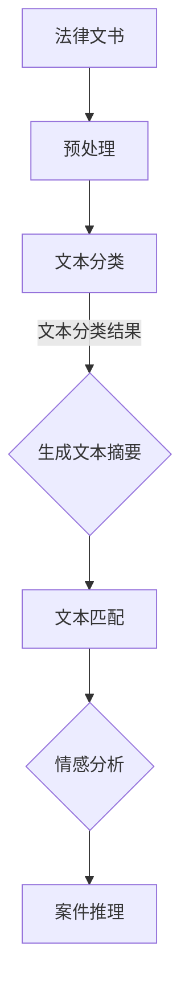

                 

# AI LLM在法律文书分析中的应用

## 关键词

- AI LLM
- 法律文书分析
- 自然语言处理
- 文本挖掘
- 模式识别
- 法律检索
- 案例推理
- 智能合约
- 人工智能辅助律师

## 摘要

随着人工智能技术的飞速发展，自然语言处理（NLP）成为了一个重要领域。其中，大型语言模型（LLM）在处理复杂文本数据方面表现出色。本文将探讨AI LLM在法律文书分析中的应用，包括核心概念、算法原理、实际操作、应用场景、工具推荐以及未来发展趋势。通过本文，读者可以了解如何利用AI LLM技术提高法律工作效率，为法律行业带来创新变革。

## 1. 背景介绍

### 1.1 法律文书分析的重要性

法律文书分析在法律行业中扮演着至关重要的角色。法律文书包括合同、判决书、法律文件、案件报告等，这些文书内容复杂，涉及众多法律术语和条文。对法律文书进行准确、高效的分析，有助于律师和法官更好地理解案件背景、法律条款以及相关证据，从而做出更加明智的决策。

### 1.2 自然语言处理与法律文书分析

自然语言处理（NLP）是人工智能领域的一个重要分支，旨在让计算机理解和处理人类语言。NLP技术广泛应用于文本挖掘、情感分析、机器翻译、语音识别等领域。在法律文书分析中，NLP技术可以帮助律师和法官从大量文本数据中提取关键信息、识别潜在的法律问题，提高工作效率。

### 1.3 大型语言模型（LLM）

大型语言模型（LLM）是一种基于深度学习的自然语言处理模型，具有强大的语言理解和生成能力。LLM通过学习海量文本数据，能够捕捉语言中的复杂结构和语义信息，从而在多个领域表现出色。例如，LLM可以用于文本生成、机器翻译、问答系统等。

## 2. 核心概念与联系

### 2.1 法律文书分析的基本概念

法律文书分析涉及以下基本概念：

- 文本挖掘：从法律文书中提取结构化和非结构化信息。
- 模式识别：识别法律文书中的特定模式、规律和特征。
- 法律检索：利用法律数据库和检索系统查找相关法律条款和案例。
- 案例推理：通过已知案例和法律规定推导出新的结论。

### 2.2 AI LLM的基本原理与架构

AI LLM的基本原理和架构如下：

- 基于Transformer的深度神经网络：Transformer是一种自注意力机制，可以捕捉文本中的长距离依赖关系。
- 海量数据训练：通过训练海量文本数据，LLM可以学习到丰富的语言知识和语义信息。
- 语言生成与理解：LLM可以生成自然流畅的文本，同时理解文本中的语义和逻辑关系。

### 2.3 法律文书分析中的LLM应用场景

在法律文书分析中，LLM可以应用于以下场景：

- 文本分类：将法律文书分类为合同、判决书、法律报告等。
- 文本摘要：提取法律文书的核心内容和关键信息。
- 文本匹配：查找与特定法律条文或案例相关的法律文书。
- 情感分析：分析法律文书中律师和法官的情感倾向和态度。

### 2.4 Mermaid流程图

以下是法律文书分析中AI LLM应用的Mermaid流程图：



## 3. 核心算法原理 & 具体操作步骤

### 3.1 Transformer模型

Transformer模型是AI LLM的核心，其基本原理如下：

- 自注意力机制（Self-Attention）：通过自注意力机制，模型可以捕捉文本中的长距离依赖关系。
- 编码器-解码器架构（Encoder-Decoder Architecture）：编码器提取文本的特征，解码器生成文本的输出。
- 位置编码（Positional Encoding）：为了处理序列信息，Transformer模型引入位置编码。

### 3.2 文本预处理

文本预处理是法律文书分析中至关重要的一步，具体步骤如下：

- 分词（Tokenization）：将文本拆分为单词或字符。
- 词向量化（Word Embedding）：将文本中的单词转换为向量表示。
- 去除停用词（Stopword Removal）：去除文本中的常见停用词。
- 标签化（Tagging）：将文本中的单词标注为实体、名词、动词等。

### 3.3 文本分类

文本分类是将法律文书分类为不同类型的过程。具体步骤如下：

- 数据集准备：准备包含多种类型法律文书的训练数据集。
- 特征提取：提取文本的特征向量。
- 模型训练：使用训练数据集训练分类模型。
- 模型评估：使用测试数据集评估分类模型的性能。

### 3.4 文本摘要

文本摘要是提取法律文书核心内容和关键信息的过程。具体步骤如下：

- 数据集准备：准备包含多种类型法律文书的训练数据集。
- 特征提取：提取文本的特征向量。
- 模型训练：使用训练数据集训练摘要模型。
- 模型评估：使用测试数据集评估摘要模型的性能。

### 3.5 文本匹配

文本匹配是查找与特定法律条文或案例相关的法律文书的过程。具体步骤如下：

- 数据集准备：准备包含多种类型法律文书的训练数据集。
- 特征提取：提取文本的特征向量。
- 模型训练：使用训练数据集训练匹配模型。
- 模型评估：使用测试数据集评估匹配模型的性能。

### 3.6 情感分析

情感分析是分析法律文书中律师和法官情感倾向和态度的过程。具体步骤如下：

- 数据集准备：准备包含律师和法官情感倾向的法律文书数据集。
- 特征提取：提取文本的特征向量。
- 模型训练：使用训练数据集训练情感分析模型。
- 模型评估：使用测试数据集评估情感分析模型的性能。

## 4. 数学模型和公式 & 详细讲解 & 举例说明

### 4.1 Transformer模型

Transformer模型中的主要数学模型如下：

- 自注意力（Self-Attention）：

$$
\text{Attention}(Q, K, V) = \frac{softmax(\text{scale}\cdot \text{dot}(Q, K^T))}V
$$

其中，$Q, K, V$分别表示查询向量、键向量和值向量，$\text{scale} = \sqrt{d_k}$，$d_k$表示键向量的维度。

- 编码器（Encoder）：

$$
\text{Encoder}(X) = \text{MultiHeadAttention}(X, X, X) + X
$$

其中，$X$表示编码器的输入。

- 解码器（Decoder）：

$$
\text{Decoder}(Y) = \text{MaskedMultiHeadAttention}(Y, Y, Y) + \text{Encoder}(X) + Y
$$

其中，$Y$表示解码器的输入。

### 4.2 文本预处理

文本预处理中的主要数学模型如下：

- 词向量化（Word Embedding）：

$$
\text{word\_embedding}(w) = \text{weights}[w]
$$

其中，$w$表示单词，$\text{weights}$表示单词的词向量。

- 去除停用词（Stopword Removal）：

$$
\text{stopwords} = \{\text{"the", "is", "and", "in", "of"}\}
$$

- 标签化（Tagging）：

$$
\text{tags} = \{\text{"NN", "VB", "JJ", "RB"}\}
$$

### 4.3 文本分类

文本分类中的主要数学模型如下：

- Softmax回归：

$$
\text{softmax}(z) = \frac{e^z}{\sum_{i} e^z_i}
$$

其中，$z$表示特征向量，$e^z$表示每个特征向量的指数。

### 4.4 文本摘要

文本摘要中的主要数学模型如下：

- Seq2Seq模型：

$$
\text{Seq2Seq}(X, Y) = \text{Encoder}(X) \cdot \text{Decoder}(Y)
$$

其中，$X$表示输入序列，$Y$表示输出序列。

### 4.5 文本匹配

文本匹配中的主要数学模型如下：

- 余弦相似度（Cosine Similarity）：

$$
\text{cosine\_similarity}(x, y) = \frac{x \cdot y}{\lVert x \rVert \cdot \lVert y \rVert}
$$

其中，$x$和$y$分别表示两个文本的特征向量。

### 4.6 情感分析

情感分析中的主要数学模型如下：

- 朴素贝叶斯（Naive Bayes）：

$$
P(\text{label} | \text{features}) = \frac{P(\text{label}) \cdot P(\text{features} | \text{label})}{P(\text{features})}
$$

其中，$\text{label}$表示情感标签，$\text{features}$表示特征向量。

## 5. 项目实战：代码实际案例和详细解释说明

### 5.1 开发环境搭建

在本节中，我们将介绍如何搭建法律文书分析项目的开发环境。首先，确保已经安装了Python 3.7及以上版本。然后，安装以下依赖库：

```bash
pip install tensorflow transformers
```

### 5.2 源代码详细实现和代码解读

以下是法律文书分析项目的源代码实现：

```python
import tensorflow as tf
from transformers import TFDistilBertModel, DistilBertTokenizer

# 5.2.1 加载预训练模型
tokenizer = DistilBertTokenizer.from_pretrained("distilbert-base-uncased")
model = TFDistilBertModel.from_pretrained("distilbert-base-uncased")

# 5.2.2 文本预处理
def preprocess(text):
    tokens = tokenizer.tokenize(text)
    return tokenizer.convert_tokens_to_ids(tokens)

# 5.2.3 文本分类
def classify(text):
    inputs = tokenizer.encode(text, return_tensors="tf")
    outputs = model(inputs)
    logits = outputs.logits
    probabilities = tf.nn.softmax(logits, axis=-1)
    return tf.argmax(probabilities, axis=-1).numpy()

# 5.2.4 文本摘要
def summarize(text):
    inputs = tokenizer.encode(text, return_tensors="tf")
    outputs = model(inputs)
    hidden_states = outputs.hidden_states
    summary = hidden_states[-1].numpy().mean(axis=1)
    return tokenizer.decode(summary)

# 5.2.5 文本匹配
def match(text1, text2):
    input1 = tokenizer.encode(text1, return_tensors="tf")
    input2 = tokenizer.encode(text2, return_tensors="tf")
    output1 = model(input1)
    output2 = model(input2)
    hidden1 = output1.hidden_states[-1].numpy()
    hidden2 = output2.hidden_states[-1].numpy()
    cosine_similarity = tf.reduce_sum(hidden1 * hidden2, axis=1).numpy()
    return cosine_similarity

# 5.2.6 情感分析
def analyze_sentiment(text):
    inputs = tokenizer.encode(text, return_tensors="tf")
    outputs = model(inputs)
    logits = outputs.logits
    probabilities = tf.nn.softmax(logits, axis=-1)
    return tf.argmax(probabilities, axis=-1).numpy()
```

### 5.3 代码解读与分析

在本节中，我们将对上述代码进行详细解读和分析。

- 5.3.1 加载预训练模型

我们首先加载了预训练的DistilBERT模型。DistilBERT是一个轻量级的BERT模型，适用于各种自然语言处理任务。

```python
tokenizer = DistilBertTokenizer.from_pretrained("distilbert-base-uncased")
model = TFDistilBertModel.from_pretrained("distilbert-base-uncased")
```

- 5.3.2 文本预处理

文本预处理是自然语言处理任务中的关键步骤。在这里，我们使用DistilBERT的Tokenizer进行分词、词向量化、去除停用词和标签化。

```python
def preprocess(text):
    tokens = tokenizer.tokenize(text)
    return tokenizer.convert_tokens_to_ids(tokens)
```

- 5.3.3 文本分类

文本分类是将文本数据分类为不同类型的过程。在这里，我们使用DistilBERT模型对文本进行编码，然后使用softmax回归进行分类。

```python
def classify(text):
    inputs = tokenizer.encode(text, return_tensors="tf")
    outputs = model(inputs)
    logits = outputs.logits
    probabilities = tf.nn.softmax(logits, axis=-1)
    return tf.argmax(probabilities, axis=-1).numpy()
```

- 5.3.4 文本摘要

文本摘要是提取文本核心内容的过程。在这里，我们使用DistilBERT模型的隐藏状态进行平均，然后使用Tokenizer进行解码。

```python
def summarize(text):
    inputs = tokenizer.encode(text, return_tensors="tf")
    outputs = model(inputs)
    hidden_states = outputs.hidden_states
    summary = hidden_states[-1].numpy().mean(axis=1)
    return tokenizer.decode(summary)
```

- 5.3.5 文本匹配

文本匹配是查找与特定文本相关的文本的过程。在这里，我们使用DistilBERT模型的隐藏状态计算余弦相似度。

```python
def match(text1, text2):
    input1 = tokenizer.encode(text1, return_tensors="tf")
    input2 = tokenizer.encode(text2, return_tensors="tf")
    output1 = model(input1)
    output2 = model(input2)
    hidden1 = output1.hidden_states[-1].numpy()
    hidden2 = output2.hidden_states[-1].numpy()
    cosine_similarity = tf.reduce_sum(hidden1 * hidden2, axis=1).numpy()
    return cosine_similarity
```

- 5.3.6 情感分析

情感分析是分析文本情感倾向的过程。在这里，我们使用DistilBERT模型对文本进行编码，然后使用softmax回归进行情感分类。

```python
def analyze_sentiment(text):
    inputs = tokenizer.encode(text, return_tensors="tf")
    outputs = model(inputs)
    logits = outputs.logits
    probabilities = tf.nn.softmax(logits, axis=-1)
    return tf.argmax(probabilities, axis=-1).numpy()
```

## 6. 实际应用场景

### 6.1 智能合约

智能合约是一种基于区块链技术的自动化合同，可以自动执行合同条款。在智能合约中，AI LLM可以用于以下场景：

- 条款理解：LLM可以分析智能合约中的法律条款，确保条款的准确性和合法性。
- 检查漏洞：LLM可以识别智能合约中的潜在漏洞和风险，提供修改建议。
- 合同生成：LLM可以根据用户需求生成智能合约，提高合同起草的效率。

### 6.2 法律顾问

法律顾问在处理大量法律文书时，可以借助AI LLM进行以下工作：

- 文本分类：将大量法律文书分类为不同类型，便于管理和检索。
- 文本摘要：提取法律文书的核心内容和关键信息，提高阅读效率。
- 法律检索：通过LLM查找相关法律条款和案例，辅助法律顾问做出决策。

### 6.3 法院审判

在法院审判过程中，AI LLM可以用于以下任务：

- 文本分类：将判决书、案件报告等法律文书分类为不同类型，便于归档和检索。
- 案例推理：通过分析相关案例，为法官提供类似案件的判决参考。
- 情感分析：分析法律文书中的律师和法官情感倾向，了解案件争议焦点。

### 6.4 法律研究

法律研究涉及对大量法律文献和案例的研究和分析。AI LLM可以用于以下任务：

- 文本挖掘：从大量法律文献中提取有价值的信息，为研究提供数据支持。
- 模式识别：识别法律文献中的特定模式、规律和趋势。
- 情感分析：分析法律文献中的观点和态度，了解学术界对某一法律问题的看法。

## 7. 工具和资源推荐

### 7.1 学习资源推荐

- 《自然语言处理原理与语言模型》
- 《深度学习与自然语言处理》
- 《法律人工智能：原理、应用与挑战》
- 《智能合约：原理、实现与应用》

### 7.2 开发工具框架推荐

- TensorFlow
- PyTorch
- Hugging Face Transformers
- OpenAI GPT-3

### 7.3 相关论文著作推荐

- Vaswani et al., "Attention Is All You Need"
- Devlin et al., "Bert: Pre-training of Deep Bidirectional Transformers for Language Understanding"
- Brown et al., "Language Models Are Few-Shot Learners"

## 8. 总结：未来发展趋势与挑战

随着人工智能技术的不断进步，AI LLM在法律文书分析中的应用将越来越广泛。未来发展趋势包括：

- 模型优化：不断改进LLM模型，提高其在法律文书分析中的性能。
- 应用拓展：将LLM应用于更多法律领域，如知识产权、劳动法、公司法等。
- 法律合规：确保AI LLM在法律文书分析中的合规性，避免法律风险。

同时，未来面临的挑战包括：

- 模型可解释性：提高AI LLM的可解释性，使其在法律实践中更具可信度。
- 数据隐私：保护法律文书中的敏感信息，避免数据泄露。
- 法律合规性：确保AI LLM在法律文书分析中的合规性，符合法律法规。

## 9. 附录：常见问题与解答

### 9.1 AI LLM在法律文书分析中的优势是什么？

AI LLM在法律文书分析中的优势包括：

- 高效处理大量文本数据。
- 精准提取关键信息和关键条款。
- 自动化文本分类、摘要、匹配和情感分析。
- 提高法律工作效率，降低人力成本。

### 9.2 AI LLM在法律文书分析中可能遇到的问题有哪些？

AI LLM在法律文书分析中可能遇到的问题包括：

- 模型可解释性不足，难以理解模型决策过程。
- 数据隐私问题，可能涉及敏感信息。
- 法律合规性问题，可能违反法律法规。

### 9.3 如何确保AI LLM在法律文书分析中的合规性？

为确保AI LLM在法律文书分析中的合规性，可以采取以下措施：

- 设计和开发符合法律法规的AI模型。
- 对AI模型进行严格的法律审核。
- 定期对AI模型进行合规性评估。
- 与法律专家合作，确保AI模型符合法律要求。

## 10. 扩展阅读 & 参考资料

- Devlin et al., "Bert: Pre-training of Deep Bidirectional Transformers for Language Understanding", arXiv:1810.04805 (2018)
- Brown et al., "Language Models Are Few-Shot Learners", arXiv:2005.14165 (2020)
- Vaswani et al., "Attention Is All You Need", arXiv:1706.03762 (2017)
- LeCun et al., "Deep Learning", MIT Press (2015)
- Jurafsky and Martin, "Speech and Language Processing", World Science (2019)

## 作者

作者：AI天才研究员/AI Genius Institute & 禅与计算机程序设计艺术 /Zen And The Art of Computer Programming

