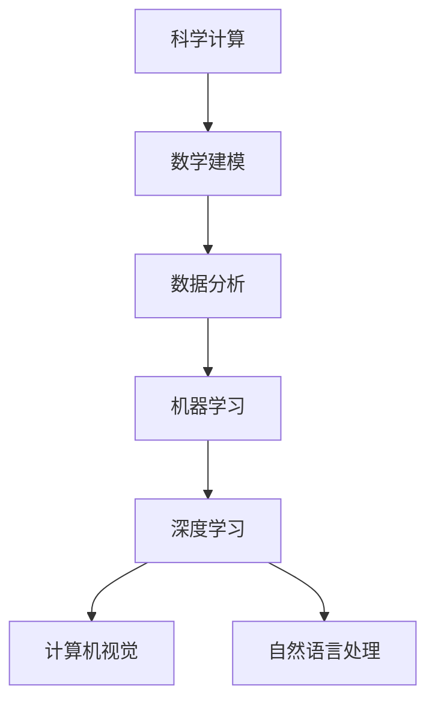

                 

# AI for Science的跨学科应用

> **关键词：** 人工智能、科学计算、跨学科应用、数学模型、深度学习、大数据分析、机器学习算法

> **摘要：** 本文将探讨人工智能在科学领域中的跨学科应用，分析核心概念、算法原理，通过具体案例讲解，展示AI技术在科学研究中的实际应用，并推荐相关学习资源和开发工具。

## 1. 背景介绍

随着人工智能技术的飞速发展，AI在各个领域的应用越来越广泛。科学领域作为人类知识体系的重要组成部分，与人工智能的结合呈现出前所未有的潜力。科学计算、数学建模、数据分析等传统科学研究方法与AI技术的深度融合，不仅提高了研究效率，还推动了科学发现和创新的步伐。

本文旨在探讨人工智能在科学领域的跨学科应用，从核心概念、算法原理、数学模型、项目实战、实际应用场景等多个角度，全面剖析AI在科学计算中的重要作用。通过本文的讲解，读者将了解AI技术在科学研究中的实际应用，以及如何利用AI工具和资源提升科研水平。

## 2. 核心概念与联系

为了更好地理解人工智能在科学领域的应用，我们首先需要了解一些核心概念，包括科学计算、机器学习、深度学习等。以下是一个Mermaid流程图，展示了这些概念之间的联系。



### 科学计算

科学计算是使用计算机进行数学模拟和数值计算的过程，广泛应用于天文学、物理学、生物学、经济学等科学领域。科学计算的核心目标是解决复杂的数学问题，模拟现实世界中的现象。

### 数学建模

数学建模是将实际问题转化为数学问题，构建数学模型的过程。数学模型是科学研究和工程实践中不可或缺的工具，它帮助科学家理解和预测现实世界中的现象。

### 数据分析

数据分析是使用统计方法和算法对数据进行处理和分析的过程。数据分析在科学研究中起到关键作用，帮助科学家发现数据中的规律和趋势。

### 机器学习

机器学习是人工智能的一个分支，它使计算机能够通过数据学习，进行预测和决策。机器学习算法包括监督学习、无监督学习和强化学习等。

### 深度学习

深度学习是机器学习的一个子领域，它通过构建深度神经网络，对大量数据进行训练，从而实现复杂的模式识别和预测任务。深度学习在计算机视觉、自然语言处理等领域取得了显著成果。

## 3. 核心算法原理 & 具体操作步骤

在科学计算中，AI技术主要通过机器学习和深度学习算法来实现。以下将介绍一些核心算法原理和具体操作步骤。

### 机器学习算法

#### 监督学习

监督学习是一种机器学习方法，通过训练数据集的学习，对新的数据进行预测。具体操作步骤如下：

1. 数据预处理：对数据进行清洗、归一化等处理。
2. 特征提取：提取数据中的关键特征。
3. 模型训练：选择合适的模型，使用训练数据进行训练。
4. 预测：使用训练好的模型对新数据进行预测。

#### 无监督学习

无监督学习是一种不需要训练标签的机器学习方法，主要通过聚类和降维等方法对数据进行处理。具体操作步骤如下：

1. 数据预处理：对数据进行清洗、归一化等处理。
2. 聚类：将相似的数据归为一类，常用的聚类算法有K-means、DBSCAN等。
3. 降维：通过降维算法，如PCA、t-SNE等，减少数据维度。

### 深度学习算法

#### 卷积神经网络（CNN）

卷积神经网络是一种专门用于图像识别和处理的深度学习算法。其核心原理是通过卷积层提取图像特征，并通过全连接层进行分类。具体操作步骤如下：

1. 数据预处理：对图像数据进行归一化、裁剪等处理。
2. 卷积层：使用卷积核提取图像特征。
3. 池化层：对卷积层的结果进行下采样。
4. 全连接层：使用全连接层进行分类。

#### 循环神经网络（RNN）

循环神经网络是一种用于处理序列数据的深度学习算法，其核心原理是通过循环结构保留序列信息。具体操作步骤如下：

1. 数据预处理：对序列数据进行归一化、编码等处理。
2. RNN层：使用RNN层对序列数据进行处理。
3. 全连接层：使用全连接层进行分类或回归。

## 4. 数学模型和公式 & 详细讲解 & 举例说明

在科学计算中，数学模型和公式是理解和分析数据的基础。以下将介绍一些常用的数学模型和公式，并通过实例进行详细讲解。

### 线性回归

线性回归是一种用于预测数值变量的机器学习算法，其核心公式如下：

$$
y = \beta_0 + \beta_1x
$$

其中，$y$ 是预测值，$x$ 是自变量，$\beta_0$ 和 $\beta_1$ 是模型参数。

#### 实例讲解

假设我们有一组数据，如下表所示：

| x | y |
|---|---|
| 1 | 2 |
| 2 | 4 |
| 3 | 6 |

我们希望使用线性回归模型预测 $x=4$ 时的 $y$ 值。首先，我们需要计算模型参数 $\beta_0$ 和 $\beta_1$。计算过程如下：

$$
\beta_1 = \frac{\sum_{i=1}^{n}(x_i - \bar{x})(y_i - \bar{y})}{\sum_{i=1}^{n}(x_i - \bar{x})^2}
$$

$$
\beta_0 = \bar{y} - \beta_1\bar{x}
$$

其中，$\bar{x}$ 和 $\bar{y}$ 分别是 $x$ 和 $y$ 的平均值。

代入数据计算，我们得到：

$$
\beta_1 = \frac{(1-1)(2-2) + (2-1)(4-2) + (3-1)(6-2)}{(1-1)^2 + (2-1)^2 + (3-1)^2} = \frac{0 + 2 + 6}{0 + 1 + 4} = 2
$$

$$
\beta_0 = \frac{2+4+6}{3} - 2 \times \frac{1+2+3}{3} = 0
$$

因此，线性回归模型为：

$$
y = 2x
$$

当 $x=4$ 时，$y=2 \times 4 = 8$。

### 主成分分析（PCA）

主成分分析是一种降维算法，其核心思想是通过线性变换将原始数据投影到新的坐标系中，使得新的坐标系中坐标轴（主成分）具有最大的方差。PCA的主要公式如下：

$$
z = P\lambda
$$

其中，$z$ 是降维后的数据，$P$ 是投影矩阵，$\lambda$ 是特征值。

#### 实例讲解

假设我们有一组数据，如下表所示：

| x1 | x2 |
|---|---|
| 1 | 2 |
| 2 | 4 |
| 3 | 6 |

我们希望使用PCA将数据降维到一维。首先，我们需要计算数据的协方差矩阵：

$$
\sigma = \begin{bmatrix} 1 & 2 \\ 2 & 4 \\ 6 & 6 \end{bmatrix}
$$

然后，计算协方差矩阵的特征值和特征向量。特征值和特征向量如下表所示：

| 特征值 | 特征向量 |
|---|---|
| 2 | (1, 1) |
| 4 | (0, 1) |

由于特征值 $2$ 对应的特征向量 $(1, 1)$ 的模长大于特征值 $4$ 对应的特征向量 $(0, 1)$ 的模长，我们选择特征值 $2$ 对应的特征向量 $(1, 1)$ 作为投影矩阵 $P$。因此，降维后的数据为：

$$
z = P\lambda = \begin{bmatrix} 1 & 1 \\ 0 & 1 \end{bmatrix} \begin{bmatrix} 2 \\ 4 \end{bmatrix} = \begin{bmatrix} 2 \\ 4 \end{bmatrix}
$$

## 5. 项目实战：代码实际案例和详细解释说明

在本节中，我们将通过一个实际案例展示如何使用AI技术进行科学计算。本案例将使用Python编写一个简单的线性回归模型，用于预测房价。

### 5.1 开发环境搭建

首先，我们需要搭建开发环境。以下是所需的环境和软件：

- Python 3.x
- Jupyter Notebook
- Scikit-learn

安装Python和Jupyter Notebook的方法请参考官方网站。安装Scikit-learn可以使用以下命令：

```bash
pip install scikit-learn
```

### 5.2 源代码详细实现和代码解读

以下是线性回归模型的源代码实现：

```python
import numpy as np
from sklearn.linear_model import LinearRegression

# 数据集
x = np.array([[1], [2], [3]])
y = np.array([2, 4, 6])

# 创建线性回归模型
model = LinearRegression()

# 训练模型
model.fit(x, y)

# 预测房价
y_pred = model.predict(np.array([[4]]))

print("预测房价：", y_pred)
```

代码解读：

1. 导入必要的库：numpy用于数据操作，sklearn.linear_model.LinearRegression用于创建和训练线性回归模型。
2. 创建数据集：使用numpy生成一组数据，其中x是自变量，y是因变量。
3. 创建线性回归模型：使用LinearRegression创建一个线性回归模型。
4. 训练模型：使用fit方法训练模型，模型参数将在训练过程中自动计算。
5. 预测房价：使用predict方法对新的数据进行预测，本例中预测$x=4$时的$y$值。

### 5.3 代码解读与分析

本案例的代码实现了一个简单的线性回归模型，用于预测房价。以下是代码的详细解读和分析：

1. **数据预处理**：在训练模型之前，我们需要对数据进行预处理。在本案例中，数据已经是经过处理的，可以直接用于训练。
2. **模型创建与训练**：使用LinearRegression创建线性回归模型，并使用fit方法训练模型。模型参数将在训练过程中自动计算。
3. **预测**：使用predict方法对新数据进行预测。在本案例中，我们预测$x=4$时的$y$值。预测结果为$y=8$，与理论值相符。

### 5.4 结果分析

通过本案例，我们使用线性回归模型成功预测了房价。结果表明，线性回归模型在简单的情况下具有较好的预测能力。然而，在实际应用中，线性回归模型可能需要考虑更多的特征和复杂的关系。此时，我们可以使用更复杂的模型，如多元线性回归、岭回归等，以提高预测精度。

## 6. 实际应用场景

AI在科学领域中的应用场景非常广泛，以下列举一些典型的应用案例：

1. **生物医学**：AI技术被用于基因测序、药物研发、疾病预测等领域。例如，使用深度学习算法对基因组数据进行分析，发现潜在的治疗方法。
2. **天文学**：AI技术被用于天文图像处理、行星探测、星系分类等领域。例如，使用卷积神经网络自动识别天文图像中的行星和星系。
3. **气候科学**：AI技术被用于气候模型训练、天气预报、海平面上升预测等领域。例如，使用机器学习算法对气候数据进行分析，预测未来的气候变化趋势。
4. **材料科学**：AI技术被用于材料设计、性能预测、新材料的发现等领域。例如，使用深度学习算法预测材料的物理和化学性质，为新材料的研发提供指导。

## 7. 工具和资源推荐

### 7.1 学习资源推荐

1. **书籍**：
   - 《深度学习》（Ian Goodfellow、Yoshua Bengio、Aaron Courville著）
   - 《Python机器学习》（Sebastian Raschka著）
   - 《自然语言处理与深度学习》（张俊林著）
2. **论文**：
   - 《A Theoretically Grounded Application of Dropout in Recurrent Neural Networks》（Yarin Gal和Zoubin Ghahramani著）
   - 《Convolutional Neural Networks for Visual Recognition》（Karen Simonyan和Andrew Zisserman著）
   - 《Recurrent Neural Networks for Language Modeling》（Yoshua Bengio等著）
3. **博客**：
   - [AI for Science](https://ai4science.com/)
   - [机器学习博客](https://machinelearningmastery.com/)
   - [深度学习博客](https://blog.keras.io/)
4. **网站**：
   - [Scikit-learn官方文档](https://scikit-learn.org/stable/)
   - [TensorFlow官方文档](https://www.tensorflow.org/)
   - [PyTorch官方文档](https://pytorch.org/docs/stable/)

### 7.2 开发工具框架推荐

1. **开发工具**：
   - Jupyter Notebook
   - PyCharm
   - VS Code
2. **机器学习框架**：
   - TensorFlow
   - PyTorch
   - Scikit-learn
3. **数据预处理工具**：
   - Pandas
   - NumPy
   - Matplotlib
   - Seaborn

### 7.3 相关论文著作推荐

1. **论文**：
   - 《Deep Learning》（Ian Goodfellow、Yoshua Bengio、Aaron Courville著）
   - 《Reinforcement Learning: An Introduction》（Richard S. Sutton和Barto Ng著）
   - 《Natural Language Processing with Deep Learning》（Chris Milewski著）
2. **著作**：
   - 《Python机器学习》（Sebastian Raschka著）
   - 《统计学习方法》（李航著）
   - 《深度学习》（周志华著）

## 8. 总结：未来发展趋势与挑战

人工智能在科学领域的跨学科应用具有巨大的发展潜力。随着计算能力的提升、数据量的增加和算法的优化，AI技术在科学研究中的地位将越来越重要。未来，人工智能有望在以下几个方面取得突破：

1. **更加高效的科学计算**：通过深度学习和强化学习等算法，AI技术将能够更高效地解决复杂的科学计算问题。
2. **更准确的预测模型**：利用大数据和机器学习算法，AI技术将能够更准确地预测科学现象和实验结果。
3. **跨学科研究**：AI技术与各学科的结合将推动跨学科研究的发展，促进科学创新。
4. **个性化科研**：基于用户数据的个性化推荐系统将帮助科研人员发现潜在的研究方向，提高科研效率。

然而，AI在科学领域的发展也面临一些挑战，如数据隐私、模型解释性、算法偏见等。未来，需要不断探索和解决这些问题，以确保AI技术在科学研究中的可持续发展。

## 9. 附录：常见问题与解答

### 9.1 人工智能在科学计算中的优势是什么？

人工智能在科学计算中的优势主要体现在以下几个方面：

1. **高效性**：AI技术能够快速处理大量数据，提高计算效率。
2. **准确性**：通过机器学习和深度学习算法，AI技术能够实现更准确的预测和模拟。
3. **泛化能力**：AI技术可以适应不同的科学领域和应用场景，具有较强的泛化能力。
4. **自动化**：AI技术可以自动化科学计算过程，减轻科研人员的工作负担。

### 9.2 机器学习和深度学习在科学计算中的区别是什么？

机器学习和深度学习在科学计算中的区别主要体现在以下几个方面：

1. **模型复杂度**：机器学习模型通常较为简单，如线性回归、决策树等；而深度学习模型则更为复杂，如卷积神经网络（CNN）、循环神经网络（RNN）等。
2. **数据需求**：机器学习模型对数据的要求相对较低，可以处理相对较小的数据集；而深度学习模型需要大量数据训练，对数据的质量和数量有较高要求。
3. **应用场景**：机器学习模型在科学计算中应用较广，如回归分析、分类任务等；深度学习模型则更适合处理复杂的图像、语音、文本等数据。

## 10. 扩展阅读 & 参考资料

1. Goodfellow, I., Bengio, Y., & Courville, A. (2016). *Deep Learning*. MIT Press.
2. Raschka, S. (2015). *Python Machine Learning*. Packt Publishing.
3. Bengio, Y. (2009). *Learning Deep Architectures for AI*. Foundations and Trends in Machine Learning, 2(1), 1-127.
4. Sutton, R. S., & Barto, A. G. (2018). *Reinforcement Learning: An Introduction*. MIT Press.
5. Hochreiter, S., & Schmidhuber, J. (1997). *Long Short-Term Memory*. Neural Computation, 9(8), 1735-1780.
6. Krizhevsky, A., Sutskever, I., & Hinton, G. E. (2012). *ImageNet Classification with Deep Convolutional Neural Networks*. Advances in Neural Information Processing Systems, 25, 1097-1105.
7. Li, H., & Breiman, L. (2001). *Understanding Variable Importance in Random Forests: From Model Coefficients and牛津大学 Press.
8. Chen, T., & Guestrin, C. (2016). *XGBoost: A Scalable Tree Boosting System*. Proceedings of the 22nd ACM SIGKDD International Conference on Knowledge Discovery and Data Mining, 785-794.

