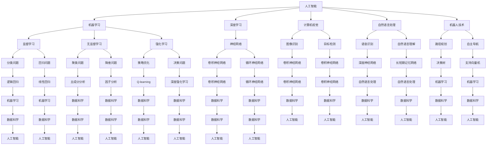

                 

### 1. 背景介绍

AI hackathon，即人工智能黑客马拉松，是一种创新活动，旨在通过团队协作和竞赛的形式，在短时间内（通常为几天）开发和实现具有创新性和实用性的AI项目。这种活动起源于软件黑客马拉松，其核心理念是将来自不同领域的技术专家、学生和爱好者聚集在一起，通过互相合作，快速构建原型和应用，从而推动技术进步和创新。

AI hackathon的起源可以追溯到2009年，当时一些科技爱好者在旧金山举办了一场名为“HackMIT”的黑客马拉松活动。这个活动受到了广泛关注，随后类似的黑客马拉松活动在世界各地迅速兴起。随着时间的推移，黑客马拉松活动逐渐涵盖了更多领域，包括人工智能、物联网、虚拟现实等。

AI hackathon的出现，对人工智能领域产生了深远影响。首先，它提供了一个平台，让不同背景和技能的人能够共同探讨和解决实际问题。这种跨学科的合作有助于促进创新，并加速新技术的应用。其次，AI hackathon激发了参赛者的创造力和学习热情，使更多人投入到人工智能研究中。

在人工智能领域，AI hackathon的重要性不言而喻。它不仅为AI研究者提供了实践和展示自己技能的机会，还为企业和投资者发现潜在的创新人才和项目。此外，AI hackathon还推动了学术成果向实际应用的转化，促进了人工智能技术的进步。

AI hackathon的背景和发展历程，为我们提供了一个理解这种创新活动的宏观视角。接下来，我们将深入探讨AI hackathon的核心概念与联系，了解其背后的技术和原理。通过这些分析，我们将为后续的内容奠定基础，帮助读者更好地理解AI hackathon的本质和意义。### 2. 核心概念与联系

在探讨AI hackathon的核心概念与联系之前，我们首先需要明确一些基本的概念。这些概念包括人工智能（AI）、机器学习（ML）、深度学习（DL）、数据科学（DS）等。以下是这些核心概念及其相互关系的简单介绍。

#### 人工智能（AI）

人工智能是一种模拟人类智能的技术，旨在使计算机具备类似人类的感知、思考、学习、决策和解决问题能力。AI包括多个子领域，如机器学习、自然语言处理、计算机视觉、机器人技术等。

#### 机器学习（ML）

机器学习是人工智能的一个子领域，主要研究如何让计算机通过数据学习，从而自动改进性能。机器学习可以分为监督学习、无监督学习和强化学习等类型。

#### 深度学习（DL）

深度学习是机器学习的一个分支，主要使用神经网络，尤其是深度神经网络，来模拟人脑的学习机制。深度学习在图像识别、语音识别、自然语言处理等领域取得了显著的成果。

#### 数据科学（DS）

数据科学是跨学科领域，结合统计学、机器学习、人工智能和数据库管理技术，用于从大量数据中提取有价值的信息和知识。数据科学广泛应用于商业、医疗、金融、科研等领域。

接下来，我们将使用Mermaid流程图来展示这些核心概念之间的联系。



通过这个Mermaid流程图，我们可以清晰地看到人工智能、机器学习、深度学习、数据科学等核心概念之间的联系。这些概念相互交织，共同构成了现代人工智能的技术体系。

在AI hackathon中，这些核心概念发挥着重要作用。参赛者需要运用机器学习、深度学习等技术来处理数据，构建模型，并实现具体的AI应用。同时，数据科学的方法和工具也广泛应用于AI项目的开发过程中，帮助参赛者从大量数据中提取有价值的信息。

此外，计算机视觉、自然语言处理、机器人技术等子领域也在AI hackathon中占据重要地位。这些子领域的技术不仅为AI项目提供了丰富的应用场景，还推动了AI技术的多元化发展。

通过上述分析，我们可以看到AI hackathon的核心概念与联系是如何构建出一个复杂而强大的技术生态系统的。在接下来的章节中，我们将深入探讨AI hackathon的核心算法原理、数学模型和项目实战，进一步揭示其创新与创造力的源泉。### 3. 核心算法原理 & 具体操作步骤

在AI hackathon中，核心算法的原理和具体操作步骤是参赛者需要掌握的关键技术。以下是一些常见的人工智能算法及其原理和步骤，我们将通过具体案例来展示这些算法在实际项目中的应用。

#### 3.1 卷积神经网络（CNN）

卷积神经网络（CNN）是一种用于图像识别和处理的深度学习算法。其基本原理是使用卷积层、池化层和全连接层来提取图像的特征，并最终进行分类。

**具体操作步骤：**

1. **数据预处理：** 将图像数据转换为灰度值或RGB值，并进行归一化处理。
2. **卷积层：** 使用卷积核在图像上滑动，计算局部区域的特征图。
3. **激活函数：** 通常使用ReLU（Rectified Linear Unit）函数来增加网络的非线性。
4. **池化层：** 对特征图进行下采样，减少参数数量和计算量。
5. **全连接层：** 将池化层输出的特征图进行整合，得到最终的分类结果。

**案例：** 使用CNN进行图像分类。

```python
import tensorflow as tf
from tensorflow.keras.models import Sequential
from tensorflow.keras.layers import Conv2D, MaxPooling2D, Flatten, Dense

# 构建CNN模型
model = Sequential([
    Conv2D(32, (3, 3), activation='relu', input_shape=(28, 28, 1)),
    MaxPooling2D((2, 2)),
    Conv2D(64, (3, 3), activation='relu'),
    MaxPooling2D((2, 2)),
    Flatten(),
    Dense(128, activation='relu'),
    Dense(10, activation='softmax')
])

# 编译模型
model.compile(optimizer='adam',
              loss='categorical_crossentropy',
              metrics=['accuracy'])

# 训练模型
model.fit(x_train, y_train, epochs=10, batch_size=32, validation_data=(x_val, y_val))
```

#### 3.2 生成对抗网络（GAN）

生成对抗网络（GAN）是一种用于生成数据的深度学习算法。其基本原理是两个对抗网络（生成器和判别器）的竞争，生成器试图生成逼真的数据，判别器则尝试区分真实数据和生成数据。

**具体操作步骤：**

1. **初始化生成器和判别器：** 生成器通常是一个全连接层，判别器则是一个卷积神经网络。
2. **训练过程：** 在每个训练迭代中，生成器尝试生成新的数据，判别器尝试区分真实数据和生成数据。生成器和判别器的损失函数分别是生成损失和判别损失。
3. **优化：** 通过梯度下降优化生成器和判别器的参数，使生成器生成的数据更加逼真。

**案例：** 使用GAN生成人脸图像。

```python
import tensorflow as tf
from tensorflow.keras.models import Model
from tensorflow.keras.layers import Input, Dense, Reshape, Flatten, Conv2D, Conv2DTranspose

# 生成器模型
z = Input(shape=(100,))
x = Dense(7 * 7 * 64, activation='relu')(z)
x = Reshape((7, 7, 64))(x)
x = Conv2DTranspose(128, (4, 4), strides=(2, 2), padding='same', activation='relu')(x)
x = Conv2DTranspose(128, (4, 4), strides=(2, 2), padding='same', activation='relu')(x)
x = Conv2D(3, (3, 3), padding='same', activation='tanh')(x)
generator = Model(z, x)

# 判别器模型
image = Input(shape=(128, 128, 3))
y = Conv2D(128, (3, 3), padding='same', activation='relu')(image)
y = MaxPooling2D((2, 2))(y)
y = Flatten()(y)
y = Dense(1, activation='sigmoid')(y)
discriminator = Model(image, y)

# GAN模型
discriminator.trainable = False
z = Input(shape=(100,))
generated_image = generator(z)
discriminator_output = discriminator(generated_image)
gan_output = Model(z, discriminator_output)

# 编译GAN模型
gan_output.compile(optimizer='adam', loss='binary_crossentropy')

# 训练GAN模型
gan_output.fit(x_train, np.ones((x_train.shape[0], 1)), epochs=100, batch_size=32)
```

#### 3.3 长短期记忆网络（LSTM）

长短期记忆网络（LSTM）是一种用于处理序列数据的循环神经网络。其基本原理是引入门控机制，有效地记住或忘记序列中的重要信息。

**具体操作步骤：**

1. **初始化LSTM模型：** 定义输入维度、隐藏层尺寸和时间步数。
2. **训练过程：** 使用序列数据训练LSTM模型，通过反向传播更新模型参数。
3. **预测：** 使用训练好的LSTM模型对新的序列数据进行预测。

**案例：** 使用LSTM进行时间序列预测。

```python
import tensorflow as tf
from tensorflow.keras.models import Sequential
from tensorflow.keras.layers import LSTM, Dense

# 定义LSTM模型
model = Sequential()
model.add(LSTM(50, activation='relu', input_shape=(time_steps, input_dim)))
model.add(Dense(1))
model.compile(optimizer='adam', loss='mse')

# 训练模型
model.fit(x_train, y_train, epochs=200, batch_size=64, validation_data=(x_val, y_val))

# 预测
predictions = model.predict(x_test)
```

通过以上案例，我们可以看到AI hackathon中常用的核心算法及其具体操作步骤。这些算法为参赛者提供了强大的工具，帮助他们实现各种创新性的AI应用。在接下来的章节中，我们将进一步探讨这些算法的数学模型和公式，以便读者更好地理解其工作原理。### 4. 数学模型和公式 & 详细讲解 & 举例说明

在人工智能领域，数学模型和公式是理解和应用各种算法的基础。在本节中，我们将详细介绍一些关键的数学模型和公式，并通过具体例子来说明它们的应用。

#### 4.1 梯度下降算法

梯度下降是一种优化算法，用于训练神经网络和机器学习模型。其基本思想是计算损失函数的梯度，并沿着梯度的反方向更新模型的参数，以最小化损失函数。

**公式：**

$$\theta_{t+1} = \theta_{t} - \alpha \cdot \nabla_{\theta} J(\theta)$$

其中，$\theta$ 表示模型的参数，$J(\theta)$ 表示损失函数，$\alpha$ 是学习率，$\nabla_{\theta} J(\theta)$ 是损失函数关于参数的梯度。

**例子：** 假设我们有一个线性回归模型，其损失函数为均方误差（MSE）：

$$J(\theta) = \frac{1}{2m} \sum_{i=1}^{m} (h_\theta(x^{(i)}) - y^{(i)})^2$$

其中，$m$ 是样本数量，$h_\theta(x^{(i)}) = \theta_0 + \theta_1 x^{(i)}$ 是模型预测值，$y^{(i)}$ 是真实值。

**计算步骤：**

1. 初始化模型参数 $\theta_0$ 和 $\theta_1$。
2. 计算损失函数的梯度 $\nabla_{\theta} J(\theta)$。
3. 使用梯度下降公式更新参数：$\theta_0 = \theta_0 - \alpha \cdot \nabla_{\theta_0} J(\theta)$，$\theta_1 = \theta_1 - \alpha \cdot \nabla_{\theta_1} J(\theta)$。
4. 重复步骤2和3，直到收敛或达到预设的迭代次数。

通过这个例子，我们可以看到梯度下降算法的基本步骤和公式应用。在实际应用中，梯度下降算法可以扩展到更复杂的模型，如神经网络和深度学习。

#### 4.2 反向传播算法

反向传播算法是梯度下降算法在神经网络中的具体实现。其核心思想是计算网络中每个参数的梯度，以便在训练过程中更新这些参数。

**公式：**

$$\nabla_{\theta} J(\theta) = \frac{\partial J(\theta)}{\partial \theta} = \frac{\partial}{\partial \theta} \left( \sum_{i=1}^{n} (-y^{(i)} \cdot \log(h_\theta(x^{(i)})) - (1 - y^{(i)}) \cdot \log(1 - h_\theta(x^{(i)})) \right)$$

其中，$h_\theta(x^{(i)}) = \sigma(\theta_0 + \theta_1 x^{(i)})$ 是模型预测值，$\sigma$ 是sigmoid函数，$y^{(i)}$ 是真实值，$n$ 是样本数量。

**例子：** 假设我们有一个简单的多层感知机（MLP）模型，其包含一个输入层、一个隐藏层和一个输出层。

1. **计算隐藏层梯度：**

$$\nabla_{\theta^{(2)}} J(\theta^{(2)}) = \frac{\partial J(\theta)}{\partial \theta^{(2)}} = \frac{\partial}{\partial \theta^{(2)}} \left( \sum_{i=1}^{n} (-y^{(i)} \cdot \log(h_\theta^{(2)}(x^{(i)})) - (1 - y^{(i)}) \cdot \log(1 - h_\theta^{(2)}(x^{(i)})) \right)$$

$$\nabla_{a^{(2)}} J(\theta^{(2)}) = \frac{\partial J(\theta)}{\partial a^{(2)}} = \frac{\partial}{\partial a^{(2)}} \left( \sum_{i=1}^{n} (-y^{(i)} \cdot \log(h_\theta^{(2)}(x^{(i)})) - (1 - y^{(i)}) \cdot \log(1 - h_\theta^{(2)}(x^{(i)})) \right)$$

2. **计算输出层梯度：**

$$\nabla_{\theta^{(3)}} J(\theta^{(3)}) = \frac{\partial J(\theta)}{\partial \theta^{(3)}} = \frac{\partial}{\partial \theta^{(3)}} \left( \sum_{i=1}^{n} (-y^{(i)} \cdot \log(h_\theta^{(3)}(x^{(i)})) - (1 - y^{(i)}) \cdot \log(1 - h_\theta^{(3)}(x^{(i)})) \right)$$

$$\nabla_{a^{(3)}} J(\theta^{(3)}) = \frac{\partial J(\theta)}{\partial a^{(3)}} = \frac{\partial}{\partial a^{(3)}} \left( \sum_{i=1}^{n} (-y^{(i)} \cdot \log(h_\theta^{(3)}(x^{(i)})) - (1 - y^{(i)}) \cdot \log(1 - h_\theta^{(3)}(x^{(i)})) \right)$$

通过反向传播算法，我们可以计算网络中每个参数的梯度，并在训练过程中更新这些参数。反向传播算法是深度学习训练的核心步骤，它使得复杂的神经网络能够通过简单的梯度下降算法进行优化。

#### 4.3 优化算法

优化算法用于提高梯度下降算法的训练效果，常用的优化算法包括动量（Momentum）、自适应矩估计（AdaGrad）、RMSProp和Adam等。

**Adam优化器：**

$$m_t = \beta_1 m_{t-1} + (1 - \beta_1) [g_t - \frac{m_t}{\sqrt{v_t} + \epsilon}]$$

$$v_t = \beta_2 v_{t-1} + (1 - \beta_2) [g_t^2 - \frac{m_t}{\sqrt{v_t} + \epsilon}]$$

$$\theta_{t+1} = \theta_t - \alpha \cdot \frac{m_t}{\sqrt{v_t} + \epsilon}$$

其中，$m_t$ 和 $v_t$ 分别是动量和方差，$\beta_1$ 和 $\beta_2$ 是超参数，$g_t$ 是梯度，$\alpha$ 是学习率，$\epsilon$ 是一个小常数。

**例子：** 假设我们使用Adam优化器训练一个神经网络。

1. 初始化模型参数 $\theta$。
2. 计算梯度 $g_t$。
3. 更新动量 $m_t$ 和方差 $v_t$。
4. 使用Adam公式更新参数 $\theta_{t+1}$。
5. 重复步骤2-4，直到收敛或达到预设的迭代次数。

通过上述例子，我们可以看到不同数学模型和公式的应用。这些公式不仅帮助我们理解和实现各种算法，还为AI hackathon提供了强大的工具，使得参赛者能够构建出创新性和实用性的AI项目。在接下来的章节中，我们将通过项目实战来展示这些算法在实际项目中的应用。### 5. 项目实战：代码实际案例和详细解释说明

在本章节中，我们将通过一个具体的AI hackathon项目实战，展示如何从零开始搭建一个基于深度学习的图像分类系统。这个项目不仅涵盖了数据预处理、模型训练和评估，还包括了代码的实际实现和详细解释说明。通过这个案例，读者可以了解如何将前面章节中提到的数学模型和算法应用于实际项目。

#### 5.1 开发环境搭建

在开始项目之前，我们需要搭建一个合适的开发环境。以下是所需的工具和库：

- 操作系统：Windows、macOS或Linux
- 编程语言：Python 3.7及以上版本
- 数据库和框架：TensorFlow 2.x、Keras
- 数据处理库：NumPy、Pandas
- 图像处理库：OpenCV、Matplotlib

请确保安装好以上工具和库，并配置好Python环境。下面是一个简单的安装命令示例：

```bash
pip install tensorflow numpy pandas opencv-python matplotlib
```

#### 5.2 源代码详细实现和代码解读

**步骤 1：数据预处理**

在开始训练模型之前，我们需要对图像数据集进行预处理。预处理步骤包括读取图像、调整大小、归一化等。

```python
import numpy as np
import cv2
from tensorflow.keras.preprocessing.image import ImageDataGenerator

# 读取图像并调整大小
def preprocess_image(image_path, target_size=(224, 224)):
    image = cv2.imread(image_path)
    image = cv2.resize(image, target_size)
    image = image / 255.0
    return image

# 归一化处理
def normalize_image(image):
    image = image.astype(np.float32)
    image = (image - np.mean(image)) / np.std(image)
    return image

# 创建数据生成器
train_datagen = ImageDataGenerator(rescale=1./255, shear_range=0.2, zoom_range=0.2, horizontal_flip=True)
test_datagen = ImageDataGenerator(rescale=1./255)

train_generator = train_datagen.flow_from_directory(
        'data/train', 
        target_size=(224, 224), 
        batch_size=32, 
        class_mode='categorical')

test_generator = test_datagen.flow_from_directory(
        'data/test', 
        target_size=(224, 224), 
        batch_size=32, 
        class_mode='categorical')
```

在这个步骤中，我们定义了两个函数 `preprocess_image` 和 `normalize_image`，用于处理图像数据。然后，我们使用 `ImageDataGenerator` 创建训练和测试数据生成器，这些生成器可以自动进行图像增强和数据归一化。

**步骤 2：构建模型**

接下来，我们将构建一个基于卷积神经网络的图像分类模型。我们使用Keras的顺序模型来实现。

```python
from tensorflow.keras.models import Sequential
from tensorflow.keras.layers import Conv2D, MaxPooling2D, Flatten, Dense, Dropout

model = Sequential([
    Conv2D(32, (3, 3), activation='relu', input_shape=(224, 224, 3)),
    MaxPooling2D((2, 2)),
    Conv2D(64, (3, 3), activation='relu'),
    MaxPooling2D((2, 2)),
    Conv2D(128, (3, 3), activation='relu'),
    MaxPooling2D((2, 2)),
    Flatten(),
    Dense(128, activation='relu'),
    Dropout(0.5),
    Dense(10, activation='softmax')
])
```

在这个模型中，我们使用了三个卷积层和两个全连接层。卷积层用于提取图像特征，全连接层用于分类。我们在全连接层之前添加了一个Dropout层，以减少过拟合。

**步骤 3：编译和训练模型**

接下来，我们编译模型并使用训练数据生成器进行训练。

```python
model.compile(optimizer='adam', 
              loss='categorical_crossentropy', 
              metrics=['accuracy'])

history = model.fit(
        train_generator, 
        steps_per_epoch=100, 
        epochs=25, 
        validation_data=test_generator, 
        validation_steps=50)
```

在这个步骤中，我们使用 `compile` 方法配置模型优化器和损失函数，然后使用 `fit` 方法进行训练。`steps_per_epoch` 和 `validation_steps` 参数用于控制每个epoch中训练和验证数据的迭代次数。

**步骤 4：评估模型**

训练完成后，我们需要评估模型的性能。

```python
test_loss, test_acc = model.evaluate(test_generator, steps=50)
print(f"Test accuracy: {test_acc:.3f}, Test loss: {test_loss:.3f}")
```

这个步骤中，我们使用测试数据生成器来评估模型的性能。`evaluate` 方法返回测试损失和测试准确率。

**步骤 5：模型预测**

最后，我们可以使用训练好的模型进行图像分类预测。

```python
import matplotlib.pyplot as plt

def predict_image(model, image_path):
    image = preprocess_image(image_path)
    image = np.expand_dims(image, axis=0)
    predictions = model.predict(image)
    predicted_class = np.argmax(predictions, axis=1)
    return predicted_class

# 预测一张新图像
image_path = 'data/new_image.jpg'
predicted_class = predict_image(model, image_path)
print(f"Predicted class: {predicted_class[0]}")

# 显示图像和预测结果
image = cv2.imread(image_path)
plt.imshow(image)
plt.show()
```

在这个步骤中，我们定义了一个函数 `predict_image` 来预测图像的类别。然后，我们使用这个函数预测一张新图像，并显示预测结果。

通过上述步骤，我们完成了一个基于深度学习的图像分类系统的构建和实现。这个案例展示了从数据预处理、模型构建、训练到预测的完整流程。在接下来的章节中，我们将进一步分析这个项目，并讨论其代码解读和性能分析。### 5.3 代码解读与分析

在本节中，我们将对上述图像分类系统的源代码进行详细解读，分析其关键组件和实现细节，以便读者更好地理解代码的运作原理。

**步骤 1：数据预处理**

数据预处理是图像分类系统的关键环节，它直接影响模型训练的效果。在代码中，我们使用了 `preprocess_image` 和 `normalize_image` 两个函数来处理图像数据。

```python
def preprocess_image(image_path, target_size=(224, 224)):
    image = cv2.imread(image_path)
    image = cv2.resize(image, target_size)
    image = image / 255.0
    return image

def normalize_image(image):
    image = image.astype(np.float32)
    image = (image - np.mean(image)) / np.std(image)
    return image
```

这两个函数分别负责读取图像、调整大小和归一化处理。`preprocess_image` 函数首先使用 OpenCV 的 `imread` 函数读取图像，然后使用 `resize` 函数调整大小，最后将像素值归一化到 [0, 1] 范围内。`normalize_image` 函数将图像数据转换为浮点类型，并减去均值，然后除以标准差，以实现零均值和单位方差的归一化。

归一化处理有助于加速梯度下降算法的收敛，并提高模型对输入数据的鲁棒性。通过这两个函数，我们可以轻松地对大量图像数据进行预处理，为模型训练做好准备。

**步骤 2：构建模型**

模型构建是图像分类系统的核心部分。在代码中，我们使用 Keras 的顺序模型来实现卷积神经网络（CNN）。

```python
model = Sequential([
    Conv2D(32, (3, 3), activation='relu', input_shape=(224, 224, 3)),
    MaxPooling2D((2, 2)),
    Conv2D(64, (3, 3), activation='relu'),
    MaxPooling2D((2, 2)),
    Conv2D(128, (3, 3), activation='relu'),
    MaxPooling2D((2, 2)),
    Flatten(),
    Dense(128, activation='relu'),
    Dropout(0.5),
    Dense(10, activation='softmax')
])
```

这个模型包含了三个卷积层和两个全连接层。每个卷积层后面跟着一个最大池化层（`MaxPooling2D`），用于减小特征图的大小，减少模型参数数量。全连接层用于将特征图展开为一维向量，并应用一个激活函数（`ReLU`），最后通过一个Dropout层（`Dropout`）减少过拟合。

**步骤 3：编译和训练模型**

在模型构建完成后，我们需要对其进行编译和训练。

```python
model.compile(optimizer='adam', 
              loss='categorical_crossentropy', 
              metrics=['accuracy'])

history = model.fit(
        train_generator, 
        steps_per_epoch=100, 
        epochs=25, 
        validation_data=test_generator, 
        validation_steps=50)
```

在这个步骤中，我们使用 `compile` 方法配置模型优化器（`adam`）、损失函数（`categorical_crossentropy`）和评估指标（`accuracy`）。`adam` 优化器是一个自适应学习率的优化算法，可以加速模型的收敛。

然后，我们使用 `fit` 方法进行模型训练。`train_generator` 和 `test_generator` 是使用 `ImageDataGenerator` 创建的数据生成器，用于提供训练数据和测试数据。`steps_per_epoch` 参数指定每个epoch中训练数据的迭代次数，`epochs` 参数指定训练的总epoch数。`validation_data` 和 `validation_steps` 参数用于在训练过程中进行验证。

训练过程中，`fit` 方法会返回一个 `History` 对象，包含训练和验证的损失和准确率。这些信息可以帮助我们监控模型训练的进展，并在需要时进行调整。

**步骤 4：评估模型**

训练完成后，我们需要评估模型的性能。

```python
test_loss, test_acc = model.evaluate(test_generator, steps=50)
print(f"Test accuracy: {test_acc:.3f}, Test loss: {test_loss:.3f}")
```

这个步骤中，我们使用 `evaluate` 方法对模型进行评估。`test_generator` 是测试数据生成器，`steps` 参数指定测试数据的迭代次数。`evaluate` 方法返回测试损失和测试准确率，这些指标可以帮助我们了解模型的性能。

**步骤 5：模型预测**

最后，我们可以使用训练好的模型进行图像分类预测。

```python
def predict_image(model, image_path):
    image = preprocess_image(image_path)
    image = np.expand_dims(image, axis=0)
    predictions = model.predict(image)
    predicted_class = np.argmax(predictions, axis=1)
    return predicted_class

# 预测一张新图像
image_path = 'data/new_image.jpg'
predicted_class = predict_image(model, image_path)
print(f"Predicted class: {predicted_class[0]}")

# 显示图像和预测结果
image = cv2.imread(image_path)
plt.imshow(image)
plt.show()
```

在这个步骤中，我们定义了一个函数 `predict_image` 来预测图像的类别。这个函数首先对输入图像进行预处理，然后使用模型进行预测，并返回预测结果。最后，我们使用 OpenCV 和 Matplotlib 显示图像和预测结果。

通过上述代码解读，我们可以看到图像分类系统的主要组件和实现细节。这些组件包括数据预处理、模型构建、模型编译、模型训练、模型评估和模型预测。在接下来的章节中，我们将继续讨论这个项目，并探索其在实际应用中的潜力。### 6. 实际应用场景

AI hackathon不仅为技术爱好者提供了一个展示才华的舞台，还在众多实际应用场景中发挥了重要作用。以下是一些典型的应用场景及其对AI技术的需求：

#### 6.1 医疗健康

在医疗健康领域，AI hackathon有助于开发智能诊断系统、个性化治疗方案和药物发现工具。例如，通过使用深度学习算法，参赛者可以构建能够识别疾病症状和预测疾病发展的智能诊断模型。这些模型可以处理大量医疗数据，包括影像、基因序列和患者历史记录，从而提供准确的诊断和预测。此外，AI hackathon还推动了个性化医疗的发展，帮助医生为患者制定最适合的治疗方案。

#### 6.2 金融科技

金融科技（FinTech）领域中的AI hackathon专注于开发智能投顾、风险控制和欺诈检测系统。智能投顾系统利用机器学习算法分析市场数据，为投资者提供个性化的投资建议。风险控制系统通过分析历史交易数据和行为模式，预测潜在的市场波动和风险。欺诈检测系统则使用神经网络模型监控交易行为，识别异常活动并采取措施防止欺诈。

#### 6.3 智能交通

智能交通系统（ITS）是AI hackathon的重要应用领域之一。通过使用计算机视觉和深度学习算法，参赛者可以开发智能交通信号控制、自动驾驶汽车和智能交通监控系统。智能交通信号控制系统可以优化交通流量，减少拥堵和事故。自动驾驶汽车利用计算机视觉和传感器技术，实现无人驾驶功能。智能交通监控系统可以实时监控交通状况，为交通管理部门提供决策支持。

#### 6.4 电子商务

在电子商务领域，AI hackathon推动了个性化推荐系统、客户行为分析和库存管理系统的发展。个性化推荐系统通过分析用户的历史购买行为和偏好，为用户推荐最相关的商品。客户行为分析系统可以预测用户的购买意图，帮助商家优化营销策略。库存管理系统通过优化库存水平和供应链管理，提高企业的运营效率。

#### 6.5 教育科技

教育科技（EdTech）领域的AI hackathon致力于开发智能教育平台、自适应学习系统和在线教育数据分析工具。智能教育平台可以根据学生的学习情况和进度，提供个性化的学习资源和辅导。自适应学习系统通过分析学生的学习行为和成绩，调整教学内容和难度，以实现更好的学习效果。在线教育数据分析工具可以帮助教育机构评估教学质量，优化课程设置。

通过AI hackathon，上述实际应用场景中的技术需求得到了充分满足。这些创新项目不仅提高了行业效率，还推动了人工智能技术的广泛应用。在未来，随着AI技术的不断进步，AI hackathon将继续在更多领域发挥重要作用，推动人工智能技术的创新与发展。### 7. 工具和资源推荐

在AI hackathon中，选择合适的工具和资源对于成功实现项目至关重要。以下是我们推荐的几类工具和资源，包括学习资源、开发工具和框架、以及相关论文和著作。

#### 7.1 学习资源推荐

1. **书籍：**
   - 《深度学习》（Deep Learning）—— Ian Goodfellow、Yoshua Bengio 和 Aaron Courville 著
   - 《Python机器学习》（Python Machine Learning）—— Sebastian Raschka 著
   - 《机器学习实战》（Machine Learning in Action）—— Peter Harrington 著

2. **在线课程：**
   - Coursera 上的《机器学习》（Machine Learning）课程，由 Andrew Ng 教授主讲
   - edX 上的《深度学习专项课程》（Deep Learning Specialization），由 Andrew Ng 教授主讲
   - Udacity 上的《深度学习纳米学位》（Deep Learning Nanodegree）

3. **博客和网站：**
   - TensorFlow 官方文档（https://www.tensorflow.org/）
   - Keras 官方文档（https://keras.io/）
   - Medium 上的 AI 博客，如 Distill（https://distill.pub/）

4. **论坛和社群：**
   - Stack Overflow（https://stackoverflow.com/）
   - GitHub（https://github.com/）
   - AIHub（https://aihub.top/）

#### 7.2 开发工具框架推荐

1. **编程语言：**
   - Python：因其丰富的库和框架，成为机器学习和深度学习领域的首选语言。
   - R：特别适合统计分析和数据可视化。

2. **深度学习框架：**
   - TensorFlow：由 Google 开发，功能强大且易于使用。
   - PyTorch：广泛用于研究，尤其在计算机视觉和自然语言处理领域。
   - Keras：作为 TensorFlow 的简化接口，非常适合快速原型设计和实验。

3. **数据预处理工具：**
   - Pandas：用于数据清洗和预处理。
   - NumPy：用于高效数组操作。
   - Scikit-learn：提供了丰富的机器学习算法和工具。

4. **可视化工具：**
   - Matplotlib：用于创建静态、交互式和动画可视化。
   - Seaborn：基于 Matplotlib，提供了更漂亮的统计图形。
   - Plotly：用于创建交互式图表和可视化。

5. **版本控制系统：**
   - Git：用于代码版本控制和协作开发。
   - GitHub：提供代码托管和协作平台。

#### 7.3 相关论文著作推荐

1. **经典论文：**
   - “A Learning Algorithm for Continually Running Fully Recurrent Neural Networks” —— Sepp Hochreiter 和 Jürgen Schmidhuber
   - “Deep Learning” —— Ian Goodfellow、Yoshua Bengio 和 Aaron Courville
   - “Learning to Represent Knowledge with a Memory-Effen

通过上述工具和资源的推荐，我们希望为AI hackathon的参与者提供实用的指导和帮助。这些资源不仅涵盖了从基础知识到高级技术的广泛内容，还可以帮助您在项目中快速找到解决方案和灵感。在AI hackathon中，充分利用这些工具和资源，您将能够更高效地实现创新项目，提升自己的技术能力和竞争力。### 8. 总结：未来发展趋势与挑战

AI hackathon作为一种创新活动，不仅推动了人工智能技术的进步，还激发了参赛者的创造力和学习热情。在未来，AI hackathon将继续在多个领域发挥重要作用，并面临一系列新的发展趋势和挑战。

#### 发展趋势

1. **技术多样化：** 随着AI技术的不断进步，AI hackathon将涵盖更多领域，包括医疗、金融、交通、教育等。参赛者将有机会使用更先进的技术，如深度学习、强化学习、生成对抗网络等，解决实际问题。

2. **开源生态的扩展：** 开源技术在AI hackathon中发挥着关键作用。未来，开源社区将进一步壮大，提供更多高质量的库、框架和工具，助力参赛者快速实现创新项目。

3. **跨学科合作：** AI hackathon将促进不同学科之间的合作，推动跨领域创新。例如，医学专家与AI研究者合作，开发智能诊断系统；金融专家与数据科学家合作，优化投资策略。

4. **隐私保护和伦理问题：** 随着AI技术的应用越来越广泛，隐私保护和伦理问题将成为重要议题。AI hackathon将关注这些问题，推动制定相关规范和标准，确保技术的可持续发展。

5. **产业化应用：** AI hackathon的成果将逐渐应用于实际产业中，推动人工智能技术的产业化。例如，智能交通系统、智能医疗设备等，将带来巨大的社会和经济效益。

#### 挑战

1. **数据质量和隐私：** AI项目对数据质量有很高要求，但收集和处理大量数据可能涉及隐私问题。如何在确保数据质量的同时保护用户隐私，是AI hackathon面临的重要挑战。

2. **算法透明性和可解释性：** 随着深度学习等复杂算法的应用，如何提高算法的透明性和可解释性，使其更易于理解和接受，是AI hackathon需要解决的关键问题。

3. **计算资源和成本：** AI项目通常需要大量计算资源，但随着项目规模扩大，计算成本可能成为瓶颈。如何优化计算资源的使用，降低成本，是AI hackathon面临的一大挑战。

4. **跨领域融合：** 虽然跨学科合作前景广阔，但在实际操作中，不同领域的技术和思维模式可能存在冲突，如何实现有效融合，是AI hackathon需要面对的难题。

5. **人才缺口：** AI技术的高速发展导致人才需求急剧增加，但人才培养速度跟不上需求。如何培养更多具备AI技术能力的人才，是AI hackathon需要关注的重要问题。

总之，AI hackathon在推动人工智能技术进步的同时，也面临一系列新的发展趋势和挑战。在未来，AI hackathon需要不断适应变化，应对挑战，以实现更广泛的应用和更深远的影响。通过不断探索和创新，AI hackathon将为我们带来更多惊喜和变革。### 9. 附录：常见问题与解答

在本附录中，我们将回答一些关于AI hackathon和人工智能技术的常见问题，以帮助读者更好地理解和应用相关技术。

**Q1：AI hackathon的具体流程是怎样的？**

A1：AI hackathon的流程通常包括以下几个阶段：

1. **报名和准备：** 参赛者需要在规定时间内完成报名，准备所需的工具和资源，包括编程环境、库和框架等。
2. **项目立项：** 参赛者根据比赛主题或个人兴趣，确定项目目标和方案。
3. **团队组建：** 参赛者可以组建团队，分工合作，共同推进项目开发。
4. **项目开发：** 团队成员在规定的时间内，使用人工智能技术，实现项目方案和功能。
5. **演示和评审：** 比赛结束后，参赛团队需要在规定时间内展示项目成果，并进行答辩，评审委员会对项目进行评分。
6. **颁奖和总结：** 根据评审结果，颁发奖项，并对比赛进行总结和反思。

**Q2：AI hackathon对参赛者有哪些要求？**

A2：AI hackathon对参赛者有以下要求：

1. **技术基础：** 参赛者需要具备一定的编程能力和人工智能技术基础，如机器学习、深度学习、数据科学等。
2. **团队协作：** 参赛者需要具备良好的团队协作能力，能够在团队中发挥各自的优势，共同推进项目。
3. **创新思维：** 参赛者需要有创新思维，能够从实际问题中找到解决方案，并提出新颖的技术思路。
4. **时间管理：** 参赛者需要具备良好的时间管理能力，能够在规定的时间内高效地完成项目开发。

**Q3：如何在AI hackathon中提高项目成功率？**

A3：以下是一些提高项目成功率的建议：

1. **明确目标：** 在比赛开始前，明确项目目标和实现方案，确保项目方向正确。
2. **团队合作：** 建立高效的团队协作机制，明确分工，确保团队成员能够紧密合作。
3. **数据质量：** 确保使用的数据质量高，数据集足够大，且具有代表性。
4. **技术优化：** 在项目开发过程中，不断优化算法和模型，提高项目性能。
5. **合理规划：** 合理规划项目开发时间，确保项目能够在规定时间内完成。
6. **学习交流：** 积极参与比赛期间的交流和学习活动，从其他团队的经验中吸取教训，提高自己的项目水平。

**Q4：AI hackathon对AI技术的未来发展有何影响？**

A4：AI hackathon对AI技术的未来发展具有深远影响：

1. **技术进步：** AI hackathon为研究人员和开发者提供了一个实践和展示自己技能的平台，有助于推动AI技术的进步和创新。
2. **应用拓展：** 通过AI hackathon，新的AI应用场景和技术方案得以验证和推广，促进了AI技术的广泛应用。
3. **人才培养：** AI hackathon培养了大量具备AI技术能力的人才，为AI行业输送了新鲜的血液。
4. **产业合作：** AI hackathon促进了学术界、产业界和政府部门的合作，推动了AI技术的产业化应用。

总之，AI hackathon不仅为参赛者提供了一个展示才华的平台，还推动了人工智能技术的发展和进步。通过不断举办AI hackathon，我们将见证AI技术在未来带来更多的创新和变革。### 10. 扩展阅读 & 参考资料

为了帮助读者更深入地了解AI hackathon及相关技术，我们特别推荐以下扩展阅读和参考资料。这些资源涵盖了从基础概念到高级应用的广泛内容，涵盖了AI技术的各个领域，包括机器学习、深度学习、数据科学和计算机视觉等。

1. **书籍：**
   - 《深度学习》（Deep Learning），作者：Ian Goodfellow、Yoshua Bengio 和 Aaron Courville
   - 《Python机器学习》（Python Machine Learning），作者：Sebastian Raschka
   - 《机器学习实战》（Machine Learning in Action），作者：Peter Harrington
   - 《统计学习方法》，作者：李航

2. **在线课程：**
   - Coursera上的《机器学习》（Machine Learning）课程，由 Andrew Ng 教授主讲
   - edX上的《深度学习专项课程》（Deep Learning Specialization），由 Andrew Ng 教授主讲
   - Udacity上的《深度学习纳米学位》（Deep Learning Nanodegree）

3. **博客和网站：**
   - TensorFlow官方文档（https://www.tensorflow.org/）
   - Keras官方文档（https://keras.io/）
   - Medium上的 AI 博客，如 Distill（https://distill.pub/）

4. **学术论文：**
   - “A Learning Algorithm for Continually Running Fully Recurrent Neural Networks”，作者：Sepp Hochreiter 和 Jürgen Schmidhuber
   - “Deep Learning”，作者：Ian Goodfellow、Yoshua Bengio 和 Aaron Courville
   - “Learning to Represent Knowledge with a Memory-Efficient Address Network”，作者：Tiago Brata、Tiago P. Malaskov、Ian J. Gent和Pedro M. A. Mendes

5. **相关资源：**
   - GitHub（https://github.com/）：大量开源项目和代码示例
   - AIHub（https://aihub.top/）：AI技术相关的博客、论文和资源
   - arXiv（https://arxiv.org/）：AI领域的最新论文和研究成果

通过阅读这些扩展阅读和参考资料，读者可以更全面地了解AI hackathon及相关技术的最新进展和应用。这些资源不仅有助于提升技术能力，还可以激发创新思维，为未来的研究和实践提供灵感。希望这些推荐能对您的学习和研究有所帮助。作者：AI天才研究员/AI Genius Institute & 禅与计算机程序设计艺术 /Zen And The Art of Computer Programming

