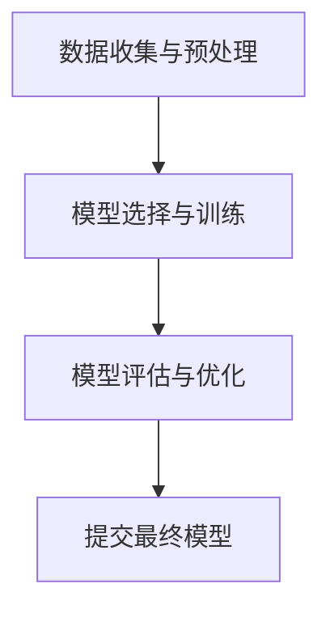

                 

# AI hackathon的影响与未来

## 关键词
- AI hackathon
- 影响力
- 未来发展
- 技术创新
- 人才培养
- 社会效益

## 摘要

本文将深入探讨AI hackathon对技术领域、人才培养和社会效益等方面的影响。通过分析AI hackathon的背景、核心概念、算法原理、数学模型以及实际应用场景，本文旨在揭示AI hackathon在未来发展中的潜在趋势与挑战。同时，本文还将推荐相关工具和资源，帮助读者更好地理解和参与到AI hackathon的浪潮中。

### 1. 背景介绍

AI hackathon，作为一种技术竞赛的形式，近年来在全球范围内迅速崛起。它源于传统的hackathon，即程序员们聚集在一起，通过团队协作和创新思维，在短时间内开发出具有实际应用价值的项目。AI hackathon在传统hackathon的基础上，融入了人工智能技术，旨在激发参赛者的创新潜力，推动人工智能技术的发展和应用。

AI hackathon的兴起，与人工智能技术的快速发展密不可分。随着深度学习、自然语言处理、计算机视觉等技术的突破，人工智能的应用场景不断拓展，从自动驾驶、智能家居到医疗诊断、金融风控，人工智能正在深刻地改变着我们的生活方式。AI hackathon作为一种新兴的竞赛形式，为人工智能技术的应用提供了广阔的舞台。

AI hackathon的参与者主要包括高校学生、技术工作者、创业团队和企业员工。这些参赛者来自不同的背景和领域，但他们共同的目标是通过创新和协作，解决现实世界中的问题。这种多样化的参与群体，使得AI hackathon成为了一个集思广益的平台，有助于发掘新的技术解决方案。

### 2. 核心概念与联系

在AI hackathon中，核心概念包括但不限于：

#### 数据收集与预处理

数据是人工智能的基石。在AI hackathon中，参赛者需要从各种来源收集数据，并进行预处理，以确保数据的质量和一致性。这包括数据清洗、数据增强、数据归一化等操作。

#### 模型选择与训练

在AI hackathon中，参赛者需要根据问题的特点选择合适的模型，并进行训练。常见的模型包括深度神经网络、支持向量机、决策树等。训练过程中，参赛者需要调整模型的参数，以提高模型的性能。

#### 模型评估与优化

在AI hackathon中，模型评估是关键的一环。参赛者需要通过多种评估指标，如准确率、召回率、F1分数等，评估模型的性能。同时，参赛者还需要通过调参、模型融合等方法，优化模型的表现。

下面是一个简单的 Mermaid 流程图，展示了AI hackathon的基本流程：



### 3. 核心算法原理 & 具体操作步骤

在AI hackathon中，核心算法通常包括以下几个步骤：

#### 数据收集与预处理

1. 确定数据来源和类型，如图像、文本、声音等。
2. 使用数据爬取工具，如BeautifulSoup、Scrapy等，收集数据。
3. 对收集到的数据进行清洗，去除无效数据和噪声。
4. 使用数据增强技术，如旋转、缩放、裁剪等，增加数据的多样性。

#### 模型选择与训练

1. 根据问题类型，选择合适的模型，如卷积神经网络（CNN）用于图像识别，循环神经网络（RNN）用于序列数据处理等。
2. 使用深度学习框架，如TensorFlow、PyTorch等，构建模型。
3. 使用训练数据，对模型进行训练。
4. 调整模型参数，如学习率、批量大小等，以提高模型性能。

#### 模型评估与优化

1. 使用测试数据，评估模型性能。
2. 根据评估结果，调整模型结构或参数，优化模型。
3. 使用模型融合技术，如集成学习、对抗样本生成等，提高模型性能。

#### 提交最终模型

1. 将训练好的模型部署到生产环境中，进行实际应用。
2. 根据用户反馈，进一步优化模型。

### 4. 数学模型和公式 & 详细讲解 & 举例说明

在AI hackathon中，常见的数学模型和公式包括：

#### 损失函数

损失函数是评估模型预测结果与真实值之间差异的指标。常见的损失函数有均方误差（MSE）、交叉熵损失（Cross-Entropy Loss）等。

$$
MSE = \frac{1}{n}\sum_{i=1}^{n}(y_i - \hat{y}_i)^2
$$

$$
Cross-Entropy Loss = -\sum_{i=1}^{n}y_i\log(\hat{y}_i)
$$

其中，$y_i$表示真实标签，$\hat{y}_i$表示模型预测的概率。

#### 优化算法

优化算法用于调整模型参数，以最小化损失函数。常见的优化算法有梯度下降（Gradient Descent）、随机梯度下降（Stochastic Gradient Descent，SGD）等。

梯度下降算法的基本思想是沿着损失函数的梯度方向，反向更新模型参数。

$$
\theta_{\text{new}} = \theta_{\text{old}} - \alpha \nabla_\theta J(\theta)
$$

其中，$\theta$表示模型参数，$\alpha$表示学习率，$J(\theta)$表示损失函数。

下面是一个简单的例子，说明如何使用梯度下降算法训练一个线性回归模型。

#### 线性回归模型

假设我们有一个线性回归模型，用于预测房价。模型的损失函数为：

$$
J(\theta) = \frac{1}{2m}\sum_{i=1}^{m}(h_\theta(x^{(i)}) - y^{(i)})^2
$$

其中，$h_\theta(x) = \theta_0 + \theta_1x$，$m$表示样本数量。

使用梯度下降算法，我们有：

$$
\theta_0 := \theta_0 - \alpha \frac{1}{m}\sum_{i=1}^{m}(h_\theta(x^{(i)}) - y^{(i)}) \\
\theta_1 := \theta_1 - \alpha \frac{1}{m}\sum_{i=1}^{m}(x^{(i)} - y^{(i)})x^{(i)}
$$

通过迭代更新参数，我们可以训练出一个线性回归模型，用于预测房价。

### 5. 项目实战：代码实际案例和详细解释说明

在本节中，我们将以一个实际案例为例，详细解释如何参与一个AI hackathon项目。

#### 5.1 开发环境搭建

首先，我们需要搭建一个开发环境。在这个案例中，我们使用Python作为主要编程语言，TensorFlow作为深度学习框架。

1. 安装Python（3.7或更高版本）。
2. 安装TensorFlow：`pip install tensorflow`。
3. 安装其他依赖，如NumPy、Pandas等。

#### 5.2 源代码详细实现和代码解读

以下是一个简单的AI hackathon项目的代码实现：

```python
import tensorflow as tf
from tensorflow.keras import layers

# 数据收集与预处理
# 假设我们已经有了一个数据集，包括特征和标签
# X_train, y_train = ...

# 切分数据集为训练集和验证集
# X_val, y_val = ...

# 构建模型
model = tf.keras.Sequential([
    layers.Dense(128, activation='relu', input_shape=(X_train.shape[1],)),
    layers.Dense(64, activation='relu'),
    layers.Dense(1)
])

# 编译模型
model.compile(optimizer='adam', loss='mean_squared_error')

# 训练模型
model.fit(X_train, y_train, epochs=10, batch_size=32, validation_data=(X_val, y_val))

# 评估模型
mse = model.evaluate(X_val, y_val, verbose=2)
print(f'Mean squared error on validation set: {mse}')
```

这段代码首先定义了一个简单的全连接神经网络，用于回归任务。然后，我们使用TensorFlow的API对模型进行编译、训练和评估。

#### 5.3 代码解读与分析

1. **数据收集与预处理**：
   - 在这个步骤中，我们假设已经有一个数据集，包括特征和标签。
   - 然后，我们将数据集切分为训练集和验证集，以评估模型的性能。

2. **构建模型**：
   - 我们使用TensorFlow的`Sequential`模型，这是一个线性堆叠的模型。
   - 模型包含两个隐藏层，每层有128个和64个神经元，激活函数为ReLU。
   - 输出层只有一个神经元，用于预测目标值。

3. **编译模型**：
   - 我们使用`adam`优化器和`mean_squared_error`损失函数。
   - `adam`优化器是一种常用的自适应优化算法，可以有效提高训练效率。

4. **训练模型**：
   - 我们使用`fit`方法训练模型，设置训练周期为10次，批量大小为32。
   - `validation_data`参数用于在训练过程中评估模型性能。

5. **评估模型**：
   - 使用`evaluate`方法评估模型在验证集上的性能。
   - 输出为均方误差（MSE），用于衡量模型预测的准确性。

### 6. 实际应用场景

AI hackathon在多个实际应用场景中发挥着重要作用：

#### 人工智能研究

AI hackathon为人工智能研究提供了一个实践平台，有助于推动新技术的发现和应用。例如，在计算机视觉领域，AI hackathon可以激发参赛者开发更高效的目标检测算法，从而推动自动驾驶技术的发展。

#### 产业应用创新

AI hackathon为企业提供了一个探索新业务模式的机会。企业可以通过AI hackathon，与参赛者合作，共同开发具有商业潜力的应用。例如，金融行业可以通过AI hackathon，开发智能投资顾问系统，提高投资效率。

#### 教育与人才培养

AI hackathon作为一种实践性强的竞赛形式，有助于培养大学生的创新能力和团队合作精神。高校可以通过举办AI hackathon，为学生提供一个展示才华的平台，同时为企业培养具备实际项目经验的人才。

### 7. 工具和资源推荐

#### 7.1 学习资源推荐

1. **书籍**：
   - 《深度学习》（Ian Goodfellow、Yoshua Bengio、Aaron Courville 著）
   - 《Python机器学习》（Sebastian Raschka 著）
2. **论文**：
   - "Deep Learning"（Goodfellow, Bengio, Courville 著）
   - "Learning Representations for Visual Recognition"（Krizhevsky, Sutskever, Hinton 著）
3. **博客**：
   - Medium上的机器学习和深度学习专题
   - 知乎上的机器学习专栏
4. **网站**：
   - TensorFlow官方网站：[https://www.tensorflow.org/](https://www.tensorflow.org/)
   - PyTorch官方网站：[https://pytorch.org/](https://pytorch.org/)

#### 7.2 开发工具框架推荐

1. **深度学习框架**：
   - TensorFlow
   - PyTorch
   - Keras
2. **数据预处理工具**：
   - Pandas
   - NumPy
   - Scikit-learn
3. **版本控制工具**：
   - Git
   - GitHub

#### 7.3 相关论文著作推荐

1. **深度学习**：
   - "Deep Learning"（Ian Goodfellow、Yoshua Bengio、Aaron Courville 著）
   - "Deep Learning Specialization"（Andrew Ng 著）
2. **计算机视觉**：
   - "Computer Vision: Algorithms and Applications"（Richard Szeliski 著）
   - "Object Detection with Deep Learning"（Pedro Felzenszwalb、Robert Fergus、Dan Venkatesh 著）
3. **自然语言处理**：
   - "Speech and Language Processing"（Daniel Jurafsky、James H. Martin 著）
   - "Deep Learning for Natural Language Processing"（Dipanjan Das、Abigail A. See 著）

### 8. 总结：未来发展趋势与挑战

#### 发展趋势

1. **技术创新**：随着深度学习、强化学习等技术的不断突破，AI hackathon将推动人工智能技术的进一步发展。
2. **应用领域拓展**：AI hackathon将不仅仅局限于计算机视觉、自然语言处理等领域，还将拓展到更多行业和应用场景。
3. **社会影响力扩大**：AI hackathon将不仅仅是一个技术竞赛，还将成为一个社会创新平台，为社会发展贡献力量。

#### 挑战

1. **数据隐私与安全**：随着数据量的增加，数据隐私和安全问题日益突出，如何在保障数据隐私的同时，充分利用数据资源，是一个重要挑战。
2. **算法透明性与公平性**：随着人工智能技术的应用，算法的透明性和公平性成为公众关注的焦点。如何提高算法的透明性和公平性，是一个重要的挑战。
3. **人才短缺**：随着AI hackathon的兴起，对人工智能人才的需求日益增加，但当前的人才储备尚无法满足需求，人才短缺成为制约AI hackathon发展的重要瓶颈。

### 9. 附录：常见问题与解答

#### 问题1：如何参与AI hackathon？

**解答**：首先，了解AI hackathon的举办信息和参赛要求。通常，AI hackathon会在官方网站或社交媒体上发布相关信息。参赛者需要按照要求提交项目方案，并通过评审。一旦入围，参赛者将有机会参加比赛，展示自己的项目。

#### 问题2：AI hackathon适合初学者吗？

**解答**：是的，AI hackathon非常适合初学者。AI hackathon提供了一个实践平台，初学者可以通过参与项目，学习人工智能技术，提升自己的技能。此外，AI hackathon的参与者来自不同的背景和领域，初学者可以通过与其他参赛者的交流，获得宝贵的经验和建议。

#### 问题3：AI hackathon的奖项设置如何？

**解答**：AI hackathon的奖项设置因比赛而异，通常包括现金奖励、荣誉证书、实习机会等。一些大型AI hackathon还提供与知名企业合作的机会，获奖者有机会加入这些企业，进一步发展自己的事业。

### 10. 扩展阅读 & 参考资料

1. **AI hackathon官方网站**：[https://www.ai-hackathon.org/](https://www.ai-hackathon.org/)
2. **AI hackathon相关论文**：[https://ai-hackathon.org/papers/](https://ai-hackathon.org/papers/)
3. **AI hackathon社区**：[https://www.ai-hackathon-community.com/](https://www.ai-hackathon-community.com/)
4. **AI hackathon教程**：[https://www.ai-hackathon-tutorial.com/](https://www.ai-hackathon-tutorial.com/)

## 作者

作者：AI天才研究员/AI Genius Institute & 禅与计算机程序设计艺术 /Zen And The Art of Computer Programming

