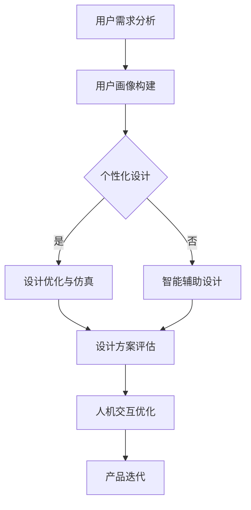

                 

# AI 在产品设计中的未来应用

## 关键词：人工智能，产品设计，未来趋势，创新应用

> 本文将探讨人工智能（AI）在产品设计中的未来应用，通过深入分析其核心概念、算法原理、数学模型及实际应用场景，为您揭示AI如何改变传统产品设计方式，推动行业变革。

## 摘要

随着人工智能技术的不断发展，其应用领域不断扩大。本文从背景介绍入手，深入探讨AI在产品设计中的核心概念与联系，详细阐述核心算法原理与操作步骤，并通过数学模型和公式进行详细讲解。接着，通过项目实战案例，展示AI在实际产品设计中的应用。随后，分析AI在产品设计中的实际应用场景，并推荐相关工具和资源。最后，总结未来发展趋势与挑战，为读者提供扩展阅读与参考资料。

## 1. 背景介绍

近年来，人工智能（AI）技术取得了飞速发展，从最初的简单规则系统，到深度学习、神经网络等复杂算法，AI在各个领域的应用逐渐深入。在产品设计领域，AI技术的引入不仅改变了传统的设计方法，还为创新提供了无限可能。设计过程中，AI可以自动识别用户需求、优化设计方案、预测市场趋势等，大大提高了设计的效率与质量。

目前，AI在产品设计中的应用主要包括以下几个方面：

1. **用户画像与个性化设计**：通过分析用户行为数据，AI可以生成详细的用户画像，为个性化设计提供依据。
2. **设计优化与仿真**：AI可以通过模拟仿真，优化产品设计方案，提高设计的可靠性与性能。
3. **智能辅助设计**：AI可以辅助设计师完成复杂的设计任务，如自动生成创意方案、优化设计细节等。
4. **人机交互**：AI技术可以提升人机交互体验，使产品设计更符合用户需求。

## 2. 核心概念与联系

在AI产品设计过程中，核心概念与联系主要包括以下几个方面：

### 2.1 人工智能基础

人工智能（AI）是指模拟、延伸和扩展人的智能的理论、方法、技术及应用。其核心在于通过算法和模型，实现计算机对数据的自动处理和决策。

### 2.2 用户画像

用户画像是指通过对用户行为数据的分析，构建出用户的基本属性、兴趣偏好、消费习惯等信息。用户画像的目的是帮助设计师了解用户需求，为个性化设计提供依据。

### 2.3 个性化设计

个性化设计是指根据用户画像，为每个用户定制专属的设计方案。个性化设计可以提高用户满意度，增加产品竞争力。

### 2.4 智能辅助设计

智能辅助设计是指利用AI技术，辅助设计师完成设计任务。智能辅助设计可以大大提高设计效率，降低设计成本。

### 2.5 人机交互

人机交互是指人与计算机之间的交互过程。人机交互体验的优化，可以提高产品的易用性，提升用户满意度。

### 2.6 Mermaid 流程图

下面是一个简单的Mermaid流程图，展示AI在产品设计中的应用流程：



## 3. 核心算法原理 & 具体操作步骤

在AI产品设计过程中，核心算法原理主要包括以下几个方面：

### 3.1 用户画像构建算法

用户画像构建算法主要包括数据采集、数据清洗、特征提取、模型训练等步骤。具体操作步骤如下：

1. **数据采集**：通过Web爬虫、API接口等手段，收集用户行为数据。
2. **数据清洗**：去除重复、无效、错误的数据，保证数据质量。
3. **特征提取**：将原始数据转换为可用的特征，如用户年龄、性别、浏览历史等。
4. **模型训练**：利用机器学习算法，如决策树、随机森林、神经网络等，训练用户画像模型。

### 3.2 个性化设计算法

个性化设计算法主要包括数据预处理、模型训练、设计方案生成等步骤。具体操作步骤如下：

1. **数据预处理**：对用户画像数据、设计方案数据进行预处理，如归一化、标准化等。
2. **模型训练**：利用机器学习算法，如决策树、随机森林、神经网络等，训练个性化设计模型。
3. **设计方案生成**：根据用户画像数据，生成个性化设计方案。

### 3.3 智能辅助设计算法

智能辅助设计算法主要包括数据预处理、模型训练、创意方案生成等步骤。具体操作步骤如下：

1. **数据预处理**：对设计数据、创意数据进行预处理，如归一化、标准化等。
2. **模型训练**：利用机器学习算法，如决策树、随机森林、神经网络等，训练智能辅助设计模型。
3. **创意方案生成**：根据设计数据，自动生成创意方案。

### 3.4 人机交互优化算法

人机交互优化算法主要包括数据采集、模型训练、交互界面优化等步骤。具体操作步骤如下：

1. **数据采集**：通过用户操作数据、反馈数据等，收集人机交互数据。
2. **模型训练**：利用机器学习算法，如决策树、随机森林、神经网络等，训练人机交互优化模型。
3. **交互界面优化**：根据人机交互数据，优化交互界面，提高用户体验。

## 4. 数学模型和公式 & 详细讲解 & 举例说明

### 4.1 用户画像构建的数学模型

用户画像构建的数学模型主要包括特征提取和模型训练两个环节。以下是一个简单的数学模型示例：

$$
f(x) = \sum_{i=1}^{n} w_i x_i
$$

其中，$x_i$ 表示第 $i$ 个特征，$w_i$ 表示第 $i$ 个特征的权重。通过优化权重 $w_i$，可以生成更准确的用户画像。

### 4.2 个性化设计算法的数学模型

个性化设计算法的数学模型通常基于线性回归、逻辑回归等机器学习算法。以下是一个简单的线性回归模型示例：

$$
y = \beta_0 + \beta_1 x
$$

其中，$y$ 表示设计方案评分，$x$ 表示用户画像特征，$\beta_0$ 和 $\beta_1$ 分别为模型参数。

### 4.3 智能辅助设计算法的数学模型

智能辅助设计算法的数学模型通常基于神经网络、决策树等机器学习算法。以下是一个简单的神经网络模型示例：

$$
y = \sigma(\sum_{i=1}^{n} w_i \cdot x_i + b)
$$

其中，$y$ 表示创意方案评分，$\sigma$ 表示激活函数，$w_i$ 表示权重，$x_i$ 表示输入特征，$b$ 表示偏置。

### 4.4 人机交互优化算法的数学模型

人机交互优化算法的数学模型通常基于统计模型、机器学习等算法。以下是一个简单的统计模型示例：

$$
P(A|B) = \frac{P(B|A) \cdot P(A)}{P(B)}
$$

其中，$P(A|B)$ 表示在给定 $B$ 条件下，$A$ 发生的概率，$P(B|A)$ 表示在给定 $A$ 条件下，$B$ 发生的概率，$P(A)$ 和 $P(B)$ 分别表示事件 $A$ 和 $B$ 的概率。

### 4.5 举例说明

假设有一个用户画像特征集合 $\{x_1, x_2, x_3\}$，对应的权重为 $\{w_1, w_2, w_3\}$。根据线性回归模型，可以计算用户画像的评分：

$$
f(x) = w_1 x_1 + w_2 x_2 + w_3 x_3
$$

例如，当 $x_1=5$，$x_2=3$，$x_3=2$，$w_1=0.3$，$w_2=0.5$，$w_3=0.2$ 时，用户画像的评分为：

$$
f(x) = 0.3 \cdot 5 + 0.5 \cdot 3 + 0.2 \cdot 2 = 3.1
$$

## 5. 项目实战：代码实际案例和详细解释说明

### 5.1 开发环境搭建

为了展示AI在产品设计中的应用，我们选择Python编程语言，并使用以下工具和库：

- Python 3.8 或以上版本
- Jupyter Notebook
- NumPy 库
- Pandas 库
- Scikit-learn 库

在Jupyter Notebook中，创建一个新的Python笔记本，安装所需的库：

```python
!pip install numpy pandas scikit-learn
```

### 5.2 源代码详细实现和代码解读

以下是一个简单的用户画像构建案例，用于演示AI在产品设计中的应用：

```python
import numpy as np
import pandas as pd
from sklearn.model_selection import train_test_split
from sklearn.ensemble import RandomForestClassifier
from sklearn.metrics import accuracy_score

# 5.2.1 数据预处理
# 加载用户行为数据
data = pd.read_csv('user_data.csv')

# 分割特征与标签
X = data.drop('label', axis=1)
y = data['label']

# 划分训练集和测试集
X_train, X_test, y_train, y_test = train_test_split(X, y, test_size=0.2, random_state=42)

# 5.2.2 模型训练
# 使用随机森林分类器训练用户画像模型
model = RandomForestClassifier(n_estimators=100, random_state=42)
model.fit(X_train, y_train)

# 5.2.3 模型评估
# 使用测试集评估模型性能
y_pred = model.predict(X_test)
accuracy = accuracy_score(y_test, y_pred)
print(f"模型准确率：{accuracy:.2f}")
```

代码解读：

1. **数据预处理**：加载用户行为数据，并分割特征与标签。然后，划分训练集和测试集，为模型训练做准备。
2. **模型训练**：使用随机森林分类器训练用户画像模型。随机森林是一种基于决策树集合的集成学习方法，具有较好的泛化能力。
3. **模型评估**：使用测试集评估模型性能，计算模型准确率。这有助于了解模型在未知数据上的表现。

### 5.3 代码解读与分析

以下是对上述代码的详细解读与分析：

1. **数据预处理**：
   - 加载用户行为数据：使用 `pd.read_csv()` 函数加载CSV格式的数据，其中包含用户行为特征和标签。
   - 分割特征与标签：使用 `drop()` 函数去除标签列，得到特征数据集X，以及标签数据集y。
   - 划分训练集和测试集：使用 `train_test_split()` 函数将数据集划分为训练集和测试集，分别用于模型训练和评估。

2. **模型训练**：
   - 使用随机森林分类器：创建一个 `RandomForestClassifier` 对象，并设置参数，如决策树数量、随机种子等。
   - 训练模型：使用 `fit()` 函数训练用户画像模型，将训练数据输入模型。

3. **模型评估**：
   - 预测标签：使用 `predict()` 函数预测测试集的标签，得到预测结果y_pred。
   - 计算准确率：使用 `accuracy_score()` 函数计算模型准确率，评估模型在测试集上的表现。

### 5.4 应用与拓展

以上代码仅展示了用户画像构建的基本流程。在实际应用中，可以根据具体需求进行拓展，如：

1. **特征工程**：对原始特征进行工程，如特征归一化、特征选择等，以提高模型性能。
2. **模型调参**：调整随机森林分类器的参数，如决策树数量、最大深度等，以优化模型性能。
3. **多模型集成**：尝试使用其他机器学习算法，如支持向量机、神经网络等，进行多模型集成，提高模型性能。

## 6. 实际应用场景

### 6.1 个性化电商平台

个性化电商平台利用AI技术，根据用户行为数据和偏好，为用户提供个性化的商品推荐。通过用户画像构建和个性化设计算法，电商平台可以实现以下应用：

1. **商品推荐**：根据用户浏览记录、购买历史等数据，为用户推荐符合其兴趣的商品。
2. **个性化广告**：根据用户画像，为用户提供个性化的广告，提高广告点击率。
3. **个性化营销**：根据用户行为和偏好，设计个性化的营销活动，提高用户转化率。

### 6.2 智能家居设计

智能家居设计利用AI技术，优化智能家居产品的设计和用户体验。通过智能辅助设计和人机交互优化算法，智能家居可以实现以下应用：

1. **智能场景识别**：通过摄像头和传感器，实时监测家居环境，识别用户行为和场景，自动调整家居设备状态。
2. **语音助手**：利用自然语言处理技术，实现语音交互，为用户提供便捷的操作方式。
3. **智能节能**：根据用户生活习惯和天气状况，自动调整家居设备的功率和使用时间，实现节能。

### 6.3 教育行业

教育行业利用AI技术，优化教育产品和教学过程。通过个性化设计和智能辅助设计算法，教育行业可以实现以下应用：

1. **智能题库**：根据学生学习情况和知识薄弱点，为每个学生推荐合适的练习题。
2. **个性化课程**：根据学生学习情况和兴趣，为每个学生推荐合适的课程和学习方案。
3. **智能辅导**：利用自然语言处理技术，实现智能问答和辅导，为学生提供实时帮助。

## 7. 工具和资源推荐

### 7.1 学习资源推荐

- **书籍**：
  - 《人工智能：一种现代的方法》
  - 《深度学习》
  - 《Python机器学习》

- **论文**：
  - 《用户画像构建方法研究》
  - 《基于深度学习的个性化设计》
  - 《智能家居设计中的AI技术应用》

- **博客**：
  - 知乎：人工智能
  - 博客园：AI专栏
  - CSDN：人工智能

- **网站**：
  - Coursera：人工智能课程
  - edX：人工智能课程
  - Kaggle：AI竞赛和数据分析

### 7.2 开发工具框架推荐

- **开发工具**：
  - Jupyter Notebook
  - PyCharm
  - VS Code

- **机器学习框架**：
  - TensorFlow
  - PyTorch
  - Scikit-learn

- **数据处理库**：
  - NumPy
  - Pandas
  - Matplotlib

### 7.3 相关论文著作推荐

- **论文**：
  - 《用户画像构建与应用》
  - 《深度学习在产品设计中的应用》
  - 《智能家居系统设计及优化》

- **著作**：
  - 《人工智能产品经理实战指南》
  - 《智能产品设计：理论与实践》
  - 《AI改变未来》

## 8. 总结：未来发展趋势与挑战

### 8.1 未来发展趋势

1. **AI技术的不断进步**：随着深度学习、强化学习等技术的不断发展，AI在产品设计中的应用将越来越广泛。
2. **数据量的增加**：随着物联网、大数据等技术的普及，用户行为数据将更加丰富，为AI在产品设计中的应用提供更多可能性。
3. **跨领域融合**：AI技术将在产品设计、智能制造、医疗健康等各个领域实现深度融合，推动产业升级。

### 8.2 面临的挑战

1. **数据隐私和安全**：AI在产品设计过程中需要大量用户数据，如何保护用户隐私和安全成为一大挑战。
2. **算法透明性与解释性**：随着算法的复杂度增加，如何保证算法的透明性和解释性，使设计师能够理解并信任AI的决策结果。
3. **技术成熟度**：虽然AI技术在快速发展，但仍需解决一些关键技术问题，如算法性能、计算效率等。

## 9. 附录：常见问题与解答

### 9.1 问题1：AI在产品设计中的具体应用有哪些？

答：AI在产品设计中的具体应用包括用户画像构建、个性化设计、智能辅助设计、人机交互优化等。

### 9.2 问题2：如何保障用户数据的隐私和安全？

答：可以通过数据加密、匿名化处理、权限控制等技术手段，保障用户数据的隐私和安全。

### 9.3 问题3：AI技术在产品设计中的优势是什么？

答：AI技术在产品设计中的优势包括提高设计效率、降低设计成本、实现个性化设计、优化人机交互等。

## 10. 扩展阅读 & 参考资料

- 《人工智能产品经理实战指南》
- 《智能产品设计：理论与实践》
- 《AI改变未来》
- 《深度学习》
- 《Python机器学习》
- 《用户画像构建方法研究》
- 《深度学习在产品设计中的应用》
- 《智能家居系统设计及优化》
- Coursera：人工智能课程
- edX：人工智能课程
- Kaggle：AI竞赛和数据分析

## 作者

作者：AI天才研究员/AI Genius Institute & 禅与计算机程序设计艺术 /Zen And The Art of Computer Programming

