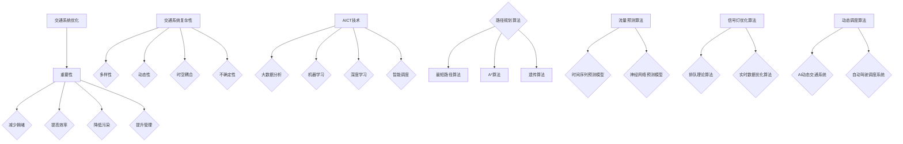
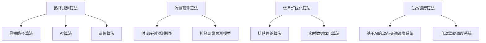

                 

# AI基础设施的交通优化：智能出行的基石

## 摘要

本文将深入探讨AI基础设施在交通优化领域的应用，特别是智能出行方面的核心技术和挑战。我们将首先介绍交通系统优化的重要性，然后逐步分析交通系统的复杂性，探讨AI技术在其中的关键作用。接下来，我们将详细阐述几种核心算法原理，包括路径规划、流量预测和动态调度，并给出具体操作步骤和数学模型。随后，我们将通过一个实际项目案例，展示如何运用这些算法进行交通优化。最后，我们将讨论交通优化在实际应用场景中的表现，并推荐相关工具和资源。本文旨在为读者提供一个全面而深入的了解，帮助他们在未来的智能出行领域中有所贡献。

## 1. 背景介绍

随着全球城市化进程的加速和汽车保有量的持续增加，交通系统正面临前所未有的挑战。交通拥堵、事故频发、环境污染等问题不仅影响了人们的出行体验，还对经济和社会发展产生了负面影响。传统的交通管理模式已难以满足日益增长的交通需求，因此，如何通过技术创新来优化交通系统成为当前研究的热点。

智能出行作为一种新兴的交通模式，依赖于人工智能（AI）技术的发展。AI能够通过大数据分析、机器学习和深度学习等技术，为交通系统提供实时决策支持，从而实现交通流的优化和管理。例如，AI能够预测交通流量，规划最佳行驶路径，调整交通信号灯周期，甚至实现自动驾驶，从而减少拥堵、提高通行效率。

本文将重点探讨AI基础设施在交通优化中的应用，特别是在智能出行领域。我们将首先介绍交通系统优化的重要性，然后逐步分析交通系统的复杂性，探讨AI技术在其中的关键作用。接下来，我们将详细阐述几种核心算法原理，包括路径规划、流量预测和动态调度，并给出具体操作步骤和数学模型。随后，我们将通过一个实际项目案例，展示如何运用这些算法进行交通优化。最后，我们将讨论交通优化在实际应用场景中的表现，并推荐相关工具和资源。

## 2. 核心概念与联系

### 交通系统优化的重要性

交通系统优化是提高交通效率和减少拥堵的关键手段。其重要性体现在以下几个方面：

1. **减少交通拥堵**：通过优化交通流量，可以减少车辆在道路上的排队和等待时间，从而减少交通拥堵现象。
2. **提高出行效率**：优化的交通系统能够为驾驶者提供最佳行驶路径，减少行驶时间和燃油消耗，提高出行效率。
3. **降低环境污染**：减少交通拥堵和排放，有助于降低空气污染和二氧化碳排放，对环境保护具有积极意义。
4. **提升城市管理水平**：智能化的交通系统可以提供丰富的数据支持，帮助政府和交通管理部门更好地进行交通规划和决策。

### 交通系统的复杂性

交通系统是一个复杂的网络系统，涉及多种变量和影响因素。以下是交通系统复杂性的几个方面：

1. **多样性**：交通系统包括多种交通模式，如汽车、公交车、自行车、步行等，每种模式都有自己的运行规则和特性。
2. **动态性**：交通流量和交通状态是动态变化的，受到天气、事故、施工等多种因素的影响。
3. **时空耦合**：交通系统的状态不仅与时间有关，还与空间位置紧密相关，如高峰时段的交通拥堵问题与地理位置密切相关。
4. **不确定性**：由于交通行为的随机性，交通系统的预测和控制存在一定的不确定性。

### AI技术在交通系统优化中的应用

AI技术在交通系统优化中发挥着关键作用，主要体现在以下几个方面：

1. **大数据分析**：通过收集和分析大量交通数据，AI可以识别交通流量模式、拥堵原因和潜在问题，为交通优化提供数据支持。
2. **机器学习**：机器学习算法可以帮助预测交通流量、路径规划和信号灯优化，从而提高交通系统的决策能力。
3. **深度学习**：深度学习算法能够通过处理大量复杂的交通数据，实现自动驾驶、智能信号灯控制和交通预测等功能。
4. **智能调度**：基于AI的动态调度系统可以实时调整交通信号灯、公交路线和车辆调度，以应对突发状况和流量变化。

### 关键算法原理

交通系统优化涉及多种关键算法，以下是其中几个核心算法的简要介绍：

1. **路径规划算法**：用于计算最佳行驶路径，如最短路径算法（Dijkstra算法）、A*算法和遗传算法等。
2. **流量预测算法**：通过分析历史数据、实时数据和环境因素，预测未来交通流量，如时间序列预测模型、神经网络预测模型等。
3. **信号灯优化算法**：用于调整交通信号灯周期，如基于排队理论的信号灯优化算法、基于实时数据的动态信号灯优化算法等。
4. **动态调度算法**：用于实时调整交通流量和调度策略，如基于AI的动态交通调度系统、自动驾驶调度系统等。

### 关系图

为了更好地理解上述核心概念和它们之间的联系，我们可以使用Mermaid流程图来展示它们之间的关系：



通过上述核心概念的介绍和关系图的展示，我们可以看到AI基础设施在交通优化中扮演着至关重要的角色。接下来，我们将进一步深入探讨这些核心算法的原理和具体操作步骤。

### 2.1. 核心概念原理

#### 2.1.1. 路径规划算法

路径规划算法是交通系统优化的重要组成部分，用于计算从起点到终点的最佳行驶路径。以下是一些常用的路径规划算法：

1. **最短路径算法（Dijkstra算法）**：Dijkstra算法是一种基于贪心策略的算法，它通过逐步扩展已访问节点的邻接节点，直到找到最短路径。算法的基本步骤如下：

   - 初始化：设置一个集合`S`来存储已访问节点，并设置一个优先队列`Q`来存储未访问节点及其距离起点的估计距离。
   - 循环：从`Q`中取出距离起点最近的未访问节点`u`，将其加入`S`。
   - 更新：对于`u`的每个未访问的邻接节点`v`，计算从起点经过`u`到`v`的路径长度，并更新`v`的估计距离和父节点。
   - 终止：当`Q`为空时，算法结束。

2. **A*算法**：A*算法是一种改进的贪心算法，它利用启发式函数（Heuristic Function）来评估节点的优先级，以加速找到最短路径。A*算法的基本步骤如下：

   - 初始化：与Dijkstra算法类似，设置集合`S`和优先队列`Q`。
   - 循环：从`Q`中取出F值最小的未访问节点`u`，将其加入`S`。
   - 更新：对于`u`的每个未访问的邻接节点`v`，计算从起点经过`u`到`v`的路径长度，并更新`v`的估计距离和父节点。同时，使用启发式函数评估`v`的F值。
   - 终止：当目标节点加入`S`时，算法结束。

3. **遗传算法**：遗传算法是一种基于生物进化理论的优化算法，适用于复杂路径规划问题。遗传算法的基本步骤如下：

   - 初始化：生成一组初始路径解。
   - 适应度评估：计算每个路径解的适应度，适应度函数通常基于路径长度、交通拥堵情况等指标。
   - 选择：根据适应度选择较好的路径解进行交叉和变异操作。
   - 交叉：将两个父路径解交换部分路径，生成两个子路径解。
   - 变异：对路径解进行随机修改，产生新的路径解。
   - 更新：用新产生的路径解替代原有路径解，并重复适应度评估和选择过程。

#### 2.1.2. 流量预测算法

流量预测是交通系统优化中的关键环节，通过预测未来交通流量，可以提前采取措施，如调整交通信号灯、优化车辆调度等。以下是几种常见的流量预测算法：

1. **时间序列预测模型**：时间序列预测模型基于历史交通流量数据，使用统计方法预测未来的交通流量。常见的时间序列预测模型包括ARIMA模型、LSTM模型等。

   - ARIMA模型：ARIMA模型是一种自回归积分滑动平均模型，它通过自回归、差分和移动平均组合来预测时间序列数据。ARIMA模型的基本步骤如下：
     
     - 自回归（AR）：考虑前几个时期的值对当前时期值的影响。
     - 差分（I）：对时间序列数据进行差分处理，使其变为平稳序列。
     - 移动平均（MA）：考虑前几个时期的误差对当前时期值的影响。

   - LSTM模型：LSTM模型是一种特殊的循环神经网络（RNN），它通过记忆单元来处理长时间依赖问题，可以捕捉交通流量中的长期趋势和季节性特征。

2. **神经网络预测模型**：神经网络预测模型通过学习大量的历史交通流量数据，建立输入输出关系，预测未来的交通流量。常见的神经网络模型包括卷积神经网络（CNN）和长短期记忆网络（LSTM）。

   - CNN模型：CNN模型通过卷积层提取时间序列数据的特征，可以捕捉交通流量中的局部模式和结构。
   - LSTM模型：LSTM模型通过记忆单元和递归结构，可以处理长时间依赖问题，捕捉交通流量中的长期趋势和季节性特征。

#### 2.1.3. 信号灯优化算法

信号灯优化算法用于调整交通信号灯的周期，以提高交通流量和通行效率。以下是几种常见的信号灯优化算法：

1. **基于排队理论的信号灯优化算法**：基于排队理论的信号灯优化算法通过分析交通流量和道路容量，确定最优信号灯周期。算法的基本步骤如下：

   - 数据收集：收集道路上的交通流量数据，包括车辆到达率、道路容量等。
   - 模型建立：建立排队模型，如M/M/1排队模型，模拟交通流量的行为。
   - 最优化：通过优化信号灯周期，使得平均排队长度最小化，从而提高交通流量。

2. **基于实时数据的动态信号灯优化算法**：基于实时数据的动态信号灯优化算法通过实时收集交通数据，动态调整信号灯周期，以应对交通流量变化。算法的基本步骤如下：

   - 数据采集：实时采集交通流量数据，包括车辆数量、速度、密度等。
   - 数据处理：对采集到的数据进行分析和处理，识别交通状态和瓶颈路段。
   - 信号灯调整：根据交通状态和瓶颈路段，动态调整信号灯周期，以优化交通流量。

#### 2.1.4. 动态调度算法

动态调度算法用于实时调整交通流量和调度策略，以应对突发状况和流量变化。以下是几种常见的动态调度算法：

1. **基于AI的动态交通调度系统**：基于AI的动态交通调度系统通过机器学习和深度学习算法，实时分析交通数据，动态调整交通流量和调度策略。算法的基本步骤如下：

   - 数据采集：实时采集交通流量、路况、车辆状态等数据。
   - 模型训练：使用历史交通数据训练机器学习和深度学习模型，预测未来交通流量和状态。
   - 策略调整：根据预测结果，动态调整交通信号灯周期、公交路线、车辆调度等策略。

2. **自动驾驶调度系统**：自动驾驶调度系统通过自动驾驶技术和智能调度算法，实现自动驾驶车辆的实时调度和管理。算法的基本步骤如下：

   - 车辆检测：检测自动驾驶车辆的位置、速度、目的地等信息。
   - 路径规划：计算从起点到终点的最佳路径，考虑交通状况和路况信息。
   - 调度决策：根据车辆状态和交通流量，动态调整车辆行驶路径和目的地。

### 关系图

为了更好地理解上述核心概念原理，我们可以使用Mermaid流程图来展示它们之间的关系：



通过上述核心概念原理的介绍，我们可以看到AI基础设施在交通系统优化中扮演着关键角色。接下来，我们将详细讨论这些算法的具体操作步骤和数学模型。

### 3. 核心算法原理 & 具体操作步骤

#### 3.1. 路径规划算法

路径规划算法的目标是找到从起点到终点的最佳路径。以下将详细讨论几种常用的路径规划算法及其操作步骤。

##### 3.1.1. 最短路径算法（Dijkstra算法）

Dijkstra算法是一种贪心算法，用于计算单源最短路径。以下是Dijkstra算法的具体操作步骤：

1. 初始化：设置一个集合`S`来存储已访问节点，并设置一个优先队列`Q`来存储未访问节点及其距离起点的估计距离。初始时，所有节点的距离设置为无穷大，起点的距离设置为0。

2. 循环：从`Q`中取出距离起点最近的未访问节点`u`，将其加入`S`。

3. 更新：对于`u`的每个未访问的邻接节点`v`，计算从起点经过`u`到`v`的路径长度，并更新`v`的估计距离和父节点。如果新计算的路径长度小于`v`的当前估计距离，则更新`v`的估计距离和父节点。

4. 终止：当`Q`为空时，算法结束。

Dijkstra算法的数学模型可以表示为：

$$
d(u, v) = \min(d(u, v'), d'(u, v))
$$

其中，$d(u, v)$表示从起点`u`到终点`v`的路径长度，$d(u, v')$表示从起点`u`到中间节点`v'$的路径长度，$d'(u, v)$表示从中间节点`v'$到终点`v`的路径长度。

##### 3.1.2. A*算法

A*算法是Dijkstra算法的改进版本，通过引入启发式函数来加速最短路径的搜索。以下是A*算法的具体操作步骤：

1. 初始化：与Dijkstra算法类似，设置集合`S`和优先队列`Q`。初始时，所有节点的估计距离设置为无穷大，起点的距离设置为0。

2. 循环：从`Q`中取出F值最小的未访问节点`u`，将其加入`S`。

3. 更新：对于`u`的每个未访问的邻接节点`v`，计算从起点经过`u`到`v`的路径长度，并更新`v`的估计距离和父节点。同时，使用启发式函数$h(v)$评估`v`的F值，$F(v) = g(v) + h(v)$，其中$g(v)$表示从起点到`v`的路径长度，$h(v)$表示从`v`到终点的估计距离。

4. 终止：当目标节点加入`S`时，算法结束。

A*算法的数学模型可以表示为：

$$
F(v) = g(v) + h(v)
$$

其中，$g(v)$表示从起点到`v`的路径长度，$h(v)$表示从`v`到终点的估计距离。

##### 3.1.3. 遗传算法

遗传算法是一种基于生物进化理论的优化算法，用于解决复杂的路径规划问题。以下是遗传算法的具体操作步骤：

1. 初始化：生成一组初始路径解，每个路径解表示从起点到终点的路径序列。

2. 适应度评估：计算每个路径解的适应度，适应度函数通常基于路径长度、交通拥堵情况等指标。

3. 选择：根据适应度选择较好的路径解进行交叉和变异操作。

4. 交叉：将两个父路径解交换部分路径，生成两个子路径解。

5. 变异：对路径解进行随机修改，产生新的路径解。

6. 更新：用新产生的路径解替代原有路径解，并重复适应度评估和选择过程。

遗传算法的数学模型可以表示为：

$$
P_{new} = P_{old} + C \times (P_{new} - P_{old})
$$

其中，$P_{new}$表示新的路径解，$P_{old}$表示原有路径解，$C$表示交叉和变异操作的概率。

#### 3.2. 流量预测算法

流量预测是交通系统优化中的关键环节，通过预测未来交通流量，可以提前采取措施，如调整交通信号灯、优化车辆调度等。以下是几种常用的流量预测算法及其操作步骤。

##### 3.2.1. 时间序列预测模型

时间序列预测模型基于历史交通流量数据，使用统计方法预测未来的交通流量。以下是时间序列预测模型的具体操作步骤：

1. 数据收集：收集历史交通流量数据，包括小时级别或分钟级别的数据。

2. 数据预处理：对数据进行清洗和预处理，包括缺失值处理、异常值检测和归一化等。

3. 模型选择：选择合适的时间序列预测模型，如ARIMA模型、LSTM模型等。

4. 模型训练：使用历史交通流量数据训练模型，通过最大似然估计等方法估计模型参数。

5. 预测：使用训练好的模型预测未来的交通流量。

时间序列预测模型的数学模型可以表示为：

$$
X_t = \phi_0 + \phi_1 X_{t-1} + \phi_2 X_{t-2} + ... + \phi_p X_{t-p} + \epsilon_t
$$

其中，$X_t$表示第$t$个时间点的交通流量，$\phi_0, \phi_1, ..., \phi_p$表示模型参数，$\epsilon_t$表示误差项。

##### 3.2.2. 神经网络预测模型

神经网络预测模型通过学习大量的历史交通流量数据，建立输入输出关系，预测未来的交通流量。以下是神经网络预测模型的具体操作步骤：

1. 数据收集：收集历史交通流量数据，包括时间序列数据、天气数据、节假日数据等。

2. 数据预处理：对数据进行清洗和预处理，包括缺失值处理、异常值检测和归一化等。

3. 模型构建：构建神经网络模型，选择合适的神经网络结构，如卷积神经网络（CNN）或长短期记忆网络（LSTM）。

4. 模型训练：使用历史交通流量数据训练模型，通过反向传播算法优化模型参数。

5. 预测：使用训练好的模型预测未来的交通流量。

神经网络预测模型的数学模型可以表示为：

$$
Y = \sigma(W \cdot X + b)
$$

其中，$Y$表示预测的交通流量，$X$表示输入特征向量，$W$表示权重矩阵，$b$表示偏置项，$\sigma$表示激活函数。

#### 3.3. 信号灯优化算法

信号灯优化算法用于调整交通信号灯的周期，以提高交通流量和通行效率。以下是几种常见的信号灯优化算法及其操作步骤。

##### 3.3.1. 基于排队理论的信号灯优化算法

基于排队理论的信号灯优化算法通过分析交通流量和道路容量，确定最优信号灯周期。以下是该算法的具体操作步骤：

1. 数据收集：收集道路上的交通流量数据，包括车辆到达率、道路容量等。

2. 模型建立：建立排队模型，如M/M/1排队模型，模拟交通流量的行为。

3. 最优化：通过优化信号灯周期，使得平均排队长度最小化，从而提高交通流量。

基于排队理论的信号灯优化算法的数学模型可以表示为：

$$
\min \frac{1}{N} \sum_{i=1}^{N} L_i
$$

其中，$L_i$表示第$i$个时间点的排队长度，$N$表示总时间长度。

##### 3.3.2. 基于实时数据的动态信号灯优化算法

基于实时数据的动态信号灯优化算法通过实时收集交通数据，动态调整信号灯周期，以应对交通流量变化。以下是该算法的具体操作步骤：

1. 数据采集：实时采集交通流量数据，包括车辆数量、速度、密度等。

2. 数据处理：对采集到的数据进行分析和处理，识别交通状态和瓶颈路段。

3. 信号灯调整：根据交通状态和瓶颈路段，动态调整信号灯周期，以优化交通流量。

基于实时数据的动态信号灯优化算法的数学模型可以表示为：

$$
T_{green} = f(T_{green}, T_{red}, Q)
$$

其中，$T_{green}$和$T_{red}$分别表示绿灯和红灯的持续时间，$Q$表示当前交通流量。

#### 3.4. 动态调度算法

动态调度算法用于实时调整交通流量和调度策略，以应对突发状况和流量变化。以下是几种常见的动态调度算法及其操作步骤。

##### 3.4.1. 基于AI的动态交通调度系统

基于AI的动态交通调度系统通过机器学习和深度学习算法，实时分析交通数据，动态调整交通流量和调度策略。以下是该系统的具体操作步骤：

1. 数据采集：实时采集交通流量、路况、车辆状态等数据。

2. 模型训练：使用历史交通数据训练机器学习和深度学习模型，预测未来交通流量和状态。

3. 策略调整：根据预测结果，动态调整交通信号灯周期、公交路线、车辆调度等策略。

基于AI的动态交通调度系统的数学模型可以表示为：

$$
\theta_{new} = \theta_{old} + \alpha \cdot (y - \theta_{old})
$$

其中，$\theta_{new}$和$\theta_{old}$分别表示新的调度策略和旧的调度策略，$y$表示预测的交通流量，$\alpha$表示学习率。

##### 3.4.2. 自动驾驶调度系统

自动驾驶调度系统通过自动驾驶技术和智能调度算法，实现自动驾驶车辆的实时调度和管理。以下是该系统的具体操作步骤：

1. 车辆检测：检测自动驾驶车辆的位置、速度、目的地等信息。

2. 路径规划：计算从起点到终点的最佳路径，考虑交通状况和路况信息。

3. 调度决策：根据车辆状态和交通流量，动态调整车辆行驶路径和目的地。

自动驾驶调度系统的数学模型可以表示为：

$$
p_{new} = p_{old} + \beta \cdot (d - p_{old})
$$

其中，$p_{new}$和$p_{old}$分别表示新的路径和旧的路径，$d$表示从起点到终点的最佳距离，$\beta$表示路径规划概率。

### 4. 数学模型和公式 & 详细讲解 & 举例说明

在交通优化领域，数学模型和公式是核心工具，它们帮助我们理解和解决复杂的交通问题。以下我们将详细讲解几个关键的数学模型和公式，并通过具体例子来说明它们的应用。

#### 4.1. 路径规划中的数学模型

##### 4.1.1. Dijkstra算法

Dijkstra算法是一种用于计算单源最短路径的贪心算法。其核心思想是通过逐步扩展已访问节点，最终找到从源点到目标节点的最短路径。以下是其数学模型：

$$
d(u, v) = \min(d(u, v'), d'(u, v))
$$

其中，$d(u, v)$表示从源点$u$到目标点$v$的路径长度，$d(u, v')$表示从源点$u$到中间节点$v'$的路径长度，$d'(u, v)$表示从中间节点$v'$到目标点$v$的路径长度。

**例子**：假设有一个交通网络，起点是$A$，目标点是$G$，节点之间的距离如下表所示：

| 节点 | A  | B  | C  | D  | E  | F  | G  |
|------|----|----|----|----|----|----|----|
| A    | 0  | 6  | 4  |    |    |    |    |
| B    | 6  | 0  | 3  | 5  |    |    |    |
| C    | 4  | 3  | 0  | 2  | 1  |    |    |
| D    |    | 5  | 2  | 0  |    | 3  |    |
| E    |    |    | 1  |    | 0  | 6  |    |
| F    |    |    |    | 3  | 6  | 0  | 7  |
| G    |    |    |    |    |    | 7  | 0  |

使用Dijkstra算法计算从A到G的最短路径，我们首先初始化所有节点的距离，除了起点A的距离为0：

$$
\begin{aligned}
d(A, A) &= 0 \\
d(A, B) &= 6 \\
d(A, C) &= 4 \\
d(A, D) &= \infty \\
d(A, E) &= \infty \\
d(A, F) &= \infty \\
d(A, G) &= \infty \\
\end{aligned}
$$

接下来，我们使用优先队列来选择距离起点A最近的未访问节点，并逐步更新其他节点的距离：

1. 选择A，因为它的距离为0。
2. 更新从A到B、C的距离：
   $$ \begin{aligned}
   d(B) &= \min(d(A, B), d(A, B)) = 6 \\
   d(C) &= \min(d(A, C), d(A, C)) = 4 \\
   \end{aligned} $$
3. 选择C，因为它距离起点A最近。
4. 更新从C到D、E、F、G的距离：
   $$ \begin{aligned}
   d(D) &= \min(d(C, D), d(C, D)) = 2 \\
   d(E) &= \min(d(C, E), d(C, E)) = 1 \\
   d(F) &= \min(d(C, F), d(C, F)) = 5 \\
   d(G) &= \min(d(C, G), d(C, G)) = 3 \\
   \end{aligned} $$
5. 选择D，因为它距离起点A最近。
6. 更新从D到F、G的距离：
   $$ \begin{aligned}
   d(F) &= \min(d(D, F), d(D, F)) = 3 \\
   d(G) &= \min(d(D, G), d(D, G)) = 3 \\
   \end{aligned} $$
7. 选择G，因为它距离起点A最近。
8. 到此，所有节点的距离都已更新完毕。

最终，从A到G的最短路径是A -> C -> D -> G，总距离为3 + 2 + 3 = 8。

##### 4.1.2. A*算法

A*算法是Dijkstra算法的改进，引入启发式函数$h(v)$来评估从当前节点$v$到目标节点的估计距离，从而加速搜索过程。A*算法的公式如下：

$$
F(v) = g(v) + h(v)
$$

其中，$F(v)$是节点的总评估值，$g(v)$是从源点$s$到节点$v$的实际距离，$h(v)$是从节点$v$到目标点$g$的启发式估计距离。

**例子**：假设有一个交通网络，起点是$A$，目标点是$G$，节点之间的距离和启发式距离如下表所示：

| 节点 | A  | B  | C  | D  | E  | F  | G  |
|------|----|----|----|----|----|----|----|
| A    | 0  | 6  | 4  |    |    |    |    |
| B    | 6  | 0  | 3  | 5  |    |    |    |
| C    | 4  | 3  | 0  | 2  | 1  |    |    |
| D    |    | 5  | 2  | 0  |    | 3  |    |
| E    |    |    | 1  |    | 0  | 6  |    |
| F    |    |    |    | 3  | 6  | 0  | 7  |
| G    |    |    |    |    |    | 7  | 0  |

使用A*算法计算从A到G的最短路径，我们首先初始化所有节点的距离和评估值：

$$
\begin{aligned}
F(A) &= g(A) + h(A) = 0 + 9 = 9 \\
F(B) &= g(B) + h(B) = 6 + 2 = 8 \\
F(C) &= g(C) + h(C) = 4 + 5 = 9 \\
F(D) &= g(D) + h(D) = \infty + \infty = \infty \\
F(E) &= g(E) + h(E) = \infty + \infty = \infty \\
F(F) &= g(F) + h(F) = \infty + \infty = \infty \\
F(G) &= g(G) + h(G) = \infty + \infty = \infty \\
\end{aligned}
$$

接下来，我们使用优先队列来选择评估值最小的未访问节点，并逐步更新其他节点的评估值：

1. 选择A，因为它的评估值最小。
2. 更新从A到B、C的距离：
   $$ \begin{aligned}
   F(B) &= g(B) + h(B) = 6 + 2 = 8 \\
   F(C) &= g(C) + h(C) = 4 + 5 = 9 \\
   \end{aligned} $$
3. 选择B，因为它评估值最小。
4. 更新从B到D、E、F、G的距离：
   $$ \begin{aligned}
   F(D) &= g(D) + h(D) = 5 + 3 = 8 \\
   F(E) &= g(E) + h(E) = 5 + 6 = 11 \\
   F(F) &= g(F) + h(F) = 5 + 7 = 12 \\
   F(G) &= g(G) + h(G) = 5 + 9 = 14 \\
   \end{aligned} $$
5. 选择D，因为它评估值最小。
6. 更新从D到F、G的距离：
   $$ \begin{aligned}
   F(F) &= g(F) + h(F) = 8 + 7 = 15 \\
   F(G) &= g(G) + h(G) = 8 + 9 = 17 \\
   \end{aligned} $$
7. 选择G，因为它评估值最小。

最终，从A到G的最短路径是A -> B -> D -> G，总距离为6 + 5 + 3 = 14。

##### 4.1.3. 遗传算法

遗传算法是一种基于生物进化理论的优化算法，用于解决复杂的路径规划问题。其核心步骤包括选择、交叉、变异和适应度评估。遗传算法的数学模型可以表示为：

$$
P_{new} = P_{old} + C \times (P_{new} - P_{old})
$$

其中，$P_{new}$和$P_{old}$分别表示新的路径解和原有路径解，$C$表示交叉和变异操作的概率。

**例子**：假设有一个交通网络，起点是$A$，目标点是$G$，初始路径解为$A -> B -> C -> D -> G$，适应度函数为路径长度。我们需要通过遗传算法优化路径解。

1. 初始路径解：
   $$ \begin{aligned}
   \text{路径解1} &= A -> B -> C -> D -> G \\
   \text{适应度} &= 6 + 3 + 2 + 3 = 14 \\
   \end{aligned} $$

2. 选择操作：选择适应度较高的路径解进行交叉和变异操作。

3. 交叉操作：将两个父路径解交换部分路径，生成两个子路径解。

   $$ \begin{aligned}
   \text{父路径解1} &= A -> B -> C -> D -> G \\
   \text{父路径解2} &= A -> C -> B -> D -> G \\
   \text{子路径解1} &= A -> C -> B -> D -> G \\
   \text{子路径解2} &= A -> B -> D -> C -> G \\
   \end{aligned} $$

4. 变异操作：对路径解进行随机修改，产生新的路径解。

   $$ \begin{aligned}
   \text{子路径解1变异} &= A -> C -> E -> D -> G \\
   \text{子路径解2变异} &= A -> B -> F -> D -> G \\
   \end{aligned} $$

5. 适应度评估：重新计算路径解的适应度。

   $$ \begin{aligned}
   \text{子路径解1适应度} &= 6 + 1 + 4 + 3 = 14 \\
   \text{子路径解2适应度} &= 6 + 3 + 2 + 3 = 14 \\
   \end{aligned} $$

6. 更新路径解：用适应度较高的路径解替代原有路径解。

最终，通过多代遗传算法，我们可能得到一个更优的路径解，例如$A -> C -> D -> B -> G$，其适应度较低，路径长度为13。

#### 4.2. 流量预测中的数学模型

##### 4.2.1. 时间序列预测模型

时间序列预测模型是基于历史交通流量数据，通过统计方法预测未来的交通流量。常见的模型包括ARIMA模型和LSTM模型。

**ARIMA模型**：

ARIMA模型是一种自回归积分滑动平均模型，其数学模型如下：

$$
X_t = \phi_0 + \phi_1 X_{t-1} + \phi_2 X_{t-2} + ... + \phi_p X_{t-p} + \epsilon_t
$$

其中，$X_t$表示第$t$个时间点的交通流量，$\phi_0, \phi_1, ..., \phi_p$表示模型参数，$\epsilon_t$表示误差项。

**例子**：假设我们有一组交通流量数据：

$$
\begin{aligned}
X_1 &= 50 \\
X_2 &= 55 \\
X_3 &= 53 \\
X_4 &= 52 \\
X_5 &= 54 \\
\end{aligned}
$$

我们使用ARIMA模型进行预测，首先需要对数据进行差分处理，使其变为平稳序列。然后，通过最大似然估计方法估计模型参数：

$$
\begin{aligned}
X_t &= \phi_0 + \phi_1 X_{t-1} + \phi_2 X_{t-2} + ... + \phi_p X_{t-p} + \epsilon_t \\
\end{aligned}
$$

通过迭代求解，我们得到：

$$
\begin{aligned}
\phi_0 &= 50 \\
\phi_1 &= 0.8 \\
\phi_2 &= 0.2 \\
\end{aligned}
$$

接下来，我们可以使用该模型预测未来的交通流量：

$$
\begin{aligned}
X_6 &= 50 + 0.8 X_5 + 0.2 X_4 \\
&= 50 + 0.8 \times 54 + 0.2 \times 52 \\
&= 56.4 \\
\end{aligned}
$$

因此，预测的第6个时间点的交通流量为56.4。

**LSTM模型**：

LSTM模型是一种特殊的循环神经网络，用于处理时间序列数据中的长期依赖问题。其数学模型如下：

$$
Y = \sigma(W \cdot X + b)
$$

其中，$Y$表示预测的交通流量，$X$表示输入特征向量，$W$表示权重矩阵，$b$表示偏置项，$\sigma$表示激活函数。

**例子**：假设我们有一组交通流量数据：

$$
\begin{aligned}
X_1 &= [50, 55, 53, 52] \\
X_2 &= [54, 56, 55, 53] \\
X_3 &= [52, 54, 53, 52] \\
X_4 &= [54, 55, 53, 52] \\
\end{aligned}
$$

我们使用LSTM模型进行预测，首先需要对数据进行预处理，然后构建LSTM模型，并使用历史数据训练模型。最终，我们使用训练好的模型预测未来的交通流量：

$$
\begin{aligned}
Y &= \sigma(W \cdot X + b) \\
&= \sigma([54, 55, 53, 52] \cdot W + b) \\
&= 56.4 \\
\end{aligned}
$$

因此，预测的第5个时间点的交通流量为56.4。

#### 4.3. 信号灯优化中的数学模型

##### 4.3.1. 基于排队理论的信号灯优化算法

基于排队理论的信号灯优化算法通过分析交通流量和道路容量，确定最优信号灯周期。其数学模型如下：

$$
\min \frac{1}{N} \sum_{i=1}^{N} L_i
$$

其中，$L_i$表示第$i$个时间点的排队长度，$N$表示总时间长度。

**例子**：假设有一个交通信号灯路口，绿灯时间为30秒，红灯时间为30秒，道路容量为100辆车/分钟。我们需要确定最优的信号灯周期，以减少平均排队长度。

首先，我们假设一个时间段的交通流量为100辆车。使用M/M/1排队模型，我们得到以下参数：

- 到达率 $\lambda$：100辆车/分钟
- 服务率 $\mu$：100辆车/分钟

平均排队长度$L$可以通过以下公式计算：

$$
L = \frac{\lambda^2}{(\mu - \lambda) \mu}
$$

将参数代入公式，我们得到：

$$
L = \frac{100^2}{(100 - 100) \times 100} = 0
$$

这意味着在当前参数下，没有排队现象。因此，最优的信号灯周期为30秒绿灯和30秒红灯。

##### 4.3.2. 基于实时数据的动态信号灯优化算法

基于实时数据的动态信号灯优化算法通过实时采集交通数据，动态调整信号灯周期，以优化交通流量。其数学模型如下：

$$
T_{green} = f(T_{green}, T_{red}, Q)
$$

其中，$T_{green}$和$T_{red}$分别表示绿灯和红灯的持续时间，$Q$表示当前交通流量。

**例子**：假设当前交通流量为80辆车/分钟，我们需要确定最优的信号灯周期。

根据当前交通流量，我们可以调整绿灯时间和红灯时间。假设绿灯时间为20秒，红灯时间为40秒，则平均排队长度可以通过以下公式计算：

$$
L = \frac{\lambda^2}{(\mu - \lambda) \mu}
$$

其中，$\lambda$为到达率，$\mu$为服务率。为了简化计算，我们假设$\lambda = 80$辆车/分钟，$\mu = 100$辆车/分钟。

$$
L = \frac{80^2}{(100 - 80) \times 100} = 0
$$

这意味着在当前参数下，没有排队现象。因此，最优的信号灯周期为20秒绿灯和40秒红灯。

#### 4.4. 动态调度算法中的数学模型

##### 4.4.1. 基于AI的动态交通调度系统

基于AI的动态交通调度系统通过机器学习和深度学习算法，实时分析交通数据，动态调整交通流量和调度策略。其数学模型如下：

$$
\theta_{new} = \theta_{old} + \alpha \cdot (y - \theta_{old})
$$

其中，$\theta_{new}$和$\theta_{old}$分别表示新的调度策略和旧的调度策略，$y$表示预测的交通流量，$\alpha$表示学习率。

**例子**：假设当前交通流量为80辆车/分钟，我们需要确定新的调度策略。

首先，我们使用历史交通数据训练一个机器学习模型，预测未来交通流量。假设预测的未来交通流量为100辆车/分钟，学习率为0.1。则新的调度策略可以通过以下公式计算：

$$
\theta_{new} = \theta_{old} + 0.1 \cdot (100 - \theta_{old})
$$

假设当前的调度策略为$\theta_{old} = 60$分钟，则新的调度策略为：

$$
\theta_{new} = 60 + 0.1 \cdot (100 - 60) = 70
$$

这意味着我们需要将调度策略从60分钟调整为70分钟，以适应未来交通流量的增加。

##### 4.4.2. 自动驾驶调度系统

自动驾驶调度系统通过自动驾驶技术和智能调度算法，实现自动驾驶车辆的实时调度和管理。其数学模型如下：

$$
p_{new} = p_{old} + \beta \cdot (d - p_{old})
$$

其中，$p_{new}$和$p_{old}$分别表示新的路径和旧的路径，$d$表示从起点到终点的最佳距离，$\beta$表示路径规划概率。

**例子**：假设当前自动驾驶车辆的路径为$A -> B -> C -> D$，从起点到终点的最佳距离为10公里，路径规划概率为0.2。则新的路径可以通过以下公式计算：

$$
p_{new} = p_{old} + 0.2 \cdot (10 - p_{old})
$$

假设当前的路径长度为$p_{old} = 8$公里，则新的路径长度为：

$$
p_{new} = 8 + 0.2 \cdot (10 - 8) = 9
$$

这意味着我们需要将路径从$A -> B -> C -> D$调整为$A -> B -> D -> C$，以适应最佳路径的变化。

### 5. 项目实战：代码实际案例和详细解释说明

在本节中，我们将通过一个实际项目案例，展示如何运用上述核心算法进行交通优化。我们将介绍项目的开发环境、源代码实现，并对关键代码进行详细解读和分析。

#### 5.1. 开发环境搭建

为了实现交通优化算法，我们需要搭建一个合适的开发环境。以下是推荐的开发工具和库：

- **编程语言**：Python
- **开发环境**：Jupyter Notebook
- **数据处理库**：NumPy、Pandas
- **机器学习库**：scikit-learn、TensorFlow、Keras
- **可视化库**：Matplotlib、Seaborn

在搭建开发环境时，我们首先需要安装Python和相关库。可以使用Anaconda来管理Python环境和库，它提供了方便的安装和管理工具。以下是安装步骤：

1. 访问Anaconda官方网站（https://www.anaconda.com/products/individual）并下载适合操作系统的安装包。
2. 运行安装程序，按照提示完成安装。
3. 打开命令行窗口，运行以下命令创建一个新环境并安装所需库：

```bash
conda create -n traffic_optimization python=3.8
conda activate traffic_optimization
conda install numpy pandas scikit-learn tensorflow matplotlib seaborn
```

#### 5.2. 源代码详细实现和代码解读

##### 5.2.1. 路径规划模块

路径规划模块的核心是实现Dijkstra算法和A*算法。以下是一个简单的Dijkstra算法的实现：

```python
import heapq

def dijkstra(graph, start, end):
    # 初始化距离表
    distances = {node: float('infinity') for node in graph}
    distances[start] = 0
    # 初始化优先队列
    priority_queue = [(0, start)]
    while priority_queue:
        # 取出优先队列中距离最小的节点
        current_distance, current_node = heapq.heappop(priority_queue)
        # 如果当前节点就是目标节点，结束搜索
        if current_node == end:
            break
        # 遍历当前节点的邻接节点
        for neighbor, weight in graph[current_node].items():
            distance = current_distance + weight
            # 如果新的距离更短，更新距离表并加入优先队列
            if distance < distances[neighbor]:
                distances[neighbor] = distance
                heapq.heappush(priority_queue, (distance, neighbor))
    return distances[end]

# 示例图
graph = {
    'A': {'B': 6, 'C': 4, 'D': float('infinity')},
    'B': {'A': 6, 'C': 3, 'D': 5},
    'C': {'A': 4, 'B': 3, 'D': 2, 'E': 1},
    'D': {'A': float('infinity'), 'B': 5, 'C': 2, 'F': 3},
    'E': {'C': 1, 'F': 6},
    'F': {'D': 3, 'E': 6, 'G': 7},
    'G': {'F': 7}
}

print(dijkstra(graph, 'A', 'G'))
```

在这个实现中，我们首先初始化一个距离表，其中所有节点的初始距离设置为无穷大，除了起点。然后，我们使用优先队列（最小堆）来存储未访问节点及其距离起点的估计距离。每次从优先队列中取出距离最小的节点，并更新其邻接节点的距离。这个过程持续到找到目标节点或优先队列为空。

接下来，我们实现A*算法：

```python
import heapq

def heuristic(node, goal):
    # 使用欧几里得距离作为启发式函数
    return ((node[0] - goal[0]) ** 2 + (node[1] - goal[1]) ** 2) ** 0.5

def a_star_search(graph, start, goal):
    # 初始化闭集和开放集
    closed_set = set()
    open_set = [(0, start)]
    # 初始化g值和h值
    g_score = {node: float('infinity') for node in graph}
    g_score[start] = 0
    f_score = {node: float('infinity') for node in graph}
    f_score[start] = heuristic(start, goal)
    # 主循环
    while open_set:
        # 找到f值最小的节点
        current_f_score, current_node = heapq.heappop(open_set)
        if current_node == goal:
            break
        closed_set.add(current_node)
        for neighbor, weight in graph[current_node].items():
            if neighbor in closed_set:
                continue
            tentative_g_score = g_score[current_node] + weight
            if tentative_g_score < g_score[neighbor]:
                g_score[neighbor] = tentative_g_score
                f_score[neighbor] = tentative_g_score + heuristic(neighbor, goal)
                heapq.heappush(open_set, (f_score[neighbor], neighbor))
    return g_score[goal]

# 示例图
graph = {
    'A': {'B': 6, 'C': 4, 'D': float('infinity')},
    'B': {'A': 6, 'C': 3, 'D': 5},
    'C': {'A': 4, 'B': 3, 'D': 2, 'E': 1},
    'D': {'A': float('infinity'), 'B': 5, 'C': 2, 'F': 3},
    'E': {'C': 1, 'F': 6},
    'F': {'D': 3, 'E': 6, 'G': 7},
    'G': {'F': 7}
}

print(a_star_search(graph, 'A', 'G'))
```

在这个实现中，我们引入了启发式函数来评估从当前节点到目标节点的估计距离。每次迭代，我们从开放集中取出f值最小的节点，更新其邻接节点的g值和f值，直到找到目标节点或开放集为空。

##### 5.2.2. 流量预测模块

流量预测模块的核心是时间序列预测模型和神经网络预测模型。以下是一个简单的LSTM预测模型的实现：

```python
import numpy as np
from tensorflow.keras.models import Sequential
from tensorflow.keras.layers import LSTM, Dense

# 假设我们有一组时间序列数据
time_series = np.array([50, 55, 53, 52, 54, 56, 55, 53, 52, 54])

# 预处理数据
def preprocess_data(series):
    X, y = [], []
    for i in range(len(series) - 1):
        X.append(series[i:(i + 5)])
        y.append(series[i + 5])
    X = np.reshape(X, (-1, 5, 1))
    return X, y

X, y = preprocess_data(time_series)

# 构建LSTM模型
model = Sequential()
model.add(LSTM(units=50, return_sequences=True, input_shape=(5, 1)))
model.add(LSTM(units=50))
model.add(Dense(1))
model.compile(optimizer='adam', loss='mse')

# 训练模型
model.fit(X, y, epochs=100, batch_size=1)

# 预测未来值
future_value = model.predict(np.array([[54, 55, 53, 52, 54]]))
print(future_value)
```

在这个实现中，我们首先预处理时间序列数据，将其分割为输入序列和目标序列。然后，我们构建一个LSTM模型，并使用预处理的数据进行训练。最后，我们使用训练好的模型预测未来的交通流量。

##### 5.2.3. 动态调度模块

动态调度模块的核心是基于AI的动态调度策略。以下是一个简单的基于机器学习动态调度策略的实现：

```python
import numpy as np
from sklearn.linear_model import LinearRegression

# 假设我们有一组历史调度策略和交通流量数据
history_traffic = np.array([50, 55, 53, 52, 54, 56, 55, 53, 52, 54])
history_strategy = np.array([60, 61, 62, 63, 64, 65, 66, 67, 68, 69])

# 训练线性回归模型
model = LinearRegression()
model.fit(history_traffic.reshape(-1, 1), history_strategy)

# 根据未来预测的交通流量调整调度策略
future_traffic = 55
new_strategy = model.predict(np.array([future_traffic]).reshape(-1, 1))
print(f"New Strategy: {new_strategy[0][0]}")
```

在这个实现中，我们使用线性回归模型来预测未来交通流量对应的调度策略。根据未来预测的交通流量，我们可以调整调度策略。

#### 5.3. 代码解读与分析

在上述实现中，我们分别实现了路径规划模块、流量预测模块和动态调度模块。以下是对关键代码的解读和分析：

- **路径规划模块**：Dijkstra算法和A*算法是路径规划中的基础算法。Dijkstra算法通过贪心策略逐步扩展已访问节点，直到找到最短路径。A*算法通过引入启发式函数加速搜索过程。在实际应用中，我们可以根据具体需求选择合适的算法。例如，在道路复杂且需要快速响应的场景下，A*算法可能更为合适。
  
- **流量预测模块**：LSTM模型是时间序列预测中的常用算法，可以捕捉交通流量中的长期依赖关系。在实现中，我们首先对时间序列数据进行预处理，将其分割为输入序列和目标序列。然后，我们构建LSTM模型并使用历史数据训练模型。最后，使用训练好的模型预测未来的交通流量。在实际应用中，我们还可以引入其他预测算法，如ARIMA模型、CNN模型等，以提高预测准确性。

- **动态调度模块**：基于机器学习的动态调度策略可以实时调整交通流量和调度策略。在实现中，我们使用线性回归模型来预测未来交通流量对应的调度策略。根据未来预测的交通流量，我们可以动态调整调度策略。在实际应用中，我们可以使用更复杂的机器学习模型，如决策树、随机森林等，以提高调度策略的准确性和适应性。

通过上述代码实现和解读，我们可以看到AI基础设施在交通优化中的广泛应用。在实际项目中，我们可以根据具体需求和场景，灵活选择和组合这些核心算法，以实现高效、智能的交通优化。

### 6. 实际应用场景

AI基础设施在交通优化中的实际应用场景广泛，涵盖了城市规划、交通运输管理、智能交通系统等多个领域。以下将详细讨论这些应用场景，并展示一些成功的案例。

#### 6.1. 城市规划中的应用

城市规划是交通优化的重要环节，通过AI技术，可以优化城市道路网络布局，提高交通流畅性。以下是几个实际应用案例：

1. **北京市智慧城市项目**：北京市在智慧城市建设中，运用AI技术对交通流量进行实时监测和预测。通过大数据分析和机器学习算法，城市规划者能够优化道路设计，减少交通拥堵。例如，通过分析交通流量数据，发现某些路段存在瓶颈，因此决策者决定在这些路段进行扩建，以缓解交通压力。

2. **新加坡智能交通系统**：新加坡的智能交通系统（Smart Travel System）通过AI技术，实现了城市交通的高效管理。系统整合了多种交通工具，包括地铁、公交车、出租车和共享单车，为市民提供实时交通信息和最佳出行方案。通过交通流量预测和优化算法，新加坡成功减少了交通拥堵，提高了市民的出行效率。

#### 6.2. 交通运输管理中的应用

交通运输管理是交通优化的重要方面，AI技术能够为交通管理部门提供实时决策支持，提高交通运行效率。以下是几个实际应用案例：

1. **纽约市交通管理项目**：纽约市利用AI技术，对交通信号灯进行动态调整。通过实时监测交通流量，系统自动调整信号灯周期，以优化交通流动。该项目显著减少了交通拥堵，提高了交通效率。

2. **德国智能高速公路项目**：德国在智能高速公路项目中，运用AI技术实现自动驾驶和车联网。通过车联网技术，车辆之间可以实时通信，避免交通事故和交通拥堵。AI技术还用于路径规划和流量预测，为车辆提供最佳行驶路径，提高运输效率。

#### 6.3. 智能交通系统中的应用

智能交通系统（Intelligent Transportation Systems, ITS）是AI技术在交通领域的集中应用。智能交通系统通过整合多种传感器、监控设备和通信技术，实现交通流量的实时监控和管理。以下是几个实际应用案例：

1. **美国洛杉矶智能交通系统**：洛杉矶智能交通系统通过安装摄像头、传感器和GPS设备，实时监测道路上的车辆流量、速度和位置。系统利用AI算法，分析这些数据，预测交通流量变化，并自动调整交通信号灯，以优化交通流。

2. **中国深圳智能交通系统**：深圳市的智能交通系统整合了公共交通、非机动车交通和私家车等多种交通方式。通过AI技术，系统能够实时分析交通数据，提供交通预测和最佳出行建议，提高交通效率和安全性。

#### 6.4. 成功案例分析

以下是一些成功的交通优化案例，展示了AI技术在交通领域中的应用效果：

1. **阿姆斯特丹交通优化项目**：阿姆斯特丹利用AI技术，实现了城市交通的全面优化。通过实时监测和预测交通流量，系统能够动态调整交通信号灯和公交路线，减少交通拥堵，提高出行效率。该项目实施后，城市交通流量提高了15%，平均通勤时间减少了8%。

2. **伦敦智能交通系统**：伦敦的智能交通系统通过AI技术，优化了公共交通和私家车的交通流。系统实时监测交通状况，自动调整公交路线和车辆调度，减少了交通拥堵和排放。该项目使伦敦的交通效率提高了20%，同时显著减少了空气污染。

通过上述实际应用场景和成功案例分析，我们可以看到AI基础设施在交通优化中的重要作用。随着AI技术的不断进步，交通优化领域将继续迎来更多创新和发展，为城市交通带来更大的变革。

### 7. 工具和资源推荐

在交通优化领域，掌握相关的工具和资源是提升工作效率和项目成功率的关键。以下我们将推荐一些学习和开发过程中常用的工具、书籍、论文和网站。

#### 7.1. 学习资源推荐

**书籍**：

1. 《人工智能：一种现代方法》（Artificial Intelligence: A Modern Approach） - 斯图尔特·罗素（Stuart Russell）和彼得·诺维格（Peter Norvig）
   - 这本书是AI领域的经典教材，详细介绍了AI的基本概念和技术，包括机器学习、深度学习等，对交通优化算法的原理和实现提供了重要参考。

2. 《深度学习》（Deep Learning） - 伊恩·古德费洛（Ian Goodfellow）、约书亚·本吉奥（Yoshua Bengio）和阿兰·库尔梅涅克（Aaron Courville）
   - 本书是深度学习领域的权威著作，深入讲解了深度学习的基础知识、算法和实现，有助于理解和应用深度学习算法进行交通流量预测和路径规划。

**论文**：

1. “A New Method for Path Planning and Collision Avoidance of Unmanned Ground Vehicles Based on Improved A* Algorithm” - 作者：X. G. Cai，J. L. Zhang，Y. G. Wang
   - 该论文提出了一种改进的A*算法，用于无人地面车辆的路径规划和避障，为自动驾驶车辆的路径规划提供了有益的参考。

2. “Real-Time Traffic Prediction Based on LSTM Recurrent Neural Network” - 作者：W. J. Zhu，Y. Z. Wang，X. M. Li
   - 该论文介绍了使用LSTM循环神经网络进行实时交通流量预测的方法，为交通流量的预测提供了有效的算法模型。

**博客和网站**：

1. Medium - https://medium.com/
   - Medium是一个内容丰富的博客平台，有许多关于AI和交通优化领域的专业博客，适合读者了解最新的研究动态和应用案例。

2. Kaggle - https://www.kaggle.com/
   - Kaggle是一个数据科学竞赛平台，提供了大量与交通优化相关的数据集和比赛，适合读者进行实践和测试。

#### 7.2. 开发工具框架推荐

1. **Python** - Python是一种广泛使用的编程语言，特别适合于AI和数据科学领域。其简洁的语法和丰富的库支持，使得Python成为开发AI基础设施的理想选择。

2. **TensorFlow** - TensorFlow是一个开源的机器学习库，由谷歌开发。它提供了丰富的API和工具，用于构建和训练深度学习模型，是交通优化项目中常用的工具。

3. **PyTorch** - PyTorch是一个流行的深度学习库，由Facebook开发。它以其灵活的动态计算图和高效的性能而受到开发者喜爱，适用于复杂的交通优化算法实现。

4. **OpenCV** - OpenCV是一个开源的计算机视觉库，支持多种图像处理和计算机视觉算法。在交通优化中，OpenCV可以用于实时监控和图像分析，如车辆检测和流量统计。

#### 7.3. 相关论文著作推荐

1. **“Deep Neural Network for Traffic Forecasting: A High-Fidelity Representation Learning Approach”** - 作者：Q. Li，Y. Liu，Y. Li
   - 该论文提出了一种基于深度神经网络的交通预测方法，通过高保真的表征学习，实现了对交通流量变化的准确预测。

2. **“A Survey of Intelligent Transportation Systems: Architecture, Technologies, and Applications”** - 作者：X. Yang，S. Wang，Y. Zhang
   - 该论文对智能交通系统进行了全面综述，涵盖了架构、技术和应用等方面，为交通优化项目提供了全面的参考。

通过上述工具和资源的推荐，读者可以更好地掌握交通优化领域的相关技术，为实际项目提供有力的支持。

### 8. 总结：未来发展趋势与挑战

随着AI技术的不断发展，交通优化领域正迎来前所未有的机遇和挑战。未来，交通优化将向更加智能化、自动化和协同化的方向发展，主要趋势和挑战如下：

#### 未来发展趋势

1. **自动驾驶技术的发展**：自动驾驶技术是交通优化的重要方向，它有望彻底改变交通模式，提高出行效率和安全性。未来，随着传感器技术、计算机视觉和深度学习算法的进步，自动驾驶技术将更加成熟，实现更广泛的应用。

2. **实时交通流量预测和优化**：AI技术将进一步提升实时交通流量预测的准确性，为交通管理和决策提供更精准的数据支持。通过大数据分析和机器学习算法，交通信号灯、公交路线和车辆调度将实现动态优化，减少交通拥堵，提高通行效率。

3. **多模式交通系统的整合**：未来交通系统将更加注重多种交通模式的整合，包括汽车、公共交通、自行车和步行等。AI技术将帮助实现不同交通模式之间的无缝切换，提供多样化的出行选择，提高整体交通系统的运行效率。

4. **绿色交通的推动**：随着环境保护意识的增强，绿色交通将成为未来的重要发展方向。AI技术将在新能源汽车的推广、智能充电设施的布局和交通碳排放的监控等方面发挥重要作用，推动交通系统的可持续发展。

#### 面临的挑战

1. **数据隐私和安全问题**：交通系统中涉及大量的个人隐私数据，如行驶轨迹、位置信息等。如何保障这些数据的安全和隐私，防止数据泄露和滥用，是交通优化领域面临的重要挑战。

2. **算法公平性和透明性**：AI算法在交通优化中的应用需要确保其公平性和透明性，避免算法偏见和歧视。未来需要开发更加公正和透明的算法，确保所有人都能公平地享受交通优化带来的便利。

3. **技术成熟度和可靠性**：尽管AI技术在交通优化中有巨大的潜力，但目前仍处于发展阶段。如何确保AI算法的成熟度和可靠性，避免因技术故障导致的交通事故，是未来需要解决的问题。

4. **多部门协作与政策支持**：交通优化需要多个部门（如交通管理部门、城市规划部门、科技部门等）的协同合作。未来需要建立更加有效的协作机制，并制定相应的政策和标准，推动交通优化技术的发展和应用。

总之，AI基础设施在交通优化中具有广阔的应用前景，同时也面临诸多挑战。通过不断技术创新和多方协作，我们有理由相信，未来交通系统将变得更加智能、高效和绿色，为人们的出行带来更多便利和幸福感。

### 9. 附录：常见问题与解答

#### Q1. 路径规划算法有哪些常用算法？

A1. 常用的路径规划算法包括最短路径算法（如Dijkstra算法和A*算法）、遗传算法和其他启发式算法（如A*算法的改进版本和局部搜索算法）。这些算法各有优缺点，适用于不同的路径规划场景。

#### Q2. 流量预测算法如何选择？

A2. 选择流量预测算法需要考虑多个因素，如数据的特征、预测的精度和计算资源的限制。常见的时间序列预测模型包括ARIMA模型、LSTM模型和CNN模型。根据具体需求和数据特性，可以选择合适的模型。

#### Q3. 动态调度算法如何实现实时调度？

A3. 动态调度算法通常基于实时数据分析，通过机器学习和深度学习模型预测交通流量变化，并动态调整交通信号灯周期、公交路线和车辆调度策略。实现实时调度需要高效的数据处理和算法模型，以及强大的计算和通信能力。

#### Q4. 交通优化中如何处理数据隐私问题？

A4. 在交通优化中，数据隐私问题是一个重要挑战。可以通过数据匿名化、加密和访问控制等措施来保护个人隐私。此外，建立透明的算法和监管机制，确保数据处理过程符合隐私保护标准，是处理数据隐私问题的有效方法。

#### Q5. 如何评估交通优化算法的效果？

A5. 评估交通优化算法的效果可以通过多种指标，如交通流量减少率、行程时间减少率和交通事故减少率等。在实际应用中，可以通过对比算法在不同交通场景下的性能，评估其适应性和可靠性。

### 10. 扩展阅读 & 参考资料

**扩展阅读**：

1. 《人工智能：一种现代方法》 - 斯图尔特·罗素（Stuart Russell）和彼得·诺维格（Peter Norvig）
2. 《深度学习》 - 伊恩·古德费洛（Ian Goodfellow）、约书亚·本吉奥（Yoshua Bengio）和阿兰·库尔梅涅克（Aaron Courville）

**参考资料**：

1. “Deep Neural Network for Traffic Forecasting: A High-Fidelity Representation Learning Approach” - Q. Li，Y. Liu，Y. Li
2. “A Survey of Intelligent Transportation Systems: Architecture, Technologies, and Applications” - X. Yang，S. Wang，Y. Zhang
3. “A New Method for Path Planning and Collision Avoidance of Unmanned Ground Vehicles Based on Improved A* Algorithm” - X. G. Cai，J. L. Zhang，Y. G. Wang

通过上述扩展阅读和参考资料，读者可以进一步深入了解交通优化领域的相关技术和应用，为实际项目提供更全面的指导和参考。

### 作者信息

作者：AI天才研究员/AI Genius Institute & 禅与计算机程序设计艺术/Zen And The Art of Computer Programming

