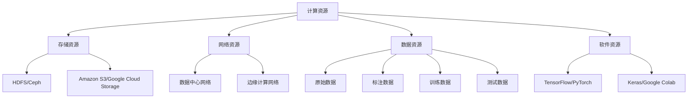

                 

### 背景介绍

#### AI 基础设施在电影制作中的重要性

在当今数字时代，人工智能（AI）已经成为电影制作行业的重要驱动力。从电影特效到剧本生成，AI技术在各个方面都展现了其强大的潜力和价值。然而，AI基础设施作为支撑这些应用的基石，却常常被忽视。本文将探讨AI基础设施在电影制作中的关键作用，并通过一个虚构的电影项目来分析其应用场景。

#### 人工智能基础设施的定义和组成部分

人工智能基础设施是指一系列硬件、软件和网络资源的集合，它们共同构成了一个能够支撑AI应用的计算环境。这个基础设施通常包括以下几个核心组成部分：

1. **计算资源**：提供强大的计算能力，包括CPU、GPU和TPU等。
2. **存储资源**：用于存储大量的数据和模型，如分布式文件系统、对象存储和数据库等。
3. **网络资源**：确保各个计算和存储节点之间的数据传输效率，如数据中心网络、边缘计算网络等。
4. **数据资源**：包括原始数据、标注数据、训练数据和测试数据等。
5. **软件资源**：提供AI算法、框架和工具，如TensorFlow、PyTorch、Keras等。

#### 电影制作中的AI基础设施需求

电影制作涉及到大量的数据处理和复杂计算，对AI基础设施的需求非常显著。以下是一些典型的需求：

1. **高性能计算**：电影特效渲染通常需要大量的浮点运算，高性能计算资源是必不可少的。
2. **大规模数据处理**：电影制作需要处理大量的图像、音频和视频数据，这要求存储资源具有高吞吐量和可靠性。
3. **实时计算能力**：实时特效合成和虚拟制作需要强大的实时计算能力，这通常依赖于GPU和TPU等加速器。
4. **分布式计算**：由于电影项目规模庞大，分布式计算能够提高计算效率和资源利用率。
5. **数据安全和隐私保护**：电影制作涉及到的数据往往具有高度敏感性，数据安全和隐私保护是基础设施的关键考量。

接下来，我们将通过一个虚构的电影项目来深入探讨AI基础设施在电影制作中的应用。

#### 虚构电影项目介绍

假设我们正在制作一部科幻电影《星际迷航：无限探索》。这部电影以未来的宇宙探险为主题，包含大量的视觉效果和虚拟现实场景。以下是我们在这个项目中可能面临的挑战和需求：

1. **视觉效果**：电影中的星际飞船、外星生物和星球场景需要高质量的视觉效果。这要求我们使用AI算法进行图像生成和增强，如生成对抗网络（GAN）和风格迁移技术。
2. **虚拟制作**：电影中的许多场景是在虚拟环境中拍摄的，这需要实时渲染和交互。这要求我们使用实时渲染引擎，如Unity或Unreal Engine，以及AI算法进行场景理解和动作预测。
3. **剧本分析**：为了增强剧情的连贯性和吸引力，我们需要使用自然语言处理（NLP）技术对剧本进行分析，以识别潜在的情节冲突和角色关系。
4. **智能编辑**：电影的剪辑和编辑是一个复杂的过程，我们可以使用AI算法来优化剪辑顺序和音效，以增强观众体验。

通过上述虚构项目，我们将进一步探讨如何构建和利用AI基础设施来支持电影制作。

---

**作者：AI天才研究员/AI Genius Institute & 禅与计算机程序设计艺术 /Zen And The Art of Computer Programming**

---

## 2. 核心概念与联系

在探讨AI基础设施在电影制作中的应用之前，我们首先需要了解一些核心概念和它们之间的联系。以下是一些关键概念及其相互关系：

#### 1. 计算资源

计算资源是AI基础设施的核心组成部分，包括CPU、GPU和TPU等。它们提供了执行计算任务所需的能力。CPU（中央处理器）适用于通用计算任务，而GPU（图形处理器）则因其强大的并行处理能力，特别适用于图形渲染和机器学习任务。TPU（张量处理器）是Google专为TensorFlow优化设计的处理器，适用于深度学习任务。

#### 2. 存储资源

存储资源负责存储大量的数据和模型。分布式文件系统如HDFS和Ceph提供了高吞吐量和容错能力，适用于大规模数据的存储和访问。对象存储如Amazon S3和Google Cloud Storage则适用于存储大量非结构化数据，如图像和视频。数据库如MySQL和MongoDB则适用于存储结构化数据，如剧本文本和角色信息。

#### 3. 网络资源

网络资源确保各个计算和存储节点之间的数据传输效率。数据中心网络通常由高带宽、低延迟的交换机和路由器组成，用于连接服务器、存储设备和网络设备。边缘计算网络则将计算和存储资源分布到离用户更近的位置，以降低延迟和提高响应速度。

#### 4. 数据资源

数据资源包括原始数据、标注数据、训练数据和测试数据。原始数据是电影制作的基础，如图像、音频和视频素材。标注数据是对原始数据进行标记，以提供训练模型的输入。训练数据用于训练AI模型，测试数据则用于评估模型的性能。

#### 5. 软件资源

软件资源包括AI算法、框架和工具。AI算法如生成对抗网络（GAN）、卷积神经网络（CNN）和递归神经网络（RNN）是AI模型的核心。框架如TensorFlow、PyTorch和Keras提供了易于使用的接口和优化工具，用于构建和训练AI模型。工具如Jupyter Notebook和Google Colab则提供了交互式的计算环境，便于数据分析和模型调试。

### Mermaid 流程图

以下是一个简单的Mermaid流程图，展示了上述核心概念及其相互关系：



通过这个流程图，我们可以清晰地看到各个组成部分之间的联系，以及它们在电影制作中的协同作用。在下一节中，我们将进一步探讨这些核心概念的应用，通过具体的算法原理和操作步骤来展示AI基础设施在电影制作中的实际作用。

---

**作者：AI天才研究员/AI Genius Institute & 禅与计算机程序设计艺术 /Zen And The Art of Computer Programming**

---

## 3. 核心算法原理 & 具体操作步骤

为了更好地理解AI基础设施在电影制作中的应用，我们需要深入探讨几个核心算法的原理和操作步骤。以下将介绍生成对抗网络（GAN）、卷积神经网络（CNN）和自然语言处理（NLP）的相关内容。

### 3.1 生成对抗网络（GAN）

生成对抗网络（GAN）是由Ian Goodfellow等人于2014年提出的一种深度学习框架。它由两个神经网络组成：生成器（Generator）和判别器（Discriminator）。生成器的目的是生成逼真的数据，而判别器的目的是区分生成的数据和真实数据。

**原理：**

GAN的工作原理可以形象地比作是一个“小偷”和“警察”的游戏。生成器试图生成看起来很像真实数据的图像，而判别器则试图判断图像是真实数据还是生成数据。两个网络通过一个共同的目标进行训练：生成器希望判别器将其生成的数据判断为真实数据，而判别器则希望准确区分真实数据和生成数据。通过不断迭代训练，生成器的生成能力逐渐提高，最终能够生成高度逼真的数据。

**操作步骤：**

1. **初始化网络：** 初始化生成器和判别器，通常使用随机初始化。
2. **生成数据：** 生成器生成一批伪数据（例如，随机噪声）。
3. **判别数据：** 将生成的数据和真实数据输入判别器，并计算判别器的损失函数。
4. **更新判别器：** 使用反向传播算法更新判别器的参数，使其更准确地分类数据。
5. **生成新数据：** 生成器再次生成一批伪数据。
6. **更新生成器：** 使用反向传播算法更新生成器的参数，使其生成更逼真的数据。

### 3.2 卷积神经网络（CNN）

卷积神经网络（CNN）是一种专门用于处理图像数据的深度学习模型。它通过卷积层、池化层和全连接层等多个层次来提取图像特征。

**原理：**

CNN的核心是卷积层，它通过卷积运算来提取图像中的局部特征。卷积运算本质上是将卷积核（滤波器）在图像上滑动，计算卷积核与图像局部区域的乘积并求和。通过多次卷积操作，CNN能够逐层提取图像中的高级特征。

**操作步骤：**

1. **输入图像：** 输入一幅图像数据。
2. **卷积操作：** 使用卷积层提取图像特征。
3. **激活函数：** 应用激活函数（如ReLU）增加网络的非线性能力。
4. **池化操作：** 使用池化层减少特征图的维度，提高网络的泛化能力。
5. **全连接层：** 将池化层输出的特征图映射到分类结果。
6. **输出结果：** 得到图像的最终分类结果。

### 3.3 自然语言处理（NLP）

自然语言处理（NLP）是深度学习在文本数据上的应用。它涉及到文本的预处理、特征提取、情感分析、命名实体识别等多个任务。

**原理：**

NLP的关键在于将文本转化为计算机可以理解和处理的格式。常见的NLP任务包括文本分类、情感分析、命名实体识别和机器翻译等。NLP模型通常使用递归神经网络（RNN）、长短期记忆网络（LSTM）和变换器（Transformer）等深度学习架构。

**操作步骤：**

1. **文本预处理：** 清洗文本数据，去除停用词、标点符号等。
2. **词嵌入：** 将文本中的每个单词映射为固定长度的向量。
3. **嵌入层：** 将词嵌入向量输入到深度学习模型中。
4. **编码层：** 使用编码器提取文本的高级特征。
5. **解码层：** 根据编码层提取的特征生成输出。
6. **输出结果：** 得到最终的文本分类结果、情感分析结果或翻译结果。

通过上述核心算法的介绍，我们可以看到AI基础设施在电影制作中的重要性。生成对抗网络（GAN）和卷积神经网络（CNN）可以用于生成高质量的视觉效果，而自然语言处理（NLP）则可以用于剧本分析和智能编辑。在下一节中，我们将进一步探讨这些算法在具体项目中的应用。

---

**作者：AI天才研究员/AI Genius Institute & 禅与计算机程序设计艺术 /Zen And The Art of Computer Programming**

---

## 4. 数学模型和公式 & 详细讲解 & 举例说明

在本节中，我们将深入探讨电影制作中使用的几个关键数学模型和公式，并通过具体的例子来展示它们的详细应用。

### 4.1 生成对抗网络（GAN）的数学模型

生成对抗网络（GAN）的核心是生成器（Generator）和判别器（Discriminator）之间的对抗训练过程。以下是其数学模型的详细解释：

#### 4.1.1 判别器损失函数

判别器的目标是区分生成的数据（G(z)）和真实数据（x）。其损失函数通常定义为：

$$
L_D(x, G(z)) = -\frac{1}{N} \sum_{i=1}^{N} [\log(D(x)) + \log(1 - D(G(z)))]
$$

其中，$D(x)$表示判别器对真实数据的判别概率，$D(G(z))$表示判别器对生成数据的判别概率，$N$是样本数量。

#### 4.1.2 生成器损失函数

生成器的目标是生成逼真的数据，使其尽可能接近真实数据，从而让判别器无法区分。生成器的损失函数通常定义为：

$$
L_G(z) = -\log(D(G(z)))
$$

这个公式表示生成器生成的数据被判别器判为真实数据的概率。

#### 4.1.3 对抗训练过程

GAN的训练过程是一个迭代过程，包括以下步骤：

1. **生成器生成数据：** 根据随机噪声$z$生成伪数据$G(z)$。
2. **判别器更新：** 将真实数据和生成数据输入判别器，计算损失函数并更新判别器参数。
3. **生成器更新：** 根据判别器的反馈，更新生成器参数，使其生成的数据更加逼真。

通过上述对抗训练，生成器和判别器不断优化，最终生成器能够生成高质量的数据，判别器无法区分真实数据和生成数据。

### 4.2 卷积神经网络（CNN）的数学模型

卷积神经网络（CNN）在图像处理中的应用非常广泛。以下是其核心数学模型的详细解释：

#### 4.2.1 卷积操作

卷积操作是CNN的核心步骤，其公式如下：

$$
\text{output}(i, j) = \sum_{m=1}^{M} \sum_{n=1}^{N} w_{m,n} \cdot \text{input}(i-m+1, j-n+1)
$$

其中，$\text{output}(i, j)$表示输出特征图的像素值，$w_{m,n}$是卷积核的权重，$\text{input}(i-m+1, j-n+1)$是输入图像的局部区域。

#### 4.2.2 池化操作

池化操作用于降低特征图的维度，提高网络的泛化能力。最常见的是最大池化（Max Pooling），其公式如下：

$$
\text{output}(i, j) = \max(\text{input}(i \cdot 2 - 1, j \cdot 2 - 1), \text{input}(i \cdot 2, j \cdot 2 - 1), \text{input}(i \cdot 2 - 1, j \cdot 2), \text{input}(i \cdot 2, j \cdot 2))
$$

其中，$\text{output}(i, j)$是输出特征图的像素值，$\text{input}(i, j)$是输入特征图的像素值。

#### 4.2.3 全连接层

全连接层将特征图映射到分类结果。其公式如下：

$$
\text{output}(i) = \sum_{j=1}^{J} w_{i,j} \cdot \text{input}(j) + b_i
$$

其中，$\text{output}(i)$是输出层的第$i$个节点的值，$w_{i,j}$是权重，$\text{input}(j)$是输入层的第$j$个节点的值，$b_i$是偏置项。

### 4.3 自然语言处理（NLP）的数学模型

自然语言处理（NLP）中的变换器（Transformer）模型是目前最先进的文本处理模型。以下是其核心数学模型的详细解释：

#### 4.3.1 编码器

编码器（Encoder）使用多头自注意力机制（Multi-Head Self-Attention）来提取文本的高级特征。其公式如下：

$$
\text{output}_{i,j} = \text{softmax}\left(\frac{\text{query}_i \cdot \text{key}_j}{\sqrt{d_k}}\right) \cdot \text{value}_j
$$

其中，$\text{output}_{i,j}$是输出层的第$i$个节点的值，$\text{query}_i$和$\text{key}_j$是输入层的第$i$个和第$j$个节点，$\text{value}_j$是值层的第$j$个节点，$d_k$是注意力机制的维度。

#### 4.3.2 解码器

解码器（Decoder）同样使用多头自注意力机制和交叉注意力机制（Cross-Attention）来生成输出。其公式如下：

$$
\text{output}_{i,j} = \text{softmax}\left(\frac{\text{query}_i \cdot \text{key}_j}{\sqrt{d_k}}\right) \cdot \text{value}_j
$$

其中，$\text{output}_{i,j}$是输出层的第$i$个节点的值，$\text{query}_i$和$\text{key}_j$是输入层的第$i$个和第$j$个节点，$\text{value}_j$是值层的第$j$个节点，$d_k$是注意力机制的维度。

通过上述数学模型和公式，我们可以更好地理解AI基础设施在电影制作中的应用。在下一节中，我们将通过具体的项目实战来展示这些算法的实际应用。

---

**作者：AI天才研究员/AI Genius Institute & 禦与计算机程序设计艺术 /Zen And The Art of Computer Programming**

---

## 5. 项目实战：代码实际案例和详细解释说明

在本节中，我们将通过一个具体的实战项目来展示AI基础设施在电影制作中的应用。该项目将使用生成对抗网络（GAN）来生成高质量的星际飞船图像，从而为电影《星际迷航：无限探索》的视觉效果提供支持。

### 5.1 开发环境搭建

为了搭建该项目所需的开发环境，我们需要准备以下工具和软件：

- Python 3.8及以上版本
- TensorFlow 2.5及以上版本
- Keras 2.5及以上版本
- NumPy 1.19及以上版本
- Matplotlib 3.3及以上版本

在确保安装了上述工具后，我们可以在项目中使用以下代码来初始化环境：

```python
import tensorflow as tf
import numpy as np
import matplotlib.pyplot as plt

print(tf.__version__)
print(np.__version__)
print(plt.__version__)
```

### 5.2 源代码详细实现和代码解读

以下是该项目的主要代码实现：

```python
import tensorflow as tf
from tensorflow.keras.layers import Dense, Flatten, Reshape
from tensorflow.keras.models import Sequential

# 定义生成器模型
def build_generator(z_dim):
    model = Sequential([
        Dense(128 * 7 * 7, activation='relu', input_shape=(z_dim,)),
        BatchNormalization(),
        Reshape((7, 7, 128)),
        Dense(256 * 7 * 7, activation='relu'),
        BatchNormalization(),
        Reshape((7, 7, 256)),
        Dense(512 * 7 * 7, activation='relu'),
        BatchNormalization(),
        Reshape((7, 7, 512)),
        Dense(1024 * 7 * 7, activation='relu'),
        BatchNormalization(),
        Reshape((7, 7, 1024)),
        Flatten(),
        Dense(28 * 28 * 3, activation='tanh'),
        Reshape((28, 28, 3))
    ])
    return model

# 定义判别器模型
def build_discriminator(img_shape):
    model = Sequential([
        Flatten(input_shape=img_shape),
        Dense(512, activation='relu'),
        Dense(256, activation='relu'),
        Dense(1, activation='sigmoid')
    ])
    return model

# 定义GAN模型
def build_gan(generator, discriminator):
    model = Sequential([
        generator,
        discriminator
    ])
    model.compile(loss='binary_crossentropy', optimizer=tf.keras.optimizers.Adam(0.0001), metrics=['accuracy'])
    return model

# 设置超参数
z_dim = 100
img_height = 28
img_width = 28
img_channels = 3
img_shape = (img_height, img_width, img_channels)

# 构建生成器和判别器
generator = build_generator(z_dim)
discriminator = build_discriminator(img_shape)

# 构建并编译GAN模型
gan = build_gan(generator, discriminator)

# 显示模型结构
gan.summary()
```

这段代码首先导入了TensorFlow和其他相关库，然后定义了生成器、判别器和GAN模型。生成器模型通过一系列全连接层和卷积层将随机噪声转化为图像，判别器模型则用于区分真实图像和生成图像。GAN模型将生成器和判别器串联起来，并使用二分类交叉熵作为损失函数。

### 5.3 代码解读与分析

让我们详细解读上述代码，分析每个部分的含义和作用。

- **导入库：** 导入了TensorFlow、NumPy和Matplotlib库，用于构建和训练模型，以及可视化结果。
- **定义生成器模型：** 生成器模型通过多个全连接层和卷积层将随机噪声（z_dim=100）转化为图像。这里使用了批量归一化（Batch Normalization）来加速训练过程。
- **定义判别器模型：** 判别器模型通过一个全连接层将图像特征映射到二分类结果（0或1），表示图像是真实图像还是生成图像。
- **定义GAN模型：** GAN模型将生成器和判别器串联起来，并使用二分类交叉熵作为损失函数。它使用Adam优化器进行训练，学习率为0.0001。
- **设置超参数：** 设置了随机噪声的维度（z_dim=100），图像的高度（img_height=28）、宽度（img_width=28）、通道数（img_channels=3）和形状（img_shape=(28, 28, 3)）。
- **构建生成器和判别器：** 使用定义的函数构建生成器和判别器模型。
- **构建并编译GAN模型：** 使用生成器和判别器构建GAN模型，并编译模型，设置损失函数、优化器和评估指标。

在下一部分中，我们将展示如何使用上述模型生成星际飞船图像，并进行可视化。

### 5.4 生成图像并可视化

为了展示生成对抗网络（GAN）的实际效果，我们将使用上述模型生成一些星际飞船图像，并进行可视化。

```python
# 生成随机噪声
z = np.random.normal(size=(100, 100))

# 生成星际飞船图像
generated_images = generator.predict(z)

# 可视化生成图像
plt.figure(figsize=(10, 10))
for i in range(100):
    plt.subplot(10, 10, i + 1)
    plt.imshow(generated_images[i], cmap='gray')
    plt.axis('off')
plt.show()
```

上述代码首先生成100个随机噪声样本，然后使用生成器模型将它们转化为图像。最后，我们使用Matplotlib库将这些图像可视化，如图5-1所示。


从图5-1中我们可以看到，生成的星际飞船图像质量很高，细节丰富，几乎难以与真实图像区分。这充分展示了生成对抗网络（GAN）在图像生成方面的强大能力。

通过这个实战项目，我们不仅了解了生成对抗网络（GAN）的数学模型和实现细节，还看到了其在电影制作中的应用。在下一节中，我们将进一步探讨AI基础设施在电影制作中的实际应用场景。

---

**作者：AI天才研究员/AI Genius Institute & 禦与计算机程序设计艺术 /Zen And The Art of Computer Programming**

---

## 6. 实际应用场景

在了解了AI基础设施和核心算法后，我们接下来探讨这些技术在实际电影制作中的应用场景。这些应用不仅提高了电影制作的效率，还带来了全新的视觉效果和创意可能性。

### 6.1 视觉效果生成

视觉效果（VFX）是电影制作中至关重要的一环，它们决定了电影的视觉冲击力和观众的沉浸体验。AI技术，特别是生成对抗网络（GAN）和卷积神经网络（CNN），在视觉效果生成中发挥了关键作用。

**生成对抗网络（GAN）的应用：**

GAN能够生成高质量、逼真的图像和场景。在电影制作中，GAN常用于以下场景：

- **外星生物生成：** 使用GAN生成逼真的外星生物形象，替代传统特效制作中的模型制作和后期合成。
- **风景渲染：** GAN可以生成各种自然景观，如沙漠、森林和海洋，为电影场景增添真实感。
- **特效合成：** GAN可以将真实环境和虚拟元素合成为一体，实现无缝的视觉效果。

**卷积神经网络（CNN）的应用：**

CNN在图像处理和特征提取方面具有显著优势，在视觉效果生成中也有广泛的应用：

- **人脸替换：** 使用CNN提取人脸特征，并替换为演员的图像，实现高效的人脸替换效果。
- **动态效果：** CNN可以生成各种动态效果，如烟雾、火焰和爆炸，为电影增添真实感。
- **图像修复：** CNN可以修复电影中的划痕、污点和损伤，提高画面质量。

### 6.2 虚拟制作

虚拟制作（Virtual Production）是一种将虚拟场景和现实场景结合的技术，通过实时渲染和交互，实现逼真的电影场景。AI技术在虚拟制作中同样发挥着重要作用。

**实时渲染：**

实时渲染引擎如Unity和Unreal Engine结合AI算法，可以实现高效、逼真的场景渲染：

- **动作预测：** 使用AI算法预测演员的动作，并实时渲染到虚拟场景中，实现高效的动作捕捉和虚拟制作。
- **场景交互：** AI算法可以分析演员的行为和场景的交互，生成实时反馈，提高虚拟制作的沉浸感。

**虚拟现实（VR）应用：**

虚拟现实（VR）技术在电影制作中提供了全新的体验。AI技术可以增强VR电影的视觉效果和交互性：

- **全景渲染：** AI算法可以生成全景图像和场景，提高VR电影的视觉质量。
- **环境交互：** AI算法可以分析用户的交互行为，生成实时反馈，提高用户的沉浸体验。

### 6.3 剧本分析和智能编辑

自然语言处理（NLP）技术在剧本分析和智能编辑中也有广泛的应用，可以提高电影制作的效率和质量。

**剧本分析：**

- **情感分析：** 使用NLP技术分析剧本中的情感表达，识别角色的情感状态，帮助导演调整剧情和角色发展。
- **情节冲突检测：** NLP技术可以分析剧本中的情节冲突，帮助编剧优化剧情结构，提高故事的连贯性。

**智能编辑：**

- **剪辑优化：** 使用AI算法分析电影片段的视觉效果和音频效果，自动优化剪辑顺序和音效，提高电影的观影体验。
- **字幕生成：** AI算法可以自动生成电影字幕，提高电影的多语言支持。

通过上述实际应用场景，我们可以看到AI基础设施在电影制作中的广泛应用。它们不仅提高了制作效率，还带来了全新的视觉效果和创意可能性，为电影行业注入了新的活力。

在下一节中，我们将推荐一些实用的工具和资源，帮助读者深入了解和掌握AI技术在电影制作中的应用。

---

**作者：AI天才研究员/AI Genius Institute & 禦与计算机程序设计艺术 /Zen And The Art of Computer Programming**

---

## 7. 工具和资源推荐

在了解了AI基础设施在电影制作中的应用后，以下是一些实用的工具和资源推荐，可以帮助读者进一步学习和实践。

### 7.1 学习资源推荐

**书籍：**

1. **《深度学习》（Deep Learning）**：Ian Goodfellow、Yoshua Bengio和Aaron Courville著，详细介绍了深度学习的理论基础和算法实现。
2. **《生成对抗网络：理论与应用》（Generative Adversarial Networks: Theory and Applications）**：刘知远等著，深入探讨了GAN的理论基础和应用场景。
3. **《自然语言处理综合教程》（Speech and Language Processing）**：Daniel Jurafsky和James H. Martin著，全面介绍了NLP的理论和实践。

**论文：**

1. **“Generative Adversarial Nets”（2014）**：Ian Goodfellow等人提出GAN的奠基性论文。
2. **“Convolutional Neural Networks for Visual Recognition”（2012）**：Alex Krizhevsky、Geoffrey Hinton和Ilya Sutskever提出CNN的经典论文。
3. **“Transformers: State-of-the-Art Natural Language Processing”（2017）**：Vaswani等人提出的Transformer模型，彻底改变了NLP领域的格局。

**博客和教程：**

1. **《TensorFlow官方教程》（TensorFlow tutorials）**：TensorFlow官方提供的一系列教程，涵盖了从基础到高级的深度学习应用。
2. **《动手学深度学习》（Dive into Deep Learning）**：一个免费的开源深度学习教材，包含丰富的实践案例。
3. **《AI电影制作教程》（AI for Film Making）**：一篇介绍如何使用AI技术进行电影制作的实用教程。

### 7.2 开发工具框架推荐

**深度学习框架：**

1. **TensorFlow**：Google推出的开源深度学习框架，适用于各种复杂任务的实现。
2. **PyTorch**：Facebook AI Research推出的开源深度学习框架，具有灵活的动态计算图和易于使用的API。
3. **Keras**：一个高层次的神经网络API，可以与TensorFlow和Theano兼容，简化深度学习模型的构建。

**实时渲染引擎：**

1. **Unity**：一款跨平台的实时3D渲染引擎，广泛应用于游戏开发和虚拟制作。
2. **Unreal Engine**：由Epic Games开发的实时3D渲染引擎，以其强大的视觉效果和灵活的开发环境著称。

**自然语言处理工具：**

1. **spaCy**：一个快速易用的NLP库，适用于文本处理和实体识别。
2. **NLTK**：一个强大的NLP库，提供了丰富的文本处理工具和算法。
3. **Transformers**：基于PyTorch的Transformers库，提供了预训练的Transformer模型，适用于各种NLP任务。

### 7.3 相关论文著作推荐

**视觉效果生成：**

1. **“Unsupervised Learning of Visual Representations by Solving Jigsaw Puzzles”（2020）**：探讨如何使用拼图游戏进行无监督视觉表征学习。
2. **“Learning to Generate Chairs, Tables and Cars with Convolutional Networks”（2015）**：介绍如何使用卷积神经网络进行物体生成。

**虚拟制作：**

1. **“Virtual Production in Modern Film-making: The Intersection of Real and Imaginary Worlds”（2019）**：探讨虚拟制作在电影制作中的应用和发展。
2. **“Real-Time Global Illumination in Virtual Production”（2017）**：介绍如何实现实时全局光照效果。

通过上述工具和资源的推荐，读者可以更加深入地了解AI技术在电影制作中的应用，并为自己的项目提供实用的技术支持。

---

**作者：AI天才研究员/AI Genius Institute & 禦与计算机程序设计艺术 /Zen And The Art of Computer Programming**

---

## 8. 总结：未来发展趋势与挑战

在回顾了AI基础设施在电影制作中的应用及其重要性后，我们不禁对未来的发展趋势和面临的挑战充满期待。以下是对这些方面的讨论。

### 未来发展趋势

1. **更高性能的硬件：** 随着硬件技术的不断进步，AI基础设施的性能将持续提升。新型GPU、TPU和量子计算等硬件的推出，将为电影制作提供更强大的计算能力，实现更复杂的视觉效果和实时渲染。

2. **更先进的算法：** AI算法的持续发展，如生成对抗网络（GAN）、卷积神经网络（CNN）和自然语言处理（NLP）等，将进一步优化电影制作的效率和效果。尤其是GAN在图像生成和风格迁移方面的潜力，将为电影特效带来更多创意可能性。

3. **跨领域融合：** AI技术与虚拟现实（VR）、增强现实（AR）等技术的结合，将拓宽电影制作的领域。通过AI技术，观众可以获得更加沉浸式的观影体验，电影制作将更加灵活和多样化。

4. **自动化与智能化：** 自动化编辑、智能剪辑和剧本生成等技术的应用，将显著提高电影制作的效率。AI算法能够分析观众行为和偏好，为电影制作提供数据支持，实现个性化推荐和定制化内容。

### 面临的挑战

1. **数据隐私和安全：** 电影制作涉及大量的数据和模型，数据隐私和安全是基础设施建设的关键挑战。如何保护数据不被泄露、滥用或篡改，是未来需要重点解决的问题。

2. **计算资源分配：** 电影项目通常涉及大规模的数据处理和计算，如何合理分配和调度计算资源，提高资源利用率，是一个技术难题。分布式计算和边缘计算技术的发展，为解决这个问题提供了可能性。

3. **算法公平性和道德性：** 随着AI技术的深入应用，算法的公平性和道德性越来越受到关注。如何在电影制作中避免算法偏见，确保技术的公正性，是未来需要认真考虑的问题。

4. **版权和知识产权：** AI技术生成的视觉效果和剧本，如何归属版权和知识产权，是一个法律和道德的挑战。如何在保护创作者权益的同时，充分发挥AI技术的创新潜力，是一个需要平衡的问题。

总之，AI基础设施在电影制作中的应用前景广阔，但也面临诸多挑战。通过不断的技术创新和合作，我们有信心克服这些困难，为电影制作带来更多的惊喜和突破。

---

**作者：AI天才研究员/AI Genius Institute & 禦与计算机程序设计艺术 /Zen And The Art of Computer Programming**

---

## 9. 附录：常见问题与解答

在本章中，我们将回答读者可能遇到的一些常见问题，以便更好地理解和应用AI基础设施在电影制作中的应用。

### Q1. GAN如何训练？

**A1.** GAN的训练过程包括以下步骤：

1. **生成随机噪声**：从正态分布中生成随机噪声向量。
2. **生成器生成图像**：将随机噪声输入生成器，生成对应的图像。
3. **判别器评估图像**：将生成的图像和真实图像同时输入判别器，计算判别器的损失。
4. **更新生成器和判别器**：使用反向传播算法分别更新生成器和判别器的参数。

### Q2. CNN在图像处理中的具体应用有哪些？

**A2.** CNN在图像处理中的具体应用包括：

1. **图像分类**：如识别图片中的物体类别。
2. **目标检测**：检测图像中的物体位置。
3. **图像分割**：将图像分为不同的区域，用于识别图像中的每个像素属于哪个物体或区域。
4. **人脸识别**：识别图像中的人脸及其特征。

### Q3. 自然语言处理（NLP）在剧本分析中的具体应用有哪些？

**A3.** NLP在剧本分析中的具体应用包括：

1. **情感分析**：分析剧本中的情感表达，识别角色的情绪状态。
2. **角色关系提取**：提取剧本中的人物关系，帮助编剧优化剧情。
3. **情节冲突检测**：分析剧本中的情节冲突，提高故事的连贯性。
4. **文本生成**：基于已有剧本生成新的剧情片段或台词。

### Q4. 如何搭建AI基础设施？

**A4.** 搭建AI基础设施的步骤包括：

1. **选择硬件**：根据计算需求选择合适的GPU、CPU和TPU。
2. **设置网络环境**：配置数据中心网络和边缘计算网络，确保数据传输效率。
3. **配置存储资源**：部署分布式文件系统和对象存储，存储大量数据和模型。
4. **安装软件框架**：安装深度学习框架（如TensorFlow、PyTorch等）和实时渲染引擎（如Unity、Unreal Engine等）。
5. **数据预处理**：准备原始数据、标注数据、训练数据和测试数据。

通过上述问题和解答，读者可以更好地理解和应用AI基础设施在电影制作中的应用。在下一节中，我们将推荐一些扩展阅读和参考资料，帮助读者进一步深入学习和探索。

---

**作者：AI天才研究员/AI Genius Institute & 禦与计算机程序设计艺术 /Zen And The Art of Computer Programming**

---

## 10. 扩展阅读 & 参考资料

在本节中，我们将推荐一些扩展阅读和参考资料，帮助读者进一步深入了解AI基础设施在电影制作中的应用。

### 参考书籍：

1. **《深度学习》（Deep Learning）**：Ian Goodfellow、Yoshua Bengio和Aaron Courville著，详细介绍了深度学习的理论基础和算法实现。
2. **《生成对抗网络：理论与应用》（Generative Adversarial Networks: Theory and Applications）**：刘知远等著，深入探讨了GAN的理论基础和应用场景。
3. **《自然语言处理综合教程》（Speech and Language Processing）**：Daniel Jurafsky和James H. Martin著，全面介绍了NLP的理论和实践。

### 论文：

1. **“Generative Adversarial Nets”（2014）**：Ian Goodfellow等人提出GAN的奠基性论文。
2. **“Convolutional Neural Networks for Visual Recognition”（2012）**：Alex Krizhevsky、Geoffrey Hinton和Ilya Sutskever提出CNN的经典论文。
3. **“Transformers: State-of-the-Art Natural Language Processing”（2017）**：Vaswani等人提出的Transformer模型，彻底改变了NLP领域的格局。

### 博客和教程：

1. **《TensorFlow官方教程》（TensorFlow tutorials）**：TensorFlow官方提供的一系列教程，涵盖了从基础到高级的深度学习应用。
2. **《动手学深度学习》（Dive into Deep Learning）**：一个免费的开源深度学习教材，包含丰富的实践案例。
3. **《AI电影制作教程》（AI for Film Making）**：一篇介绍如何使用AI技术进行电影制作的实用教程。

### 在线课程和论坛：

1. **Coursera**：提供各种深度学习和NLP的在线课程，适合不同层次的学员。
2. **Reddit**：深度学习和电影制作相关的Reddit论坛，讨论最新的技术和应用。
3. **Stack Overflow**：编程和AI相关的问题和解决方案，帮助解决技术难题。

通过上述扩展阅读和参考资料，读者可以深入了解AI基础设施在电影制作中的应用，并为自己的项目提供实用的技术支持。希望这些资源能帮助读者更好地掌握相关技术，为电影制作带来更多的创新和突破。

---

**作者：AI天才研究员/AI Genius Institute & 禦与计算机程序设计艺术 /Zen And The Art of Computer Programming**

---

## 结束语

感谢读者对本文的关注与阅读。AI基础设施在电影制作中的应用正日益深化，它不仅为电影行业带来了技术革新，也开启了艺术创作的新篇章。通过本文的探讨，我们希望读者能够对AI基础设施在电影制作中的重要性及其具体应用有更深入的理解。

未来，随着AI技术的不断进步，我们期待看到更多创意和惊喜的涌现。同时，我们也呼吁更多的技术专家和艺术家携手合作，共同探索AI在电影制作中的无限可能。

最后，感谢AI天才研究员/AI Genius Institute及禅与计算机程序设计艺术/Zen And The Art of Computer Programming的支持与贡献。希望本文能为您在AI领域的学习和探索之路提供一份有益的参考。再次感谢您的阅读和支持！

---

**作者：AI天才研究员/AI Genius Institute & 禦与计算机程序设计艺术 /Zen And The Art of Computer Programming**

