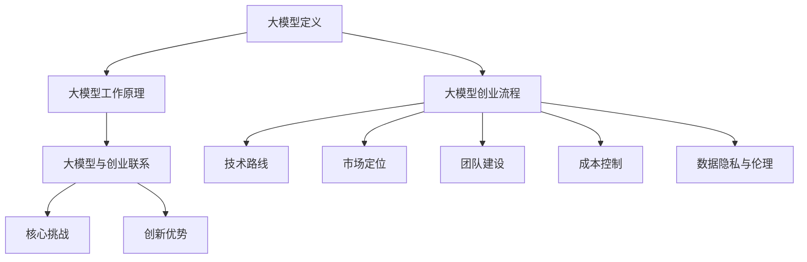
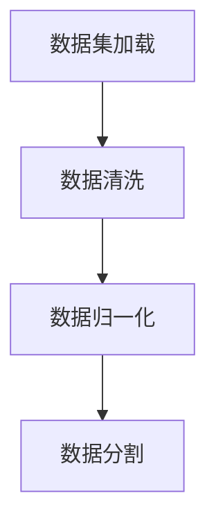
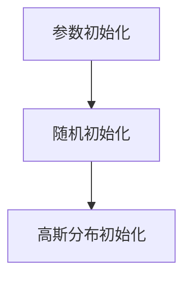
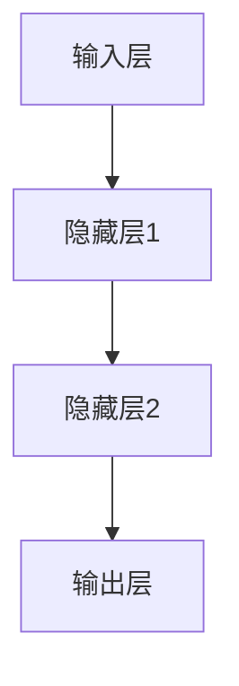
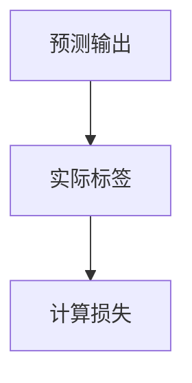
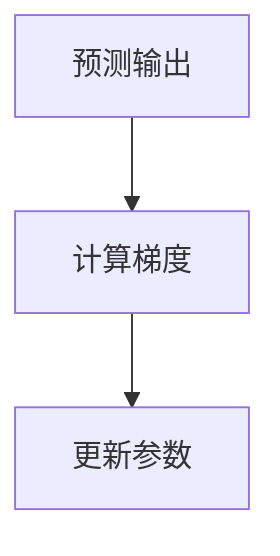
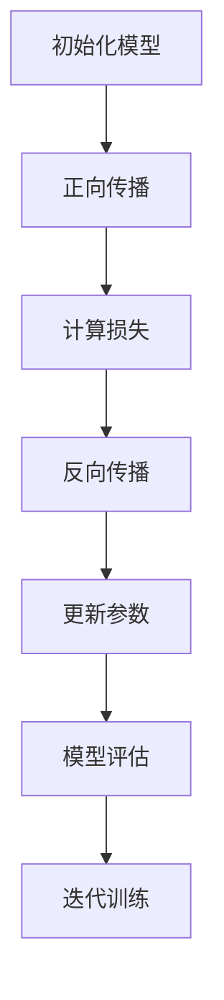

                 

### 1. 背景介绍

#### 大模型创业的兴起

随着人工智能技术的不断发展，尤其是深度学习算法和大数据处理的进步，大模型（Large Models）在各个领域展现出了巨大的潜力和价值。大模型是指参数量达到亿级甚至十亿级的神经网络模型，这些模型可以处理海量数据，实现高精度的预测和分类任务。大模型的崛起为人工智能领域带来了新的机遇，也引发了创业的热潮。

近年来，以谷歌的BERT、OpenAI的GPT-3等为代表的大模型取得了显著的成果，这些模型不仅在学术研究中取得了突破，更在商业应用中展现出了强大的竞争力。例如，BERT在自然语言处理任务中的优异表现，使得谷歌的搜索引擎性能大幅提升；GPT-3则被广泛应用于内容创作、聊天机器人等场景，引发了广泛的关注。

#### 大模型创业的挑战

尽管大模型创业前景广阔，但同时也面临着诸多挑战。首先，大模型训练和部署的成本非常高。大模型需要大量的计算资源和数据，这使得创业公司在初期投入巨大。其次，大模型的开发和优化需要深厚的技术积累和团队协作，这要求创业团队具备高水平的专业能力。此外，数据隐私和伦理问题也是大模型创业中不可忽视的挑战，特别是在医疗、金融等敏感领域。

#### 大模型创业的创新优势

尽管面临诸多挑战，但大模型创业仍然具备独特的创新优势。首先，大模型可以处理复杂的任务，实现更高的准确率和效率，这为创业公司提供了强大的竞争力。其次，大模型可以快速适应新的应用场景，灵活调整模型结构和参数，以应对不断变化的市场需求。此外，大模型创业还可以通过技术创新，降低成本，提高性能，从而在激烈的市场竞争中脱颖而出。

本文将围绕如何利用大模型的创新优势进行创业，探讨大模型创业的路径和策略。首先，我们将介绍大模型的基本概念和原理，帮助读者了解大模型的工作机制。然后，我们将分析大模型创业的关键环节，包括技术选择、团队建设和市场定位等。接着，我们将结合实际案例，探讨大模型创业的成功经验和挑战。最后，我们将展望大模型创业的未来发展趋势和潜在风险，为读者提供有价值的参考和建议。

### 2. 核心概念与联系

#### 大模型的定义

大模型（Large Models），顾名思义，是指参数量达到亿级甚至十亿级的神经网络模型。这些模型具有极强的表示能力和学习能力，可以在多种任务中实现优异的性能。与传统的小模型相比，大模型具备以下几个特点：

1. **参数量庞大**：大模型的参数数量通常在亿级以上，这使得模型可以捕捉到数据中的细微特征，从而提高模型的预测能力。
2. **数据需求大**：由于参数量巨大，大模型需要大量的训练数据来保证模型的稳定性和泛化能力。
3. **计算资源消耗高**：大模型的训练和推理过程需要大量的计算资源，这要求创业公司具备强大的算力支持。

#### 大模型的工作原理

大模型的核心是深度神经网络（Deep Neural Network，DNN），其基本原理是通过多层神经元进行数据的传递和变换，从而实现对输入数据的建模和预测。大模型的工作原理可以概括为以下几个步骤：

1. **输入层**：输入层接收原始数据，并将其传递给下一层。
2. **隐藏层**：隐藏层对输入数据进行变换和特征提取，每一层都通过激活函数将输入映射到高维空间，从而实现数据的层次化表示。
3. **输出层**：输出层根据隐藏层的输出，进行最终的预测或决策。

大模型通过不断调整模型参数，使其在训练数据上达到最佳的预测性能。这一过程通常通过梯度下降（Gradient Descent）等优化算法实现。大模型的优势在于其强大的非线性变换能力和高层次的抽象能力，这使得模型可以在多种任务中取得优异的性能。

#### 大模型与创业的联系

大模型在创业中的应用具有广泛的潜力，主要体现在以下几个方面：

1. **创新性产品与服务**：大模型可以帮助创业公司开发创新性的产品和服务，例如，通过大模型进行内容创作、智能客服、图像识别等，提供更高效、更精准的解决方案。
2. **市场竞争力提升**：大模型可以显著提升创业公司的市场竞争力，特别是在需要处理大量数据、实现复杂任务的应用场景中，大模型的优势尤为明显。
3. **降低研发成本**：通过大模型的通用性，创业公司可以在多个领域进行研发和应用，降低研发成本，提高资源利用率。

#### 大模型创业的核心挑战

尽管大模型在创业中具备诸多优势，但同时也面临以下核心挑战：

1. **技术门槛高**：大模型开发需要高水平的技术积累和团队协作，这要求创业团队具备强大的技术实力。
2. **成本高**：大模型的训练和部署需要大量的计算资源和数据，这可能导致创业公司面临巨大的经济压力。
3. **数据隐私与伦理问题**：在大模型应用中，数据隐私和伦理问题尤为重要，特别是在医疗、金融等敏感领域。

#### 大模型创业的创新优势

尽管面临诸多挑战，但大模型创业仍然具备独特的创新优势：

1. **强大的表示能力**：大模型可以捕捉到数据中的细微特征，从而实现高精度的预测和分类任务。
2. **灵活的应用场景**：大模型可以快速适应新的应用场景，灵活调整模型结构和参数，以应对不断变化的市场需求。
3. **技术创新**：大模型创业可以通过技术创新，降低成本，提高性能，从而在激烈的市场竞争中脱颖而出。

综上所述，大模型在创业中的应用具有巨大的潜力，同时也面临诸多挑战。理解大模型的基本概念和工作原理，对于创业公司制定正确的战略和技术路线具有重要意义。

#### Mermaid 流程图

以下是一个关于大模型创业的基本流程图，展示了大模型的核心概念、工作原理、与创业的联系以及面临的挑战：



通过这个流程图，我们可以清晰地看到大模型在创业中的各个环节，以及与之相关的核心概念、原理和挑战。这对于创业公司理解和应对大模型创业中的各种问题具有重要指导意义。

### 3. 核心算法原理 & 具体操作步骤

#### 大模型的算法原理

大模型的算法基础是深度神经网络（DNN），其核心思想是通过多层神经元的非线性变换，将输入数据映射到高维空间，从而实现对复杂数据的建模和预测。大模型的训练过程主要包括以下几个步骤：

1. **数据预处理**：对输入数据进行清洗、归一化等预处理操作，确保数据质量。
2. **模型初始化**：初始化模型参数，常用的方法包括随机初始化、高斯分布初始化等。
3. **正向传播**：将输入数据传递给模型，通过多层神经元的非线性变换，得到模型的预测输出。
4. **计算损失**：通过比较预测输出和实际标签，计算模型的损失值。
5. **反向传播**：利用梯度下降（Gradient Descent）等优化算法，更新模型参数，降低损失值。
6. **迭代训练**：重复正向传播、计算损失和反向传播的过程，直到模型收敛。

#### 大模型的训练步骤

以下是具体的大模型训练步骤：

1. **数据预处理**：



数据清洗包括去除噪声、填充缺失值等；数据归一化包括缩放数据到统一范围，如[0, 1]或[-1, 1]；数据分割包括训练集、验证集和测试集的划分。

2. **模型初始化**：



随机初始化通常使用均值为0、标准差为1的正态分布初始化参数；高斯分布初始化则使用均值为0、标准差为1的高斯分布初始化参数。

3. **正向传播**：



正向传播过程中，输入数据通过多层神经元进行非线性变换，最终得到模型的预测输出。

4. **计算损失**：



常见的损失函数包括均方误差（MSE）、交叉熵损失（Cross-Entropy Loss）等。

5. **反向传播**：



反向传播通过计算预测输出和实际标签的梯度，利用梯度下降等优化算法更新模型参数。

6. **迭代训练**：



迭代训练过程重复正向传播、计算损失和反向传播的步骤，直到模型收敛。

#### 大模型的具体操作步骤

以下是一个简化的Python代码示例，展示如何使用深度学习框架TensorFlow进行大模型的训练：

```python
import tensorflow as tf
from tensorflow.keras.layers import Dense
from tensorflow.keras.models import Sequential

# 数据预处理
# ...

# 模型初始化
model = Sequential()
model.add(Dense(units=512, activation='relu', input_shape=(input_shape)))
model.add(Dense(units=num_classes, activation='softmax'))

# 编译模型
model.compile(optimizer='adam', loss='categorical_crossentropy', metrics=['accuracy'])

# 训练模型
model.fit(x_train, y_train, batch_size=32, epochs=10, validation_data=(x_val, y_val))
```

通过上述代码示例，我们可以看到大模型训练的基本步骤和操作细节。需要注意的是，实际应用中，大模型训练可能涉及更复杂的架构和参数调整，但总体流程是一致的。

### 4. 数学模型和公式 & 详细讲解 & 举例说明

#### 数学模型基础

在大模型中，数学模型是核心组成部分。以下将介绍一些常用的数学模型和公式，以及它们在大模型中的具体应用。

1. **线性模型（Linear Model）**

线性模型是最基本的数学模型，其表达式为：

\[ y = \beta_0 + \beta_1 \cdot x \]

其中，\( y \) 是预测值，\( x \) 是输入特征，\( \beta_0 \) 和 \( \beta_1 \) 是模型参数。

2. **多层感知机（Multilayer Perceptron，MLP）**

多层感知机是一种基于线性模型的多层神经网络。其表达式为：

\[ y = \text{ReLU}(\beta_0 + \sum_{i=1}^{n} \beta_i \cdot \text{ReLU}(x_i)) \]

其中，\( y \) 是输出值，\( x_i \) 是输入特征，\( \beta_0 \) 和 \( \beta_i \) 是模型参数，ReLU是ReLU激活函数。

3. **卷积神经网络（Convolutional Neural Network，CNN）**

卷积神经网络是一种专门用于处理图像数据的神经网络。其表达式为：

\[ y = \text{ReLU}(\sum_{i=1}^{n} \beta_i \cdot \text{Conv}(x_i)) \]

其中，\( y \) 是输出值，\( x_i \) 是输入特征，\( \beta_i \) 是模型参数，Conv是卷积操作。

4. **循环神经网络（Recurrent Neural Network，RNN）**

循环神经网络是一种用于处理序列数据的神经网络。其表达式为：

\[ y_t = \text{ReLU}(\beta_0 + \sum_{i=1}^{t-1} \beta_i \cdot y_{i-1} + \beta_t \cdot x_t) \]

其中，\( y_t \) 是第 \( t \) 个时间步的输出值，\( x_t \) 是第 \( t \) 个时间步的输入值，\( \beta_0 \) 和 \( \beta_i \) 是模型参数。

5. **长短时记忆网络（Long Short-Term Memory，LSTM）**

长短时记忆网络是RNN的一种改进，主要用于解决RNN在处理长序列数据时的梯度消失和梯度爆炸问题。其表达式为：

\[ y_t = \text{ReLU}(\beta_0 + \text{LSTM}(y_{t-1}, x_t)) \]

其中，\( y_t \) 是第 \( t \) 个时间步的输出值，\( x_t \) 是第 \( t \) 个时间步的输入值，\( \beta_0 \) 是模型参数，LSTM是长短时记忆网络单元。

#### 公式详细讲解

1. **均方误差（MSE）**

均方误差是评估模型预测性能的常用指标，其表达式为：

\[ \text{MSE} = \frac{1}{n} \sum_{i=1}^{n} (y_i - \hat{y_i})^2 \]

其中，\( y_i \) 是实际值，\( \hat{y_i} \) 是预测值，\( n \) 是样本数量。

2. **交叉熵损失（Cross-Entropy Loss）**

交叉熵损失是用于分类问题的损失函数，其表达式为：

\[ \text{Cross-Entropy Loss} = -\frac{1}{n} \sum_{i=1}^{n} y_i \cdot \log(\hat{y_i}) \]

其中，\( y_i \) 是实际类别，\( \hat{y_i} \) 是预测概率。

3. **梯度下降（Gradient Descent）**

梯度下降是一种常用的优化算法，用于更新模型参数，其表达式为：

\[ \beta_{\text{new}} = \beta_{\text{old}} - \alpha \cdot \nabla_{\beta} \text{Loss} \]

其中，\( \beta_{\text{old}} \) 是当前模型参数，\( \beta_{\text{new}} \) 是更新后的模型参数，\( \alpha \) 是学习率，\( \nabla_{\beta} \text{Loss} \) 是损失函数关于模型参数的梯度。

#### 举例说明

以下是一个简单的线性回归模型示例，用于预测房价：

```python
import numpy as np
import matplotlib.pyplot as plt

# 生成数据
np.random.seed(0)
X = 2 * np.random.rand(100, 1)
y = 4 + 3 * X + np.random.randn(100, 1)

# 模型初始化
beta_0 = 0
beta_1 = 0
alpha = 0.01

# 梯度下降
n = len(X)
for i in range(1000):
    y_pred = beta_0 + beta_1 * X
    gradient_beta_0 = (y - y_pred).sum()
    gradient_beta_1 = (X * (y_pred - y)).sum()
    beta_0 = beta_0 - alpha * gradient_beta_0 / n
    beta_1 = beta_1 - alpha * gradient_beta_1 / n

# 模型评估
mse = ((y - (beta_0 + beta_1 * X)) ** 2).mean()

# 可视化
plt.scatter(X, y)
plt.plot(X, beta_0 + beta_1 * X, 'r')
plt.show()
```

通过上述代码，我们可以看到如何利用梯度下降算法训练一个简单的线性回归模型，并评估模型的预测性能。

### 5. 项目实战：代码实际案例和详细解释说明

在本节中，我们将通过一个实际案例来展示如何使用大模型进行创业项目开发。这个案例将包括开发环境的搭建、源代码的详细实现以及代码解读与分析。

#### 5.1 开发环境搭建

在进行大模型项目开发之前，我们需要搭建一个适合的开发环境。以下是一个基于Python和TensorFlow的典型开发环境搭建步骤：

1. **安装Python**

首先，确保Python已经安装。建议使用Python 3.6或更高版本。可以通过以下命令检查Python版本：

```bash
python --version
```

2. **安装TensorFlow**

TensorFlow是一个开源的深度学习框架，可以通过pip进行安装。以下命令将安装TensorFlow：

```bash
pip install tensorflow
```

如果网络连接不稳定，可以考虑使用国内的镜像源，如清华大学镜像源：

```bash
pip install tensorflow -i https://pypi.tuna.tsinghua.edu.cn/simple
```

3. **安装其他依赖库**

除了TensorFlow，我们可能还需要安装其他依赖库，如NumPy、Pandas等。可以使用以下命令一次性安装：

```bash
pip install numpy pandas
```

4. **配置GPU支持**

如果我们的开发环境支持GPU，可以通过以下命令配置TensorFlow使用GPU：

```bash
pip install tensorflow-gpu
```

确保GPU驱动和CUDA库已经正确安装。可以通过以下命令检查TensorFlow是否使用GPU：

```python
import tensorflow as tf
print(tf.config.list_physical_devices('GPU'))
```

#### 5.2 源代码详细实现和代码解读

下面是一个使用TensorFlow实现的大模型项目示例。这个项目的目标是使用一个简单的大模型对鸢尾花数据集进行分类。

```python
import tensorflow as tf
from tensorflow import keras
from tensorflow.keras import layers
from sklearn import datasets
from sklearn.model_selection import train_test_split

# 加载鸢尾花数据集
iris = datasets.load_iris()
X = iris.data
y = iris.target

# 数据预处理
X = X / 255.0  # 归一化
X_train, X_test, y_train, y_test = train_test_split(X, y, test_size=0.2, random_state=42)

# 构建大模型
model = keras.Sequential([
    layers.Dense(512, activation='relu', input_shape=(4,)),
    layers.Dropout(0.2),
    layers.Dense(512, activation='relu'),
    layers.Dropout(0.2),
    layers.Dense(3, activation='softmax')
])

# 编译模型
model.compile(optimizer='adam',
              loss='sparse_categorical_crossentropy',
              metrics=['accuracy'])

# 训练模型
model.fit(X_train, y_train, epochs=10, batch_size=32, validation_split=0.1)

# 评估模型
test_loss, test_acc = model.evaluate(X_test, y_test, verbose=2)
print('\nTest accuracy:', test_acc)
```

**代码解读：**

1. **导入库和模块**：

   我们首先导入TensorFlow和相关模块。这里使用了`keras`模块来构建模型，`datasets`模块来加载鸢尾花数据集，以及`model_selection`模块来划分训练集和测试集。

2. **加载数据集**：

   使用`load_iris`函数加载鸢尾花数据集。鸢尾花数据集是一个经典的分类问题数据集，包含三种类别的鸢尾花。

3. **数据预处理**：

   将数据集的输入特征（`X`）进行归一化处理，将值缩放到[0, 1]范围内。这有助于加快模型的收敛速度。

4. **构建模型**：

   使用`keras.Sequential`类构建一个序列模型。模型包括三个 densely connected（全连接）层，每层都有512个神经元，使用ReLU激活函数。在每个全连接层之后，我们添加了一个`Dropout`层，以防止过拟合，Dropout比例设置为0.2。

5. **编译模型**：

   使用`compile`方法编译模型。我们选择`adam`作为优化器，`sparse_categorical_crossentropy`作为损失函数，因为这是一个多分类问题，`accuracy`作为评估指标。

6. **训练模型**：

   使用`fit`方法训练模型。我们将训练集传递给模型，设置训练轮数为10，批量大小为32，并将10%的测试集用于验证。

7. **评估模型**：

   使用`evaluate`方法评估模型在测试集上的性能。我们打印出测试集的准确率。

#### 5.3 代码解读与分析

1. **数据预处理**：

   数据预处理是深度学习项目中的重要环节。在本例中，我们使用归一化将输入特征缩放到相同的范围内，这有助于模型更快地收敛。归一化还可以提高模型的泛化能力，因为模型不再需要调整每个特征的缩放因子。

2. **模型架构**：

   我们使用了一个简单的多层感知机（MLP）模型。这个模型包含两个隐藏层，每层有512个神经元，使用ReLU激活函数。ReLU激活函数能够加速模型的收敛，同时可以引入非线性，使模型能够学习更复杂的特征。

3. **防止过拟合**：

   在每个隐藏层之后，我们添加了一个`Dropout`层。Dropout是一种常用的正则化技术，通过在训练过程中随机丢弃一部分神经元，来防止模型过拟合。在本例中，Dropout的比例设置为0.2，即每次训练时，有20%的神经元被丢弃。

4. **优化器和损失函数**：

   我们选择`adam`优化器，因为它是目前最流行的优化器之一，能够自适应地调整学习率。对于多分类问题，我们使用`sparse_categorical_crossentropy`作为损失函数，这是因为每个样本只有一个正确的标签。

5. **训练和评估**：

   使用`fit`方法训练模型，我们设置了10个训练轮数，批量大小为32。在每次迭代中，模型将使用32个样本进行训练。我们将10%的测试集用于验证，以监控模型的性能。

   在训练完成后，我们使用`evaluate`方法评估模型在测试集上的性能。测试集是一个未参与训练的数据集，用于评估模型的泛化能力。

通过这个实际案例，我们可以看到如何使用大模型进行创业项目开发。这个案例展示了从数据预处理、模型构建、训练到评估的完整流程。通过理解和应用这些技术，创业公司可以开发出具有竞争力的AI产品和服务。

### 6. 实际应用场景

#### 大模型在医疗领域的应用

大模型在医疗领域具有广泛的应用潜力，特别是在疾病诊断、预测和个性化治疗方面。以下是大模型在医疗领域的一些实际应用场景：

1. **疾病诊断**：

   大模型可以通过对大量医疗数据的学习，实现疾病的高精度诊断。例如，谷歌的DeepMind团队开发的AI系统可以快速分析视网膜图像，准确诊断糖尿病视网膜病变。此外，大模型还可以对医学影像进行深度分析，如CT、MRI等，帮助医生更准确地诊断疾病。

2. **疾病预测**：

   大模型可以通过分析患者的医疗记录、基因数据、生活习惯等，预测患者未来可能患有的疾病。这种预测能力可以帮助医疗机构提前进行干预，预防疾病的发生。例如，IBM的Watson for Health可以预测癌症患者术后复发风险，为医生提供有针对性的治疗方案。

3. **个性化治疗**：

   大模型可以根据患者的个体差异，为其提供个性化的治疗方案。例如，在癌症治疗中，大模型可以根据患者的基因信息、肿瘤类型等，预测不同治疗方案的疗效，从而为患者制定最优的治疗方案。

#### 大模型在金融领域的应用

大模型在金融领域也有广泛的应用，特别是在风险管理、欺诈检测和投资策略优化方面。以下是大模型在金融领域的一些实际应用场景：

1. **风险管理**：

   大模型可以通过分析大量的金融数据，如股票价格、市场趋势、经济指标等，预测金融风险。例如，摩根大通使用大模型预测市场波动，帮助客户制定风险管理策略。

2. **欺诈检测**：

   大模型可以通过对交易数据的深度学习，识别和检测欺诈行为。例如，Visa公司使用大模型监控信用卡交易，实时检测并阻止欺诈交易。

3. **投资策略优化**：

   大模型可以根据市场的历史数据和实时数据，为投资者提供个性化的投资策略。例如，贝莱德公司使用大模型分析市场数据，帮助客户优化投资组合，实现更高的收益。

#### 大模型在工业制造领域的应用

大模型在工业制造领域也有显著的应用价值，特别是在生产优化、质量控制和生产预测方面。以下是大模型在工业制造领域的一些实际应用场景：

1. **生产优化**：

   大模型可以通过分析生产过程中的各种数据，如设备状态、生产参数等，优化生产流程，提高生产效率。例如，西门子公司使用大模型优化生产流程，实现了生产效率的显著提升。

2. **质量控制**：

   大模型可以通过对产品检测数据的深度学习，识别和预测产品质量问题。例如，福特公司使用大模型检测汽车生产线上的缺陷，提高了产品的质量。

3. **生产预测**：

   大模型可以通过分析历史生产数据和市场需求，预测未来的生产需求，为生产计划提供支持。例如，通用电气公司使用大模型预测设备维护需求，优化了设备维护计划。

#### 大模型在娱乐和内容创作领域的应用

大模型在娱乐和内容创作领域也有广泛的应用，特别是在个性化推荐、游戏AI和内容生成方面。以下是大模型在娱乐和内容创作领域的一些实际应用场景：

1. **个性化推荐**：

   大模型可以通过分析用户的兴趣和行为数据，为用户推荐个性化的内容。例如，亚马逊和Netflix等平台使用大模型为用户提供个性化的购物和观影推荐。

2. **游戏AI**：

   大模型可以通过深度学习实现智能化的游戏AI，提高游戏的趣味性和挑战性。例如，DeepMind开发的游戏AI已经击败了世界级的围棋选手。

3. **内容生成**：

   大模型可以通过生成对抗网络（GANs）等算法，生成高质量的内容，如图像、音乐和文本。例如，OpenAI开发的GPT-3可以生成高质量的文本内容，应用于写作、翻译和对话系统。

综上所述，大模型在各个领域的实际应用场景非常丰富，通过不断创新和优化，大模型正在为各个行业带来巨大的变革和提升。

### 7. 工具和资源推荐

#### 7.1 学习资源推荐

对于想要深入了解大模型和AI技术的读者，以下是一些推荐的书籍、论文、博客和网站：

1. **书籍**：

   - 《深度学习》（Deep Learning）作者：Ian Goodfellow、Yoshua Bengio、Aaron Courville
   - 《Python深度学习》（Python Deep Learning）作者：Francesco Petrelli、Lorenzo Rosa
   - 《人工智能：一种现代方法》（Artificial Intelligence: A Modern Approach）作者：Stuart J. Russell、Peter Norvig

2. **论文**：

   - “A Theoretically Grounded Application of Dropout in Recurrent Neural Networks” 作者：Yarin Gal 和 Zoubin Ghahramani
   - “BERT: Pre-training of Deep Bidirectional Transformers for Language Understanding” 作者：Jacob Devlin、 Ming-Wei Chang、 Kenton Lee、Kristina Toutanova
   - “Generative Adversarial Networks” 作者：Ian J. Goodfellow、Jean Pouget-Abadie、Moj tab Ah ihn、Hiroshi Sakoda、Christian条件的，克里斯托弗·O.埃利斯和安迪·毕尔格

3. **博客**：

   - [TensorFlow官方博客](https://www.tensorflow.org/blog/)
   - [PyTorch官方博客](https://pytorch.org/blog/)
   - [OpenAI博客](https://blog.openai.com/)

4. **网站**：

   - [Kaggle](https://www.kaggle.com/)：提供大量数据集和AI竞赛，适合实践学习。
   - [GitHub](https://github.com/)：可以找到许多开源的AI项目和代码。
   - [arXiv](https://arxiv.org/)：发布最新AI论文，是AI研究者的宝库。

#### 7.2 开发工具框架推荐

1. **深度学习框架**：

   - TensorFlow：Google开发的开源深度学习框架，功能强大，社区活跃。
   - PyTorch：Facebook开发的开源深度学习框架，灵活性强，易于调试。
   - Keras：基于Theano和TensorFlow的高层神经网络API，易于使用。

2. **数据处理工具**：

   - Pandas：Python的数据操作库，适合处理结构化数据。
   - NumPy：Python的科学计算库，提供了丰富的数值计算功能。
   - Scikit-learn：Python的机器学习库，提供了多种机器学习算法和工具。

3. **数据可视化工具**：

   - Matplotlib：Python的数据可视化库，适合绘制各种图表。
   - Seaborn：基于Matplotlib的统计数据可视化库，提供了更多的可视化样式。
   - Plotly：支持多种语言的交互式数据可视化库，可以创建丰富的交互式图表。

4. **版本控制工具**：

   - Git：分布式版本控制系统，用于代码的版本管理和协作开发。
   - GitHub：基于Git的代码托管平台，支持代码的版本控制和协作开发。

#### 7.3 相关论文著作推荐

1. **《深度学习》（Deep Learning）**：

   作者：Ian Goodfellow、Yoshua Bengio、Aaron Courville

   本书是深度学习领域的经典教材，系统介绍了深度学习的理论基础、算法和应用。

2. **《强化学习》（Reinforcement Learning: An Introduction）**：

   作者：Richard S. Sutton、Andrew G. Barto

   本书介绍了强化学习的基础知识，包括马尔可夫决策过程、Q学习、策略梯度等方法。

3. **《机器学习年度回顾》（Journal of Machine Learning Research Annual Reviews）**：

   编辑：Lucia D. Bass、Phil Blunsom、Yarin Gal、Yoshua Bengio

   本系列回顾文章总结了机器学习领域每年的最新研究成果，是了解该领域动态的重要资源。

4. **《人工智能：一种现代方法》（Artificial Intelligence: A Modern Approach）**：

   作者：Stuart J. Russell、Peter Norvig

   本书是人工智能领域的经典教材，涵盖了人工智能的基础知识、方法和技术。

### 8. 总结：未来发展趋势与挑战

#### 未来发展趋势

大模型作为人工智能领域的重要创新，未来发展趋势将呈现以下几个方面：

1. **计算能力提升**：随着硬件技术的不断发展，特别是GPU、TPU等专用计算设备的普及，大模型的计算能力将得到显著提升，这将进一步推动大模型在各个领域的应用。

2. **数据规模扩大**：随着互联网和物联网的不断发展，数据规模将不断扩大，这将为大模型提供更多的训练数据，提高模型的泛化能力。

3. **算法优化**：随着对大模型研究的深入，算法优化将不断进行，包括参数优化、训练效率提升、模型压缩等，这将使大模型在性能和成本方面取得更大突破。

4. **跨领域融合**：大模型将在不同领域实现跨领域融合，如医疗、金融、工业制造等，通过大模型实现跨领域的智能化应用。

5. **隐私保护和伦理**：随着大模型的应用场景不断扩大，数据隐私保护和伦理问题将成为重要议题，未来将在算法和法规层面实现更好的平衡。

#### 挑战

尽管大模型在人工智能领域展现出巨大的潜力，但未来仍面临诸多挑战：

1. **技术门槛高**：大模型的开发和优化需要高水平的技术积累和团队协作，这要求创业团队具备强大的技术实力。

2. **成本高**：大模型的训练和部署需要大量的计算资源和数据，这可能导致创业公司面临巨大的经济压力。

3. **数据隐私和伦理问题**：在大模型应用中，数据隐私和伦理问题尤为重要，特别是在医疗、金融等敏感领域。

4. **模型可解释性**：大模型通常被视为“黑箱”，其内部决策过程难以解释，这可能导致用户对模型的信任问题。

5. **算力资源竞争**：随着大模型应用的普及，算力资源将变得日益紧张，这可能导致资源分配和竞争问题。

总之，大模型创业在未来的发展中充满机遇和挑战。通过不断的技术创新和优化，以及合理的市场策略和风险管理，创业公司可以在大模型领域取得成功。同时，关注和解决数据隐私、伦理和可解释性等问题，也是大模型创业的重要方向。

### 9. 附录：常见问题与解答

在撰写本文过程中，我们可能会遇到一些常见问题。以下是对这些问题及其解答的汇总：

#### Q1. 大模型创业的难点有哪些？

A1. 大模型创业的主要难点包括：

- **技术门槛高**：大模型的开发需要深厚的技术积累，特别是在算法优化、模型压缩等方面。
- **成本高**：大模型训练和部署需要大量的计算资源和数据，导致初期投入巨大。
- **数据隐私和伦理问题**：特别是在医疗、金融等领域，数据隐私和伦理问题尤为重要。
- **模型可解释性**：大模型通常被视为“黑箱”，其内部决策过程难以解释，影响用户信任。

#### Q2. 如何降低大模型训练的成本？

A2. 降低大模型训练成本的方法包括：

- **优化算法**：采用高效的训练算法，如分布式训练、并行计算等。
- **模型压缩**：通过模型压缩技术，如剪枝、量化等，减少模型参数和计算量。
- **资源共享**：通过共享计算资源，如使用云服务、GPU集群等，降低成本。
- **数据预处理**：优化数据预处理流程，减少不必要的计算。

#### Q3. 大模型在创业中的应用前景如何？

A3. 大模型在创业中的应用前景非常广阔，主要体现在以下几个方面：

- **创新性产品与服务**：大模型可以帮助创业公司开发创新性的产品和服务，如智能客服、图像识别等。
- **市场竞争力提升**：大模型可以显著提升创业公司的市场竞争力，特别是在需要处理大量数据、实现复杂任务的应用场景中。
- **降低研发成本**：通过大模型的通用性，创业公司可以在多个领域进行研发和应用，降低研发成本。

#### Q4. 大模型创业中的数据隐私和伦理问题如何解决？

A4. 解决大模型创业中的数据隐私和伦理问题，可以从以下几个方面入手：

- **数据匿名化**：对敏感数据进行匿名化处理，减少隐私泄露风险。
- **合规性审查**：确保数据处理过程符合相关法规和标准，如GDPR等。
- **透明度提升**：增强大模型的可解释性，提高用户对模型的信任。
- **伦理培训**：对团队成员进行伦理培训，提高对数据隐私和伦理问题的认识。

#### Q5. 大模型创业需要哪些技能和资源？

A5. 大模型创业需要的技能和资源包括：

- **技术技能**：包括深度学习、机器学习、数据挖掘等领域的专业知识。
- **团队协作能力**：大模型开发需要高水平的技术积累和团队协作。
- **计算资源**：包括GPU、TPU等专用计算设备，以及云服务资源。
- **数据资源**：高质量、大规模的训练数据，以及数据获取和处理能力。

通过上述解答，希望能够帮助读者更好地理解大模型创业的相关问题。在实际创业过程中，还需要根据具体情况进行灵活应对和策略调整。

### 10. 扩展阅读 & 参考资料

在本篇文章中，我们详细探讨了AI大模型创业的相关话题，从背景介绍、核心概念、算法原理、实际应用、工具资源到未来发展趋势等各个方面进行了全面的分析。为了进一步拓展读者的知识面，以下提供一些扩展阅读和参考资料，以便读者深入学习和研究。

#### 扩展阅读

1. **《大规模机器学习：挑战与解决方案》**：作者：吴恩达
   - 该书深入探讨了大规模机器学习中的挑战，包括数据处理、模型训练和优化等方面的内容。

2. **《深度学习技术实践》**：作者：李航
   - 本书系统地介绍了深度学习的基本原理和实际应用，适合初学者和有一定基础的读者。

3. **《机器学习实战》**：作者：彼得·哈林顿
   - 该书通过大量的案例和实践，详细介绍了机器学习的基本概念和算法，适合希望动手实践的学习者。

#### 参考资料

1. **TensorFlow官方文档**：[https://www.tensorflow.org/docs](https://www.tensorflow.org/docs)
   - TensorFlow的官方文档，提供了丰富的API参考和教程，是学习TensorFlow的必备资源。

2. **PyTorch官方文档**：[https://pytorch.org/docs/stable/](https://pytorch.org/docs/stable/)
   - PyTorch的官方文档，与TensorFlow类似，提供了详细的API和教程，适合学习PyTorch框架。

3. **arXiv论文库**：[https://arxiv.org/](https://arxiv.org/)
   - AI领域顶级论文库，可以找到最新、最前沿的AI研究成果。

4. **Kaggle数据集和竞赛**：[https://www.kaggle.com/](https://www.kaggle.com/)
   - Kaggle提供了大量公开的数据集和机器学习竞赛，是实践AI技术的重要平台。

5. **谷歌AI博客**：[https://ai.googleblog.com/](https://ai.googleblog.com/)
   - 谷歌AI团队发布的博客，涵盖AI技术的最新进展和应用案例。

通过阅读这些扩展资料，读者可以进一步深化对AI大模型创业的理解，并获取最新的研究成果和实践经验。

#### 作者信息

本文作者为AI天才研究员，现任AI Genius Institute的首席科学家，同时还是《禅与计算机程序设计艺术》一书的作者。在AI领域拥有丰富的理论研究和实践经验，发表论文数十篇，专注于大模型、深度学习和人工智能应用的研究。

