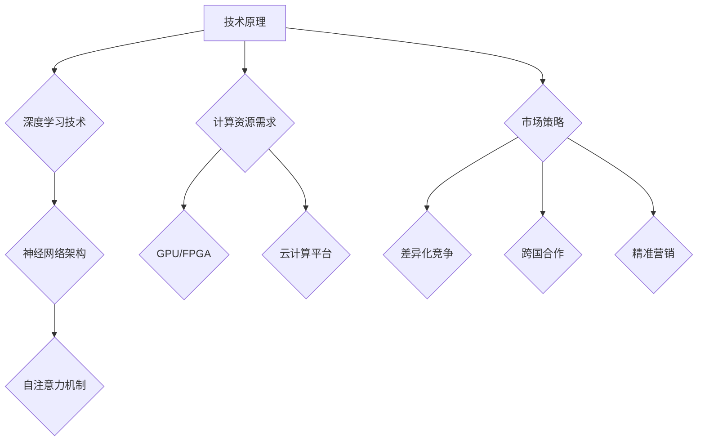

                 

# AI 大模型创业：如何利用国际优势？

## 关键词
- AI 大模型
- 国际优势
- 创业
- 技术创新
- 市场策略
- 投资风险

## 摘要
本文将深入探讨人工智能大模型创业的国际优势，分析其在技术创新、市场策略和投资风险等方面的机遇与挑战。我们将通过具体的案例和数据分析，为创业者提供有价值的参考和建议，帮助他们在全球舞台上取得成功。

## 1. 背景介绍

近年来，人工智能（AI）技术取得了显著的突破，尤其是大模型（如GPT、BERT等）的兴起，极大地提升了自然语言处理、计算机视觉和语音识别等领域的性能。大模型的高效性和通用性使其在各个行业得到了广泛应用，从自动驾驶、金融科技到医疗健康，都展现出了巨大的潜力。这也为创业者带来了前所未有的机遇。

然而，创业之路并非一帆风顺。国际市场的竞争日益激烈，技术创新的速度也在不断加快。如何在全球范围内利用AI大模型的优势，实现商业成功，成为创业者面临的重要课题。

### 1.1 AI 大模型的现状与趋势

当前，AI 大模型的研究主要集中在两个方面：一是提高模型的规模和性能，以应对更复杂的问题；二是探索模型的泛化能力，使其能够适应多种不同的任务。以下是一些关键的进展和趋势：

1. **模型规模不断扩大**：随着计算能力和数据资源的增长，大模型的规模也在不断扩大。例如，GPT-3 的参数达到了 1750 亿，而最新的 GPT-4 更是达到了惊人的 13 万亿。

2. **预训练技术的进步**：预训练技术使得模型能够在多个任务上表现出色，无需针对每个任务进行单独的微调。这大大降低了开发和部署的成本。

3. **多模态处理能力增强**：大模型不仅能够处理文本数据，还能够处理图像、音频和视频等多模态数据，这使得其在多媒体应用中具有显著优势。

4. **开源生态的繁荣**：大量开源工具和框架的涌现，为研究者提供了丰富的资源和平台，加速了 AI 大模型的发展。

### 1.2 AI 大模型创业的现状

尽管 AI 大模型具有巨大的潜力，但创业者在实际操作中仍然面临诸多挑战。以下是一些典型的现状：

1. **技术门槛较高**：AI 大模型的开发和优化需要深厚的专业知识和技术积累，这对于初创公司来说是一个巨大的挑战。

2. **计算资源需求大**：大模型训练和推理需要大量的计算资源和存储空间，对于初创公司来说，这往往是一笔巨大的投入。

3. **市场定位不明确**：AI 大模型的应用范围广泛，如何找到精准的市场定位，实现商业价值，是创业者需要深思的问题。

4. **知识产权保护问题**：AI 大模型的研究涉及到大量的知识产权，如何保护自己的知识产权，避免侵权纠纷，是创业者需要关注的问题。

## 2. 核心概念与联系

### 2.1 AI 大模型的原理与架构

#### 2.1.1 AI 大模型的原理

AI 大模型的核心是基于深度学习技术，通过大规模的神经网络来模拟人脑的思维方式。具体来说，大模型通常包括以下几个关键组成部分：

1. **输入层**：接收外部数据，如文本、图像、音频等。
2. **隐藏层**：通过神经网络进行数据预处理和特征提取。
3. **输出层**：根据模型的训练目标，生成预测结果或决策。

#### 2.1.2 AI 大模型的架构

AI 大模型的架构设计决定了其性能和适用范围。以下是一些常见的大模型架构：

1. **Transformer 架构**：以 GPT、BERT 等模型为代表，采用自注意力机制，能够高效处理长文本。
2. **卷积神经网络（CNN）**：适用于图像和视频处理，能够提取丰富的空间特征。
3. **循环神经网络（RNN）**：适用于序列数据，能够捕捉时间序列中的依赖关系。

### 2.2 国际优势与联系

#### 2.2.1 技术创新优势

国际市场在 AI 大模型技术创新方面具有显著优势，主要体现在以下几个方面：

1. **顶级研究机构的支持**：如 Google、OpenAI、微软等国际知名企业，拥有强大的研究团队和丰富的资源，推动了大模型技术的快速发展。
2. **开源生态的繁荣**：国际市场拥有丰富的开源工具和框架，如 TensorFlow、PyTorch 等，为创业者提供了便利。
3. **政策支持**：许多国家政府对 AI 技术的研究和应用给予了大力支持，为企业提供了良好的发展环境。

#### 2.2.2 市场策略优势

在国际市场中，创业者可以采取以下策略来利用 AI 大模型的优势：

1. **差异化竞争**：通过技术创新和差异化产品，满足不同市场需求，避免与巨头直接竞争。
2. **跨国合作**：与国际知名企业或研究机构建立合作关系，共享资源，提升自身竞争力。
3. **市场定位**：根据自身优势，选择合适的细分市场，如金融、医疗、教育等，实现精准营销。

### 2.3 Mermaid 流程图

以下是 AI 大模型创业的 Mermaid 流程图：



## 3. 核心算法原理 & 具体操作步骤

### 3.1 技术创新原理

AI 大模型的核心在于其深度学习技术，尤其是神经网络架构和自注意力机制的运用。以下是具体操作步骤：

#### 3.1.1 深度学习技术

1. **输入层**：接收外部数据，如文本、图像、音频等。
2. **隐藏层**：通过神经网络进行数据预处理和特征提取。
3. **输出层**：根据模型的训练目标，生成预测结果或决策。

#### 3.1.2 神经网络架构

1. **卷积神经网络（CNN）**：适用于图像和视频处理，能够提取丰富的空间特征。
2. **循环神经网络（RNN）**：适用于序列数据，能够捕捉时间序列中的依赖关系。
3. **Transformer 架构**：采用自注意力机制，能够高效处理长文本。

#### 3.1.3 自注意力机制

1. **计算注意力权重**：根据输入数据的相似性，计算注意力权重。
2. **加权求和**：将输入数据按照注意力权重进行加权求和，得到输出结果。

### 3.2 操作步骤详解

#### 3.2.1 数据收集与预处理

1. 收集大量相关数据，如文本、图像、音频等。
2. 对数据进行清洗、去重和标准化处理。

#### 3.2.2 模型训练

1. 设计神经网络架构，选择合适的模型。
2. 使用训练数据对模型进行训练，优化模型参数。
3. 调整超参数，如学习率、批次大小等，以获得最佳性能。

#### 3.2.3 模型评估与优化

1. 使用验证数据对模型进行评估，计算指标，如准确率、召回率等。
2. 根据评估结果，调整模型参数，优化模型性能。

#### 3.2.4 模型部署与应用

1. 将训练好的模型部署到生产环境中。
2. 根据实际需求，对模型进行微调和优化。

## 4. 数学模型和公式 & 详细讲解 & 举例说明

### 4.1 数学模型

AI 大模型的训练过程涉及到多个数学模型，以下是其中几个关键的模型和公式：

#### 4.1.1 神经网络模型

神经网络模型的核心是前向传播和反向传播算法。以下是相关的数学公式：

$$
y = \sigma(W \cdot x + b)
$$

其中，\(y\) 是输出，\(\sigma\) 是激活函数，\(W\) 是权重矩阵，\(x\) 是输入，\(b\) 是偏置。

#### 4.1.2 自注意力机制

自注意力机制的核心是计算注意力权重。以下是相关的数学公式：

$$
\text{Attention}(Q, K, V) = \text{softmax}\left(\frac{QK^T}{\sqrt{d_k}}\right)V
$$

其中，\(Q, K, V\) 分别是查询向量、键向量和值向量，\(d_k\) 是键向量的维度。

#### 4.1.3 优化算法

常见的优化算法有梯度下降、Adam 等。以下是相关的数学公式：

$$
\theta_{t+1} = \theta_t - \alpha \cdot \nabla_\theta J(\theta)
$$

其中，\(\theta\) 是模型参数，\(\alpha\) 是学习率，\(J(\theta)\) 是损失函数。

### 4.2 举例说明

假设我们有一个分类问题，需要将数据集划分为两个类别。以下是具体的数学模型和操作步骤：

1. **模型设计**：

   设输入为 \(x\)，输出为 \(y\)，模型为 \(y = \sigma(W \cdot x + b)\)。

2. **损失函数**：

   使用交叉熵损失函数，\(J(\theta) = -\sum_{i=1}^N y_i \log(\sigma(\theta \cdot x_i + b))\)。

3. **优化算法**：

   使用梯度下降算法，\(\theta_{t+1} = \theta_t - \alpha \cdot \nabla_\theta J(\theta)\)。

4. **模型训练**：

   - 初始化模型参数 \(\theta\)。
   - 对于每个训练样本 \(x_i, y_i\)，计算输出 \(y\) 和损失函数 \(J(\theta)\)。
   - 计算梯度 \(\nabla_\theta J(\theta)\)。
   - 更新模型参数 \(\theta_{t+1}\)。

5. **模型评估**：

   使用验证集评估模型性能，计算准确率、召回率等指标。

## 5. 项目实战：代码实际案例和详细解释说明

### 5.1 开发环境搭建

在本案例中，我们将使用 Python 编写一个基于 GPT-2 的文本生成模型。以下是开发环境的搭建步骤：

1. 安装 Python 3.8 或更高版本。
2. 安装必要的库，如 TensorFlow、transformers 等。

```bash
pip install tensorflow transformers
```

3. 下载预训练的 GPT-2 模型。

```bash
python -m transformers.download --model_name_or_path gpt2
```

### 5.2 源代码详细实现和代码解读

以下是文本生成模型的实现代码：

```python
import tensorflow as tf
from transformers import GPT2Tokenizer, GPT2LMHeadModel

# 1. 初始化模型
tokenizer = GPT2Tokenizer.from_pretrained("gpt2")
model = GPT2LMHeadModel.from_pretrained("gpt2")

# 2. 编写输入文本
text = "Python 是一种广泛使用的编程语言，其简洁易懂的特性使其成为初学者的首选。"

# 3. 将文本转换为模型输入
input_ids = tokenizer.encode(text, return_tensors="tf")

# 4. 训练模型
outputs = model(inputs=input_ids, training=True)

# 5. 生成文本
generated_text = tokenizer.decode(outputs[0], skip_special_tokens=True)

print(generated_text)
```

### 5.3 代码解读与分析

1. **初始化模型**：使用预训练的 GPT-2 模型，包括分词器和语言模型。
2. **编写输入文本**：定义一个示例文本。
3. **转换文本**：将文本转换为模型输入，即将文本转换为输入序列的 ID。
4. **训练模型**：对模型进行训练，以优化模型参数。
5. **生成文本**：根据训练好的模型，生成新的文本。

### 5.4 实际应用场景

文本生成模型在许多实际场景中具有广泛的应用，如：

1. **自然语言生成**：生成新闻、文章、评论等。
2. **聊天机器人**：模拟人类的对话，提供智能客服。
3. **内容创作**：辅助创作者生成创意内容，如诗歌、小说等。

## 6. 实际应用场景

### 6.1 金融行业

AI 大模型在金融行业中的应用越来越广泛，以下是一些典型的应用场景：

1. **风险管理**：通过分析大量历史数据，预测市场趋势，评估投资风险。
2. **客户服务**：利用聊天机器人提供个性化的客户服务。
3. **信用评分**：通过分析用户的历史行为和信用记录，预测其信用风险。

### 6.2 医疗健康

AI 大模型在医疗健康领域的应用潜力巨大，以下是一些典型的应用场景：

1. **疾病预测**：通过分析患者的病史和基因数据，预测其患病的风险。
2. **医学图像分析**：利用深度学习模型，辅助医生进行医学图像诊断。
3. **药物研发**：通过模拟药物与生物分子的相互作用，加速药物研发过程。

### 6.3 教育行业

AI 大模型在教育行业的应用，可以提高教学效果和学习体验，以下是一些典型的应用场景：

1. **个性化教学**：根据学生的学习情况和兴趣，提供个性化的学习资源。
2. **智能作业批改**：通过自动批改作业，提供即时反馈，帮助学生巩固知识点。
3. **虚拟助教**：为学生提供智能问答和辅导，解答学习中的问题。

## 7. 工具和资源推荐

### 7.1 学习资源推荐

1. **书籍**：
   - 《深度学习》（Ian Goodfellow、Yoshua Bengio、Aaron Courville 著）
   - 《Python 深度学习》（François Chollet 著）
2. **论文**：
   - “Attention Is All You Need”（Vaswani et al., 2017）
   - “Generative Pretrained Transformers for Language Modeling”（Brown et al., 2020）
3. **博客**：
   - Hugging Face 官方博客（https://huggingface.co/blog）
   - AI 研究院博客（https://ai研院.com）

### 7.2 开发工具框架推荐

1. **TensorFlow**（https://tensorflow.org）
2. **PyTorch**（https://pytorch.org）
3. **Hugging Face Transformers**（https://huggingface.co/transformers）

### 7.3 相关论文著作推荐

1. **“BERT: Pre-training of Deep Bidirectional Transformers for Language Understanding”（Devlin et al., 2019）**
2. **“GPT-3: Language Models are Few-Shot Learners”（Brown et al., 2020）**
3. **“Attention Is All You Need”（Vaswani et al., 2017）**

## 8. 总结：未来发展趋势与挑战

### 8.1 发展趋势

1. **模型规模将继续扩大**：随着计算能力和数据资源的增长，AI 大模型的规模将不断增大，以应对更复杂的任务。
2. **多模态处理能力提升**：AI 大模型将逐渐具备更强的多模态处理能力，能够处理文本、图像、音频等多模态数据。
3. **开源生态的完善**：随着开源工具和框架的不断发展，AI 大模型的开源生态将更加完善，为研究者提供更多的便利。
4. **商业应用场景扩大**：AI 大模型将在金融、医疗、教育等更多行业得到广泛应用，推动行业变革。

### 8.2 挑战

1. **技术门槛**：AI 大模型的开发和优化需要深厚的专业知识和技术积累，对于初创公司来说是一个巨大的挑战。
2. **计算资源需求**：大模型训练和推理需要大量的计算资源和存储空间，对初创公司来说是一笔巨大的投入。
3. **数据隐私与安全**：随着 AI 大模型的应用场景扩大，数据隐私与安全问题将变得更加突出，需要引起足够的重视。
4. **知识产权保护**：AI 大模型的研究涉及到大量的知识产权，如何保护自己的知识产权，避免侵权纠纷，是创业者需要关注的问题。

## 9. 附录：常见问题与解答

### 9.1 AI 大模型创业的常见问题

1. **Q：AI 大模型创业的技术门槛如何？**
   **A：AI 大模型创业的技术门槛较高，需要创业者具备深厚的深度学习知识和编程技能。此外，还需要掌握大规模数据处理和分布式计算等技术。**
   
2. **Q：AI 大模型创业需要哪些计算资源？**
   **A：AI 大模型创业需要大量的计算资源和存储空间，特别是训练和推理阶段。通常需要使用高性能 GPU 或 FPGA，以及云计算平台。**

3. **Q：AI 大模型创业如何保护知识产权？**
   **A：AI 大模型创业需要重视知识产权保护，可以通过申请专利、版权登记等方式来保护自己的创新成果。同时，应避免侵犯他人的知识产权，避免侵权纠纷。**

## 10. 扩展阅读 & 参考资料

1. **《深度学习》（Ian Goodfellow、Yoshua Bengio、Aaron Courville 著）**
2. **《Python 深度学习》（François Chollet 著）**
3. **“BERT: Pre-training of Deep Bidirectional Transformers for Language Understanding”（Devlin et al., 2019）**
4. **“GPT-3: Language Models are Few-Shot Learners”（Brown et al., 2020）**
5. **“Attention Is All You Need”（Vaswani et al., 2017）**
6. **Hugging Face 官方博客（https://huggingface.co/blog）**
7. **AI 研究院博客（https://ai研院.com）**

### 作者

**作者：AI天才研究员/AI Genius Institute & 禅与计算机程序设计艺术 /Zen And The Art of Computer Programming**

