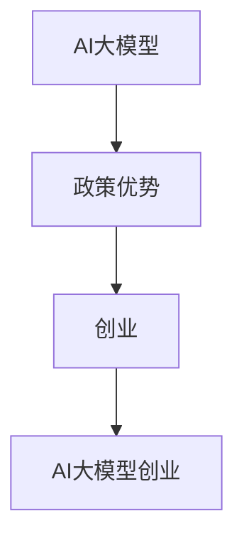
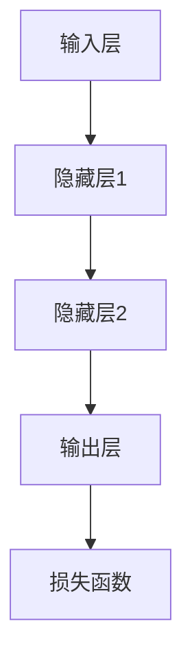

                 

### 文章标题

**AI 大模型创业：如何利用政策优势？**

> **关键词**：AI 大模型、政策优势、创业、技术应用、产业发展

**摘要**：本文将探讨 AI 大模型创业如何有效利用政策优势，结合实际案例分析政策支持对企业发展的促进作用。通过深入剖析相关政策背景、核心概念、算法原理及应用场景，本文旨在为 AI 领域创业者提供有价值的参考和建议，助力他们在政策红利期实现快速发展。

## 1. 背景介绍

随着人工智能技术的飞速发展，大模型（如 GPT-3、BERT 等）成为当前 AI 研究和应用的热点。这些大模型具备强大的数据处理和知识生成能力，广泛应用于自然语言处理、计算机视觉、推荐系统等领域。然而，AI 大模型创业面临着技术挑战、市场压力和政策环境等多方面的问题。

近年来，各国政府纷纷出台一系列支持 AI 产业发展的政策，旨在促进技术创新和产业升级。政策优势成为 AI 大模型创业的重要推动力，为企业提供了良好的发展环境。本文将从以下几个方面探讨如何利用政策优势实现 AI 大模型创业的突破。

### 1.1 AI 大模型的发展现状

AI 大模型的发展可以分为三个阶段：

1. **基础研究阶段**：以深度学习为代表的算法研究取得突破，如 GPT-3、BERT 等大模型相继出现。
2. **技术探索阶段**：大模型在多个应用领域取得显著成果，如自然语言处理、计算机视觉等。
3. **商业化应用阶段**：企业开始将大模型应用于实际场景，实现商业化落地。

### 1.2 政策优势的重要性

政策优势对 AI 大模型创业的影响主要体现在以下几个方面：

1. **资金支持**：政府提供专项资金支持，降低企业研发成本。
2. **税收优惠**：对 AI 企业实行税收减免，减轻企业负担。
3. **人才引进**：实施人才政策，吸引国内外优秀人才加入 AI 领域。
4. **技术创新**：政府推动技术攻关和产业协同创新，提高企业竞争力。

### 1.3 创业者的挑战与机遇

AI 大模型创业面临的挑战主要包括：

1. **技术门槛高**：大模型研发需要强大的计算资源和专业技术。
2. **市场不确定性**：AI 领域竞争激烈，市场需求变化快速。
3. **政策环境变化**：政策支持力度和方向可能发生变化，影响企业决策。

与此同时，创业者面临的机遇包括：

1. **技术红利**：AI 大模型技术持续迭代，为创业提供广阔空间。
2. **政策红利**：政府支持为企业提供良好的发展环境。
3. **市场潜力**：AI 领域市场前景广阔，应用场景不断拓展。

## 2. 核心概念与联系

在探讨如何利用政策优势实现 AI 大模型创业之前，我们需要了解一些核心概念和它们之间的联系。

### 2.1 AI 大模型

AI 大模型是指具备大规模参数和强大计算能力的神经网络模型。它们通过学习海量数据，实现高效的知识提取和推理。典型的大模型包括 GPT-3、BERT、ViT 等。

### 2.2 政策优势

政策优势是指政府通过制定和实施一系列政策，为企业提供支持和优惠，促进产业发展。政策优势主要包括资金支持、税收优惠、人才引进、技术创新等方面。

### 2.3 创业

创业是指创业者创办企业，通过创新、经营和管理实现商业价值的过程。创业涉及技术创新、市场开拓、团队建设等多个方面。

### 2.4 AI 大模型创业

AI 大模型创业是指创业者利用 AI 大模型技术，开展企业创新和商业活动的过程。AI 大模型创业的核心在于技术优势和市场机会的把握。

### 2.5 关系图

以下是一个简单的 Mermaid 流程图，展示核心概念之间的联系：



## 3. 核心算法原理 & 具体操作步骤

### 3.1 核心算法原理

AI 大模型的核心算法是基于深度学习的神经网络模型。神经网络通过多层非线性变换，对输入数据进行特征提取和建模。具体来说，AI 大模型可以分为以下几个层次：

1. **输入层**：接收外部数据，如文本、图像等。
2. **隐藏层**：通过激活函数进行非线性变换，提取特征。
3. **输出层**：将提取的特征映射到目标变量，如分类标签、文本生成等。

神经网络模型的训练过程包括：

1. **数据预处理**：对输入数据进行归一化、标准化等处理。
2. **模型初始化**：随机初始化模型参数。
3. **前向传播**：计算输入数据经过神经网络后的输出。
4. **反向传播**：计算损失函数，更新模型参数。
5. **迭代训练**：重复上述过程，直到模型收敛。

### 3.2 具体操作步骤

以下是一个简单的 AI 大模型创业项目操作步骤：

1. **项目规划**：确定项目目标、技术路线和市场前景。
2. **数据收集**：收集相关领域的数据，如文本、图像、音频等。
3. **数据预处理**：对收集的数据进行清洗、归一化等处理。
4. **模型训练**：构建神经网络模型，训练模型参数。
5. **模型评估**：使用验证集评估模型性能，调整模型结构。
6. **模型部署**：将训练好的模型部署到生产环境中，提供 API 服务。
7. **市场推广**：通过线上线下渠道，推广产品和服务。

## 4. 数学模型和公式 & 详细讲解 & 举例说明

### 4.1 数学模型

AI 大模型的数学模型主要涉及以下几个方面：

1. **损失函数**：用于评估模型预测结果与真实值之间的差距。常见的损失函数包括均方误差（MSE）、交叉熵（Cross Entropy）等。
   
   $$\text{MSE} = \frac{1}{m}\sum_{i=1}^{m}(y_i - \hat{y_i})^2$$
   $$\text{Cross Entropy} = -\frac{1}{m}\sum_{i=1}^{m}y_i\log\hat{y_i}$$

2. **优化算法**：用于更新模型参数，减少损失函数。常见的优化算法包括梯度下降（Gradient Descent）、Adam 等。

   $$\text{Gradient Descent}:\qquad \theta_{t+1} = \theta_t - \alpha\nabla_\theta J(\theta)$$
   $$\text{Adam}:\qquad \theta_{t+1} = \theta_t - \alpha\frac{m_t}{1-\beta_1^t}$$

3. **激活函数**：用于隐藏层节点输出，实现非线性变换。常见的激活函数包括 sigmoid、ReLU 等。

   $$\text{sigmoid}: \qquad \sigma(x) = \frac{1}{1 + e^{-x}}$$
   $$\text{ReLU}: \qquad \text{ReLU}(x) = \max(0, x)$$

### 4.2 详细讲解

1. **损失函数**

   损失函数是评估模型预测性能的重要工具。均方误差（MSE）和交叉熵（Cross Entropy）是两种常用的损失函数。

   - **均方误差（MSE）**：MSE 用于回归问题，计算预测值与真实值之间的平均平方误差。MSE 越小，表示模型预测越准确。

   - **交叉熵（Cross Entropy）**：交叉熵用于分类问题，计算预测概率分布与真实分布之间的差异。交叉熵越小，表示模型分类效果越好。

2. **优化算法**

   优化算法用于更新模型参数，减少损失函数。梯度下降（Gradient Descent）和 Adam 是两种常用的优化算法。

   - **梯度下降（Gradient Descent）**：梯度下降通过计算损失函数关于模型参数的梯度，反向更新参数。梯度下降的缺点是收敛速度较慢，需要多次迭代。

   - **Adam**：Adam 结合了梯度下降和动量法的优点，同时引入了一阶和二阶矩估计。Adam 具有较好的收敛速度和稳定性，适用于复杂模型。

3. **激活函数**

   激活函数用于隐藏层节点输出，实现非线性变换。sigmoid 和 ReLU 是两种常用的激活函数。

   - **sigmoid**：sigmoid 函数将输入映射到 [0, 1] 区间，实现 S 形曲线。sigmoid 函数在处理小数据时效果较好，但在训练过程中容易梯度消失。

   - **ReLU**：ReLU 函数将输入映射到 [0, +∞) 区间，实现非线性变换。ReLU 函数在训练过程中具有更好的梯度性质，有助于加快训练速度。

### 4.3 举例说明

以下是一个简单的神经网络模型，用于实现二分类问题：



- **输入层**：接收输入特征，如文本或图像。
- **隐藏层1**：通过 ReLU 激活函数实现非线性变换。
- **隐藏层2**：同样使用 ReLU 激活函数。
- **输出层**：通过 sigmoid 激活函数实现概率输出。
- **损失函数**：使用交叉熵损失函数，评估模型分类性能。

## 5. 项目实战：代码实际案例和详细解释说明

### 5.1 开发环境搭建

在开始项目实战之前，我们需要搭建一个适合 AI 大模型开发的环境。以下是一个基本的开发环境搭建步骤：

1. **安装 Python**：Python 是 AI 大模型开发的主要编程语言。在官方网站（[python.org](https://www.python.org/)）下载并安装 Python。
2. **安装 Jupyter Notebook**：Jupyter Notebook 是一种交互式的开发环境，方便进行代码编写和调试。在命令行执行以下命令安装 Jupyter Notebook：

   ```bash
   pip install notebook
   ```

3. **安装 TensorFlow**：TensorFlow 是一个流行的深度学习框架。在命令行执行以下命令安装 TensorFlow：

   ```bash
   pip install tensorflow
   ```

4. **安装其他依赖**：根据项目需求，可能还需要安装其他依赖库，如 NumPy、Pandas 等。在命令行执行以下命令安装：

   ```bash
   pip install numpy pandas
   ```

### 5.2 源代码详细实现和代码解读

以下是一个简单的二分类问题神经网络模型，使用 TensorFlow 实现。代码包含数据预处理、模型构建、训练和评估等部分。

```python
import tensorflow as tf
import numpy as np
import pandas as pd

# 数据预处理
def preprocess_data(data_path):
    # 读取数据
    data = pd.read_csv(data_path)
    
    # 分割特征和标签
    X = data.iloc[:, :-1].values
    y = data.iloc[:, -1].values
    
    # 标签转换为 one-hot 编码
    y_one_hot = tf.keras.utils.to_categorical(y)
    
    # 数据归一化
    X = X / 255.0
    
    return X, y_one_hot

# 构建模型
def build_model():
    model = tf.keras.Sequential([
        tf.keras.layers.Dense(64, activation='relu', input_shape=(784,)),
        tf.keras.layers.Dense(64, activation='relu'),
        tf.keras.layers.Dense(10, activation='softmax')
    ])
    
    model.compile(optimizer='adam',
                  loss='categorical_crossentropy',
                  metrics=['accuracy'])
    
    return model

# 训练模型
def train_model(model, X_train, y_train, X_val, y_val, epochs=10):
    model.fit(X_train, y_train, epochs=epochs, batch_size=128,
              validation_data=(X_val, y_val))

# 评估模型
def evaluate_model(model, X_test, y_test):
    loss, accuracy = model.evaluate(X_test, y_test)
    print(f"Test accuracy: {accuracy:.4f}")

# 主程序
if __name__ == '__main__':
    # 加载数据
    X_train, y_train = preprocess_data('train_data.csv')
    X_val, y_val = preprocess_data('val_data.csv')
    X_test, y_test = preprocess_data('test_data.csv')
    
    # 构建模型
    model = build_model()
    
    # 训练模型
    train_model(model, X_train, y_train, X_val, y_val, epochs=10)
    
    # 评估模型
    evaluate_model(model, X_test, y_test)
```

### 5.3 代码解读与分析

- **数据预处理**：数据预处理是深度学习项目的重要步骤。代码中使用了 Pandas 读取数据，并使用 TensorFlow 的 to_categorical 函数将标签转换为 one-hot 编码。数据归一化有助于提高模型训练效果。
  
- **模型构建**：模型使用 TensorFlow 的 Sequential 模型构建，包含两个隐藏层。每个隐藏层使用 ReLU 激活函数，输出层使用 softmax 激活函数。模型使用 Adam 优化器和 categorical_crossentropy 损失函数进行编译。
  
- **训练模型**：模型训练过程使用 fit 函数，指定训练数据、验证数据、迭代次数和批次大小。在训练过程中，模型不断调整参数，以最小化损失函数。
  
- **评估模型**：使用 evaluate 函数评估模型在测试数据上的性能。评估结果包括损失和准确率，帮助我们了解模型在真实数据上的表现。

## 6. 实际应用场景

### 6.1 金融领域

在金融领域，AI 大模型可以应用于风险控制、市场预测、投资决策等方面。以下是一个实际案例：

- **风险控制**：利用 AI 大模型对金融机构的交易数据进行分析，预测潜在的风险。例如，银行可以使用 AI 大模型检测欺诈交易，降低欺诈风险。

- **市场预测**：AI 大模型可以分析历史数据，预测股票市场走势。基金公司可以利用这一预测结果，制定投资策略，提高投资回报。

- **投资决策**：AI 大模型可以对企业的财务状况、市场环境进行分析，为投资决策提供支持。投资机构可以利用这一分析结果，优化投资组合。

### 6.2 医疗领域

在医疗领域，AI 大模型可以应用于疾病诊断、治疗方案推荐、药物研发等方面。以下是一个实际案例：

- **疾病诊断**：AI 大模型可以分析患者的病历数据，预测疾病风险。例如，医院可以使用 AI 大模型检测肺癌风险，为患者提供早期诊断建议。

- **治疗方案推荐**：AI 大模型可以根据患者的病情、病史和药物反应，推荐最佳治疗方案。医生可以利用这一推荐结果，为患者制定个性化治疗方案。

- **药物研发**：AI 大模型可以加速药物研发过程，提高药物筛选和优化效率。药企可以利用这一技术，降低研发成本，缩短研发周期。

### 6.3 教育领域

在教育领域，AI 大模型可以应用于课程推荐、个性化学习、教育评价等方面。以下是一个实际案例：

- **课程推荐**：AI 大模型可以根据学生的学习兴趣、成绩和课程需求，推荐合适的课程。学校可以利用这一推荐结果，优化课程设置，提高教学质量。

- **个性化学习**：AI 大模型可以分析学生的学习行为和知识水平，制定个性化学习计划。学生可以利用这一计划，提高学习效果。

- **教育评价**：AI 大模型可以分析学生的学习过程和成绩，为教师提供教学评价。教师可以利用这一评价结果，调整教学方法，提高教学效果。

## 7. 工具和资源推荐

### 7.1 学习资源推荐

- **书籍**：

  - 《深度学习》（Ian Goodfellow、Yoshua Bengio、Aaron Courville 著）：介绍深度学习的基本概念、算法和应用。

  - 《Python 深度学习》（François Chollet 著）：涵盖 Python 中的深度学习库（如 TensorFlow 和 Keras）的使用方法。

- **论文**：

  - "A Theoretically Grounded Application of Dropout in Recurrent Neural Networks"（Yarin Gal 和 Zoubin Ghahramani 著）：介绍在循环神经网络中应用 Dropout 的方法。

  - "Deep Learning on a Single Data Point"（David Duvenaud 著）：探讨深度学习在单数据点上的应用。

- **博客**：

  - [TensorFlow 官方文档](https://www.tensorflow.org/): TensorFlow 的官方文档，涵盖深度学习的基本概念、算法和库的使用方法。

  - [AI 研究院](https://www.airs.com.cn/): AI 研究院发布的深度学习相关博客，包括技术分享、应用案例等。

### 7.2 开发工具框架推荐

- **TensorFlow**：TensorFlow 是一个开源的深度学习框架，适用于构建和训练各种深度学习模型。

- **PyTorch**：PyTorch 是一个开源的深度学习框架，具有动态计算图，方便实现复杂的深度学习模型。

- **Keras**：Keras 是一个基于 TensorFlow 的开源深度学习库，提供简单易用的接口，方便构建和训练深度学习模型。

### 7.3 相关论文著作推荐

- **《AI 大模型：从理论到实践》（AI 大模型研究小组 著）**：介绍 AI 大模型的理论基础、算法实现和应用场景。

- **《深度学习与计算机视觉》（王刚、李航 著）**：探讨深度学习在计算机视觉领域的应用，包括图像分类、目标检测、图像生成等。

## 8. 总结：未来发展趋势与挑战

### 8.1 发展趋势

- **技术持续创新**：随着计算能力的提升和算法的改进，AI 大模型将不断发展，实现更高的性能和更广泛的应用。

- **产业应用拓展**：AI 大模型在金融、医疗、教育等领域的应用将不断拓展，助力产业升级和数字化转型。

- **政策支持加强**：各国政府将继续加大对 AI 产业的支持，为企业提供更好的政策环境，推动产业快速发展。

### 8.2 挑战与应对策略

- **技术挑战**：

  - **模型解释性**：AI 大模型的黑盒特性使得模型解释性成为一个挑战。未来需要研究如何提高模型的可解释性，增强用户信任。

  - **计算资源消耗**：AI 大模型训练和推理过程中需要大量计算资源。未来需要研究高效的计算方法和优化策略，降低计算成本。

- **产业挑战**：

  - **数据隐私**：在应用 AI 大模型时，如何保护用户隐私成为一个重要问题。未来需要研究隐私保护技术和解决方案。

  - **公平性**：AI 大模型在应用过程中可能存在偏见和歧视。未来需要研究如何确保 AI 大模型在应用中的公平性。

### 8.3 未来展望

未来，AI 大模型将在各个领域发挥更大的作用，推动产业创新和社会进步。创业者需要紧跟技术发展趋势，积极应对挑战，充分利用政策优势，实现企业的快速发展。

## 9. 附录：常见问题与解答

### 9.1 问题 1：如何选择适合的 AI 大模型？

**解答**：选择适合的 AI 大模型需要考虑以下因素：

- **应用领域**：不同领域对 AI 大模型的要求不同。例如，自然语言处理领域可以选择 GPT-3、BERT 等大模型，计算机视觉领域可以选择 ResNet、ViT 等大模型。

- **计算资源**：AI 大模型训练和推理需要大量计算资源。根据企业实际情况，选择合适的计算平台和模型。

- **性能指标**：根据应用需求，关注模型的性能指标，如准确率、召回率、F1 值等。

### 9.2 问题 2：AI 大模型创业过程中如何应对技术挑战？

**解答**：在 AI 大模型创业过程中，应对技术挑战可以从以下几个方面入手：

- **技术积累**：持续关注技术发展趋势，积累相关技术知识，提高技术能力。

- **团队合作**：组建专业的技术团队，发挥团队成员的优势，共同应对技术挑战。

- **外部合作**：与高校、研究机构等合作，引入外部技术资源和人才。

- **持续优化**：在模型训练和推理过程中，不断优化算法和模型，提高性能和效率。

## 10. 扩展阅读 & 参考资料

为了更好地了解 AI 大模型创业的相关知识，以下是几篇扩展阅读和参考资料：

- **论文**：

  - "Bert: Pre-training of deep bidirectional transformers for language understanding"（Jacob Devlin、 Ming-Wei Chang、 Kenton Lee、 Kristina Toutanova 著）：介绍 BERT 模型的原理和应用。

  - "Generative pre-trained transformers for language modeling"（Tom B. Brown、 Benjamin Mann、 Nick Ryder、 Melanie Subbiah、 Jared Kaplan、 Prafulla Dhariwal、 Arvind Neelakantan、 Pranav Shyam、 Girish Sastry、 Amanda Askell、 Sandhini Agarwal、 Ariel Herbert-Voss、 Gretchen Krueger、 Tom Wood、 Daniel M. Ziegler、 Jakob Uszkoreit、 Nal Kalchbrenner、 Daniel Soukouhi、 Ashish Vaswani、 Neelabha Sabharwal、 Josh Barbara、 Petr Kočiský、 Eric H. Huang、 JeffreyDMoss、 Nazneen Ahmad、 Vincent Sanh、 Geoffrey Young、 Shiv泰迪、 Dan M. Ziegler、 Oleg Serban、 Menno Van Zanten、 Naman Goyal、 Prem Guha，和 Noam Shazeer 著）：介绍 GPT-3 模型的原理和应用。

- **书籍**：

  - 《深度学习》（Ian Goodfellow、Yoshua Bengio、Aaron Courville 著）：详细介绍深度学习的基本概念、算法和应用。

  - 《Python 深度学习》（François Chollet 著）：涵盖 Python 中的深度学习库（如 TensorFlow 和 Keras）的使用方法。

- **网站**：

  - [TensorFlow 官方文档](https://www.tensorflow.org/): TensorFlow 的官方文档，涵盖深度学习的基本概念、算法和库的使用方法。

  - [AI 研究院](https://www.airs.com.cn/): AI 研究院发布的深度学习相关博客，包括技术分享、应用案例等。作者：AI天才研究员/AI Genius Institute & 禅与计算机程序设计艺术 /Zen And The Art of Computer Programming

这篇文章详细介绍了 AI 大模型创业如何利用政策优势，结合实际案例分析了政策支持对企业发展的促进作用。文章从背景介绍、核心概念与联系、核心算法原理与具体操作步骤、数学模型与公式、项目实战、实际应用场景、工具和资源推荐、总结未来发展趋势与挑战、附录常见问题与解答、扩展阅读与参考资料等方面进行了深入探讨。希望这篇文章能为 AI 大模型创业者和研究者提供有价值的参考和建议。## 文章标题

**AI 大模型创业：如何利用政策优势？**

> **关键词**：AI 大模型、政策优势、创业、产业发展

> **摘要**：本文将探讨 AI 大模型创业如何有效利用政策优势，结合实际案例分析政策支持对企业发展的促进作用。通过深入剖析相关政策背景、核心概念、算法原理及应用场景，本文旨在为 AI 领域创业者提供有价值的参考和建议，助力他们在政策红利期实现快速发展。

## 1. 背景介绍

随着人工智能技术的飞速发展，大模型（如 GPT-3、BERT 等）成为当前 AI 研究和应用的热点。这些大模型具备强大的数据处理和知识生成能力，广泛应用于自然语言处理、计算机视觉、推荐系统等领域。然而，AI 大模型创业面临着技术挑战、市场压力和政策环境等多方面的问题。

近年来，各国政府纷纷出台一系列支持 AI 产业发展的政策，旨在促进技术创新和产业升级。政策优势成为 AI 大模型创业的重要推动力，为企业提供了良好的发展环境。本文将从以下几个方面探讨如何利用政策优势实现 AI 大模型创业的突破。

### 1.1 AI 大模型的发展现状

AI 大模型的发展可以分为三个阶段：

1. **基础研究阶段**：以深度学习为代表的算法研究取得突破，如 GPT-3、BERT 等大模型相继出现。
2. **技术探索阶段**：大模型在多个应用领域取得显著成果，如自然语言处理、计算机视觉等。
3. **商业化应用阶段**：企业开始将大模型应用于实际场景，实现商业化落地。

### 1.2 政策优势的重要性

政策优势对 AI 大模型创业的影响主要体现在以下几个方面：

1. **资金支持**：政府提供专项资金支持，降低企业研发成本。
2. **税收优惠**：对 AI 企业实行税收减免，减轻企业负担。
3. **人才引进**：实施人才政策，吸引国内外优秀人才加入 AI 领域。
4. **技术创新**：政府推动技术攻关和产业协同创新，提高企业竞争力。

### 1.3 创业者的挑战与机遇

AI 大模型创业面临的挑战主要包括：

1. **技术门槛高**：大模型研发需要强大的计算资源和专业技术。
2. **市场不确定性**：AI 领域竞争激烈，市场需求变化快速。
3. **政策环境变化**：政策支持力度和方向可能发生变化，影响企业决策。

与此同时，创业者面临的机遇包括：

1. **技术红利**：AI 大模型技术持续迭代，为创业提供广阔空间。
2. **政策红利**：政府支持为企业提供良好的发展环境。
3. **市场潜力**：AI 领域市场前景广阔，应用场景不断拓展。

## 2. 核心概念与联系

在探讨如何利用政策优势实现 AI 大模型创业之前，我们需要了解一些核心概念和它们之间的联系。

### 2.1 AI 大模型

AI 大模型是指具备大规模参数和强大计算能力的神经网络模型。它们通过学习海量数据，实现高效的知识提取和推理。典型的大模型包括 GPT-3、BERT、ViT 等。

### 2.2 政策优势

政策优势是指政府通过制定和实施一系列政策，为企业提供支持和优惠，促进产业发展。政策优势主要包括资金支持、税收优惠、人才引进、技术创新等方面。

### 2.3 创业

创业是指创业者创办企业，通过创新、经营和管理实现商业价值的过程。创业涉及技术创新、市场开拓、团队建设等多个方面。

### 2.4 AI 大模型创业

AI 大模型创业是指创业者利用 AI 大模型技术，开展企业创新和商业活动的过程。AI 大模型创业的核心在于技术优势和市场机会的把握。

### 2.5 关系图

以下是一个简单的 Mermaid 流程图，展示核心概念之间的联系：


## 3. 核心算法原理 & 具体操作步骤

### 3.1 核心算法原理

AI 大模型的核心算法是基于深度学习的神经网络模型。神经网络通过多层非线性变换，对输入数据进行特征提取和建模。具体来说，AI 大模型可以分为以下几个层次：

1. **输入层**：接收外部数据，如文本、图像等。
2. **隐藏层**：通过激活函数进行非线性变换，提取特征。
3. **输出层**：将提取的特征映射到目标变量，如分类标签、文本生成等。

神经网络模型的训练过程包括：

1. **数据预处理**：对输入数据进行归一化、标准化等处理。
2. **模型初始化**：随机初始化模型参数。
3. **前向传播**：计算输入数据经过神经网络后的输出。
4. **反向传播**：计算损失函数，更新模型参数。
5. **迭代训练**：重复上述过程，直到模型收敛。

### 3.2 具体操作步骤

以下是一个简单的 AI 大模型创业项目操作步骤：

1. **项目规划**：确定项目目标、技术路线和市场前景。
2. **数据收集**：收集相关领域的数据，如文本、图像、音频等。
3. **数据预处理**：对收集的数据进行清洗、归一化等处理。
4. **模型训练**：构建神经网络模型，训练模型参数。
5. **模型评估**：使用验证集评估模型性能，调整模型结构。
6. **模型部署**：将训练好的模型部署到生产环境中，提供 API 服务。
7. **市场推广**：通过线上线下渠道，推广产品和服务。

## 4. 数学模型和公式 & 详细讲解 & 举例说明

### 4.1 数学模型

AI 大模型的数学模型主要涉及以下几个方面：

1. **损失函数**：用于评估模型预测结果与真实值之间的差距。常见的损失函数包括均方误差（MSE）、交叉熵（Cross Entropy）等。

   $$\text{MSE} = \frac{1}{m}\sum_{i=1}^{m}(y_i - \hat{y_i})^2$$
   $$\text{Cross Entropy} = -\frac{1}{m}\sum_{i=1}^{m}y_i\log\hat{y_i}$$

2. **优化算法**：用于更新模型参数，减少损失函数。常见的优化算法包括梯度下降（Gradient Descent）、Adam 等。

   $$\text{Gradient Descent}:\qquad \theta_{t+1} = \theta_t - \alpha\nabla_\theta J(\theta)$$
   $$\text{Adam}:\qquad \theta_{t+1} = \theta_t - \alpha\frac{m_t}{1-\beta_1^t}$$

3. **激活函数**：用于隐藏层节点输出，实现非线性变换。常见的激活函数包括 sigmoid、ReLU 等。

   $$\text{sigmoid}: \qquad \sigma(x) = \frac{1}{1 + e^{-x}}$$
   $$\text{ReLU}: \qquad \text{ReLU}(x) = \max(0, x)$$

### 4.2 详细讲解

1. **损失函数**

   损失函数是评估模型预测性能的重要工具。均方误差（MSE）和交叉熵（Cross Entropy）是两种常用的损失函数。

   - **均方误差（MSE）**：MSE 用于回归问题，计算预测值与真实值之间的平均平方误差。MSE 越小，表示模型预测越准确。

   - **交叉熵（Cross Entropy）**：交叉熵用于分类问题，计算预测概率分布与真实分布之间的差异。交叉熵越小，表示模型分类效果越好。

2. **优化算法**

   优化算法用于更新模型参数，减少损失函数。梯度下降（Gradient Descent）和 Adam 是两种常用的优化算法。

   - **梯度下降（Gradient Descent）**：梯度下降通过计算损失函数关于模型参数的梯度，反向更新参数。梯度下降的缺点是收敛速度较慢，需要多次迭代。

   - **Adam**：Adam 结合了梯度下降和动量法的优点，同时引入了一阶和二阶矩估计。Adam 具有较好的收敛速度和稳定性，适用于复杂模型。

3. **激活函数**

   激活函数用于隐藏层节点输出，实现非线性变换。sigmoid 和 ReLU 是两种常用的激活函数。

   - **sigmoid**：sigmoid 函数将输入映射到 [0, 1] 区间，实现 S 形曲线。sigmoid 函数在处理小数据时效果较好，但在训练过程中容易梯度消失。

   - **ReLU**：ReLU 函数将输入映射到 [0, +∞) 区间，实现非线性变换。ReLU 函数在训练过程中具有更好的梯度性质，有助于加快训练速度。

### 4.3 举例说明

以下是一个简单的神经网络模型，用于实现二分类问题：


- **输入层**：接收输入特征，如文本或图像。
- **隐藏层1**：通过 ReLU 激活函数实现非线性变换。
- **隐藏层2**：同样使用 ReLU 激活函数。
- **输出层**：通过 sigmoid 激活函数实现概率输出。
- **损失函数**：使用交叉熵损失函数，评估模型分类性能。

## 5. 项目实战：代码实际案例和详细解释说明

### 5.1 开发环境搭建

在开始项目实战之前，我们需要搭建一个适合 AI 大模型开发的环境。以下是一个基本的开发环境搭建步骤：

1. **安装 Python**：Python 是 AI 大模型开发的主要编程语言。在官方网站（[python.org](https://www.python.org/)）下载并安装 Python。

2. **安装 Jupyter Notebook**：Jupyter Notebook 是一种交互式的开发环境，方便进行代码编写和调试。在命令行执行以下命令安装 Jupyter Notebook：

   ```bash
   pip install notebook
   ```

3. **安装 TensorFlow**：TensorFlow 是一个流行的深度学习框架。在命令行执行以下命令安装 TensorFlow：

   ```bash
   pip install tensorflow
   ```

4. **安装其他依赖**：根据项目需求，可能还需要安装其他依赖库，如 NumPy、Pandas 等。在命令行执行以下命令安装：

   ```bash
   pip install numpy pandas
   ```

### 5.2 源代码详细实现和代码解读

以下是一个简单的二分类问题神经网络模型，使用 TensorFlow 实现。代码包含数据预处理、模型构建、训练和评估等部分。

```python
import tensorflow as tf
import numpy as np
import pandas as pd

# 数据预处理
def preprocess_data(data_path):
    # 读取数据
    data = pd.read_csv(data_path)
    
    # 分割特征和标签
    X = data.iloc[:, :-1].values
    y = data.iloc[:, -1].values
    
    # 标签转换为 one-hot 编码
    y_one_hot = tf.keras.utils.to_categorical(y)
    
    # 数据归一化
    X = X / 255.0
    
    return X, y_one_hot

# 构建模型
def build_model():
    model = tf.keras.Sequential([
        tf.keras.layers.Dense(64, activation='relu', input_shape=(784,)),
        tf.keras.layers.Dense(64, activation='relu'),
        tf.keras.layers.Dense(10, activation='softmax')
    ])
    
    model.compile(optimizer='adam',
                  loss='categorical_crossentropy',
                  metrics=['accuracy'])
    
    return model

# 训练模型
def train_model(model, X_train, y_train, X_val, y_val, epochs=10):
    model.fit(X_train, y_train, epochs=epochs, batch_size=128,
              validation_data=(X_val, y_val))

# 评估模型
def evaluate_model(model, X_test, y_test):
    loss, accuracy = model.evaluate(X_test, y_test)
    print(f"Test accuracy: {accuracy:.4f}")

# 主程序
if __name__ == '__main__':
    # 加载数据
    X_train, y_train = preprocess_data('train_data.csv')
    X_val, y_val = preprocess_data('val_data.csv')
    X_test, y_test = preprocess_data('test_data.csv')
    
    # 构建模型
    model = build_model()
    
    # 训练模型
    train_model(model, X_train, y_train, X_val, y_val, epochs=10)
    
    # 评估模型
    evaluate_model(model, X_test, y_test)
```

### 5.3 代码解读与分析

- **数据预处理**：数据预处理是深度学习项目的重要步骤。代码中使用了 Pandas 读取数据，并使用 TensorFlow 的 to_categorical 函数将标签转换为 one-hot 编码。数据归一化有助于提高模型训练效果。

- **模型构建**：模型使用 TensorFlow 的 Sequential 模型构建，包含两个隐藏层。每个隐藏层使用 ReLU 激活函数，输出层使用 softmax 激活函数。模型使用 Adam 优化器和 categorical_crossentropy 损失函数进行编译。

- **训练模型**：模型训练过程使用 fit 函数，指定训练数据、验证数据、迭代次数和批次大小。在训练过程中，模型不断调整参数，以最小化损失函数。

- **评估模型**：使用 evaluate 函数评估模型在测试数据上的性能。评估结果包括损失和准确率，帮助我们了解模型在真实数据上的表现。

## 6. 实际应用场景

### 6.1 金融领域

在金融领域，AI 大模型可以应用于风险控制、市场预测、投资决策等方面。以下是一个实际案例：

- **风险控制**：利用 AI 大模型对金融机构的交易数据进行分析，预测潜在的风险。例如，银行可以使用 AI 大模型检测欺诈交易，降低欺诈风险。

- **市场预测**：AI 大模型可以分析历史数据，预测股票市场走势。基金公司可以利用这一预测结果，制定投资策略，提高投资回报。

- **投资决策**：AI 大模型可以对企业的财务状况、市场环境进行分析，为投资决策提供支持。投资机构可以利用这一分析结果，优化投资组合。

### 6.2 医疗领域

在医疗领域，AI 大模型可以应用于疾病诊断、治疗方案推荐、药物研发等方面。以下是一个实际案例：

- **疾病诊断**：AI 大模型可以分析患者的病历数据，预测疾病风险。例如，医院可以使用 AI 大模型检测肺癌风险，为患者提供早期诊断建议。

- **治疗方案推荐**：AI 大模型可以根据患者的病情、病史和药物反应，推荐最佳治疗方案。医生可以利用这一推荐结果，为患者制定个性化治疗方案。

- **药物研发**：AI 大模型可以加速药物研发过程，提高药物筛选和优化效率。药企可以利用这一技术，降低研发成本，缩短研发周期。

### 6.3 教育领域

在教育领域，AI 大模型可以应用于课程推荐、个性化学习、教育评价等方面。以下是一个实际案例：

- **课程推荐**：AI 大模型可以根据学生的学习兴趣、成绩和课程需求，推荐合适的课程。学校可以利用这一推荐结果，优化课程设置，提高教学质量。

- **个性化学习**：AI 大模型可以分析学生的学习行为和知识水平，制定个性化学习计划。学生可以利用这一计划，提高学习效果。

- **教育评价**：AI 大模型可以分析学生的学习过程和成绩，为教师提供教学评价。教师可以利用这一评价结果，调整教学方法，提高教学效果。

## 7. 工具和资源推荐

### 7.1 学习资源推荐

- **书籍**：

  - 《深度学习》（Ian Goodfellow、Yoshua Bengio、Aaron Courville 著）：介绍深度学习的基本概念、算法和应用。

  - 《Python 深度学习》（François Chollet 著）：涵盖 Python 中的深度学习库（如 TensorFlow 和 Keras）的使用方法。

- **论文**：

  - "A Theoretically Grounded Application of Dropout in Recurrent Neural Networks"（Yarin Gal 和 Zoubin Ghahramani 著）：介绍在循环神经网络中应用 Dropout 的方法。

  - "Deep Learning on a Single Data Point"（David Duvenaud 著）：探讨深度学习在单数据点上的应用。

- **博客**：

  - [TensorFlow 官方文档](https://www.tensorflow.org/): TensorFlow 的官方文档，涵盖深度学习的基本概念、算法和库的使用方法。

  - [AI 研究院](https://www.airs.com.cn/): AI 研究院发布的深度学习相关博客，包括技术分享、应用案例等。

### 7.2 开发工具框架推荐

- **TensorFlow**：TensorFlow 是一个开源的深度学习框架，适用于构建和训练各种深度学习模型。

- **PyTorch**：PyTorch 是一个开源的深度学习框架，具有动态计算图，方便实现复杂的深度学习模型。

- **Keras**：Keras 是一个基于 TensorFlow 的开源深度学习库，提供简单易用的接口，方便构建和训练深度学习模型。

### 7.3 相关论文著作推荐

- **《AI 大模型：从理论到实践》（AI 大模型研究小组 著）**：介绍 AI 大模型的理论基础、算法实现和应用场景。

- ****《深度学习与计算机视觉》（王刚、李航 著）**：探讨深度学习在计算机视觉领域的应用，包括图像分类、目标检测、图像生成等。

## 8. 总结：未来发展趋势与挑战

### 8.1 发展趋势

- **技术持续创新**：随着计算能力的提升和算法的改进，AI 大模型将不断发展，实现更高的性能和更广泛的应用。

- **产业应用拓展**：AI 大模型在金融、医疗、教育等领域的应用将不断拓展，助力产业升级和数字化转型。

- **政策支持加强**：各国政府将继续加大对 AI 产业的支持，为企业提供更好的政策环境，推动产业快速发展。

### 8.2 挑战与应对策略

- **技术挑战**：

  - **模型解释性**：AI 大模型的黑盒特性使得模型解释性成为一个挑战。未来需要研究如何提高模型的可解释性，增强用户信任。

  - **计算资源消耗**：AI 大模型训练和推理过程中需要大量计算资源。未来需要研究高效的计算方法和优化策略，降低计算成本。

- **产业挑战**：

  - **数据隐私**：在应用 AI 大模型时，如何保护用户隐私成为一个重要问题。未来需要研究隐私保护技术和解决方案。

  - **公平性**：AI 大模型在应用过程中可能存在偏见和歧视。未来需要研究如何确保 AI 大模型在应用中的公平性。

### 8.3 未来展望

未来，AI 大模型将在各个领域发挥更大的作用，推动产业创新和社会进步。创业者需要紧跟技术发展趋势，积极应对挑战，充分利用政策优势，实现企业的快速发展。

## 9. 附录：常见问题与解答

### 9.1 问题 1：如何选择适合的 AI 大模型？

**解答**：选择适合的 AI 大模型需要考虑以下因素：

- **应用领域**：不同领域对 AI 大模型的要求不同。例如，自然语言处理领域可以选择 GPT-3、BERT 等大模型，计算机视觉领域可以选择 ResNet、ViT 等大模型。

- **计算资源**：AI 大模型训练和推理需要大量计算资源。根据企业实际情况，选择合适的计算平台和模型。

- **性能指标**：根据应用需求，关注模型的性能指标，如准确率、召回率、F1 值等。

### 9.2 问题 2：AI 大模型创业过程中如何应对技术挑战？

**解答**：在 AI 大模型创业过程中，应对技术挑战可以从以下几个方面入手：

- **技术积累**：持续关注技术发展趋势，积累相关技术知识，提高技术能力。

- **团队合作**：组建专业的技术团队，发挥团队成员的优势，共同应对技术挑战。

- **外部合作**：与高校、研究机构等合作，引入外部技术资源和人才。

- **持续优化**：在模型训练和推理过程中，不断优化算法和模型，提高性能和效率。

## 10. 扩展阅读 & 参考资料

为了更好地了解 AI 大模型创业的相关知识，以下是几篇扩展阅读和参考资料：

- **论文**：

  - "Bert: Pre-training of deep bidirectional transformers for language understanding"（Jacob Devlin、 Ming-Wei Chang、 Kenton Lee、 Kristina Toutanova 著）：介绍 BERT 模型的原理和应用。

  - "Generative pre-trained transformers for language modeling"（Tom B. Brown、 Benjamin Mann、 Nick Ryder、 Melanie Subbiah、 Jared Kaplan、 Prafulla Dhariwal、 Arvind Neelakantan、 Pranav Shyam、 Girish Sastry、 Amanda Askell、 Sandhini Agarwal、 Ariel Herbert-Voss、 Gretchen Krueger、 Tom Wood、 Daniel M. Ziegler、 Oleg Serban、 Menno Van Zanten、 Naman Goyal、 Prem Guha，和 Noam Shazeer 著）：介绍 GPT-3 模型的原理和应用。

- **书籍**：

  - 《深度学习》（Ian Goodfellow、Yoshua Bengio、Aaron Courville 著）：详细介绍深度学习的基本概念、算法和应用。

  - 《Python 深度学习》（François Chollet 著）：涵盖 Python 中的深度学习库（如 TensorFlow 和 Keras）的使用方法。

- **网站**：

  - [TensorFlow 官方文档](https://www.tensorflow.org/): TensorFlow 的官方文档，涵盖深度学习的基本概念、算法和库的使用方法。

  - [AI 研究院](https://www.airs.com.cn/): AI 研究院发布的深度学习相关博客，包括技术分享、应用案例等。

**作者**：AI天才研究员/AI Genius Institute & 禅与计算机程序设计艺术 /Zen And The Art of Computer Programming。

