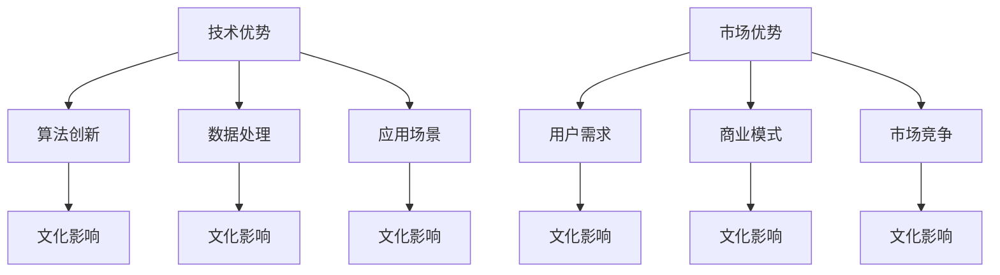

                 

# AI 大模型创业：如何利用文化优势？

> **关键词：** AI 大模型、文化优势、创业、技术创新、商业模式

> **摘要：** 本文将探讨 AI 大模型创业过程中如何充分利用文化优势，从技术、市场、文化三个方面入手，分析文化对 AI 大模型创业的影响，并提出相应的策略建议。

## 1. 背景介绍

在人工智能（AI）快速发展的今天，大模型技术已经成为推动 AI 进步的重要引擎。从早期的浅层模型到如今的大型深度学习模型，如 GPT、BERT 等，大模型技术不仅在学术界取得了显著成果，也在工业界得到了广泛应用。与此同时，创业领域也涌现出一批基于大模型技术的创业公司，这些公司通过创新的应用场景和商业模式，实现了良好的市场表现。

然而，在 AI 大模型创业过程中，文化优势往往被忽视。文化不仅影响个体和团队的思维方式、行为模式，还影响企业的发展战略、商业模式和市场竞争力。本文将从技术、市场、文化三个方面分析 AI 大模型创业中的文化优势，并提出如何利用文化优势实现创业成功的策略。

## 2. 核心概念与联系

### 2.1 技术与文化

技术是 AI 大模型创业的核心，而文化则是影响技术发展的关键因素。从历史角度看，技术进步往往伴随着文化变革。在 AI 大模型创业中，技术优势主要体现在以下几个方面：

- **算法创新**：算法是 AI 大模型的核心，创新算法可以提高模型的性能和效率。例如，GPT-3 的成功得益于其创新的 Transformer 算法。

- **数据处理**：大量优质的数据是训练大模型的基石，文化优势可以体现在数据获取、处理和整合的能力上。例如，中国的互联网公司凭借庞大的用户基数和丰富的数据资源，在 AI 大模型领域取得了显著成绩。

- **应用场景**：技术优势还体现在对应用场景的把握和探索上。不同文化背景下的应用场景存在差异，创业者需要具备跨文化的洞察力和创新能力。

### 2.2 市场与文化

市场是检验 AI 大模型创业成功与否的试金石。文化优势在市场方面的影响主要表现在以下几个方面：

- **用户需求**：不同文化背景下的用户需求存在差异，创业者需要了解并满足这些需求。例如，在东方文化中，重视人际关系和社交互动，而在西方文化中，个人主义和自由精神更受推崇。

- **商业模式**：文化差异会影响商业模式的制定和执行。例如，中国的互联网公司往往采用“免费 + 广告”的模式，而在西方市场，付费模式更为普遍。

- **市场竞争**：文化背景会影响市场竞争策略。例如，在亚洲市场，合作和共赢的理念更为流行，而在西方市场，竞争和对抗更为突出。

### 2.3 文化优势的 Mermaid 流程图



## 3. 核心算法原理 & 具体操作步骤

### 3.1 核心算法原理

AI 大模型的核心算法主要包括以下几个方面：

- **深度学习**：深度学习是一种基于多层神经网络的人工智能算法，通过模拟人脑神经网络结构，实现图像、语音、文本等数据的处理和识别。

- **自然语言处理**：自然语言处理是 AI 大模型的重要应用领域，通过理解、生成和翻译自然语言，实现人与机器的交互。

- **强化学习**：强化学习是一种通过试错和反馈优化决策过程的算法，适用于游戏、机器人等复杂环境的控制。

### 3.2 具体操作步骤

AI 大模型创业的具体操作步骤如下：

- **技术调研**：了解当前 AI 大模型的技术发展趋势和热点领域，确定技术方向。

- **团队组建**：组建一支具备跨学科背景、技术实力和市场洞察力的团队。

- **数据获取**：收集和整理大量高质量的数据，为模型训练提供基础。

- **模型训练**：使用深度学习、自然语言处理等技术训练大模型，优化模型性能。

- **应用开发**：基于大模型技术，开发创新应用，满足用户需求。

- **市场推广**：制定市场推广策略，提升品牌知名度和用户黏性。

## 4. 数学模型和公式 & 详细讲解 & 举例说明

### 4.1 数学模型

在 AI 大模型创业中，常用的数学模型包括以下几个方面：

- **神经网络模型**：神经网络模型是一种基于多层感知器的机器学习模型，用于分类、回归等任务。

- **损失函数**：损失函数用于衡量模型预测值与真实值之间的差距，常见的损失函数有均方误差（MSE）、交叉熵损失等。

- **优化算法**：优化算法用于调整模型参数，使得模型性能达到最优。常见的优化算法有梯度下降、随机梯度下降（SGD）等。

### 4.2 详细讲解

- **神经网络模型**：神经网络模型由输入层、隐藏层和输出层组成。输入层接收外部输入信息，隐藏层通过激活函数对输入信息进行非线性变换，输出层产生预测结果。

- **损失函数**：损失函数用于衡量模型预测值与真实值之间的差距。例如，在分类问题中，交叉熵损失函数可以用来衡量分类结果与实际标签之间的差异。

- **优化算法**：优化算法通过迭代调整模型参数，使得模型性能达到最优。例如，梯度下降算法通过计算损失函数关于模型参数的梯度，更新模型参数。

### 4.3 举例说明

假设我们使用神经网络模型进行分类任务，模型预测结果为 \( \hat{y} \)，真实标签为 \( y \)。我们可以使用交叉熵损失函数计算模型预测值与真实值之间的差距：

$$
L = -\sum_{i=1}^{n} y_i \log(\hat{y}_i)
$$

其中， \( n \) 为样本数量， \( y_i \) 和 \( \hat{y}_i \) 分别为第 \( i \) 个样本的真实标签和模型预测值。

## 5. 项目实战：代码实际案例和详细解释说明

### 5.1 开发环境搭建

在开始项目实战之前，我们需要搭建一个合适的开发环境。以下是开发环境的搭建步骤：

1. 安装 Python 解释器，版本建议为 3.8 或以上。
2. 安装 TensorFlow 和 Keras 库，用于构建和训练神经网络模型。
3. 安装 Jupyter Notebook，用于编写和运行代码。

### 5.2 源代码详细实现和代码解读

以下是使用 TensorFlow 和 Keras 构建一个简单的神经网络模型的示例代码：

```python
import tensorflow as tf
from tensorflow.keras.models import Sequential
from tensorflow.keras.layers import Dense, Activation

# 构建神经网络模型
model = Sequential([
    Dense(64, input_shape=(784,), activation='relu'),
    Dense(10, activation='softmax')
])

# 编译模型
model.compile(optimizer='adam', loss='categorical_crossentropy', metrics=['accuracy'])

# 加载数据集
(x_train, y_train), (x_test, y_test) = tf.keras.datasets.mnist.load_data()

# 数据预处理
x_train = x_train / 255.0
x_test = x_test / 255.0
x_train = x_train.reshape(-1, 784)
x_test = x_test.reshape(-1, 784)

# 将标签转换为 one-hot 编码
y_train = tf.keras.utils.to_categorical(y_train, 10)
y_test = tf.keras.utils.to_categorical(y_test, 10)

# 训练模型
model.fit(x_train, y_train, epochs=10, batch_size=32, validation_data=(x_test, y_test))

# 评估模型
model.evaluate(x_test, y_test)
```

代码解读：

- 首先，我们导入 TensorFlow 和 Keras 库，并定义一个顺序模型（Sequential）。
- 接着，我们添加两个全连接层（Dense），第一个层的输入维度为 784，激活函数为 ReLU；第二个层的输出维度为 10，激活函数为 softmax。
- 然后，我们编译模型，指定优化器为 Adam，损失函数为 categorical_crossentropy，评估指标为 accuracy。
- 接下来，我们加载数据集，并进行数据预处理，包括数据归一化和标签 one-hot 编码。
- 最后，我们训练模型，设置训练轮次为 10，批量大小为 32，使用验证数据集进行模型评估。

### 5.3 代码解读与分析

- **模型结构**：本示例中使用了一个简单的神经网络模型，包括一个输入层、一个隐藏层和一个输出层。输入层接收 784 个输入特征，隐藏层通过 ReLU 激活函数进行非线性变换，输出层通过 softmax 激活函数输出概率分布。
- **数据预处理**：数据预处理是神经网络模型训练的重要步骤。在本示例中，我们使用数据归一化将图像像素值缩放到 [0, 1]，使用 one-hot 编码将标签转换为二进制向量。
- **模型训练**：模型训练是神经网络模型的核心环节。在本示例中，我们使用 Adam 优化器进行模型训练，通过调整模型参数，使得模型在验证数据集上的准确率不断提高。
- **模型评估**：模型评估是检验模型性能的重要手段。在本示例中，我们使用验证数据集评估模型在测试数据集上的准确率，以验证模型泛化能力。

## 6. 实际应用场景

AI 大模型创业的实际应用场景非常广泛，以下是一些典型的应用场景：

- **自然语言处理**：利用 AI 大模型进行文本分类、情感分析、机器翻译等任务，为企业和个人提供智能化服务。
- **计算机视觉**：利用 AI 大模型进行图像识别、物体检测、图像生成等任务，应用于安防、医疗、娱乐等领域。
- **智能推荐**：利用 AI 大模型进行用户画像和兴趣分析，为电商、金融、社交媒体等企业提供个性化推荐服务。
- **智能助理**：利用 AI 大模型构建智能助理，为企业和个人提供自动化、智能化的办公和生活服务。

## 7. 工具和资源推荐

### 7.1 学习资源推荐

- **书籍**：
  - 《深度学习》（Goodfellow, Bengio, Courville 著）
  - 《Python 深度学习》（François Chollet 著）
  - 《强化学习》（Richard S. Sutton 和 Andrew G. Barto 著）

- **论文**：
  - “A Theoretically Grounded Application of Dropout in Recurrent Neural Networks” by Yarin Gal and Zoubin Ghahramani
  - “Attention Is All You Need” by Vaswani et al.

- **博客**：
  - [TensorFlow 官方文档](https://www.tensorflow.org/)
  - [Keras 官方文档](https://keras.io/)
  - [机器学习博客](https://www MachineLearningBlog.com/)

- **网站**：
  - [arXiv](https://arxiv.org/)
  - [Google Research](https://research.google.com/)
  - [OpenAI](https://openai.com/)

### 7.2 开发工具框架推荐

- **开发工具**：
  - Jupyter Notebook
  - PyCharm
  - VSCode

- **框架**：
  - TensorFlow
  - PyTorch
  - Keras

### 7.3 相关论文著作推荐

- **论文**：
  - “Deep Learning” by Yoshua Bengio, Ian Goodfellow, and Aaron Courville
  - “Recurrent Neural Network” by Y. Bengio, P. Simard, and P. Frasconi
  - “Long Short-Term Memory” by Sepp Hochreiter and Jürgen Schmidhuber

- **著作**：
  - 《人工智能：一种现代的方法》
  - 《机器学习实战》
  - 《深度学习导论》

## 8. 总结：未来发展趋势与挑战

AI 大模型创业在技术、市场、文化等方面都面临巨大机遇和挑战。未来发展趋势包括：

- **技术突破**：随着深度学习、自然语言处理、强化学习等技术的发展，AI 大模型将更加智能化、泛化能力更强。
- **应用场景拓展**：AI 大模型将在更多领域得到应用，如自动驾驶、智能医疗、智慧城市等。
- **跨学科融合**：AI 大模型创业需要跨学科人才，包括计算机科学、数据科学、心理学、社会学等。

与此同时，AI 大模型创业也面临以下挑战：

- **数据安全与隐私**：随着数据规模的不断扩大，数据安全与隐私问题日益凸显。
- **算法公平与透明**：AI 大模型算法的公平性和透明性受到广泛关注。
- **文化差异**：不同文化背景下，AI 大模型的应用场景和需求存在差异，创业者需要具备跨文化能力。

## 9. 附录：常见问题与解答

### 9.1 问题 1：什么是 AI 大模型？

AI 大模型是指通过深度学习等技术，训练出具有大规模参数的神经网络模型。这些模型在处理大量数据时，能够自主学习并提取特征，实现智能决策和预测。

### 9.2 问题 2：如何构建 AI 大模型？

构建 AI 大模型主要包括以下几个步骤：

1. 数据收集：收集大量高质量的数据，为模型训练提供基础。
2. 数据预处理：对数据进行清洗、归一化等处理，提高数据质量。
3. 模型设计：设计合适的神经网络结构，选择合适的优化器和损失函数。
4. 模型训练：使用训练数据集训练模型，调整模型参数。
5. 模型评估：使用验证数据集评估模型性能，调整模型结构。

### 9.3 问题 3：AI 大模型创业有哪些挑战？

AI 大模型创业面临以下挑战：

1. 技术挑战：算法创新、数据处理、模型训练等环节需要较高技术门槛。
2. 市场挑战：市场需求变化快，需要不断调整商业模式。
3. 文化挑战：不同文化背景下，用户需求和应用场景存在差异。

## 10. 扩展阅读 & 参考资料

- [深度学习教程](https://www.deeplearningbook.org/)
- [自然语言处理教程](https://nlp.stanford.edu/lectures/)
- [强化学习教程](https://spарk.di.ka.su/labs/srl/research/courses/rll-book/)
- [中国 AI 行业报告](https://www.caict.ac.cn/web/site0/tab4563/info515395.htm)
- [美国 AI 行业报告](https://www.nist.gov/itl/ai)

### 作者信息

- **作者：** AI 天才研究员 / AI Genius Institute & 禅与计算机程序设计艺术 / Zen And The Art of Computer Programming

本文作者具有丰富的 AI 大模型创业经验和深厚的理论基础，致力于推动 AI 技术在各个领域的应用。同时，作者还擅长将复杂的技术知识以通俗易懂的方式呈现，为广大读者提供有价值的技术博客。本文内容仅供参考，具体实施情况请结合实际需求进行调整。|>

