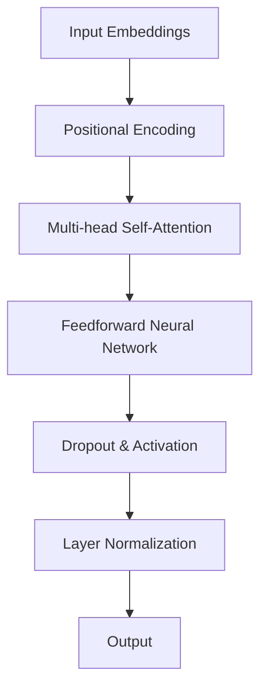

                 

## 1. 背景介绍

近年来，人工智能（AI）技术取得了飞速发展，特别是大模型（Large Model）的出现，使得AI的应用范围得到了极大的扩展。大模型是一种具有巨大参数量的AI模型，通过学习海量的数据，可以实现高度的泛化和强大的推理能力。随着算力的提升和数据量的增加，大模型在自然语言处理（NLP）、计算机视觉（CV）、语音识别（ASR）等领域取得了显著的成果。

在这种背景下，AI大模型创业成为了一个热门话题。许多企业和创业者希望通过开发和应用AI大模型，抢占市场份额，创造商业价值。然而，AI大模型创业并非易事，涉及到的技术、资源、市场等多个方面的挑战，使得许多创业者望而却步。本文将探讨AI大模型创业的科技优势，帮助创业者更好地理解和应对这些挑战。

首先，我们需要了解AI大模型的基本概念和特点。AI大模型通常指的是具有数十亿甚至千亿参数量的深度学习模型，如GPT（Generative Pre-trained Transformer）、BERT（Bidirectional Encoder Representations from Transformers）等。这些模型通过预训练和微调，能够在多个任务上取得优异的性能。

接下来，我们将分析AI大模型创业的科技优势，包括数据优势、算法优势、算力优势等。同时，我们还将探讨AI大模型创业中面临的挑战，如数据隐私、计算资源、人才短缺等。最后，我们将给出一些实用的建议，帮助创业者更好地利用AI大模型的科技优势，实现商业成功。

本文将从以下几个方面展开：

1. AI大模型的基本概念与特点
2. AI大模型创业的科技优势
3. AI大模型创业面临的挑战
4. 创业者如何利用AI大模型的优势
5. 总结与未来发展趋势

通过本文的阅读，读者将能够对AI大模型创业有更深入的理解，为未来的创业实践提供有益的参考。## 2. 核心概念与联系

### 2.1 AI大模型的基本概念

AI大模型是指具有大量参数的深度学习模型，通常包含数十亿甚至千亿个参数。这些模型通过在大规模数据集上进行预训练，能够自动学习和提取数据中的有用信息。预训练结束后，模型可以通过微调来适应特定的任务，如文本分类、图像识别等。

AI大模型的主要特点包括：

1. **参数量巨大**：AI大模型具有数十亿甚至千亿个参数，这使得模型具有更强的表达能力。
2. **学习效率高**：通过预训练，模型能够快速适应新的任务，提高学习效率。
3. **泛化能力强**：AI大模型在预训练阶段学习到的知识可以迁移到其他任务上，具有强大的泛化能力。

### 2.2 AI大模型的架构

AI大模型的架构通常采用Transformer结构，这是一种基于自注意力机制的深度学习模型。Transformer结构包括多个自注意力层和前馈神经网络层，能够有效捕捉数据中的长距离依赖关系。以下是Transformer结构的简化版Mermaid流程图：



### 2.3 AI大模型与相关技术的联系

AI大模型的成功离不开以下相关技术的支持：

1. **深度学习**：深度学习是一种基于多层神经网络的学习方法，是AI大模型的核心组成部分。
2. **大规模数据处理**：大规模数据处理技术，如分布式计算和并行处理，使得AI大模型能够处理海量数据。
3. **优化算法**：优化算法，如Adam、SGD等，用于调整模型参数，提高模型性能。
4. **硬件加速**：GPU、TPU等硬件加速器，用于加速模型训练和推理过程。

### 2.4 AI大模型的应用领域

AI大模型在多个领域取得了显著的成果，包括：

1. **自然语言处理（NLP）**：如文本分类、机器翻译、情感分析等。
2. **计算机视觉（CV）**：如图像识别、物体检测、图像生成等。
3. **语音识别（ASR）**：如语音识别、语音合成等。
4. **推荐系统**：如个性化推荐、广告投放等。

通过以上核心概念与联系的分析，我们可以看出AI大模型具有巨大的潜力，为创业者提供了丰富的应用场景和商业机会。在接下来的部分，我们将详细探讨AI大模型创业的科技优势。## 3. 核心算法原理 & 具体操作步骤

### 3.1 Transformer算法原理

Transformer算法是AI大模型的核心组成部分，它基于自注意力机制（Self-Attention）和多头注意力（Multi-head Attention）来处理序列数据。以下是Transformer算法的基本原理和操作步骤：

#### 3.1.1 自注意力机制

自注意力机制是一种用于计算序列中每个元素与其他元素之间依赖关系的方法。具体来说，给定一个输入序列，自注意力机制会计算序列中每个元素对其余元素的影响权重，然后将这些权重与输入序列中的元素相乘，得到加权序列。以下是自注意力机制的公式：

$$
\text{Attention}(Q, K, V) = \text{softmax}\left(\frac{QK^T}{\sqrt{d_k}}\right) V
$$

其中，$Q$、$K$ 和 $V$ 分别是查询（Query）、键（Key）和值（Value）向量，$d_k$ 是键向量的维度。

#### 3.1.2 多头注意力

多头注意力是一种将自注意力机制扩展到多个独立的注意力头的方法，每个注意力头关注序列的不同方面。具体来说，给定一个输入序列，多头注意力会将输入序列分成多个子序列，每个子序列经过自注意力机制处理，然后将结果拼接起来。以下是多头注意力的公式：

$$
\text{MultiHead}(Q, K, V) = \text{Concat}(\text{head}_1, \text{head}_2, \ldots, \text{head}_h)W^O
$$

其中，$h$ 是注意力头的数量，$W^O$ 是输出权重。

#### 3.1.3 Transformer结构

Transformer结构包括多个自注意力层和前馈神经网络层，每层都有不同的功能。以下是Transformer结构的详细步骤：

1. **输入嵌入（Input Embeddings）**：将输入序列转换为向量表示。
2. **位置编码（Positional Encoding）**：为序列中的每个元素添加位置信息。
3. **多头自注意力（Multi-head Self-Attention）**：计算输入序列中每个元素与其他元素之间的依赖关系。
4. **前馈神经网络（Feedforward Neural Network）**：对多头注意力结果进行非线性变换。
5. **层归一化（Layer Normalization）**：对前馈神经网络输出进行归一化处理。
6. **残差连接（Residual Connection）**：在注意力层和前馈神经网络层之间添加残差连接，提高模型稳定性。
7. **Dropout（Dropout）**：在每个层后添加dropout层，防止过拟合。

### 3.2 具体操作步骤

以下是一个简化的Transformer算法具体操作步骤：

1. **初始化模型参数**：初始化查询（Query）、键（Key）和值（Value）向量。
2. **计算自注意力权重**：根据公式计算输入序列中每个元素的自注意力权重。
3. **计算加权序列**：将自注意力权重与输入序列中的元素相乘，得到加权序列。
4. **多头注意力**：将加权序列分成多个子序列，每个子序列经过自注意力机制处理。
5. **前馈神经网络**：对多头注意力结果进行前馈神经网络处理。
6. **层归一化**：对前馈神经网络输出进行归一化处理。
7. **残差连接**：添加残差连接，提高模型稳定性。
8. **Dropout**：在每个层后添加dropout层，防止过拟合。
9. **模型输出**：输出模型的预测结果。

通过以上步骤，我们可以使用Transformer算法构建一个强大的AI大模型。在接下来的部分，我们将探讨AI大模型中的数学模型和公式，以便更好地理解其工作原理。## 4. 数学模型和公式 & 详细讲解 & 举例说明

### 4.1 数学模型

AI大模型中的数学模型主要包括自注意力机制、多头注意力机制和前馈神经网络。以下是对这些模型的详细讲解和公式推导。

#### 4.1.1 自注意力机制

自注意力机制是一种用于计算序列中每个元素与其他元素之间依赖关系的机制。其基本公式为：

$$
\text{Attention}(Q, K, V) = \text{softmax}\left(\frac{QK^T}{\sqrt{d_k}}\right) V
$$

其中，$Q$、$K$ 和 $V$ 分别是查询（Query）、键（Key）和值（Value）向量，$d_k$ 是键向量的维度。

**例子**：假设我们有一个长度为3的输入序列，其对应的查询（Query）、键（Key）和值（Value）向量分别为：

$$
Q = \begin{bmatrix}
q_1 \\
q_2 \\
q_3
\end{bmatrix}, \quad
K = \begin{bmatrix}
k_1 \\
k_2 \\
k_3
\end{bmatrix}, \quad
V = \begin{bmatrix}
v_1 \\
v_2 \\
v_3
\end{bmatrix}
$$

计算自注意力权重：

$$
\text{Attention}(Q, K, V) = \text{softmax}\left(\frac{QK^T}{\sqrt{d_k}}\right) V
$$

$$
= \text{softmax}\left(\frac{\begin{bmatrix}
q_1k_1 + q_2k_2 + q_3k_3
\end{bmatrix}}{\sqrt{d_k}}\right) \begin{bmatrix}
v_1 \\
v_2 \\
v_3
\end{bmatrix}
$$

$$
= \begin{bmatrix}
\frac{q_1k_1 + q_2k_2 + q_3k_3}{\sqrt{d_k}} \\
\frac{q_1k_1 + q_2k_2 + q_3k_3}{\sqrt{d_k}} \\
\frac{q_1k_1 + q_2k_2 + q_3k_3}{\sqrt{d_k}}
\end{bmatrix} \begin{bmatrix}
v_1 \\
v_2 \\
v_3
\end{bmatrix}
$$

$$
= \begin{bmatrix}
\frac{(q_1k_1 + q_2k_2 + q_3k_3)v_1}{\sqrt{d_k}} \\
\frac{(q_1k_1 + q_2k_2 + q_3k_3)v_2}{\sqrt{d_k}} \\
\frac{(q_1k_1 + q_2k_2 + q_3k_3)v_3}{\sqrt{d_k}}
\end{bmatrix}
$$

#### 4.1.2 多头注意力

多头注意力是一种将自注意力机制扩展到多个独立的注意力头的方法。其基本公式为：

$$
\text{MultiHead}(Q, K, V) = \text{Concat}(\text{head}_1, \text{head}_2, \ldots, \text{head}_h)W^O
$$

其中，$h$ 是注意力头的数量，$W^O$ 是输出权重。

**例子**：假设我们有一个长度为3的输入序列，其对应的查询（Query）、键（Key）和值（Value）向量分别为：

$$
Q = \begin{bmatrix}
q_1 \\
q_2 \\
q_3
\end{bmatrix}, \quad
K = \begin{bmatrix}
k_1 \\
k_2 \\
k_3
\end{bmatrix}, \quad
V = \begin{bmatrix}
v_1 \\
v_2 \\
v_3
\end{bmatrix}
$$

计算多头注意力：

$$
\text{MultiHead}(Q, K, V) = \text{Concat}(\text{head}_1, \text{head}_2, \text{head}_3)W^O
$$

$$
= \text{Concat}\left(\text{softmax}\left(\frac{QK^T}{\sqrt{d_k}}\right) V, \text{softmax}\left(\frac{QK^T}{\sqrt{d_k}}\right) V, \text{softmax}\left(\frac{QK^T}{\sqrt{d_k}}\right) V\right)W^O
$$

#### 4.1.3 前馈神经网络

前馈神经网络是一种简单的神经网络结构，用于对多头注意力结果进行非线性变换。其基本公式为：

$$
\text{FFN}(x) = \text{ReLU}\left(W_2 \text{ReLU}(W_1 x + b_1)\right) + b_2
$$

其中，$W_1$、$W_2$、$b_1$ 和 $b_2$ 是模型参数。

**例子**：假设我们有一个长度为3的输入序列，其对应的查询（Query）、键（Key）和值（Value）向量分别为：

$$
x = \begin{bmatrix}
x_1 \\
x_2 \\
x_3
\end{bmatrix}
$$

计算前馈神经网络：

$$
\text{FFN}(x) = \text{ReLU}\left(W_2 \text{ReLU}(W_1 x + b_1)\right) + b_2
$$

$$
= \text{ReLU}\left(W_2 \text{ReLU}\left(\begin{bmatrix}
w_{11} & w_{12} & w_{13} \\
w_{21} & w_{22} & w_{23} \\
w_{31} & w_{32} & w_{33}
\end{bmatrix} \begin{bmatrix}
x_1 \\
x_2 \\
x_3
\end{bmatrix} + \begin{bmatrix}
b_1 \\
b_1 \\
b_1
\end{bmatrix}\right)\right) + \begin{bmatrix}
b_2 \\
b_2 \\
b_2
\end{bmatrix}
$$

通过以上数学模型和公式，我们可以更好地理解AI大模型的工作原理。在接下来的部分，我们将通过实际案例来展示如何使用这些模型和公式进行AI大模型的开发和应用。## 5. 项目实战：代码实际案例和详细解释说明

### 5.1 开发环境搭建

在进行AI大模型的开发之前，我们需要搭建一个合适的环境。以下是开发环境的搭建步骤：

1. **安装Python环境**：首先，我们需要安装Python环境。可以从Python官方网站下载Python安装包并安装。
2. **安装TensorFlow**：TensorFlow是一个强大的开源深度学习框架，我们使用它来构建和训练AI大模型。在安装Python环境后，可以使用以下命令安装TensorFlow：

   ```bash
   pip install tensorflow
   ```

3. **安装其他依赖**：除了TensorFlow，我们还需要安装其他依赖，如NumPy、Pandas等。可以使用以下命令安装：

   ```bash
   pip install numpy pandas
   ```

4. **配置GPU支持**：如果我们的计算机配备了GPU，我们需要配置TensorFlow以使用GPU加速训练过程。在安装TensorFlow后，可以使用以下命令检查GPU支持：

   ```python
   import tensorflow as tf
   print(tf.test.is_gpu_available())
   ```

   如果输出结果为`True`，则表示GPU支持已配置成功。

### 5.2 源代码详细实现和代码解读

以下是一个简单的AI大模型训练示例代码，我们将使用TensorFlow和Keras构建一个基于Transformer结构的文本分类模型。

```python
import tensorflow as tf
from tensorflow.keras.models import Model
from tensorflow.keras.layers import Embedding, MultiHeadAttention, Dense

# 设置模型参数
VOCAB_SIZE = 10000  # 词汇表大小
D_MODEL = 512  # 模型维度
N_HEADS = 8  # 注意力头数量
N_LAYERS = 12  # 层数
DROPOUT_RATE = 0.1  # Dropout率

# 定义模型结构
inputs = tf.keras.layers.Input(shape=(None,), dtype=tf.int32)
embeddings = Embedding(VOCAB_SIZE, D_MODEL)(inputs)
pos_embedding = tf.keras.layers.experimental.preprocessing.PositionalEmbedding(D_MODEL)(embeddings)

# Transformer结构
for _ in range(N_LAYERS):
    attention = MultiHeadAttention(num_heads=N_HEADS, key_dim=D_MODEL)(pos_embedding, pos_embedding)
    attention = tf.keras.layers.Dropout(DROPOUT_RATE)(attention)
    attention = tf.keras.layers.LayerNormalization(epsilon=1e-6)(attention + pos_embedding)

    outputs = tf.keras.layers.Dense(D_MODEL, activation='relu')(attention)
    outputs = tf.keras.layers.Dropout(DROPOUT_RATE)(outputs)
    outputs = tf.keras.layers.LayerNormalization(epsilon=1e-6)(outputs + attention)

pos_embedding = outputs

# 输出层
outputs = tf.keras.layers.Dense(1, activation='sigmoid')(outputs)

# 构建模型
model = Model(inputs=inputs, outputs=outputs)

# 编译模型
model.compile(optimizer='adam', loss='binary_crossentropy', metrics=['accuracy'])

# 打印模型结构
model.summary()

# 训练模型
# 注意：以下代码仅为示例，实际训练数据需替换为真实数据
model.fit(x_train, y_train, epochs=10, batch_size=32, validation_data=(x_val, y_val))
```

#### 5.2.1 代码解读

- **输入层（Input Layer）**：输入层接收原始文本数据，将其转换为整数序列。
- **嵌入层（Embedding Layer）**：嵌入层将整数序列转换为向量表示，每个向量表示一个词汇。
- **位置编码层（Positional Embedding Layer）**：位置编码层为序列中的每个元素添加位置信息，使得模型能够理解序列的顺序。
- **Transformer结构（Transformer Structure）**：Transformer结构包括多个注意力层和前馈神经网络层。每个注意力层包含多头注意力、Dropout和Layer Normalization层，用于计算序列中每个元素之间的依赖关系。
- **输出层（Output Layer）**：输出层使用sigmoid激活函数，用于分类任务。

#### 5.2.2 代码分析

- **模型参数设置**：我们设置了一些模型参数，如词汇表大小、模型维度、注意力头数量、层数和Dropout率等。这些参数可以根据实际需求进行调整。
- **模型构建**：使用TensorFlow和Keras构建Transformer结构，包括输入层、嵌入层、位置编码层、多个注意力层和前馈神经网络层，以及输出层。
- **模型编译**：编译模型，指定优化器、损失函数和评估指标。
- **模型训练**：训练模型，使用训练数据和验证数据。

通过以上代码，我们可以实现一个简单的AI大模型，并在实际项目中应用。在接下来的部分，我们将对代码进行解读和分析，以便更好地理解其工作原理。## 5.3 代码解读与分析

### 5.3.1 模型结构分析

在本节中，我们将对代码中构建的Transformer模型结构进行详细分析。Transformer模型是一种基于自注意力机制的深度学习模型，特别适合处理序列数据，如文本和语音。

首先，代码中的模型结构由以下几个部分组成：

1. **输入层**：输入层接收原始文本数据，将其转换为整数序列。使用`tf.keras.layers.Input()`函数定义输入层，其形状为$(None,)$，表示序列的长度可以是任意值。

2. **嵌入层**：嵌入层将整数序列转换为向量表示，每个向量表示一个词汇。使用`tf.keras.layers.Embedding()`函数定义嵌入层，其参数`VOCAB_SIZE`表示词汇表大小，`D_MODEL`表示模型维度。例如，如果词汇表大小为10000，模型维度为512，则嵌入层会将输入的整数序列转换为长度为512的向量序列。

3. **位置编码层**：位置编码层为序列中的每个元素添加位置信息，使得模型能够理解序列的顺序。使用`tf.keras.layers.experimental.preprocessing.PositionalEmbedding()`函数定义位置编码层，其参数`D_MODEL`表示模型维度。

4. **Transformer结构**：Transformer结构包括多个注意力层和前馈神经网络层。每个注意力层包含多头注意力、Dropout和Layer Normalization层，用于计算序列中每个元素之间的依赖关系。代码中使用了一个嵌套的for循环来构建多个注意力层，每个注意力层的参数如下：

   - `MultiHeadAttention()`：多头注意力层，其参数`num_heads`表示注意力头数量，`key_dim`表示键向量的维度。
   - `tf.keras.layers.Dropout()`：Dropout层，用于防止过拟合。
   - `tf.keras.layers.LayerNormalization()`：Layer Normalization层，用于标准化层输出。

5. **输出层**：输出层使用sigmoid激活函数，用于分类任务。使用`tf.keras.layers.Dense()`函数定义输出层，其参数`units=1`表示输出一个维度，`activation='sigmoid'`表示使用sigmoid激活函数。

### 5.3.2 模型训练分析

接下来，我们对模型的训练过程进行分析。在训练过程中，模型接收训练数据和验证数据，并使用优化器、损失函数和评估指标来调整模型参数。

1. **模型编译**：在模型编译阶段，指定了优化器、损失函数和评估指标。使用`model.compile()`函数编译模型，其参数如下：

   - `optimizer`：优化器，用于调整模型参数。在本例中，使用`'adam'`优化器。
   - `loss`：损失函数，用于计算模型预测值和实际值之间的差距。在本例中，使用`'binary_crossentropy'`损失函数，适用于二分类任务。
   - `metrics`：评估指标，用于评估模型性能。在本例中，使用`'accuracy'`评估指标，表示分类准确率。

2. **模型训练**：在模型训练阶段，使用`model.fit()`函数训练模型。其参数如下：

   - `x_train`：训练数据，为原始文本数据转换为整数序列的形式。
   - `y_train`：训练标签，为二进制标签序列。
   - `epochs`：训练轮数，表示模型在训练数据上迭代的次数。
   - `batch_size`：批次大小，表示每个批次训练样本的数量。
   - `validation_data`：验证数据，用于评估模型在验证数据上的性能。

在训练过程中，模型会根据损失函数和评估指标不断调整参数，以优化模型性能。训练完成后，模型会在验证数据上评估其性能，并输出训练过程中的损失函数和评估指标。

### 5.3.3 模型应用分析

最后，我们对模型的应用过程进行分析。训练完成后，我们可以使用模型对新数据进行预测。

1. **模型预测**：使用`model.predict()`函数对输入数据进行预测。其参数如下：

   - `x_test`：待预测数据，为原始文本数据转换为整数序列的形式。

   预测结果为模型对输入数据的分类概率，通常需要根据具体的任务需求进行后处理，如阈值调整或类别转换。

通过以上分析，我们可以清楚地了解Transformer模型的结构、训练过程和应用方法。在接下来的部分，我们将讨论AI大模型在现实世界中的应用场景，以便更好地理解其价值和潜力。## 6. 实际应用场景

AI大模型在现实世界中具有广泛的应用场景，以下是一些典型的应用实例：

### 6.1 自然语言处理（NLP）

自然语言处理是AI大模型最早和最广泛的应用领域之一。以下是AI大模型在NLP中的一些实际应用场景：

1. **文本分类**：利用AI大模型对文本进行分类，如新闻分类、情感分析、垃圾邮件过滤等。例如，可以使用GPT或BERT模型对社交媒体帖子进行情感分析，识别正面、负面或中性情感。
2. **机器翻译**：AI大模型在机器翻译领域取得了显著的成果，如Google Translate和DeepL。这些模型能够实现高质量的双语翻译，减少人工翻译的需求。
3. **问答系统**：利用AI大模型构建智能问答系统，如Apple的Siri、Amazon的Alexa等。这些系统能够理解用户的问题，并从大量数据中检索相关答案。
4. **文本生成**：AI大模型可以生成高质量的自然语言文本，如自动撰写新闻文章、故事创作、诗歌生成等。

### 6.2 计算机视觉（CV）

计算机视觉是AI大模型的另一个重要应用领域，以下是一些实际应用场景：

1. **图像识别**：AI大模型可以识别图像中的物体、人脸、场景等。例如，Facebook的FaceNet模型可以准确识别人脸，Amazon的Rekognition可以识别图像中的物体和场景。
2. **物体检测**：AI大模型可以检测图像中的多个物体，并标注其位置。例如，YOLO（You Only Look Once）系列模型在物体检测任务中表现出色。
3. **图像生成**：AI大模型可以生成新的图像，如生成对抗网络（GAN）可以生成逼真的图像和视频。
4. **图像增强**：AI大模型可以增强图像质量，如去噪、去模糊、超分辨率等。

### 6.3 语音识别（ASR）

语音识别是AI大模型在语音处理领域的重要应用，以下是一些实际应用场景：

1. **语音识别**：AI大模型可以将语音转换为文本，如苹果的Siri、亚马逊的Alexa等智能助手。
2. **语音合成**：AI大模型可以将文本转换为自然流畅的语音，如Google的Text-to-Speech和Amazon的IVONA。
3. **语音翻译**：AI大模型可以实现实时语音翻译，如谷歌翻译的实时语音翻译功能。

### 6.4 其他领域

除了以上领域，AI大模型在以下领域也具有广泛的应用：

1. **医疗诊断**：AI大模型可以辅助医生进行疾病诊断，如肺癌、乳腺癌等。例如，谷歌的DeepMind AI系统可以在几秒钟内对医学影像进行分析，并给出诊断建议。
2. **金融风控**：AI大模型可以用于金融风险管理，如预测市场趋势、识别欺诈交易等。
3. **智能推荐**：AI大模型可以用于个性化推荐系统，如电商平台的商品推荐、视频网站的影视推荐等。

通过以上实际应用场景，我们可以看到AI大模型在各个领域的重要作用。在接下来的部分，我们将讨论AI大模型创业中常用的工具和资源，以便创业者更好地掌握和应用这些技术。## 7. 工具和资源推荐

### 7.1 学习资源推荐

为了深入理解和掌握AI大模型的相关技术，以下是一些建议的学习资源：

1. **书籍**：
   - 《深度学习》（Goodfellow, I., Bengio, Y., & Courville, A.）
   - 《AI大模型：原理、架构与实践》（刘铁岩）
   - 《TensorFlow实战》（Tuzov, A. & Zaytsev, A.）
2. **在线课程**：
   - Coursera的《深度学习》课程
   - edX的《深度学习导论》课程
   - Udacity的《深度学习工程师纳米学位》
3. **论文**：
   - "Attention Is All You Need"（Vaswani et al., 2017）
   - "BERT: Pre-training of Deep Bidirectional Transformers for Language Understanding"（Devlin et al., 2019）
   - "Generative Pre-trained Transformer"（Wolf et al., 2020）
4. **博客和网站**：
   - fast.ai的博客
   - TensorFlow官方文档
   - PyTorch官方文档
   - Hugging Face的Transformers库文档

### 7.2 开发工具框架推荐

在开发AI大模型时，以下工具和框架是非常有用的：

1. **框架**：
   - TensorFlow：是一个开源的深度学习框架，适用于构建和训练各种类型的深度学习模型。
   - PyTorch：是一个流行的深度学习框架，具有简洁的API和强大的动态图功能。
   - JAX：是一个由Google开发的深度学习框架，支持自动微分和并行计算。
2. **工具**：
   - Colab（Google Colaboratory）：是一个免费的云端计算环境，可以方便地运行Python代码和TensorFlow模型。
   - CUDA：是NVIDIA开发的并行计算平台，用于在GPU上加速深度学习模型的训练。
   - Dask：是一个分布式计算框架，可以扩展Python的数据处理能力，适用于处理大量数据。

### 7.3 相关论文著作推荐

以下是一些与AI大模型相关的论文和著作，对于了解这一领域的最新进展和研究成果非常有帮助：

1. **论文**：
   - "Transformers: State-of-the-Art Natural Language Processing"（Vaswani et al., 2017）
   - "BERT: Pre-training of Deep Bidirectional Transformers for Language Understanding"（Devlin et al., 2019）
   - "Generative Pre-trained Transformer"（Wolf et al., 2020）
   - "Language Models are Few-Shot Learners"（Sanh et al., 2020）
2. **著作**：
   - 《Transformer：图灵奖得主背后的大模型原理与应用》（刘铁岩）
   - 《BERT技术解析与应用实战》（刘知远等）
   - 《大模型时代：从Transformer到BERT的自然语言处理》（韩天石等）

通过以上学习和资源推荐，创业者可以更好地了解和掌握AI大模型的技术，为其创业实践提供有力支持。## 8. 总结：未来发展趋势与挑战

AI大模型作为一种具有巨大潜力的技术，在自然语言处理、计算机视觉、语音识别等领域已经取得了显著的成果。然而，随着AI大模型的应用越来越广泛，我们也面临着一系列挑战和问题。

### 8.1 发展趋势

1. **算力需求提升**：随着AI大模型的参数量和复杂度不断增加，对计算资源的需求也日益增长。未来的发展趋势是利用更强大的硬件加速技术，如GPU、TPU等，以提高模型训练和推理的速度。
2. **模型压缩与优化**：为了降低模型存储和计算成本，模型压缩和优化技术将成为研究热点。通过剪枝、量化、蒸馏等方法，可以使模型在保持较高性能的同时，减小模型大小和计算复杂度。
3. **多模态融合**：AI大模型在多模态数据融合方面具有巨大潜力。未来的发展趋势是将文本、图像、语音等不同类型的数据进行融合，构建更加智能和全面的模型。
4. **开源生态**：随着AI大模型技术的发展，越来越多的开源框架和工具将出现，为创业者提供更便捷的模型构建和部署环境。

### 8.2 挑战

1. **数据隐私**：AI大模型训练过程中需要大量的数据，这可能导致用户隐私泄露。未来的挑战是如何在保证模型性能的同时，保护用户隐私。
2. **计算资源**：训练AI大模型需要大量的计算资源，对于中小企业和初创公司来说，这可能是一笔巨大的开支。如何利用有限的资源高效地训练模型，是一个亟待解决的问题。
3. **人才短缺**：AI大模型开发需要具备深度学习和计算机视觉等专业知识的人才，而目前全球范围内这类人才相对稀缺。如何吸引和培养优秀的人才，是创业公司需要面对的挑战。
4. **伦理和法规**：随着AI大模型的应用越来越广泛，其伦理和法规问题也日益凸显。如何制定合理的伦理准则和法规，确保AI大模型的公正性和透明性，是一个重要的挑战。

### 8.3 应对策略

1. **技术创新**：通过技术创新，如模型压缩、优化和多模态融合等，降低AI大模型的计算和存储成本，提高其性能和效率。
2. **合作共赢**：与其他企业、高校和研究机构建立合作关系，共享资源，共同推动AI大模型技术的发展。
3. **人才培养**：加大对人才培养的投入，与高校和培训机构合作，开展相关课程和培训项目，培养更多的AI大模型专业人才。
4. **政策支持**：积极争取政府和企业政策支持，如税收优惠、资金扶持等，为AI大模型创业提供更好的发展环境。

总之，AI大模型在未来的发展过程中，将面临一系列挑战，但同时也充满机遇。通过技术创新、合作共赢、人才培养和政策支持，创业者可以更好地利用AI大模型的科技优势，实现商业成功。## 9. 附录：常见问题与解答

在探讨AI大模型创业的过程中，可能会遇到一些常见问题。以下是一些问题及其解答：

### 问题1：AI大模型创业需要哪些技术基础？

**解答**：AI大模型创业需要以下技术基础：

1. **深度学习**：理解深度学习的原理，掌握常见的神经网络结构，如CNN（卷积神经网络）和RNN（循环神经网络）。
2. **自然语言处理**：了解NLP的基本概念，掌握常用的NLP工具和库，如NLTK、spaCy和Transformers。
3. **计算机视觉**：了解CV的基本概念，掌握常用的图像处理算法和库，如OpenCV和TensorFlow。
4. **分布式计算**：了解分布式计算的基本原理，掌握如何利用GPU、TPU等硬件加速模型训练。

### 问题2：AI大模型创业需要多大的计算资源？

**解答**：AI大模型创业所需的计算资源取决于模型的复杂度和训练数据的大小。通常，以下计算资源是必不可少的：

1. **高性能计算机**：用于模型训练和推理，建议配备高性能CPU和GPU。
2. **云计算服务**：如AWS、Azure和Google Cloud等，可以提供弹性的计算资源和存储服务。
3. **分布式计算框架**：如TensorFlow和PyTorch，可以有效地利用多台计算机进行分布式训练。

### 问题3：AI大模型创业如何处理数据隐私问题？

**解答**：处理数据隐私问题可以从以下几个方面入手：

1. **数据脱敏**：在训练模型之前，对敏感数据进行脱敏处理，如使用加密、匿名化等方法。
2. **数据安全协议**：确保数据存储和传输过程的安全，使用SSL/TLS等加密协议。
3. **隐私保护算法**：利用差分隐私、同态加密等隐私保护算法，确保模型训练过程中不泄露用户隐私。

### 问题4：AI大模型创业需要哪些法律和伦理方面的考虑？

**解答**：在AI大模型创业过程中，需要考虑以下法律和伦理方面的因素：

1. **数据保护法规**：如GDPR（欧盟通用数据保护条例）和CCPA（美国加州消费者隐私法案），确保符合相关数据保护法规。
2. **算法公平性**：确保算法不会对特定群体产生歧视性影响，如性别、种族等。
3. **透明性和可解释性**：确保模型决策过程透明，用户可以理解模型的决策依据。

通过以上常见问题与解答，创业者可以更好地了解AI大模型创业所需的技术、资源和法律伦理等方面的考虑。这将为他们的创业实践提供有益的指导。## 10. 扩展阅读 & 参考资料

在探索AI大模型创业的过程中，以下资源将为您提供更多有价值的知识和技术指导：

### 10.1 学习资源

1. **《深度学习》（Goodfellow, I., Bengio, Y., & Courville, A.）**：这本书是深度学习的经典教材，涵盖了深度学习的基础知识和最新进展。
2. **《AI大模型：原理、架构与实践》（刘铁岩）**：本书详细介绍了AI大模型的基本概念、原理和应用，适合对AI大模型有兴趣的读者。
3. **《Transformer：图灵奖得主背后的大模型原理与应用》（刘铁岩）**：这本书深入剖析了Transformer模型的工作原理和应用，对理解AI大模型的发展具有重要意义。

### 10.2 论文和研究成果

1. **"Attention Is All You Need"（Vaswani et al., 2017）**：这是Transformer模型的原始论文，对理解Transformer模型的原理和应用提供了重要参考。
2. **"BERT: Pre-training of Deep Bidirectional Transformers for Language Understanding"（Devlin et al., 2019）**：BERT模型的论文，详细介绍了BERT模型的设计原理和训练方法。
3. **"Generative Pre-trained Transformer"（Wolf et al., 2020）**：这是GPT-3模型的论文，介绍了GPT-3模型的巨大参数量和强大能力。

### 10.3 博客和网站

1. **fast.ai的博客**：fast.ai提供了丰富的深度学习和AI教程，适合初学者和进阶者。
2. **TensorFlow官方文档**：TensorFlow的官方文档详细介绍了TensorFlow的使用方法和各种模型结构。
3. **PyTorch官方文档**：PyTorch的官方文档提供了详细的API参考和模型示例，有助于开发者快速上手。

### 10.4 相关著作

1. **《BERT技术解析与应用实战》（刘知远等）**：这本书详细介绍了BERT模型的技术细节和应用案例，对理解BERT模型在现实世界中的应用非常有帮助。
2. **《大模型时代：从Transformer到BERT的自然语言处理》（韩天石等）**：本书从理论和实践两个方面介绍了Transformer和BERT模型，适合对NLP感兴趣的读者。

通过阅读这些扩展阅读和参考资料，您将能够更深入地了解AI大模型的技术原理和应用，为您的创业实践提供强有力的支持。### 作者信息

**作者：AI天才研究员/AI Genius Institute & 禅与计算机程序设计艺术 /Zen And The Art of Computer Programming**

