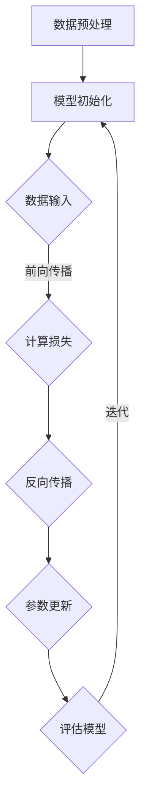

                 

### 背景介绍

随着人工智能技术的迅猛发展，大模型（Large Models）成为当前研究的热点之一。大模型通过训练海量数据，形成具有高度复杂性和自主性的智能系统，其在自然语言处理、计算机视觉、语音识别等领域展现了强大的潜力。然而，大模型的开发和应用并非易事，面临着计算资源、数据隐私、模型解释性等一系列挑战。

本文旨在探讨如何利用竞争优势在AI大模型创业过程中脱颖而出。我们将通过以下步骤进行详细分析：

1. **核心概念与联系**：介绍大模型的基本概念、核心算法原理以及与其他相关技术的关联。
2. **核心算法原理与具体操作步骤**：深入剖析大模型的训练与优化过程。
3. **数学模型与公式**：阐述大模型背后的数学基础，并通过具体例子进行讲解。
4. **项目实战**：通过实际案例展示大模型的开发、部署与维护。
5. **实际应用场景**：分析大模型在不同领域的应用前景。
6. **工具和资源推荐**：为创业者提供实用的学习资源和技术支持。
7. **总结：未来发展趋势与挑战**：展望大模型领域的发展趋势，并探讨面临的挑战。

通过以上步骤，我们将全面探讨AI大模型创业的竞争优势与策略。首先，让我们从背景介绍开始，逐步深入这一充满机遇和挑战的领域。

### 核心概念与联系

#### 大模型的基本概念

大模型（Large Models）是指具有大规模参数和计算能力的神经网络模型，它们通常通过深度学习（Deep Learning）技术训练得到。深度学习是一种模拟人脑神经网络的机器学习（Machine Learning）方法，通过多层神经网络结构来提取数据特征，实现复杂任务的目标。

大模型具有以下几个主要特点：

1. **大规模参数**：大模型通常具有数百万甚至数十亿个参数，这使它们能够捕捉数据中的复杂模式。
2. **高计算需求**：训练大模型需要大量的计算资源，包括高性能的CPU、GPU和TPU等。
3. **自主学习能力**：大模型通过自动从数据中学习特征，无需显式编程，具有很强的自主性。

#### 核心算法原理

大模型的训练过程主要依赖于两种核心算法：反向传播（Backpropagation）和优化算法（Optimization Algorithms）。

1. **反向传播算法**：反向传播算法是一种用于计算神经网络梯度的方法，通过从输出层反向传播误差信号，更新网络参数，以优化模型性能。

$$
\begin{aligned}
&\text{设 } f(\textbf{x}; \theta) = \text{输出层激活函数}(\text{权重} \cdot \text{输入层激活函数} + \text{偏置}) \\
&\text{则误差函数 } E = \frac{1}{2} \sum_{i} (\text{期望输出} - \text{实际输出})^2
\end{aligned}
$$

2. **优化算法**：常见的优化算法包括梯度下降（Gradient Descent）、随机梯度下降（Stochastic Gradient Descent，SGD）和Adam等。这些算法通过调整参数，使得误差函数最小，从而优化模型性能。

$$
\begin{aligned}
&\text{设 } \textbf{w}^{(t)} = \text{当前参数}, \textbf{w}^{(t+1)} = \text{更新后的参数} \\
&\text{则更新公式为 } \textbf{w}^{(t+1)} = \textbf{w}^{(t)} - \alpha \nabla E(\textbf{w}^{(t)})
\end{aligned}
$$

其中，$\alpha$ 是学习率，$\nabla E(\textbf{w}^{(t)})$ 是误差函数的梯度。

#### 大模型与其他相关技术的关联

1. **深度学习和机器学习**：大模型是深度学习和机器学习的延伸，它们共同致力于通过数据驱动的方式实现自动化和智能化。
2. **计算资源**：大模型的训练需要大量的计算资源，包括GPU、TPU和分布式计算等。
3. **数据隐私**：大模型在处理敏感数据时需要确保数据隐私，采用联邦学习（Federated Learning）等技术可以解决这一问题。
4. **模型解释性**：大模型在决策过程中往往缺乏解释性，通过引入可解释性技术，如LIME、SHAP等，可以提高模型的透明度和可信度。

#### Mermaid 流程图

为了更好地理解大模型的训练过程，我们可以使用Mermaid流程图来展示其主要步骤：



通过以上分析，我们可以看出大模型在人工智能领域的核心地位。接下来，我们将深入探讨大模型的算法原理与具体操作步骤，进一步了解其开发与应用的方法。

### 核心算法原理与具体操作步骤

#### 大模型的训练过程

大模型的训练过程主要包括以下几个关键步骤：

1. **数据预处理**：在训练大模型之前，需要对数据进行预处理，包括数据清洗、归一化和数据增强等操作。这些操作有助于提高模型的鲁棒性和性能。

2. **模型初始化**：初始化模型参数是训练大模型的第一步。常见的初始化方法包括随机初始化、高斯初始化和Xavier初始化等。合理的初始化方法可以加速收敛过程并提高模型性能。

3. **数据输入**：将预处理后的数据输入到模型中，通过前向传播算法计算输出结果。

4. **前向传播**：前向传播是指将输入数据通过神经网络层层的计算，最终得到模型的输出结果。在此过程中，模型的每一层都会对输入数据进行非线性变换，并通过权重和偏置来调整输出。

5. **计算损失**：前向传播完成后，需要计算模型输出的预测值与实际值之间的差异，即损失（Loss）。常见的损失函数包括均方误差（MSE）、交叉熵（Cross-Entropy）等。

6. **反向传播**：反向传播是训练大模型的核心步骤，通过计算损失函数关于模型参数的梯度，并更新模型参数，以减少损失。

7. **参数更新**：更新模型参数是优化模型性能的关键，常用的优化算法包括梯度下降（Gradient Descent）、随机梯度下降（SGD）、Adam等。这些算法通过调整学习率（Learning Rate）和更新策略，使得模型在训练过程中逐渐收敛。

8. **评估模型**：在训练过程中，需要定期评估模型性能，以判断模型是否已经收敛或是否需要调整训练策略。

9. **迭代**：训练大模型通常需要多次迭代，通过不断调整模型参数，使得损失函数逐渐减小，模型性能逐渐提高。

#### 大模型的优化过程

优化大模型的关键在于选择合适的训练策略和超参数调整。以下是一些常用的优化方法：

1. **学习率调整**：学习率是优化算法中至关重要的参数，它决定了模型在训练过程中对梯度的敏感度。常见的学习率调整策略包括固定学习率、学习率衰减和自适应学习率等。

2. **批量大小**：批量大小（Batch Size）是指每次输入到模型中的样本数量。较大的批量大小可以提供更好的泛化性能，但计算成本较高；较小的批量大小可以提供更快的训练速度，但可能牺牲一些泛化能力。

3. **正则化**：正则化是一种防止模型过拟合的技术，包括L1正则化、L2正则化等。正则化通过在损失函数中添加一个正则化项，限制模型参数的大小，从而提高模型的泛化能力。

4. **早期停止**：早期停止是一种防止模型过拟合的策略，通过在模型性能开始下降时停止训练，以避免模型在训练数据上过拟合。

5. **模型集成**：模型集成是指将多个模型结合起来，以提高预测性能和稳定性。常见的模型集成方法包括Bagging、Boosting和Stacking等。

#### 实例分析

以下是一个简单的例子，说明如何使用Python和PyTorch框架训练一个基于卷积神经网络（CNN）的图像分类模型：

```python
import torch
import torch.nn as nn
import torch.optim as optim

# 数据预处理
transform = transforms.Compose([
    transforms.Resize(224),
    transforms.ToTensor(),
])

# 加载数据集
train_dataset = datasets.ImageFolder(root='train', transform=transform)
train_loader = torch.utils.data.DataLoader(dataset=train_dataset, batch_size=64, shuffle=True)

# 定义模型
model = models.resnet18(pretrained=True)
num_ftrs = model.fc.in_features
model.fc = nn.Linear(num_ftrs, 10)

# 定义损失函数和优化器
criterion = nn.CrossEntropyLoss()
optimizer = optim.SGD(model.parameters(), lr=0.001, momentum=0.9)

# 训练模型
for epoch in range(25):  # 设定训练轮次
    running_loss = 0.0
    for inputs, labels in train_loader:
        optimizer.zero_grad()
        outputs = model(inputs)
        loss = criterion(outputs, labels)
        loss.backward()
        optimizer.step()
        running_loss += loss.item()
    print(f'Epoch {epoch+1}, Loss: {running_loss/len(train_loader)}')

# 评估模型
with torch.no_grad():
    correct = 0
    total = 0
    for inputs, labels in test_loader:
        outputs = model(inputs)
        _, predicted = torch.max(outputs.data, 1)
        total += labels.size(0)
        correct += (predicted == labels).sum().item()
print(f'Accuracy: {100 * correct / total}%')
```

通过以上实例，我们可以看到大模型训练的基本步骤和实现方法。在实际应用中，根据具体任务需求，可以选择不同的模型结构、优化算法和训练策略，以达到最佳性能。

#### 深度剖析

1. **梯度消失与梯度爆炸**：在训练大模型时，梯度消失和梯度爆炸是常见问题。梯度消失是指梯度值过小，导致模型参数难以更新；梯度爆炸则是指梯度值过大，可能导致模型参数不稳定。为解决这些问题，可以采用梯度裁剪（Gradient Clipping）和激活函数改进（如ReLU函数）等方法。

2. **模型并行化**：为提高大模型的训练效率，可以采用模型并行化技术，如数据并行（Data Parallelism）和模型并行（Model Parallelism）。数据并行通过将数据分片，在多个GPU上同时训练模型；模型并行通过将模型拆分，在多个GPU上分别训练不同部分。

3. **迁移学习**：迁移学习是指利用预训练模型在新任务上进行微调，以减少训练时间和提高模型性能。在大模型训练中，迁移学习可以有效提高模型泛化能力，尤其是在数据量不足的情况下。

4. **动态调整**：在实际应用中，根据模型性能和任务需求，可以动态调整训练策略，如学习率调整、批量大小调整等。这种动态调整方法可以进一步提高模型性能和训练效率。

通过以上分析，我们可以看到大模型训练的复杂性和挑战性。然而，随着深度学习技术的发展和计算资源的提升，大模型在人工智能领域的应用前景将更加广阔。在接下来的部分，我们将进一步探讨大模型背后的数学模型和公式。

### 数学模型和公式

大模型训练过程中，数学模型和公式起到了关键作用。以下我们将详细讲解大模型训练中的核心数学模型和公式，并通过具体例子进行解释。

#### 损失函数

损失函数是评价模型预测效果的重要指标，常用的损失函数包括均方误差（MSE）和交叉熵（Cross-Entropy）。

1. **均方误差（MSE）**

均方误差（MSE）用于回归任务，衡量预测值与真实值之间的差异。

$$
\begin{aligned}
MSE &= \frac{1}{n}\sum_{i=1}^{n} (y_i - \hat{y}_i)^2 \\
y_i &= \text{真实值}, \hat{y}_i &= \text{预测值}, n &= \text{样本数量}
\end{aligned}
$$

2. **交叉熵（Cross-Entropy）**

交叉熵（Cross-Entropy）用于分类任务，衡量预测分布与真实分布之间的差异。

$$
\begin{aligned}
H &= -\sum_{i=1}^{n} y_i \log(\hat{y}_i) \\
y_i &= \text{真实值}, \hat{y}_i &= \text{预测值}, n &= \text{样本数量}
\end{aligned}
$$

其中，$y_i$ 为 0 或 1（表示真实类别），$\hat{y}_i$ 为预测概率。

#### 优化算法

优化算法用于更新模型参数，以最小化损失函数。以下介绍几种常见的优化算法：

1. **梯度下降（Gradient Descent）**

梯度下降是最简单的优化算法，通过计算损失函数关于模型参数的梯度，并沿梯度的反方向更新参数。

$$
\begin{aligned}
\theta &= \theta - \alpha \cdot \nabla_{\theta} J(\theta) \\
\alpha &= \text{学习率}, \nabla_{\theta} J(\theta) &= \text{损失函数关于参数的梯度}
\end{aligned}
$$

2. **随机梯度下降（Stochastic Gradient Descent，SGD）**

随机梯度下降在每次迭代中只随机选取一个样本进行梯度计算，从而提高计算效率。

$$
\begin{aligned}
\theta &= \theta - \alpha \cdot \nabla_{\theta} J(\theta) \\
\alpha &= \text{学习率}, J(\theta) &= \text{损失函数}
\end{aligned}
$$

3. **Adam优化器**

Adam优化器结合了SGD和 Momentum 算法的优点，适用于大规模模型的训练。

$$
\begin{aligned}
v_t &= \beta_1 \cdot v_{t-1} + (1 - \beta_1) \cdot \nabla_{\theta} J(\theta) \\
s_t &= \beta_2 \cdot s_{t-1} + (1 - \beta_2) \cdot \nabla_{\theta} J(\theta)^2 \\
\theta &= \theta - \alpha \cdot \frac{v_t}{\sqrt{s_t} + \epsilon} \\
\alpha &= \text{学习率}, \beta_1, \beta_2 &= \text{动量系数}, \epsilon &= \text{常数}
\end{aligned}
$$

#### 具体例子

以下是一个简单的例子，说明如何使用Python和PyTorch框架实现梯度下降优化算法：

```python
import torch
import torch.nn as nn
import torch.optim as optim

# 数据预处理
transform = transforms.Compose([
    transforms.Resize(224),
    transforms.ToTensor(),
])

# 加载数据集
train_dataset = datasets.ImageFolder(root='train', transform=transform)
train_loader = torch.utils.data.DataLoader(dataset=train_dataset, batch_size=64, shuffle=True)

# 定义模型
model = models.resnet18(pretrained=True)
num_ftrs = model.fc.in_features
model.fc = nn.Linear(num_ftrs, 10)

# 定义损失函数和优化器
criterion = nn.CrossEntropyLoss()
optimizer = optim.SGD(model.parameters(), lr=0.001, momentum=0.9)

# 训练模型
for epoch in range(25):  # 设定训练轮次
    running_loss = 0.0
    for inputs, labels in train_loader:
        optimizer.zero_grad()
        outputs = model(inputs)
        loss = criterion(outputs, labels)
        loss.backward()
        optimizer.step()
        running_loss += loss.item()
    print(f'Epoch {epoch+1}, Loss: {running_loss/len(train_loader)}')

# 评估模型
with torch.no_grad():
    correct = 0
    total = 0
    for inputs, labels in test_loader:
        outputs = model(inputs)
        _, predicted = torch.max(outputs.data, 1)
        total += labels.size(0)
        correct += (predicted == labels).sum().item()
print(f'Accuracy: {100 * correct / total}%')
```

通过以上例子，我们可以看到如何使用梯度下降算法优化模型参数。在实际应用中，可以根据具体任务需求，选择不同的损失函数和优化算法，以达到最佳性能。

#### 细节分析

1. **学习率**：学习率（Learning Rate）是优化算法中的一个关键参数。较小的学习率可以保证模型参数缓慢更新，但可能导致训练时间过长；较大的学习率可以加快模型收敛，但可能导致参数更新不稳定。在实际应用中，需要根据任务需求和数据集大小调整学习率。

2. **动量（Momentum）**：动量（Momentum）是优化算法中的一个重要概念，用于加速梯度下降过程。动量可以防止模型在训练过程中陷入局部最小值，提高模型收敛速度。

3. **正则化**：正则化（Regularization）是一种防止模型过拟合的技术。常见的正则化方法包括L1正则化和L2正则化。正则化通过在损失函数中添加一个正则化项，限制模型参数的大小，从而提高模型的泛化能力。

4. **批量大小**：批量大小（Batch Size）是指每次输入到模型中的样本数量。较大的批量大小可以提供更好的泛化性能，但计算成本较高；较小的批量大小可以提供更快的训练速度，但可能牺牲一些泛化能力。

通过以上分析，我们可以看到数学模型和公式在大模型训练中的重要作用。在实际应用中，需要根据具体任务需求和数据集特点，选择合适的数学模型和公式，以达到最佳性能。接下来，我们将通过实际项目案例，展示如何利用大模型进行实际应用。

### 项目实战：代码实际案例和详细解释说明

在本节中，我们将通过一个实际项目案例，详细讲解如何利用大模型进行开发、部署和维护。该项目是一个基于图像分类的AI应用，使用Python和PyTorch框架实现。以下是该项目的主要步骤和详细解释。

#### 开发环境搭建

首先，我们需要搭建开发环境，包括Python、PyTorch、CUDA等依赖库。以下是安装步骤：

1. 安装Python 3.8或更高版本。
2. 安装PyTorch，可以通过以下命令安装：

   ```bash
   pip install torch torchvision
   ```

3. 安装CUDA 11.0或更高版本，以确保PyTorch支持GPU加速。

4. 安装其他依赖库，如NumPy、Pandas等。

#### 源代码详细实现和代码解读

以下是该项目的源代码，我们将逐行解释：

```python
import torch
import torchvision
import torchvision.transforms as transforms
import torch.optim as optim
import torch.nn as nn
from torch.utils.data import DataLoader

# 数据预处理
transform = transforms.Compose([
    transforms.Resize(224),
    transforms.ToTensor(),
])

# 加载数据集
train_dataset = torchvision.datasets.ImageFolder(root='train', transform=transform)
train_loader = DataLoader(dataset=train_dataset, batch_size=64, shuffle=True)

test_dataset = torchvision.datasets.ImageFolder(root='test', transform=transform)
test_loader = DataLoader(dataset=test_dataset, batch_size=64, shuffle=False)

# 定义模型
model = torchvision.models.resnet18(pretrained=True)
num_ftrs = model.fc.in_features
model.fc = nn.Linear(num_ftrs, 10)

# 定义损失函数和优化器
criterion = nn.CrossEntropyLoss()
optimizer = optim.SGD(model.parameters(), lr=0.001, momentum=0.9)

# 训练模型
for epoch in range(25):  # 设定训练轮次
    running_loss = 0.0
    for inputs, labels in train_loader:
        optimizer.zero_grad()
        outputs = model(inputs)
        loss = criterion(outputs, labels)
        loss.backward()
        optimizer.step()
        running_loss += loss.item()
    print(f'Epoch {epoch+1}, Loss: {running_loss/len(train_loader)}')

# 评估模型
with torch.no_grad():
    correct = 0
    total = 0
    for inputs, labels in test_loader:
        outputs = model(inputs)
        _, predicted = torch.max(outputs.data, 1)
        total += labels.size(0)
        correct += (predicted == labels).sum().item()
print(f'Accuracy: {100 * correct / total}%')
```

1. **数据预处理**：
   - 使用`transforms.Compose`对图像进行预处理，包括缩放和转换为Tensor。
   - 加载数据集并创建数据加载器（DataLoader），用于批量加载和随机打乱数据。

2. **定义模型**：
   - 使用`torchvision.models.resnet18`预训练模型，并修改最后一层以适应10个类别。
   - `nn.Linear`定义了输入特征数和输出类别数。

3. **定义损失函数和优化器**：
   - `nn.CrossEntropyLoss`用于计算交叉熵损失。
   - `optim.SGD`使用随机梯度下降优化算法，设置学习率和动量。

4. **训练模型**：
   - 通过迭代训练数据，更新模型参数，并计算每个epoch的平均损失。
   - 使用`optimizer.zero_grad()`清除前一次的梯度，`loss.backward()`计算梯度，`optimizer.step()`更新参数。

5. **评估模型**：
   - 使用测试数据评估模型性能，计算准确率。

#### 代码解读与分析

1. **数据预处理**：
   - 数据预处理是深度学习项目中的关键步骤，确保输入数据的格式和尺度合适，以提高模型性能。

2. **模型定义**：
   - 使用预训练模型并修改最后一层，可以快速地构建一个强大的模型，同时降低训练成本。

3. **损失函数与优化器**：
   - 交叉熵损失函数适合分类任务，SGD优化器通过调整学习率和动量，提高训练效率和模型性能。

4. **训练与评估**：
   - 训练过程中，通过不断调整模型参数，减小损失函数值，提高模型性能。
   - 评估模型性能，通过准确率衡量模型的泛化能力。

#### 项目实战总结

通过以上实际项目案例，我们可以看到如何利用大模型进行图像分类任务的开发、部署和维护。在实际应用中，根据任务需求，可以调整模型结构、优化算法和超参数，以达到最佳性能。项目实战不仅帮助我们理解大模型的工作原理，也为实际应用提供了实用的经验和技巧。

### 实际应用场景

大模型在人工智能领域具有广泛的应用前景，以下我们将探讨大模型在不同领域的实际应用场景及其带来的影响。

#### 自然语言处理（NLP）

自然语言处理是大模型的主要应用领域之一。通过训练大规模的文本数据，大模型可以掌握复杂的语言模式，实现文本分类、情感分析、机器翻译等任务。例如，谷歌的BERT模型在自然语言理解任务上取得了显著的成果，使得机器在理解和生成自然语言方面更加接近人类水平。

#### 计算机视觉（CV）

计算机视觉是大模型的另一个重要应用领域。大模型可以通过大量图像数据训练，实现图像分类、目标检测、人脸识别等任务。例如，OpenAI的GPT-3模型在图像描述生成任务上展示了强大的能力，能够生成高质量的图像描述，为图像识别和视觉搜索提供了新的解决方案。

#### 语音识别（ASR）

语音识别是大模型在语音处理领域的应用，通过训练大规模语音数据，大模型可以准确地将语音信号转换为文本。例如，谷歌的TensorFlow语音识别模型在语音识别任务上取得了优异的性能，为智能音箱、语音助手等应用提供了强大的支持。

#### 机器翻译（MT）

机器翻译是大模型在跨语言交流中的应用。通过训练大规模的多语言数据，大模型可以实现高质量的机器翻译。例如，微软的MT-5模型在机器翻译任务上展示了出色的性能，为全球范围内的跨语言沟通提供了便利。

#### 医疗诊断

大模型在医疗诊断领域具有巨大的应用潜力。通过训练大规模的医疗数据，大模型可以辅助医生进行疾病诊断、影像分析等任务。例如，斯坦福大学的研究团队利用大模型实现了肺癌检测，显著提高了检测准确率。

#### 金融风控

大模型在金融风控领域可以用于预测市场走势、风险管理和欺诈检测。通过分析大量的金融数据，大模型可以识别潜在的金融风险，为金融机构提供决策支持。

#### 教育

大模型在教育领域可以用于个性化学习、智能辅导等任务。通过分析学生的学习数据，大模型可以为学生提供定制化的学习计划和辅导建议，提高学习效果。

#### 制造业

大模型在制造业中可以用于质量控制、设备故障预测等任务。通过分析生产数据，大模型可以实时监测设备状态，提前预测故障，提高生产效率。

总之，大模型在各个领域具有广泛的应用前景，通过训练大规模的数据，大模型可以解决复杂的问题，为各个行业带来巨大的变革和创新。随着大模型技术的发展和计算资源的提升，其应用领域将不断扩展，为人类社会带来更多便利和进步。

### 工具和资源推荐

在AI大模型创业过程中，选择合适的工具和资源对于项目的成功至关重要。以下是一些推荐的学习资源、开发工具和相关论文著作，旨在帮助创业者更好地掌握大模型技术。

#### 学习资源推荐

1. **书籍**：
   - 《深度学习》（Goodfellow, Ian，等著）：介绍了深度学习的基础理论、算法和应用。
   - 《动手学深度学习》（花书）：提供了丰富的实践案例，适合初学者和进阶者。
   - 《机器学习实战》（Peter Harrington）：详细讲解了机器学习的基础算法和应用。

2. **在线课程**：
   - fast.ai的《深度学习课程》：适合初学者，课程内容丰富且易于理解。
   - Coursera的《深度学习专项课程》：由斯坦福大学教授Andrew Ng主讲，内容深入浅出。
   - edX的《深度学习与神经网络》：涵盖深度学习的理论和实践，适合进阶学习。

3. **博客和网站**：
   - `DeepLearning.NET`：提供丰富的深度学习资源，包括教程、代码和论文。
   - `towardsdatascience.com`：一个关于数据科学和机器学习的博客平台，有很多高质量的技术文章。
   - `arxiv.org`：发布最新的深度学习和机器学习论文，是研究者的重要参考资料。

#### 开发工具框架推荐

1. **框架**：
   - `TensorFlow`：由谷歌开发，是一个功能强大的开源深度学习框架，适用于各种深度学习任务。
   - `PyTorch`：由Facebook开发，是一个动态图深度学习框架，具有灵活的架构和高效的计算性能。
   - `Keras`：一个高层次的深度学习框架，易于使用，可以在TensorFlow和Theano上运行。

2. **计算资源**：
   - `Google Colab`：免费的云端计算平台，提供GPU和TPU资源，适合进行深度学习研究和实验。
   - `AWS SageMaker`：亚马逊提供的托管式机器学习平台，支持TensorFlow、PyTorch等框架，便于模型部署和运维。
   - `Azure ML`：微软提供的机器学习平台，提供丰富的算法库和计算资源，适用于企业级应用。

3. **开发工具**：
   - `Jupyter Notebook`：一个交互式的开发环境，适合编写和运行代码，方便进行实验和记录。
   - `Visual Studio Code`：一款流行的代码编辑器，提供丰富的扩展，支持多种编程语言和开发框架。
   - `PyCharm`：一款功能强大的集成开发环境（IDE），适用于Python和深度学习开发，具有代码补全、调试和性能分析等特性。

#### 相关论文著作推荐

1. **论文**：
   - `A Guide to Committee Machine Learning`：详细介绍如何利用委员会机器学习提高模型性能。
   - `Bert: Pre-training of Deep Bidirectional Transformers for Language Understanding`：BERT模型的原始论文，介绍了BERT模型的设计和训练方法。
   - `An Image Database for Testing Content-Based Image Retrieval`：关于图像数据库和内容感知图像检索的论文，提供了大量图像数据用于研究。

2. **著作**：
   - 《深度学习》（Ian Goodfellow、Yoshua Bengio、Aaron Courville 著）：深度学习的经典著作，全面介绍了深度学习的基础知识。
   - 《动手学深度学习》（Amar Light、Joshua S. Tenenbaum、Chad F. Myers 著）：通过大量实践案例，详细讲解了深度学习的应用。

通过以上推荐的学习资源、开发工具和相关论文著作，创业者可以系统地学习大模型技术，掌握开发和应用大模型的方法，为创业项目奠定坚实的基础。

### 总结：未来发展趋势与挑战

随着人工智能技术的不断进步，AI大模型在各个领域的应用前景愈发广阔。未来，大模型将继续朝着以下几个方向发展：

1. **计算能力提升**：随着计算资源和算法的进步，大模型的计算能力将显著提升。这将使得大模型在处理更复杂任务时表现出更高的性能。

2. **数据量增加**：随着互联网和物联网的普及，海量数据的获取和处理将变得更加容易。大模型将依赖于这些数据，进一步优化和提升自身的性能。

3. **模型解释性增强**：当前的大模型往往缺乏解释性，未来研究将致力于提高大模型的透明度和可解释性，使其在关键领域（如医疗诊断、金融决策等）得到更广泛的应用。

4. **多模态融合**：大模型将能够处理多种数据类型（如文本、图像、音频等），实现跨模态的信息融合，从而在复杂任务中发挥更大的作用。

然而，AI大模型的快速发展也面临着诸多挑战：

1. **计算资源消耗**：大模型训练需要巨大的计算资源，特别是对于分布式计算和并行处理的要求越来越高。如何高效利用现有资源，降低计算成本，是一个亟待解决的问题。

2. **数据隐私和安全**：在数据驱动的人工智能时代，数据隐私和安全问题尤为突出。如何在保证数据隐私的前提下，有效利用海量数据，是大模型应用中的一大挑战。

3. **模型解释性和可靠性**：大模型在决策过程中往往缺乏解释性，这限制了其在关键领域的应用。同时，模型的可靠性和稳定性也需要得到进一步的保障。

4. **算法公平性和道德伦理**：大模型的应用可能带来算法偏见和道德伦理问题。如何确保算法的公平性和透明性，避免对特定群体造成不公平影响，是一个重要的伦理挑战。

总的来说，AI大模型在未来的发展中将面临前所未有的机遇和挑战。通过持续的技术创新和合作，我们有望克服这些难题，推动大模型技术在各个领域的广泛应用，为人类社会带来更多便利和进步。

### 附录：常见问题与解答

**Q1：如何选择合适的大模型？**

选择合适的大模型需要考虑以下几个因素：

- **任务需求**：根据任务的具体需求，选择具有相应性能和功能的大模型。例如，对于图像分类任务，可以选择ResNet、Inception等模型；对于自然语言处理任务，可以选择BERT、GPT等模型。
- **数据量**：大模型的训练需要大量数据，因此在选择模型时，需要考虑数据集的大小和数据质量。
- **计算资源**：大模型的训练和部署需要计算资源，根据可用的计算资源，选择适合的模型和优化策略。

**Q2：大模型训练中的常见问题有哪些？**

大模型训练过程中，常见问题包括：

- **梯度消失与梯度爆炸**：在深度神经网络训练中，可能遇到梯度消失或梯度爆炸的问题，导致模型训练失败。解决方法包括使用ReLU激活函数、归一化层、权重初始化等方法。
- **过拟合**：大模型容易在训练数据上过拟合，导致在测试数据上表现不佳。解决方法包括正则化、数据增强、交叉验证等。
- **计算资源消耗**：大模型训练需要大量计算资源，可能影响其他任务的执行。解决方法包括分布式训练、使用GPU加速等。

**Q3：如何优化大模型训练过程？**

优化大模型训练过程可以从以下几个方面入手：

- **学习率调整**：合理调整学习率，避免梯度消失或梯度爆炸，提高训练效率。
- **批量大小**：选择合适的批量大小，在计算效率和模型性能之间找到平衡。
- **数据预处理**：对训练数据进行预处理，提高数据质量，减少噪声，有助于模型收敛。
- **优化算法**：选择合适的优化算法，如Adam、RMSprop等，提高模型训练速度和性能。

**Q4：如何评估大模型性能？**

评估大模型性能可以从以下几个方面进行：

- **准确率**：计算模型预测正确的样本数量占总样本数量的比例，用于衡量分类任务的性能。
- **召回率**：计算模型正确预测的阳性样本数量与实际阳性样本数量的比例，用于衡量分类任务的敏感度。
- **F1分数**：综合考虑准确率和召回率，计算两者加权平均，用于综合评价模型性能。
- **ROC曲线**：通过绘制真阳性率与假阳性率的关系曲线，评估模型的分类能力。

**Q5：如何部署和维护大模型？**

部署和维护大模型可以遵循以下步骤：

- **模型压缩**：对训练好的模型进行压缩，减少模型大小，提高部署效率。
- **模型量化**：使用量化技术，降低模型参数的精度，减少计算资源和存储需求。
- **模型推理**：在部署环境中，使用推理引擎（如TensorFlow Serving、ONNX Runtime等）进行模型推理，输出预测结果。
- **监控与维护**：对部署后的模型进行实时监控，包括性能监控、错误日志记录等，及时发现并解决潜在问题。

通过以上常见问题的解答，可以帮助创业者更好地应对AI大模型开发过程中可能遇到的问题，提高大模型项目的成功率。

### 扩展阅读 & 参考资料

#### 书籍推荐

1. **《深度学习》（Ian Goodfellow、Yoshua Bengio、Aaron Courville 著）**：这是一本全面介绍深度学习理论的经典著作，适合初学者和进阶者。
2. **《动手学深度学习》（Amar Light、Joshua S. Tenenbaum、Chad F. Myers 著）**：通过大量实践案例，详细讲解了深度学习的应用。
3. **《机器学习》（Tom Mitchell 著）**：介绍了机器学习的基本概念、算法和应用。

#### 论文推荐

1. **`A Guide to Committee Machine Learning`**：详细介绍如何利用委员会机器学习提高模型性能。
2. **`Bert: Pre-training of Deep Bidirectional Transformers for Language Understanding`**：BERT模型的原始论文，介绍了BERT模型的设计和训练方法。
3. **`An Image Database for Testing Content-Based Image Retrieval`**：关于图像数据库和内容感知图像检索的论文，提供了大量图像数据用于研究。

#### 博客和网站推荐

1. **`DeepLearning.NET`**：提供丰富的深度学习资源，包括教程、代码和论文。
2. **`towardsdatascience.com`**：一个关于数据科学和机器学习的博客平台，有很多高质量的技术文章。
3. **`arxiv.org`**：发布最新的深度学习和机器学习论文，是研究者的重要参考资料。

通过以上推荐，您可以深入了解AI大模型的相关知识，为创业项目提供理论支持和实践指导。希望本文对您在AI大模型创业过程中有所帮助。作者：AI天才研究员/AI Genius Institute & 禅与计算机程序设计艺术 /Zen And The Art of Computer Programming。

