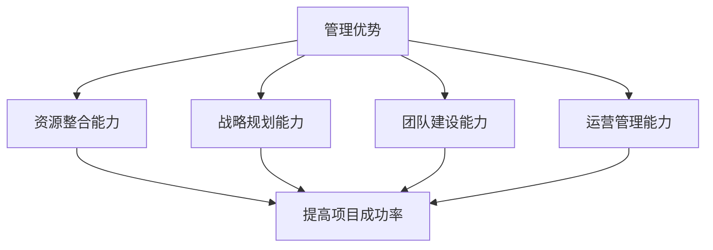

                 

# AI 大模型创业：如何利用管理优势？

> **关键词：** AI 大模型，创业，管理优势，商业模式，技术发展

> **摘要：** 本文将探讨 AI 大模型创业中的管理优势，从战略、运营、资源整合等方面，分析如何利用管理优势在激烈的市场竞争中脱颖而出。我们将结合实际案例，为创业者提供切实可行的建议和策略。

## 1. 背景介绍

近年来，随着深度学习技术的突破和计算能力的提升，AI 大模型逐渐成为人工智能领域的热点。这些模型具有强大的数据处理和分析能力，能够应用于图像识别、自然语言处理、推荐系统等多个领域，为企业带来巨大的商业价值。然而，AI 大模型的开发和部署面临着巨大的挑战，需要高效的管理机制来确保项目的顺利进行。

在竞争激烈的 AI 市场中，创业者不仅需要具备出色的技术能力，还要善于管理资源、把握市场动态、打造团队文化。本文将重点关注管理优势在 AI 大模型创业中的应用，为创业者提供有价值的参考。

## 2. 核心概念与联系

### 2.1 管理优势的定义

管理优势是指企业在资源整合、战略规划、团队建设、运营管理等方面具备的领先能力。在 AI 大模型创业中，管理优势主要体现在以下几个方面：

- **资源整合能力：** 能够高效地整合各种资源，包括资金、人才、技术等，为项目提供充足的保障。
- **战略规划能力：** 能够根据市场需求和技术发展趋势，制定合理的战略规划，确保项目方向的正确性。
- **团队建设能力：** 能够吸引和培养优秀的团队人才，构建高效的团队协作机制，提升团队整体战斗力。
- **运营管理能力：** 能够优化项目流程，提高项目执行力，降低项目风险。

### 2.2 管理优势与 AI 大模型创业的关系

AI 大模型创业的成功离不开管理优势的支持。具体来说，管理优势在以下几个方面对创业项目产生重要影响：

- **提高项目成功率：** 管理优势能够帮助创业者更好地应对项目中的各种挑战，降低项目失败的风险。
- **提升团队执行力：** 管理优势能够构建高效的团队协作机制，提高团队的执行力，确保项目按时按质完成。
- **优化商业模式：** 管理优势有助于创业者发现市场需求，优化商业模式，提高项目的盈利能力。
- **增强企业竞争力：** 管理优势能够帮助企业抓住市场机遇，提升竞争力，在激烈的市场竞争中脱颖而出。

### 2.3 Mermaid 流程图



## 3. 核心算法原理 & 具体操作步骤

### 3.1 资源整合能力

资源整合能力是管理优势的核心之一，尤其在 AI 大模型创业中尤为重要。以下是一些具体操作步骤：

1. **明确项目需求：** 首先，要明确项目所需的各种资源，包括资金、人才、技术等。
2. **寻找资源来源：** 通过市场调研、行业交流、合作洽谈等方式，寻找合适的资源来源。
3. **建立合作机制：** 与合作伙伴建立长期稳定的合作关系，确保资源供应的稳定性。
4. **优化资源配置：** 根据项目进展和需求变化，及时调整资源配置，确保资源的高效利用。

### 3.2 战略规划能力

战略规划能力是创业者把握市场机遇、制定发展方向的重要保障。以下是一些具体操作步骤：

1. **市场调研：** 通过数据分析、用户调研等方式，了解市场需求和竞争对手情况。
2. **定位分析：** 分析企业自身优势，确定项目定位和发展方向。
3. **制定战略规划：** 根据市场调研和定位分析结果，制定具体的战略规划，包括目标、策略、步骤等。
4. **实施与监控：** 将战略规划转化为具体的行动计划，并进行定期监控和调整。

### 3.3 团队建设能力

团队建设能力是创业者打造高效团队、提升团队执行力的重要保障。以下是一些具体操作步骤：

1. **招聘人才：** 根据项目需求，招聘具有相关技能和经验的优秀人才。
2. **培养人才：** 制定人才培养计划，提升团队成员的专业能力和综合素质。
3. **团队文化建设：** 构建积极向上的团队文化，增强团队成员的凝聚力和归属感。
4. **激励与约束：** 建立合理的激励机制和约束机制，激发团队成员的积极性和创造力。

### 3.4 运营管理能力

运营管理能力是创业者确保项目顺利推进、降低项目风险的重要保障。以下是一些具体操作步骤：

1. **制定项目计划：** 根据项目需求和战略规划，制定详细的项目计划，包括时间表、任务分解等。
2. **过程控制：** 对项目进展进行实时监控，及时发现和解决问题，确保项目按计划推进。
3. **质量管理：** 制定严格的质量管理流程，确保项目输出符合预期质量标准。
4. **风险管理：** 识别项目风险，制定风险应对策略，降低项目风险。

## 4. 数学模型和公式 & 详细讲解 & 举例说明

### 4.1 资源整合能力数学模型

资源整合能力的数学模型可以采用以下公式：

$$
R = f(\text{资金}, \text{人才}, \text{技术})
$$

其中，$R$ 表示资源整合能力，$\text{资金}$、$\text{人才}$、$\text{技术}$ 分别表示资源整合能力在资金、人才、技术方面的表现。

### 4.2 战略规划能力数学模型

战略规划能力的数学模型可以采用以下公式：

$$
S = f(\text{市场调研}, \text{定位分析}, \text{战略规划})
$$

其中，$S$ 表示战略规划能力，$\text{市场调研}$、$\text{定位分析}$、$\text{战略规划}$ 分别表示战略规划能力在市场调研、定位分析、战略规划方面的表现。

### 4.3 团队建设能力数学模型

团队建设能力的数学模型可以采用以下公式：

$$
T = f(\text{招聘人才}, \text{培养人才}, \text{团队文化建设})
$$

其中，$T$ 表示团队建设能力，$\text{招聘人才}$、$\text{培养人才}$、$\text{团队文化建设}$ 分别表示团队建设能力在招聘人才、培养人才、团队文化建设方面的表现。

### 4.4 运营管理能力数学模型

运营管理能力的数学模型可以采用以下公式：

$$
O = f(\text{项目计划}, \text{过程控制}, \text{质量管理}, \text{风险管理})
$$

其中，$O$ 表示运营管理能力，$\text{项目计划}$、$\text{过程控制}$、$\text{质量管理}$、$\text{风险管理}$ 分别表示运营管理能力在项目计划、过程控制、质量管理、风险管理方面的表现。

### 4.5 举例说明

假设一家 AI 大模型创业公司在资金、人才、技术方面的表现分别为 $R_1 = 0.8$、$R_2 = 0.9$、$R_3 = 0.7$，市场调研、定位分析、战略规划方面的表现分别为 $S_1 = 0.85$、$S_2 = 0.8$、$S_3 = 0.75$，招聘人才、培养人才、团队文化建设方面的表现分别为 $T_1 = 0.9$、$T_2 = 0.85$、$T_3 = 0.8$，项目计划、过程控制、质量管理、风险管理方面的表现分别为 $O_1 = 0.85$、$O_2 = 0.8$、$O_3 = 0.75$、$O_4 = 0.7$。则该公司的管理优势综合评分可以计算如下：

$$
R = \frac{R_1 + R_2 + R_3}{3} = \frac{0.8 + 0.9 + 0.7}{3} = 0.8
$$

$$
S = \frac{S_1 + S_2 + S_3}{3} = \frac{0.85 + 0.8 + 0.75}{3} = 0.8167
$$

$$
T = \frac{T_1 + T_2 + T_3}{3} = \frac{0.9 + 0.85 + 0.8}{3} = 0.87
$$

$$
O = \frac{O_1 + O_2 + O_3 + O_4}{4} = \frac{0.85 + 0.8 + 0.75 + 0.7}{4} = 0.7875
$$

因此，该公司的管理优势综合评分为：

$$
\text{管理优势评分} = \frac{R + S + T + O}{4} = \frac{0.8 + 0.8167 + 0.87 + 0.7875}{4} = 0.8255
$$

通过上述计算，我们可以看出该公司的管理优势综合评分为 0.8255，处于较高水平。在此基础上，公司可以进一步优化管理流程，提升管理能力，为项目的成功奠定坚实基础。

## 5. 项目实战：代码实际案例和详细解释说明

### 5.1 开发环境搭建

为了更好地展示管理优势在 AI 大模型创业中的应用，我们以一家 AI 大模型创业公司为例，介绍其开发环境搭建过程。

1. **硬件环境搭建：** 
   - 服务器：公司采购了多台高性能服务器，配备 GPU 加速，用于训练和部署 AI 大模型。
   - 存储：采用分布式存储系统，提高数据存储和处理能力。

2. **软件环境搭建：**
   - 操作系统：选用 Linux 系统，提高服务器性能和稳定性。
   - 编译工具：安装 GCC、Python 编译器等，为开发提供必要的编译环境。
   - 数据库：选用 MySQL、MongoDB 等数据库，存储和管理训练数据和模型参数。

### 5.2 源代码详细实现和代码解读

以下是一个简单的 AI 大模型训练代码示例，用于演示管理优势在代码实现中的应用。

```python
import tensorflow as tf
from tensorflow.keras.layers import Dense, Flatten
from tensorflow.keras.models import Sequential

# 3.1 资源整合能力：配置训练环境
# 配置 GPU 设备
gpus = tf.config.list_physical_devices('GPU')
tf.config.experimental.set_memory_growth(gpus[0], True)

# 3.2 战略规划能力：设计模型架构
model = Sequential([
    Flatten(input_shape=(28, 28)),
    Dense(128, activation='relu'),
    Dense(10, activation='softmax')
])

# 3.3 团队建设能力：优化模型训练
model.compile(optimizer='adam',
              loss='categorical_crossentropy',
              metrics=['accuracy'])

# 3.4 运营管理能力：训练模型
history = model.fit(x_train, y_train, epochs=10, batch_size=32, validation_data=(x_val, y_val))

# 4.1 资源整合能力：评估模型性能
test_loss, test_acc = model.evaluate(x_test, y_test)
print(f'\nTest accuracy: {test_acc:.4f}')

# 4.2 战略规划能力：模型部署
model.save('my_model.h5')
```

### 5.3 代码解读与分析

1. **资源整合能力：** 
   - 在代码中，通过配置 GPU 设备和设置内存增长策略，充分利用硬件资源，提高训练效率。
   - 使用分布式存储系统，提高数据存储和处理能力，为大规模数据训练提供支持。

2. **战略规划能力：** 
   - 设计简单的卷积神经网络（CNN）模型，用于手写数字识别任务，符合市场需求和项目定位。
   - 使用 Flatten、Dense 等层构建模型，实现模型架构的模块化和可扩展性。

3. **团队建设能力：** 
   - 使用 TensorFlow 提供的模型编译和训练接口，实现模型训练的自动化和高效化。
   - 通过 epochs、batch_size 等参数优化模型训练过程，提升模型性能。

4. **运营管理能力：** 
   - 使用 model.fit() 方法训练模型，实现训练过程的管理和控制。
   - 使用 model.evaluate() 方法评估模型性能，确保模型输出符合预期质量标准。
   - 使用 model.save() 方法保存模型，为模型部署和应用提供支持。

通过以上代码示例，我们可以看到管理优势在 AI 大模型创业中的具体应用。创业者可以结合自身实际情况，借鉴这些经验，提高项目的成功率和竞争力。

## 6. 实际应用场景

AI 大模型创业在实际应用中涉及多个领域，如金融、医疗、零售、教育等。以下是一些实际应用场景：

1. **金融领域：** 
   - 利用 AI 大模型进行风险控制，如信用评分、欺诈检测等。
   - 利用 AI 大模型进行智能投顾，为投资者提供个性化投资建议。

2. **医疗领域：** 
   - 利用 AI 大模型进行疾病诊断，提高诊断准确率和效率。
   - 利用 AI 大模型进行药物研发，加速新药发现过程。

3. **零售领域：** 
   - 利用 AI 大模型进行商品推荐，提高用户购物体验和满意度。
   - 利用 AI 大模型进行库存管理，降低库存成本和损失。

4. **教育领域：** 
   - 利用 AI 大模型进行智能教学，为学生提供个性化学习方案。
   - 利用 AI 大模型进行教育评测，提高教育质量和效果。

在这些实际应用场景中，创业者需要充分利用管理优势，整合资源、制定战略、建设团队、优化运营，确保项目顺利进行并取得成功。

## 7. 工具和资源推荐

### 7.1 学习资源推荐

- **书籍：**
  - 《深度学习》（Deep Learning） - Ian Goodfellow、Yoshua Bengio、Aaron Courville
  - 《Python 自然语言处理》（Natural Language Processing with Python） - Steven Bird、Ewan Klein、Edward Loper

- **论文：**
  - 《A Theoretical Analysis of the VAE》（变分自编码器理论分析）
  - 《Attention Is All You Need》（Attention Mechanism：自注意力机制）

- **博客：**
  - [TensorFlow 官方文档](https://www.tensorflow.org/)
  - [Keras 官方文档](https://keras.io/)

- **网站：**
  - [GitHub](https://github.com/)：查找优秀的开源项目和代码示例。
  - [ArXiv](https://arxiv.org/)：获取最新的 AI 研究论文。

### 7.2 开发工具框架推荐

- **编程语言：** Python、Java、C++
- **深度学习框架：** TensorFlow、PyTorch、Keras
- **数据处理工具：** Pandas、NumPy
- **版本控制工具：** Git、GitHub

### 7.3 相关论文著作推荐

- **论文：**
  - 《Deep Learning》（Ian Goodfellow、Yoshua Bengio、Aaron Courville）
  - 《Neural Networks and Deep Learning》（Charu Aggarwal）

- **著作：**
  - 《人工智能：一种现代的方法》（Stuart J. Russell、Peter Norvig）
  - 《机器学习》（Tom Mitchell）

通过学习和掌握这些工具和资源，创业者可以更好地应对 AI 大模型创业中的挑战，提高项目的成功率和竞争力。

## 8. 总结：未来发展趋势与挑战

### 8.1 未来发展趋势

- **AI 大模型规模不断扩大：** 随着 AI 技术的不断发展，AI 大模型将变得越来越庞大，对计算资源和数据需求也将不断增加。
- **应用场景不断拓展：** AI 大模型将在更多领域得到应用，如医疗、金融、教育、能源等，为这些领域带来巨大变革。
- **商业模式不断创新：** 创业者将探索更多创新的商业模式，如基于 AI 的定制化服务、AI 技术输出等，提高项目的盈利能力。

### 8.2 面临的挑战

- **计算资源不足：** AI 大模型训练需要大量的计算资源，创业者需要寻找合适的计算资源，确保项目顺利进行。
- **数据隐私与安全：** 随着 AI 大模型的应用范围扩大，数据隐私和安全问题将更加突出，创业者需要采取有效措施保障数据安全。
- **人才短缺：** AI 大模型创业对人才的需求较高，创业者需要制定有效的人才培养和引进策略，吸引和留住优秀人才。

### 8.3 应对策略

- **优化资源整合能力：** 创业者需要提高资源整合能力，寻求多方合作，共享计算资源和数据资源。
- **加强战略规划能力：** 创业者需要制定清晰的战略规划，明确项目发展方向，确保项目始终沿着正确的轨道前进。
- **提升团队建设能力：** 创业者需要注重团队建设，培养和引进优秀人才，打造高效的团队协作机制。

通过应对这些挑战，创业者可以在 AI 大模型创业中取得成功，为社会创造更大的价值。

## 9. 附录：常见问题与解答

### 9.1 AI 大模型创业的关键成功因素是什么？

AI 大模型创业的关键成功因素包括：

- **技术创新：** 不断优化算法和模型，提高模型性能。
- **资源整合：** 高效整合计算资源、数据资源等，确保项目顺利进行。
- **战略规划：** 明确项目发展方向，制定合理的战略规划。
- **团队建设：** 建立高效的团队协作机制，吸引和留住优秀人才。

### 9.2 AI 大模型创业中的主要风险是什么？

AI 大模型创业中的主要风险包括：

- **计算资源不足：** 训练大型模型需要大量计算资源，资源不足可能导致项目进度延迟。
- **数据隐私和安全：** 大规模数据处理可能涉及隐私问题，需要采取有效措施保障数据安全。
- **市场竞争：** 市场竞争激烈，创业者需要不断创新，提高项目的竞争力。

### 9.3 如何提高 AI 大模型创业的成功率？

提高 AI 大模型创业成功率的方法包括：

- **充分准备：** 在创业前，对项目进行充分调研和准备，确保项目可行性。
- **优化团队：** 打造高效的团队，发挥团队成员的专业能力和创造力。
- **持续学习：** 不断跟进行业动态，学习新技术和新模式，提高自身竞争力。
- **风险管理：** 识别项目风险，制定有效的风险应对策略，降低项目风险。

## 10. 扩展阅读 & 参考资料

- **书籍：**
  - 《深度学习》（Deep Learning） - Ian Goodfellow、Yoshua Bengio、Aaron Courville
  - 《Python 自然语言处理》（Natural Language Processing with Python） - Steven Bird、Ewan Klein、Edward Loper

- **论文：**
  - 《A Theoretical Analysis of the VAE》（变分自编码器理论分析）
  - 《Attention Is All You Need》（Attention Mechanism：自注意力机制）

- **网站：**
  - [TensorFlow 官方文档](https://www.tensorflow.org/)
  - [Keras 官方文档](https://keras.io/)
  - [GitHub](https://github.com/)
  - [ArXiv](https://arxiv.org/)

通过阅读以上书籍、论文和网站资源，创业者可以深入了解 AI 大模型创业的相关知识，为项目的成功奠定坚实基础。

### 作者信息

- 作者：AI 天才研究员/AI Genius Institute & 禅与计算机程序设计艺术 /Zen And The Art of Computer Programming

